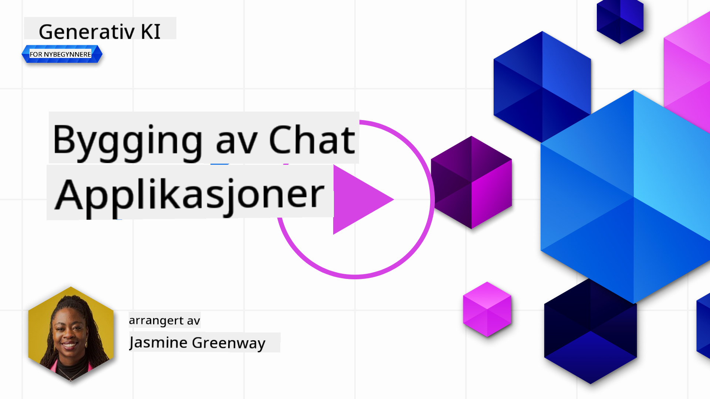
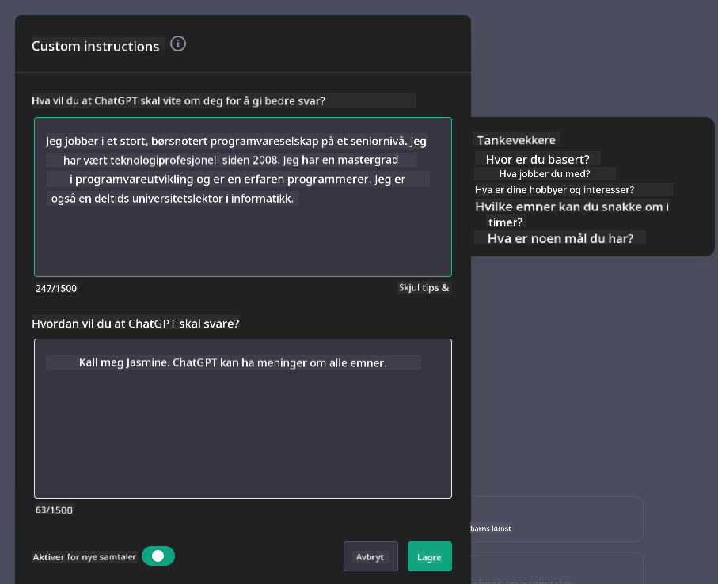
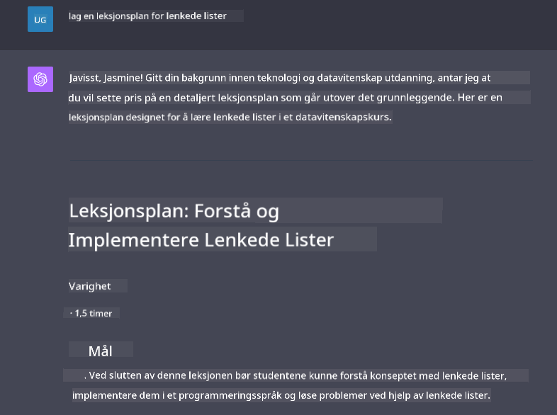

<!--
CO_OP_TRANSLATOR_METADATA:
{
  "original_hash": "ea4bbe640847aafbbba14dae4625e9af",
  "translation_date": "2025-07-09T12:31:51+00:00",
  "source_file": "07-building-chat-applications/README.md",
  "language_code": "no"
}
-->
# Bygge generative AI-drevne chatteapplikasjoner

[](https://aka.ms/gen-ai-lessons7-gh?WT.mc_id=academic-105485-koreyst)

> _(Klikk på bildet over for å se video av denne leksjonen)_

Nå som vi har sett hvordan vi kan bygge tekstgenererende apper, la oss se nærmere på chatteapplikasjoner.

Chatteapplikasjoner har blitt en integrert del av hverdagen vår, og tilbyr mer enn bare en kanal for uformell samtale. De er viktige i kundeservice, teknisk support og til og med avanserte rådgivningssystemer. Det er sannsynlig at du nylig har fått hjelp fra en chatteapplikasjon. Når vi integrerer mer avansert teknologi som generativ AI i disse plattformene, øker både kompleksiteten og utfordringene.

Noen spørsmål vi må få svar på er:

- **Bygge appen**. Hvordan bygger vi effektivt og integrerer sømløst disse AI-drevne applikasjonene for spesifikke bruksområder?
- **Overvåking**. Når applikasjonene er i drift, hvordan kan vi overvåke og sikre at de fungerer på høyeste kvalitetsnivå, både når det gjelder funksjonalitet og etterlevelse av [de seks prinsippene for ansvarlig AI](https://www.microsoft.com/ai/responsible-ai?WT.mc_id=academic-105485-koreyst)?

Ettersom vi beveger oss inn i en tid preget av automatisering og sømløs samhandling mellom mennesker og maskiner, blir det viktig å forstå hvordan generativ AI endrer omfanget, dybden og tilpasningsevnen til chatteapplikasjoner. Denne leksjonen vil undersøke arkitekturens rolle i å støtte disse komplekse systemene, metodene for finjustering for domene-spesifikke oppgaver, og evaluere relevante måleparametere og hensyn for ansvarlig AI-implementering.

## Introduksjon

Denne leksjonen dekker:

- Teknikker for effektiv bygging og integrering av chatteapplikasjoner.
- Hvordan tilpasse og finjustere applikasjoner.
- Strategier og hensyn for effektiv overvåking av chatteapplikasjoner.

## Læringsmål

Etter denne leksjonen skal du kunne:

- Beskrive hensyn ved bygging og integrering av chatteapplikasjoner i eksisterende systemer.
- Tilpasse chatteapplikasjoner for spesifikke bruksområder.
- Identifisere viktige måleparametere og hensyn for effektiv overvåking og opprettholdelse av kvaliteten på AI-drevne chatteapplikasjoner.
- Sikre at chatteapplikasjoner bruker AI på en ansvarlig måte.

## Integrering av generativ AI i chatteapplikasjoner

Å løfte chatteapplikasjoner med generativ AI handler ikke bare om å gjøre dem smartere; det handler om å optimalisere arkitektur, ytelse og brukergrensesnitt for å gi en god brukeropplevelse. Dette innebærer å undersøke arkitektoniske grunnlag, API-integrasjoner og brukergrensesnitt. Denne delen gir deg en helhetlig veiledning for å navigere i disse komplekse områdene, enten du kobler dem til eksisterende systemer eller bygger dem som frittstående plattformer.

Etter denne delen vil du ha kompetansen som trengs for å effektivt bygge og integrere chatteapplikasjoner.

### Chatbot eller chatteapplikasjon?

Før vi går i gang med å bygge chatteapplikasjoner, la oss sammenligne 'chatbots' med 'AI-drevne chatteapplikasjoner', som har ulike roller og funksjoner. En chatbot har som hovedformål å automatisere spesifikke samtaleoppgaver, som å svare på ofte stilte spørsmål eller spore en pakke. Den styres vanligvis av regelbasert logikk eller komplekse AI-algoritmer. I kontrast er en AI-drevet chatteapplikasjon et langt mer omfattende miljø designet for å legge til rette for ulike former for digital kommunikasjon, som tekst-, tale- og videosamtaler mellom mennesker. Dens kjennetegn er integreringen av en generativ AI-modell som simulerer nyanserte, menneskelignende samtaler, og genererer svar basert på et bredt spekter av input og kontekstuelle signaler. En generativ AI-drevet chatteapplikasjon kan delta i åpne diskusjoner, tilpasse seg endrende samtalekontekster og til og med produsere kreative eller komplekse dialoger.

Tabellen under viser hovedforskjellene og likhetene for å hjelpe oss å forstå deres unike roller i digital kommunikasjon.

| Chatbot                               | Generativ AI-drevet chatteapplikasjon |
| ------------------------------------- | -------------------------------------- |
| Oppgavefokusert og regelbasert        | Kontekstbevisst                        |
| Ofte integrert i større systemer      | Kan inneholde én eller flere chatbots  |
| Begrenset til programmerte funksjoner | Inkluderer generative AI-modeller      |
| Spesialiserte og strukturerte interaksjoner | I stand til åpne diskusjoner           |

### Utnytte ferdigbygde funksjoner med SDK-er og API-er

Når du bygger en chatteapplikasjon, er et godt første steg å vurdere hva som allerede finnes. Å bruke SDK-er og API-er for å bygge chatteapplikasjoner er en fordelaktig strategi av flere grunner. Ved å integrere godt dokumenterte SDK-er og API-er posisjonerer du applikasjonen din for langsiktig suksess, med tanke på skalerbarhet og vedlikehold.

- **Fremskynder utviklingsprosessen og reduserer arbeidsmengde**: Å stole på ferdigbygde funksjoner i stedet for å bygge alt selv sparer tid og lar deg fokusere på andre viktige deler av applikasjonen, som forretningslogikk.
- **Bedre ytelse**: Når du bygger funksjonalitet fra bunnen av, vil du etter hvert spørre deg selv "Hvordan skalerer dette? Kan applikasjonen håndtere en plutselig økning i brukere?" Velholdte SDK-er og API-er har ofte innebygde løsninger for slike utfordringer.
- **Enklere vedlikehold**: Oppdateringer og forbedringer er lettere å håndtere, siden de fleste API-er og SDK-er bare krever at du oppdaterer et bibliotek når en ny versjon slippes.
- **Tilgang til banebrytende teknologi**: Ved å bruke modeller som er finjustert og trent på omfattende datasett, får applikasjonen din avanserte naturlige språkferdigheter.

Tilgang til funksjonalitet i en SDK eller API innebærer vanligvis å få tillatelse til å bruke tjenestene, ofte gjennom en unik nøkkel eller autentiseringstoken. Vi vil bruke OpenAI Python Library for å se hvordan dette fungerer. Du kan også prøve det selv i følgende [notatbok for OpenAI](python/oai-assignment.ipynb) eller [notatbok for Azure OpenAI Services](python/aoai-assignment.ipynb) for denne leksjonen.

```python
import os
from openai import OpenAI

API_KEY = os.getenv("OPENAI_API_KEY","")

client = OpenAI(
    api_key=API_KEY
    )

chat_completion = client.chat.completions.create(model="gpt-3.5-turbo", messages=[{"role": "user", "content": "Suggest two titles for an instructional lesson on chat applications for generative AI."}])
```

Eksempelet over bruker GPT-3.5 Turbo-modellen for å fullføre prompten, men merk at API-nøkkelen settes før dette. Du vil få en feil hvis du ikke setter nøkkelen.

## Brukeropplevelse (UX)

Generelle UX-prinsipper gjelder for chatteapplikasjoner, men her er noen ekstra hensyn som blir spesielt viktige på grunn av maskinlæringskomponentene.

- **Mekanisme for å håndtere tvetydighet**: Generative AI-modeller kan av og til gi tvetydige svar. En funksjon som lar brukere be om avklaring kan være nyttig hvis de støter på dette.
- **Bevaring av kontekst**: Avanserte generative AI-modeller kan huske kontekst i en samtale, noe som kan være en viktig ressurs for brukeropplevelsen. Å gi brukerne mulighet til å kontrollere og administrere kontekst forbedrer opplevelsen, men medfører også risiko for lagring av sensitiv informasjon. Hensyn til hvor lenge denne informasjonen lagres, for eksempel ved å innføre en lagringspolicy, kan balansere behovet for kontekst mot personvern.
- **Personalisering**: Med evnen til å lære og tilpasse seg, tilbyr AI-modeller en individuell opplevelse for brukeren. Å skreddersy brukeropplevelsen gjennom funksjoner som brukerprofiler gjør ikke bare at brukeren føler seg forstått, men hjelper også med å finne spesifikke svar, noe som skaper en mer effektiv og tilfredsstillende interaksjon.

Et eksempel på personalisering er "Custom instructions"-innstillingene i OpenAIs ChatGPT. Her kan du gi informasjon om deg selv som kan være viktig kontekst for promptene dine. Her er et eksempel på en tilpasset instruksjon.



Denne "profilen" ber ChatGPT lage en leksjonsplan om lenkede lister. Legg merke til at ChatGPT tar hensyn til at brukeren ønsker en mer grundig leksjonsplan basert på hennes erfaring.



### Microsofts System Message Framework for store språkmodeller

[Microsoft har gitt veiledning](https://learn.microsoft.com/azure/ai-services/openai/concepts/system-message#define-the-models-output-format?WT.mc_id=academic-105485-koreyst) for å skrive effektive systemmeldinger når man genererer svar fra LLM-er, delt inn i 4 områder:

1. Definere hvem modellen er for, samt dens evner og begrensninger.
2. Definere modellens output-format.
3. Gi konkrete eksempler som demonstrerer ønsket oppførsel.
4. Gi ekstra atferdsregler.

### Tilgjengelighet

Uansett om en bruker har syns-, hørsel-, motoriske eller kognitive utfordringer, bør en godt designet chatteapplikasjon være brukbar for alle. Følgende liste viser spesifikke funksjoner som forbedrer tilgjengeligheten for ulike brukerutfordringer.

- **Funksjoner for synshemming**: Høykontrasttemaer og justerbar tekststørrelse, skjermleserkompatibilitet.
- **Funksjoner for hørselshemming**: Tekst-til-tale og tale-til-tekst-funksjoner, visuelle varsler for lydnotifikasjoner.
- **Funksjoner for motoriske utfordringer**: Støtte for tastaturnavigasjon, stemmekommandoer.
- **Funksjoner for kognitive utfordringer**: Forenklede språkvalg.

## Tilpasning og finjustering for domene-spesifikke språkmodeller

Tenk deg en chatteapplikasjon som forstår selskapets sjargong og forutser de spesifikke spørsmålene brukerne ofte stiller. Det finnes et par tilnærminger verdt å nevne:

- **Utnytte DSL-modeller**. DSL står for domain specific language. Du kan bruke en såkalt DSL-modell trent på et spesifikt domene for å forstå dets konsepter og scenarioer.
- **Bruke finjustering**. Finjustering er prosessen med å trene modellen videre med spesifikke data.

## Tilpasning: Bruke en DSL

Å utnytte domene-spesifikke språkmodeller (DSL-modeller) kan øke brukerengasjementet ved å tilby spesialiserte, kontekstrelevante interaksjoner. Det er en modell som er trent eller finjustert for å forstå og generere tekst relatert til et bestemt felt, bransje eller emne. Mulighetene for å bruke en DSL-modell varierer fra å trene en fra bunnen av, til å bruke eksisterende modeller via SDK-er og API-er. Et annet alternativ er finjustering, som innebærer å ta en eksisterende forhåndstrent modell og tilpasse den til et spesifikt domene.

## Tilpasning: Bruke finjustering

Finjustering vurderes ofte når en forhåndstrent modell ikke er tilstrekkelig for et spesialisert domene eller en spesifikk oppgave.

For eksempel er medisinske spørsmål komplekse og krever mye kontekst. Når en medisinsk fagperson stiller en diagnose, baseres det på en rekke faktorer som livsstil eller eksisterende sykdommer, og kan også støtte seg på nyere medisinske publikasjoner for å validere diagnosen. I slike nyanserte situasjoner kan ikke en generell AI-chatapplikasjon være en pålitelig kilde.

### Scenario: en medisinsk applikasjon

Tenk deg en chatteapplikasjon designet for å hjelpe helsepersonell ved å gi raske referanser til behandlingsretningslinjer, legemiddelinteraksjoner eller ferske forskningsresultater.

En generell modell kan være tilstrekkelig for å svare på grunnleggende medisinske spørsmål eller gi generelle råd, men kan slite med følgende:

- **Svært spesifikke eller komplekse tilfeller**. For eksempel kan en nevrolog spørre applikasjonen: "Hva er dagens beste praksis for behandling av medikamentresistent epilepsi hos barn?"
- **Manglende oppdateringer på nyeste forskning**. En generell modell kan ha problemer med å gi et oppdatert svar som inkluderer de siste fremskrittene innen nevrologi og farmakologi.

I slike tilfeller kan finjustering av modellen med et spesialisert medisinsk datasett betydelig forbedre evnen til å håndtere komplekse medisinske spørsmål mer nøyaktig og pålitelig. Dette krever tilgang til et stort og relevant datasett som representerer de domene-spesifikke utfordringene og spørsmålene som må besvares.

## Hensyn for en AI-drevet chatteopplevelse av høy kvalitet

Denne delen skisserer kriteriene for "høykvalitets" chatteapplikasjoner, som inkluderer innsamling av målbare data og etterlevelse av en ramme som bruker AI-teknologi på en ansvarlig måte.

### Viktige måleparametere

For å opprettholde høy ytelse i en applikasjon er det viktig å følge med på nøkkelparametere og hensyn. Disse målingene sikrer ikke bare funksjonaliteten, men vurderer også kvaliteten på AI-modellen og brukeropplevelsen. Nedenfor er en liste over grunnleggende, AI- og brukeropplevelses-måleparametere å ta i betraktning.

| Måleparameter                | Definisjon                                                                                                            | Hensyn for chatutvikler                                               |
| ---------------------------- | --------------------------------------------------------------------------------------------------------------------- | --------------------------------------------------------------------- |
| **Oppetid**                  | Måler hvor lenge applikasjonen er operativ og tilgjengelig for brukere.                                              | Hvordan vil du minimere nedetid?                                      |
| **Responstid**               | Tiden applikasjonen bruker på å svare på en brukers forespørsel.                                                     | Hvordan kan du optimalisere behandlingen for å forbedre responstiden? |
| **Presisjon**                | Forholdet mellom korrekte positive prediksjoner og totalt antall positive prediksjoner.                              | Hvordan vil du validere presisjonen til modellen?                     |
| **Recall (Sensitivitet)**    | Forholdet mellom korrekte positive prediksjoner og det faktiske antallet positive tilfeller.                         | Hvordan vil du måle og forbedre recall?                               |
| **F1-score**                | Det harmoniske gjennomsnittet av presisjon og recall, som balanserer kompromisset mellom begge.                      | Hva er ditt mål for F1-score? Hvordan vil du balansere presisjon og recall? |
| **Perpleksitet**             | Måler hvor godt sannsynlighetsfordelingen modellen predikerer samsvarer med den faktiske datafordelingen.            | Hvordan vil du minimere perpleksitet?                                |
| **Brukertilfredshet**        | Måler brukerens oppfatning av applikasjonen. Ofte innhentet gjennom undersøkelser.                                   | Hvor ofte vil du samle inn tilbakemeldinger? Hvordan vil du tilpasse deg basert på dem? |
| **Feilrate**                 | Hvor ofte modellen gjør feil i forståelse eller output.                                                              | Hvilke strategier har du for å redusere feilrater?                    |
| **Omtreningssykluser**      | Hvor ofte modellen oppdateres for å inkludere nye data og innsikter.                                                | Hvor ofte vil du omtrene modellen? Hva utløser en omtreningssyklus?   |
| **Anomalioppdagelse**       | Verktøy og teknikker for å identifisere uvanlige mønstre som ikke samsvarer med forventet atferd.                      | Hvordan vil du håndtere anomalier?                                         |

### Implementering av Ansvarlig AI-praksis i Chat-applikasjoner

Microsofts tilnærming til Ansvarlig AI har identifisert seks prinsipper som bør styre utvikling og bruk av AI. Nedenfor finner du prinsippene, deres definisjon, og hva en chat-utvikler bør vurdere og hvorfor det er viktig å ta dem på alvor.

| Prinsipper             | Microsofts definisjon                                  | Vurderinger for chat-utvikler                                         | Hvorfor det er viktig                                                                |
| ---------------------- | ----------------------------------------------------- | -------------------------------------------------------------------- | ------------------------------------------------------------------------------------ |
| Rettferdighet          | AI-systemer skal behandle alle mennesker rettferdig. | Sørg for at chat-applikasjonen ikke diskriminerer basert på brukerdata. | For å bygge tillit og inkludering blant brukere; unngår juridiske konsekvenser.      |
| Pålitelighet og sikkerhet | AI-systemer skal fungere pålitelig og sikkert.       | Implementer testing og sikkerhetsmekanismer for å minimere feil og risiko. | Sikrer brukertilfredshet og forhindrer potensiell skade.                             |
| Personvern og sikkerhet | AI-systemer skal være sikre og respektere personvern. | Implementer sterk kryptering og databeskyttelsestiltak.               | For å beskytte sensitiv brukerdata og overholde personvernlovgivning.                |
| Inkludering            | AI-systemer skal styrke alle og engasjere mennesker.  | Design UI/UX som er tilgjengelig og brukervennlig for ulike målgrupper. | Sikrer at et bredere spekter av mennesker kan bruke applikasjonen effektivt.         |
| Åpenhet                | AI-systemer skal være forståelige.                    | Gi tydelig dokumentasjon og forklaring på AI-svar.                    | Brukere stoler mer på et system hvis de forstår hvordan beslutninger tas.            |
| Ansvarlighet           | Mennesker skal holdes ansvarlige for AI-systemer.     | Etabler en klar prosess for revisjon og forbedring av AI-beslutninger. | Legger til rette for kontinuerlig forbedring og korrigerende tiltak ved feil.        |

## Oppgave

Se [assignment](../../../07-building-chat-applications/python) som tar deg gjennom en rekke øvelser fra å kjøre dine første chat-prompt, til å klassifisere og oppsummere tekst og mer. Merk at oppgavene er tilgjengelige på forskjellige programmeringsspråk!

## Flott jobba! Fortsett reisen

Etter å ha fullført denne leksjonen, sjekk ut vår [Generative AI Learning collection](https://aka.ms/genai-collection?WT.mc_id=academic-105485-koreyst) for å fortsette å utvikle din kunnskap om Generativ AI!

Gå videre til Leksjon 8 for å se hvordan du kan begynne med [å bygge søkeapplikasjoner](../08-building-search-applications/README.md?WT.mc_id=academic-105485-koreyst)!

**Ansvarsfraskrivelse**:  
Dette dokumentet er oversatt ved hjelp av AI-oversettelsestjenesten [Co-op Translator](https://github.com/Azure/co-op-translator). Selv om vi streber etter nøyaktighet, vennligst vær oppmerksom på at automatiske oversettelser kan inneholde feil eller unøyaktigheter. Det opprinnelige dokumentet på originalspråket skal anses som den autoritative kilden. For kritisk informasjon anbefales profesjonell menneskelig oversettelse. Vi er ikke ansvarlige for eventuelle misforståelser eller feiltolkninger som oppstår ved bruk av denne oversettelsen.