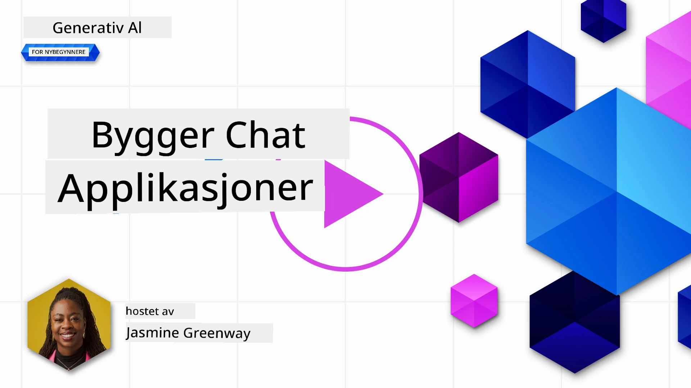
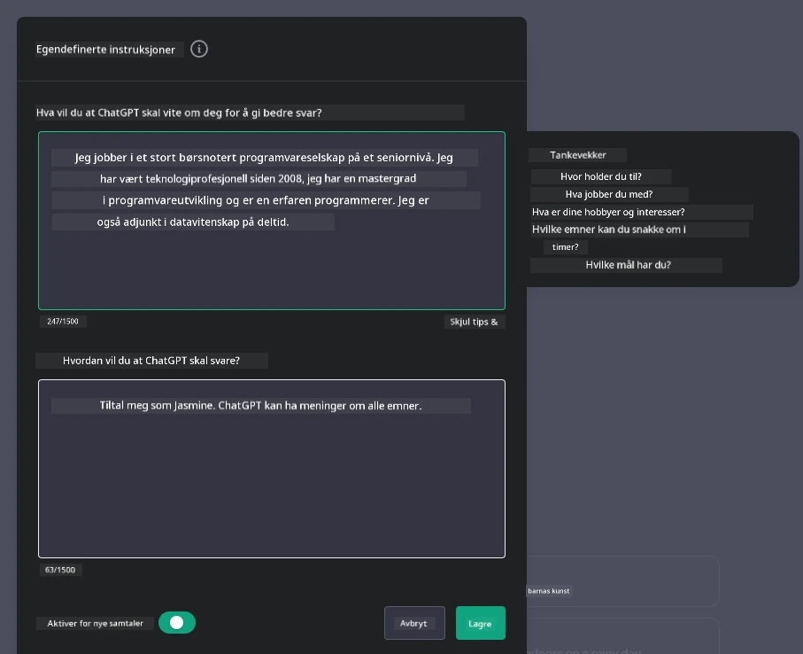
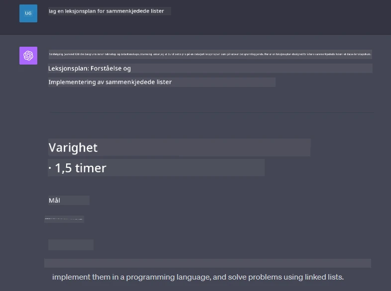

# Bygge generative AI-drevne chatteapplikasjoner

[](https://youtu.be/R9V0ZY1BEQo?si=IHuU-fS9YWT8s4sA)

> _(Klikk på bildet over for å se video av denne leksjonen)_

Nå som vi har sett hvordan vi kan bygge tekstgenereringsapper, la oss se nærmere på chatteapplikasjoner.

Chatteapplikasjoner har blitt integrert i våre daglige liv, og tilbyr mer enn bare en metode for uformell samtale. De er integrerte deler av kundeservice, teknisk støtte, og til og med avanserte rådgivningssystemer. Det er sannsynlig at du ikke så lenge siden har fått hjelp fra en chatteapplikasjon. Når vi integrerer mer avansert teknologi som generativ AI i disse plattformene, øker kompleksiteten, og utfordringene gjør det også.

Noen spørsmål vi må få svar på er:

- **Bygge appen**. Hvordan bygger vi effektivt og sømløst integrerer disse AI-drevne applikasjonene for spesifikke bruksområder?
- **Overvåkning**. Når de er satt i drift, hvordan kan vi overvåke og sikre at applikasjonene opererer på høyest mulig kvalitetsnivå, både når det gjelder funksjonalitet og overholdelse av [de seks prinsippene for ansvarlig AI](https://www.microsoft.com/ai/responsible-ai?WT.mc_id=academic-105485-koreyst)?

Når vi beveger oss videre inn i en tid preget av automatisering og sømløs menneske-maskin-interaksjon, blir det essensielt å forstå hvordan generativ AI forvandler omfanget, dybden og tilpasningsevnen til chatteapplikasjoner. Denne leksjonen vil undersøke arkitekturaspektene som støtter disse komplekse systemene, fordype seg i metodene for finjustering for domene-spesifikke oppgaver, og evaluere målinger og hensyn som er relevante for å sikre ansvarlig AI-implementering.

## Introduksjon

Denne leksjonen dekker:

- Teknikker for effektivt å bygge og integrere chatteapplikasjoner.
- Hvordan bruke tilpasning og finjustering på applikasjoner.
- Strategier og hensyn for effektiv overvåking av chatteapplikasjoner.

## Læringsmål

Ved slutten av denne leksjonen vil du kunne:

- Beskrive hensyn for å bygge og integrere chatteapplikasjoner i eksisterende systemer.
- Tilpasse chatteapplikasjoner for spesifikke brukstilfeller.
- Identifisere viktige målinger og hensyn for effektivt å overvåke og opprettholde kvaliteten på AI-drevne chatteapplikasjoner.
- Sikre at chatteapplikasjoner benytter AI ansvarlig.

## Integrere generativ AI i chatteapplikasjoner

Å heve chatteapplikasjoner med generativ AI handler ikke bare om å gjøre dem smartere; det handler om å optimalisere arkitekturen, ytelsen og brukergrensesnittet for å levere en kvalitet brukeropplevelse. Dette innebærer å undersøke arkitektoniske fundamenter, API-integrasjoner og brukergrensesnitt-hensyn. Denne seksjonen har som mål å tilby deg en omfattende veikart for å navigere i dette komplekse landskapet, enten du knytter dem til eksisterende systemer eller bygger dem som frittstående plattformer.

Ved slutten av denne seksjonen vil du være rustet med ekspertisen som trengs for å effektivt konstruere og inkorporere chatteapplikasjoner.

### Chatbot eller chatteapplikasjon?

Før vi går inn i å bygge chatteapplikasjoner, la oss sammenligne «chatbots» med «AI-drevne chatteapplikasjoner», som tjener ulike roller og funksjonaliteter. En chatbot har hovedsakelig som formål å automatisere spesifikke samtaleoppgaver, som å svare på ofte stilte spørsmål eller spore en pakke. Den styres typisk av regelbasert logikk eller komplekse AI-algoritmer. I kontrast er en AI-drevet chatteapplikasjon et langt mer omfattende miljø designet for å fasilitere ulike former for digital kommunikasjon, som tekst-, tale- og videosamtaler mellom mennesker. Dets kjennetegn er integrasjonen av en generativ AI-modell som simulerer nyanserte, menneskelignende samtaler, og genererer svar basert på et bredt spekter av input og kontekstuelle signaler. En generativ AI-drevet chatteapplikasjon kan delta i åpne diskusjoner, tilpasse seg utviklende samtalekontekster, og til og med produsere kreativ eller kompleks dialog.

Tabellen under skisserer hovedforskjellene og likhetene for å hjelpe oss å forstå deres unike roller i digital kommunikasjon.

| Chatbot                               | Generativ AI-drevet Chatteapplikasjon          |
| ------------------------------------- | ---------------------------------------------- |
| Oppgavefokusert og regelbasert         | Kontekstbevisst                                |
| Ofte integrert i større systemer       | Kan være vert for én eller flere chatboter     |
| Begrenset til programmerte funksjoner  | Inkluderer generative AI-modeller              |
| Spesialiserte og strukturerte interaksjoner | I stand til åpne diskusjoner i mange domener |

### Utnytte ferdigbygde funksjoner med SDK-er og API-er

Når du bygger en chatteapplikasjon, er et godt første steg å vurdere hva som allerede finnes. Å bruke SDK-er og API-er for å bygge chatteapplikasjoner er en fordelaktig strategi av flere grunner. Ved å integrere veldokumenterte SDK-er og API-er posisjonerer du applikasjonen strategisk for langsiktig suksess, og adresserer skalerbarhet- og vedlikeholdsutfordringer.

- **Fremskynder utviklingsprosessen og reduserer overhead:** Å stole på ferdigbygde funksjoner i stedet for den kostbare prosessen med å bygge dem selv, gjør at du kan fokusere på andre aspekter av applikasjonen som du kanskje finner mer viktige, slik som forretningslogikk.
- **Bedre ytelse:** Når du bygger funksjonalitet fra bunnen av, vil du til slutt spørre deg selv «Hvordan skalerer dette? Er denne applikasjonen i stand til å håndtere en plutselig økning av brukere?» Vel vedlikeholdte SDK-er og API-er har ofte innebygde løsninger for slike utfordringer.
- **Enklere vedlikehold:** Oppdateringer og forbedringer er enklere å håndtere siden de fleste API-er og SDK-er bare krever en oppdatering til et bibliotek når en nyere versjon slippes.
- **Tilgang til ny teknologi:** Å utnytte modeller som er finjustert og trent på omfattende datasett gir applikasjonen dine naturlige språkferdigheter.

Tilgang til funksjonalitet i en SDK eller API innebærer vanligvis å få tillatelse til å bruke de leverte tjenestene, ofte gjennom bruk av en unik nøkkel eller autentiseringstoken. Vi vil bruke OpenAI Python-biblioteket for å utforske hvordan dette ser ut. Du kan også prøve det selv i følgende [notatbok for OpenAI](./python/oai-assignment.ipynb?WT.mc_id=academic-105485-koreyst) eller [notatbok for Azure OpenAI-tjenester](./python/aoai-assignment.ipynb?WT.mc_id=academic-105485-koreys) for denne leksjonen.

```python
import os
from openai import OpenAI

API_KEY = os.getenv("OPENAI_API_KEY","")

client = OpenAI(
    api_key=API_KEY
    )

response = client.responses.create(model="gpt-4o-mini", input="Suggest two titles for an instructional lesson on chat applications for generative AI.", store=False)
print(response.output_text)
```

Eksemplet over bruker GPT-4o mini-modellen med Responses API for å fullføre prompten, men merk at API-nøkkelen settes før dette. Du vil få en feil hvis du ikke setter nøkkelen.

## Brukeropplevelse (UX)

Generelle UX-prinsipper gjelder for chatteapplikasjoner, men her er noen ekstra hensyn som blir spesielt viktige på grunn av maskinlæringskomponentene som er involvert.

- **Mekanisme for å håndtere uklarheter:** Generative AI-modeller genererer av og til tvetydige svar. En funksjon som gjør det mulig for brukere å be om avklaring kan være nyttig hvis de støter på dette problemet.
- **Konteksthåndtering:** Avanserte generative AI-modeller har evnen til å huske konteksten innen en samtale, noe som kan være en nødvendighet for brukeropplevelsen. Å gi brukerne mulighet til å kontrollere og administrere kontekst forbedrer opplevelsen, men introduserer risiko for lagring av sensitiv brukerinformasjon. Hensyn til hvor lenge denne informasjonen lagres, som å innføre en lagringspolicy, kan balansere behovet for kontekst mot personvern.
- **Personalisering:** Med evnen til å lære og tilpasse seg, tilbyr AI-modeller en individualisert opplevelse for en bruker. Tilpasning av brukeropplevelsen gjennom funksjoner som brukerprofiler ikke bare gjør at brukeren føler seg forstått, men hjelper også i deres søken etter å finne spesifikke svar, og skaper en mer effektiv og tilfredsstillende interaksjon.

Et slikt eksempel på personalisering er «Custom instructions»-innstillingene i OpenAI's ChatGPT. Den lar deg gi informasjon om deg selv som kan være viktig kontekst for dine prompt. Her er et eksempel på en tilpasset instruksjon.



Denne «profilen» ber ChatGPT lage en leksjonsplan om koblede lister. Merk at ChatGPT tar hensyn til at brukeren kanskje ønsker en mer dyptgående leksjonsplan basert på hennes erfaring.



### Microsofts systemmeldingsrammeverk for store språkmodeller

[Microsoft har gitt veiledning](https://learn.microsoft.com/azure/ai-services/openai/concepts/system-message#define-the-models-output-format?WT.mc_id=academic-105485-koreyst) for å skrive effektive systemmeldinger ved generering av svar fra LLM-er, fordelt på 4 områder:

1. Definere hvem modellen er for, samt dens evner og begrensninger.
2. Definere modellens utdataformat.
3. Gi spesifikke eksempler som demonstrerer modellens tiltenkte oppførsel.
4. Gi ytterligere atferdsmessige retningslinjer.

### Tilgjengelighet

Enten en bruker har syns-, hørsel-, motoriske, eller kognitive funksjonshemninger, bør en godt designet chatteapplikasjon være brukbar for alle. Følgende liste bryter ned spesifikke funksjoner som er rettet mot å forbedre tilgjengeligheten for ulike brukerhemminger.

- **Funksjoner for synshemming:** Temaer med høy kontrast og justerbar tekststørrelse, skjermlesertilpasning.
- **Funksjoner for hørselhemming:** Tekst-til-tale og tale-til-tekst-funksjoner, visuelle tegn for lydvarsler.
- **Funksjoner for motoriske hemninger:** Støtte for tastaturnavigasjon, talekommandoer.
- **Funksjoner for kognitive hemninger:** Forenklede språkvalg.

## Tilpasning og finjustering for domene-spesifikke språkmodeller

Forestill deg en chatteapplikasjon som forstår selskapets sjargong og forutser de spesifikke spørsmålene brukerne ofte har. Det finnes et par tilnærminger som er verdt å nevne:

- **Utnytte DSL-modeller**. DSL står for domenespesifikt språk. Du kan utnytte en såkalt DSL-modell trent på et bestemt domene til å forstå dets konsepter og scenarioer.
- **Bruke finjustering.** Finjustering er prosessen med videre trening av modellen med spesifikke data.

## Tilpasning: Bruke en DSL

Utnyttelse av domenespesifikke språkmodeller (DSL-modeller) kan øke brukerengasjement ved å tilby spesialiserte, kontekstuelt relevante interaksjoner. Det er en modell som er trent eller finjustert for å forstå og generere tekst relatert til et spesifikt felt, industri eller emne. Alternativer for å bruke en DSL-modell kan variere fra å trene en selv fra bunnen av, til å bruke eksisterende gjennom SDK-er og API-er. Et annet alternativ er finjustering, som innebærer å ta en eksisterende forhåndstrent modell og tilpasse den for et bestemt domene.

## Tilpasning: Bruke finjustering

Finjustering vurderes ofte når en forhåndstrent modell ikke strekker til i et spesialisert domene eller spesifikk oppgave.

For eksempel er medisinske spørsmål komplekse og krever mye kontekst. Når en medisinsk fagperson stiller diagnose hos en pasient, baserer det seg på en rekke faktorer som livsstil eller eksisterende tilstander, og kan til og med stole på nyere medisinske tidsskrifter for å bekrefte diagnosen. I slike nyanserte scenarioer kan en AI-chatapplikasjon med generelt formål ikke være en pålitelig kilde.

### Scenario: en medisinsk applikasjon

Tenk på en chatteapplikasjon designet for å hjelpe medisinske fagfolk ved å gi raske referanser til behandlingsretningslinjer, legemiddelinteraksjoner eller nylige forskningsfunn.

En generell modell kan være tilstrekkelig for å svare på grunnleggende medisinske spørsmål eller gi generell rådgivning, men den kan få problemer med følgende:

- **Svært spesifikke eller komplekse saker.** For eksempel kan en nevrolog spørre applikasjonen: «Hva er dagens beste praksis for å håndtere medikamentresistent epilepsi hos pediatriske pasienter?»
- **Manglende nyere fremskritt.** En generell modell kan slite med å gi et oppdatert svar som inkluderer de nyeste fremskrittene innen nevrologi og farmakologi.

I slike tilfeller kan finjustering av modellen med et spesialisert medisinsk datasett betydelig forbedre evnen til å håndtere slike intrikate medisinske forespørsler mer nøyaktig og pålitelig. Dette krever tilgang til et stort og relevant datasett som representerer de domene-spesifikke utfordringene og spørsmålene som må adresseres.

## Hensyn for en høy-kvalitets AI-drevet chatteopplevelse

Denne seksjonen skisserer kriteriene for «høykvalitets» chatteapplikasjoner, som inkluderer innsamling av handlingsrettede målinger og overholdelse av et rammeverk som ansvarlig utnytter AI-teknologi.

### Viktige målinger

For å opprettholde høy kvalitet på ytelsen til en applikasjon, er det viktig å holde oversikt over nøkkelmålinger og hensyn. Disse målingene sikrer ikke bare applikasjonens funksjonalitet, men vurderer også kvaliteten på AI-modellen og brukeropplevelsen. Nedenfor er en liste som dekker grunnleggende, AI- og brukeropplevelsesmålinger som bør vurderes.

| Måling                       | Definisjon                                                                                                            | Hensyn for Chat-utvikler                                                |
| ---------------------------- | --------------------------------------------------------------------------------------------------------------------- | ------------------------------------------------------------------------ |
| **Uptime**                   | Måler tiden applikasjonen er operativ og tilgjengelig for brukere.                                                    | Hvordan vil du minimere nedetid?                                        |
| **Respons-tid**              | Tiden applikasjonen bruker på å svare på en brukers forespørsel.                                                      | Hvordan kan du optimalisere behandlingen av forespørsler for å forbedre responstiden? |
| **Presisjon**                | Forholdet mellom sanne positive prediksjoner og totalt antall positive prediksjoner                                   | Hvordan vil du validere presisjonen til modellen din?                   |
| **Recall (Sensitivitet)**   | Forholdet mellom sanne positive prediksjoner og det faktiske antallet positive                                     | Hvordan vil du måle og forbedre recall?                                 |
| **F1 Score**                 | Det harmoniske gjennomsnittet av presisjon og recall, som balanserer kompromisset mellom begge.                       | Hva er ditt mål for F1 Score? Hvordan vil du balansere presisjon og recall? |
| **Perpleksitet**             | Måler hvor godt sannsynlighetsfordelingen som modellen predikerer stemmer overens med den faktiske datadistribusjonen. | Hvordan vil du minimere perpleksitet?                                   |
| **Brukertilfredshetsmål**    | Måler brukerens oppfatning av applikasjonen. Ofte innsamlet gjennom undersøkelser.                                   | Hvor ofte vil du samle inn brukerfeedback? Hvordan vil du tilpasse ut ifra dette? |
| **Feilrate**                 | Hyppigheten modellen gjør feil i forståelse eller output.                                                             | Hvilke strategier har du for å redusere feilrate?                       |
| **Gjenopplæringssykluser**  | Hvor ofte modellen oppdateres for å innarbeide ny data og innsikter.                                                 | Hvor ofte vil du gjenopplære modellen? Hva utløser en gjenopplæringssyklus? |

| **Avviksdeteksjon**        | Verktøy og teknikker for å identifisere uvanlige mønstre som ikke samsvarer med forventet atferd.                      | Hvordan vil du reagere på avvik?                                         |

### Implementering av Ansvarlige AI-praksiser i Chat-applikasjoner

Microsofts tilnærming til Ansvarlig AI har identifisert seks prinsipper som bør veilede AI-utvikling og -bruk. Nedenfor er prinsippene, deres definisjon, og ting en chat-utvikler bør vurdere og hvorfor de bør ta dem seriøst.

| Prinsipper            | Microsofts definisjon                               | Vurderinger for Chat-utvikler                                         | Hvorfor det er viktig                                                                 |
| --------------------- | -------------------------------------------------- | -------------------------------------------------------------------- | ------------------------------------------------------------------------------------ |
| Rettferdighet         | AI-systemer bør behandle alle mennesker rettferdig.| Sørg for at chat-applikasjonen ikke diskriminerer basert på brukerdata.| For å bygge tillit og inkludering blant brukere; unngår juridiske konsekvenser.       |
| Pålitelighet og Sikkerhet | AI-systemer bør fungere pålitelig og sikkert.       | Implementer testing og fail-safes for å minimere feil og risikoer.   | Sikrer brukertilfredshet og forhindrer potensiell skade.                              |
| Personvern og Sikkerhet| AI-systemer bør være sikre og respektere personvern.| Implementer sterk kryptering og databeskyttelsestiltak.              | For å beskytte sensitiv brukerdata og overholde personvernlovgivning.                |
| Inkludering           | AI-systemer bør styrke alle og engasjere folk.      | Design UI/UX som er tilgjengelig og brukervennlig for ulike målgrupper.| Sikrer at et bredere spekter av mennesker kan bruke applikasjonen effektivt.         |
| Gjennomsiktighet      | AI-systemer bør være forståelige.                   | Gi klar dokumentasjon og begrunnelse for AI-svar.                    | Brukere er mer tilbøyelige til å stole på et system hvis de kan forstå hvordan beslutninger tas. |
| Ansvarlighet          | Folk bør holdes ansvarlige for AI-systemer.         | Etabler en klar prosess for revisjon og forbedring av AI-beslutninger.| Påvirker kontinuerlig forbedring og korrigerende tiltak ved feil.                    |

## Oppgave

Se [oppgave](../../../07-building-chat-applications/python). Den vil guide deg gjennom en serie øvelser fra å kjøre dine første chatteforespørsler, til klassifisering og oppsummering av tekst og mer. Merk at oppgavene er tilgjengelige i forskjellige programmeringsspråk!

## Flott jobb! Fortsett reisen

Etter å ha fullført denne leksjonen, sjekk ut vår [Generative AI Learning collection](https://aka.ms/genai-collection?WT.mc_id=academic-105485-koreyst) for å fortsette å heve din kunnskap om Generativ AI!

Gå videre til Leksjon 8 for å se hvordan du kan starte med [å bygge søkeapplikasjoner](../08-building-search-applications/README.md?WT.mc_id=academic-105485-koreyst)!

---

<!-- CO-OP TRANSLATOR DISCLAIMER START -->
**Ansvarsfraskrivelse**:
Dette dokumentet er oversatt ved hjelp av AI-oversettelsestjenesten [Co-op Translator](https://github.com/Azure/co-op-translator). Selv om vi streber etter nøyaktighet, vær oppmerksom på at automatiske oversettelser kan inneholde feil eller unøyaktigheter. Det opprinnelige dokumentet på originalspråket skal betraktes som den autoritative kilden. For kritisk informasjon anbefales profesjonell menneskelig oversettelse. Vi er ikke ansvarlige for eventuelle misforståelser eller feiltolkninger som oppstår ved bruk av denne oversettelsen.
<!-- CO-OP TRANSLATOR DISCLAIMER END -->