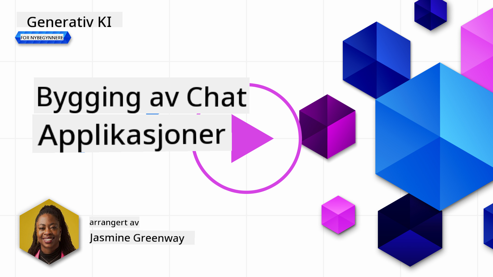
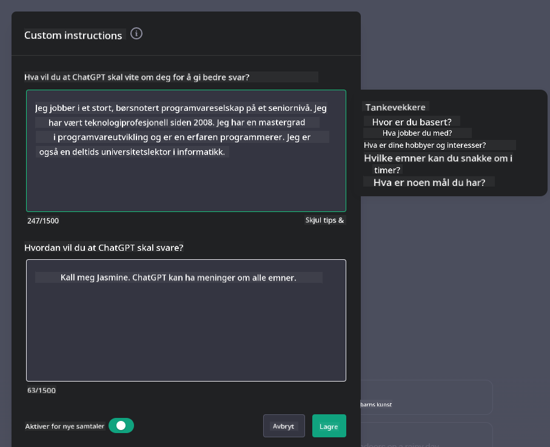
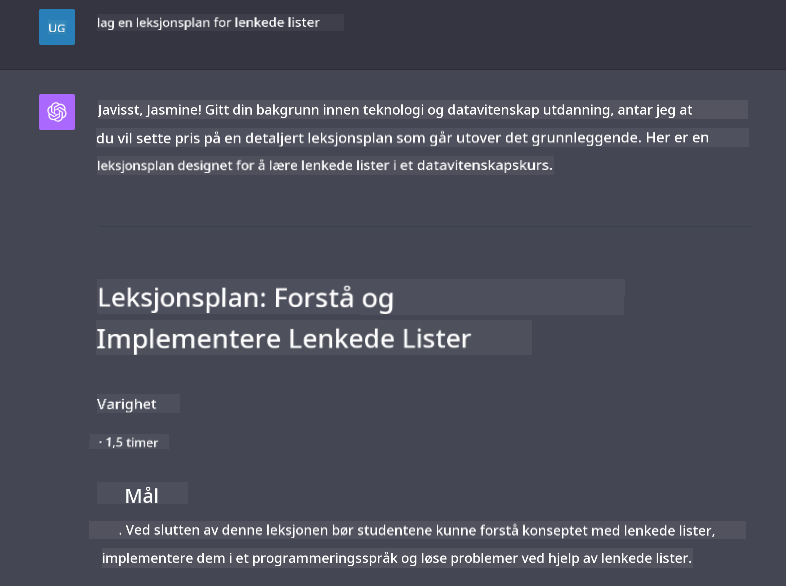

<!--
CO_OP_TRANSLATOR_METADATA:
{
  "original_hash": "ea4bbe640847aafbbba14dae4625e9af",
  "translation_date": "2025-06-25T15:39:03+00:00",
  "source_file": "07-building-chat-applications/README.md",
  "language_code": "no"
}
-->
# Bygge chatapplikasjoner drevet av generativ AI

[](https://aka.ms/gen-ai-lessons7-gh?WT.mc_id=academic-105485-koreyst)

> _(Klikk på bildet over for å se videoen av denne leksjonen)_

Nå som vi har sett hvordan vi kan bygge tekstgenereringsapper, la oss se på chatapplikasjoner.

Chatapplikasjoner har blitt en integrert del av våre daglige liv, og tilbyr mer enn bare et middel for uformell samtale. De er viktige deler av kundeservice, teknisk support, og til og med sofistikerte rådgivningssystemer. Det er sannsynlig at du har fått hjelp fra en chatapplikasjon ikke så lenge siden. Når vi integrerer mer avanserte teknologier som generativ AI i disse plattformene, øker kompleksiteten og dermed også utfordringene.

Noen spørsmål vi trenger svar på er:

- **Bygge appen**. Hvordan bygger vi effektivt og integrerer sømløst disse AI-drevne applikasjonene for spesifikke bruksområder?
- **Overvåking**. Når de er distribuert, hvordan kan vi overvåke og sikre at applikasjonene opererer på høyeste kvalitetsnivå, både når det gjelder funksjonalitet og overholdelse av de [seks prinsippene for ansvarlig AI](https://www.microsoft.com/ai/responsible-ai?WT.mc_id=academic-105485-koreyst)?

Når vi beveger oss videre inn i en tidsalder definert av automatisering og sømløse menneske-maskin-interaksjoner, blir det essensielt å forstå hvordan generativ AI transformerer omfanget, dybden og tilpasningsevnen til chatapplikasjoner. Denne leksjonen vil undersøke aspektene ved arkitektur som støtter disse intrikate systemene, dykke ned i metodene for å finjustere dem for domene-spesifikke oppgaver, og evaluere metrikker og hensyn relevante for å sikre ansvarlig AI-distribusjon.

## Introduksjon

Denne leksjonen dekker:

- Teknikk for effektivt å bygge og integrere chatapplikasjoner.
- Hvordan bruke tilpasning og finjustering på applikasjoner.
- Strategier og hensyn for effektivt å overvåke chatapplikasjoner.

## Læringsmål

Ved slutten av denne leksjonen vil du kunne:

- Beskrive hensyn for å bygge og integrere chatapplikasjoner i eksisterende systemer.
- Tilpasse chatapplikasjoner for spesifikke bruksområder.
- Identifisere nøkkelmålinger og hensyn for effektivt å overvåke og opprettholde kvaliteten på AI-drevne chatapplikasjoner.
- Sikre at chatapplikasjoner utnytter AI ansvarlig.

## Integrere generativ AI i chatapplikasjoner

Å heve chatapplikasjoner gjennom generativ AI handler ikke bare om å gjøre dem smartere; det handler om å optimalisere deres arkitektur, ytelse og brukergrensesnitt for å levere en kvalitetsbrukeropplevelse. Dette innebærer å undersøke de arkitektoniske fundamentene, API-integrasjoner og hensyn til brukergrensesnittet. Denne delen har som mål å tilby deg en omfattende veikart for å navigere i disse komplekse landskapene, enten du kobler dem til eksisterende systemer eller bygger dem som frittstående plattformer.

Ved slutten av denne delen vil du være utstyrt med ekspertisen som trengs for effektivt å konstruere og innlemme chatapplikasjoner.

### Chatbot eller chatapplikasjon?

Før vi dykker inn i byggingen av chatapplikasjoner, la oss sammenligne 'chatbots' mot 'AI-drevne chatapplikasjoner', som tjener forskjellige roller og funksjonaliteter. En chatbots hovedformål er å automatisere spesifikke samtaleoppgaver, som å svare på ofte stilte spørsmål eller spore en pakke. Den styres vanligvis av regelbasert logikk eller komplekse AI-algoritmer. I kontrast er en AI-drevet chatapplikasjon et langt mer omfattende miljø designet for å legge til rette for ulike former for digital kommunikasjon, som tekst, tale og videochatter blant menneskelige brukere. Dens definerende funksjon er integrasjonen av en generativ AI-modell som simulerer nyanserte, menneskelignende samtaler, og genererer svar basert på en rekke innganger og kontekstuelle signaler. En generativ AI-drevet chatapplikasjon kan engasjere seg i åpne diskusjoner, tilpasse seg utviklende samtalekontekster, og til og med produsere kreative eller komplekse dialoger.

Tabellen nedenfor skisserer de viktigste forskjellene og likhetene for å hjelpe oss å forstå deres unike roller i digital kommunikasjon.

| Chatbot                               | Generativ AI-drevet chatapplikasjon   |
| ------------------------------------- | ------------------------------------- |
| Oppgavefokusert og regelbasert        | Kontekstbevisst                       |
| Ofte integrert i større systemer      | Kan være vert for en eller flere chatbots |
| Begrenset til programmerte funksjoner | Inkluderer generative AI-modeller     |
| Spesialiserte og strukturerte interaksjoner | I stand til åpne diskusjoner        |

### Utnytte forhåndsbygde funksjoner med SDK-er og API-er

Når du bygger en chatapplikasjon, er et godt første skritt å vurdere hva som allerede finnes der ute. Å bruke SDK-er og API-er for å bygge chatapplikasjoner er en fordelaktig strategi av flere grunner. Ved å integrere veldokumenterte SDK-er og API-er, posisjonerer du strategisk applikasjonen din for langsiktig suksess, og adresserer skalerbarhet og vedlikeholdskrav.

- **Fremskynder utviklingsprosessen og reduserer overhead**: Ved å stole på forhåndsbygde funksjoner i stedet for den kostbare prosessen med å bygge dem selv, kan du fokusere på andre aspekter av applikasjonen din som du kan finne viktigere, som forretningslogikk.
- **Bedre ytelse**: Når du bygger funksjonalitet fra bunnen av, vil du til slutt spørre deg selv "Hvordan skalerer det? Er denne applikasjonen i stand til å håndtere en plutselig tilstrømning av brukere?" Godt vedlikeholdte SDK-er og API-er har ofte innebygde løsninger for disse bekymringene.
- **Enklere vedlikehold**: Oppdateringer og forbedringer er lettere å håndtere ettersom de fleste API-er og SDK-er bare krever en oppdatering til et bibliotek når en nyere versjon blir utgitt.
- **Tilgang til banebrytende teknologi**: Å utnytte modeller som er finjustert og trent på omfattende datasett gir applikasjonen din naturlige språkevner.

Å få tilgang til funksjonaliteten til en SDK eller API innebærer vanligvis å få tillatelse til å bruke de tilbudte tjenestene, som ofte skjer gjennom bruk av en unik nøkkel eller autentiseringstoken. Vi vil bruke OpenAI Python Library for å utforske hvordan dette ser ut. Du kan også prøve det selv i den følgende [notebook for OpenAI](../../../07-building-chat-applications/python/oai-assignment.ipynb) eller [notebook for Azure OpenAI Services](../../../07-building-chat-applications/python/aoai-assignment.ipynb) for denne leksjonen.

```python
import os
from openai import OpenAI

API_KEY = os.getenv("OPENAI_API_KEY","")

client = OpenAI(
    api_key=API_KEY
    )

chat_completion = client.chat.completions.create(model="gpt-3.5-turbo", messages=[{"role": "user", "content": "Suggest two titles for an instructional lesson on chat applications for generative AI."}])
```

Eksempelet ovenfor bruker GPT-3.5 Turbo-modellen for å fullføre oppfordringen, men merk at API-nøkkelen er satt før du gjør det. Du vil motta en feil hvis du ikke satte nøkkelen.

## Brukeropplevelse (UX)

Generelle UX-prinsipper gjelder for chatapplikasjoner, men her er noen ekstra hensyn som blir spesielt viktige på grunn av maskinlæringskomponentene som er involvert.

- **Mekanisme for å adressere tvetydighet**: Generative AI-modeller genererer av og til tvetydige svar. En funksjon som lar brukere be om avklaring kan være nyttig hvis de kommer over dette problemet.
- **Kontekstbevaring**: Avanserte generative AI-modeller har evnen til å huske kontekst innenfor en samtale, noe som kan være en nødvendig ressurs for brukeropplevelsen. Å gi brukere muligheten til å kontrollere og administrere konteksten forbedrer brukeropplevelsen, men introduserer risikoen for å beholde sensitiv brukerinformasjon. Hensyn for hvor lenge denne informasjonen lagres, for eksempel ved å innføre en lagringspolicy, kan balansere behovet for kontekst mot personvern.
- **Personalisering**: Med evnen til å lære og tilpasse seg, tilbyr AI-modeller en individuell opplevelse for en bruker. Å skreddersy brukeropplevelsen gjennom funksjoner som brukerprofiler gjør ikke bare at brukeren føler seg forstått, men det hjelper også deres søken etter å finne spesifikke svar, og skaper en mer effektiv og tilfredsstillende interaksjon.

Et slikt eksempel på personalisering er "Tilpassede instruksjoner"-innstillingene i OpenAIs ChatGPT. Det lar deg gi informasjon om deg selv som kan være viktig kontekst for dine forespørsler. Her er et eksempel på en tilpasset instruksjon.



Denne "profilen" ber ChatGPT om å lage en leksjonsplan om koblede lister. Legg merke til at ChatGPT tar hensyn til at brukeren kanskje ønsker en mer detaljert leksjonsplan basert på hennes erfaring.



### Microsofts System Message Framework for store språkmodeller

[Microsoft har gitt veiledning](https://learn.microsoft.com/azure/ai-services/openai/concepts/system-message#define-the-models-output-format?WT.mc_id=academic-105485-koreyst) for å skrive effektive systemmeldinger når du genererer svar fra LLM-er, brutt ned i 4 områder:

1. Definere hvem modellen er for, samt dens evner og begrensninger.
2. Definere modellens utdataformat.
3. Gi spesifikke eksempler som demonstrerer modellens tiltenkte oppførsel.
4. Gi ytterligere atferdsmessige retningslinjer.

### Tilgjengelighet

Enten en bruker har syns-, hørsels-, motoriske eller kognitive funksjonshemninger, bør en godt designet chatapplikasjon være brukbar for alle. Følgende liste bryter ned spesifikke funksjoner rettet mot å forbedre tilgjengeligheten for ulike brukerfunksjonshemninger.

- **Funksjoner for synshemning**: Høykontrasttemaer og justerbar tekststørrelse, kompatibilitet med skjermlesere.
- **Funksjoner for hørselshemning**: Tekst-til-tale og tale-til-tekst-funksjoner, visuelle signaler for lydvarsler.
- **Funksjoner for motoriske funksjonshemninger**: Støtte for tastaturnavigasjon, stemmekommandoer.
- **Funksjoner for kognitive funksjonshemninger**: Forenklede språkvalg.

## Tilpasning og finjustering for domene-spesifikke språkmodeller

Tenk deg en chatapplikasjon som forstår selskapets sjargong og forutser de spesifikke spørsmålene brukerne ofte har. Det er et par tilnærminger verdt å nevne:

- **Utnytte DSL-modeller**. DSL står for domene-spesifikt språk. Du kan utnytte en såkalt DSL-modell trent på et spesifikt domene for å forstå dets konsepter og scenarier.
- **Bruke finjustering**. Finjustering er prosessen med å videreutdanne modellen din med spesifikke data.

## Tilpasning: Bruke en DSL

Å utnytte domene-spesifikke språkmodeller (DSL-modeller) kan forbedre brukerengasjementet ved å gi spesialiserte, kontekstrelevante interaksjoner. Det er en modell som er trent eller finjustert for å forstå og generere tekst relatert til et spesifikt felt, industri eller emne. Alternativer for å bruke en DSL-modell kan variere fra å trene en fra bunnen av, til å bruke forhåndseksisterende gjennom SDK-er og API-er. Et annet alternativ er finjustering, som innebærer å ta en eksisterende forhåndstrent modell og tilpasse den for et spesifikt domene.

## Tilpasning: Bruke finjustering

Finjustering vurderes ofte når en forhåndstrent modell ikke strekker til i et spesialisert domene eller en spesifikk oppgave.

For eksempel er medisinske spørsmål komplekse og krever mye kontekst. Når en medisinsk fagperson diagnostiserer en pasient, er det basert på en rekke faktorer som livsstil eller eksisterende forhold, og kan til og med stole på nylige medisinske tidsskrifter for å validere diagnosen sin. I slike nyanserte scenarier kan en generell AI-chatapplikasjon ikke være en pålitelig kilde.

### Scenario: en medisinsk applikasjon

Tenk deg en chatapplikasjon designet for å hjelpe medisinske fagfolk ved å gi raske referanser til behandlingsretningslinjer, legemiddelinteraksjoner eller nylige forskningsfunn.

En generell modell kan være tilstrekkelig for å svare på grunnleggende medisinske spørsmål eller gi generelle råd, men den kan slite med følgende:

- **Svært spesifikke eller komplekse tilfeller**. For eksempel kan en nevrolog spørre applikasjonen: "Hva er de nåværende beste praksisene for å håndtere medisinresistent epilepsi hos pediatriske pasienter?"
- **Mangler nylige fremskritt**. En generell modell kan ha problemer med å gi et aktuelt svar som inkorporerer de nyeste fremskrittene innen nevrologi og farmakologi.

I slike tilfeller kan finjustering av modellen med et spesialisert medisinsk datasett betydelig forbedre dens evne til å håndtere disse intrikate medisinske spørsmålene mer nøyaktig og pålitelig. Dette krever tilgang til et stort og relevant datasett som representerer de domene-spesifikke utfordringene og spørsmålene som må adresseres.

## Hensyn for en høy kvalitet AI-drevet chatopplevelse

Denne delen skisserer kriteriene for "høykvalitets" chatapplikasjoner, som inkluderer innsamling av handlingsbare metrikker og overholdelse av et rammeverk som ansvarlig utnytter AI-teknologi.

### Nøkkelmålinger

For å opprettholde høy ytelse i en applikasjon, er det viktig å holde oversikt over nøkkelmålinger og hensyn. Disse målingene sikrer ikke bare applikasjonens funksjonalitet, men vurderer også kvaliteten på AI-modellen og brukeropplevelsen. Nedenfor er en liste som dekker grunnleggende, AI og brukeropplevelsesmålinger å vurdere.

| Måling                        | Definisjon                                                                                                             | Hensyn for chatutvikler                                                   |
| ----------------------------- | ---------------------------------------------------------------------------------------------------------------------- | ------------------------------------------------------------------------- |
| **Oppetid**                   | Måler tiden applikasjonen er operativ og tilgjengelig for brukere.                                                     | Hvordan vil du minimere nedetid?                                          |
| **Responstid**                | Tiden applikasjonen bruker på å svare på en brukers forespørsel.                                                       | Hvordan kan du optimalisere forespørselsbehandling for å forbedre responstiden? |
| **Presisjon**                 | Forholdet mellom sanne positive prediksjoner og totalt antall positive prediksjoner                                    | Hvordan vil du validere modellens presisjon?                             |
| **Recall (sensitivitet)**     | Forholdet mellom sanne positive prediksjoner og det faktiske antallet positive                                        | Hvordan vil du måle og forbedre recall?                                  |
| **F1 Score**                  | Den harmoniske middelverdien av presisjon og recall, som balanserer kompromisset mellom begge.                         | Hva er din mål-F1-score? Hvordan vil du balansere presisjon og recall?   |
| **Forvirring**                | Måler hvor godt sannsynlighetsfordelingen forutsagt av modellen stemmer overens med den faktiske fordelingen av dataene. | Hvordan vil du minimere forvirring?                                      |
| **Brukertilfredshetsmålinger**| Måler brukerens oppfatning av applikasjonen. Ofte fanget gjennom undersøkelser.                                        | Hvor ofte vil du samle inn brukerfeedback? Hvordan vil du tilpasse deg basert på det? |
| **Feilrate**                  | Raten som modellen gjør feil i forståelse eller utdata.                                                               | Hvilke strategier har du på plass for å redusere feilrater?              |
| **Gjenopplæringssykluser**    | Frekvensen som modellen oppdateres for å innlemme nye data og innsikter.                                              | Hvor ofte vil du gjenopplære modellen? Hva utløser en gjenopplæringssyklus? |
| **Anomalideteksjon**          | Verktøy og teknikker for å identifisere uvanlige mønstre som ikke samsvarer med forventet atferd.                     | Hvordan vil du svare på anomalier?                                       |

### Implementere ansvarlige AI-praksiser i chatapplikasjoner

Microsofts tilnærming til ansvarlig AI har identifisert seks prinsipper som bør veilede AI-utvikling og bruk. Nedenfor er prinsippene, deres definisjon, og ting en chatutvikler bør vurdere og hvorfor de bør ta dem på

**Ansvarsfraskrivelse**:  
Dette dokumentet er oversatt ved hjelp av AI-oversettelsestjenesten [Co-op Translator](https://github.com/Azure/co-op-translator). Selv om vi streber etter nøyaktighet, vennligst vær oppmerksom på at automatiserte oversettelser kan inneholde feil eller unøyaktigheter. Det originale dokumentet på sitt opprinnelige språk bør betraktes som den autoritative kilden. For kritisk informasjon anbefales profesjonell menneskelig oversettelse. Vi er ikke ansvarlige for misforståelser eller feiltolkninger som oppstår ved bruk av denne oversettelsen.