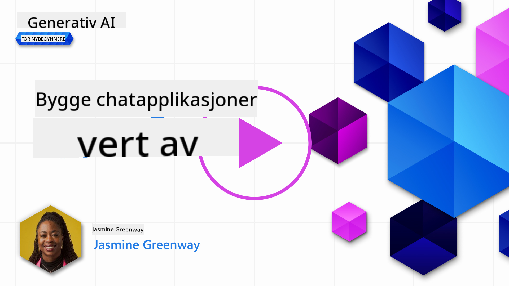
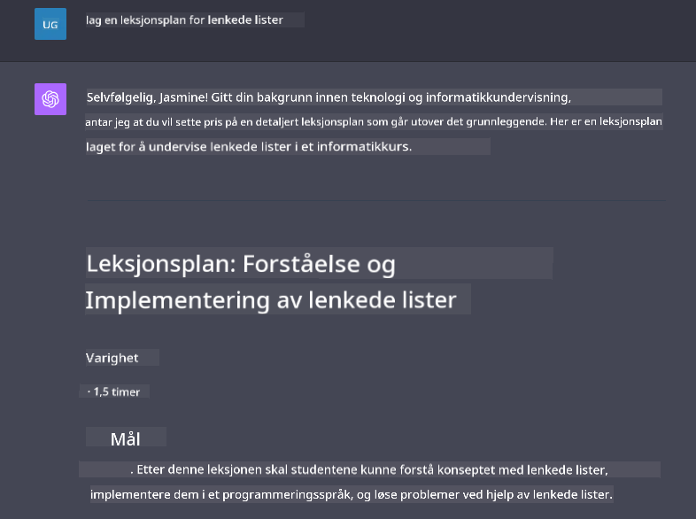

<!--
CO_OP_TRANSLATOR_METADATA:
{
  "original_hash": "a5308963a56cfbad2d73b0fa99fe84b3",
  "translation_date": "2025-10-17T19:23:39+00:00",
  "source_file": "07-building-chat-applications/README.md",
  "language_code": "no"
}
-->
# Bygge generative AI-drevne chatapplikasjoner

[](https://youtu.be/R9V0ZY1BEQo?si=IHuU-fS9YWT8s4sA)

> _(Klikk på bildet ovenfor for å se videoen til denne leksjonen)_

Nå som vi har sett hvordan vi kan bygge tekstgenereringsapplikasjoner, la oss se nærmere på chatapplikasjoner.

Chatapplikasjoner har blitt en integrert del av hverdagen vår og tilbyr mer enn bare en måte å ha uformelle samtaler på. De er viktige verktøy innen kundeservice, teknisk support og til og med sofistikerte rådgivningssystemer. Det er sannsynlig at du har fått hjelp fra en chatapplikasjon ganske nylig. Når vi integrerer mer avanserte teknologier som generativ AI i disse plattformene, øker kompleksiteten, og det gjør også utfordringene.

Noen spørsmål vi må finne svar på er:

- **Bygge applikasjonen**. Hvordan bygger vi effektivt og integrerer disse AI-drevne applikasjonene sømløst for spesifikke bruksområder?
- **Overvåking**. Når de er implementert, hvordan kan vi overvåke og sikre at applikasjonene opererer på høyeste kvalitetsnivå, både når det gjelder funksjonalitet og etterlevelse av [de seks prinsippene for ansvarlig AI](https://www.microsoft.com/ai/responsible-ai?WT.mc_id=academic-105485-koreyst)?

Ettersom vi beveger oss videre inn i en tid preget av automatisering og sømløse interaksjoner mellom mennesker og maskiner, blir det essensielt å forstå hvordan generativ AI transformerer omfanget, dybden og tilpasningsevnen til chatapplikasjoner. Denne leksjonen vil undersøke aspektene ved arkitektur som støtter disse komplekse systemene, dykke ned i metodene for å finjustere dem for oppgavespesifikke behov, og evaluere metrikker og hensyn som er relevante for å sikre ansvarlig AI-implementering.

## Introduksjon

Denne leksjonen dekker:

- Teknikker for effektivt å bygge og integrere chatapplikasjoner.
- Hvordan tilpasse og finjustere applikasjoner.
- Strategier og hensyn for effektivt å overvåke chatapplikasjoner.

## Læringsmål

Ved slutten av denne leksjonen vil du kunne:

- Beskrive hensyn for å bygge og integrere chatapplikasjoner i eksisterende systemer.
- Tilpasse chatapplikasjoner for spesifikke bruksområder.
- Identifisere nøkkelmål og hensyn for effektivt å overvåke og opprettholde kvaliteten på AI-drevne chatapplikasjoner.
- Sikre at chatapplikasjoner bruker AI på en ansvarlig måte.

## Integrere generativ AI i chatapplikasjoner

Å forbedre chatapplikasjoner med generativ AI handler ikke bare om å gjøre dem smartere; det handler om å optimalisere arkitekturen, ytelsen og brukergrensesnittet for å levere en kvalitetsopplevelse. Dette innebærer å undersøke de arkitektoniske grunnlagene, API-integrasjoner og hensyn til brukergrensesnitt. Denne delen har som mål å gi deg en omfattende veiledning for å navigere i disse komplekse landskapene, enten du kobler dem til eksisterende systemer eller bygger dem som frittstående plattformer.

Ved slutten av denne delen vil du være utstyrt med ekspertisen som trengs for effektivt å konstruere og integrere chatapplikasjoner.

### Chatbot eller chatapplikasjon?

Før vi dykker ned i å bygge chatapplikasjoner, la oss sammenligne 'chatbots' med 'AI-drevne chatapplikasjoner', som har ulike roller og funksjoner. En chatbots hovedformål er å automatisere spesifikke samtaleoppgaver, som å svare på ofte stilte spørsmål eller spore en pakke. Den styres vanligvis av regelbasert logikk eller komplekse AI-algoritmer. Derimot er en AI-drevet chatapplikasjon et langt mer omfattende miljø designet for å legge til rette for ulike former for digital kommunikasjon, som tekst-, tale- og videochatter mellom menneskelige brukere. Dens definerende egenskap er integrasjonen av en generativ AI-modell som simulerer nyanserte, menneskelignende samtaler, og genererer svar basert på et bredt spekter av innspill og kontekstuelle ledetråder. En generativ AI-drevet chatapplikasjon kan engasjere seg i åpne samtaler, tilpasse seg utviklende samtalekontekster og til og med produsere kreative eller komplekse dialoger.

Tabellen nedenfor viser de viktigste forskjellene og likhetene for å hjelpe oss med å forstå deres unike roller i digital kommunikasjon.

| Chatbot                               | Generativ AI-drevet chatapplikasjon    |
| ------------------------------------- | -------------------------------------- |
| Oppgavefokusert og regelbasert        | Kontekstbevisst                        |
| Ofte integrert i større systemer      | Kan være vert for én eller flere chatbots |
| Begrenset til programmerte funksjoner | Inkluderer generative AI-modeller      |
| Spesialiserte og strukturerte interaksjoner | Kan ha åpne samtaler                  |

### Utnytte forhåndsbygde funksjoner med SDK-er og API-er

Når du bygger en chatapplikasjon, er et godt første steg å vurdere hva som allerede finnes. Å bruke SDK-er og API-er for å bygge chatapplikasjoner er en fordelaktig strategi av flere grunner. Ved å integrere godt dokumenterte SDK-er og API-er, posisjonerer du applikasjonen din strategisk for langsiktig suksess, og adresserer bekymringer rundt skalerbarhet og vedlikehold.

- **Fremskynder utviklingsprosessen og reduserer kostnader**: Å stole på forhåndsbygde funksjoner i stedet for den kostbare prosessen med å bygge dem selv lar deg fokusere på andre aspekter av applikasjonen som du kanskje finner viktigere, som forretningslogikk.
- **Bedre ytelse**: Når du bygger funksjonalitet fra bunnen av, vil du til slutt spørre deg selv "Hvordan skalerer dette? Er denne applikasjonen i stand til å håndtere en plutselig økning i brukere?" Velholdte SDK-er og API-er har ofte innebygde løsninger for disse bekymringene.
- **Enklere vedlikehold**: Oppdateringer og forbedringer er enklere å administrere ettersom de fleste API-er og SDK-er bare krever en oppdatering av et bibliotek når en nyere versjon blir utgitt.
- **Tilgang til banebrytende teknologi**: Å utnytte modeller som er finjustert og trent på omfattende datasett gir applikasjonen din naturlige språkfunksjoner.

Tilgang til funksjonaliteten til en SDK eller API innebærer vanligvis å få tillatelse til å bruke de tilgjengelige tjenestene, ofte gjennom bruk av en unik nøkkel eller autentiseringstoken. Vi bruker OpenAI Python Library for å utforske hvordan dette ser ut. Du kan også prøve det selv i følgende [notebook for OpenAI](./python/oai-assignment.ipynb?WT.mc_id=academic-105485-koreyst) eller [notebook for Azure OpenAI Services](./python/aoai-assignment.ipynb?WT.mc_id=academic-105485-koreys) for denne leksjonen.

```python
import os
from openai import OpenAI

API_KEY = os.getenv("OPENAI_API_KEY","")

client = OpenAI(
    api_key=API_KEY
    )

chat_completion = client.chat.completions.create(model="gpt-3.5-turbo", messages=[{"role": "user", "content": "Suggest two titles for an instructional lesson on chat applications for generative AI."}])
```

Eksempelet ovenfor bruker GPT-3.5 Turbo-modellen for å fullføre prompten, men merk at API-nøkkelen er satt før dette. Du vil få en feil hvis du ikke setter nøkkelen.

## Brukeropplevelse (UX)

Generelle UX-prinsipper gjelder for chatapplikasjoner, men her er noen ekstra hensyn som blir spesielt viktige på grunn av maskinlæringskomponentene som er involvert.

- **Mekanisme for å håndtere tvetydighet**: Generative AI-modeller genererer av og til tvetydige svar. En funksjon som lar brukere be om avklaring kan være nyttig hvis de støter på dette problemet.
- **Kontekstbevaring**: Avanserte generative AI-modeller har evnen til å huske kontekst innen en samtale, noe som kan være en nødvendig ressurs for brukeropplevelsen. Å gi brukere muligheten til å kontrollere og administrere kontekst forbedrer brukeropplevelsen, men introduserer risikoen for å beholde sensitiv brukerinformasjon. Hensyn til hvor lenge denne informasjonen lagres, som å innføre en lagringspolicy, kan balansere behovet for kontekst mot personvern.
- **Personalisering**: Med evnen til å lære og tilpasse seg, tilbyr AI-modeller en individuell opplevelse for en bruker. Å skreddersy brukeropplevelsen gjennom funksjoner som brukerprofiler gjør ikke bare at brukeren føler seg forstått, men hjelper også med å finne spesifikke svar, og skaper en mer effektiv og tilfredsstillende interaksjon.

Et eksempel på personalisering er innstillingen "Custom instructions" i OpenAIs ChatGPT. Den lar deg gi informasjon om deg selv som kan være viktig kontekst for dine forespørsler. Her er et eksempel på en tilpasset instruksjon.


Denne "profilen" ber ChatGPT om å lage en leksjonsplan om lenkelister. Legg merke til at ChatGPT tar hensyn til at brukeren kanskje ønsker en mer detaljert leksjonsplan basert på hennes erfaring.



### Microsofts systemmeldingsrammeverk for store språkmodeller

[Microsoft har gitt veiledning](https://learn.microsoft.com/azure/ai-services/openai/concepts/system-message#define-the-models-output-format?WT.mc_id=academic-105485-koreyst) for å skrive effektive systemmeldinger når man genererer svar fra LLM-er, delt inn i 4 områder:

1. Definere hvem modellen er for, samt dens evner og begrensninger.
2. Definere modellens utdataformat.
3. Gi spesifikke eksempler som demonstrerer ønsket oppførsel av modellen.
4. Gi ytterligere atferdsmessige retningslinjer.

### Tilgjengelighet

Enten en bruker har syns-, hørsels-, motoriske eller kognitive utfordringer, bør en godt designet chatapplikasjon være brukbar for alle. Listen nedenfor bryter ned spesifikke funksjoner som er rettet mot å forbedre tilgjengeligheten for ulike brukerutfordringer.

- **Funksjoner for synshemmede**: Høykontrast-temaer og justerbar tekst, kompatibilitet med skjermlesere.
- **Funksjoner for hørselshemmede**: Tekst-til-tale og tale-til-tekst-funksjoner, visuelle varsler for lydmeldinger.
- **Funksjoner for motoriske utfordringer**: Støtte for tastaturnavigasjon, stemmekommandoer.
- **Funksjoner for kognitive utfordringer**: Forenklede språkvalg.

## Tilpasning og finjustering for domenespesifikke språkmodeller

Tenk deg en chatapplikasjon som forstår din bedrifts sjargong og forutser de spesifikke spørsmålene brukerbasen din ofte har. Det finnes et par tilnærminger som er verdt å nevne:

- **Utnytte DSL-modeller**. DSL står for domenespesifikt språk. Du kan utnytte en såkalt DSL-modell trent på et spesifikt domene for å forstå dets konsepter og scenarier.
- **Utføre finjustering**. Finjustering er prosessen med å trene modellen videre med spesifikke data.

## Tilpasning: Bruke en DSL

Å utnytte domenespesifikke språkmodeller (DSL-modeller) kan forbedre brukerengasjementet ved å tilby spesialiserte, kontekstrelevante interaksjoner. Det er en modell som er trent eller finjustert for å forstå og generere tekst relatert til et spesifikt felt, en industri eller et emne. Alternativer for å bruke en DSL-modell kan variere fra å trene en fra bunnen av til å bruke forhåndseksisterende modeller gjennom SDK-er og API-er. Et annet alternativ er finjustering, som innebærer å ta en eksisterende forhåndstrent modell og tilpasse den for et spesifikt domene.

## Tilpasning: Utføre finjustering

Finjustering vurderes ofte når en forhåndstrent modell ikke er tilstrekkelig i et spesialisert domene eller for en spesifikk oppgave.

For eksempel er medisinske spørsmål komplekse og krever mye kontekst. Når en medisinsk fagperson stiller en diagnose, er det basert på en rekke faktorer som livsstil eller eksisterende tilstander, og kan til og med avhenge av nylige medisinske tidsskrifter for å validere diagnosen. I slike nyanserte scenarier kan en generisk AI-chatapplikasjon ikke være en pålitelig kilde.

### Scenario: en medisinsk applikasjon

Tenk deg en chatapplikasjon designet for å hjelpe medisinske fagpersoner ved å gi raske referanser til behandlingsretningslinjer, legemiddelinteraksjoner eller nylige forskningsfunn.

En generisk modell kan være tilstrekkelig for å svare på grunnleggende medisinske spørsmål eller gi generell rådgivning, men den kan ha utfordringer med følgende:

- **Svært spesifikke eller komplekse tilfeller**. For eksempel kan en nevrolog spørre applikasjonen: "Hva er de nåværende beste praksisene for behandling av medikamentresistent epilepsi hos barn?"
- **Manglende oppdatering på nyere fremskritt**. En generisk modell kan ha problemer med å gi et aktuelt svar som inkluderer de nyeste fremskrittene innen nevrologi og farmakologi.

I slike tilfeller kan finjustering av modellen med et spesialisert medisinsk datasett betydelig forbedre dens evne til å håndtere disse intrikate medisinske forespørslene mer nøyaktig og pålitelig. Dette krever tilgang til et stort og relevant datasett som representerer de domenespesifikke utfordringene og spørsmålene som må adresseres.

## Hensyn for en høykvalitets AI-drevet chatopplevelse

Denne delen skisserer kriteriene for "høykvalitets" chatapplikasjoner, som inkluderer innsamling av handlingsbare metrikker og etterlevelse av et rammeverk som ansvarlig utnytter AI-teknologi.

### Nøkkelmål

For å opprettholde høy ytelse i en applikasjon, er det essensielt å holde oversikt over nøkkelmål og hensyn. Disse målingene sikrer ikke bare applikasjonens funksjonalitet, men vurderer også kvaliteten på AI-modellen og brukeropplevelsen. Nedenfor er en liste som dekker grunnleggende, AI- og brukeropplevelsesmål å vurdere.

| Mål                            | Definisjon                                                                                                           | Hensyn for chatutvikler                                                  |
| ------------------------------ | -------------------------------------------------------------------------------------------------------------------- | ------------------------------------------------------------------------ |
| **Oppetid**                    | Måler tiden applikasjonen er operativ og tilgjengelig for brukere.                                                   | Hvordan vil du minimere nedetid?                                         |
| **Responstid**                 | Tiden det tar for applikasjonen å svare på en brukers forespørsel.                                                   | Hvordan kan du optimalisere forespørselsbehandlingen for å forbedre responstiden? |
| **Presisjon**                  | Forholdet mellom sanne positive prediksjoner og totalt antall positive prediksjoner.                                 | Hvordan vil du validere modellens presisjon?                             |
| **Recall (Sensitivitet)**      | Forholdet mellom sanne positive prediksjoner og det faktiske antallet positive.                                      | Hvordan vil du måle og forbedre recall?                                  |
| **F1-score**                   | Det harmoniske gjennomsnittet av presisjon og recall, som balanserer avveiningen mellom begge.                       | Hva er din mål-F1-score? Hvordan vil du balansere presisjon og recall?   |
| **Perpleksitet**               | Måler hvor godt sannsynlighetsfordelingen forutsagt av modellen samsvarer med den faktiske fordelingen av dataene.   | Hvordan vil du minimere perpleksitet?                                    |
| **Brukertilfredshetsmål**      | Måler brukerens oppfatning av applikasjonen. Ofte fanget opp gjennom undersøkelser.                                  | Hvor ofte vil du samle inn brukerfeedback? Hvordan vil du tilpasse deg basert på den? |
| **Feilrate**                   | Raten modellen gjør feil i forståelse eller utdata.                                                                 | Hvilke strategier har du for å redusere feilrater?                       |
| **Omlæringssykluser**          | Hyppigheten som modellen oppdateres for å inkludere nye data og innsikter.                                          | Hvor ofte vil du trene modellen på nytt? Hva utløser en omlæringssyklus? |
| **Anomalideteksjon**         | Verktøy og teknikker for å identifisere uvanlige mønstre som ikke samsvarer med forventet oppførsel.                        | Hvordan vil du håndtere anomalier?                                        |

### Implementering av ansvarlige AI-praksiser i chat-applikasjoner

Microsofts tilnærming til ansvarlig AI har identifisert seks prinsipper som bør veilede utvikling og bruk av AI. Nedenfor er prinsippene, deres definisjon, og ting en chat-utvikler bør vurdere samt hvorfor de er viktige.

| Prinsipper             | Microsofts definisjon                                | Vurderinger for chat-utvikler                                      | Hvorfor det er viktig                                                                     |
| ---------------------- | ----------------------------------------------------- | ------------------------------------------------------------------ | -------------------------------------------------------------------------------------- |
| Rettferdighet          | AI-systemer bør behandle alle mennesker rettferdig.   | Sørg for at chat-applikasjonen ikke diskriminerer basert på brukerdata. | For å bygge tillit og inkludering blant brukere; unngår juridiske konsekvenser.         |
| Pålitelighet og sikkerhet | AI-systemer bør fungere pålitelig og trygt.          | Implementer testing og sikkerhetsmekanismer for å minimere feil og risiko. | Sikrer brukertilfredshet og forhindrer potensielle skader.                              |
| Personvern og sikkerhet | AI-systemer bør være sikre og respektere personvern.  | Implementer sterk kryptering og tiltak for databeskyttelse.        | For å beskytte sensitiv brukerdata og overholde personvernlovgivning.                  |
| Inkludering            | AI-systemer bør styrke alle og engasjere mennesker.   | Design UI/UX som er tilgjengelig og brukervennlig for ulike målgrupper. | Sikrer at et bredt spekter av mennesker kan bruke applikasjonen effektivt.             |
| Transparens            | AI-systemer bør være forståelige.                     | Gi tydelig dokumentasjon og forklaringer for AI-responser.         | Brukere er mer tilbøyelige til å stole på et system hvis de forstår hvordan beslutninger tas. |
| Ansvarlighet           | Mennesker bør være ansvarlige for AI-systemer.        | Etabler en klar prosess for revisjon og forbedring av AI-beslutninger. | Muliggjør kontinuerlig forbedring og korrigerende tiltak ved feil.                      |

## Oppgave

Se [oppgave](../../../07-building-chat-applications/python). Den vil ta deg gjennom en serie øvelser fra å kjøre dine første chat-forespørsler, til å klassifisere og oppsummere tekst og mer. Merk at oppgavene er tilgjengelige på forskjellige programmeringsspråk!

## Flott arbeid! Fortsett reisen

Etter å ha fullført denne leksjonen, sjekk ut vår [Generative AI Learning-samling](https://aka.ms/genai-collection?WT.mc_id=academic-105485-koreyst) for å fortsette å utvikle din kunnskap om generativ AI!

Gå videre til Leksjon 8 for å se hvordan du kan begynne [å bygge søkeapplikasjoner](../08-building-search-applications/README.md?WT.mc_id=academic-105485-koreyst)!

---

**Ansvarsfraskrivelse**:  
Dette dokumentet er oversatt ved hjelp av AI-oversettelsestjenesten [Co-op Translator](https://github.com/Azure/co-op-translator). Selv om vi streber etter nøyaktighet, vær oppmerksom på at automatiserte oversettelser kan inneholde feil eller unøyaktigheter. Det originale dokumentet på sitt opprinnelige språk bør anses som den autoritative kilden. For kritisk informasjon anbefales profesjonell menneskelig oversettelse. Vi er ikke ansvarlige for misforståelser eller feiltolkninger som oppstår ved bruk av denne oversettelsen.