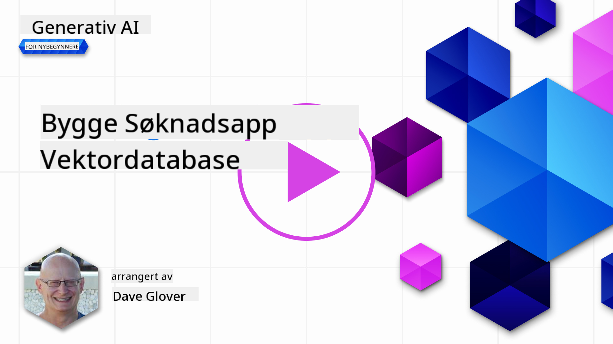
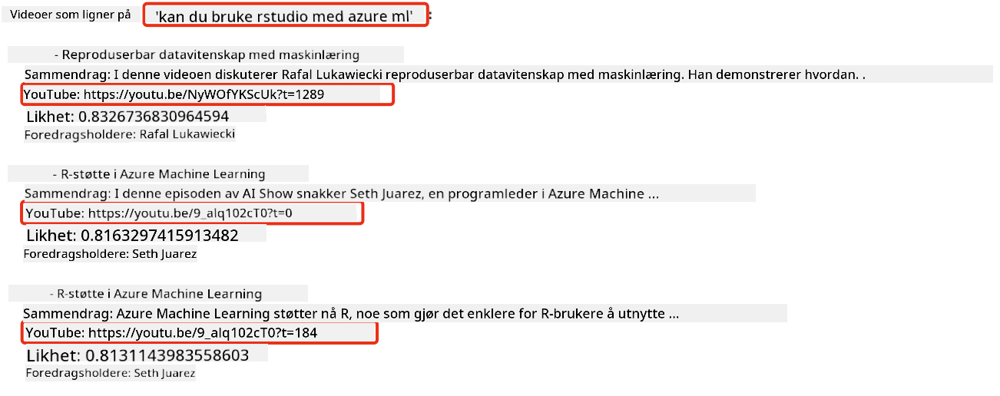
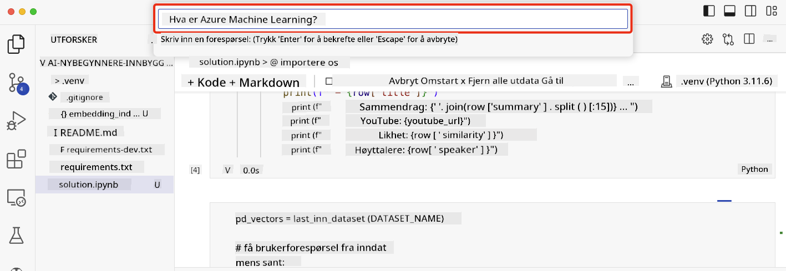

<!--
CO_OP_TRANSLATOR_METADATA:
{
  "original_hash": "d46aad0917a1a342d613e2c13d457da5",
  "translation_date": "2025-06-25T16:32:25+00:00",
  "source_file": "08-building-search-applications/README.md",
  "language_code": "no"
}
-->
# Bygge en søkeapplikasjon

[](https://aka.ms/gen-ai-lesson8-gh?WT.mc_id=academic-105485-koreyst)

> > _Klikk på bildet ovenfor for å se videoen av denne leksjonen_

Det er mer til LLM-er enn chatbots og tekstgenerering. Det er også mulig å bygge søkeapplikasjoner ved hjelp av Embeddings. Embeddings er numeriske representasjoner av data, også kjent som vektorer, og kan brukes til semantisk søk i data.

I denne leksjonen skal du bygge en søkeapplikasjon for vår utdanningsstartup. Vår startup er en ideell organisasjon som tilbyr gratis utdanning til studenter i utviklingsland. Startuppen vår har et stort antall YouTube-videoer som studentene kan bruke for å lære om AI. Startuppen vår ønsker å bygge en søkeapplikasjon som lar studentene søke etter en YouTube-video ved å skrive inn et spørsmål.

For eksempel kan en student skrive inn 'Hva er Jupyter Notebooks?' eller 'Hva er Azure ML', og søkeapplikasjonen vil returnere en liste over YouTube-videoer som er relevante for spørsmålet, og enda bedre, søkeapplikasjonen vil returnere en lenke til stedet i videoen hvor svaret på spørsmålet er.

## Introduksjon

I denne leksjonen vil vi dekke:

- Semantisk vs nøkkelordssøk.
- Hva er tekst-embeddings.
- Lage en tekst-embeddings indeks.
- Søke i en tekst-embeddings indeks.

## Læringsmål

Etter å ha fullført denne leksjonen, vil du kunne:

- Skille mellom semantisk og nøkkelordssøk.
- Forklare hva tekst-embeddings er.
- Lage en applikasjon ved hjelp av embeddings for å søke etter data.

## Hvorfor bygge en søkeapplikasjon?

Å lage en søkeapplikasjon vil hjelpe deg å forstå hvordan du bruker embeddings for å søke etter data. Du vil også lære hvordan du bygger en søkeapplikasjon som kan brukes av studenter for å finne informasjon raskt.

Leksjonen inkluderer en embedding-indeks av YouTube-transkriptene for Microsoft [AI Show](https://www.youtube.com/playlist?list=PLlrxD0HtieHi0mwteKBOfEeOYf0LJU4O1) YouTube-kanal. AI Show er en YouTube-kanal som lærer deg om AI og maskinlæring. Embedding-indeksen inneholder embeddings for hver av YouTube-transkriptene frem til okt 2023. Du vil bruke embedding-indeksen for å bygge en søkeapplikasjon for vår startup. Søkeapplikasjonen returnerer en lenke til stedet i videoen hvor svaret på spørsmålet er. Dette er en flott måte for studenter å finne informasjonen de trenger raskt.

Følgende er et eksempel på en semantisk forespørsel for spørsmålet 'kan du bruke rstudio med azure ml?'. Sjekk ut YouTube-url-en, du vil se at url-en inneholder et tidsstempel som tar deg til stedet i videoen hvor svaret på spørsmålet er.



## Hva er semantisk søk?

Nå lurer du kanskje på, hva er semantisk søk? Semantisk søk er en søketeknikk som bruker semantikken, eller betydningen, av ordene i en forespørsel for å returnere relevante resultater.

Her er et eksempel på et semantisk søk. La oss si at du var på utkikk etter å kjøpe en bil, du kan søke etter 'min drømmebil', semantisk søk forstår at du ikke `dreaming` om en bil, men snarere ser etter å kjøpe din `ideal` bil. Semantisk søk forstår intensjonen din og returnerer relevante resultater. Alternativet er `keyword search` som bokstavelig talt ville søkt etter drømmer om biler og ofte returnert irrelevante resultater.

## Hva er tekst-embeddings?

[Text embeddings](https://en.wikipedia.org/wiki/Word_embedding?WT.mc_id=academic-105485-koreyst) er en tekstrepresentasjonsteknikk brukt i [naturlig språkbehandling](https://en.wikipedia.org/wiki/Natural_language_processing?WT.mc_id=academic-105485-koreyst). Tekst-embeddings er semantiske numeriske representasjoner av tekst. Embeddings brukes til å representere data på en måte som er lett for en maskin å forstå. Det finnes mange modeller for å bygge tekst-embeddings, i denne leksjonen vil vi fokusere på å generere embeddings ved hjelp av OpenAI Embedding Model.

Her er et eksempel, tenk deg at følgende tekst er i et transkript fra en av episodene på AI Show YouTube-kanal:

```text
Today we are going to learn about Azure Machine Learning.
```

Vi ville sendt teksten til OpenAI Embedding API og den ville returnert følgende embedding bestående av 1536 tall også kjent som en vektor. Hvert tall i vektoren representerer et annet aspekt av teksten. For korthets skyld, her er de første 10 tallene i vektoren.

```python
[-0.006655829958617687, 0.0026128944009542465, 0.008792596869170666, -0.02446001023054123, -0.008540431968867779, 0.022071078419685364, -0.010703742504119873, 0.003311325330287218, -0.011632772162556648, -0.02187200076878071, ...]
```

## Hvordan opprettes embedding-indeksen?

Embedding-indeksen for denne leksjonen ble opprettet med en serie Python-skript. Du finner skriptene sammen med instruksjoner i [README](./scripts/README.md?WT.mc_id=academic-105485-koreyst) i 'scripts'-mappen for denne leksjonen. Du trenger ikke kjøre disse skriptene for å fullføre denne leksjonen, ettersom embedding-indeksen er gitt til deg.

Skriptene utfører følgende operasjoner:

1. Transkriptet for hver YouTube-video i [AI Show](https://www.youtube.com/playlist?list=PLlrxD0HtieHi0mwteKBOfEeOYf0LJU4O1)-spillelisten lastes ned.
2. Ved hjelp av [OpenAI-funksjoner](https://learn.microsoft.com/azure/ai-services/openai/how-to/function-calling?WT.mc_id=academic-105485-koreyst), gjøres det et forsøk på å trekke ut talernavnet fra de første 3 minuttene av YouTube-transkriptet. Talernavnet for hver video lagres i embedding-indeksen kalt `embedding_index_3m.json`.
3. Transkriptteksten deles deretter opp i **3 minutters tekstsegmenter**. Segmentet inkluderer omtrent 20 ord overlappende fra neste segment for å sikre at embedding for segmentet ikke kuttes av og for å gi bedre søkekontekst.
4. Hvert tekstsegment sendes deretter til OpenAI Chat API for å oppsummere teksten til 60 ord. Sammendraget lagres også i embedding-indeksen `embedding_index_3m.json`.
5. Til slutt sendes segmentteksten til OpenAI Embedding API. Embedding API returnerer en vektor på 1536 tall som representerer den semantiske betydningen av segmentet. Segmentet sammen med OpenAI embedding-vektoren lagres i en embedding-indeks `embedding_index_3m.json`.

### Vektordatabaser

For leksjonens enkelhet er embedding-indeksen lagret i en JSON-fil kalt `embedding_index_3m.json` og lastet inn i en Pandas DataFrame. Imidlertid, i produksjon, ville embedding-indeksen bli lagret i en vektordatabase som [Azure Cognitive Search](https://learn.microsoft.com/training/modules/improve-search-results-vector-search?WT.mc_id=academic-105485-koreyst), [Redis](https://cookbook.openai.com/examples/vector_databases/redis/readme?WT.mc_id=academic-105485-koreyst), [Pinecone](https://cookbook.openai.com/examples/vector_databases/pinecone/readme?WT.mc_id=academic-105485-koreyst), [Weaviate](https://cookbook.openai.com/examples/vector_databases/weaviate/readme?WT.mc_id=academic-105485-koreyst), for å nevne noen.

## Forstå kosinuslikhet

Vi har lært om tekst-embeddings, neste steg er å lære hvordan man bruker tekst-embeddings for å søke etter data og spesielt finne de mest lignende embeddings til en gitt forespørsel ved hjelp av kosinuslikhet.

### Hva er kosinuslikhet?

Kosinuslikhet er et mål på likhet mellom to vektorer, du vil også høre dette referert til som `nearest neighbor search`. For å utføre et kosinuslikhetssøk må du _vektorisere_ for _forespørsels_tekst ved hjelp av OpenAI Embedding API. Beregn deretter _kosinuslikheten_ mellom forespørselsvektoren og hver vektor i embedding-indeksen. Husk, embedding-indeksen har en vektor for hver YouTube-transkripttekstsegment. Til slutt sorteres resultatene etter kosinuslikhet og tekstsegmentene med høyest kosinuslikhet er de mest lignende forespørselen.

Fra et matematisk perspektiv måler kosinuslikhet kosinus til vinkelen mellom to vektorer projisert i et flerdimensjonalt rom. Denne målingen er gunstig, fordi hvis to dokumenter er langt fra hverandre etter euklidisk avstand på grunn av størrelse, kan de fortsatt ha en mindre vinkel mellom seg og derfor høyere kosinuslikhet. For mer informasjon om kosinuslikhetsligninger, se [Kosinuslikhet](https://en.wikipedia.org/wiki/Cosine_similarity?WT.mc_id=academic-105485-koreyst).

## Bygge din første søkeapplikasjon

Neste, vi skal lære hvordan man bygger en søkeapplikasjon ved hjelp av embeddings. Søkeapplikasjonen vil tillate studenter å søke etter en video ved å skrive inn et spørsmål. Søkeapplikasjonen vil returnere en liste over videoer som er relevante for spørsmålet. Søkeapplikasjonen vil også returnere en lenke til stedet i videoen hvor svaret på spørsmålet er.

Denne løsningen ble bygget og testet på Windows 11, macOS og Ubuntu 22.04 ved hjelp av Python 3.10 eller senere. Du kan laste ned Python fra [python.org](https://www.python.org/downloads/?WT.mc_id=academic-105485-koreyst).

## Oppgave - bygge en søkeapplikasjon, for å gjøre det mulig for studenter

Vi introduserte vår startup i begynnelsen av denne leksjonen. Nå er det på tide å gjøre det mulig for studentene å bygge en søkeapplikasjon for deres vurderinger.

I denne oppgaven vil du lage Azure OpenAI-tjenestene som vil bli brukt til å bygge søkeapplikasjonen. Du vil lage følgende Azure OpenAI-tjenester. Du trenger et Azure-abonnement for å fullføre denne oppgaven.

### Start Azure Cloud Shell

1. Logg inn på [Azure-portalen](https://portal.azure.com/?WT.mc_id=academic-105485-koreyst).
2. Velg Cloud Shell-ikonet øverst til høyre i Azure-portalen.
3. Velg **Bash** for miljøtypen.

#### Opprett en ressursgruppe

> For disse instruksjonene bruker vi ressursgruppen kalt "semantic-video-search" i Øst-USA.
> Du kan endre navnet på ressursgruppen, men når du endrer plasseringen for ressursene,
> sjekk [modelltilgjengelighetstabellen](https://aka.ms/oai/models?WT.mc_id=academic-105485-koreyst).

```shell
az group create --name semantic-video-search --location eastus
```

#### Opprett en Azure OpenAI-tjenesteressurs

Fra Azure Cloud Shell, kjør følgende kommando for å opprette en Azure OpenAI-tjenesteressurs.

```shell
az cognitiveservices account create --name semantic-video-openai --resource-group semantic-video-search \
    --location eastus --kind OpenAI --sku s0
```

#### Få endepunktet og nøklene for bruk i denne applikasjonen

Fra Azure Cloud Shell, kjør følgende kommandoer for å få endepunktet og nøklene for Azure OpenAI-tjenesteressursen.

```shell
az cognitiveservices account show --name semantic-video-openai \
   --resource-group  semantic-video-search | jq -r .properties.endpoint
az cognitiveservices account keys list --name semantic-video-openai \
   --resource-group semantic-video-search | jq -r .key1
```

#### Distribuer OpenAI Embedding-modellen

Fra Azure Cloud Shell, kjør følgende kommando for å distribuere OpenAI Embedding-modellen.

```shell
az cognitiveservices account deployment create \
    --name semantic-video-openai \
    --resource-group  semantic-video-search \
    --deployment-name text-embedding-ada-002 \
    --model-name text-embedding-ada-002 \
    --model-version "2"  \
    --model-format OpenAI \
    --sku-capacity 100 --sku-name "Standard"
```

## Løsning

Åpne [løsningsnotatboken](../../../08-building-search-applications/python/aoai-solution.ipynb) i GitHub Codespaces og følg instruksjonene i Jupyter-notatboken.

Når du kjører notatboken, vil du bli bedt om å skrive inn en forespørsel. Inndatafeltet vil se slik ut:



## Flott arbeid! Fortsett din læring

Etter å ha fullført denne leksjonen, sjekk ut vår [Generativ AI-læringssamling](https://aka.ms/genai-collection?WT.mc_id=academic-105485-koreyst) for å fortsette å forbedre din kunnskap om Generativ AI!

Gå videre til Leksjon 9 hvor vi vil se på hvordan man [bygger bildegenereringsapplikasjoner](../09-building-image-applications/README.md?WT.mc_id=academic-105485-koreyst)!

**Ansvarsfraskrivelse**:  
Dette dokumentet er oversatt ved hjelp av AI-oversettelsestjenesten [Co-op Translator](https://github.com/Azure/co-op-translator). Selv om vi streber etter nøyaktighet, vær oppmerksom på at automatiserte oversettelser kan inneholde feil eller unøyaktigheter. Det originale dokumentet på sitt opprinnelige språk bør betraktes som den autoritative kilden. For kritisk informasjon anbefales profesjonell menneskelig oversettelse. Vi er ikke ansvarlige for eventuelle misforståelser eller feiltolkninger som oppstår ved bruk av denne oversettelsen.