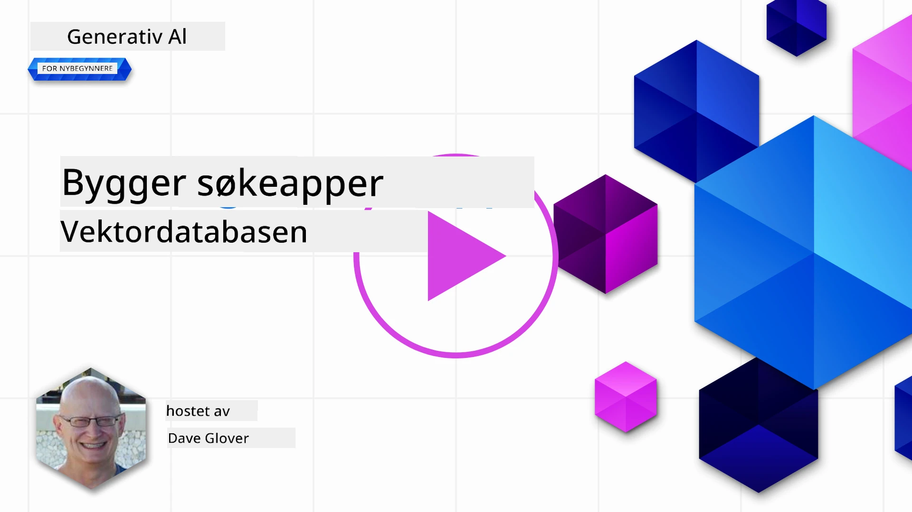
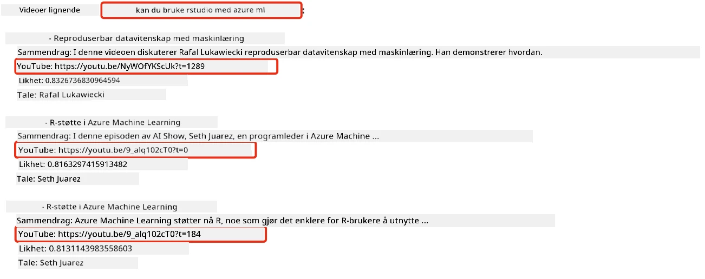
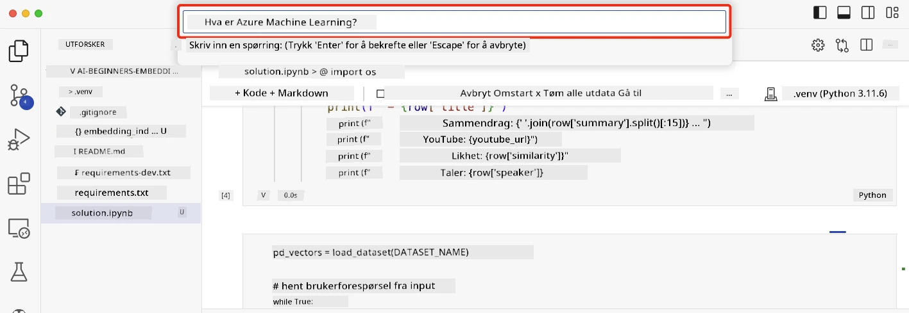

# Bygge en søkeapplikasjon

[](https://youtu.be/W0-nzXjOjr0?si=GcsqiTTvd7RKbo7V)

> > _Klikk på bildet over for å se video av denne leksjonen_

Det er mer ved LLM-er enn chatbots og tekstgenerering. Det er også mulig å bygge søkeapplikasjoner ved hjelp av Embeddings. Embeddings er numeriske representasjoner av data også kjent som vektorer, og kan brukes for semantisk søk etter data.

I denne leksjonen skal du bygge en søkeapplikasjon for vår utdanningsstartup. Vår startup er en ideell organisasjon som tilbyr gratis utdanning til studenter i utviklingsland. Vår startup har et stort antall YouTube-videoer som studenter kan bruke for å lære om AI. Vår startup ønsker å bygge en søkeapplikasjon som lar studenter søke etter en YouTube-video ved å skrive inn et spørsmål.

For eksempel kan en student skrive inn 'Hva er Jupyter Notebooks?' eller 'Hva er Azure ML' og søkeapplikasjonen vil returnere en liste over YouTube-videoer som er relevante for spørsmålet, og enda bedre, søkeapplikasjonen vil returnere en lenke til stedet i videoen hvor svaret på spørsmålet er.

## Introduksjon

I denne leksjonen skal vi dekke:

- Semantisk vs søk med nøkkelord.
- Hva er Tekst-Embeddings.
- Opprette en tekst-embeddingsindeks.
- Søke i en tekst-embeddingsindeks.

## Læringsmål

Etter å ha fullført denne leksjonen vil du kunne:

- Skille mellom semantisk og søk med nøkkelord.
- Forklare hva Tekst-Embeddings er.
- Lage en applikasjon ved hjelp av Embeddings for å søke etter data.

## Hvorfor bygge en søkeapplikasjon?

Å bygge en søkeapplikasjon vil hjelpe deg å forstå hvordan man bruker Embeddings for å søke etter data. Du vil også lære hvordan man bygger en søkeapplikasjon som kan brukes av studenter for å finne informasjon raskt.

Leksjonen inkluderer en Embeddingsindeks av YouTube-manusene for Microsoft [AI Show](https://www.youtube.com/playlist?list=PLlrxD0HtieHi0mwteKBOfEeOYf0LJU4O1) YouTube-kanal. AI Show er en YouTube-kanal som lærer deg om AI og maskinlæring. Embeddingsindeksen inneholder Embeddings for hvert av YouTube-manusene frem til oktober 2023. Du vil bruke Embeddingsindeksen for å bygge en søkeapplikasjon for vår startup. Søkeapplikasjonen returnerer en lenke til stedet i videoen hvor svaret på spørsmålet er. Dette er en flott måte for studenter å finne informasjonen de trenger raskt.

Følgende er et eksempel på en semantisk forespørsel for spørsmålet 'kan du bruke rstudio med azure ml?'. Sjekk ut YouTube-URL-en, du vil se at URL-en inneholder et tidsstempel som tar deg til stedet i videoen der svaret på spørsmålet er.



## Hva er semantisk søk?

Nå lurer du kanskje på, hva er semantisk søk? Semantisk søk er en søketeknikk som bruker semantikken, eller meningen, til ordene i en forespørsel for å returnere relevante resultater.

Her er et eksempel på et semantisk søk. La oss si at du var på utkikk etter en bil, du kan søke etter 'drømmebilen min', semantisk søk forstår at du ikke `drømmer` om en bil, men heller at du ønsker å kjøpe din `ideelle` bil. Semantisk søk forstår intensjonen din og returnerer relevante resultater. Alternativet er `søkeordssøk` som bokstavelig talt ville søke etter drømmer om biler og ofte returnere irrelevante resultater.

## Hva er Tekst-Embeddings?

[Tekst-embeddings](https://en.wikipedia.org/wiki/Word_embedding?WT.mc_id=academic-105485-koreyst) er en teknikk for tekstrepresentasjon brukt i [naturlig språkbehandling](https://en.wikipedia.org/wiki/Natural_language_processing?WT.mc_id=academic-105485-koreyst). Tekst-embeddings er semantiske numeriske representasjoner av tekst. Embeddings brukes for å representere data på en måte som er lett for en maskin å forstå. Det finnes mange modeller for å bygge tekst-embeddings, i denne leksjonen vil vi fokusere på å generere embeddings ved bruk av OpenAI Embedding-modellen.

Her er et eksempel, forestill deg at følgende tekst er i et manus fra en av episodene på AI Show YouTube-kanalen:

```text
Today we are going to learn about Azure Machine Learning.
```

Vi sender teksten til OpenAI Embedding API, og den vil returnere følgende embedding bestående av 1536 tall, også kalt en vektor. Hvert tall i vektoren representerer et annet aspekt av teksten. For enkelhets skyld er her de første 10 tallene i vektoren.

```python
[-0.006655829958617687, 0.0026128944009542465, 0.008792596869170666, -0.02446001023054123, -0.008540431968867779, 0.022071078419685364, -0.010703742504119873, 0.003311325330287218, -0.011632772162556648, -0.02187200076878071, ...]
```

## Hvordan blir embeddingsindeksen laget?

Embeddingsindeksen for denne leksjonen ble laget med en rekke Python-skript. Du finner skriptene sammen med instruksjoner i [README](./scripts/README.md?WT.mc_id=academic-105485-koreyst) i `scripts`-mappen for denne leksjonen. Du trenger ikke kjøre disse skriptene for å fullføre leksjonen ettersom embeddingsindeksen er levert til deg.

Skriptene utfører følgende operasjoner:

1. Manus for hver YouTube-video i [AI Show](https://www.youtube.com/playlist?list=PLlrxD0HtieHi0mwteKBOfEeOYf0LJU4O1) spilleliste lastes ned.
2. Ved bruk av [OpenAI Functions](https://learn.microsoft.com/azure/ai-foundry/openai/how-to/function-calling?WT.mc_id=academic-105485-koreyst) gjøres et forsøk på å ekstrahere navnet på taleren fra de første 3 minuttene av YouTube-manuset. Navnet på taleren for hver video lagres i Embeddingsindeksen kalt `embedding_index_3m.json`.
3. Manus-teksten deles deretter opp i **tekstavsnitt på 3 minutter**. Avsnittet inkluderer omtrent 20 ord som overlapper fra neste avsnitt for å sikre at embedding for avsnittet ikke kuttes og for å gi bedre søkekontekst.
4. Hvert tekstavsnitt sendes deretter til OpenAI Chat API for å oppsummere teksten til 60 ord. Sammendraget lagres også i embeddingsindeksen `embedding_index_3m.json`.
5. Til slutt sendes avsnittsteksten til OpenAI Embedding API. Embedding API returnerer en vektor med 1536 tall som representerer den semantiske betydningen av avsnittet. Avsnittet sammen med OpenAI Embedding-vektoren lagres i en Embeddingsindeks `embedding_index_3m.json`.

### Vektorbaserte databaser

For enkelhetens skyld i denne leksjonen lagres embeddingsindeksen i en JSON-fil kalt `embedding_index_3m.json` og lastes inn i en Pandas DataFrame. Men i produksjon ville embeddingsindeksen blitt lagret i en vektordatabse som for eksempel [Azure Cognitive Search](https://learn.microsoft.com/training/modules/improve-search-results-vector-search?WT.mc_id=academic-105485-koreyst), [Redis](https://cookbook.openai.com/examples/vector_databases/redis/readme?WT.mc_id=academic-105485-koreyst), [Pinecone](https://cookbook.openai.com/examples/vector_databases/pinecone/readme?WT.mc_id=academic-105485-koreyst), [Weaviate](https://cookbook.openai.com/examples/vector_databases/weaviate/readme?WT.mc_id=academic-105485-koreyst), for å nevne noen.

## Forståelse av cosinuslikhet

Vi har lært om tekst-embeddings, neste steg er å lære hvordan man bruker tekst-embeddings for å søke etter data, og spesielt finne de mest lignende embeddings til en gitt forespørsel ved bruk av cosinuslikhet.

### Hva er cosinuslikhet?

Cosinuslikhet er et mål på likhet mellom to vektorer, du vil også høre dette omtalt som `nærmeste nabo-søk`. For å utføre et cosinuslikhetssøk må du _vektorisere_ for _forespørsel_-tekst ved bruk av OpenAI Embedding API. Deretter kalkulerer du _cosinuslikheten_ mellom forespørselsvektoren og hver vektor i embeddingsindeksen. Husk at embeddingsindeksen har en vektor for hvert tekstavsnitt i YouTube-manuset. Til slutt sorterer du resultatene etter cosinuslikhet, og tekstavsnittene med høyest cosinuslikhet er de mest like forespørselen.

Fra et matematisk perspektiv måler cosinuslikhet cosinus til vinkelen mellom to vektorer projisert i et flerdimensjonalt rom. Dette målet er nyttig fordi om to dokumenter er langt fra hverandre basert på Euklidsk avstand på grunn av størrelse, kan de fortsatt ha en mindre vinkel mellom seg og derfor høyere cosinuslikhet. For mer informasjon om cosinuslikhetslikninger, se [Cosine similarity](https://en.wikipedia.org/wiki/Cosine_similarity?WT.mc_id=academic-105485-koreyst).

## Bygg din første søkeapplikasjon

Nå skal vi lære hvordan man bygger en søkeapplikasjon ved bruk av Embeddings. Søkeapplikasjonen vil tillate studenter å søke etter en video ved å skrive inn et spørsmål. Søkeapplikasjonen vil returnere en liste over videoer som er relevante for spørsmålet. Søkeapplikasjonen vil også returnere en lenke til stedet i videoen hvor svaret på spørsmålet er.

Denne løsningen ble bygget og testet på Windows 11, macOS, og Ubuntu 22.04 ved bruk av Python 3.10 eller nyere. Du kan laste ned Python fra [python.org](https://www.python.org/downloads/?WT.mc_id=academic-105485-koreyst).

## Oppgave – bygge en søkeapplikasjon for å hjelpe studenter

Vi introduserte vår startup i begynnelsen av denne leksjonen. Nå er det på tide å gjøre det mulig for studentene å bygge en søkeapplikasjon til vurderingene sine.

I denne oppgaven skal du opprette Azure OpenAI-tjenestene som skal brukes til å bygge søkeapplikasjonen. Du skal opprette følgende Azure OpenAI-tjenester. Du trenger et Azure-abonnement for å gjennomføre denne oppgaven.

### Start Azure Cloud Shell

1. Logg inn på [Azure-portalen](https://portal.azure.com/?WT.mc_id=academic-105485-koreyst).
2. Velg Cloud Shell-ikonet øverst til høyre i Azure-portalen.
3. Velg **Bash** som miljøtype.

#### Opprett en ressursgruppe

> For disse instruksjonene bruker vi ressursgruppen som heter "semantic-video-search" i East US.
> Du kan endre navnet på ressursgruppen, men ved endring av plassering for ressursene,
> sjekk [modelltilgjengelighetstabellen](https://aka.ms/oai/models?WT.mc_id=academic-105485-koreyst).

```shell
az group create --name semantic-video-search --location eastus
```

#### Opprett en Azure OpenAI Service-ressurs

Fra Azure Cloud Shell, kjør følgende kommando for å opprette en Azure OpenAI Service-ressurs.

```shell
az cognitiveservices account create --name semantic-video-openai --resource-group semantic-video-search \
    --location eastus --kind OpenAI --sku s0
```

#### Hent endepunkt og nøkler for bruk i denne applikasjonen

Fra Azure Cloud Shell, kjør følgende kommandoer for å hente endepunkt og nøkler for Azure OpenAI Service-ressursen.

```shell
az cognitiveservices account show --name semantic-video-openai \
   --resource-group  semantic-video-search | jq -r .properties.endpoint
az cognitiveservices account keys list --name semantic-video-openai \
   --resource-group semantic-video-search | jq -r .key1
```

#### Distribuer OpenAI Embedding-modellen

Fra Azure Cloud Shell, kjør følgende kommando for å distribuere OpenAI Embedding-modellen.

```shell
az cognitiveservices account deployment create \
    --name semantic-video-openai \
    --resource-group  semantic-video-search \
    --deployment-name text-embedding-ada-002 \
    --model-name text-embedding-ada-002 \
    --model-version "2"  \
    --model-format OpenAI \
    --sku-capacity 100 --sku-name "Standard"
```

## Løsning

Åpne [løsningsnotatboken](./python/aoai-solution.ipynb?WT.mc_id=academic-105485-koreyst) i GitHub Codespaces og følg instruksjonene i Jupyter Notebooken.

Når du kjører notatboken, vil du bli bedt om å skrive inn en forespørsel. Inndataboksen vil se slik ut:



## Flott arbeid! Fortsett læringen din

Etter å ha fullført denne leksjonen, sjekk ut vår [Generative AI læringssamling](https://aka.ms/genai-collection?WT.mc_id=academic-105485-koreyst) for å fortsette å utvikle din kunnskap om Generativ AI!

Gå videre til Leksjon 9 hvor vi ser på hvordan man kan [bygge applikasjoner for bilde-generering](../09-building-image-applications/README.md?WT.mc_id=academic-105485-koreyst)!

---

<!-- CO-OP TRANSLATOR DISCLAIMER START -->
**Ansvarsfraskrivelse**:
Dette dokumentet er oversatt ved hjelp av AI-oversettelsestjenesten [Co-op Translator](https://github.com/Azure/co-op-translator). Selv om vi streber etter nøyaktighet, vær oppmerksom på at automatiske oversettelser kan inneholde feil eller unøyaktigheter. Det opprinnelige dokumentet på originalspråket skal betraktes som den autoritative kilden. For kritisk informasjon anbefales profesjonell menneskelig oversettelse. Vi er ikke ansvarlige for eventuelle misforståelser eller feiltolkninger som oppstår ved bruk av denne oversettelsen.
<!-- CO-OP TRANSLATOR DISCLAIMER END -->