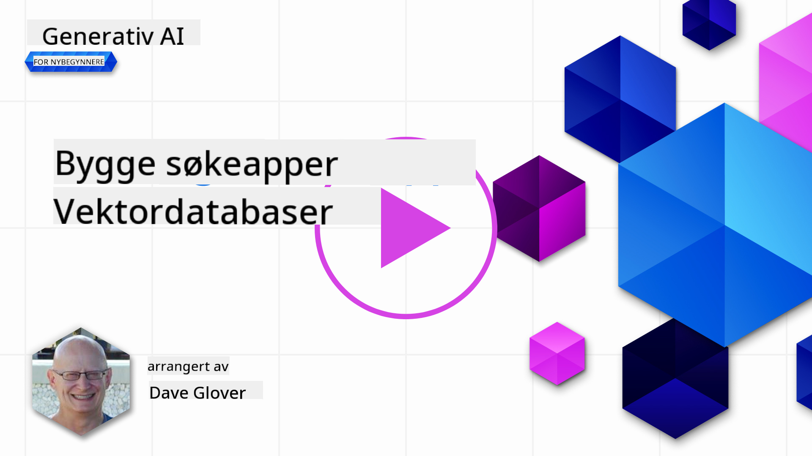
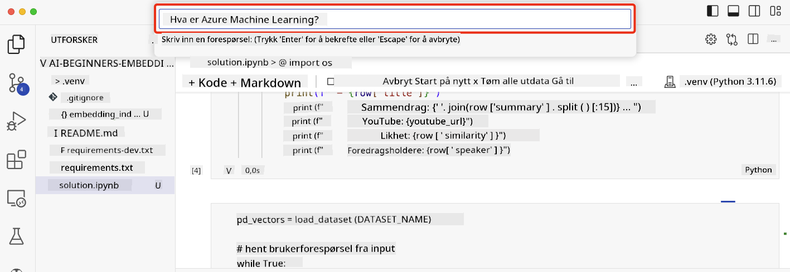

<!--
CO_OP_TRANSLATOR_METADATA:
{
  "original_hash": "d46aad0917a1a342d613e2c13d457da5",
  "translation_date": "2025-07-09T12:57:03+00:00",
  "source_file": "08-building-search-applications/README.md",
  "language_code": "no"
}
-->
# Bygge søkeapplikasjoner

[](https://aka.ms/gen-ai-lesson8-gh?WT.mc_id=academic-105485-koreyst)

> > _Klikk på bildet over for å se videoen til denne leksjonen_

LLMer handler om mer enn bare chatboter og tekstgenerering. Det er også mulig å bygge søkeapplikasjoner ved hjelp av Embeddings. Embeddings er numeriske representasjoner av data, også kjent som vektorer, og kan brukes til semantisk søk i data.

I denne leksjonen skal du bygge en søkeapplikasjon for vår utdanningsstartup. Vår startup er en ideell organisasjon som tilbyr gratis utdanning til studenter i utviklingsland. Vi har et stort antall YouTube-videoer som studentene kan bruke for å lære om AI. Vi ønsker å lage en søkeapplikasjon som lar studentene søke etter en YouTube-video ved å skrive inn et spørsmål.

For eksempel kan en student skrive inn «Hva er Jupyter Notebooks?» eller «Hva er Azure ML», og søkeapplikasjonen vil returnere en liste med relevante YouTube-videoer. Enda bedre, søkeapplikasjonen vil returnere en lenke til det stedet i videoen hvor svaret på spørsmålet finnes.

## Introduksjon

I denne leksjonen vil vi dekke:

- Semantisk søk vs søk på nøkkelord.
- Hva er tekst-embeddings.
- Lage en indeks for tekst-embeddings.
- Søke i en indeks for tekst-embeddings.

## Læringsmål

Etter å ha fullført denne leksjonen vil du kunne:

- Skille mellom semantisk søk og søk på nøkkelord.
- Forklare hva tekst-embeddings er.
- Lage en applikasjon som bruker embeddings for å søke i data.

## Hvorfor bygge en søkeapplikasjon?

Å lage en søkeapplikasjon vil hjelpe deg å forstå hvordan du bruker embeddings for å søke i data. Du vil også lære hvordan du bygger en søkeapplikasjon som studenter kan bruke for å finne informasjon raskt.

Leksjonen inkluderer en embedding-indeks av YouTube-transkripsjonene for Microsoft [AI Show](https://www.youtube.com/playlist?list=PLlrxD0HtieHi0mwteKBOfEeOYf0LJU4O1) YouTube-kanal. AI Show er en YouTube-kanal som lærer deg om AI og maskinlæring. Embedding-indeksen inneholder embeddings for hver av YouTube-transkripsjonene frem til oktober 2023. Du vil bruke embedding-indeksen til å bygge en søkeapplikasjon for vår startup. Søkeapplikasjonen returnerer en lenke til det stedet i videoen hvor svaret på spørsmålet finnes. Dette er en flott måte for studenter å finne informasjonen de trenger raskt.

Nedenfor er et eksempel på en semantisk søkespørring for spørsmålet «kan du bruke rstudio med azure ml?». Sjekk YouTube-URL-en, du vil se at URL-en inneholder et tidsstempel som tar deg til stedet i videoen hvor svaret på spørsmålet finnes.


## Hva er semantisk søk?

Nå lurer du kanskje på, hva er semantisk søk? Semantisk søk er en søketeknikk som bruker betydningen, eller semantikken, i ordene i en søkespørring for å returnere relevante resultater.

Her er et eksempel på semantisk søk. La oss si at du ønsker å kjøpe en bil, du kan søke etter «drømmebilen min». Semantisk søk forstår at du ikke `drømmer` om en bil, men at du faktisk leter etter din `ideelle` bil. Semantisk søk forstår intensjonen din og returnerer relevante resultater. Alternativet er `nøkkelordssøk` som bokstavelig talt søker etter drømmer om biler og ofte gir irrelevante resultater.

## Hva er tekst-embeddings?

[Tekst-embeddings](https://en.wikipedia.org/wiki/Word_embedding?WT.mc_id=academic-105485-koreyst) er en teknikk for tekstrepresentasjon brukt i [naturlig språkbehandling](https://en.wikipedia.org/wiki/Natural_language_processing?WT.mc_id=academic-105485-koreyst). Tekst-embeddings er semantiske numeriske representasjoner av tekst. Embeddings brukes for å representere data på en måte som er lett for en maskin å forstå. Det finnes mange modeller for å lage tekst-embeddings, i denne leksjonen fokuserer vi på å generere embeddings ved hjelp av OpenAI Embedding Model.

Her er et eksempel, forestill deg at følgende tekst er hentet fra en transkripsjon av en episode på AI Show YouTube-kanalen:

```text
Today we are going to learn about Azure Machine Learning.
```

Vi sender teksten til OpenAI Embedding API, som returnerer følgende embedding bestående av 1536 tall, altså en vektor. Hvert tall i vektoren representerer en annen egenskap ved teksten. For enkelhets skyld viser vi her de første 10 tallene i vektoren.

```python
[-0.006655829958617687, 0.0026128944009542465, 0.008792596869170666, -0.02446001023054123, -0.008540431968867779, 0.022071078419685364, -0.010703742504119873, 0.003311325330287218, -0.011632772162556648, -0.02187200076878071, ...]
```

## Hvordan blir embedding-indeksen laget?

Embedding-indeksen for denne leksjonen ble laget med en serie Python-skript. Du finner skriptene sammen med instruksjoner i [README](./scripts/README.md?WT.mc_id=academic-105485-koreyst) i `scripts`-mappen for denne leksjonen. Du trenger ikke å kjøre disse skriptene for å fullføre leksjonen, da embedding-indeksen er levert til deg.

Skriptene utfører følgende operasjoner:

1. Transkripsjonen for hver YouTube-video i [AI Show](https://www.youtube.com/playlist?list=PLlrxD0HtieHi0mwteKBOfEeOYf0LJU4O1)-listen lastes ned.
2. Ved hjelp av [OpenAI Functions](https://learn.microsoft.com/azure/ai-services/openai/how-to/function-calling?WT.mc_id=academic-105485-koreyst) forsøkes det å hente ut navnet på taleren fra de første 3 minuttene av YouTube-transkripsjonen. Talernavnet for hver video lagres i embedding-indeksen kalt `embedding_index_3m.json`.
3. Transkripsjonsteksten deles opp i **3-minutters tekstsegmenter**. Segmentet inkluderer omtrent 20 ord overlapp fra neste segment for å sikre at embedding for segmentet ikke blir avkortet og for å gi bedre søkekontekst.
4. Hvert tekstsegment sendes til OpenAI Chat API for å oppsummere teksten til 60 ord. Sammendraget lagres også i embedding-indeksen `embedding_index_3m.json`.
5. Til slutt sendes tekstsegmentet til OpenAI Embedding API. Embedding API returnerer en vektor med 1536 tall som representerer den semantiske meningen i segmentet. Segmentet sammen med OpenAI Embedding-vektoren lagres i embedding-indeksen `embedding_index_3m.json`.

### Vektordatabaser

For enkelhets skyld i leksjonen lagres embedding-indeksen i en JSON-fil kalt `embedding_index_3m.json` og lastes inn i en Pandas DataFrame. I produksjon vil embedding-indeksen derimot lagres i en vektordatabasen som for eksempel [Azure Cognitive Search](https://learn.microsoft.com/training/modules/improve-search-results-vector-search?WT.mc_id=academic-105485-koreyst), [Redis](https://cookbook.openai.com/examples/vector_databases/redis/readme?WT.mc_id=academic-105485-koreyst), [Pinecone](https://cookbook.openai.com/examples/vector_databases/pinecone/readme?WT.mc_id=academic-105485-koreyst), [Weaviate](https://cookbook.openai.com/examples/vector_databases/weaviate/readme?WT.mc_id=academic-105485-koreyst), for å nevne noen.

## Forståelse av cosinuslikhet

Vi har lært om tekst-embeddings, neste steg er å lære hvordan vi bruker tekst-embeddings for å søke i data, og spesielt finne de mest like embeddingene til en gitt søkespørring ved hjelp av cosinuslikhet.

### Hva er cosinuslikhet?

Cosinuslikhet er et mål på likhet mellom to vektorer, dette kalles også ofte for `nærmeste nabo-søk`. For å utføre et cosinuslikhet-søk må du _vektorisere_ _spørringsteksten_ ved hjelp av OpenAI Embedding API. Deretter beregner du _cosinuslikheten_ mellom spørringsvektoren og hver vektor i embedding-indeksen. Husk at embedding-indeksen har en vektor for hvert tekstsegment i YouTube-transkripsjonen. Til slutt sorteres resultatene etter cosinuslikhet, og tekstsegmentene med høyest cosinuslikhet er de som er mest like spørringen.

Matematisk sett måler cosinuslikhet cosinus til vinkelen mellom to vektorer projisert i et flerdimensjonalt rom. Dette er nyttig fordi to dokumenter kan være langt fra hverandre i euklidisk avstand på grunn av størrelse, men likevel ha en liten vinkel mellom seg og dermed høyere cosinuslikhet. For mer informasjon om cosinuslikhetsformler, se [Cosine similarity](https://en.wikipedia.org/wiki/Cosine_similarity?WT.mc_id=academic-105485-koreyst).

## Bygg din første søkeapplikasjon

Nå skal vi lære hvordan vi bygger en søkeapplikasjon ved hjelp av embeddings. Søkeapplikasjonen vil la studenter søke etter en video ved å skrive inn et spørsmål. Applikasjonen vil returnere en liste med videoer som er relevante for spørsmålet. Den vil også returnere en lenke til det stedet i videoen hvor svaret på spørsmålet finnes.

Denne løsningen er bygget og testet på Windows 11, macOS og Ubuntu 22.04 med Python 3.10 eller nyere. Du kan laste ned Python fra [python.org](https://www.python.org/downloads/?WT.mc_id=academic-105485-koreyst).

## Oppgave – bygge en søkeapplikasjon for å hjelpe studentene

Vi introduserte vår startup i starten av denne leksjonen. Nå er det på tide å gi studentene mulighet til å bygge en søkeapplikasjon for sine vurderinger.

I denne oppgaven skal du opprette Azure OpenAI-tjenestene som skal brukes til å bygge søkeapplikasjonen. Du skal opprette følgende Azure OpenAI-tjenester. Du trenger et Azure-abonnement for å fullføre oppgaven.

### Start Azure Cloud Shell

1. Logg inn på [Azure-portalen](https://portal.azure.com/?WT.mc_id=academic-105485-koreyst).
2. Velg Cloud Shell-ikonet øverst til høyre i Azure-portalen.
3. Velg **Bash** som miljøtype.

#### Opprett en ressursgruppe

> For disse instruksjonene bruker vi ressursgruppen med navnet "semantic-video-search" i East US.
> Du kan endre navnet på ressursgruppen, men hvis du endrer plasseringen for ressursene,
> sjekk [modelltilgjengelighetstabellen](https://aka.ms/oai/models?WT.mc_id=academic-105485-koreyst).

```shell
az group create --name semantic-video-search --location eastus
```

#### Opprett en Azure OpenAI Service-ressurs

Fra Azure Cloud Shell, kjør følgende kommando for å opprette en Azure OpenAI Service-ressurs.

```shell
az cognitiveservices account create --name semantic-video-openai --resource-group semantic-video-search \
    --location eastus --kind OpenAI --sku s0
```

#### Hent endepunkt og nøkler for bruk i denne applikasjonen

Fra Azure Cloud Shell, kjør følgende kommandoer for å hente endepunkt og nøkler for Azure OpenAI Service-ressursen.

```shell
az cognitiveservices account show --name semantic-video-openai \
   --resource-group  semantic-video-search | jq -r .properties.endpoint
az cognitiveservices account keys list --name semantic-video-openai \
   --resource-group semantic-video-search | jq -r .key1
```

#### Distribuer OpenAI Embedding-modellen

Fra Azure Cloud Shell, kjør følgende kommando for å distribuere OpenAI Embedding-modellen.

```shell
az cognitiveservices account deployment create \
    --name semantic-video-openai \
    --resource-group  semantic-video-search \
    --deployment-name text-embedding-ada-002 \
    --model-name text-embedding-ada-002 \
    --model-version "2"  \
    --model-format OpenAI \
    --sku-capacity 100 --sku-name "Standard"
```

## Løsning

Åpne [løsningsnotatboken](python/aoai-solution.ipynb) i GitHub Codespaces og følg instruksjonene i Jupyter Notebook.

Når du kjører notatboken, vil du bli bedt om å skrive inn en søkespørring. Inndatafeltet vil se slik ut:



## Flott jobbet! Fortsett læringen din

Etter å ha fullført denne leksjonen, sjekk ut vår [Generative AI Learning collection](https://aka.ms/genai-collection?WT.mc_id=academic-105485-koreyst) for å fortsette å utvikle din kunnskap om Generativ AI!

Gå videre til leksjon 9 hvor vi ser på hvordan man kan [bygge applikasjoner for bilde-generering](../09-building-image-applications/README.md?WT.mc_id=academic-105485-koreyst)!

**Ansvarsfraskrivelse**:  
Dette dokumentet er oversatt ved hjelp av AI-oversettelsestjenesten [Co-op Translator](https://github.com/Azure/co-op-translator). Selv om vi streber etter nøyaktighet, vennligst vær oppmerksom på at automatiske oversettelser kan inneholde feil eller unøyaktigheter. Det opprinnelige dokumentet på originalspråket skal anses som den autoritative kilden. For kritisk informasjon anbefales profesjonell menneskelig oversettelse. Vi er ikke ansvarlige for eventuelle misforståelser eller feiltolkninger som oppstår ved bruk av denne oversettelsen.