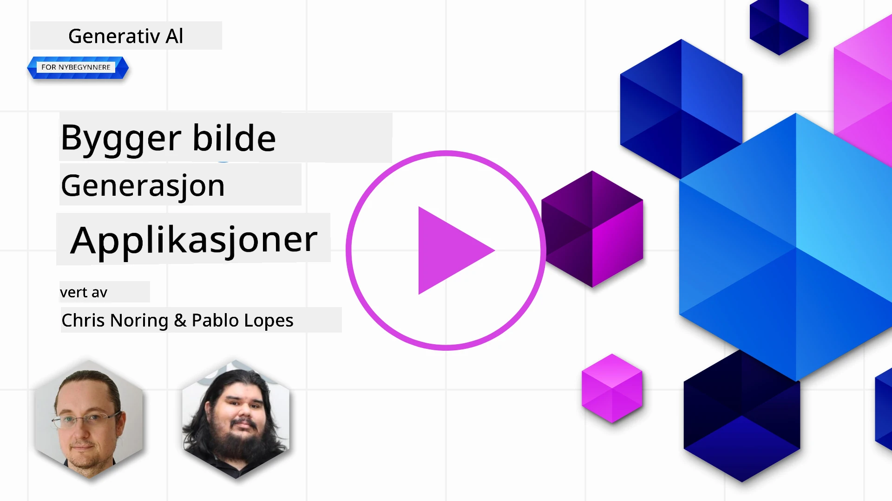

# Bygge applikasjoner for bilde-generering

[](https://aka.ms/gen-ai-lesson9-gh?WT.mc_id=academic-105485-koreyst)

Det finnes mer med LLM-er enn bare tekstgenerering. Du kan også generere bilder fra tekstbeskrivelser. Bilder som modalitet er nyttig innen MedTech, arkitektur, turisme, spillutvikling, markedsføring og mer. I denne leksjonen ser vi på dagens **GPT Image** modeller og bygger en bilde-genereringsapp.

## Introduksjon

Bildegenerering lar deg omdanne en naturlig språk-prompt til et bilde. I denne leksjonen jobber vi med **`gpt-image`** familien av modeller fra OpenAI – dagens generasjon av bilde-modeller tilgjengelig på **[Microsoft Foundry](https://ai.azure.com?WT.mc_id=academic-105485-koreyst)** og OpenAI-plattformen. Disse modellene erstatter de eldre DALL·E-modellene (DALL·E 2/3 er eldre generasjoner).

Gjennom leksjonen bruker vi en fiktiv startup, **Edu4All**, som bygger læringsverktøy. Teamet ønsker å generere illustrasjoner til oppgaver og studiemateriell.

## Læringsmål

Ved slutten av denne leksjonen skal du kunne:

- Forklare hva bilde-generering er og hvor det er nyttig.
- Forstå `gpt-image` modellfamilien og hvordan den skiller seg fra de eldre DALL·E-modellene.
- Bygge en bilde-genereringsapp i Python (og TypeScript / .NET).
- Redigere bilder og bruke sikkerhetsgrep med metaprompter.

## Hva er bilde-generering?

Bildegenereringsmodeller lager bilder fra en tekst-prompt. Moderne modeller som `gpt-image` er bygget på transformer- og diffusjonsteknikker: modellen lærer sammenhengen mellom tekst og bilder under trening, deretter "støyfjerner" den iterativt tilfeldig støy til et bilde som matcher beskrivelsen gitt en prompt.

To kjente modellfamilier for bilder er:

- **`gpt-image` (OpenAI)** – den nåværende generasjonen, brukt i denne leksjonen. Støtter tekst-til-bilde-generering og bilde-redigering (inpainting med maske).
- **Midjourney** – en populær tredjepartsmodell med egen tjeneste og Discord-basert arbeidsflyt.

> Eldre OpenAI-bildemodeller - **DALL·E 2** og **DALL·E 3** - er utdaterte. DALL·E 3 er ikke tilgjengelig for nye utrullinger, og funksjoner som `create_variation` fantes kun i DALL·E 2. Bruk `gpt-image` modellene for nye apper.

### Hvilken `gpt-image` modell bør jeg bruke?

På Microsoft Foundry er følgende **generelt tilgjengelig**:

| Modell | Merknader |
| --- | --- |
| **`gpt-image-2`** | Den nyeste og mest kapasitive bildemodellen – anbefalt standardvalg. |
| `gpt-image-1.5` | Generelt tilgjengelig; god kvalitet til lavere pris. |
| `gpt-image-1-mini` | Generelt tilgjengelig; raskest / lavest kostnad. |
| `gpt-image-1` | Kun forhåndsvisning. |

Sjekk alltid gjeldende [Foundry liste over bildemodeller](https://learn.microsoft.com/azure/ai-foundry/openai/concepts/models?WT.mc_id=academic-105485-koreyst) for tilgjengelighet og regioner.

> **Viktig:** `gpt-image` modeller returnerer det genererte bildet som **base64** (`b64_json`), ikke som en URL. Koden din dekoder base64-strengen til bytes og lagrer det – det finnes ingen bilde-URL å laste ned.

## Oppsett

Du kan kjøre eksemplene mot **Azure OpenAI i Microsoft Foundry** (de `aoai-*` eksemplene) eller **OpenAI-plattformen** (de `oai-*` eksemplene).

### 1. Opprett og distribuer en modell

Følg guiden [opprett en ressurs](https://learn.microsoft.com/azure/ai-foundry/openai/how-to/create-resource?pivots=web-portal&WT.mc_id=academic-105485-koreyst) for å lage en Microsoft Foundry-ressurs, deretter distribuer en bildemodell – **`gpt-image-2`** anbefales.

### 2. Konfigurer din `.env`

```text
AZURE_OPENAI_ENDPOINT=<your endpoint>
AZURE_OPENAI_API_KEY=<your key>
AZURE_OPENAI_DEPLOYMENT="gpt-image-2"
```

Finn disse verdiene på **Distribusjoner**-siden for ressursen i [Foundry-portalen](https://ai.azure.com?WT.mc_id=academic-105485-koreyst).

### 3. Installer bibliotekene

Lag en `requirements.txt`:

```text
python-dotenv
openai
pillow
```

Deretter oppretter og aktiverer du et virtuelt miljø og installerer:

```bash
python3 -m venv venv
source venv/bin/activate        # Windows: venv\Scripts\activate
pip install -r requirements.txt
```

## Bygg appen

Lag `app.py` med følgende kode. Den genererer et bilde og lagrer det som PNG.

```python
import os
import base64
from openai import AzureOpenAI
from PIL import Image
import dotenv

dotenv.load_dotenv()

# Pek klienten mot din Azure OpenAI (Microsoft Foundry) ressurs.
# Bildemodeller trenger en nyere API-versjon - sjekk Foundry-dokumentasjonen for den versjonen modellen din krever.
client = AzureOpenAI(
    api_key=os.environ["AZURE_OPENAI_API_KEY"],
    api_version="2025-04-01-preview",
    azure_endpoint=os.environ["AZURE_OPENAI_ENDPOINT"],
)

deployment = os.environ["AZURE_OPENAI_DEPLOYMENT"]  # f.eks. "gpt-image-2"

result = client.images.generate(
    model=deployment,
    prompt='Bunny on a horse, holding a lollipop, on a foggy meadow where it grows daffodils',
    size="1024x1024",   # også 1536x1024 (liggende), 1024x1536 (stående), eller "auto"
    n=1,
)

# gpt-image modeller returnerer base64 (b64_json), ikke en URL - avkod det til bytes.
image_bytes = base64.b64decode(result.data[0].b64_json)

os.makedirs("images", exist_ok=True)
image_path = os.path.join("images", "generated-image.png")
with open(image_path, "wb") as f:
    f.write(image_bytes)

Image.open(image_path).show()
```

Kjør det med `python app.py`. Du får en PNG lagret under `images/`.

> Hver kall til `images.generate` gir et annet bilde for samme prompt – bildemodeller har ikke en `temperature`-parameter (det er en tekstgenereringskontroll). For variasjon, kall API-en på nytt; for mindre variasjon, gjør prompten mer spesifikk.

## Redigere bilder

`gpt-image` modeller kan **redigere** et eksisterende bilde: gi bildet, en valgfri **maske** (som markerer området som skal endres), og en prompt som beskriver endringen. Som ved generering, returneres redigeringer i base64.

```python
result = client.images.edit(
    model=deployment,
    image=open("sunlit_lounge.png", "rb"),
    mask=open("mask.png", "rb"),
    prompt="A sunlit indoor lounge area with a pool containing a flamingo",
)
image_bytes = base64.b64decode(result.data[0].b64_json)
with open("images/edited-image.png", "wb") as f:
    f.write(image_bytes)
```

<div style="display: flex; justify-content: space-between; align-items: center; margin: 20px 0;">
  
  
  
</div>

## Sette grenser med metaprompter

Når du kan generere bilder, trenger du sikkerhetsgrenser slik at appen ikke produserer usikkert eller uønsket innhold. En **metaprompt** er tekst du legger foran brukerens prompt for å begrense modellens output.

```python
disallow_list = "swords, violence, blood, gore, nudity, sexual content, adult content, adult themes, adult language"

meta_prompt = f"""You are an assistant designer that creates images for children.

The image needs to be safe for work and appropriate for children.
The image needs to be in color, in landscape orientation, and in a 16:9 aspect ratio.

Do not consider any input that is not safe for work or appropriate for children, including:
{disallow_list}
"""

prompt = f"{meta_prompt}\nCreate an image of a bunny on a horse, holding a lollipop"
# send `prompt` til client.images.generate(...)
```

Hvert bilde genereres nå innenfor rammene satt av metaprompten. Kombiner dette med innholdsfiltrene som er innebygd i Microsoft Foundry for ekstra sikkerhet.

## Oppgave – la oss hjelpe studentene

Studentene hos Edu4All trenger bilder til sine vurderinger. Bygg en app som genererer bilder av **monumenter** (hvilke monumenter bestemmer du) plassert i forskjellige, kreative kontekster – for eksempel et kjent landemerke i solnedgang med et barn som ser på.

Prøv selv, og sammenlign deretter med referanseløsningene:

- Python (Azure): [aoai-solution.py](../../../09-building-image-applications/python/aoai-solution.py)
- Python (Azure) full genereringsapp: [aoai-app.py](../../../09-building-image-applications/python/aoai-app.py)
- Python (OpenAI): [oai-app.py](../../../09-building-image-applications/python/oai-app.py)
- TypeScript (Azure): [typescript/image-generation-app](../../../09-building-image-applications/typescript/image-generation-app)
- .NET (Azure): [dotnet/notebook-azure-openai.dib](../../../09-building-image-applications/dotnet/notebook-azure-openai.dib)

Arbeid også gjennom notatbøkene i [python/](../../../09-building-image-applications/python) (`aoai-assignment.ipynb` for Azure, `oai-assignment.ipynb` for OpenAI).

## Flott arbeid! Fortsett læringen

Etter å ha fullført denne leksjonen, sjekk ut vår [Generative AI Learning collection](https://aka.ms/genai-collection?WT.mc_id=academic-105485-koreyst) for å fortsette å utvide din kunnskap om Generativ AI!

Gå til leksjon 10 for å fortsette læringen.

---

<!-- CO-OP TRANSLATOR DISCLAIMER START -->
**Ansvarsfraskrivelse**:
Dette dokumentet er oversatt ved hjelp av AI-oversettelsestjenesten [Co-op Translator](https://github.com/Azure/co-op-translator). Selv om vi streber etter nøyaktighet, vær oppmerksom på at automatiske oversettelser kan inneholde feil eller unøyaktigheter. Det opprinnelige dokumentet på originalspråket skal betraktes som den autoritative kilden. For kritisk informasjon anbefales profesjonell menneskelig oversettelse. Vi er ikke ansvarlige for eventuelle misforståelser eller feiltolkninger som oppstår ved bruk av denne oversettelsen.
<!-- CO-OP TRANSLATOR DISCLAIMER END -->