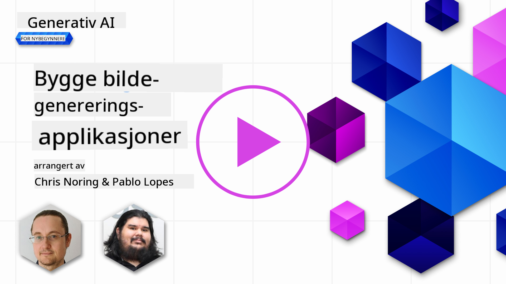

<!--
CO_OP_TRANSLATOR_METADATA:
{
  "original_hash": "ef74ad58fc01f7ad80788f79505f9816",
  "translation_date": "2025-08-26T17:39:10+00:00",
  "source_file": "09-building-image-applications/README.md",
  "language_code": "no"
}
-->
# Bygge applikasjoner for bildegenerering

[](https://aka.ms/gen-ai-lesson9-gh?WT.mc_id=academic-105485-koreyst)

LLM-er handler ikke bare om tekstgenerering. Det er også mulig å generere bilder ut fra tekstbeskrivelser. Å ha bilder som en modalitet kan være svært nyttig innenfor mange områder, som MedTech, arkitektur, reiseliv, spillutvikling og mer. I dette kapittelet skal vi se nærmere på de to mest populære modellene for bildegenerering, DALL-E og Midjourney.

## Introduksjon

I denne leksjonen skal vi gå gjennom:

- Bildegenerering og hvorfor det er nyttig.
- DALL-E og Midjourney, hva de er og hvordan de fungerer.
- Hvordan du kan bygge en applikasjon for bildegenerering.

## Læringsmål

Etter å ha fullført denne leksjonen skal du kunne:

- Bygge en applikasjon for bildegenerering.
- Definere rammer for applikasjonen din med metaprompt.
- Jobbe med DALL-E og Midjourney.

## Hvorfor bygge en applikasjon for bildegenerering?

Applikasjoner for bildegenerering er en flott måte å utforske mulighetene med Generativ AI. De kan for eksempel brukes til:

- **Bilderedigering og syntese**. Du kan generere bilder til ulike formål, som bilderedigering og bildesyntese.

- **Brukes i mange bransjer**. De kan også brukes til å generere bilder for ulike bransjer som MedTech, reiseliv, spillutvikling og mer.

## Scenario: Edu4All

Som en del av denne leksjonen fortsetter vi å jobbe med vår startup, Edu4All. Studentene skal lage bilder til sine vurderinger, nøyaktig hvilke bilder er opp til studentene, men det kan for eksempel være illustrasjoner til deres egen eventyrfortelling, lage en ny karakter til historien sin, eller hjelpe dem å visualisere ideer og konsepter.

Her er et eksempel på hva Edu4Alls elever kan generere hvis de jobber med monumenter i klassen:


ved å bruke en prompt som

> "Hund ved siden av Eiffeltårnet i morgensol"

## Hva er DALL-E og Midjourney?

[DALL-E](https://openai.com/dall-e-2?WT.mc_id=academic-105485-koreyst) og [Midjourney](https://www.midjourney.com/?WT.mc_id=academic-105485-koreyst) er to av de mest populære modellene for bildegenerering, og lar deg bruke tekstprompter for å generere bilder.

### DALL-E

La oss starte med DALL-E, som er en generativ AI-modell som lager bilder ut fra tekstbeskrivelser.

> [DALL-E er en kombinasjon av to modeller, CLIP og diffused attention](https://towardsdatascience.com/openais-dall-e-and-clip-101-a-brief-introduction-3a4367280d4e?WT.mc_id=academic-105485-koreyst).

- **CLIP** er en modell som lager embeddings, altså numeriske representasjoner av data, fra bilder og tekst.

- **Diffused attention** er en modell som lager bilder ut fra embeddings. DALL-E er trent på et datasett med bilder og tekst, og kan brukes til å generere bilder ut fra tekstbeskrivelser. For eksempel kan DALL-E brukes til å lage bilder av en katt med hatt, eller en hund med hanekam.

### Midjourney

Midjourney fungerer på lignende måte som DALL-E, og lager bilder ut fra tekstprompter. Midjourney kan også brukes til å generere bilder med prompter som “en katt med hatt” eller “en hund med hanekam”.


_Bildekreditt Wikipedia, bilde generert av Midjourney_

## Hvordan fungerer DALL-E og Midjourney

Først, [DALL-E](https://arxiv.org/pdf/2102.12092.pdf?WT.mc_id=academic-105485-koreyst). DALL-E er en generativ AI-modell basert på transformer-arkitektur med en _autoregressiv transformer_.

En _autoregressiv transformer_ definerer hvordan en modell lager bilder ut fra tekstbeskrivelser, den genererer én piksel om gangen, og bruker de genererte pikslene til å lage neste piksel. Dette skjer gjennom flere lag i et nevralt nettverk, helt til bildet er ferdig.

Med denne prosessen kan DALL-E styre attributter, objekter, egenskaper og mer i bildet som genereres. DALL-E 2 og 3 gir enda mer kontroll over det ferdige bildet.

## Bygg din første applikasjon for bildegenerering

Hva trenger du for å bygge en applikasjon for bildegenerering? Du trenger følgende biblioteker:

- **python-dotenv**, det anbefales sterkt å bruke dette biblioteket for å holde hemmeligheter i en _.env_-fil utenfor koden.
- **openai**, dette biblioteket bruker du for å kommunisere med OpenAI API.
- **pillow**, for å jobbe med bilder i Python.
- **requests**, for å gjøre HTTP-forespørsler.

## Opprett og distribuer en Azure OpenAI-modell

Hvis du ikke allerede har gjort det, følg instruksjonene på [Microsoft Learn](https://learn.microsoft.com/azure/ai-foundry/openai/how-to/create-resource?pivots=web-portal)-siden
for å opprette en Azure OpenAI-ressurs og modell. Velg DALL-E 3 som modell.  

## Lag appen

1. Lag en fil som heter _.env_ med følgende innhold:

   ```text
   AZURE_OPENAI_ENDPOINT=<your endpoint>
   AZURE_OPENAI_API_KEY=<your key>
   AZURE_OPENAI_DEPLOYMENT="dall-e-3"
   ```

   Du finner denne informasjonen i Azure OpenAI Foundry Portal for ressursen din under "Deployments".

1. Samle de ovennevnte bibliotekene i en fil som heter _requirements.txt_ slik:

   ```text
   python-dotenv
   openai
   pillow
   requests
   ```

1. Deretter oppretter du et virtuelt miljø og installerer bibliotekene:

   ```bash
   python3 -m venv venv
   source venv/bin/activate
   pip install -r requirements.txt
   ```

   For Windows, bruk følgende kommandoer for å opprette og aktivere ditt virtuelle miljø:

   ```bash
   python3 -m venv venv
   venv\Scripts\activate.bat
   ```

1. Legg til følgende kode i en fil som heter _app.py_:

    ```python
    import openai
    import os
    import requests
    from PIL import Image
    import dotenv
    from openai import OpenAI, AzureOpenAI
    
    # import dotenv
    dotenv.load_dotenv()
    
    # configure Azure OpenAI service client 
    client = AzureOpenAI(
      azure_endpoint = os.environ["AZURE_OPENAI_ENDPOINT"],
      api_key=os.environ['AZURE_OPENAI_API_KEY'],
      api_version = "2024-02-01"
      )
    try:
        # Create an image by using the image generation API
        generation_response = client.images.generate(
                                prompt='Bunny on horse, holding a lollipop, on a foggy meadow where it grows daffodils',
                                size='1024x1024', n=1,
                                model=os.environ['AZURE_OPENAI_DEPLOYMENT']
                              )

        # Set the directory for the stored image
        image_dir = os.path.join(os.curdir, 'images')

        # If the directory doesn't exist, create it
        if not os.path.isdir(image_dir):
            os.mkdir(image_dir)

        # Initialize the image path (note the filetype should be png)
        image_path = os.path.join(image_dir, 'generated-image.png')

        # Retrieve the generated image
        image_url = generation_response.data[0].url  # extract image URL from response
        generated_image = requests.get(image_url).content  # download the image
        with open(image_path, "wb") as image_file:
            image_file.write(generated_image)

        # Display the image in the default image viewer
        image = Image.open(image_path)
        image.show()

    # catch exceptions
    except openai.InvalidRequestError as err:
        print(err)
   ```

La oss forklare denne koden:

- Først importerer vi bibliotekene vi trenger, inkludert OpenAI-biblioteket, dotenv, requests og Pillow.

  ```python
  import openai
  import os
  import requests
  from PIL import Image
  import dotenv
  ```

- Deretter laster vi inn miljøvariablene fra _.env_-filen.

  ```python
  # import dotenv
  dotenv.load_dotenv()
  ```

- Etter det konfigurerer vi Azure OpenAI service-klienten 

  ```python
  # Get endpoint and key from environment variables
  client = AzureOpenAI(
      azure_endpoint = os.environ["AZURE_OPENAI_ENDPOINT"],
      api_key=os.environ['AZURE_OPENAI_API_KEY'],
      api_version = "2024-02-01"
      )
  ```

- Så genererer vi bildet:

  ```python
  # Create an image by using the image generation API
  generation_response = client.images.generate(
                        prompt='Bunny on horse, holding a lollipop, on a foggy meadow where it grows daffodils',
                        size='1024x1024', n=1,
                        model=os.environ['AZURE_OPENAI_DEPLOYMENT']
                      )
  ```

  Koden over gir et JSON-objekt som inneholder URL-en til det genererte bildet. Vi kan bruke denne URL-en til å laste ned bildet og lagre det i en fil.

- Til slutt åpner vi bildet og bruker standard bildeviser for å vise det:

  ```python
  image = Image.open(image_path)
  image.show()
  ```

### Mer om å generere bildet

La oss se nærmere på koden som genererer bildet:

    ```python
      generation_response = client.images.generate(
                                prompt='Bunny on horse, holding a lollipop, on a foggy meadow where it grows daffodils',
                                size='1024x1024', n=1,
                                model=os.environ['AZURE_OPENAI_DEPLOYMENT']
                            )
    ```

- **prompt** er tekstprompten som brukes for å generere bildet. I dette tilfellet bruker vi prompten "Kanin på hest, holder en kjærlighet på pinne, på en tåkete eng hvor det vokser påskeliljer".
- **size** er størrelsen på bildet som genereres. Her lager vi et bilde på 1024x1024 piksler.
- **n** er antall bilder som genereres. Her lager vi to bilder.
- **temperature** er en parameter som styrer hvor tilfeldig utdataene fra en generativ AI-modell blir. Verdien er mellom 0 og 1, der 0 betyr at utdataene er deterministiske og 1 betyr at de er helt tilfeldige. Standardverdien er 0,7.

Det finnes flere ting du kan gjøre med bilder, som vi skal se på i neste avsnitt.

## Flere muligheter med bildegenerering

Du har nå sett hvordan vi kan generere et bilde med noen få linjer Python. Men det finnes flere ting du kan gjøre med bilder.

Du kan også gjøre følgende:

- **Redigere bilder**. Ved å gi et eksisterende bilde, en maske og en prompt, kan du endre et bilde. For eksempel kan du legge til noe på en del av bildet. Tenk deg kaninbildet vårt – du kan legge til en hatt på kaninen. Dette gjør du ved å gi bildet, en maske (som markerer området som skal endres) og en tekstprompt som sier hva som skal gjøres.
> Merk: dette støttes ikke i DALL-E 3. 
 
Her er et eksempel med GPT Image:

    ```python
    response = client.images.edit(
        model="gpt-image-1",
        image=open("sunlit_lounge.png", "rb"),
        mask=open("mask.png", "rb"),
        prompt="A sunlit indoor lounge area with a pool containing a flamingo"
    )
    image_url = response.data[0].url
    ```

  Grunnbildet inneholder kun loungen med basseng, men sluttbildet har en flamingo:

<div style="display: flex; justify-content: space-between; align-items: center; margin: 20px 0;">
  
  
  
</div>


- **Lage variasjoner**. Tanken er at du tar et eksisterende bilde og ber om at det lages variasjoner. For å lage en variasjon gir du et bilde og en tekstprompt, og kode som dette:

  ```python
  response = openai.Image.create_variation(
    image=open("bunny-lollipop.png", "rb"),
    n=1,
    size="1024x1024"
  )
  image_url = response['data'][0]['url']
  ```

  > Merk, dette støttes kun på OpenAI

## Temperatur

Temperatur er en parameter som styrer hvor tilfeldig utdataene fra en generativ AI-modell blir. Verdien er mellom 0 og 1, der 0 betyr at utdataene er deterministiske og 1 betyr at de er helt tilfeldige. Standardverdien er 0,7.

La oss se på et eksempel på hvordan temperatur fungerer, ved å kjøre denne prompten to ganger:

> Prompt : "Kanin på hest, holder en kjærlighet på pinne, på en tåkete eng hvor det vokser påskeliljer"


La oss nå kjøre samme prompt igjen for å se at vi ikke får nøyaktig samme bilde to ganger:


Som du ser, ligner bildene, men de er ikke identiske. La oss prøve å endre temperaturverdien til 0,1 og se hva som skjer:

```python
 generation_response = client.images.create(
        prompt='Bunny on horse, holding a lollipop, on a foggy meadow where it grows daffodils',    # Enter your prompt text here
        size='1024x1024',
        n=2
    )
```

### Endre temperaturen

La oss prøve å gjøre svaret mer deterministisk. Vi kunne se fra de to bildene vi genererte at i det første bildet er det en kanin, og i det andre bildet er det en hest, så bildene varierer mye.

La oss derfor endre koden og sette temperaturen til 0, slik:

```python
generation_response = client.images.create(
        prompt='Bunny on horse, holding a lollipop, on a foggy meadow where it grows daffodils',    # Enter your prompt text here
        size='1024x1024',
        n=2,
        temperature=0
    )
```

Når du nå kjører denne koden, får du disse to bildene:

- 
- 

Her ser du tydelig at bildene ligner mye mer på hverandre.

## Hvordan definere rammer for applikasjonen din med metaprompter

Med demoen vår kan vi allerede generere bilder for kundene våre. Men vi må lage noen rammer for applikasjonen.

For eksempel ønsker vi ikke å generere bilder som ikke er trygge for arbeid, eller som ikke passer for barn.

Dette kan vi gjøre med _metaprompter_. Metaprompter er tekstprompter som brukes for å styre utdataene fra en generativ AI-modell. For eksempel kan vi bruke metaprompter for å kontrollere utdataene, og sørge for at bildene som genereres er trygge for arbeid eller passer for barn.

### Hvordan fungerer det?

Hvordan fungerer egentlig metaprompter?

Metaprompter er tekstprompter som brukes for å styre utdataene fra en generativ AI-modell. De plasseres foran tekstprompten, og brukes for å styre utdataene fra modellen og bygges inn i applikasjoner for å kontrollere utdataene. Man slår sammen prompt-input og metaprompt-input i én tekstprompt.

Et eksempel på en metaprompt kan være:

```text
You are an assistant designer that creates images for children.

The image needs to be safe for work and appropriate for children.

The image needs to be in color.

The image needs to be in landscape orientation.

The image needs to be in a 16:9 aspect ratio.

Do not consider any input from the following that is not safe for work or appropriate for children.

(Input)

```

La oss nå se hvordan vi kan bruke metaprompter i demoen vår.

```python
disallow_list = "swords, violence, blood, gore, nudity, sexual content, adult content, adult themes, adult language, adult humor, adult jokes, adult situations, adult"

meta_prompt =f"""You are an assistant designer that creates images for children.

The image needs to be safe for work and appropriate for children.

The image needs to be in color.

The image needs to be in landscape orientation.

The image needs to be in a 16:9 aspect ratio.

Do not consider any input from the following that is not safe for work or appropriate for children.
{disallow_list}
"""

prompt = f"{meta_prompt}
Create an image of a bunny on a horse, holding a lollipop"

# TODO add request to generate image
```

Fra prompten over ser du hvordan alle bildene som lages tar hensyn til metaprompten.

## Oppgave – la oss gi studentene mulighet

Vi introduserte Edu4All i starten av denne leksjonen. Nå er det på tide å la studentene generere bilder til sine vurderinger.

Studentene skal lage bilder til vurderingene sine som inneholder monumenter, nøyaktig hvilke monumenter er opp til studentene. Studentene blir bedt om å bruke kreativiteten sin i denne oppgaven og plassere monumentene i ulike sammenhenger.

## Løsningsforslag

Her er én mulig løsning:

```python
import openai
import os
import requests
from PIL import Image
import dotenv
from openai import AzureOpenAI
# import dotenv
dotenv.load_dotenv()

# Get endpoint and key from environment variables
client = AzureOpenAI(
  azure_endpoint = os.environ["AZURE_OPENAI_ENDPOINT"],
  api_key=os.environ['AZURE_OPENAI_API_KEY'],
  api_version = "2024-02-01"
  )


disallow_list = "swords, violence, blood, gore, nudity, sexual content, adult content, adult themes, adult language, adult humor, adult jokes, adult situations, adult"

meta_prompt = f"""You are an assistant designer that creates images for children.

The image needs to be safe for work and appropriate for children.

The image needs to be in color.

The image needs to be in landscape orientation.

The image needs to be in a 16:9 aspect ratio.

Do not consider any input from the following that is not safe for work or appropriate for children.
{disallow_list}
"""

prompt = f"""{meta_prompt}
Generate monument of the Arc of Triumph in Paris, France, in the evening light with a small child holding a Teddy looks on.
""""

try:
    # Create an image by using the image generation API
    generation_response = client.images.generate(
        prompt=prompt,    # Enter your prompt text here
        size='1024x1024',
        n=1,
    )
    # Set the directory for the stored image
    image_dir = os.path.join(os.curdir, 'images')

    # If the directory doesn't exist, create it
    if not os.path.isdir(image_dir):
        os.mkdir(image_dir)

    # Initialize the image path (note the filetype should be png)
    image_path = os.path.join(image_dir, 'generated-image.png')

    # Retrieve the generated image
    image_url = generation_response.data[0].url  # extract image URL from response
    generated_image = requests.get(image_url).content  # download the image
    with open(image_path, "wb") as image_file:
        image_file.write(generated_image)

    # Display the image in the default image viewer
    image = Image.open(image_path)
    image.show()

# catch exceptions
except openai.BadRequestError as err:
    print(err)
```

## Flott jobbet! Fortsett læringen din
Når du er ferdig med denne leksjonen, ta en titt på vår [Generative AI Learning-samling](https://aka.ms/genai-collection?WT.mc_id=academic-105485-koreyst) for å fortsette å utvikle kunnskapen din om Generativ AI!

Gå videre til Leksjon 10 hvor vi skal se på hvordan du kan [bygge AI-applikasjoner med lavkode](../10-building-low-code-ai-applications/README.md?WT.mc_id=academic-105485-koreyst)

---

**Ansvarsfraskrivelse**:  
Dette dokumentet er oversatt ved hjelp av AI-oversettelsestjenesten [Co-op Translator](https://github.com/Azure/co-op-translator). Selv om vi tilstreber nøyaktighet, vennligst vær oppmerksom på at automatiserte oversettelser kan inneholde feil eller unøyaktigheter. Det originale dokumentet på sitt opprinnelige språk bør anses som den autoritative kilden. For kritisk informasjon anbefales profesjonell menneskelig oversettelse. Vi er ikke ansvarlige for eventuelle misforståelser eller feiltolkninger som oppstår ved bruk av denne oversettelsen.