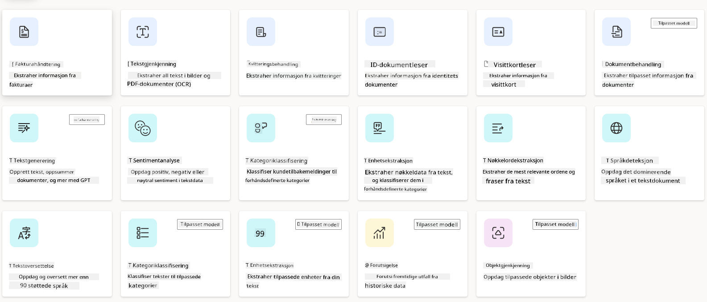
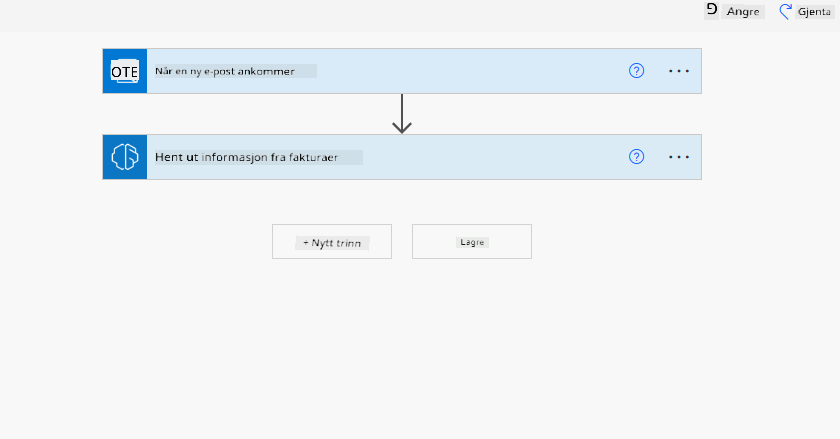
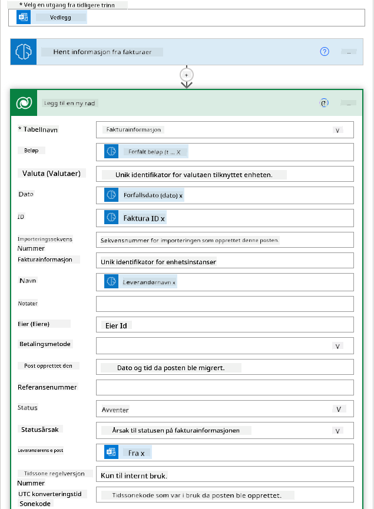

<!--
CO_OP_TRANSLATOR_METADATA:
{
  "original_hash": "f5ff3b6204a695a117d6f452403c95f7",
  "translation_date": "2025-05-19T20:33:23+00:00",
  "source_file": "10-building-low-code-ai-applications/README.md",
  "language_code": "no"
}
-->
# Bygge lavkode AI-applikasjoner

## Introduksjon

Nå som vi har lært å bygge bildegenererende applikasjoner, la oss snakke om lavkode. Generativ AI kan brukes på mange ulike områder, inkludert lavkode, men hva er egentlig lavkode, og hvordan kan vi tilføre AI til det?

Å bygge apper og løsninger har blitt enklere for både tradisjonelle utviklere og ikke-utviklere gjennom bruk av lavkodeutviklingsplattformer. Lavkodeutviklingsplattformer lar deg bygge apper og løsninger med lite eller ingen kode. Dette oppnås ved å tilby et visuelt utviklingsmiljø som lar deg dra og slippe komponenter for å bygge apper og løsninger. Dette gjør det mulig å bygge apper og løsninger raskere og med færre ressurser. I denne leksjonen går vi i dybden på hvordan man bruker lavkode og hvordan man kan forbedre lavkodeutvikling med AI ved bruk av Power Platform.

Power Platform gir organisasjoner muligheten til å styrke sine team til å bygge sine egne løsninger gjennom et intuitivt lavkode- eller ingen-kode-miljø. Dette miljøet hjelper med å forenkle prosessen med å bygge løsninger. Med Power Platform kan løsninger bygges på dager eller uker i stedet for måneder eller år. Power Platform består av fem nøkkelprodukter: Power Apps, Power Automate, Power BI, Power Pages og Copilot Studio.

Denne leksjonen dekker:

- Introduksjon til Generativ AI i Power Platform
- Introduksjon til Copilot og hvordan man bruker det
- Bruke Generativ AI til å bygge apper og flyter i Power Platform
- Forstå AI-modellene i Power Platform med AI Builder

## Læringsmål

Ved slutten av denne leksjonen vil du kunne:

- Forstå hvordan Copilot fungerer i Power Platform.

- Bygge en Student Assignment Tracker App for vår utdanningsstartup.

- Bygge en fakturabehandlingsflyt som bruker AI til å hente informasjon fra fakturaer.

- Anvende beste praksis ved bruk av Create Text with GPT AI Model.

Verktøyene og teknologiene du vil bruke i denne leksjonen er:

- **Power Apps**, for Student Assignment Tracker-appen, som gir et lavkodeutviklingsmiljø for å bygge apper for å spore, administrere og samhandle med data.

- **Dataverse**, for å lagre dataene for Student Assignment Tracker-appen hvor Dataverse vil gi en lavkode dataplattform for lagring av appens data.

- **Power Automate**, for fakturabehandlingsflyten hvor du vil ha et lavkodeutviklingsmiljø for å bygge arbeidsflyter for å automatisere fakturabehandlingsprosessen.

- **AI Builder**, for fakturabehandlings-AI-modellen hvor du vil bruke forhåndsbygde AI-modeller for å behandle fakturaene for vår startup.

## Generativ AI i Power Platform

Å forbedre lavkodeutvikling og applikasjoner med generativ AI er et sentralt fokusområde for Power Platform. Målet er å gjøre det mulig for alle å bygge AI-drevne apper, nettsteder, dashboards og automatisere prosesser med AI, _uten å kreve noen datavitenskapskompetanse_. Dette målet oppnås ved å integrere generativ AI i lavkodeutviklingsopplevelsen i Power Platform i form av Copilot og AI Builder.

### Hvordan fungerer dette?

Copilot er en AI-assistent som lar deg bygge Power Platform-løsninger ved å beskrive dine krav i en serie av samtalesteg ved bruk av naturlig språk. Du kan for eksempel instruere AI-assistenten din til å angi hvilke felt appen din vil bruke, og den vil opprette både appen og den underliggende datamodellen, eller du kan spesifisere hvordan du setter opp en flyt i Power Automate.

Du kan bruke Copilot-drevne funksjoner som en funksjon i appskjermene dine for å gjøre det mulig for brukere å avdekke innsikter gjennom samtaleinteraksjoner.

AI Builder er en lavkode AI-funksjonalitet tilgjengelig i Power Platform som lar deg bruke AI-modeller for å hjelpe deg med å automatisere prosesser og forutsi resultater. Med AI Builder kan du bringe AI til appene og flytene dine som kobler til dataene dine i Dataverse eller i ulike skybaserte datakilder, som SharePoint, OneDrive eller Azure.

Copilot er tilgjengelig i alle Power Platform-produktene: Power Apps, Power Automate, Power BI, Power Pages og Power Virtual Agents. AI Builder er tilgjengelig i Power Apps og Power Automate. I denne leksjonen vil vi fokusere på hvordan man bruker Copilot og AI Builder i Power Apps og Power Automate for å bygge en løsning for vår utdanningsstartup.

### Copilot i Power Apps

Som en del av Power Platform gir Power Apps et lavkodeutviklingsmiljø for å bygge apper for å spore, administrere og samhandle med data. Det er en pakke med apputviklingstjenester med en skalerbar dataplattform og muligheten til å koble til skytjenester og lokale data. Power Apps lar deg bygge apper som kjører på nettlesere, nettbrett og telefoner, og kan deles med kolleger. Power Apps gjør det enkelt for brukere å komme i gang med apputvikling med et enkelt grensesnitt, slik at enhver forretningsbruker eller profesjonell utvikler kan bygge tilpassede apper. Apputviklingsopplevelsen forbedres også med Generativ AI gjennom Copilot.

Copilot AI-assistentfunksjonen i Power Apps lar deg beskrive hvilken type app du trenger og hvilken informasjon du vil at appen din skal spore, samle inn eller vise. Copilot genererer deretter en responsiv Canvas-app basert på beskrivelsen din. Du kan deretter tilpasse appen for å møte dine behov. AI Copilot genererer også og foreslår en Dataverse-tabell med feltene du trenger for å lagre dataene du vil spore, og noen eksempeldatasett. Vi vil se nærmere på hva Dataverse er og hvordan du kan bruke det i Power Apps i denne leksjonen senere. Du kan deretter tilpasse tabellen for å møte dine behov ved hjelp av AI Copilot-assistentfunksjonen gjennom samtalesteg. Denne funksjonen er lett tilgjengelig fra Power Apps-startsiden.

### Copilot i Power Automate

Som en del av Power Platform lar Power Automate brukere opprette automatiserte arbeidsflyter mellom applikasjoner og tjenester. Det hjelper med å automatisere repeterende forretningsprosesser som kommunikasjon, datainnsamling og godkjenning av beslutninger. Det enkle grensesnittet lar brukere med alle tekniske ferdigheter (fra nybegynnere til erfarne utviklere) automatisere arbeidsoppgaver. Arbeidsflytutviklingsopplevelsen forbedres også med Generativ AI gjennom Copilot.

Copilot AI-assistentfunksjonen i Power Automate lar deg beskrive hvilken type flyt du trenger og hvilke handlinger du vil at flyten din skal utføre. Copilot genererer deretter en flyt basert på beskrivelsen din. Du kan deretter tilpasse flyten for å møte dine behov. AI Copilot genererer også og foreslår handlingene du trenger for å utføre oppgaven du vil automatisere. Vi vil se nærmere på hva flyter er og hvordan du kan bruke dem i Power Automate i denne leksjonen senere. Du kan deretter tilpasse handlingene for å møte dine behov ved hjelp av AI Copilot-assistentfunksjonen gjennom samtalesteg. Denne funksjonen er lett tilgjengelig fra Power Automate-startsiden.

## Oppgave: Administrere studentoppgaver og fakturaer for vår startup, ved hjelp av Copilot

Vår startup tilbyr nettkurs til studenter. Startuppen har vokst raskt og sliter nå med å holde tritt med etterspørselen etter kursene sine. Startuppen har ansatt deg som Power Platform-utvikler for å hjelpe dem med å bygge en lavkode-løsning for å hjelpe dem med å administrere studentoppgaver og fakturaer. Løsningen deres skal kunne hjelpe dem med å spore og administrere studentoppgaver gjennom en app og automatisere fakturabehandlingsprosessen gjennom en arbeidsflyt. Du har blitt bedt om å bruke Generativ AI for å utvikle løsningen.

Når du begynner å bruke Copilot, kan du bruke [Power Platform Copilot Prompt Library](https://github.com/pnp/powerplatform-prompts?WT.mc_id=academic-109639-somelezediko) for å komme i gang med instruksjonene. Dette biblioteket inneholder en liste over instruksjoner som du kan bruke for å bygge apper og flyter med Copilot. Du kan også bruke instruksjonene i biblioteket for å få en idé om hvordan du kan beskrive dine krav til Copilot.

### Bygg en Student Assignment Tracker App for Vår Startup

Lærerne ved vår startup har slitt med å holde styr på studentoppgaver. De har brukt et regneark for å spore oppgavene, men dette har blitt vanskelig å administrere ettersom antallet studenter har økt. De har bedt deg om å bygge en app som vil hjelpe dem med å spore og administrere studentoppgaver. Appen skal gjøre det mulig for dem å legge til nye oppgaver, vise oppgaver, oppdatere oppgaver og slette oppgaver. Appen skal også gjøre det mulig for lærere og studenter å se oppgaver som har blitt vurdert og de som ikke har blitt vurdert.

Du vil bygge appen ved hjelp av Copilot i Power Apps ved å følge trinnene nedenfor:

1. Naviger til [Power Apps](https://make.powerapps.com?WT.mc_id=academic-105485-koreyst) startside.

1. Bruk tekstområdet på startsiden til å beskrive appen du vil bygge. For eksempel, **_Jeg vil bygge en app for å spore og administrere studentoppgaver_**. Klikk på **Send**-knappen for å sende instruksjonen til AI Copilot.

1. AI Copilot vil foreslå en Dataverse-tabell med feltene du trenger for å lagre dataene du vil spore, og noen eksempeldatasett. Du kan deretter tilpasse tabellen for å møte dine behov ved hjelp av AI Copilot-assistentfunksjonen gjennom samtalesteg.

1. Lærerne ønsker å sende e-poster til studentene som har levert oppgavene sine for å holde dem oppdatert om fremdriften i oppgavene deres. Du kan bruke Copilot til å legge til et nytt felt i tabellen for å lagre studentens e-post. For eksempel kan du bruke følgende instruksjon for å legge til et nytt felt i tabellen: **_Jeg vil legge til en kolonne for å lagre studentens e-post_**. Klikk på **Send**-knappen for å sende instruksjonen til AI Copilot.

1. AI Copilot vil generere et nytt felt, og du kan deretter tilpasse feltet for å møte dine behov.

1. Når du er ferdig med tabellen, klikker du på **Opprett app**-knappen for å opprette appen.

1. AI Copilot vil generere en responsiv Canvas-app basert på beskrivelsen din. Du kan deretter tilpasse appen for å møte dine behov.

1. For at lærerne skal kunne sende e-poster til studentene, kan du bruke Copilot til å legge til en ny skjerm i appen. For eksempel kan du bruke følgende instruksjon for å legge til en ny skjerm i appen: **_Jeg vil legge til en skjerm for å sende e-poster til studentene_**. Klikk på **Send**-knappen for å sende instruksjonen til AI Copilot.

1. AI Copilot vil generere en ny skjerm, og du kan deretter tilpasse skjermen for å møte dine behov.

1. Når du er ferdig med appen, klikker du på **Lagre**-knappen for å lagre appen.

1. For å dele appen med lærerne, klikker du på **Del**-knappen og deretter klikker du på **Del**-knappen igjen. Du kan deretter dele appen med lærerne ved å skrive inn e-postadressene deres.

### Bygg en Fakturainformasjonstabell for Vår Startup

Økonomiavdelingen i vår startup har slitt med å holde styr på fakturaer. De har brukt et regneark for å spore fakturaene, men dette har blitt vanskelig å administrere ettersom antallet fakturaer har økt. De har bedt deg om å bygge en tabell som vil hjelpe dem med å lagre, spore og administrere informasjonen om fakturaene de mottok. Tabellen skal brukes til å bygge en automatisering som vil hente all fakturainformasjonen og lagre den i tabellen. Tabellen skal også gjøre det mulig for økonomiavdelingen å se fakturaene som har blitt betalt og de som ikke har blitt betalt.

Power Platform har en underliggende dataplattform kalt Dataverse som lar deg lagre dataene for appene og løsningene dine. Dataverse gir en lavkode dataplattform for lagring av appens data. Det er en fullstendig administrert tjeneste som sikkert lagrer data i Microsoft Cloud og er klargjort innenfor ditt Power Platform-miljø. Det har innebygde datastyringsfunksjoner, som dataklassifisering, datalinje, finmasket tilgangskontroll og mer. Du kan lære mer [om Dataverse her](https://docs.microsoft.com/powerapps/maker/data-platform/data-platform-intro?WT.mc_id=academic-109639-somelezediko).

Hvorfor skal vi bruke Dataverse for vår startup? Standard- og tilpassede tabeller innenfor Dataverse gir en sikker og skybasert lagringsmulighet for dataene dine. Tabeller lar deg lagre forskjellige typer data, på samme måte som du kanskje bruker flere regneark i en enkelt Excel-arbeidsbok. Du kan bruke tabeller til å lagre data som er spesifikke for din organisasjon eller forretningsbehov. Noen av fordelene vår startup vil få fra å bruke Dataverse inkluderer, men er ikke begrenset til:

- **Enkelt å administrere**: Både metadataene og dataene lagres i skyen, så du trenger ikke bekymre deg for detaljene om hvordan de lagres eller administreres. Du kan fokusere på å bygge appene og løsningene dine.

- **Sikkert**: Dataverse gir en sikker og skybasert lagringsmulighet for dataene dine. Du kan kontrollere hvem som har tilgang til dataene i tabellene dine og hvordan de kan få tilgang til dem ved bruk av rollebasert sikkerhet.

- **Rik metadata**: Datatyper og relasjoner brukes direkte i Power Apps

- **Logikk og validering**: Du kan bruke forretningsregler, beregnede felt og valideringsregler for å håndheve forretningslogikk og opprettholde datanøyaktighet.

Nå som du vet hva Dataverse er og hvorfor du bør bruke det, la oss se på hvordan du kan bruke Copilot til å opprette en tabell i Dataverse for å møte kravene til økonomiavdelingen vår.

> **Merk**: Du vil bruke denne tabellen i neste seksjon for å bygge en automatisering som vil hente all fakturainformasjonen og lagre den i tabellen.
For å opprette en tabell i Dataverse ved bruk av Copilot, følg trinnene nedenfor:

1. Naviger til [Power Apps](https://make.powerapps.com?WT.mc_id=academic-105485-koreyst) startside.

1. På venstre navigasjonslinje, velg **Tabeller** og klikk deretter på **Beskriv den nye tabellen**.

1. På **Beskriv den nye tabellen**-skjermen, bruk tekstområdet til å beskrive tabellen du vil opprette. For eksempel, **_Jeg vil opprette en tabell for å lagre fakturainformasjon_**. Klikk på **Send**-knappen for å sende instruksjonen til AI Copilot.

1. AI Copilot vil foreslå en Dataverse-tabell med feltene du trenger for å lagre dataene du vil spore, og noen eksempeldatasett. Du kan deretter tilpasse tabellen for å møte dine behov ved hjelp av AI Copilot-assistentfunksjonen gjennom samtalesteg.

1. Økonomiavdelingen ønsker å sende en e-post til leverandøren for å oppdatere dem med den nåværende statusen på fakturaen deres. Du kan bruke Copilot til å legge til et nytt felt i tabellen for å lagre leverandørens e-post. For eksempel kan du bruke følgende instruksjon for å legge til et nytt felt i tabellen: **_Jeg vil legge til en kolonne for å lagre leverandørens e-post_**. Klikk på **Send**-knappen for å sende instruksjonen til AI Copilot.

1. AI Copilot vil generere et nytt felt, og du kan deretter tilpasse feltet for å møte dine behov.

1. Når du er ferdig med tabellen, klikker du på **Opprett**-knappen for å opprette tabellen.

## AI-modeller i Power Platform med AI Builder

AI Builder er en lavkode AI-funksjonalitet tilgjengelig i Power Platform som lar deg bruke AI-modeller for å hjelpe deg med å automatisere prosesser og forutsi resultater. Med AI Builder kan du bringe AI til appene og flytene dine som kobler til dataene dine i Dataverse eller i ulike skybaserte datakilder, som SharePoint, OneDrive eller Azure.

## Forhåndsbygde AI-modeller vs Tilpassede AI-modeller

AI Builder tilbyr to typer AI-modeller: Forhåndsbygde AI-modeller og Tilpassede AI-modeller. Forhåndsbygde AI-modeller er klare til bruk AI-modeller som er trent av Microsoft og tilgjengelige i Power Platform. Disse hjelper deg med å legge til intelligens i appene og flytene dine uten å måtte samle inn data og deretter bygge, trene og publisere dine egne modeller. Du kan bruke disse modellene til å automatisere prosesser og forutsi resultater. Noen av de forhåndsbygde AI-modellene som er tilgjengelige i Power Platform inkluderer:

- **Nøkkelsetningsekstraksjon**: Denne modellen
en tekst. - **Sentimentanalyse**: Denne modellen oppdager positive, negative, nøytrale eller blandede følelser i tekst. - **Visittkortleser**: Denne modellen henter informasjon fra visittkort. - **Tekstgjenkjenning**: Denne modellen henter tekst fra bilder. - **Objektdeteksjon**: Denne modellen oppdager og henter objekter fra bilder. - **Dokumentbehandling**: Denne modellen henter informasjon fra skjemaer. - **Fakturahåndtering**: Denne modellen henter informasjon fra fakturaer. Med tilpassede AI-modeller kan du ta med din egen modell inn i AI Builder slik at den kan fungere som enhver AI Builder tilpasset modell, og lar deg trene modellen ved hjelp av dine egne data. Du kan bruke disse modellene til å automatisere prosesser og forutsi resultater i både Power Apps og Power Automate. Når du bruker din egen modell, gjelder det visse begrensninger. Les mer om disse [begrensningene](https://learn.microsoft.com/ai-builder/byo-model#limitations?WT.mc_id=academic-105485-koreyst).  ## Oppgave #2 - Bygg en fakturahåndteringsflyt for vår oppstart Finansavdelingen har hatt problemer med å håndtere fakturaer. De har brukt et regneark for å holde oversikt over fakturaene, men dette har blitt vanskelig å håndtere ettersom antallet fakturaer har økt. De har bedt deg om å bygge en arbeidsflyt som vil hjelpe dem med å behandle fakturaer ved hjelp av AI. Arbeidsflyten skal gjøre dem i stand til å hente informasjon fra fakturaer og lagre informasjonen i en Dataverse-tabell. Arbeidsflyten skal også gjøre dem i stand til å sende en e-post til finansavdelingen med den hentede informasjonen. Nå som du vet hva AI Builder er og hvorfor du bør bruke det, la oss se på hvordan du kan bruke Fakturahåndtering AI-modellen i AI Builder, som vi dekket tidligere, for å bygge en arbeidsflyt som vil hjelpe finansavdelingen med å behandle fakturaer. For å bygge en arbeidsflyt som vil hjelpe finansavdelingen med å behandle fakturaer ved hjelp av Fakturahåndtering AI-modellen i AI Builder, følg trinnene nedenfor: 1. Gå til [Power Automate](https://make.powerautomate.com?WT.mc_id=academic-105485-koreyst) startskjermen. 2. Bruk tekstområdet på startskjermen for å beskrive arbeidsflyten du vil bygge. For eksempel, **_Behandle en faktura når den ankommer i postkassen min_**. Klikk på **Send**-knappen for å sende prompten til AI Copilot.  3. AI Copilot vil foreslå handlingene du trenger for å utføre oppgaven du vil automatisere. Du kan klikke på **Neste**-knappen for å gå gjennom de neste trinnene. 4. På neste trinn vil Power Automate be deg om å sette opp de nødvendige tilkoblingene for flyten. Når du er ferdig, klikker du på **Opprett flyt**-knappen for å opprette flyten. 5. AI Copilot vil generere en flyt, og du kan deretter tilpasse flyten for å møte dine behov. 6. Oppdater utløseren av flyten og sett **Mappen** til mappen der fakturaene vil bli lagret. For eksempel kan du sette mappen til **Innboks**. Klikk på **Vis avanserte alternativer** og sett **Kun med vedlegg** til **Ja**. Dette vil sikre at flyten bare kjører når en e-post med et vedlegg mottas i mappen. 7. Fjern følgende handlinger fra flyten: **HTML til tekst**, **Compose**, **Compose 2**, **Compose 3** og **Compose 4** fordi du ikke vil bruke dem. 8. Fjern **Betingelse**-handlingen fra flyten fordi du ikke vil bruke den. Det bør se ut som følgende skjermbilde:  9. Klikk på **Legg til en handling**-knappen og søk etter **Dataverse**. Velg **Legg til en ny rad**-handlingen. 10. På **Hent informasjon fra fakturaer**-handlingen, oppdater **Fakturafil** for å peke til **Vedleggsinnhold** fra e-posten. Dette vil sikre at flyten henter informasjon fra fakturavedlegget. 11. Velg **Tabellen** du opprettet tidligere. For eksempel kan du velge **Fakturainformasjon**-tabellen. Velg det dynamiske innholdet fra den forrige handlingen for å fylle ut følgende felt: - ID - Beløp - Dato - Navn - Status - Sett **Status** til **Avventer**. - Leverandør e-post - Bruk **Fra** dynamisk innhold fra **Når en ny e-post ankommer**-utløseren.  12. Når du er ferdig med flyten, klikker du på **Lagre**-knappen for å lagre flyten. Du kan deretter teste flyten ved å sende en e-post med en faktura til mappen du spesifiserte i utløseren. > **Din hjemmelekse**: Flyten du nettopp bygde er en god start, nå må du tenke på hvordan du kan bygge en automatisering som vil gjøre vår finansavdeling i stand til å sende en e-post til leverandøren for å oppdatere dem med den nåværende statusen til fakturaen deres. Din hint: flyten må kjøre når statusen til fakturaen endres.

## Bruk en tekstgenererende AI-modell i Power Automate

Opprett tekst med GPT AI-modellen i AI Builder lar deg generere tekst basert på en prompt og er drevet av Microsoft Azure OpenAI-tjenesten. Med denne funksjonen kan du integrere GPT (Generative Pre-Trained Transformer) teknologi i dine apper og flyter for å bygge en rekke automatiserte flyter og innsiktsfulle applikasjoner.

GPT-modeller gjennomgår omfattende opplæring på store mengder data, som gjør dem i stand til å produsere tekst som ligner menneskespråk når de får en prompt. Når de integreres med arbeidsflytautomatisering, kan AI-modeller som GPT brukes til å effektivisere og automatisere et bredt spekter av oppgaver.

For eksempel kan du bygge flyter for automatisk generering av tekst for en rekke bruksområder, som: utkast til e-poster, produktbeskrivelser, og mer. Du kan også bruke modellen til å generere tekst for en rekke apper, som chatbots og kundeservice-apper som gjør det mulig for kundeserviceagenter å svare effektivt og raskt på kundehenvendelser.

For å lære hvordan du bruker denne AI-modellen i Power Automate, gå gjennom [Legg til intelligens med AI Builder og GPT](https://learn.microsoft.com/training/modules/ai-builder-text-generation/?WT.mc_id=academic-109639-somelezediko) modulen.

## Flott arbeid! Fortsett læringen din

Etter å ha fullført denne leksjonen, sjekk ut vår [Generative AI Learning collection](https://aka.ms/genai-collection?WT.mc_id=academic-105485-koreyst) for å fortsette å utvikle din Generative AI-kunnskap!

Gå videre til leksjon 11 hvor vi vil se på hvordan vi [integrerer Generative AI med funksjonskalling](../11-integrating-with-function-calling/README.md?WT.mc_id=academic-105485-koreyst)!

I'm sorry, it seems there is a misunderstanding. Could you please clarify what you mean by "no"? Are you referring to a specific language or format?