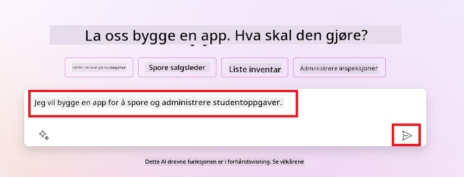
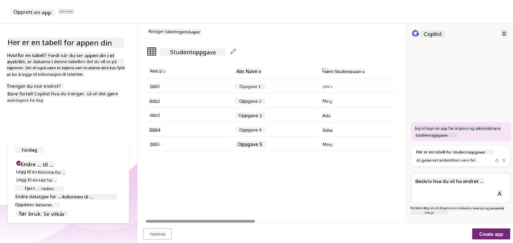
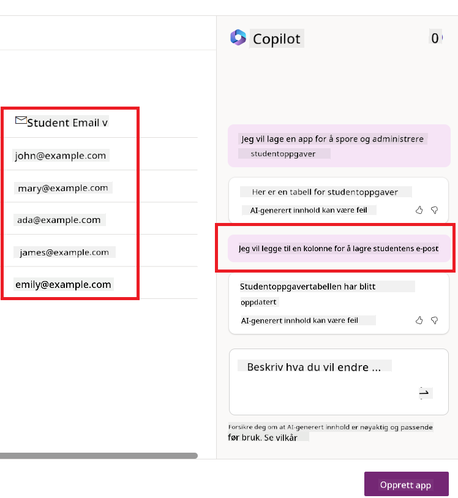
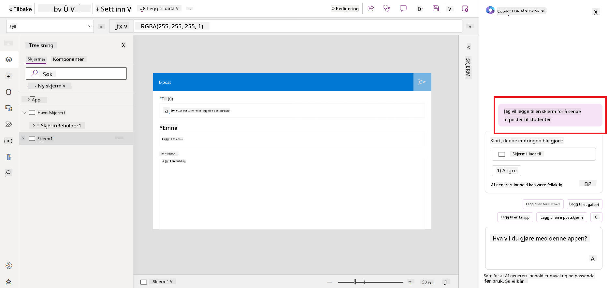
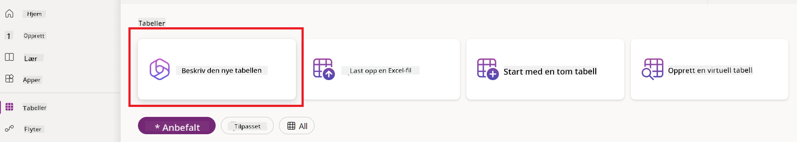
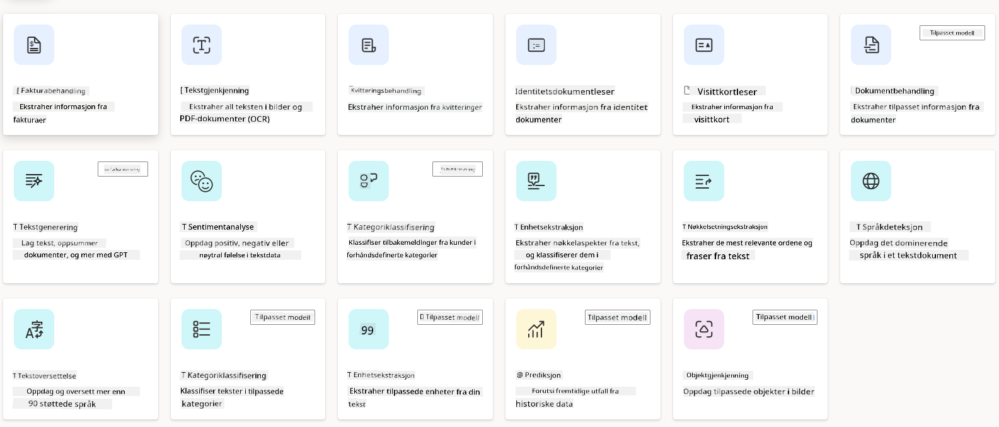
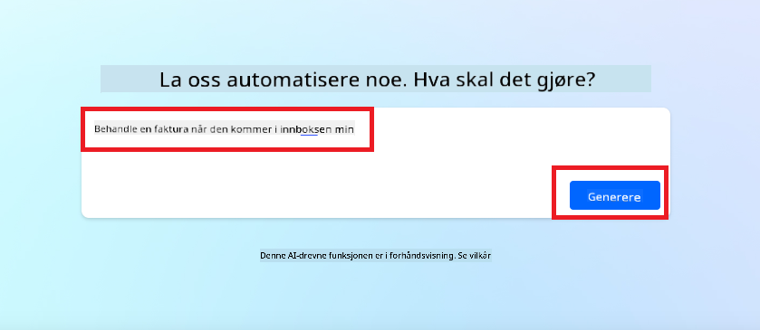
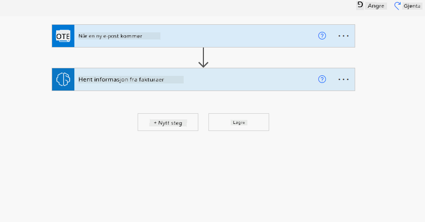
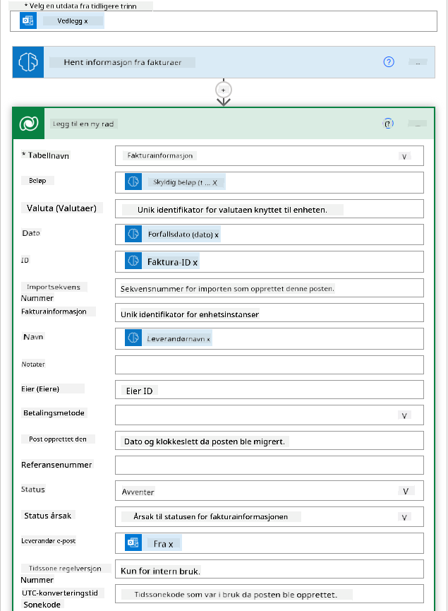
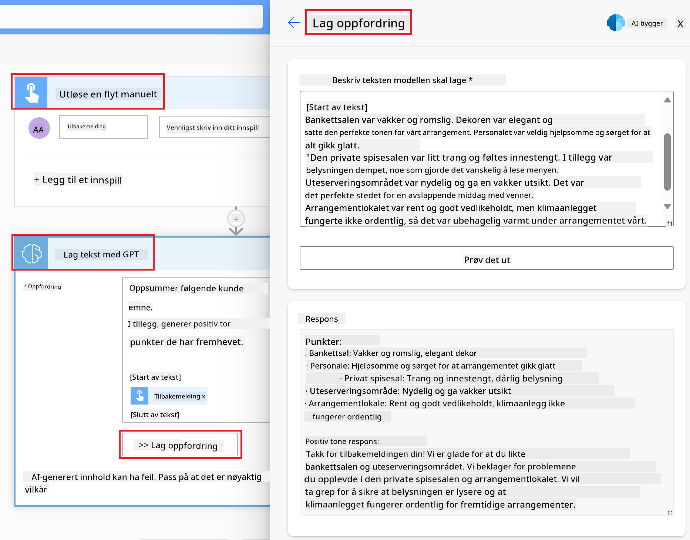

<!--
CO_OP_TRANSLATOR_METADATA:
{
  "original_hash": "f5ff3b6204a695a117d6f452403c95f7",
  "translation_date": "2025-06-25T18:53:43+00:00",
  "source_file": "10-building-low-code-ai-applications/README.md",
  "language_code": "no"
}
-->
# Bygge lavkode AI-applikasjoner

> _(Klikk på bildet ovenfor for å se video av denne leksjonen)_

## Introduksjon

Nå som vi har lært å bygge bildegenererende applikasjoner, la oss snakke om lavkode. Generativ AI kan brukes til en rekke ulike områder, inkludert lavkode, men hva er lavkode og hvordan kan vi legge til AI i det?

Å bygge apper og løsninger har blitt enklere for tradisjonelle utviklere og ikke-utviklere gjennom bruk av lavkodeutviklingsplattformer. Lavkodeutviklingsplattformer lar deg bygge apper og løsninger med lite eller ingen kode. Dette oppnås ved å tilby et visuelt utviklingsmiljø som lar deg dra og slippe komponenter for å bygge apper og løsninger. Dette gjør det mulig å bygge apper og løsninger raskere og med færre ressurser. I denne leksjonen dykker vi dypt inn i hvordan man bruker lavkode og hvordan man forbedrer lavkodeutvikling med AI ved hjelp av Power Platform.

Power Platform gir organisasjoner muligheten til å styrke teamene sine til å bygge sine egne løsninger gjennom et intuitivt lavkode- eller ingen-kode-miljø. Dette miljøet hjelper med å forenkle prosessen med å bygge løsninger. Med Power Platform kan løsninger bygges på dager eller uker i stedet for måneder eller år. Power Platform består av fem nøkkelprodukter: Power Apps, Power Automate, Power BI, Power Pages og Copilot Studio.

Denne leksjonen dekker:

- Introduksjon til generativ AI i Power Platform
- Introduksjon til Copilot og hvordan bruke det
- Bruke generativ AI til å bygge apper og flyter i Power Platform
- Forstå AI-modellene i Power Platform med AI Builder

## Læringsmål

Ved slutten av denne leksjonen vil du kunne:

- Forstå hvordan Copilot fungerer i Power Platform.

- Bygge en app for sporing av studentoppgaver for vår utdanningsstartup.

- Bygge en flyt for fakturabehandling som bruker AI til å trekke ut informasjon fra fakturaer.

- Anvende beste praksis når du bruker opprett tekst med GPT AI-modell.

Verktøyene og teknologiene du vil bruke i denne leksjonen er:

- **Power Apps**, for appen for sporing av studentoppgaver, som gir et lavkodeutviklingsmiljø for å bygge apper for å spore, administrere og samhandle med data.

- **Dataverse**, for å lagre dataene for appen for sporing av studentoppgaver der Dataverse vil gi en lavkodedataplattform for å lagre appens data.

- **Power Automate**, for flyten for fakturabehandling hvor du vil ha et lavkodeutviklingsmiljø for å bygge arbeidsflyter for å automatisere fakturabehandlingsprosessen.

- **AI Builder**, for AI-modellen for fakturabehandling hvor du vil bruke forhåndsbygde AI-modeller for å behandle fakturaene for vår startup.

## Generativ AI i Power Platform

Å forbedre lavkodeutvikling og applikasjon med generativ AI er et sentralt fokusområde for Power Platform. Målet er å gjøre det mulig for alle å bygge AI-drevne apper, nettsteder, dashbord og automatisere prosesser med AI, _uten å kreve noen data science-ekspertise_. Dette målet oppnås ved å integrere generativ AI i lavkodeutviklingsopplevelsen i Power Platform i form av Copilot og AI Builder.

### Hvordan fungerer dette?

Copilot er en AI-assistent som lar deg bygge Power Platform-løsninger ved å beskrive dine krav i en serie samtaleskritt ved hjelp av naturlig språk. Du kan for eksempel instruere AI-assistenten din til å angi hvilke felt appen din vil bruke, og den vil lage både appen og den underliggende datamodellen, eller du kan spesifisere hvordan du setter opp en flyt i Power Automate.

Du kan bruke Copilot-drevne funksjoner som en funksjon i appskjermene dine for å gjøre det mulig for brukere å avdekke innsikt gjennom samtaleinteraksjoner.

AI Builder er en lavkode AI-funksjon tilgjengelig i Power Platform som lar deg bruke AI-modeller for å hjelpe deg med å automatisere prosesser og forutsi utfall. Med AI Builder kan du bringe AI til appene og flytene dine som kobler til dataene dine i Dataverse eller i forskjellige skydatakilder, som SharePoint, OneDrive eller Azure.

Copilot er tilgjengelig i alle Power Platform-produktene: Power Apps, Power Automate, Power BI, Power Pages og Power Virtual Agents. AI Builder er tilgjengelig i Power Apps og Power Automate. I denne leksjonen vil vi fokusere på hvordan man bruker Copilot og AI Builder i Power Apps og Power Automate for å bygge en løsning for vår utdanningsstartup.

### Copilot i Power Apps

Som en del av Power Platform gir Power Apps et lavkodeutviklingsmiljø for å bygge apper for å spore, administrere og samhandle med data. Det er en pakke med apputviklingstjenester med en skalerbar dataplattform og muligheten til å koble til skytjenester og lokale data. Power Apps lar deg bygge apper som kjører på nettlesere, nettbrett og telefoner, og kan deles med kolleger. Power Apps gjør det enkelt for brukere å komme i gang med apputvikling med et enkelt grensesnitt, slik at enhver forretningsbruker eller proffutvikler kan bygge tilpassede apper. Apputviklingsopplevelsen forbedres også med generativ AI gjennom Copilot.

Copilot AI-assistentfunksjonen i Power Apps lar deg beskrive hva slags app du trenger og hvilken informasjon du vil at appen din skal spore, samle inn eller vise. Copilot genererer deretter en responsiv Canvas-app basert på beskrivelsen din. Du kan deretter tilpasse appen for å møte dine behov. AI Copilot genererer også og foreslår en Dataverse-tabell med feltene du trenger for å lagre dataene du vil spore og noen eksempeldata. Vi vil se på hva Dataverse er og hvordan du kan bruke det i Power Apps i denne leksjonen senere. Du kan deretter tilpasse tabellen for å møte dine behov ved hjelp av AI Copilot-assistentfunksjonen gjennom samtaleskritt. Denne funksjonen er lett tilgjengelig fra Power Apps-startskjermen.

### Copilot i Power Automate

Som en del av Power Platform lar Power Automate brukere lage automatiserte arbeidsflyter mellom applikasjoner og tjenester. Det hjelper med å automatisere repeterende forretningsprosesser som kommunikasjon, datainnsamling og beslutningsgodkjenninger. Det enkle grensesnittet gjør det mulig for brukere med alle tekniske ferdigheter (fra nybegynnere til erfarne utviklere) å automatisere arbeidstasks. Arbeidsflytutviklingsopplevelsen forbedres også med generativ AI gjennom Copilot.

Copilot AI-assistentfunksjonen i Power Automate lar deg beskrive hva slags flyt du trenger og hvilke handlinger du vil at flyten din skal utføre. Copilot genererer deretter en flyt basert på beskrivelsen din. Du kan deretter tilpasse flyten for å møte dine behov. AI Copilot genererer også og foreslår handlingene du trenger for å utføre oppgaven du vil automatisere. Vi vil se på hva flyter er og hvordan du kan bruke dem i Power Automate i denne leksjonen senere. Du kan deretter tilpasse handlingene for å møte dine behov ved hjelp av AI Copilot-assistentfunksjonen gjennom samtaleskritt. Denne funksjonen er lett tilgjengelig fra Power Automate-startskjermen.

## Oppgave: Administrer studentoppgaver og fakturaer for vår startup ved hjelp av Copilot

Vår startup tilbyr nettbaserte kurs til studenter. Startuppen har vokst raskt og sliter nå med å holde tritt med etterspørselen etter kursene sine. Startuppen har ansatt deg som Power Platform-utvikler for å hjelpe dem med å bygge en lavkodeløsning for å hjelpe dem med å administrere studentoppgaver og fakturaer. Løsningen deres bør kunne hjelpe dem med å spore og administrere studentoppgaver gjennom en app og automatisere fakturabehandlingsprosessen gjennom en arbeidsflyt. Du har blitt bedt om å bruke generativ AI for å utvikle løsningen.

Når du starter med å bruke Copilot, kan du bruke [Power Platform Copilot Prompt Library](https://github.com/pnp/powerplatform-prompts?WT.mc_id=academic-109639-somelezediko) for å komme i gang med forespørslene. Dette biblioteket inneholder en liste over forespørsler du kan bruke for å bygge apper og flyter med Copilot. Du kan også bruke forespørslene i biblioteket for å få en idé om hvordan du beskriver kravene dine til Copilot.

### Bygg en app for sporing av studentoppgaver for vår startup

Lærerne ved vår startup har slitt med å holde oversikt over studentoppgaver. De har brukt et regneark for å spore oppgavene, men dette har blitt vanskelig å administrere ettersom antallet studenter har økt. De har bedt deg om å bygge en app som vil hjelpe dem med å spore og administrere studentoppgaver. Appen bør gjøre det mulig for dem å legge til nye oppgaver, se oppgaver, oppdatere oppgaver og slette oppgaver. Appen bør også gjøre det mulig for lærere og studenter å se oppgavene som har blitt vurdert og de som ikke har blitt vurdert.

Du vil bygge appen ved å bruke Copilot i Power Apps ved å følge trinnene nedenfor:

1. Gå til [Power Apps](https://make.powerapps.com?WT.mc_id=academic-105485-koreyst) startskjerm.

1. Bruk tekstområdet på startskjermen for å beskrive appen du vil bygge. For eksempel, **_Jeg vil bygge en app for å spore og administrere studentoppgaver_**. Klikk på **Send**-knappen for å sende forespørselen til AI Copilot.

1. AI Copilot vil foreslå en Dataverse-tabell med feltene du trenger for å lagre dataene du vil spore og noen eksempeldata. Du kan deretter tilpasse tabellen for å møte dine behov ved hjelp av AI Copilot-assistentfunksjonen gjennom samtaleskritt.

   > **Viktig**: Dataverse er den underliggende dataplattformen for Power Platform. Det er en lavkodedataplattform for å lagre appens data. Det er en fullt administrert tjeneste som sikkert lagrer data i Microsoft Cloud og er klargjort innenfor ditt Power Platform-miljø. Den kommer med innebygde datastyringsfunksjoner, som dataklassifisering, datalinje, finkornet tilgangskontroll og mer. Du kan lære mer om Dataverse [her](https://docs.microsoft.com/powerapps/maker/data-platform/data-platform-intro?WT.mc_id=academic-109639-somelezediko).

   

1. Lærerne ønsker å sende e-post til studentene som har levert oppgavene sine for å holde dem oppdatert på fremdriften av oppgavene sine. Du kan bruke Copilot til å legge til et nytt felt i tabellen for å lagre studentens e-post. For eksempel kan du bruke følgende forespørsel for å legge til et nytt felt i tabellen: **_Jeg vil legge til en kolonne for å lagre studentens e-post_**. Klikk på **Send**-knappen for å sende forespørselen til AI Copilot.

1. AI Copilot vil generere et nytt felt, og du kan deretter tilpasse feltet for å møte dine behov.

1. Når du er ferdig med tabellen, klikk på **Opprett app**-knappen for å opprette appen.

1. AI Copilot vil generere en responsiv Canvas-app basert på beskrivelsen din. Du kan deretter tilpasse appen for å møte dine behov.

1. For at lærere skal kunne sende e-poster til studenter, kan du bruke Copilot til å legge til en ny skjerm i appen. For eksempel kan du bruke følgende forespørsel for å legge til en ny skjerm i appen: **_Jeg vil legge til en skjerm for å sende e-poster til studenter_**. Klikk på **Send**-knappen for å sende forespørselen til AI Copilot.

1. AI Copilot vil generere en ny skjerm, og du kan deretter tilpasse skjermen for å møte dine behov.

1. Når du er ferdig med appen, klikk på **Lagre**-knappen for å lagre appen.

1. For å dele appen med lærerne, klikk på **Del**-knappen og klikk deretter på **Del**-knappen igjen. Du kan deretter dele appen med lærerne ved å skrive inn deres e-postadresser.

> **Din hjemmelekse**: Appen du nettopp bygde er en god start, men kan forbedres. Med e-postfunksjonen kan lærere bare sende e-poster til studenter manuelt ved å måtte skrive e-postene deres. Kan du bruke Copilot til å bygge en automatisering som gjør det mulig for lærere å sende e-poster til studenter automatisk når de leverer oppgavene sine? Ditt hint er at med riktig forespørsel kan du bruke Copilot i Power Automate for å bygge dette.

### Bygg en fakturainformasjonstabell for vår startup

Finansavdelingen i vår startup har slitt med å holde oversikt over fakturaer. De har brukt et regneark for å spore fakturaene, men dette har blitt vanskelig å administrere ettersom antallet fakturaer har økt. De har bedt deg om å bygge en tabell som vil hjelpe dem med å lagre, spore og administrere informasjonen om fakturaene de mottar. Tabellen skal brukes til å bygge en automatisering som vil trekke ut all fakturainformasjon og lagre den i tabellen. Tabellen skal også gjøre det mulig for finansavdelingen å se fakturaene som er betalt og de som ikke er betalt.

Power Platform har en underliggende dataplattform kalt Dataverse som lar deg lagre dataene for appene og løsningene dine. Dataverse gir en lavkodedataplattform for å lagre appens data. Det er en fullt administrert tjeneste som sikkert lagrer data i Microsoft Cloud og er klargjort innenfor ditt Power Platform-miljø. Det kommer med innebygde datastyringsfunksjoner, som dataklassifisering, datalinje, finkornet tilgangskontroll og mer. Du kan lære mer [om Dataverse her](https://docs.microsoft.com/powerapps/maker/data-platform/data-platform-intro?WT.mc_id=academic-109639-somelezediko).

Hvorfor skal vi bruke Dataverse for vår startup? De standard- og tilpassede tabellene i Dataverse gir et sikkert og skybasert lagringsalternativ for dataene dine. Tabeller lar deg lagre forskjellige typer data, på samme måte som du kanskje bruker flere regneark i en enkelt Excel-arbeidsbok. Du kan bruke tabeller til å lagre data som er spesifikke for organisasjonen eller forretningsbehovene dine. Noen av fordelene vår startup vil få fra å bruke Dataverse inkluderer, men er ikke begrenset til:

- **Enkelt å administrere**: Både metadataene og dataene lagres i skyen, så du trenger ikke å bekymre deg for detaljene om hvordan de lagres eller administreres. Du kan fokusere på å bygge appene og løsningene dine.

- **Sikker**: Dataverse gir et sikkert og skybasert lagringsalternativ for dataene dine. Du kan kontrollere hvem som har tilgang til dataene i tabellene dine og hvordan de kan få tilgang til dem ved å bruke rollebasert sikkerhet.

- **Rik metadata**: Datatyper og relasjoner brukes direkte i Power Apps

- **Logikk og validering**: Du kan bruke forretningsregler, beregnede felt og valideringsregler for å håndheve forretningslogikk og opprettholde datanøyaktighet.

Nå som du vet hva Dataverse er og hvorfor du bør bruke det, la oss se på hvordan du kan bruke Copilot til å opprette en tabell i Dataverse for å møte kravene til vår finansavdeling.

> **Merk**: Du vil bruke denne tabellen i neste seksjon for å bygge en automatisering som vil trekke ut all fakturainformasjon og lagre den i tabellen.
For å opprette en tabell i Dataverse ved hjelp av Copilot, følg trinnene nedenfor: 1. Gå til [Power Apps](https://make.powerapps.com?WT.mc_id=academic-105485-koreyst) startskjerm. 2. På venstre navigasjonsfelt, velg **Tabeller** og klikk deretter på **Beskriv den nye tabellen**.  1. På **Beskriv den nye tabellen**-skjermen, bruk tekstområdet for å beskrive tabellen du vil opprette. For eksempel, **_Jeg vil opprette en tabell for å lagre fakturainformasjon_**. Klikk på **Send**-knappen for å
en tekst. - **Sentimentanalyse**: Denne modellen oppdager positiv, negativ, nøytral eller blandet sentiment i tekst. - **Visittkortleser**: Denne modellen henter ut informasjon fra visittkort. - **Tekstgjenkjenning**: Denne modellen henter ut tekst fra bilder. - **Objektdeteksjon**: Denne modellen oppdager og henter ut objekter fra bilder. - **Dokumentbehandling**: Denne modellen henter ut informasjon fra skjemaer. - **Fakturabehandling**: Denne modellen henter ut informasjon fra fakturaer. Med tilpassede AI-modeller kan du ta med din egen modell inn i AI Builder slik at den kan fungere som en hvilken som helst tilpasset modell i AI Builder, og lar deg trene modellen ved å bruke dine egne data. Du kan bruke disse modellene til å automatisere prosesser og forutsi resultater både i Power Apps og Power Automate. Når du bruker din egen modell, gjelder det visse begrensninger. Les mer om disse [begrensningene](https://learn.microsoft.com/ai-builder/byo-model#limitations?WT.mc_id=academic-105485-koreyst).  ## Oppgave #2 - Bygg en fakturabehandlingsflyt for vår oppstartsbedrift Finansavdelingen har hatt utfordringer med å behandle fakturaer. De har brukt et regneark for å holde oversikt over fakturaene, men dette har blitt vanskelig å håndtere ettersom antall fakturaer har økt. De har bedt deg om å bygge en arbeidsflyt som vil hjelpe dem med å behandle fakturaer ved hjelp av AI. Arbeidsflyten skal gjøre det mulig for dem å hente ut informasjon fra fakturaer og lagre informasjonen i en Dataverse-tabell. Arbeidsflyten skal også gjøre det mulig for dem å sende en e-post til finansavdelingen med den hentede informasjonen. Nå som du vet hva AI Builder er og hvorfor du bør bruke det, la oss se på hvordan du kan bruke Fakturabehandlingsmodellen i AI Builder, som vi dekket tidligere, til å bygge en arbeidsflyt som vil hjelpe finansavdelingen med å behandle fakturaer. For å bygge en arbeidsflyt som vil hjelpe finansavdelingen med å behandle fakturaer ved hjelp av Fakturabehandlingsmodellen i AI Builder, følg trinnene nedenfor: 1. Naviger til [Power Automate](https://make.powerautomate.com?WT.mc_id=academic-105485-koreyst) startskjerm. 2. Bruk tekstområdet på startskjermen til å beskrive arbeidsflyten du vil bygge. For eksempel, **_Behandle en faktura når den ankommer i innboksen min_**. Klikk på **Send**-knappen for å sende prompten til AI Copilot.  3. AI Copilot vil foreslå handlingene du trenger for å utføre oppgaven du vil automatisere. Du kan klikke på **Neste**-knappen for å gå gjennom de neste trinnene. 4. I neste trinn vil Power Automate be deg sette opp de nødvendige tilkoblingene for flyten. Når du er ferdig, klikker du på **Opprett flyt**-knappen for å opprette flyten. 5. AI Copilot vil generere en flyt, og du kan deretter tilpasse flyten for å møte dine behov. 6. Oppdater utløseren av flyten og sett **Mappe** til mappen der fakturaene vil bli lagret. For eksempel kan du sette mappen til **Innboks**. Klikk på **Vis avanserte alternativer** og sett **Kun med vedlegg** til **Ja**. Dette vil sikre at flyten kun kjøres når en e-post med vedlegg mottas i mappen. 7. Fjern følgende handlinger fra flyten: **HTML til tekst**, **Sammenset**, **Sammenset 2**, **Sammenset 3** og **Sammenset 4** fordi du ikke vil bruke dem. 8. Fjern **Betingelse**-handlingen fra flyten fordi du ikke vil bruke den. Det bør se ut som følgende skjermbilde:  9. Klikk på **Legg til en handling**-knappen og søk etter **Dataverse**. Velg **Legg til en ny rad**-handlingen. 10. På **Hent informasjon fra fakturaer**-handlingen, oppdater **Fakturafil** til å peke på **Vedleggsinnhold** fra e-posten. Dette vil sikre at flyten henter ut informasjon fra fakturavedlegget. 11. Velg **Tabellen** du opprettet tidligere. For eksempel kan du velge **Fakturainformasjon**-tabellen. Velg det dynamiske innholdet fra den forrige handlingen for å fylle ut følgende felt: - ID - Beløp - Dato - Navn - Status - Sett **Status** til **Avventer**. - Leverandørens e-post - Bruk det dynamiske innholdet **Fra** fra **Når en ny e-post ankommer**-utløseren.  12. Når du er ferdig med flyten, klikker du på **Lagre**-knappen for å lagre flyten. Du kan deretter teste flyten ved å sende en e-post med en faktura til mappen du spesifiserte i utløseren. > **Din lekse**: Flyten du nettopp bygde er en god start, nå må du tenke på hvordan du kan bygge en automatisering som vil gjøre det mulig for vår finansavdeling å sende en e-post til leverandøren for å oppdatere dem med den nåværende statusen for deres faktura. Din hint: flyten må kjøre når statusen til fakturaen endres.

## Bruk en tekstgenereringsmodell i Power Automate

Create Text med GPT AI-modellen i AI Builder gjør det mulig for deg å generere tekst basert på en prompt og er drevet av Microsoft Azure OpenAI-tjenesten. Med denne muligheten kan du integrere GPT (Generative Pre-Trained Transformer) teknologi i dine apper og flyter for å bygge en rekke automatiserte flyter og innsiktsfulle applikasjoner.

GPT-modeller gjennomgår omfattende trening på store mengder data, noe som gjør dem i stand til å produsere tekst som ligner menneskespråk når de får en prompt. Når de integreres med arbeidsflytautomatisering, kan AI-modeller som GPT brukes til å effektivisere og automatisere et bredt spekter av oppgaver.

For eksempel kan du bygge flyter for å automatisk generere tekst for en rekke bruksområder, som: utkast til e-poster, produktbeskrivelser, og mer. Du kan også bruke modellen til å generere tekst for en rekke apper, som chatbots og kundeserviceapper som gjør det mulig for kundeserviceagenter å svare effektivt og effektivt på kundespørsmål.

For å lære hvordan du bruker denne AI-modellen i Power Automate, gå gjennom [Legg til intelligens med AI Builder og GPT](https://learn.microsoft.com/training/modules/ai-builder-text-generation/?WT.mc_id=academic-109639-somelezediko) modulen.

## Flott arbeid! Fortsett din læring

Etter å ha fullført denne leksjonen, sjekk ut vår [Generative AI Læringssamling](https://aka.ms/genai-collection?WT.mc_id=academic-105485-koreyst) for å fortsette å heve din Generative AI-kunnskap!

Gå videre til Leksjon 11 der vi skal se på hvordan du kan [integrere Generative AI med funksjonskalling](../11-integrating-with-function-calling/README.md?WT.mc_id=academic-105485-koreyst)!

**Ansvarsfraskrivelse**:  
Dette dokumentet er oversatt ved hjelp av AI-oversettelsestjenesten [Co-op Translator](https://github.com/Azure/co-op-translator). Selv om vi streber etter nøyaktighet, vennligst vær oppmerksom på at automatiserte oversettelser kan inneholde feil eller unøyaktigheter. Det opprinnelige dokumentet på dets opprinnelige språk bør betraktes som den autoritative kilden. For kritisk informasjon anbefales profesjonell menneskelig oversettelse. Vi er ikke ansvarlige for eventuelle misforståelser eller feiltolkninger som oppstår ved bruk av denne oversettelsen.