# Bygge Low Code AI-applikasjoner

[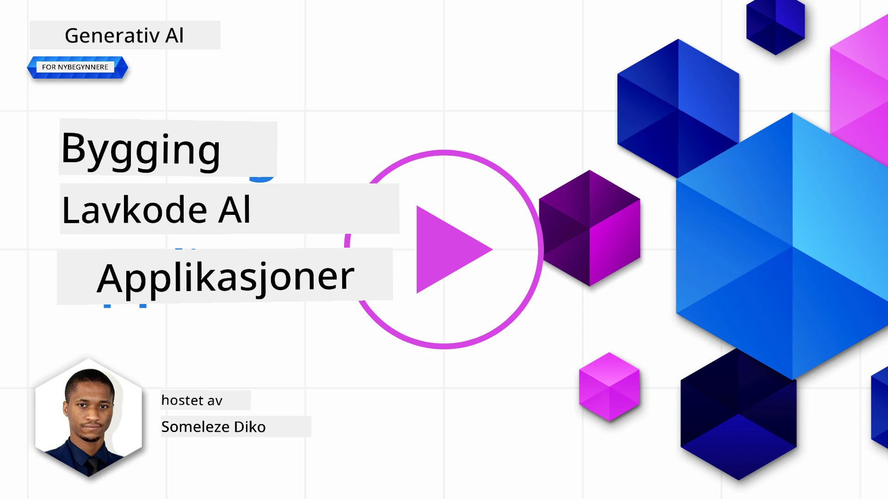](https://youtu.be/1vzq3Nd8GBA?si=h6LHWJXdmqf6mhDg)

> _(Klikk på bildet over for å se videoen av denne leksjonen)_

## Introduksjon

Nå som vi har lært hvordan man bygger bilde-genererende applikasjoner, la oss snakke om low code. Generativ AI kan brukes til en rekke ulike områder, inkludert low code, men hva er low code og hvordan kan vi legge til AI i det?

Å bygge apper og løsninger har blitt enklere for tradisjonelle utviklere og ikke-utviklere gjennom bruk av Low Code Development Platforms. Low Code Development Platforms gjør det mulig å bygge apper og løsninger med lite eller ingen koding. Dette oppnås ved å tilby et visuelt utviklingsmiljø som gjør det mulig å dra og slippe komponenter for å bygge apper og løsninger. Dette gjør at du kan bygge apper og løsninger raskere og med færre ressurser. I denne leksjonen går vi grundig inn på hvordan du bruker Low Code og hvordan du kan forbedre low code-utvikling med AI ved bruk av Power Platform.

Power Platform gir organisasjoner muligheten til å styrke sine team til å bygge sine egne løsninger gjennom et intuitivt low-code eller no-code miljø. Dette miljøet hjelper til med å forenkle prosessen med å bygge løsninger. Med Power Platform kan løsninger bygges på dager eller uker i stedet for måneder eller år. Power Platform består av fem nøkkelprodukter: Power Apps, Power Automate, Power BI, Power Pages og Copilot Studio.

Denne leksjonen dekker:

- Introduksjon til Generativ AI i Power Platform
- Introduksjon til Copilot og hvordan bruke det
- Bruke Generativ AI til å bygge apper og flyter i Power Platform
- Forstå AI-modellene i Power Platform med AI Builder
- Bygge intelligente agenter med Microsoft Copilot Studio

## Læringsmål

Ved slutten av denne leksjonen skal du kunne:

- Forstå hvordan Copilot fungerer i Power Platform.

- Bygge en Student Assignment Tracker-app for vår utdanningsstartup.

- Bygge en fakturabehandlingsflyt som bruker AI for å hente informasjon fra fakturaer.

- Anvende beste praksis når du bruker Create Text med GPT AI-modellen.

- Forstå hva Microsoft Copilot Studio er og hvordan bygge intelligente agenter med det.

Verktøyene og teknologiene du vil bruke i denne leksjonen er:

- **Power Apps**, for Student Assignment Tracker-appen, som gir et low-code utviklingsmiljø for å bygge apper for å spore, administrere og samhandle med data.

- **Dataverse**, for lagring av data for Student Assignment Tracker-appen, hvor Dataverse gir en low-code dataplattform for lagring av appens data.

- **Power Automate**, for fakturabehandlingsflyten der du vil ha et low-code utviklingsmiljø for å bygge arbeidsflyter som automatiserer fakturabehandlingsprosessen.

- **AI Builder**, for fakturabehandlings AI-modellen hvor du bruker forhåndsbygde AI-modeller for å behandle fakturaene for vår startup.

## Generativ AI i Power Platform

Å forbedre low-code-utvikling og applikasjoner med generativ AI er et sentralt fokusområde for Power Platform. Målet er å gjøre det mulig for alle å bygge AI-drevne apper, nettsteder, dashbord og automatisere prosesser med AI, _uten å kreve noen datavitenskapelig ekspertise_. Dette målet oppnås ved å integrere generativ AI i low-code-utviklingsopplevelsen i Power Platform i form av Copilot og AI Builder.

### Hvordan fungerer dette?

Copilot er en AI-assistent som gjør det mulig å bygge Power Platform-løsninger ved å beskrive kravene dine i en serie av konversasjonelle steg ved bruk av naturlig språk. Du kan for eksempel instruere AI-assistenten til å angi hvilke felt appen din vil bruke, og den vil lage både appen og den underliggende datamodellen, eller du kan spesifisere hvordan du skal sette opp en flyt i Power Automate.

Du kan bruke Copilot-drevne funksjoner som en funksjon i appskjermene dine for å la brukere avdekke innsikter gjennom konversasjonelle interaksjoner.

AI Builder er en low-code AI-mulighet tilgjengelig i Power Platform som gjør det mulig å bruke AI-modeller for å automatisere prosesser og forutsi utfall. Med AI Builder kan du bringe AI til appene og flytene dine som kobles til dataene dine i Dataverse eller i forskjellige skybaserte datakilder, som SharePoint, OneDrive eller Azure.

Copilot er tilgjengelig i alle Power Platform-produktene: Power Apps, Power Automate, Power BI, Power Pages og Copilot Studio (tidligere Power Virtual Agents). AI Builder er tilgjengelig i Power Apps og Power Automate. I denne leksjonen vil vi fokusere på hvordan bruke Copilot og AI Builder i Power Apps og Power Automate for å bygge en løsning for vår utdanningsstartup.

### Copilot i Power Apps

Som en del av Power Platform tilbyr Power Apps et low-code utviklingsmiljø for å bygge apper for å spore, administrere og samhandle med data. Det er en pakke med app-utviklingstjenester med en skalerbar dataplattform og mulighet til å koble til skytjenester og lokale data. Power Apps lar deg bygge apper som kjører på nettlesere, nettbrett og telefoner, og kan deles med kollegaer. Power Apps gjør det enklere for brukere å komme i gang med apputvikling med et enkelt grensesnitt, slik at enhver forretningsbruker eller profesjonell utvikler kan bygge tilpassede apper. App-utviklingsopplevelsen forbedres også med Generativ AI gjennom Copilot.

Copilot AI-assistentfunksjonen i Power Apps gjør det mulig å beskrive hvilken type app du trenger og hvilken informasjon du vil at appen skal spore, samle eller vise. Copilot genererer deretter en responsiv Canvas-app basert på beskrivelsen din. Du kan deretter tilpasse appen for å dekke dine behov. AI Copilot genererer også og foreslår en Dataverse-tabell med feltene du trenger for å lagre dataene du vil spore og noen eksempedata. Vi vil se på hva Dataverse er og hvordan du kan bruke det i Power Apps senere i denne leksjonen. Du kan så tilpasse tabellen for å dekke dine behov ved hjelp av AI Copilot-assistentfunksjonen gjennom konversasjonelle steg. Denne funksjonen er lett tilgjengelig fra Power Apps-startskjermen.

### Copilot i Power Automate

Som en del av Power Platform lar Power Automate brukere lage automatiserte arbeidsflyter mellom applikasjoner og tjenester. Det hjelper med å automatisere repeterende forretningsprosesser som kommunikasjon, datainnsamling og beslutningsgodkjenninger. Det enkle grensesnittet gjør det mulig for brukere med alle tekniske ferdigheter (fra nybegynnere til erfarne utviklere) å automatisere arbeidsoppgaver. Arbeidsflytutviklingsopplevelsen forbedres også med Generativ AI gjennom Copilot.

Copilot AI-assistentfunksjonen i Power Automate gjør det mulig å beskrive hvilken type flyt du trenger og hvilke handlinger du vil at flyten skal utføre. Copilot genererer deretter en flyt basert på beskrivelsen din. Du kan så tilpasse flyten for å dekke dine behov. AI Copilot genererer også og foreslår handlingene du trenger for å utføre oppgaven du vil automatisere. Vi vil se på hva flyter er og hvordan du kan bruke dem i Power Automate senere i denne leksjonen. Du kan så tilpasse handlingene for å dekke dine behov ved hjelp av AI Copilot-assistentfunksjonen gjennom konversasjonelle steg. Denne funksjonen er lett tilgjengelig fra Power Automate-startskjermen.

## Bygge intelligente agenter med Microsoft Copilot Studio

[Microsoft Copilot Studio](https://learn.microsoft.com/microsoft-copilot-studio/fundamentals-what-is-copilot-studio?WT.mc_id=academic-105485-koreyst) (tidligere Power Virtual Agents) er low-code-medlemmet i Power Platform for å bygge **AI-agenter** — konversasjonelle copiloter som kan svare på spørsmål, utføre handlinger og automatisere oppgaver på vegne av brukerne dine. Akkurat som resten av Power Platform bygger du disse agentene i en visuell, naturlig språk-først-opplevelse: du beskriver hva du vil at agenten skal gjøre, og Copilot Studio hjelper med å ramme inn instruksjonene, kunnskapen og handlingene.

For vår utdanningsstartup kan du bygge en agent som svarer på studenters spørsmål om kurs, sjekker frister for oppgaver og til og med sender e-post til en instruktør – alt uten å skrive kode.

Her er noen av de nyeste funksjonene som gjør Copilot Studio kraftfullt:

- **Generative svar fra din kunnskap**. I stedet for å håndskrive hver samtale kan du koble til **kunnskapskilder** — offentlige nettsteder, SharePoint, OneDrive, Dataverse, opplastede filer eller bedriftsdata via koblinger — og agenten genererer godt funderte svar basert på dem.

- **Generativ orkestrering**. I stedet for å basere seg på rigide triggerfraser bruker agenten AI til å forstå en forespørsel og dynamisk avgjøre hvilken kunnskap, temaer og handlinger som skal kombineres for å oppfylle forespørselen, inkludert å kjede flere steg sammen.

- **Handlinger og koblinger**. Agenter kan *utføre* oppgaver, ikke bare chatte. Du kan gi en agent handlinger støttet av 1500+ forhåndsbygde Power Platform-koblinger, Power Automate-flyter, tilpassede REST API-er, oppfordringer eller **Model Context Protocol (MCP)**-servere.

- **Autonome agenter**. Agenter er ikke begrenset til å svare i en chatvindu. Du kan bygge **autonome agenter** som trigges av hendelser — som en ny e-post, en ny post i Dataverse eller en fil som blir lastet opp — og så handler i bakgrunnen for å fullføre en oppgave.

- **Multi-agent orkestrering**. Agenter kan kalle på andre agenter. En Copilot Studio-agent kan overføre til, eller utvides av, andre agenter, inkludert agenter publisert til Microsoft 365 Copilot og agenter bygget i Microsoft Foundry.

- **Modellvalg**. I tillegg til de innebygde modellene kan du hente modeller fra Microsoft Foundry-modellkatalogen for å skreddersy hvordan agenten din resonerer og svarer.

- **Publiser hvor som helst**. Når den er bygget, kan en agent publiseres til flere kanaler — Microsoft Teams, Microsoft 365 Copilot, et nettsted eller en egendefinert app, og mer — med sikkerhet, autentisering og analyse administrert gjennom Power Platform-administrasjonsopplevelsen.

Du kan begynne å bygge din første agent på [copilotstudio.microsoft.com](https://copilotstudio.microsoft.com?WT.mc_id=academic-105485-koreyst) og lære mer i [Microsoft Copilot Studio-dokumentasjonen](https://learn.microsoft.com/microsoft-copilot-studio/?WT.mc_id=academic-105485-koreyst).

## Oppgave: Administrere studentoppgaver og fakturaer for vår startup, med Copilot

Vår startup tilbyr nettkurs til studenter. Startupen har vokst raskt og sliter nå med å følge etterspørselen etter kursene sine. Startupen har ansatt deg som Power Platform-utvikler for å hjelpe dem med å bygge en low code-løsning som hjelper dem med å administrere studentoppgaver og fakturaer. Løsningen deres skal kunne hjelpe dem med å spore og administrere studentoppgaver gjennom en app og automatisere fakturabehandlingsprosessen gjennom en arbeidsflyt. Du har blitt bedt om å bruke Generativ AI for å utvikle løsningen.

Når du kommer i gang med å bruke Copilot kan du bruke [Power Platform Copilot Prompt Library](https://github.com/pnp/powerplatform-prompts?WT.mc_id=academic-109639-somelezediko) for å komme i gang med promptene. Dette biblioteket inneholder en liste over prompt du kan bruke for å bygge apper og flyter med Copilot. Du kan også bruke promptene i biblioteket for å få en idé om hvordan du kan beskrive kravene dine til Copilot.

### Bygg en Student Assignment Tracker-app for vår startup

Underviserne ved vår startup har hatt problemer med å følge med på studentoppgaver. De har brukt et regneark for å spore oppgavene, men det har blitt vanskelig å administrere etter hvert som antallet studenter har økt. De har bedt deg om å bygge en app som hjelper dem å spore og administrere studentoppgaver. Appen skal gjøre det mulig å legge til nye oppgaver, se oppgaver, oppdatere oppgaver og slette oppgaver. Appen skal også gjøre det mulig for lærere og studenter å se hvilke oppgaver som er vurdert og hvilke som ikke er vurdert.

Du vil bygge appen ved hjelp av Copilot i Power Apps etter trinnene nedenfor:

1. Naviger til [Power Apps](https://make.powerapps.com?WT.mc_id=academic-105485-koreyst) startskjermen.

1. Bruk tekstområdet på startskjermen til å beskrive appen du vil bygge. For eksempel, **_Jeg vil bygge en app for å spore og administrere studentoppgaver_**. Klikk på **Send**-knappen for å sende prompten til AI Copilot.

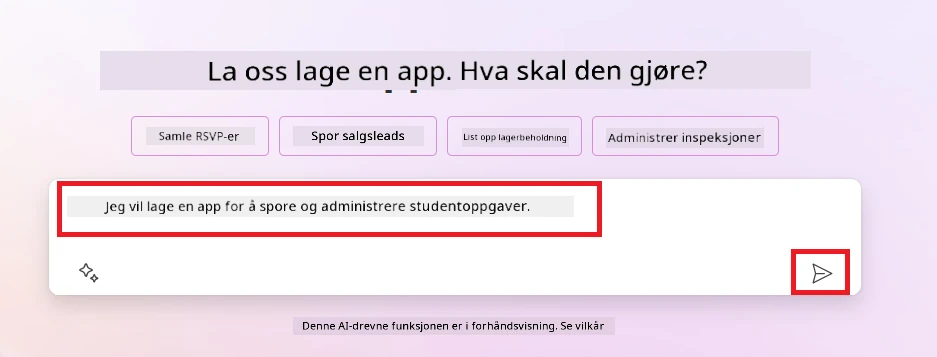

1. AI Copilot vil foreslå en Dataverse-tabell med feltene du trenger for å lagre dataene du vil spore og noen eksempeldatasett. Du kan så tilpasse tabellen for å dekke dine behov ved hjelp av AI Copilot-assistentfunksjonen gjennom konversasjonelle steg.

   > **Viktig**: Dataverse er den underliggende dataplattformen for Power Platform. Det er en low-code dataplattform for lagring av appens data. Det er en fullt administrert tjeneste som lagrer data sikkert i Microsoft Cloud og er satt opp innenfor ditt Power Platform-miljø. Den kommer med innebygde datastyringsmuligheter, som dataklassifisering, dataloggføring, detaljert tilgangskontroll og mer. Du kan lære mer om Dataverse [her](https://learn.microsoft.com/power-apps/maker/data-platform/data-platform-intro?WT.mc_id=academic-109639-somelezediko).

   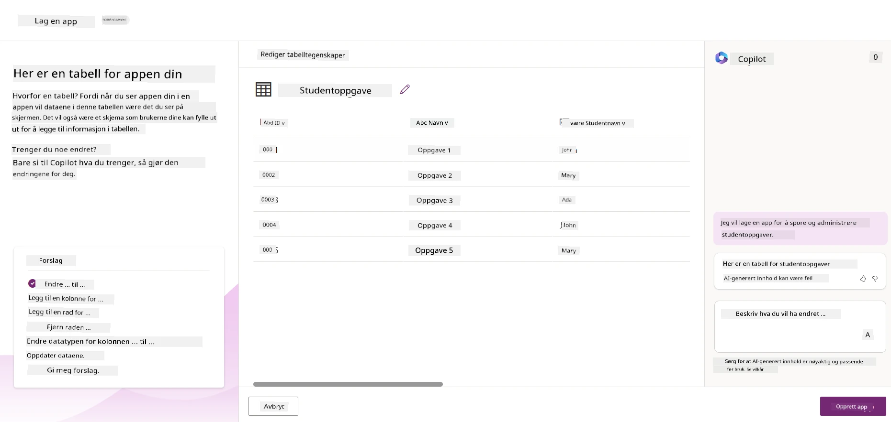

1. Lærerne ønsker å sende e-poster til studentene som har levert inn oppgavene sine for å holde dem oppdatert om fremgangen. Du kan bruke Copilot til å legge til et nytt felt i tabellen for å lagre studentenes e-postadresser. For eksempel, kan du bruke følgende prompt for å legge til et nytt felt i tabellen: **_Jeg vil legge til en kolonne for å lagre studentens e-post_**. Klikk på **Send**-knappen for å sende prompten til AI Copilot.

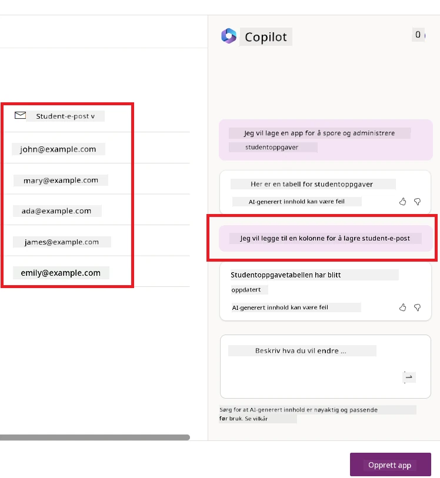

1. AI Copilot vil generere et nytt felt, og du kan deretter tilpasse feltet for å dekke dine behov.

1. Når du er ferdig med tabellen, klikker du på **Opprett app**-knappen for å opprette appen.

1. AI Copilot vil generere en responsiv Canvas-app basert på beskrivelsen din. Du kan deretter tilpasse appen for å møte dine behov.

1. For at lærere skal kunne sende e-post til elever, kan du bruke Copilot til å legge til en ny skjerm i appen. For eksempel kan du bruke følgende prompt for å legge til en ny skjerm i appen: **_Jeg vil legge til en skjerm for å sende e-post til elever_**. Klikk på **Send**-knappen for å sende prompten til AI Copilot.

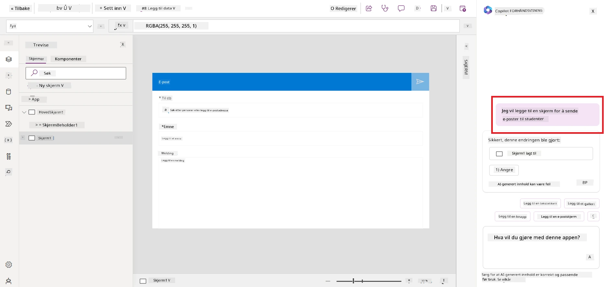

1. AI Copilot vil generere en ny skjerm, og du kan deretter tilpasse skjermen for å møte dine behov.

1. Når du er ferdig med appen, klikker du på **Lagre**-knappen for å lagre appen.

1. For å dele appen med lærerne, klikker du på **Del**-knappen og deretter klikker du på **Del**-knappen igjen. Du kan deretter dele appen med lærerne ved å skrive inn e-postadressene deres.

> **Din lekse**: Appen du nettopp laget er en god start, men kan forbedres. Med e-postfunksjonen kan lærere bare sende e-post til elever manuelt ved å skrive inn e-postadressene deres. Kan du bruke Copilot til å bygge en automatisering som gjør det mulig for lærere å sende e-post til elever automatisk når de leverer oppgavene sine? Hint: med riktig prompt kan du bruke Copilot i Power Automate for å bygge dette.

### Bygg en fakturainformasjonstabell for vår oppstart

Økonomiteamet i oppstarten vår har hatt problemer med å holde oversikt over fakturaer. De har brukt et regneark til å spore fakturaene, men dette har blitt vanskelig å håndtere etter hvert som antallet fakturaer har økt. De har bedt deg om å bygge en tabell som kan hjelpe dem med å lagre, spore og administrere informasjon om fakturaene de mottar. Tabellen skal brukes for å bygge en automatisering som vil hente ut all fakturainformasjon og lagre den i tabellen. Tabellen skal også gjøre det mulig for økonomiteamet å se fakturaer som er betalt og de som ikke er betalt.

Power Platform har en underliggende dataplattform kalt Dataverse som gjør det mulig å lagre data for appene og løsningene dine. Dataverse tilbyr en lavkode-dataplattform for lagring av appens data. Det er en fullstendig administrert tjeneste som sikkert lagrer data i Microsoft Cloud og er satt opp i ditt Power Platform-miljø. Den kommer med innebygde datastyringsfunksjoner, som dataklassifisering, dataleder, detaljert tilgangskontroll med mer. Du kan lære mer [om Dataverse her](https://learn.microsoft.com/power-apps/maker/data-platform/data-platform-intro?WT.mc_id=academic-109639-somelezediko).

Hvorfor bør vi bruke Dataverse for vår oppstart? De standardiserte og egendefinerte tabellene i Dataverse tilbyr en sikker og skybasert lagringsmulighet for dataene dine. Tabeller lar deg lagre forskjellige typer data, på samme måte som du kan bruke flere regneark i en enkelt Excel arbeidsbok. Du kan bruke tabeller til å lagre data som er spesifikke for organisasjonen eller bedriftens behov. Noen av fordelene vår oppstart vil få ved å bruke Dataverse inkluderer, men er ikke begrenset til:

- **Enkel å håndtere**: Både metadata og data lagres i skyen, så du trenger ikke å bekymre deg om detaljene rundt hvordan de lagres eller administreres. Du kan fokusere på å bygge appene og løsningene dine.

- **Sikker**: Dataverse tilbyr en sikker og skybasert lagringsmulighet for dataene dine. Du kan kontrollere hvem som har tilgang til dataene i tabellene dine og hvordan de kan få tilgang ved å bruke rollen basert sikkerhet.

- **Rik metadata**: Datatyper og relasjoner brukes direkte i Power Apps

- **Logikk og validering**: Du kan bruke forretningsregler, kalkulerte felt og valideringsregler for å håndheve forretningslogikk og sikre datanøyaktighet.

Nå som du vet hva Dataverse er og hvorfor du bør bruke det, la oss se på hvordan du kan bruke Copilot til å lage en tabell i Dataverse som møter behovene til økonomiteamet vårt.

> **Merk**: Du vil bruke denne tabellen i neste del for å bygge en automatisering som vil hente ut all fakturainformasjon og lagre den i tabellen.

For å lage en tabell i Dataverse ved å bruke Copilot, følg trinnene nedenfor:

1. Naviger til [Power Apps](https://make.powerapps.com?WT.mc_id=academic-105485-koreyst) startsiden.

2. På venstre navigasjonsmeny, velg **Tabeller**, og klikk deretter på **Beskriv den nye tabellen**.

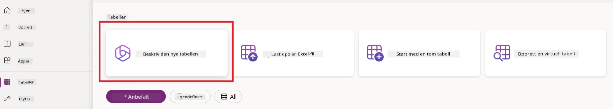

1. På **Beskriv den nye tabellen**-skjermen, bruk tekstområdet til å beskrive tabellen du ønsker å opprette. For eksempel, **_Jeg vil opprette en tabell for å lagre fakturainformasjon_**. Klikk på **Send**-knappen for å sende prompten til AI Copilot.

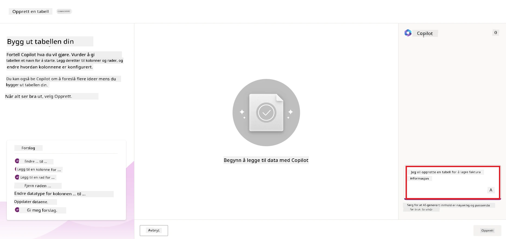

1. AI Copilot vil foreslå en Dataverse-tabell med feltene du trenger for å lagre dataene du ønsker å spore, samt noe eksempeldatasett. Du kan deretter tilpasse tabellen for å møte dine behov ved hjelp av AI Copilot-assistentfunksjonen gjennom samtalebaserte trinn.

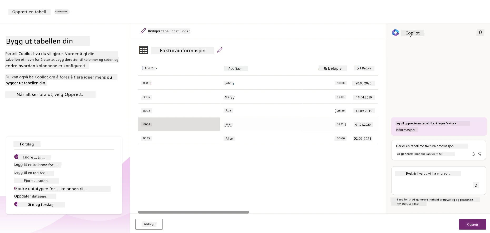

1. Økonomiteamet ønsker å sende en e-post til leverandøren for å oppdatere dem om gjeldende status på fakturaen. Du kan bruke Copilot til å legge til et nytt felt i tabellen for å lagre leverandørens e-postadresse. For eksempel kan du bruke følgende prompt for å legge til en ny kolonne i tabellen: **_Jeg vil legge til en kolonne for lagring av leverandør e-post_**. Klikk på **Send**-knappen for å sende prompten til AI Copilot.

1. AI Copilot vil generere et nytt felt, og du kan deretter tilpasse feltet for å møte dine behov.

1. Når du er ferdig med tabellen, klikker du på **Opprett**-knappen for å opprette tabellen.

## AI-modeller i Power Platform med AI Builder

AI Builder er en lavkode AI-funksjon tilgjengelig i Power Platform som gjør det mulig å bruke AI-modeller for å hjelpe deg å automatisere prosesser og forutsi resultater. Med AI Builder kan du bringe AI til appene og flytene dine som kobler til data i Dataverse eller i ulike skydatakilder, som SharePoint, OneDrive eller Azure.

## Ferdigbygde AI-modeller vs Egendefinerte AI-modeller

AI Builder tilbyr to typer AI-modeller: Ferdigbygde AI-modeller og Egendefinerte AI-modeller. Ferdigbygde AI-modeller er klare til bruk og er trent av Microsoft, og tilgjengelige i Power Platform. Disse hjelper deg med å legge til intelligens i appene og flytene uten at du må samle data, bygge, trene og publisere dine egne modeller. Du kan bruke disse modellene til å automatisere prosesser og forutsi resultater.

Noen av de ferdigbygde AI-modellene som er tilgjengelige i Power Platform inkluderer:

- **Nøkkelfraseuttrekk**: Denne modellen trekker ut nøkkelfraser fra tekst.
- **Språkdeteksjon**: Denne modellen oppdager språket i en tekst.
- **Sentimentanalyse**: Denne modellen oppdager positiv, negativ, nøytral eller blandet følelse i tekst.
- **Visittkortleser**: Denne modellen henter informasjon fra visittkort.
- **Tekstgjenkjenning**: Denne modellen trekker ut tekst fra bilder.
- **Objektdeteksjon**: Denne modellen oppdager og trekker ut objekter fra bilder.
- **Dokumentbehandling**: Denne modellen henter informasjon fra skjemaer.
- **Fakturabehandling**: Denne modellen henter informasjon fra fakturaer.

Med egendefinerte AI-modeller kan du ta med din egen modell inn i AI Builder slik at den fungerer som en hvilken som helst AI Builder egendefinert modell, som lar deg trene modellen med dine egne data. Du kan bruke disse modellene til å automatisere prosesser og forutsi resultater både i Power Apps og Power Automate. Det gjelder noen begrensninger når du bruker din egen modell. Les mer om disse [begrensningene](https://learn.microsoft.com/ai-builder/byo-model#limitations?WT.mc_id=academic-105485-koreyst).

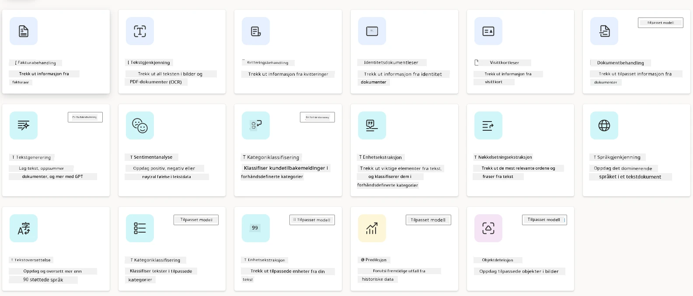

## Oppgave #2 - Bygg en fakturabehandlingsflyt for vår oppstart

Økonomiteamet har strevd med å behandle fakturaer. De har brukt et regneark for å holde oversikt over fakturaene, men dette har blitt vanskelig å håndtere etter hvert som antallet fakturaer har økt. De har bedt deg om å bygge en arbeidsflyt som kan hjelpe dem med å behandle fakturaer ved å bruke AI. Arbeidsflyten skal gjøre det mulig å hente ut informasjon fra fakturaer og lagre informasjonen i en Dataverse-tabell. Arbeidsflyten skal også gjøre det mulig å sende en e-post til økonomiteamet med den innhentede informasjonen.

Nå som du vet hva AI Builder er og hvorfor du bør bruke det, la oss se på hvordan du kan bruke Fakturabehandlings AI-modellen i AI Builder, som vi dekket tidligere, for å bygge en arbeidsflyt som vil hjelpe økonomiteamet å behandle fakturaer.

For å bygge en arbeidsflyt som vil hjelpe økonomiteamet å behandle fakturaer ved hjelp av Fakturabehandlings AI-modellen i AI Builder, følg trinnene nedenfor:

1. Naviger til [Power Automate](https://make.powerautomate.com?WT.mc_id=academic-105485-koreyst) startsiden.

2. Bruk tekstområdet på startsiden for å beskrive arbeidsflyten du ønsker å bygge. For eksempel, **_Behandle en faktura når den ankommer min innboks_**. Klikk på **Send**-knappen for å sende prompten til AI Copilot.

   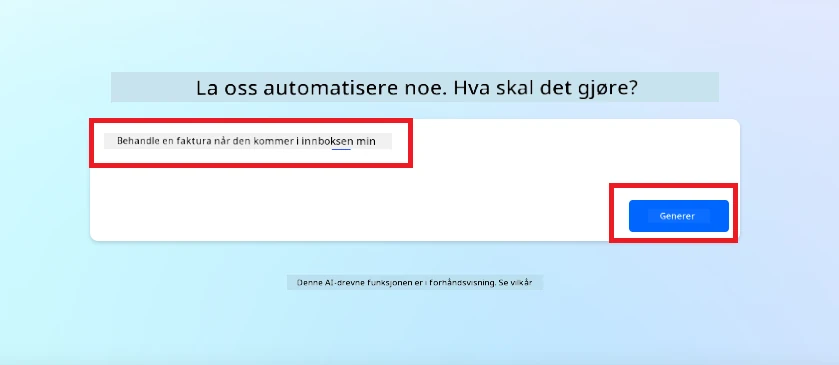

3. AI Copilot vil foreslå handlingene du trenger for å utføre oppgaven du vil automatisere. Du kan klikke på **Neste**-knappen for å gå gjennom de neste trinnene.

4. I neste steg vil Power Automate be deg sette opp tilkoblingene som kreves for flyten. Når du er ferdig, klikker du på **Opprett flyt**-knappen for å lage flyten.

5. AI Copilot vil generere en flyt, og du kan deretter tilpasse flyten for å møte dine behov.

6. Oppdater triggeren for flyten og sett **Mappe** til mappen der fakturaene skal lagres. For eksempel kan du sette mappen til **Innboks**. Klikk på **Vis avanserte alternativer** og sett **Bare med vedlegg** til **Ja**. Dette vil sikre at flyten bare kjører når en e-post med vedlegg mottas i mappen.

7. Fjern følgende handlinger fra flyten: **HTML til tekst**, **Kompiler**, **Kompiler 2**, **Kompiler 3** og **Kompiler 4** fordi du ikke vil bruke dem.

8. Fjern **Betingelse**-handlingen fra flyten fordi du ikke vil bruke den. Det skal se ut som i følgende skjermbilde:

   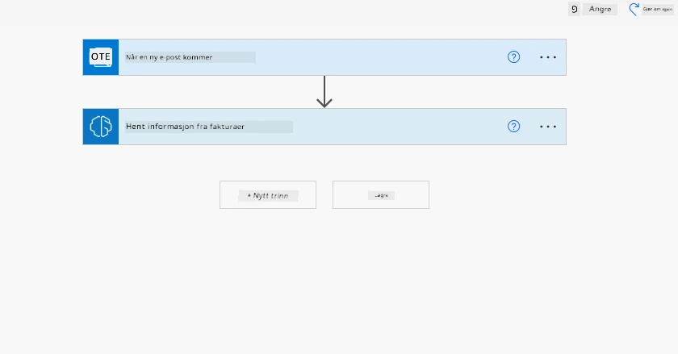

9. Klikk på **Legg til en handling**-knappen og søk etter **Dataverse**. Velg handlingen **Legg til en ny rad**.

10. I handlingen **Hent informasjon fra fakturaer**, oppdater **Faktura-fil** til å peke til **Vedleggsinnhold** fra e-posten. Dette vil sikre at flyten henter informasjon fra fakturavedlegget.

11. Velg **Tabellen** du opprettet tidligere. For eksempel kan du velge **Faktura Informasjon**-tabellen. Velg dynamisk innhold fra den forrige handlingen for å fylle ut følgende felt:

    - ID
    - Beløp
    - Dato
    - Navn
    - Status - Sett **Status** til **Ventende**.
    - Leverandør e-post - Bruk **Fra** dynamisk innhold fra triggeren **Når en ny e-post ankommer**.

    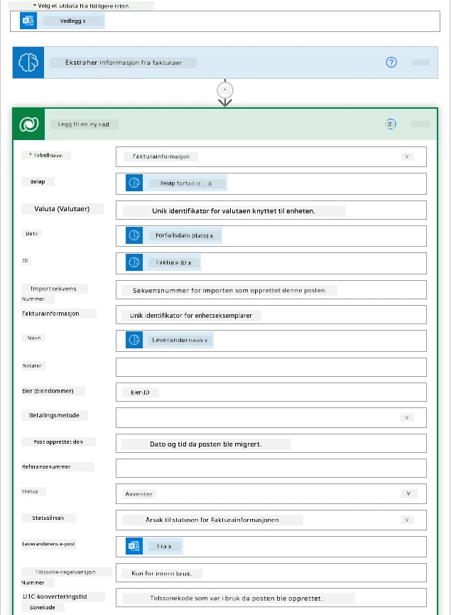

12. Når du er ferdig med flyten, klikker du på **Lagre**-knappen for å lagre flyten. Du kan deretter teste flyten ved å sende en e-post med en faktura til mappen du spesifiserte i triggeren.

> **Din lekse**: Flyten du nettopp bygde er en god start, nå må du tenke på hvordan du kan bygge en automatisering som gjør det mulig for økonomiteamet vårt å sende en e-post til leverandøren for å oppdatere dem om gjeldende status på fakturaen. Hint: flyten må kjøre når status på fakturaen endres.

## Bruk en tekstgenererings-AI-modell i Power Automate

AI-modellen Create Text med GPT i AI Builder gjør det mulig å generere tekst basert på en prompt og drives av Microsoft Azure OpenAI-tjenesten. Med denne funksjonen kan du integrere GPT (Generative Pre-Trained Transformer)-teknologi i appene og flytene dine for å bygge en rekke automatiserte flyter og innsiktsfulle applikasjoner.

GPT-modeller gjennomgår omfattende trening på enorme datamengder, noe som gjør dem i stand til å produsere tekst som ligner menneskelig språk når de får en prompt. Når de integreres med arbeidsflytautomatisering, kan AI-modeller som GPT brukes til å strømline og automatisere en rekke oppgaver.

For eksempel kan du bygge flyter som automatisk genererer tekst for ulike brukstilfeller, som utkast til e-poster, produktbeskrivelser og mer. Du kan også bruke modellen til å generere tekst for forskjellige apper, som chatboter og kundeserviceapper som gjør det mulig for kundeserviceagenter å svare effektivt og raskt på kunders henvendelser.

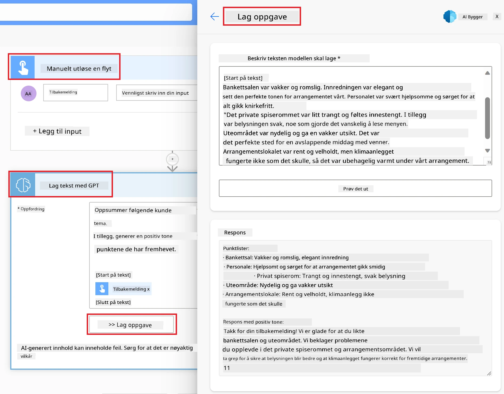

For å lære hvordan du bruker denne AI-modellen i Power Automate, gå gjennom modulen [Legg til intelligens med AI Builder og GPT](https://learn.microsoft.com/training/modules/ai-builder-text-generation/?WT.mc_id=academic-109639-somelezediko).

## Flott arbeid! Fortsett læringen din

Etter å ha fullført denne leksjonen, sjekk ut vår [Generative AI Learning collection](https://aka.ms/genai-collection?WT.mc_id=academic-105485-koreyst) for å fortsette å øke kunnskapen din om Generativ AI!

Vil du tilpasse og få mer ut av Copilot? Utforsk [Awesome Copilot](https://github.com/github/awesome-copilot?WT.mc_id=academic-105485-koreyst) — en felleskap-bidraget samling av instruksjoner, agenter, ferdigheter og konfigurasjoner som hjelper deg å få mest mulig ut av GitHub Copilot.

Gå til leksjon 11 hvor vi skal se på hvordan man kan [integrere Generative AI med Function Calling](../11-integrating-with-function-calling/README.md?WT.mc_id=academic-105485-koreyst)!

---

<!-- CO-OP TRANSLATOR DISCLAIMER START -->
**Ansvarsfraskrivelse**:
Dette dokumentet er oversatt ved hjelp av AI-oversettelsestjenesten [Co-op Translator](https://github.com/Azure/co-op-translator). Selv om vi streber etter nøyaktighet, vær oppmerksom på at automatiske oversettelser kan inneholde feil eller unøyaktigheter. Det opprinnelige dokumentet på originalspråket skal betraktes som den autoritative kilden. For kritisk informasjon anbefales profesjonell menneskelig oversettelse. Vi er ikke ansvarlige for eventuelle misforståelser eller feiltolkninger som oppstår ved bruk av denne oversettelsen.
<!-- CO-OP TRANSLATOR DISCLAIMER END -->