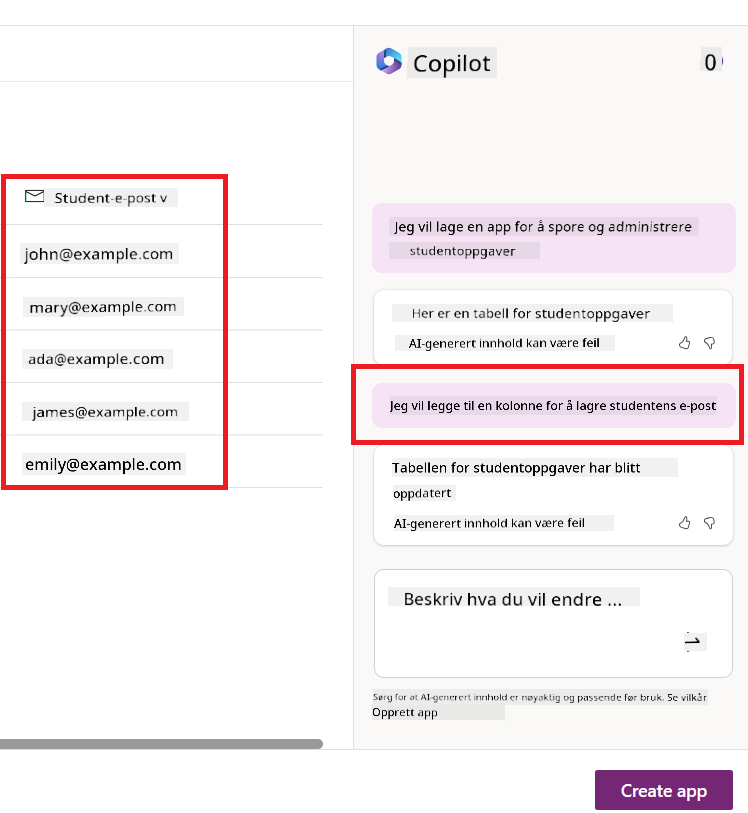
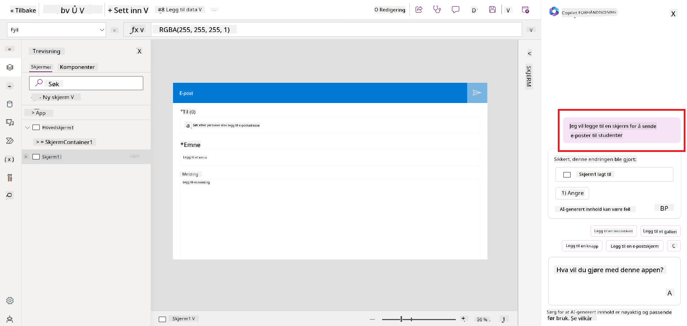
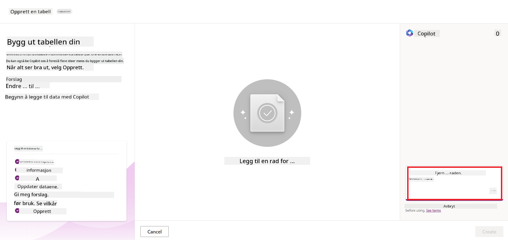
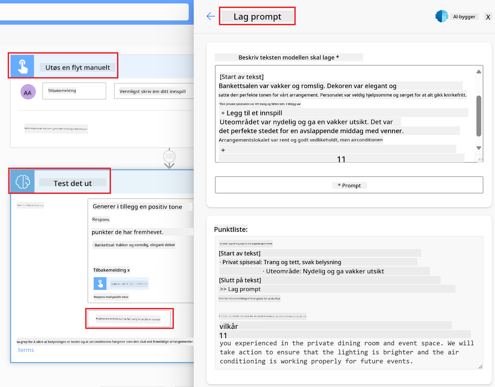

<!--
CO_OP_TRANSLATOR_METADATA:
{
  "original_hash": "846ac8e3b7dcfb697d3309fec05f0fea",
  "translation_date": "2025-10-17T19:21:53+00:00",
  "source_file": "10-building-low-code-ai-applications/README.md",
  "language_code": "no"
}
-->
# Bygge lavkode AI-applikasjoner

> _(Klikk på bildet over for å se videoen til denne leksjonen)_

## Introduksjon

Nå som vi har lært hvordan vi kan bygge applikasjoner for bildegenerering, la oss snakke om lavkode. Generativ AI kan brukes på en rekke områder, inkludert lavkode, men hva er egentlig lavkode, og hvordan kan vi integrere AI i det?

Å bygge applikasjoner og løsninger har blitt enklere for både tradisjonelle utviklere og ikke-utviklere gjennom bruk av lavkode utviklingsplattformer. Lavkode utviklingsplattformer gjør det mulig å bygge applikasjoner og løsninger med lite eller ingen kode. Dette oppnås ved å tilby et visuelt utviklingsmiljø som lar deg dra og slippe komponenter for å bygge applikasjoner og løsninger. Dette gjør det mulig å bygge applikasjoner og løsninger raskere og med færre ressurser. I denne leksjonen går vi i dybden på hvordan man bruker lavkode og hvordan man kan forbedre lavkodeutvikling med AI ved hjelp av Power Platform.

Power Platform gir organisasjoner muligheten til å styrke sine team til å bygge egne løsninger gjennom et intuitivt lavkode- eller kodefritt miljø. Dette miljøet forenkler prosessen med å bygge løsninger. Med Power Platform kan løsninger bygges på dager eller uker i stedet for måneder eller år. Power Platform består av fem nøkkelprodukter: Power Apps, Power Automate, Power BI, Power Pages og Copilot Studio.

Denne leksjonen dekker:

- Introduksjon til generativ AI i Power Platform
- Introduksjon til Copilot og hvordan man bruker det
- Bruke generativ AI til å bygge applikasjoner og arbeidsflyter i Power Platform
- Forstå AI-modellene i Power Platform med AI Builder

## Læringsmål

Ved slutten av denne leksjonen vil du kunne:

- Forstå hvordan Copilot fungerer i Power Platform.

- Bygge en applikasjon for å spore studentoppgaver for vår utdanningsstartup.

- Bygge en arbeidsflyt for fakturabehandling som bruker AI til å hente informasjon fra fakturaer.

- Anvende beste praksis når du bruker "Create Text with GPT AI Model".

Verktøyene og teknologiene du vil bruke i denne leksjonen er:

- **Power Apps**, for applikasjonen som sporer studentoppgaver, som gir et lavkode utviklingsmiljø for å bygge applikasjoner for å spore, administrere og interagere med data.

- **Dataverse**, for lagring av dataene til applikasjonen som sporer studentoppgaver, der Dataverse gir en lavkode dataplattform for lagring av appens data.

- **Power Automate**, for arbeidsflyten for fakturabehandling, der du vil ha et lavkode utviklingsmiljø for å bygge arbeidsflyter for å automatisere fakturabehandlingsprosessen.

- **AI Builder**, for AI-modellen for fakturabehandling, der du vil bruke forhåndsbygde AI-modeller til å behandle fakturaene for vår startup.

## Generativ AI i Power Platform

Å forbedre lavkodeutvikling og applikasjoner med generativ AI er et viktig fokusområde for Power Platform. Målet er å gjøre det mulig for alle å bygge AI-drevne applikasjoner, nettsteder, dashbord og automatisere prosesser med AI, _uten å kreve noen ekspertise innen datavitenskap_. Dette målet oppnås ved å integrere generativ AI i lavkodeutviklingsopplevelsen i Power Platform i form av Copilot og AI Builder.

### Hvordan fungerer dette?

Copilot er en AI-assistent som lar deg bygge Power Platform-løsninger ved å beskrive dine krav i en serie samtalesteg ved hjelp av naturlig språk. Du kan for eksempel instruere AI-assistenten til å angi hvilke felt appen din skal bruke, og den vil opprette både appen og den underliggende datamodellen, eller du kan spesifisere hvordan du setter opp en arbeidsflyt i Power Automate.

Du kan bruke Copilot-drevne funksjoner som en funksjon i appskjermene dine for å gjøre det mulig for brukere å avdekke innsikt gjennom samtaleinteraksjoner.

AI Builder er en lavkode AI-funksjonalitet tilgjengelig i Power Platform som lar deg bruke AI-modeller for å hjelpe deg med å automatisere prosesser og forutsi resultater. Med AI Builder kan du bringe AI til appene og arbeidsflytene dine som kobles til dataene dine i Dataverse eller i ulike skylagringskilder, som SharePoint, OneDrive eller Azure.

Copilot er tilgjengelig i alle Power Platform-produktene: Power Apps, Power Automate, Power BI, Power Pages og Power Virtual Agents. AI Builder er tilgjengelig i Power Apps og Power Automate. I denne leksjonen vil vi fokusere på hvordan man bruker Copilot og AI Builder i Power Apps og Power Automate for å bygge en løsning for vår utdanningsstartup.

### Copilot i Power Apps

Som en del av Power Platform gir Power Apps et lavkode utviklingsmiljø for å bygge applikasjoner for å spore, administrere og interagere med data. Det er en suite av apputviklingstjenester med en skalerbar dataplattform og muligheten til å koble til skytjenester og lokale data. Power Apps lar deg bygge applikasjoner som kjører på nettlesere, nettbrett og telefoner, og som kan deles med kolleger. Power Apps gjør det enkelt for brukere å komme i gang med apputvikling gjennom et enkelt grensesnitt, slik at enhver forretningsbruker eller profesjonell utvikler kan bygge tilpassede applikasjoner. Apputviklingsopplevelsen forbedres også med generativ AI gjennom Copilot.

Copilot AI-assistentfunksjonen i Power Apps lar deg beskrive hvilken type app du trenger og hvilken informasjon du vil at appen din skal spore, samle inn eller vise. Copilot genererer deretter en responsiv Canvas-app basert på beskrivelsen din. Du kan deretter tilpasse appen for å møte dine behov. AI Copilot genererer også og foreslår en Dataverse-tabell med feltene du trenger for å lagre dataene du vil spore, samt noen eksempler på data. Vi vil se nærmere på hva Dataverse er og hvordan du kan bruke det i Power Apps senere i denne leksjonen. Du kan deretter tilpasse tabellen for å møte dine behov ved hjelp av AI Copilot-assistentfunksjonen gjennom samtalesteg. Denne funksjonen er lett tilgjengelig fra Power Apps-startskjermen.

### Copilot i Power Automate

Som en del av Power Platform lar Power Automate brukere opprette automatiserte arbeidsflyter mellom applikasjoner og tjenester. Det hjelper med å automatisere repeterende forretningsprosesser som kommunikasjon, datainnsamling og godkjenning av beslutninger. Det enkle grensesnittet gjør det mulig for brukere med alle tekniske ferdighetsnivåer (fra nybegynnere til erfarne utviklere) å automatisere arbeidsoppgaver. Arbeidsflytutviklingsopplevelsen forbedres også med generativ AI gjennom Copilot.

Copilot AI-assistentfunksjonen i Power Automate lar deg beskrive hvilken type arbeidsflyt du trenger og hvilke handlinger du vil at arbeidsflyten din skal utføre. Copilot genererer deretter en arbeidsflyt basert på beskrivelsen din. Du kan deretter tilpasse arbeidsflyten for å møte dine behov. AI Copilot genererer også og foreslår handlingene du trenger for å utføre oppgaven du vil automatisere. Vi vil se nærmere på hva arbeidsflyter er og hvordan du kan bruke dem i Power Automate senere i denne leksjonen. Du kan deretter tilpasse handlingene for å møte dine behov ved hjelp av AI Copilot-assistentfunksjonen gjennom samtalesteg. Denne funksjonen er lett tilgjengelig fra Power Automate-startskjermen.

## Oppgave: Administrer studentoppgaver og fakturaer for vår startup ved hjelp av Copilot

Vår startup tilbyr nettkurs til studenter. Starten har vokst raskt og sliter nå med å holde tritt med etterspørselen etter kursene. Starten har ansatt deg som Power Platform-utvikler for å hjelpe dem med å bygge en lavkode løsning for å administrere studentoppgaver og fakturaer. Løsningen deres bør kunne hjelpe dem med å spore og administrere studentoppgaver gjennom en app og automatisere fakturabehandlingsprosessen gjennom en arbeidsflyt. Du har blitt bedt om å bruke generativ AI til å utvikle løsningen.

Når du begynner å bruke Copilot, kan du bruke [Power Platform Copilot Prompt Library](https://github.com/pnp/powerplatform-prompts?WT.mc_id=academic-109639-somelezediko) for å komme i gang med promptene. Dette biblioteket inneholder en liste over prompts som du kan bruke til å bygge applikasjoner og arbeidsflyter med Copilot. Du kan også bruke promptene i biblioteket for å få en idé om hvordan du beskriver dine krav til Copilot.

### Bygg en applikasjon for å spore studentoppgaver for vår startup

Lærerne ved vår startup har hatt problemer med å holde oversikt over studentoppgaver. De har brukt et regneark for å spore oppgavene, men dette har blitt vanskelig å administrere ettersom antallet studenter har økt. De har bedt deg om å bygge en app som vil hjelpe dem med å spore og administrere studentoppgaver. Appen bør gjøre det mulig for dem å legge til nye oppgaver, se oppgaver, oppdatere oppgaver og slette oppgaver. Appen bør også gjøre det mulig for lærere og studenter å se hvilke oppgaver som er vurdert og hvilke som ikke er vurdert.

Du vil bygge appen ved hjelp av Copilot i Power Apps ved å følge trinnene nedenfor:

1. Naviger til [Power Apps](https://make.powerapps.com?WT.mc_id=academic-105485-koreyst) startskjermen.

1. Bruk tekstområdet på startskjermen til å beskrive appen du vil bygge. For eksempel: **_Jeg vil bygge en app for å spore og administrere studentoppgaver_**. Klikk på **Send**-knappen for å sende prompten til AI Copilot.

1. AI Copilot vil foreslå en Dataverse-tabell med feltene du trenger for å lagre dataene du vil spore, samt noen eksempler på data. Du kan deretter tilpasse tabellen for å møte dine behov ved hjelp av AI Copilot-assistentfunksjonen gjennom samtalesteg.

   > **Viktig**: Dataverse er den underliggende dataplattformen for Power Platform. Det er en lavkode dataplattform for lagring av appens data. Det er en fullt administrert tjeneste som lagrer data sikkert i Microsoft Cloud og er klargjort innenfor ditt Power Platform-miljø. Den kommer med innebygde datastyringsfunksjoner, som dataklassifisering, dataopprinnelse, finkornet tilgangskontroll og mer. Du kan lære mer om Dataverse [her](https://docs.microsoft.com/powerapps/maker/data-platform/data-platform-intro?WT.mc_id=academic-109639-somelezediko).

   

1. Lærerne ønsker å sende e-poster til studentene som har levert oppgavene sine for å holde dem oppdatert på fremdriften av oppgavene. Du kan bruke Copilot til å legge til et nytt felt i tabellen for å lagre studentens e-post. For eksempel kan du bruke følgende prompt for å legge til et nytt felt i tabellen: **_Jeg vil legge til en kolonne for å lagre studentens e-post_**. Klikk på **Send**-knappen for å sende prompten til AI Copilot.

1. AI Copilot vil generere et nytt felt, og du kan deretter tilpasse feltet for å møte dine behov.

1. Når du er ferdig med tabellen, klikker du på **Opprett app**-knappen for å opprette appen.

1. AI Copilot vil generere en responsiv Canvas-app basert på beskrivelsen din. Du kan deretter tilpasse appen for å møte dine behov.

1. For at lærerne skal kunne sende e-poster til studentene, kan du bruke Copilot til å legge til en ny skjerm i appen. For eksempel kan du bruke følgende prompt for å legge til en ny skjerm i appen: **_Jeg vil legge til en skjerm for å sende e-poster til studentene_**. Klikk på **Send**-knappen for å sende prompten til AI Copilot.

1. AI Copilot vil generere en ny skjerm, og du kan deretter tilpasse skjermen for å møte dine behov.

1. Når du er ferdig med appen, klikker du på **Lagre**-knappen for å lagre appen.

1. For å dele appen med lærerne, klikker du på **Del**-knappen og deretter på **Del**-knappen igjen. Du kan deretter dele appen med lærerne ved å skrive inn deres e-postadresser.

> **Din hjemmelekse**: Appen du nettopp bygde er en god start, men kan forbedres. Med e-postfunksjonen kan lærerne bare sende e-poster til studentene manuelt ved å måtte skrive inn e-postene deres. Kan du bruke Copilot til å bygge en automatisering som gjør det mulig for lærerne å sende e-poster til studentene automatisk når de leverer oppgavene sine? Hint: Med riktig prompt kan du bruke Copilot i Power Automate til å bygge dette.

### Bygg en fakturainformasjonstabell for vår startup

Finansavdelingen i vår startup har hatt problemer med å holde oversikt over fakturaer. De har brukt et regneark for å spore fakturaene, men dette har blitt vanskelig å administrere ettersom antallet fakturaer har økt. De har bedt deg om å bygge en tabell som vil hjelpe dem med å lagre, spore og administrere informasjonen om fakturaene de mottar. Tabellen bør brukes til å bygge en automatisering som vil hente all fakturainformasjon og lagre den i tabellen. Tabellen bør også gjøre det mulig for finansavdelingen å se hvilke fakturaer som er betalt og hvilke som ikke er betalt.

Power Platform har en underliggende dataplattform kalt Dataverse som gjør det mulig å lagre dataene for dine applikasjoner og løsninger. Dataverse gir en lavkode dataplattform for lagring av appens data. Det er en fullt administrert tjeneste som lagrer data sikkert i Microsoft Cloud og er klargjort innenfor ditt Power Platform-miljø. Den kommer med innebygde datastyringsfunksjoner, som dataklassifisering, dataopprinnelse, finkornet tilgangskontroll og mer. Du kan lære mer [om Dataverse her](https://docs.microsoft.com/powerapps/maker/data-platform/data-platform-intro?WT.mc_id=academic-109639-somelezediko).
Hvorfor bør vi bruke Dataverse for vår oppstart? Standard- og tilpassede tabeller i Dataverse gir en sikker og skybasert lagringsløsning for dataene dine. Tabeller lar deg lagre ulike typer data, på samme måte som du kan bruke flere regneark i en enkelt Excel-arbeidsbok. Du kan bruke tabeller til å lagre data som er spesifikke for din organisasjon eller forretningsbehov. Noen av fordelene vår oppstart vil få ved å bruke Dataverse inkluderer, men er ikke begrenset til:

- **Enkelt å administrere**: Både metadata og data lagres i skyen, så du trenger ikke bekymre deg for detaljene rundt hvordan de lagres eller administreres. Du kan fokusere på å bygge appene og løsningene dine.

- **Sikkert**: Dataverse gir en sikker og skybasert lagringsløsning for dataene dine. Du kan kontrollere hvem som har tilgang til dataene i tabellene dine og hvordan de kan få tilgang ved hjelp av rollebasert sikkerhet.

- **Rik metadata**: Datatyper og relasjoner brukes direkte i Power Apps.

- **Logikk og validering**: Du kan bruke forretningsregler, beregnede felt og valideringsregler for å håndheve forretningslogikk og opprettholde datanøyaktighet.

Nå som du vet hva Dataverse er og hvorfor du bør bruke det, la oss se på hvordan du kan bruke Copilot til å opprette en tabell i Dataverse for å møte kravene til vårt økonomiteam.

> **Note**: Du vil bruke denne tabellen i neste seksjon for å bygge en automatisering som vil hente all fakturainformasjon og lagre den i tabellen.

For å opprette en tabell i Dataverse ved hjelp av Copilot, følg trinnene nedenfor:

1. Gå til [Power Apps](https://make.powerapps.com?WT.mc_id=academic-105485-koreyst) startskjermen.

2. På navigasjonslinjen til venstre, velg **Tabeller** og klikk deretter på **Beskriv den nye tabellen**.

3. På skjermen **Beskriv den nye tabellen**, bruk tekstområdet til å beskrive tabellen du vil opprette. For eksempel, **_Jeg vil opprette en tabell for å lagre fakturainformasjon_**. Klikk på **Send**-knappen for å sende forespørselen til AI Copilot.

4. AI Copilot vil foreslå en Dataverse-tabell med feltene du trenger for å lagre dataene du ønsker å spore, samt noen eksempler på data. Du kan deretter tilpasse tabellen etter dine behov ved hjelp av AI Copilot-assistenten gjennom samtalebaserte trinn.

5. Økonomiteamet ønsker å sende en e-post til leverandøren for å oppdatere dem med den nåværende statusen for fakturaen deres. Du kan bruke Copilot til å legge til et nytt felt i tabellen for å lagre leverandørens e-postadresse. For eksempel kan du bruke følgende forespørsel for å legge til et nytt felt i tabellen: **_Jeg vil legge til en kolonne for å lagre leverandørens e-postadresse_**. Klikk på **Send**-knappen for å sende forespørselen til AI Copilot.

6. AI Copilot vil generere et nytt felt, og du kan deretter tilpasse feltet etter dine behov.

7. Når du er ferdig med tabellen, klikker du på **Opprett**-knappen for å opprette tabellen.

## AI-modeller i Power Platform med AI Builder

AI Builder er en lavkode AI-funksjonalitet tilgjengelig i Power Platform som gjør det mulig for deg å bruke AI-modeller for å hjelpe deg med å automatisere prosesser og forutsi resultater. Med AI Builder kan du bringe AI til appene og flytene dine som kobles til dataene dine i Dataverse eller i ulike skybaserte datakilder, som SharePoint, OneDrive eller Azure.

## Ferdiglagde AI-modeller vs Tilpassede AI-modeller

AI Builder tilbyr to typer AI-modeller: Ferdiglagde AI-modeller og Tilpassede AI-modeller. Ferdiglagde AI-modeller er klare til bruk og er trent av Microsoft og tilgjengelige i Power Platform. Disse hjelper deg med å legge til intelligens i appene og flytene dine uten å måtte samle inn data og deretter bygge, trene og publisere dine egne modeller. Du kan bruke disse modellene til å automatisere prosesser og forutsi resultater.

Noen av de ferdiglagde AI-modellene som er tilgjengelige i Power Platform inkluderer:

- **Nøkkelorduttrekk**: Denne modellen trekker ut nøkkelord fra tekst.
- **Språkdeteksjon**: Denne modellen oppdager språket i en tekst.
- **Sentimentanalyse**: Denne modellen oppdager positiv, negativ, nøytral eller blandet sentiment i tekst.
- **Visittkortleser**: Denne modellen trekker ut informasjon fra visittkort.
- **Tekstgjenkjenning**: Denne modellen trekker ut tekst fra bilder.
- **Objektdeteksjon**: Denne modellen oppdager og trekker ut objekter fra bilder.
- **Dokumentbehandling**: Denne modellen trekker ut informasjon fra skjemaer.
- **Fakturabehandling**: Denne modellen trekker ut informasjon fra fakturaer.

Med Tilpassede AI-modeller kan du ta med din egen modell inn i AI Builder slik at den kan fungere som enhver AI Builder-tilpasset modell, og lar deg trene modellen ved hjelp av dine egne data. Du kan bruke disse modellene til å automatisere prosesser og forutsi resultater i både Power Apps og Power Automate. Når du bruker din egen modell, gjelder det visse begrensninger. Les mer om disse [begrensningene](https://learn.microsoft.com/ai-builder/byo-model#limitations?WT.mc_id=academic-105485-koreyst).

## Oppgave #2 - Bygg en fakturabehandlingsflyt for vår oppstart

Økonomiteamet har hatt utfordringer med å behandle fakturaer. De har brukt et regneark for å holde oversikt over fakturaene, men dette har blitt vanskelig å administrere etter hvert som antallet fakturaer har økt. De har bedt deg om å bygge en arbeidsflyt som vil hjelpe dem med å behandle fakturaer ved hjelp av AI. Arbeidsflyten bør gjøre det mulig for dem å trekke ut informasjon fra fakturaer og lagre informasjonen i en Dataverse-tabell. Arbeidsflyten bør også gjøre det mulig for dem å sende en e-post til økonomiteamet med den uttrukne informasjonen.

Nå som du vet hva AI Builder er og hvorfor du bør bruke det, la oss se på hvordan du kan bruke fakturabehandlingsmodellen i AI Builder, som vi dekket tidligere, til å bygge en arbeidsflyt som vil hjelpe økonomiteamet med å behandle fakturaer.

For å bygge en arbeidsflyt som vil hjelpe økonomiteamet med å behandle fakturaer ved hjelp av fakturabehandlingsmodellen i AI Builder, følg trinnene nedenfor:

1. Gå til [Power Automate](https://make.powerautomate.com?WT.mc_id=academic-105485-koreyst) startskjermen.

2. Bruk tekstområdet på startskjermen til å beskrive arbeidsflyten du vil bygge. For eksempel, **_Behandle en faktura når den ankommer innboksen min_**. Klikk på **Send**-knappen for å sende forespørselen til AI Copilot.

   

3. AI Copilot vil foreslå handlingene du trenger for å utføre oppgaven du vil automatisere. Du kan klikke på **Neste**-knappen for å gå gjennom de neste trinnene.

4. I neste trinn vil Power Automate be deg om å sette opp tilkoblingene som kreves for flyten. Når du er ferdig, klikker du på **Opprett flyt**-knappen for å opprette flyten.

5. AI Copilot vil generere en flyt, og du kan deretter tilpasse flyten etter dine behov.

6. Oppdater utløseren for flyten og sett **Mappe** til mappen der fakturaene vil bli lagret. For eksempel kan du sette mappen til **Innboks**. Klikk på **Vis avanserte alternativer** og sett **Kun med vedlegg** til **Ja**. Dette vil sikre at flyten kun kjører når en e-post med et vedlegg mottas i mappen.

7. Fjern følgende handlinger fra flyten: **HTML til tekst**, **Compose**, **Compose 2**, **Compose 3** og **Compose 4**, fordi du ikke vil bruke dem.

8. Fjern **Betingelse**-handlingen fra flyten fordi du ikke vil bruke den. Det bør se ut som følgende skjermbilde:

   

9. Klikk på **Legg til en handling**-knappen og søk etter **Dataverse**. Velg **Legg til en ny rad**-handlingen.

10. På **Trekk ut informasjon fra fakturaer**-handlingen, oppdater **Fakturafil** til å peke til **Vedleggsinnhold** fra e-posten. Dette vil sikre at flyten trekker ut informasjon fra fakturavedlegget.

11. Velg **Tabellen** du opprettet tidligere. For eksempel kan du velge **Fakturainformasjon**-tabellen. Velg det dynamiske innholdet fra den forrige handlingen for å fylle ut følgende felt:

    - ID
    - Beløp
    - Dato
    - Navn
    - Status - Sett **Status** til **Venter**.
    - Leverandørens e-post - Bruk **Fra** dynamisk innhold fra **Når en ny e-post ankommer**-utløseren.

    

12. Når du er ferdig med flyten, klikker du på **Lagre**-knappen for å lagre flyten. Du kan deretter teste flyten ved å sende en e-post med en faktura til mappen du spesifiserte i utløseren.

> **Din oppgave**: Flyten du nettopp bygde er en god start, nå må du tenke på hvordan du kan bygge en automatisering som vil gjøre det mulig for vårt økonomiteam å sende en e-post til leverandøren for å oppdatere dem med den nåværende statusen for fakturaen deres. Hint: Flyten må kjøre når statusen for fakturaen endres.

## Bruk en tekstgenererings-AI-modell i Power Automate

Opprett tekst med GPT AI-modellen i AI Builder gjør det mulig å generere tekst basert på en forespørsel og er drevet av Microsoft Azure OpenAI Service. Med denne funksjonaliteten kan du integrere GPT (Generative Pre-Trained Transformer)-teknologi i appene og flytene dine for å bygge en rekke automatiserte flyter og innsiktsfulle applikasjoner.

GPT-modeller gjennomgår omfattende trening på store mengder data, noe som gjør dem i stand til å produsere tekst som ligner menneskelig språk når de får en forespørsel. Når de integreres med arbeidsflytautomatisering, kan AI-modeller som GPT utnyttes for å effektivisere og automatisere et bredt spekter av oppgaver.

For eksempel kan du bygge flyter for automatisk generering av tekst for ulike bruksområder, som utkast til e-poster, produktbeskrivelser og mer. Du kan også bruke modellen til å generere tekst for ulike applikasjoner, som chatbots og kundeserviceapplikasjoner som gjør det mulig for kundeserviceagenter å svare effektivt og raskt på kundehenvendelser.

For å lære hvordan du bruker denne AI-modellen i Power Automate, gå gjennom [Legg til intelligens med AI Builder og GPT](https://learn.microsoft.com/training/modules/ai-builder-text-generation/?WT.mc_id=academic-109639-somelezediko)-modulen.

## Flott arbeid! Fortsett læringen din

Etter å ha fullført denne leksjonen, sjekk ut vår [Generativ AI læringssamling](https://aka.ms/genai-collection?WT.mc_id=academic-105485-koreyst) for å fortsette å utvikle din kunnskap om generativ AI!

Gå videre til leksjon 11 der vi skal se på hvordan man [integrerer generativ AI med funksjonskall](../11-integrating-with-function-calling/README.md?WT.mc_id=academic-105485-koreyst)!

---

**Ansvarsfraskrivelse**:  
Dette dokumentet er oversatt ved hjelp av AI-oversettelsestjenesten [Co-op Translator](https://github.com/Azure/co-op-translator). Selv om vi streber etter nøyaktighet, vær oppmerksom på at automatiske oversettelser kan inneholde feil eller unøyaktigheter. Det originale dokumentet på dets opprinnelige språk bør anses som den autoritative kilden. For kritisk informasjon anbefales profesjonell menneskelig oversettelse. Vi er ikke ansvarlige for eventuelle misforståelser eller feiltolkninger som oppstår ved bruk av denne oversettelsen.