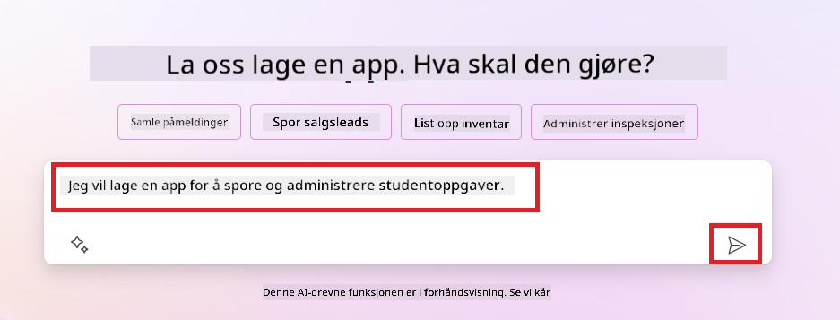
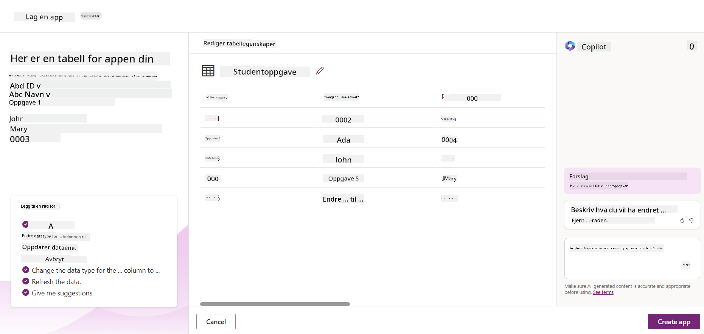

<!--
CO_OP_TRANSLATOR_METADATA:
{
  "original_hash": "f5ff3b6204a695a117d6f452403c95f7",
  "translation_date": "2025-07-09T14:03:08+00:00",
  "source_file": "10-building-low-code-ai-applications/README.md",
  "language_code": "no"
}
-->
# Bygge lavkode AI-applikasjoner

> _(Klikk på bildet over for å se video av denne leksjonen)_

## Introduksjon

Nå som vi har lært hvordan man bygger applikasjoner som genererer bilder, la oss snakke om lavkode. Generativ AI kan brukes innen mange ulike områder, inkludert lavkode, men hva er egentlig lavkode, og hvordan kan vi legge til AI i det?

Å bygge apper og løsninger har blitt enklere for både tradisjonelle utviklere og ikke-utviklere ved hjelp av lavkodeutviklingsplattformer. Lavkodeutviklingsplattformer gjør det mulig å bygge apper og løsninger med lite eller ingen koding. Dette oppnås ved å tilby et visuelt utviklingsmiljø hvor du kan dra og slippe komponenter for å bygge apper og løsninger. Dette gjør at du kan utvikle apper og løsninger raskere og med færre ressurser. I denne leksjonen går vi i dybden på hvordan man bruker lavkode og hvordan man kan forbedre lavkodeutvikling med AI ved hjelp av Power Platform.

Power Platform gir organisasjoner muligheten til å styrke teamene sine slik at de kan bygge egne løsninger gjennom et intuitivt lavkode- eller nokode-miljø. Dette miljøet forenkler prosessen med å bygge løsninger. Med Power Platform kan løsninger bygges på dager eller uker i stedet for måneder eller år. Power Platform består av fem nøkkelprodukter: Power Apps, Power Automate, Power BI, Power Pages og Copilot Studio.

Denne leksjonen dekker:

- Introduksjon til generativ AI i Power Platform  
- Introduksjon til Copilot og hvordan bruke det  
- Bruke generativ AI til å bygge apper og flyter i Power Platform  
- Forstå AI-modellene i Power Platform med AI Builder  

## Læringsmål

Etter denne leksjonen skal du kunne:

- Forstå hvordan Copilot fungerer i Power Platform.  
- Bygge en Student Assignment Tracker-app for vår utdanningsstartup.  
- Bygge en fakturabehandlingsflyt som bruker AI til å hente informasjon fra fakturaer.  
- Anvende beste praksis ved bruk av Create Text med GPT AI-modellen.  

Verktøyene og teknologiene du vil bruke i denne leksjonen er:

- **Power Apps**, for Student Assignment Tracker-appen, som tilbyr et lavkodeutviklingsmiljø for å bygge apper som sporer, administrerer og samhandler med data.  
- **Dataverse**, for lagring av data til Student Assignment Tracker-appen, hvor Dataverse gir en lavkode dataplattform for lagring av appens data.  
- **Power Automate**, for fakturabehandlingsflyten, hvor du får et lavkodeutviklingsmiljø for å bygge arbeidsflyter som automatiserer fakturabehandlingsprosessen.  
- **AI Builder**, for fakturabehandlings-AI-modellen, hvor du bruker ferdigbygde AI-modeller for å behandle fakturaene for vår startup.  

## Generativ AI i Power Platform

Å forbedre lavkodeutvikling og applikasjoner med generativ AI er et sentralt fokusområde for Power Platform. Målet er å gjøre det mulig for alle å bygge AI-drevne apper, nettsteder, dashbord og automatisere prosesser med AI, _uten å kreve noen ekspertise innen datavitenskap_. Dette oppnås ved å integrere generativ AI i lavkodeutviklingsopplevelsen i Power Platform i form av Copilot og AI Builder.

### Hvordan fungerer dette?

Copilot er en AI-assistent som lar deg bygge Power Platform-løsninger ved å beskrive kravene dine i en serie samtaletrinn med naturlig språk. Du kan for eksempel be AI-assistenten om å angi hvilke felt appen din skal bruke, og den vil lage både appen og den underliggende datamodellen, eller du kan spesifisere hvordan du vil sette opp en flyt i Power Automate.

Du kan bruke Copilot-drevne funksjoner som en del av appskjermene dine for å la brukere avdekke innsikt gjennom samtalebaserte interaksjoner.

AI Builder er en lavkode AI-funksjon tilgjengelig i Power Platform som lar deg bruke AI-modeller for å hjelpe deg med å automatisere prosesser og forutsi resultater. Med AI Builder kan du bringe AI til appene og flytene dine som kobles til data i Dataverse eller i ulike skybaserte datakilder, som SharePoint, OneDrive eller Azure.

Copilot er tilgjengelig i alle Power Platform-produktene: Power Apps, Power Automate, Power BI, Power Pages og Power Virtual Agents. AI Builder er tilgjengelig i Power Apps og Power Automate. I denne leksjonen fokuserer vi på hvordan du bruker Copilot og AI Builder i Power Apps og Power Automate for å bygge en løsning for vår utdanningsstartup.

### Copilot i Power Apps

Som en del av Power Platform tilbyr Power Apps et lavkodeutviklingsmiljø for å bygge apper som sporer, administrerer og samhandler med data. Det er en samling av apputviklingstjenester med en skalerbar dataplattform og mulighet til å koble til sky- og lokale datakilder. Power Apps lar deg bygge apper som kjører i nettlesere, på nettbrett og telefoner, og som kan deles med kolleger. Power Apps gjør det enkelt for brukere å komme i gang med apputvikling gjennom et enkelt grensesnitt, slik at både forretningsbrukere og profesjonelle utviklere kan bygge skreddersydde apper. Apputviklingsopplevelsen forbedres også med generativ AI gjennom Copilot.

Copilot AI-assistentfunksjonen i Power Apps lar deg beskrive hvilken type app du trenger og hvilken informasjon appen skal spore, samle inn eller vise. Copilot genererer deretter en responsiv Canvas-app basert på beskrivelsen din. Du kan deretter tilpasse appen etter dine behov. AI Copilot genererer og foreslår også en Dataverse-tabell med feltene du trenger for å lagre dataene du vil spore, samt noe eksempeldata. Vi skal se nærmere på hva Dataverse er og hvordan du kan bruke det i Power Apps senere i denne leksjonen. Du kan tilpasse tabellen etter behov ved hjelp av AI Copilot-assistenten gjennom samtaletrinn. Denne funksjonen er lett tilgjengelig fra Power Apps startskjerm.

### Copilot i Power Automate

Som en del av Power Platform lar Power Automate brukere lage automatiserte arbeidsflyter mellom applikasjoner og tjenester. Det hjelper med å automatisere repeterende forretningsprosesser som kommunikasjon, datainnsamling og godkjenning av beslutninger. Det enkle grensesnittet gjør det mulig for brukere på alle tekniske nivåer (fra nybegynnere til erfarne utviklere) å automatisere arbeidsoppgaver. Arbeidsflytutviklingen forbedres også med generativ AI gjennom Copilot.

Copilot AI-assistentfunksjonen i Power Automate lar deg beskrive hvilken type flyt du trenger og hvilke handlinger flyten skal utføre. Copilot genererer deretter en flyt basert på beskrivelsen din. Du kan tilpasse flyten etter behov. AI Copilot genererer og foreslår også handlingene du trenger for å utføre oppgaven du vil automatisere. Vi skal se nærmere på hva flyter er og hvordan du kan bruke dem i Power Automate senere i denne leksjonen. Du kan tilpasse handlingene etter behov ved hjelp av AI Copilot-assistenten gjennom samtaletrinn. Denne funksjonen er lett tilgjengelig fra Power Automate startskjerm.

## Oppgave: Administrer studentoppgaver og fakturaer for vår startup, ved hjelp av Copilot

Vår startup tilbyr nettkurs til studenter. Startupen har vokst raskt og sliter nå med å følge etterspørselen etter kursene sine. De har ansatt deg som Power Platform-utvikler for å hjelpe dem med å bygge en lavkodeløsning som kan hjelpe dem med å administrere studentoppgaver og fakturaer. Løsningen deres skal kunne hjelpe dem med å spore og administrere studentoppgaver gjennom en app, og automatisere fakturabehandlingsprosessen gjennom en arbeidsflyt. Du har fått i oppgave å bruke generativ AI for å utvikle løsningen.

Når du skal komme i gang med å bruke Copilot, kan du bruke [Power Platform Copilot Prompt Library](https://github.com/pnp/powerplatform-prompts?WT.mc_id=academic-109639-somelezediko) for å finne startprompter. Dette biblioteket inneholder en liste over prompter du kan bruke for å bygge apper og flyter med Copilot. Du kan også bruke prompter i biblioteket for å få en idé om hvordan du kan beskrive kravene dine til Copilot.

### Bygg en Student Assignment Tracker-app for vår startup

Lærerne i vår startup har hatt problemer med å holde oversikt over studentoppgaver. De har brukt et regneark for å spore oppgavene, men dette har blitt vanskelig å håndtere etter hvert som antallet studenter har økt. De har bedt deg om å bygge en app som kan hjelpe dem med å spore og administrere studentoppgaver. Appen skal gjøre det mulig å legge til nye oppgaver, se oppgaver, oppdatere oppgaver og slette oppgaver. Appen skal også gjøre det mulig for lærere og studenter å se hvilke oppgaver som er vurdert og hvilke som ikke er vurdert.

Du skal bygge appen ved hjelp av Copilot i Power Apps ved å følge stegene under:

1. Gå til [Power Apps](https://make.powerapps.com?WT.mc_id=academic-105485-koreyst) startskjerm.

1. Bruk tekstfeltet på startskjermen til å beskrive appen du vil bygge. For eksempel, **_Jeg vil bygge en app for å spore og administrere studentoppgaver_**. Klikk på **Send**-knappen for å sende prompten til AI Copilot.

1. AI Copilot vil foreslå en Dataverse-tabell med feltene du trenger for å lagre dataene du vil spore, samt noe eksempeldata. Du kan deretter tilpasse tabellen etter behov ved hjelp av AI Copilot-assistenten gjennom samtaletrinn.

   > **Viktig**: Dataverse er den underliggende dataplattformen for Power Platform. Det er en lavkode dataplattform for lagring av appens data. Det er en fullstendig administrert tjeneste som lagrer data sikkert i Microsoft Cloud og er provisjonert innenfor ditt Power Platform-miljø. Den har innebygde datastyringsfunksjoner, som dataklassifisering, datalinje, detaljert tilgangskontroll og mer. Du kan lære mer om Dataverse [her](https://docs.microsoft.com/powerapps/maker/data-platform/data-platform-intro?WT.mc_id=academic-109639-somelezediko).

   

1. Lærerne ønsker å sende e-poster til studentene som har levert oppgavene sine for å holde dem oppdatert på fremdriften. Du kan bruke Copilot til å legge til et nytt felt i tabellen for å lagre studentenes e-post. For eksempel kan du bruke følgende prompt for å legge til et nytt felt: **_Jeg vil legge til en kolonne for å lagre studentens e-post_**. Klikk på **Send**-knappen for å sende prompten til AI Copilot.

1. AI Copilot vil generere et nytt felt, og du kan deretter tilpasse feltet etter behov.

1. Når du er ferdig med tabellen, klikker du på **Opprett app**-knappen for å lage appen.

1. AI Copilot vil generere en responsiv Canvas-app basert på beskrivelsen din. Du kan deretter tilpasse appen etter behov.

1. For at lærerne skal kunne sende e-poster til studentene, kan du bruke Copilot til å legge til en ny skjerm i appen. For eksempel kan du bruke følgende prompt for å legge til en ny skjerm: **_Jeg vil legge til en skjerm for å sende e-poster til studenter_**. Klikk på **Send**-knappen for å sende prompten til AI Copilot.

1. AI Copilot vil generere en ny skjerm, og du kan deretter tilpasse skjermen etter behov.

1. Når du er ferdig med appen, klikker du på **Lagre**-knappen for å lagre appen.

1. For å dele appen med lærerne, klikker du på **Del**-knappen og deretter på **Del** igjen. Du kan så dele appen ved å skrive inn e-postadressene deres.

> **Din lekse**: Appen du nettopp bygde er en god start, men kan forbedres. Med e-postfunksjonen kan lærerne bare sende e-poster manuelt ved å skrive inn e-postadressene. Kan du bruke Copilot til å bygge en automatisering som gjør at lærerne kan sende e-poster til studentene automatisk når de leverer oppgavene sine? Hint: Med riktig prompt kan du bruke Copilot i Power Automate til å bygge dette.

### Bygg en fakturainformasjonstabell for vår startup

Økonomiteamet i vår startup har hatt problemer med å holde oversikt over fakturaer. De har brukt et regneark for å spore fakturaene, men dette har blitt vanskelig å håndtere etter hvert som antallet fakturaer har økt. De har bedt deg om å bygge en tabell som kan hjelpe dem med å lagre, spore og administrere informasjonen om fakturaene de mottar. Tabellen skal brukes til å bygge en automatisering som henter all fakturainformasjon og lagrer den i tabellen. Tabellen skal også gjøre det mulig for økonomiteamet å se hvilke fakturaer som er betalt og hvilke som ikke er betalt.

Power Platform har en underliggende dataplattform kalt Dataverse som lar deg lagre data for appene og løsningene dine. Dataverse tilbyr en lavkode dataplattform for lagring av appens data. Det er en fullstendig administrert tjeneste som lagrer data sikkert i Microsoft Cloud og er provisjonert innenfor ditt Power Platform-miljø. Den har innebygde datastyringsfunksjoner, som dataklassifisering, datalinje, detaljert tilgangskontroll og mer. Du kan lære mer [om Dataverse her](https://docs.microsoft.com/powerapps/maker/data-platform/data-platform-intro?WT.mc_id=academic-109639-somelezediko).

Hvorfor bør vi bruke Dataverse for vår startup? Standard- og egendefinerte tabeller i Dataverse gir en sikker og skybasert lagringsløsning for dataene dine. Tabeller lar deg lagre ulike typer data, på samme måte som du kan bruke flere regneark i en Excel-arbeidsbok. Du kan bruke tabeller til å lagre data som er spesifikke for din organisasjon eller forretningsbehov. Noen av fordelene vår startup vil få ved å bruke Dataverse inkluderer, men er ikke begrenset til:
- **Enkelt å administrere**: Både metadata og data lagres i skyen, så du trenger ikke å bekymre deg for detaljene rundt hvordan de lagres eller administreres. Du kan fokusere på å bygge appene og løsningene dine.

- **Sikkert**: Dataverse tilbyr en sikker og skybasert lagringsløsning for dataene dine. Du kan kontrollere hvem som har tilgang til dataene i tabellene dine, og hvordan de får tilgang, ved hjelp av rollebasert sikkerhet.

- **Rik metadata**: Datatyper og relasjoner brukes direkte i Power Apps.

- **Logikk og validering**: Du kan bruke forretningsregler, kalkulerte felt og valideringsregler for å håndheve forretningslogikk og sikre datanøyaktighet.

Nå som du vet hva Dataverse er og hvorfor du bør bruke det, la oss se på hvordan du kan bruke Copilot til å opprette en tabell i Dataverse som oppfyller kravene til økonomiteamet vårt.

> **Note** : Du vil bruke denne tabellen i neste seksjon for å bygge en automatisering som henter all fakturainformasjon og lagrer den i tabellen.

For å opprette en tabell i Dataverse ved hjelp av Copilot, følg trinnene nedenfor:

1. Gå til [Power Apps](https://make.powerapps.com?WT.mc_id=academic-105485-koreyst) startskjerm.

2. I venstre navigasjonsfelt, velg **Tables** og klikk deretter på **Describe the new Table**.

3. På skjermen **Describe the new Table**, bruk tekstfeltet til å beskrive tabellen du ønsker å opprette. For eksempel, **_I want to create a table to store invoice information_**. Klikk på **Send**-knappen for å sende prompten til AI Copilot.

4. AI Copilot vil foreslå en Dataverse-tabell med feltene du trenger for å lagre dataene du ønsker å spore, samt noen eksempeldata. Du kan deretter tilpasse tabellen etter behov ved hjelp av AI Copilot-assistenten gjennom samtaletrinn.

5. Økonomiteamet ønsker å sende en e-post til leverandøren for å oppdatere dem om statusen på fakturaen. Du kan bruke Copilot til å legge til et nytt felt i tabellen for å lagre leverandørens e-post. For eksempel kan du bruke følgende prompt for å legge til et nytt felt: **_I want to add a column to store supplier email_**. Klikk på **Send**-knappen for å sende prompten til AI Copilot.

6. AI Copilot vil generere et nytt felt, og du kan deretter tilpasse feltet etter behov.

7. Når du er ferdig med tabellen, klikker du på **Create**-knappen for å opprette tabellen.

## AI-modeller i Power Platform med AI Builder

AI Builder er en lavkode AI-funksjon tilgjengelig i Power Platform som gjør det mulig å bruke AI-modeller for å automatisere prosesser og forutsi resultater. Med AI Builder kan du integrere AI i appene og flytene dine som kobles til data i Dataverse eller ulike skybaserte datakilder, som SharePoint, OneDrive eller Azure.

## Ferdigbygde AI-modeller vs. egendefinerte AI-modeller

AI Builder tilbyr to typer AI-modeller: Ferdigbygde AI-modeller og egendefinerte AI-modeller. Ferdigbygde AI-modeller er klare til bruk, trent av Microsoft og tilgjengelige i Power Platform. Disse hjelper deg med å tilføre intelligens til appene og flytene dine uten at du trenger å samle inn data, bygge, trene og publisere egne modeller. Du kan bruke disse modellene til å automatisere prosesser og forutsi resultater.

Noen av de ferdigbygde AI-modellene tilgjengelig i Power Platform inkluderer:

- **Key Phrase Extraction**: Denne modellen henter ut nøkkeluttrykk fra tekst.
- **Language Detection**: Denne modellen oppdager språket i en tekst.
- **Sentiment Analysis**: Denne modellen oppdager positiv, negativ, nøytral eller blandet stemning i tekst.
- **Business Card Reader**: Denne modellen henter informasjon fra visittkort.
- **Text Recognition**: Denne modellen henter ut tekst fra bilder.
- **Object Detection**: Denne modellen oppdager og henter ut objekter fra bilder.
- **Document processing**: Denne modellen henter informasjon fra skjemaer.
- **Invoice Processing**: Denne modellen henter informasjon fra fakturaer.

Med egendefinerte AI-modeller kan du ta med din egen modell inn i AI Builder slik at den fungerer som en hvilken som helst AI Builder-modell, og lar deg trene modellen med dine egne data. Du kan bruke disse modellene til å automatisere prosesser og forutsi resultater i både Power Apps og Power Automate. Når du bruker din egen modell, gjelder visse begrensninger. Les mer om disse [begrensningene](https://learn.microsoft.com/ai-builder/byo-model#limitations?WT.mc_id=academic-105485-koreyst).

## Oppgave #2 - Bygg en fakturabehandlingsflyt for vår oppstart

Økonomiteamet har hatt utfordringer med å behandle fakturaer. De har brukt et regneark for å holde oversikt over fakturaene, men dette har blitt vanskelig å administrere etter hvert som antallet fakturaer har økt. De har bedt deg om å bygge en arbeidsflyt som hjelper dem med å behandle fakturaer ved hjelp av AI. Arbeidsflyten skal gjøre det mulig å hente informasjon fra fakturaer og lagre denne informasjonen i en Dataverse-tabell. Arbeidsflyten skal også gjøre det mulig å sende en e-post til økonomiteamet med den hentede informasjonen.

Nå som du vet hva AI Builder er og hvorfor du bør bruke det, la oss se på hvordan du kan bruke Invoice Processing AI-modellen i AI Builder, som vi dekket tidligere, for å bygge en arbeidsflyt som hjelper økonomiteamet med å behandle fakturaer.

For å bygge en arbeidsflyt som hjelper økonomiteamet med å behandle fakturaer ved hjelp av Invoice Processing AI-modellen i AI Builder, følg trinnene nedenfor:

1. Gå til [Power Automate](https://make.powerautomate.com?WT.mc_id=academic-105485-koreyst) startskjerm.

2. Bruk tekstfeltet på startskjermen til å beskrive arbeidsflyten du ønsker å bygge. For eksempel, **_Process an invoice when it arrives in my mailbox_**. Klikk på **Send**-knappen for å sende prompten til AI Copilot.

   

3. AI Copilot vil foreslå handlingene du trenger for å utføre oppgaven du ønsker å automatisere. Du kan klikke på **Next**-knappen for å gå gjennom neste trinn.

4. I neste trinn vil Power Automate be deg sette opp nødvendige tilkoblinger for flyten. Når du er ferdig, klikker du på **Create flow**-knappen for å opprette flyten.

5. AI Copilot vil generere en flyt, og du kan deretter tilpasse flyten etter behov.

6. Oppdater triggeren for flyten og sett **Folder** til mappen der fakturaene skal lagres. For eksempel kan du sette mappen til **Inbox**. Klikk på **Show advanced options** og sett **Only with Attachments** til **Yes**. Dette sikrer at flyten kun kjører når en e-post med vedlegg mottas i mappen.

7. Fjern følgende handlinger fra flyten: **HTML to text**, **Compose**, **Compose 2**, **Compose 3** og **Compose 4**, siden du ikke skal bruke dem.

8. Fjern **Condition**-handlingen fra flyten, da du ikke skal bruke den. Flyten skal se ut som i skjermbildet under:

   

9. Klikk på **Add an action**-knappen og søk etter **Dataverse**. Velg handlingen **Add a new row**.

10. På handlingen **Extract Information from invoices**, oppdater **Invoice File** til å peke på **Attachment Content** fra e-posten. Dette sikrer at flyten henter informasjon fra fakturavedlegget.

11. Velg tabellen du opprettet tidligere. For eksempel kan du velge tabellen **Invoice Information**. Velg dynamisk innhold fra forrige handling for å fylle ut følgende felt:

    - ID
    - Amount
    - Date
    - Name
    - Status - Sett **Status** til **Pending**.
    - Supplier Email - Bruk **From** dynamisk innhold fra triggeren **When a new email arrives**.

    

12. Når du er ferdig med flyten, klikker du på **Save**-knappen for å lagre flyten. Du kan deretter teste flyten ved å sende en e-post med en faktura til mappen du spesifiserte i triggeren.

> **Din lekse**: Flyten du nettopp bygde er en god start, nå må du tenke på hvordan du kan bygge en automatisering som gjør det mulig for økonomiteamet å sende en e-post til leverandøren for å oppdatere dem om statusen på fakturaen. Hint: flyten må kjøre når statusen på fakturaen endres.

## Bruk en tekstgenererings-AI-modell i Power Automate

Create Text with GPT AI-modellen i AI Builder gjør det mulig å generere tekst basert på en prompt, og drives av Microsoft Azure OpenAI Service. Med denne funksjonaliteten kan du integrere GPT (Generative Pre-Trained Transformer)-teknologi i appene og flytene dine for å bygge ulike automatiserte flyter og innsiktsfulle applikasjoner.

GPT-modeller gjennomgår omfattende trening på store datamengder, noe som gjør dem i stand til å produsere tekst som ligner menneskelig språk når de får en prompt. Når de integreres med arbeidsflytautomatisering, kan AI-modeller som GPT brukes til å effektivisere og automatisere et bredt spekter av oppgaver.

For eksempel kan du bygge flyter som automatisk genererer tekst for ulike bruksområder, som utkast til e-poster, produktbeskrivelser og mer. Du kan også bruke modellen til å generere tekst for ulike apper, som chatboter og kundeserviceapper som gjør det mulig for kundeservicemedarbeidere å svare effektivt og presist på kundehenvendelser.

For å lære hvordan du bruker denne AI-modellen i Power Automate, gå gjennom modulen [Add intelligence with AI Builder and GPT](https://learn.microsoft.com/training/modules/ai-builder-text-generation/?WT.mc_id=academic-109639-somelezediko).

## Flott jobbet! Fortsett læringen din

Etter å ha fullført denne leksjonen, sjekk ut vår [Generative AI Learning collection](https://aka.ms/genai-collection?WT.mc_id=academic-105485-koreyst) for å fortsette å utvikle kunnskapen din om generativ AI!

Gå videre til leksjon 11 hvor vi ser på hvordan du kan [integrere Generative AI med Function Calling](../11-integrating-with-function-calling/README.md?WT.mc_id=academic-105485-koreyst)!

**Ansvarsfraskrivelse**:  
Dette dokumentet er oversatt ved hjelp av AI-oversettelsestjenesten [Co-op Translator](https://github.com/Azure/co-op-translator). Selv om vi streber etter nøyaktighet, vennligst vær oppmerksom på at automatiske oversettelser kan inneholde feil eller unøyaktigheter. Det opprinnelige dokumentet på originalspråket skal anses som den autoritative kilden. For kritisk informasjon anbefales profesjonell menneskelig oversettelse. Vi er ikke ansvarlige for eventuelle misforståelser eller feiltolkninger som oppstår ved bruk av denne oversettelsen.