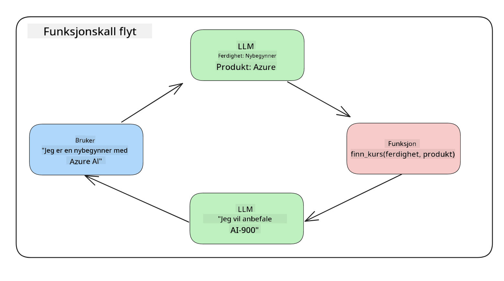
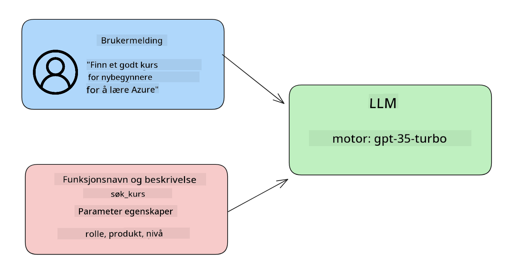

<!--
CO_OP_TRANSLATOR_METADATA:
{
  "original_hash": "77a48a201447be19aa7560706d6f93a0",
  "translation_date": "2025-05-19T21:31:32+00:00",
  "source_file": "11-integrating-with-function-calling/README.md",
  "language_code": "no"
}
-->
# Integrering med funksjonskall

[](https://aka.ms/gen-ai-lesson11-gh?WT.mc_id=academic-105485-koreyst)

Du har lært en del så langt i de tidligere leksjonene. Men vi kan forbedre oss ytterligere. Noen ting vi kan ta tak i er hvordan vi kan få et mer konsistent responsformat for å gjøre det enklere å jobbe med responsen nedstrøms. I tillegg kan vi ønske å legge til data fra andre kilder for å berike applikasjonen vår ytterligere.

De ovennevnte problemene er det denne kapitlet ønsker å ta tak i.

## Introduksjon

Denne leksjonen vil dekke:

- Forklare hva funksjonskall er og dets bruksområder.
- Opprette et funksjonskall ved hjelp av Azure OpenAI.
- Hvordan integrere et funksjonskall i en applikasjon.

## Læringsmål

Ved slutten av denne leksjonen vil du være i stand til å:

- Forklare hensikten med å bruke funksjonskall.
- Sette opp funksjonskall ved hjelp av Azure OpenAI Service.
- Designe effektive funksjonskall for din applikasjons bruksområde.

## Scenario: Forbedre vår chatbot med funksjoner

For denne leksjonen ønsker vi å bygge en funksjon for vår oppstartsbedrift innen utdanning som lar brukere bruke en chatbot for å finne tekniske kurs. Vi vil anbefale kurs som passer deres ferdighetsnivå, nåværende rolle og teknologi av interesse.

For å fullføre dette scenariet vil vi bruke en kombinasjon av:

- `Azure OpenAI` for å lage en chatteopplevelse for brukeren.
- `Microsoft Learn Catalog API` for å hjelpe brukere med å finne kurs basert på brukerens forespørsel.
- `Function Calling` for å ta brukerens spørsmål og sende det til en funksjon for å gjøre API-forespørselen.

For å komme i gang, la oss se på hvorfor vi i utgangspunktet vil bruke funksjonskall:

## Hvorfor funksjonskall

Før funksjonskall var svar fra en LLM ustrukturerte og inkonsistente. Utviklere måtte skrive kompleks valideringskode for å sikre at de kunne håndtere hver variasjon av et svar. Brukere kunne ikke få svar som "Hva er det nåværende været i Stockholm?". Dette er fordi modeller var begrenset til tiden dataene ble trent på.

Funksjonskall er en funksjon i Azure OpenAI Service for å overvinne følgende begrensninger:

- **Konsistent responsformat**. Hvis vi kan kontrollere responsformatet bedre, kan vi lettere integrere responsen nedstrøms til andre systemer.
- **Eksterne data**. Mulighet til å bruke data fra andre kilder av en applikasjon i en chat-kontekst.

## Illustrere problemet gjennom et scenario

> Vi anbefaler deg å bruke den [inkluderte notatboken](../../../11-integrating-with-function-calling/python/aoai-assignment.ipynb) hvis du vil kjøre scenariet nedenfor. Du kan også bare lese videre mens vi prøver å illustrere et problem der funksjoner kan hjelpe til med å løse problemet.

La oss se på eksemplet som illustrerer problemet med responsformat:

La oss si at vi ønsker å lage en database med studentdata slik at vi kan foreslå riktig kurs til dem. Nedenfor har vi to beskrivelser av studenter som er veldig like i dataene de inneholder.

1. Opprett en tilkobling til vår Azure OpenAI-ressurs:

   ```python
   import os
   import json
   from openai import AzureOpenAI
   from dotenv import load_dotenv
   load_dotenv()

   client = AzureOpenAI(
   api_key=os.environ['AZURE_OPENAI_API_KEY'],  # this is also the default, it can be omitted
   api_version = "2023-07-01-preview"
   )

   deployment=os.environ['AZURE_OPENAI_DEPLOYMENT']
   ```

   Nedenfor er litt Python-kode for å konfigurere vår tilkobling til Azure OpenAI hvor vi setter `api_type`, `api_base`, `api_version` and `api_key`.

1. Creating two student descriptions using variables `student_1_description` and `student_2_description`.

   ```python
   student_1_description="Emily Johnson is a sophomore majoring in computer science at Duke University. She has a 3.7 GPA. Emily is an active member of the university's Chess Club and Debate Team. She hopes to pursue a career in software engineering after graduating."

   student_2_description = "Michael Lee is a sophomore majoring in computer science at Stanford University. He has a 3.8 GPA. Michael is known for his programming skills and is an active member of the university's Robotics Club. He hopes to pursue a career in artificial intelligence after finishing his studies."
   ```

   Vi ønsker å sende de ovennevnte studentbeskrivelsene til en LLM for å analysere dataene. Disse dataene kan senere brukes i vår applikasjon og sendes til et API eller lagres i en database.

1. La oss lage to identiske spørsmål der vi instruerer LLM om hvilken informasjon vi er interessert i:

   ```python
   prompt1 = f'''
   Please extract the following information from the given text and return it as a JSON object:

   name
   major
   school
   grades
   club

   This is the body of text to extract the information from:
   {student_1_description}
   '''

   prompt2 = f'''
   Please extract the following information from the given text and return it as a JSON object:

   name
   major
   school
   grades
   club

   This is the body of text to extract the information from:
   {student_2_description}
   '''
   ```

   De ovennevnte spørsmålene instruerer LLM om å trekke ut informasjon og returnere responsen i JSON-format.

1. Etter å ha satt opp spørsmålene og tilkoblingen til Azure OpenAI, vil vi nå sende spørsmålene til LLM ved å bruke `openai.ChatCompletion`. We store the prompt in the `messages` variable and assign the role to `user`. Dette er for å etterligne en melding fra en bruker som skrives til en chatbot.

   ```python
   # response from prompt one
   openai_response1 = client.chat.completions.create(
   model=deployment,
   messages = [{'role': 'user', 'content': prompt1}]
   )
   openai_response1.choices[0].message.content

   # response from prompt two
   openai_response2 = client.chat.completions.create(
   model=deployment,
   messages = [{'role': 'user', 'content': prompt2}]
   )
   openai_response2.choices[0].message.content
   ```

Nå kan vi sende begge forespørslene til LLM og undersøke responsen vi mottar ved å finne den slik `openai_response1['choices'][0]['message']['content']`.

1. Lastly, we can convert the response to JSON format by calling `json.loads`:

   ```python
   # Loading the response as a JSON object
   json_response1 = json.loads(openai_response1.choices[0].message.content)
   json_response1
   ```

   Respons 1:

   ```json
   {
     "name": "Emily Johnson",
     "major": "computer science",
     "school": "Duke University",
     "grades": "3.7",
     "club": "Chess Club"
   }
   ```

   Respons 2:

   ```json
   {
     "name": "Michael Lee",
     "major": "computer science",
     "school": "Stanford University",
     "grades": "3.8 GPA",
     "club": "Robotics Club"
   }
   ```

   Selv om spørsmålene er de samme og beskrivelsene er like, ser vi verdiene av `Grades` property formatted differently, as we can sometimes get the format `3.7` or `3.7 GPA` for example.

   This result is because the LLM takes unstructured data in the form of the written prompt and returns also unstructured data. We need to have a structured format so that we know what to expect when storing or using this data

So how do we solve the formatting problem then? By using functional calling, we can make sure that we receive structured data back. When using function calling, the LLM does not actually call or run any functions. Instead, we create a structure for the LLM to follow for its responses. We then use those structured responses to know what function to run in our applications.



We can then take what is returned from the function and send this back to the LLM. The LLM will then respond using natural language to answer the user's query.

## Use Cases for using function calls

There are many different use cases where function calls can improve your app like:

- **Calling External Tools**. Chatbots are great at providing answers to questions from users. By using function calling, the chatbots can use messages from users to complete certain tasks. For example, a student can ask the chatbot to "Send an email to my instructor saying I need more assistance with this subject". This can make a function call to `send_email(to: string, body: string)`

- **Create API or Database Queries**. Users can find information using natural language that gets converted into a formatted query or API request. An example of this could be a teacher who requests "Who are the students that completed the last assignment" which could call a function named `get_completed(student_name: string, assignment: int, current_status: string)`

- **Creating Structured Data**. Users can take a block of text or CSV and use the LLM to extract important information from it. For example, a student can convert a Wikipedia article about peace agreements to create AI flashcards. This can be done by using a function called `get_important_facts(agreement_name: string, date_signed: string, parties_involved: list)`

## Creating Your First Function Call

The process of creating a function call includes 3 main steps:

1. **Calling** the Chat Completions API with a list of your functions and a user message.
2. **Reading** the model's response to perform an action i.e. execute a function or API Call.
3. **Making** another call to Chat Completions API with the response from your function to use that information to create a response to the user.



### Step 1 - creating messages

The first step is to create a user message. This can be dynamically assigned by taking the value of a text input or you can assign a value here. If this is your first time working with the Chat Completions API, we need to define the `role` and the `content` of the message.

The `role` can be either `system` (creating rules), `assistant` (the model) or `user` (the end-user). For function calling, we will assign this as `user` og et eksempelspørsmål.

```python
messages= [ {"role": "user", "content": "Find me a good course for a beginner student to learn Azure."} ]
```

Ved å tildele forskjellige roller, blir det tydelig for LLM om det er systemet som sier noe eller brukeren, noe som hjelper med å bygge en samtalehistorikk som LLM kan bygge videre på.

### Steg 2 - lage funksjoner

Deretter vil vi definere en funksjon og parameterne til den funksjonen. Vi vil bruke bare én funksjon her kalt `search_courses` but you can create multiple functions.

> **Important** : Functions are included in the system message to the LLM and will be included in the amount of available tokens you have available.

Below, we create the functions as an array of items. Each item is a function and has properties `name`, `description` and `parameters`:

```python
functions = [
   {
      "name":"search_courses",
      "description":"Retrieves courses from the search index based on the parameters provided",
      "parameters":{
         "type":"object",
         "properties":{
            "role":{
               "type":"string",
               "description":"The role of the learner (i.e. developer, data scientist, student, etc.)"
            },
            "product":{
               "type":"string",
               "description":"The product that the lesson is covering (i.e. Azure, Power BI, etc.)"
            },
            "level":{
               "type":"string",
               "description":"The level of experience the learner has prior to taking the course (i.e. beginner, intermediate, advanced)"
            }
         },
         "required":[
            "role"
         ]
      }
   }
]
```

La oss beskrive hver funksjonsforekomst mer detaljert nedenfor:

- `name` - The name of the function that we want to have called.
- `description` - This is the description of how the function works. Here it's important to be specific and clear.
- `parameters` - A list of values and format that you want the model to produce in its response. The parameters array consists of items where the items have the following properties:
  1.  `type` - The data type of the properties will be stored in.
  1.  `properties` - List of the specific values that the model will use for its response
      1. `name` - The key is the name of the property that the model will use in its formatted response, for example, `product`.
      1. `type` - The data type of this property, for example, `string`.
      1. `description` - Description of the specific property.

There's also an optional property `required` - required property for the function call to be completed.

### Step 3 - Making the function call

After defining a function, we now need to include it in the call to the Chat Completion API. We do this by adding `functions` to the request. In this case `functions=functions`.

There is also an option to set `function_call` to `auto`. This means we will let the LLM decide which function should be called based on the user message rather than assigning it ourselves.

Here's some code below where we call `ChatCompletion.create`, note how we set `functions=functions` and `function_call="auto"` og dermed gi LLM valget om når den skal kalle funksjonene vi gir den:

```python
response = client.chat.completions.create(model=deployment,
                                        messages=messages,
                                        functions=functions,
                                        function_call="auto")

print(response.choices[0].message)
```

Responsen som kommer tilbake ser nå slik ut:

```json
{
  "role": "assistant",
  "function_call": {
    "name": "search_courses",
    "arguments": "{\n  \"role\": \"student\",\n  \"product\": \"Azure\",\n  \"level\": \"beginner\"\n}"
  }
}
```

Her kan vi se hvordan funksjonen `search_courses` was called and with what arguments, as listed in the `arguments` property in the JSON response.

The conclusion the LLM was able to find the data to fit the arguments of the function as it was extracting it from the value provided to the `messages` parameter in the chat completion call. Below is a reminder of the `messages` verdi:

```python
messages= [ {"role": "user", "content": "Find me a good course for a beginner student to learn Azure."} ]
```

Som du kan se, `student`, `Azure` and `beginner` was extracted from `messages` and set as input to the function. Using functions this way is a great way to extract information from a prompt but also to provide structure to the LLM and have reusable functionality.

Next, we need to see how we can use this in our app.

## Integrating Function Calls into an Application

After we have tested the formatted response from the LLM, we can now integrate this into an application.

### Managing the flow

To integrate this into our application, let's take the following steps:

1. First, let's make the call to the OpenAI services and store the message in a variable called `response_message`.

   ```python
   response_message = response.choices[0].message
   ```

1. Nå vil vi definere funksjonen som vil kalle Microsoft Learn API for å få en liste over kurs:

   ```python
   import requests

   def search_courses(role, product, level):
     url = "https://learn.microsoft.com/api/catalog/"
     params = {
        "role": role,
        "product": product,
        "level": level
     }
     response = requests.get(url, params=params)
     modules = response.json()["modules"]
     results = []
     for module in modules[:5]:
        title = module["title"]
        url = module["url"]
        results.append({"title": title, "url": url})
     return str(results)
   ```

   Legg merke til hvordan vi nå lager en faktisk Python-funksjon som samsvarer med funksjonsnavnene introdusert i `functions` variable. We're also making real external API calls to fetch the data we need. In this case, we go against the Microsoft Learn API to search for training modules.

Ok, so we created `functions` variables and a corresponding Python function, how do we tell the LLM how to map these two together so our Python function is called?

1. To see if we need to call a Python function, we need to look into the LLM response and see if `function_call` er en del av det og kaller den utpekte funksjonen. Her er hvordan du kan gjøre den nevnte sjekken nedenfor:

   ```python
   # Check if the model wants to call a function
   if response_message.function_call.name:
    print("Recommended Function call:")
    print(response_message.function_call.name)
    print()

    # Call the function.
    function_name = response_message.function_call.name

    available_functions = {
            "search_courses": search_courses,
    }
    function_to_call = available_functions[function_name]

    function_args = json.loads(response_message.function_call.arguments)
    function_response = function_to_call(**function_args)

    print("Output of function call:")
    print(function_response)
    print(type(function_response))


    # Add the assistant response and function response to the messages
    messages.append( # adding assistant response to messages
        {
            "role": response_message.role,
            "function_call": {
                "name": function_name,
                "arguments": response_message.function_call.arguments,
            },
            "content": None
        }
    )
    messages.append( # adding function response to messages
        {
            "role": "function",
            "name": function_name,
            "content":function_response,
        }
    )
   ```

   Disse tre linjene sikrer at vi trekker ut funksjonsnavnet, argumentene og gjør kallet:

   ```python
   function_to_call = available_functions[function_name]

   function_args = json.loads(response_message.function_call.arguments)
   function_response = function_to_call(**function_args)
   ```

   Nedenfor er utdataene fra å kjøre koden vår:

   **Utdata**

   ```Recommended Function call:
   {
     "name": "search_courses",
     "arguments": "{\n  \"role\": \"student\",\n  \"product\": \"Azure\",\n  \"level\": \"beginner\"\n}"
   }

   Output of function call:
   [{'title': 'Describe concepts of cryptography', 'url': 'https://learn.microsoft.com/training/modules/describe-concepts-of-cryptography/?
   WT.mc_id=api_CatalogApi'}, {'title': 'Introduction to audio classification with TensorFlow', 'url': 'https://learn.microsoft.com/en-
   us/training/modules/intro-audio-classification-tensorflow/?WT.mc_id=api_CatalogApi'}, {'title': 'Design a Performant Data Model in Azure SQL
   Database with Azure Data Studio', 'url': 'https://learn.microsoft.com/training/modules/design-a-data-model-with-ads/?
   WT.mc_id=api_CatalogApi'}, {'title': 'Getting started with the Microsoft Cloud Adoption Framework for Azure', 'url':
   'https://learn.microsoft.com/training/modules/cloud-adoption-framework-getting-started/?WT.mc_id=api_CatalogApi'}, {'title': 'Set up the
   Rust development environment', 'url': 'https://learn.microsoft.com/training/modules/rust-set-up-environment/?WT.mc_id=api_CatalogApi'}]
   <class 'str'>
   ```

1. Nå vil vi sende den oppdaterte meldingen, `messages` til LLM slik at vi kan motta en naturlig språkrespons i stedet for en API JSON-formatert respons.

   ```python
   print("Messages in next request:")
   print(messages)
   print()

   second_response = client.chat.completions.create(
      messages=messages,
      model=deployment,
      function_call="auto",
      functions=functions,
      temperature=0
         )  # get a new response from GPT where it can see the function response


   print(second_response.choices[0].message)
   ```

   **Utdata**

   ```python
   {
     "role": "assistant",
     "content": "I found some good courses for beginner students to learn Azure:\n\n1. [Describe concepts of cryptography] (https://learn.microsoft.com/training/modules/describe-concepts-of-cryptography/?WT.mc_id=api_CatalogApi)\n2. [Introduction to audio classification with TensorFlow](https://learn.microsoft.com/training/modules/intro-audio-classification-tensorflow/?WT.mc_id=api_CatalogApi)\n3. [Design a Performant Data Model in Azure SQL Database with Azure Data Studio](https://learn.microsoft.com/training/modules/design-a-data-model-with-ads/?WT.mc_id=api_CatalogApi)\n4. [Getting started with the Microsoft Cloud Adoption Framework for Azure](https://learn.microsoft.com/training/modules/cloud-adoption-framework-getting-started/?WT.mc_id=api_CatalogApi)\n5. [Set up the Rust development environment](https://learn.microsoft.com/training/modules/rust-set-up-environment/?WT.mc_id=api_CatalogApi)\n\nYou can click on the links to access the courses."
   }

   ```

## Oppgave

For å fortsette læringen din av Azure OpenAI Function Calling kan du bygge:

- Flere parametere av funksjonen som kan hjelpe elever med å finne flere kurs.
- Opprette et annet funksjonskall som tar mer informasjon fra eleven, som deres morsmål.
- Opprette feilhåndtering når funksjonskallet og/eller API-kallet ikke returnerer noen passende kurs.

Tips: Følg [Learn API referansedokumentasjonen](https://learn.microsoft.com/training/support/catalog-api-developer-reference?WT.mc_id=academic-105485-koreyst) siden for å se hvordan og hvor disse dataene er tilgjengelige.

## Flott arbeid! Fortsett reisen

Etter å ha fullført denne leksjonen, sjekk ut vår [Generative AI Learning-samling](https://aka.ms/genai-collection?WT.mc_id=academic-105485-koreyst) for å fortsette å øke kunnskapen din om Generative AI!

Gå videre til leksjon 12, hvor vi vil se på hvordan vi kan [designe UX for AI-applikasjoner](../12-designing-ux-for-ai-applications/README.md?WT.mc_id=academic-105485-koreyst)!

**Ansvarsfraskrivelse**:  
Dette dokumentet har blitt oversatt ved hjelp av AI-oversettelsestjenesten [Co-op Translator](https://github.com/Azure/co-op-translator). Selv om vi etterstreber nøyaktighet, vennligst vær oppmerksom på at automatiserte oversettelser kan inneholde feil eller unøyaktigheter. Det originale dokumentet på sitt opprinnelige språk bør betraktes som den autoritative kilden. For kritisk informasjon anbefales profesjonell menneskelig oversettelse. Vi er ikke ansvarlige for misforståelser eller feiltolkninger som oppstår fra bruken av denne oversettelsen.