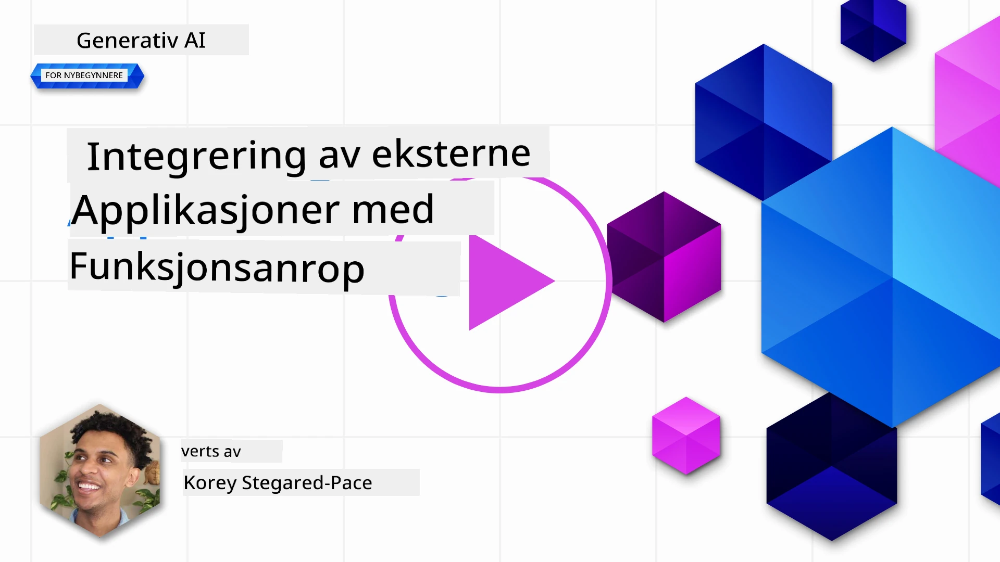
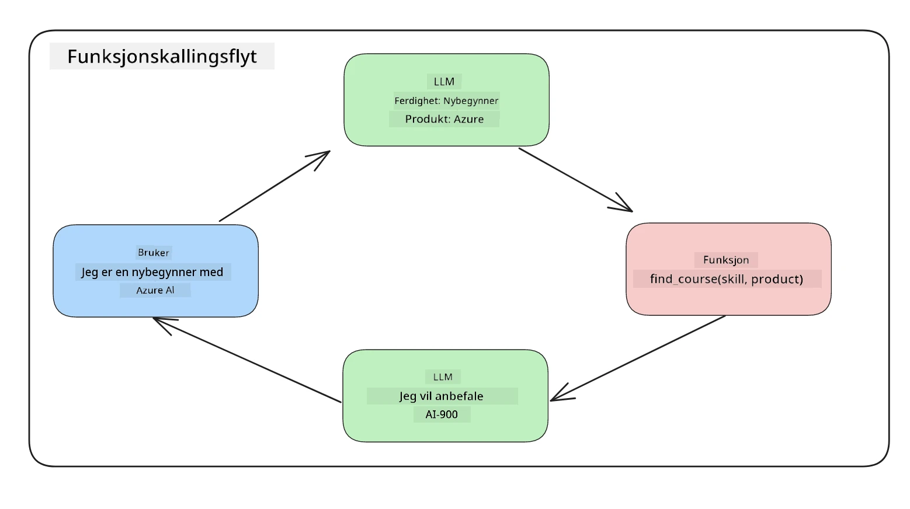
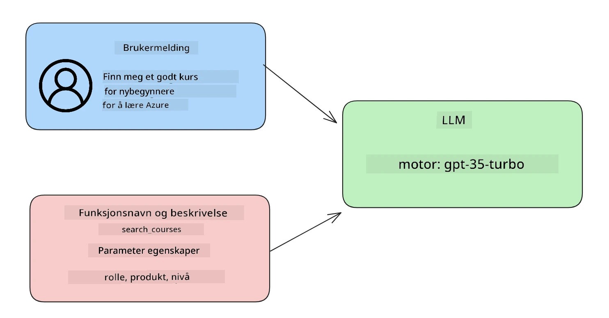

# Integrering med funksjonskall

[](https://youtu.be/DgUdCLX8qYQ?si=f1ouQU5HQx6F8Gl2)

Du har lært ganske mye så langt i de forrige leksjonene. Men vi kan forbedre oss ytterligere. Noen ting vi kan ta tak i er hvordan vi kan få et mer konsistent svarformat for å gjøre det lettere å jobbe med svaret videre. I tillegg kan vi ønske å legge til data fra andre kilder for å ytterligere berike applikasjonen vår.

De nevnte problemene er det dette kapitlet ønsker å adressere.

## Introduksjon

Denne leksjonen vil dekke:

- Forklare hva funksjonskall er og bruksområder.
- Opprette et funksjonskall ved bruk av Azure OpenAI.
- Hvordan integrere et funksjonskall i en applikasjon.

## Læremål

Ved slutten av denne leksjonen vil du kunne:

- Forklare hensikten med å bruke funksjonskall.
- Sette opp Funksjonskall med Azure OpenAI Service.
- Designe effektive funksjonskall for ditt applikasjonsbrukstilfelle.

## Scenario: Forbedre chatboten vår med funksjoner

For denne leksjonen ønsker vi å bygge en funksjon for vår utdannings-startup som lar brukere benytte en chatbot for å finne tekniske kurs. Vi vil anbefale kurs som passer deres ferdighetsnivå, nåværende rolle og teknologi av interesse.

For å fullføre dette scenariet vil vi bruke en kombinasjon av:

- `Azure OpenAI` for å skape en chatteopplevelse for brukeren.
- `Microsoft Learn Catalog API` for å hjelpe brukere å finne kurs basert på forespørselen.
- `Funksjonskall` for å ta brukerens spørsmålsstilling og sende det til en funksjon for å gjøre API-forespørselen.

For å komme i gang, la oss se på hvorfor vi i det hele tatt ønsker å bruke funksjonskall:

## Hvorfor funksjonskall

Før funksjonskall var svar fra en LLM ustrukturert og inkonsekvent. Utviklere måtte skrive komplisert valideringskode for å håndtere hver variasjon av svar. Brukere kunne ikke få svar som "Hva er været nå i Stockholm?". Dette skyldtes at modellene var begrenset til tidspunktet dataene var trent på.

Funksjonskall er en funksjon i Azure OpenAI Service for å overvinne følgende begrensninger:

- **Konsistent svarformat**. Om vi kan kontrollere svarformatet bedre, kan vi enklere integrere svaret videre til andre systemer.
- **Eksterne data**. Mulighet til å bruke data fra andre kilder i applikasjonen i en chatte-kontekst.

## Illustrasjon av problemet gjennom et scenario

> Vi anbefaler deg å bruke [den medfølgende notebooken](./python/aoai-assignment.ipynb?WT.mc_id=academic-105485-koreyst) hvis du ønsker å kjøre scenarioet nedenfor. Du kan også bare lese med da vi prøver å illustrere et problem hvor funksjoner kan bidra til å løse det.

La oss se på eksempelet som illustrerer problemet med svarformat:

Si vi vil lage en database med studentdata slik at vi kan foreslå riktig kurs til dem. Under har vi to beskrivelser av studenter som er veldig like i dataene de inneholder.

1. Opprett en tilkobling til vår Azure OpenAI-ressurs:

   ```python
   import os
   import json
   from openai import OpenAI
   from dotenv import load_dotenv
   load_dotenv()

   # Responses-APIen betjenes fra Azure OpenAI (Microsoft Foundry) v1
   # endepunktet, så vi peker OpenAI-klienten mot <your-endpoint>/openai/v1/.
   endpoint = os.environ['AZURE_OPENAI_ENDPOINT']
   client = OpenAI(
   api_key=os.environ['AZURE_OPENAI_API_KEY'],
   base_url=f"{endpoint.rstrip('/')}/openai/v1/",
   )

   deployment=os.environ['AZURE_OPENAI_DEPLOYMENT']
   ```

   Nedenfor er Python-kode for å konfigurere vår tilkobling til Azure OpenAI. Fordi vi bruker v1-endepunktet trenger vi bare sette `api_key` og `base_url` (ingen `api_version` kreves).

1. Opprette to studentbeskrivelser med variablene `student_1_description` og `student_2_description`.

   ```python
   student_1_description="Emily Johnson is a sophomore majoring in computer science at Duke University. She has a 3.7 GPA. Emily is an active member of the university's Chess Club and Debate Team. She hopes to pursue a career in software engineering after graduating."

   student_2_description = "Michael Lee is a sophomore majoring in computer science at Stanford University. He has a 3.8 GPA. Michael is known for his programming skills and is an active member of the university's Robotics Club. He hopes to pursue a career in artificial intelligence after finishing his studies."
   ```

   Vi vil sende disse studentbeskrivelsene til en LLM for å parse dataene. Disse dataene kan senere brukes i applikasjonen vår og sendes til en API eller lagres i en database.

1. La oss lage to identiske prompts der vi instruerer LLM hva slags informasjon vi er interessert i:

   ```python
   prompt1 = f'''
   Please extract the following information from the given text and return it as a JSON object:

   name
   major
   school
   grades
   club

   This is the body of text to extract the information from:
   {student_1_description}
   '''

   prompt2 = f'''
   Please extract the following information from the given text and return it as a JSON object:

   name
   major
   school
   grades
   club

   This is the body of text to extract the information from:
   {student_2_description}
   '''
   ```

   Ovenstående prompts instruerer LLM til å ekstrahere informasjon og returnere svaret i JSON-format.

1. Etter å ha satt opp promptene og tilkoblingen til Azure OpenAI, vil vi nå sende promptene til LLM ved å bruke `client.responses.create`. Vi lagrer prompten i variabelen `input` og tilordner rollen `user`. Dette er for å etterligne en melding fra en bruker som skrives til en chatbot.

   ```python
   # svar fra prompt én
   openai_response1 = client.responses.create(
   model=deployment,
   input = [{'role': 'user', 'content': prompt1}],
   store=False,
   )
   openai_response1.output_text

   # svar fra prompt to
   openai_response2 = client.responses.create(
   model=deployment,
   input = [{'role': 'user', 'content': prompt2}],
   store=False,
   )
   openai_response2.output_text
   ```

Nå kan vi sende begge forespørsler til LLM og undersøke svaret vi mottar ved å finne det slik: `openai_response1.output_text`.

1. Til slutt kan vi konvertere svaret til JSON-format ved å kalle `json.loads`:

   ```python
   # Laster responsen som et JSON-objekt
   json_response1 = json.loads(openai_response1.output_text)
   json_response1
   ```

   Svar 1:

   ```json
   {
     "name": "Emily Johnson",
     "major": "computer science",
     "school": "Duke University",
     "grades": "3.7",
     "club": "Chess Club"
   }
   ```

   Svar 2:

   ```json
   {
     "name": "Michael Lee",
     "major": "computer science",
     "school": "Stanford University",
     "grades": "3.8 GPA",
     "club": "Robotics Club"
   }
   ```

   Selv om promptene er de samme og beskrivelsene like, ser vi verdier i `Grades`-egenskapen formatert ulikt, for eksempel `3.7` eller `3.7 GPA`.

   Dette resultatet skyldes at LLM tar ustrukturert data i form av den skrevne prompten og returnerer også ustrukturert data. Vi trenger et strukturert format slik at vi vet hva vi kan forvente når vi lagrer eller bruker dataene.

Så hvordan løser vi formatproblemet? Ved å bruke funksjonskall kan vi sikre at vi mottar strukturerte data tilbake. Når vi bruker funksjonskall, kaller eller kjører ikke LLM egentlig noen funksjoner. I stedet lager vi en struktur LLM skal følge i sine svar. Vi bruker disse strukturerte svarene til å vite hvilken funksjon vi skal kjøre i applikasjonene våre.



Vi kan så ta det som returneres fra funksjonen og sende dette tilbake til LLM. LLM vil da svare med naturlig språk for å svare på brukerens spørsmål.

## Bruksområder for funksjonskall

Det finnes mange ulike bruksområder hvor funksjonskall kan forbedre appen din som:

- **Kalling av eksterne verktøy**. Chatboter er gode til å gi svar på spørsmål fra brukerne. Ved å bruke funksjonskall kan chatboten bruke brukerens meldinger for å utføre bestemte oppgaver. For eksempel kan en student be chatboten om å "Sende en e-post til instruktøren min og si at jeg trenger mer hjelp med dette emnet". Dette kan bli et funksjonskall til `send_email(to: string, body: string)`.

- **Lage API- eller databaseforespørsler**. Brukere kan finne informasjon ved bruk av naturlig språk som konverteres til en formatert forespørsel eller API-kall. Et eksempel kan være en lærer som spør "Hvem er studentene som fullførte siste oppgave", som kan kalle en funksjon kalt `get_completed(student_name: string, assignment: int, current_status: string)`.

- **Opprette strukturerte data**. Brukere kan ta en tekstblokk eller CSV og bruke LLM til å ekstrahere viktig informasjon fra den. For eksempel kan en student konvertere en Wikipedia-artikkel om fredsavtaler for å lage AI-flashcards. Dette kan gjøres ved å bruke en funksjon kalt `get_important_facts(agreement_name: string, date_signed: string, parties_involved: list)`.

## Lage ditt første funksjonskall

Prosessen med å lage et funksjonskall inkluderer tre hovedsteg:

1. **Kalle** Responses API med en liste over dine funksjoner (verktøy) og en brukermelding.
2. **Lese** modellens svar for å utføre en handling, det vil si kjøre en funksjon eller API-kall.
3. **Foreta** et nytt kall til Responses API med svaret fra funksjonen din for å bruke denne informasjonen til å lage et svar til brukeren.



### Steg 1 - lage meldinger

Det første steget er å lage en brukermelding. Denne kan dynamisk settes ved å ta verdien fra et tekstinput, eller du kan tilordne en verdi her. Hvis dette er første gang du jobber med Responses API, trenger vi å definere `role` og `content` på meldingen.

`role` kan være enten `system` (lage regler), `assistant` (modellen) eller `user` (sluttbruker). For funksjonskall vil vi tilordne dette til `user` og et eksempelspørsmål.

```python
messages= [ {"role": "user", "content": "Find me a good course for a beginner student to learn Azure."} ]
```

Ved å tilordne ulike roller blir det klart for LLM om det er systemet som snakker eller brukeren, noe som hjelper til å bygge en samtalehistorie som LLM kan bygge videre på.

### Steg 2 - lage funksjoner

Nå skal vi definere en funksjon og dens parametre. Vi vil bruke kun en funksjon her kalt `search_courses` men du kan lage flere funksjoner.

> **Viktig** : Funksjoner inkluderes i systemmeldingen til LLM og teller dermed mot antall tokens du har tilgjengelig.

Nedenfor lager vi funksjonene som et array av elementer. Hvert element er et verktøy i flat Responses API-format, med egenskapene `type`, `name`, `description` og `parameters`:

```python
functions = [
   {
      "type":"function",
      "name":"search_courses",
      "description":"Retrieves courses from the search index based on the parameters provided",
      "parameters":{
         "type":"object",
         "properties":{
            "role":{
               "type":"string",
               "description":"The role of the learner (i.e. developer, data scientist, student, etc.)"
            },
            "product":{
               "type":"string",
               "description":"The product that the lesson is covering (i.e. Azure, Power BI, etc.)"
            },
            "level":{
               "type":"string",
               "description":"The level of experience the learner has prior to taking the course (i.e. beginner, intermediate, advanced)"
            }
         },
         "required":[
            "role"
         ]
      }
   }
]
```

La oss beskrive hver funksjonsinstans mer detaljert nedenfor:

- `name` - Navnet på funksjonen vi ønsker skal kalles.
- `description` - Beskrivelse av hvordan funksjonen fungerer. Her er det viktig å være spesifikk og tydelig.
- `parameters` - En liste over verdier og format som du ønsker at modellen produserer i sitt svar. `parameters`-arrayet består av elementer som har følgende egenskaper:
  1.  `type` - Datatypen egenskapene vil lagres i.
  1.  `properties` - Liste over de spesifikke verdiene som modellen vil bruke i sitt formaterte svar.
      1. `name` - Nøkkelen er navnet på egenskapen som modellen vil bruke i sitt formatterte svar, for eksempel `product`.
      1. `type` - Datatypen til denne egenskapen, for eksempel `string`.
      1. `description` - Beskrivelse av den spesifikke egenskapen.

Det finnes også en valgfri egenskap `required` - påkrevd egenskap for at funksjonskallet skal fullføres.

### Steg 3 - Foreta funksjonskallet

Etter å ha definert en funksjon må vi nå inkludere den i kallet til Responses API. Dette gjør vi ved å legge til `tools` i forespørselen. I dette tilfellet `tools=functions`.

Det finnes også en mulighet for å sette `tool_choice` til `auto`. Dette betyr at vi lar LLM bestemme hvilken funksjon som skal kalles basert på brukermeldingen i stedet for å tilordne det selv.

Her er litt kode nedenfor hvor vi kaller `client.responses.create`, merk hvordan vi setter `tools=functions` og `tool_choice="auto"` og dermed gir LLM valget om når den skal kalle funksjonene vi gir den:

```python
response = client.responses.create(model=deployment,
                                        input=messages,
                                        tools=functions,
                                        tool_choice="auto",
                                        store=False)

print(response.output)
```

Svaret som kommer tilbake inkluderer nå et `function_call`-element i `response.output` som ser slik ut:

```json
{
  "type": "function_call",
  "name": "search_courses",
  "call_id": "call_abc123",
  "arguments": "{\n  \"role\": \"student\",\n  \"product\": \"Azure\",\n  \"level\": \"beginner\"\n}"
}
```

Her kan vi se hvordan funksjonen `search_courses` ble kalt og med hvilke argumenter, listet i `arguments`-egenskapen i JSON-svaret.

Konklusjonen er at LLM var i stand til å finne data til å fylle argumentene i funksjonen ved å ekstrahere den fra verdien som ble gitt til `input`-parameteren i Responses API-kallet. Nedenfor er en påminnelse om `messages`-verdien:

```python
messages= [ {"role": "user", "content": "Find me a good course for a beginner student to learn Azure."} ]
```

Som du ser ble `student`, `Azure` og `beginner` ekstrahert fra `messages` og satt som input til funksjonen. Å bruke funksjoner på denne måten er en god måte å hente informasjon fra en prompt, men også å gi struktur til LLM og ha gjenbrukbar funksjonalitet.

Neste steg er å se hvordan vi kan bruke dette i appen vår.

## Integrere funksjonskall i en applikasjon

Etter at vi har testet det formaterte svaret fra LLM kan vi nå integrere dette i en applikasjon.

### Håndtere flyten

For å integrere dette i applikasjonen vår, tar vi følgende steg:

1. Først gjør vi kallet til OpenAI-tjenestene og ekstraherer funksjonskall-elementene fra svaret i `output`.

   ```python
   response_items = response.output
   tool_calls = [item for item in response_items if item.type == "function_call"]
   ```

1. Nå definerer vi funksjonen som skal kalle Microsoft Learn API for å hente en liste over kurs:

   ```python
   import requests

   def search_courses(role, product, level):
     url = "https://learn.microsoft.com/api/catalog/"
     params = {
        "role": role,
        "product": product,
        "level": level
     }
     response = requests.get(url, params=params)
     modules = response.json()["modules"]
     results = []
     for module in modules[:5]:
        title = module["title"]
        url = module["url"]
        results.append({"title": title, "url": url})
     return str(results)
   ```

   Merk at vi nå lager en faktisk Python-funksjon som kartlegger til funksjonsnavnene definert i `functions` variabelen. Vi foretar også reelle eksterne API-kall for å hente nødvendig data. I dette tilfellet søker vi mot Microsoft Learn API etter treningsmoduler.

Ok, vi har laget `functions`-variabelen og en tilsvarende Python-funksjon, hvordan forteller vi LLM hvordan vi kobler disse sammen slik at Python-funksjonen kalles?

1. For å se om vi må kalle en Python-funksjon må vi se i LLM-svaret om et `function_call`-element er en del av det, og kalle den funksjonen som pekes ut. Slik gjør du denne kontrollen:

   ```python
   # Sjekk om modellen vil kalle en funksjon
   if tool_calls:
    for tool_call in tool_calls:
     print("Recommended Function call:")
     print(tool_call.name)
     print()

     # Kall funksjonen.
     function_name = tool_call.name

     available_functions = {
             "search_courses": search_courses,
     }
     function_to_call = available_functions[function_name]

     function_args = json.loads(tool_call.arguments)
     function_response = function_to_call(**function_args)

     print("Output of function call:")
     print(function_response)
     print(type(function_response))

     # Legg til funksjonskallet og resultatet tilbake i samtalen.
     # Modellens function_call-element må legges til før utdataene.
     messages.append(tool_call)  # assistentens function_call-element
     messages.append( # funksjonsresultatet
         {
             "type": "function_call_output",
             "call_id": tool_call.call_id,
             "output": function_response,
         }
     )
   ```

   Disse tre linjene sørger for at vi ekstraherer funksjonsnavn, argumenter og gjør kallet:

   ```python
   function_to_call = available_functions[function_name]

   function_args = json.loads(tool_call.arguments)
   function_response = function_to_call(**function_args)
   ```

   Nedenfor er utskrift fra å kjøre vår kode:

   **Output**

   ```Recommended Function call:
   {
     "name": "search_courses",
     "arguments": "{\n  \"role\": \"student\",\n  \"product\": \"Azure\",\n  \"level\": \"beginner\"\n}"
   }

   Output of function call:
   [{'title': 'Describe concepts of cryptography', 'url': 'https://learn.microsoft.com/training/modules/describe-concepts-of-cryptography/?
   WT.mc_id=api_CatalogApi'}, {'title': 'Introduction to audio classification with TensorFlow', 'url': 'https://learn.microsoft.com/en-
   us/training/modules/intro-audio-classification-tensorflow/?WT.mc_id=api_CatalogApi'}, {'title': 'Design a Performant Data Model in Azure SQL
   Database with Azure Data Studio', 'url': 'https://learn.microsoft.com/training/modules/design-a-data-model-with-ads/?
   WT.mc_id=api_CatalogApi'}, {'title': 'Getting started with the Microsoft Cloud Adoption Framework for Azure', 'url':
   'https://learn.microsoft.com/training/modules/cloud-adoption-framework-getting-started/?WT.mc_id=api_CatalogApi'}, {'title': 'Set up the
   Rust development environment', 'url': 'https://learn.microsoft.com/training/modules/rust-set-up-environment/?WT.mc_id=api_CatalogApi'}]
   <class 'str'>
   ```

1. Nå sender vi den oppdaterte meldingen, `messages`, til LLM slik at vi kan motta et svar i naturlig språk i stedet for et API JSON-formatert svar.

   ```python
   print("Messages in next request:")
   print(messages)
   print()

   second_response = client.responses.create(
      input=messages,
      model=deployment,
      tool_choice="auto",
      tools=functions,
      temperature=0,
      store=False,
         )  # få et nytt svar fra modellen hvor den kan se funksjonssvaret


   print(second_response.output_text)
   ```

   **Output**

   ```text
   I found some good courses for beginner students to learn Azure:

   1. [Describe concepts of cryptography](https://learn.microsoft.com/training/modules/describe-concepts-of-cryptography/?WT.mc_id=api_CatalogApi)
   2. [Introduction to audio classification with TensorFlow](https://learn.microsoft.com/training/modules/intro-audio-classification-tensorflow/?WT.mc_id=api_CatalogApi)
   3. [Design a Performant Data Model in Azure SQL Database with Azure Data Studio](https://learn.microsoft.com/training/modules/design-a-data-model-with-ads/?WT.mc_id=api_CatalogApi)
   4. [Getting started with the Microsoft Cloud Adoption Framework for Azure](https://learn.microsoft.com/training/modules/cloud-adoption-framework-getting-started/?WT.mc_id=api_CatalogApi)
   5. [Set up the Rust development environment](https://learn.microsoft.com/training/modules/rust-set-up-environment/?WT.mc_id=api_CatalogApi)

   You can click on the links to access the courses.
   ```

## Oppgave

For å fortsette å lære om Azure OpenAI Funksjonskall kan du bygge:

- Flere parametere til funksjonen som kan hjelpe brukere å finne flere kurs.

- Lag et annet funksjonskall som tar mer informasjon fra læreren, som deres morsmål
- Lag feilhåndtering når funksjonskallet og/eller API-kallet ikke returnerer noen egnede kurs

Hint: Følg siden [Learn API reference documentation](https://learn.microsoft.com/training/support/catalog-api-developer-reference?WT.mc_id=academic-105485-koreyst) for å se hvordan og hvor disse dataene er tilgjengelige.

## Flott arbeid! Fortsett reisen

Etter å ha fullført denne leksjonen, sjekk ut vår [Generative AI Learning collection](https://aka.ms/genai-collection?WT.mc_id=academic-105485-koreyst) for å fortsette å øke kunnskapen din om Generativ AI!

Gå videre til Leksjon 12, hvor vi skal se på hvordan man [designer UX for AI-applikasjoner](../12-designing-ux-for-ai-applications/README.md?WT.mc_id=academic-105485-koreyst)!

---

<!-- CO-OP TRANSLATOR DISCLAIMER START -->
**Ansvarsfraskrivelse**:
Dette dokumentet er oversatt ved hjelp av AI-oversettelsestjenesten [Co-op Translator](https://github.com/Azure/co-op-translator). Selv om vi streber etter nøyaktighet, vær oppmerksom på at automatiske oversettelser kan inneholde feil eller unøyaktigheter. Det opprinnelige dokumentet på originalspråket skal betraktes som den autoritative kilden. For kritisk informasjon anbefales profesjonell menneskelig oversettelse. Vi er ikke ansvarlige for eventuelle misforståelser eller feiltolkninger som oppstår ved bruk av denne oversettelsen.
<!-- CO-OP TRANSLATOR DISCLAIMER END -->