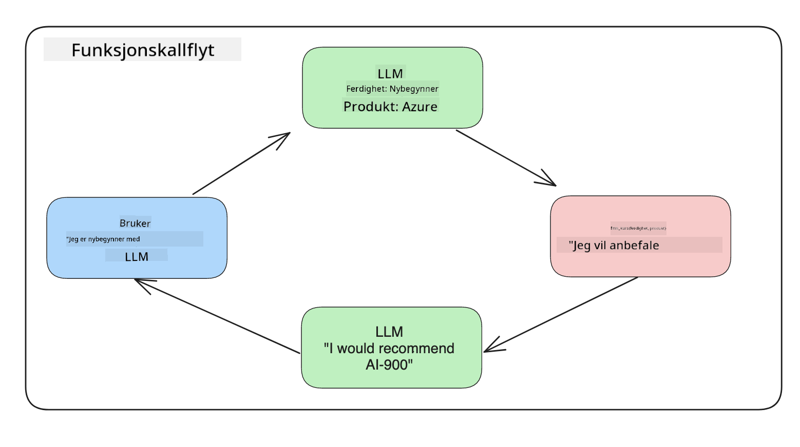
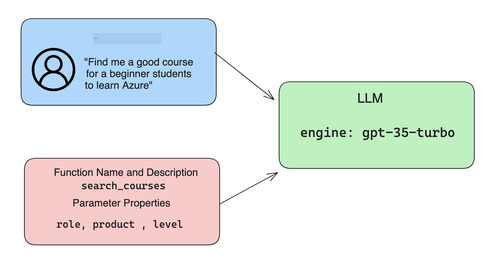

<!--
CO_OP_TRANSLATOR_METADATA:
{
  "original_hash": "77a48a201447be19aa7560706d6f93a0",
  "translation_date": "2025-07-09T14:36:21+00:00",
  "source_file": "11-integrating-with-function-calling/README.md",
  "language_code": "no"
}
-->
# Integrering med funksjonskall

[](https://aka.ms/gen-ai-lesson11-gh?WT.mc_id=academic-105485-koreyst)

Du har lært en god del så langt i de forrige leksjonene. Men vi kan forbedre oss enda mer. Noen ting vi kan ta tak i er hvordan vi kan få et mer konsistent svarformat for å gjøre det enklere å jobbe med svaret videre. I tillegg kan vi ønske å legge til data fra andre kilder for å berike applikasjonen vår ytterligere.

De nevnte problemene er det dette kapitlet ønsker å løse.

## Introduksjon

Denne leksjonen vil dekke:

- Forklare hva funksjonskall er og bruksområdene.
- Lage et funksjonskall ved bruk av Azure OpenAI.
- Hvordan integrere et funksjonskall i en applikasjon.

## Læringsmål

Innen slutten av denne leksjonen vil du kunne:

- Forklare hensikten med å bruke funksjonskall.
- Sette opp Function Call ved bruk av Azure OpenAI Service.
- Designe effektive funksjonskall for ditt applikasjonsbrukstilfelle.

## Scenario: Forbedre chatboten vår med funksjoner

I denne leksjonen ønsker vi å bygge en funksjon for vår utdanningsstartup som lar brukere bruke en chatbot for å finne tekniske kurs. Vi vil anbefale kurs som passer deres ferdighetsnivå, nåværende rolle og teknologi de er interessert i.

For å fullføre dette scenariet vil vi bruke en kombinasjon av:

- `Azure OpenAI` for å lage en chatteopplevelse for brukeren.
- `Microsoft Learn Catalog API` for å hjelpe brukere med å finne kurs basert på brukerens forespørsel.
- `Function Calling` for å ta brukerens spørsmål og sende det til en funksjon som gjør API-forespørselen.

For å komme i gang, la oss se på hvorfor vi ønsker å bruke funksjonskall i utgangspunktet:

## Hvorfor funksjonskall

Før funksjonskall var svarene fra en LLM ustrukturert og inkonsekvent. Utviklere måtte skrive komplisert valideringskode for å håndtere alle variasjoner av et svar. Brukere kunne ikke få svar på spørsmål som "Hva er været i Stockholm akkurat nå?". Dette skyldtes at modellene var begrenset til tidspunktet dataene ble trent på.

Function Calling er en funksjon i Azure OpenAI Service som løser følgende begrensninger:

- **Konsistent svarformat**. Hvis vi kan kontrollere svarformatet bedre, kan vi enklere integrere svaret videre til andre systemer.
- **Eksterne data**. Mulighet til å bruke data fra andre kilder i applikasjonen i en chat-kontekst.

## Illustrere problemet gjennom et scenario

> Vi anbefaler at du bruker [den medfølgende notatboken](python/aoai-assignment.ipynb) hvis du ønsker å kjøre scenariet nedenfor. Du kan også bare lese med mens vi prøver å illustrere et problem hvor funksjoner kan hjelpe til med å løse det.

La oss se på et eksempel som illustrerer problemet med svarformat:

Si at vi ønsker å lage en database med studentdata slik at vi kan foreslå riktig kurs til dem. Nedenfor har vi to beskrivelser av studenter som er veldig like i dataene de inneholder.

1. Opprett en tilkobling til vår Azure OpenAI-ressurs:

   ```python
   import os
   import json
   from openai import AzureOpenAI
   from dotenv import load_dotenv
   load_dotenv()

   client = AzureOpenAI(
   api_key=os.environ['AZURE_OPENAI_API_KEY'],  # this is also the default, it can be omitted
   api_version = "2023-07-01-preview"
   )

   deployment=os.environ['AZURE_OPENAI_DEPLOYMENT']
   ```

   Nedenfor er noe Python-kode for å konfigurere tilkoblingen til Azure OpenAI hvor vi setter `api_type`, `api_base`, `api_version` og `api_key`.

1. Lage to studentbeskrivelser ved bruk av variablene `student_1_description` og `student_2_description`.

   ```python
   student_1_description="Emily Johnson is a sophomore majoring in computer science at Duke University. She has a 3.7 GPA. Emily is an active member of the university's Chess Club and Debate Team. She hopes to pursue a career in software engineering after graduating."

   student_2_description = "Michael Lee is a sophomore majoring in computer science at Stanford University. He has a 3.8 GPA. Michael is known for his programming skills and is an active member of the university's Robotics Club. He hopes to pursue a career in artificial intelligence after finishing his studies."
   ```

   Vi ønsker å sende de ovennevnte studentbeskrivelsene til en LLM for å analysere dataene. Disse dataene kan senere brukes i applikasjonen vår og sendes til en API eller lagres i en database.

1. La oss lage to identiske prompts hvor vi instruerer LLM om hvilken informasjon vi er interessert i:

   ```python
   prompt1 = f'''
   Please extract the following information from the given text and return it as a JSON object:

   name
   major
   school
   grades
   club

   This is the body of text to extract the information from:
   {student_1_description}
   '''

   prompt2 = f'''
   Please extract the following information from the given text and return it as a JSON object:

   name
   major
   school
   grades
   club

   This is the body of text to extract the information from:
   {student_2_description}
   '''
   ```

   De ovennevnte promptene instruerer LLM til å hente ut informasjon og returnere svaret i JSON-format.

1. Etter å ha satt opp promptene og tilkoblingen til Azure OpenAI, sender vi nå promptene til LLM ved å bruke `openai.ChatCompletion`. Vi lagrer prompten i variabelen `messages` og setter rollen til `user`. Dette er for å etterligne en melding fra en bruker som skrives til en chatbot.

   ```python
   # response from prompt one
   openai_response1 = client.chat.completions.create(
   model=deployment,
   messages = [{'role': 'user', 'content': prompt1}]
   )
   openai_response1.choices[0].message.content

   # response from prompt two
   openai_response2 = client.chat.completions.create(
   model=deployment,
   messages = [{'role': 'user', 'content': prompt2}]
   )
   openai_response2.choices[0].message.content
   ```

Nå kan vi sende begge forespørslene til LLM og undersøke svaret vi får ved å hente det slik: `openai_response1['choices'][0]['message']['content']`.

1. Til slutt kan vi konvertere svaret til JSON-format ved å kalle `json.loads`:

   ```python
   # Loading the response as a JSON object
   json_response1 = json.loads(openai_response1.choices[0].message.content)
   json_response1
   ```

   Svar 1:

   ```json
   {
     "name": "Emily Johnson",
     "major": "computer science",
     "school": "Duke University",
     "grades": "3.7",
     "club": "Chess Club"
   }
   ```

   Svar 2:

   ```json
   {
     "name": "Michael Lee",
     "major": "computer science",
     "school": "Stanford University",
     "grades": "3.8 GPA",
     "club": "Robotics Club"
   }
   ```

   Selv om promptene er like og beskrivelsene er like, ser vi at verdiene i `Grades`-egenskapen er formatert forskjellig, for eksempel kan vi noen ganger få formatet `3.7` eller `3.7 GPA`.

   Dette resultatet skyldes at LLM tar inn ustrukturert data i form av den skrevne prompten og returnerer også ustrukturert data. Vi trenger et strukturert format slik at vi vet hva vi kan forvente når vi lagrer eller bruker disse dataene.

Så hvordan løser vi formatproblemet? Ved å bruke funksjonskall kan vi sørge for at vi mottar strukturerte data tilbake. Når vi bruker funksjonskall, kjører ikke LLM faktisk noen funksjoner. I stedet lager vi en struktur som LLM skal følge i sine svar. Vi bruker deretter disse strukturerte svarene for å vite hvilken funksjon vi skal kjøre i applikasjonene våre.



Vi kan så ta det som returneres fra funksjonen og sende dette tilbake til LLM. LLM vil da svare med naturlig språk for å besvare brukerens spørsmål.

## Bruksområder for funksjonskall

Det finnes mange ulike bruksområder hvor funksjonskall kan forbedre appen din, som for eksempel:

- **Kalle eksterne verktøy**. Chatboter er gode til å gi svar på spørsmål fra brukere. Ved å bruke funksjonskall kan chatbotene bruke meldinger fra brukere til å utføre bestemte oppgaver. For eksempel kan en student be chatboten om å "Sende en e-post til læreren min og si at jeg trenger mer hjelp med dette emnet". Dette kan gjøre et funksjonskall til `send_email(to: string, body: string)`.

- **Lage API- eller databaseforespørsler**. Brukere kan finne informasjon ved å bruke naturlig språk som konverteres til en formatert spørring eller API-forespørsel. Et eksempel kan være en lærer som spør "Hvem er studentene som fullførte siste oppgave" som kan kalle en funksjon kalt `get_completed(student_name: string, assignment: int, current_status: string)`.

- **Lage strukturerte data**. Brukere kan ta et tekstavsnitt eller CSV og bruke LLM til å hente ut viktig informasjon fra det. For eksempel kan en student konvertere en Wikipedia-artikkel om fredsavtaler for å lage AI-flashcards. Dette kan gjøres ved å bruke en funksjon kalt `get_important_facts(agreement_name: string, date_signed: string, parties_involved: list)`.

## Lage ditt første funksjonskall

Prosessen med å lage et funksjonskall inkluderer 3 hovedsteg:

1. **Kalle** Chat Completions API med en liste over funksjonene dine og en brukermelding.
2. **Lese** modellens svar for å utføre en handling, altså kjøre en funksjon eller API-kall.
3. **Gjøre** et nytt kall til Chat Completions API med svaret fra funksjonen din for å bruke den informasjonen til å lage et svar til brukeren.



### Steg 1 - lage meldinger

Det første steget er å lage en brukermelding. Denne kan settes dynamisk ved å ta verdien fra et tekstfelt, eller du kan sette en verdi her. Hvis dette er første gang du jobber med Chat Completions API, må vi definere `role` og `content` i meldingen.

`role` kan være enten `system` (lage regler), `assistant` (modellen) eller `user` (sluttbrukeren). For funksjonskall setter vi dette til `user` og et eksempelspørsmål.

```python
messages= [ {"role": "user", "content": "Find me a good course for a beginner student to learn Azure."} ]
```

Ved å tildele ulike roller blir det tydelig for LLM om det er systemet som sier noe eller brukeren, noe som hjelper til med å bygge en samtalehistorikk som LLM kan bygge videre på.

### Steg 2 - lage funksjoner

Deretter definerer vi en funksjon og parametrene til den funksjonen. Vi bruker bare én funksjon her kalt `search_courses`, men du kan lage flere funksjoner.

> **Viktig**: Funksjoner inkluderes i systemmeldingen til LLM og vil telle med i antall tilgjengelige tokens du har.

Nedenfor lager vi funksjonene som en liste med elementer. Hvert element er en funksjon og har egenskapene `name`, `description` og `parameters`:

```python
functions = [
   {
      "name":"search_courses",
      "description":"Retrieves courses from the search index based on the parameters provided",
      "parameters":{
         "type":"object",
         "properties":{
            "role":{
               "type":"string",
               "description":"The role of the learner (i.e. developer, data scientist, student, etc.)"
            },
            "product":{
               "type":"string",
               "description":"The product that the lesson is covering (i.e. Azure, Power BI, etc.)"
            },
            "level":{
               "type":"string",
               "description":"The level of experience the learner has prior to taking the course (i.e. beginner, intermediate, advanced)"
            }
         },
         "required":[
            "role"
         ]
      }
   }
]
```

La oss beskrive hver funksjonsinstans mer detaljert nedenfor:

- `name` - Navnet på funksjonen vi ønsker skal kalles.
- `description` - Beskrivelse av hvordan funksjonen fungerer. Her er det viktig å være spesifikk og tydelig.
- `parameters` - En liste over verdier og format som du ønsker at modellen skal produsere i sitt svar. Parameter-arrayen består av elementer hvor hvert element har følgende egenskaper:
  1.  `type` - Datatypen som egenskapene skal lagres i.
  1.  `properties` - Liste over spesifikke verdier som modellen skal bruke i sitt svar
      1. `name` - Nøkkelen er navnet på egenskapen som modellen skal bruke i sitt formaterte svar, for eksempel `product`.
      1. `type` - Datatypen til denne egenskapen, for eksempel `string`.
      1. `description` - Beskrivelse av den spesifikke egenskapen.

Det finnes også en valgfri egenskap `required` - påkrevde egenskaper for at funksjonskallet skal fullføres.

### Steg 3 - Gjøre funksjonskallet

Etter å ha definert en funksjon må vi inkludere den i kallet til Chat Completion API. Dette gjør vi ved å legge til `functions` i forespørselen. I dette tilfellet `functions=functions`.

Det finnes også et alternativ for å sette `function_call` til `auto`. Dette betyr at vi lar LLM bestemme hvilken funksjon som skal kalles basert på brukermeldingen i stedet for å tildele det selv.

Her er litt kode nedenfor hvor vi kaller `ChatCompletion.create`, merk hvordan vi setter `functions=functions` og `function_call="auto"` og dermed gir LLM valget om når funksjonene vi gir den skal kalles:

```python
response = client.chat.completions.create(model=deployment,
                                        messages=messages,
                                        functions=functions,
                                        function_call="auto")

print(response.choices[0].message)
```

Svaret som kommer tilbake ser nå slik ut:

```json
{
  "role": "assistant",
  "function_call": {
    "name": "search_courses",
    "arguments": "{\n  \"role\": \"student\",\n  \"product\": \"Azure\",\n  \"level\": \"beginner\"\n}"
  }
}
```

Her kan vi se hvordan funksjonen `search_courses` ble kalt og med hvilke argumenter, som listet i `arguments`-egenskapen i JSON-svaret.

Konklusjonen er at LLM klarte å finne data som passet argumentene til funksjonen da den hentet det ut fra verdien som ble gitt til `messages`-parameteren i chat completion-kallet. Nedenfor er en påminnelse om `messages`-verdien:

```python
messages= [ {"role": "user", "content": "Find me a good course for a beginner student to learn Azure."} ]
```

Som du ser ble `student`, `Azure` og `beginner` hentet ut fra `messages` og satt som input til funksjonen. Å bruke funksjoner på denne måten er en flott måte å hente informasjon fra en prompt, men også å gi struktur til LLM og ha gjenbrukbar funksjonalitet.

Neste steg er å se hvordan vi kan bruke dette i appen vår.

## Integrere funksjonskall i en applikasjon

Etter at vi har testet det formaterte svaret fra LLM, kan vi nå integrere dette i en applikasjon.

### Håndtere flyten

For å integrere dette i applikasjonen vår, la oss ta følgende steg:

1. Først gjør vi kallet til OpenAI-tjenestene og lagrer meldingen i en variabel kalt `response_message`.

   ```python
   response_message = response.choices[0].message
   ```

1. Nå definerer vi funksjonen som skal kalle Microsoft Learn API for å hente en liste over kurs:

   ```python
   import requests

   def search_courses(role, product, level):
     url = "https://learn.microsoft.com/api/catalog/"
     params = {
        "role": role,
        "product": product,
        "level": level
     }
     response = requests.get(url, params=params)
     modules = response.json()["modules"]
     results = []
     for module in modules[:5]:
        title = module["title"]
        url = module["url"]
        results.append({"title": title, "url": url})
     return str(results)
   ```

   Legg merke til at vi nå lager en faktisk Python-funksjon som samsvarer med funksjonsnavnene som ble introdusert i `functions`-variabelen. Vi gjør også ekte eksterne API-kall for å hente dataene vi trenger. I dette tilfellet går vi mot Microsoft Learn API for å søke etter treningsmoduler.

Ok, så vi har laget `functions`-variabelen og en tilsvarende Python-funksjon, hvordan forteller vi LLM hvordan disse to skal kobles sammen slik at Python-funksjonen vår kalles?

1. For å se om vi må kalle en Python-funksjon, må vi se i LLM-svaret og sjekke om `function_call` er en del av det, og kalle den angitte funksjonen. Slik kan du gjøre denne sjekken:

   ```python
   # Check if the model wants to call a function
   if response_message.function_call.name:
    print("Recommended Function call:")
    print(response_message.function_call.name)
    print()

    # Call the function.
    function_name = response_message.function_call.name

    available_functions = {
            "search_courses": search_courses,
    }
    function_to_call = available_functions[function_name]

    function_args = json.loads(response_message.function_call.arguments)
    function_response = function_to_call(**function_args)

    print("Output of function call:")
    print(function_response)
    print(type(function_response))


    # Add the assistant response and function response to the messages
    messages.append( # adding assistant response to messages
        {
            "role": response_message.role,
            "function_call": {
                "name": function_name,
                "arguments": response_message.function_call.arguments,
            },
            "content": None
        }
    )
    messages.append( # adding function response to messages
        {
            "role": "function",
            "name": function_name,
            "content":function_response,
        }
    )
   ```

   Disse tre linjene sørger for at vi henter ut funksjonsnavnet, argumentene og gjør kallet:

   ```python
   function_to_call = available_functions[function_name]

   function_args = json.loads(response_message.function_call.arguments)
   function_response = function_to_call(**function_args)
   ```

   Nedenfor er output fra å kjøre koden vår:

   **Output**

   ```Recommended Function call:
   {
     "name": "search_courses",
     "arguments": "{\n  \"role\": \"student\",\n  \"product\": \"Azure\",\n  \"level\": \"beginner\"\n}"
   }

   Output of function call:
   [{'title': 'Describe concepts of cryptography', 'url': 'https://learn.microsoft.com/training/modules/describe-concepts-of-cryptography/?
   WT.mc_id=api_CatalogApi'}, {'title': 'Introduction to audio classification with TensorFlow', 'url': 'https://learn.microsoft.com/en-
   us/training/modules/intro-audio-classification-tensorflow/?WT.mc_id=api_CatalogApi'}, {'title': 'Design a Performant Data Model in Azure SQL
   Database with Azure Data Studio', 'url': 'https://learn.microsoft.com/training/modules/design-a-data-model-with-ads/?
   WT.mc_id=api_CatalogApi'}, {'title': 'Getting started with the Microsoft Cloud Adoption Framework for Azure', 'url':
   'https://learn.microsoft.com/training/modules/cloud-adoption-framework-getting-started/?WT.mc_id=api_CatalogApi'}, {'title': 'Set up the
   Rust development environment', 'url': 'https://learn.microsoft.com/training/modules/rust-set-up-environment/?WT.mc_id=api_CatalogApi'}]
   <class 'str'>
   ```

1. Nå sender vi den oppdaterte meldingen, `messages`, til LLM slik at vi kan motta et svar i naturlig språk i stedet for et API JSON-formatert svar.

   ```python
   print("Messages in next request:")
   print(messages)
   print()

   second_response = client.chat.completions.create(
      messages=messages,
      model=deployment,
      function_call="auto",
      functions=functions,
      temperature=0
         )  # get a new response from GPT where it can see the function response


   print(second_response.choices[0].message)
   ```

   **Output**

   ```python
   {
     "role": "assistant",
     "content": "I found some good courses for beginner students to learn Azure:\n\n1. [Describe concepts of cryptography] (https://learn.microsoft.com/training/modules/describe-concepts-of-cryptography/?WT.mc_id=api_CatalogApi)\n2. [Introduction to audio classification with TensorFlow](https://learn.microsoft.com/training/modules/intro-audio-classification-tensorflow/?WT.mc_id=api_CatalogApi)\n3. [Design a Performant Data Model in Azure SQL Database with Azure Data Studio](https://learn.microsoft.com/training/modules/design-a-data-model-with-ads/?WT.mc_id=api_CatalogApi)\n4. [Getting started with the Microsoft Cloud Adoption Framework for Azure](https://learn.microsoft.com/training/modules/cloud-adoption-framework-getting-started/?WT.mc_id=api_CatalogApi)\n5. [Set up the Rust development environment](https://learn.microsoft.com/training/modules/rust-set-up-environment/?WT.mc_id=api_CatalogApi)\n\nYou can click on the links to access the courses."
   }

   ```

## Oppgave

For å fortsette læringen din om Azure OpenAI Function Calling kan du bygge:

- Flere parametere til funksjonen som kan hjelpe lærere med å finne flere kurs.
- Lage et annet funksjonskall som tar mer informasjon fra læreren, som morsmålet deres.
- Lage feilhåndtering når funksjonskallet og/eller API-kallet ikke returnerer noen passende kurs.
Hint: Følg [Learn API reference documentation](https://learn.microsoft.com/training/support/catalog-api-developer-reference?WT.mc_id=academic-105485-koreyst) siden for å se hvordan og hvor disse dataene er tilgjengelige.

## Flott jobbet! Fortsett reisen

Etter å ha fullført denne leksjonen, sjekk ut vår [Generative AI Learning collection](https://aka.ms/genai-collection?WT.mc_id=academic-105485-koreyst) for å fortsette å utvikle din kunnskap om Generativ AI!

Gå videre til Leksjon 12, hvor vi skal se på hvordan man [designer UX for AI-applikasjoner](../12-designing-ux-for-ai-applications/README.md?WT.mc_id=academic-105485-koreyst)!

**Ansvarsfraskrivelse**:  
Dette dokumentet er oversatt ved hjelp av AI-oversettelsestjenesten [Co-op Translator](https://github.com/Azure/co-op-translator). Selv om vi streber etter nøyaktighet, vennligst vær oppmerksom på at automatiske oversettelser kan inneholde feil eller unøyaktigheter. Det opprinnelige dokumentet på originalspråket skal anses som den autoritative kilden. For kritisk informasjon anbefales profesjonell menneskelig oversettelse. Vi er ikke ansvarlige for eventuelle misforståelser eller feiltolkninger som oppstår ved bruk av denne oversettelsen.