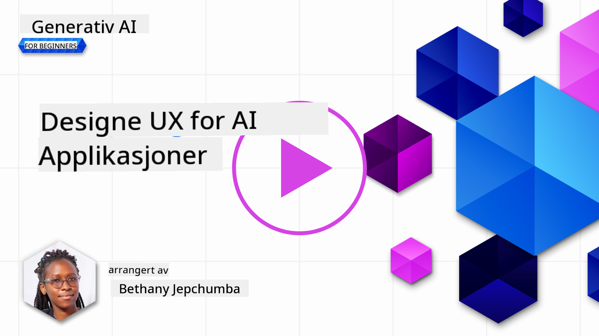
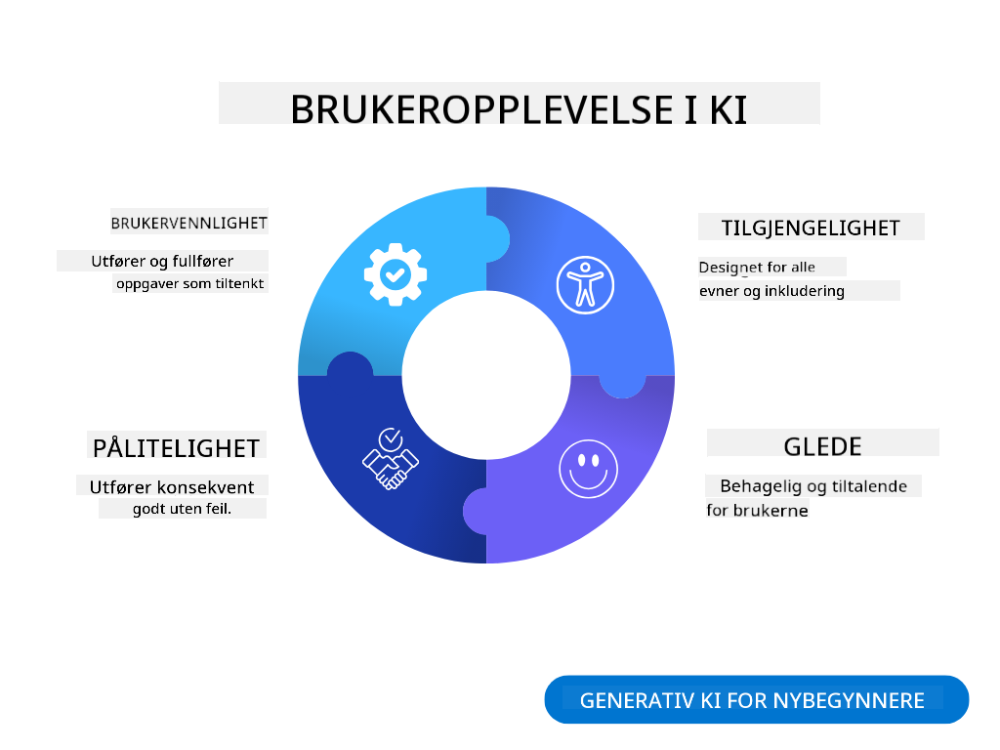
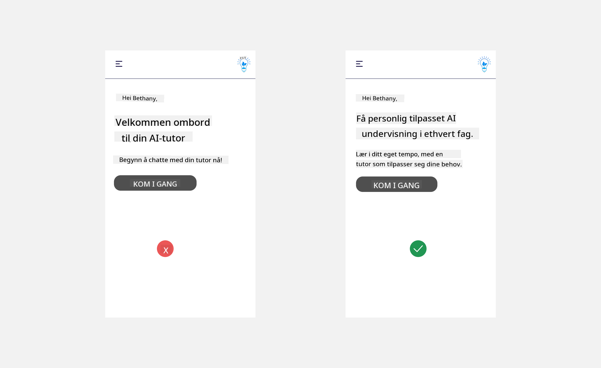
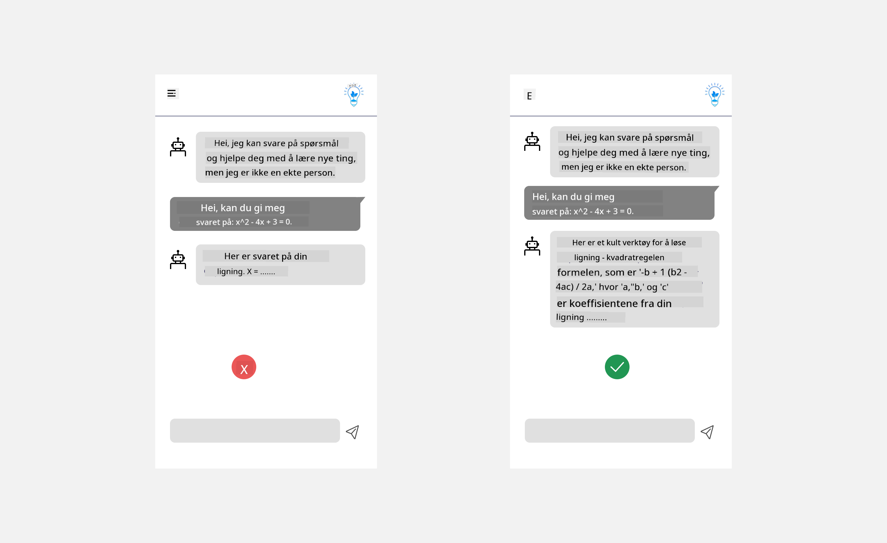
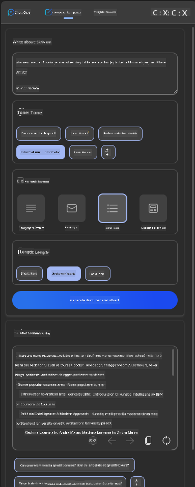
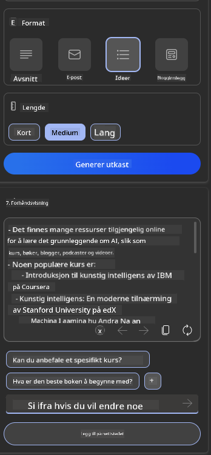
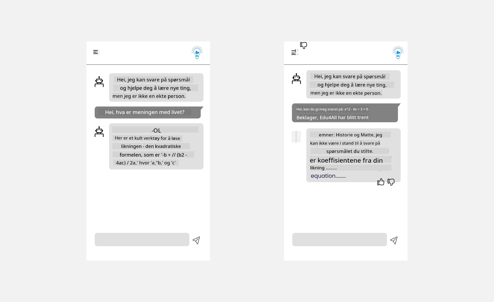

<!--
CO_OP_TRANSLATOR_METADATA:
{
  "original_hash": "747668e4c53d067369f06e9ec2e6313e",
  "translation_date": "2025-08-26T17:40:04+00:00",
  "source_file": "12-designing-ux-for-ai-applications/README.md",
  "language_code": "no"
}
-->
# Designe brukeropplevelse for AI-applikasjoner

> _(Klikk på bildet over for å se videoen til denne leksjonen)_

Brukeropplevelse er en svært viktig del av å lage apper. Brukerne må kunne bruke appen din effektivt for å utføre oppgaver. Det er én ting å være effektiv, men du må også designe apper slik at de kan brukes av alle, altså gjøre dem _tilgjengelige_. Dette kapittelet fokuserer på dette området slik at du forhåpentligvis ender opp med å designe en app folk kan og vil bruke.

## Innledning

Brukeropplevelse handler om hvordan en bruker samhandler med og bruker et bestemt produkt eller tjeneste, enten det er et system, et verktøy eller et design. Når man utvikler AI-applikasjoner, fokuserer utviklere ikke bare på å sikre at brukeropplevelsen er effektiv, men også etisk. I denne leksjonen ser vi på hvordan man bygger kunstig intelligens (AI)-applikasjoner som dekker brukernes behov.

Leksjonen dekker følgende områder:

- Introduksjon til brukeropplevelse og forståelse av brukerbehov
- Designe AI-applikasjoner for tillit og åpenhet
- Designe AI-applikasjoner for samarbeid og tilbakemelding

## Læringsmål

Etter å ha tatt denne leksjonen vil du kunne:

- Forstå hvordan du bygger AI-applikasjoner som møter brukernes behov.
- Designe AI-applikasjoner som fremmer tillit og samarbeid.

### Forutsetning

Ta deg tid til å lese mer om [brukeropplevelse og design thinking.](https://learn.microsoft.com/training/modules/ux-design?WT.mc_id=academic-105485-koreyst)

## Introduksjon til brukeropplevelse og forståelse av brukerbehov

I vår fiktive utdanningsstartup har vi to hovedbrukere, lærere og elever. Hver av disse brukerne har unike behov. Et brukersentrert design setter brukeren i sentrum og sørger for at produktene er relevante og nyttige for dem de er ment for.

Applikasjonen bør være **nyttig, pålitelig, tilgjengelig og behagelig** for å gi en god brukeropplevelse.

### Brukervennlighet

Å være nyttig betyr at applikasjonen har funksjonalitet som passer til formålet, for eksempel å automatisere vurderingsprosessen eller lage flashcards til repetisjon. En applikasjon som automatiserer vurdering bør kunne tildele poeng til elevenes arbeid nøyaktig og effektivt basert på forhåndsdefinerte kriterier. På samme måte bør en applikasjon som lager repetisjonskort kunne lage relevante og varierte spørsmål basert på dataene sine.

### Pålitelighet

Å være pålitelig betyr at applikasjonen kan utføre oppgaven sin konsekvent og uten feil. Men AI, akkurat som mennesker, er ikke perfekt og kan gjøre feil. Applikasjoner kan støte på feil eller uventede situasjoner som krever menneskelig inngripen eller korreksjon. Hvordan håndterer du feil? I siste del av denne leksjonen ser vi på hvordan AI-systemer og applikasjoner designes for samarbeid og tilbakemelding.

### Tilgjengelighet

Å være tilgjengelig betyr å utvide brukeropplevelsen til brukere med ulike evner, inkludert de med funksjonsnedsettelser, slik at ingen blir utelatt. Ved å følge retningslinjer og prinsipper for tilgjengelighet blir AI-løsninger mer inkluderende, brukervennlige og nyttige for alle brukere.

### Behagelig

Å være behagelig betyr at applikasjonen er hyggelig å bruke. En tiltalende brukeropplevelse kan ha en positiv effekt på brukeren, oppmuntre dem til å komme tilbake til applikasjonen og øke inntektene.

Ikke alle utfordringer kan løses med AI. AI brukes for å forbedre brukeropplevelsen, enten det er å automatisere manuelle oppgaver eller å tilpasse brukeropplevelser.

## Designe AI-applikasjoner for tillit og åpenhet

Å bygge tillit er avgjørende når man designer AI-applikasjoner. Tillit gjør at brukeren føler seg trygg på at applikasjonen får jobben gjort, leverer resultater jevnt og at resultatene er det brukeren trenger. En risiko her er mistillit og overdreven tillit. Mistillit oppstår når en bruker har liten eller ingen tillit til et AI-system, noe som fører til at brukeren avviser applikasjonen din. Overdreven tillit oppstår når en bruker overvurderer AI-systemets evner, og stoler for mye på det. For eksempel kan et automatisert vurderingssystem, ved overdreven tillit, føre til at læreren ikke sjekker noen av besvarelsene for å sikre at vurderingssystemet fungerer som det skal. Dette kan føre til urettferdige eller unøyaktige karakterer for elevene, eller tapte muligheter for tilbakemelding og forbedring.

To måter å sikre at tillit står i sentrum av designet er forklarbarhet og kontroll.

### Forklarbarhet

Når AI hjelper til med å ta avgjørelser, som å gi kunnskap til fremtidige generasjoner, er det viktig for lærere og foreldre å forstå hvordan AI tar avgjørelser. Dette er forklarbarhet – å forstå hvordan AI-applikasjoner tar avgjørelser. Å designe for forklarbarhet innebærer å legge til detaljer som viser hvordan AI kom frem til resultatet. Publikum må være klar over at resultatet er generert av AI og ikke et menneske. For eksempel, i stedet for å si "Start å chatte med veilederen din nå", si "Bruk AI-veileder som tilpasser seg dine behov og hjelper deg å lære i ditt tempo."

Et annet eksempel er hvordan AI bruker bruker- og persondata. For eksempel kan en bruker med personaen elev ha begrensninger basert på denne personaen. AI-en kan kanskje ikke gi svar på spørsmål, men kan hjelpe brukeren med å tenke gjennom hvordan de kan løse et problem.

En siste viktig del av forklarbarhet er å forenkle forklaringene. Elever og lærere er kanskje ikke AI-eksperter, derfor bør forklaringene på hva applikasjonen kan og ikke kan gjøre være enkle og lett forståelige.

### Kontroll

Generativ AI skaper et samarbeid mellom AI og brukeren, hvor brukeren for eksempel kan endre promptene for ulike resultater. I tillegg, når et resultat er generert, bør brukeren kunne endre resultatet og dermed få en følelse av kontroll. For eksempel, når du bruker Bing, kan du tilpasse prompten din basert på format, tone og lengde. Du kan også gjøre endringer i resultatet og tilpasse det, som vist under:

En annen funksjon i Bing som gir brukeren kontroll over applikasjonen, er muligheten til å velge om man vil dele data AI-en bruker. For en skoleapplikasjon kan en elev ønske å bruke både egne notater og lærerens ressurser som repetisjonsmateriale.

> Når du designer AI-applikasjoner, er det viktig å være bevisst for å sikre at brukerne ikke får overdreven tillit og setter urealistiske forventninger til hva AI-en kan gjøre. En måte å gjøre dette på er å skape litt friksjon mellom promptene og resultatene. Minn brukeren på at dette er AI og ikke et annet menneske.

## Designe AI-applikasjoner for samarbeid og tilbakemelding

Som nevnt tidligere, skaper generativ AI et samarbeid mellom brukeren og AI. De fleste interaksjoner skjer ved at brukeren skriver inn en prompt og AI-en genererer et resultat. Men hva om resultatet er feil? Hvordan håndterer applikasjonen feil hvis de oppstår? Skylder AI-en på brukeren, eller tar den seg tid til å forklare feilen?

AI-applikasjoner bør bygges slik at de både kan motta og gi tilbakemelding. Dette hjelper ikke bare AI-systemet med å bli bedre, men bygger også tillit hos brukerne. En tilbakemeldingssløyfe bør være en del av designet, for eksempel en enkel tommel opp eller ned på resultatet.

En annen måte å håndtere dette på er å kommunisere tydelig hva systemet kan og ikke kan gjøre. Når en bruker gjør en feil og ber om noe utenfor AI-ens evner, bør det også finnes en måte å håndtere dette på, som vist under.

Systemfeil er vanlige i applikasjoner der brukeren kan trenge hjelp med informasjon utenfor AI-ens område, eller applikasjonen kan ha en grense for hvor mange spørsmål/fag en bruker kan generere sammendrag for. For eksempel kan en AI-applikasjon som er trent på data om et begrenset antall fag, for eksempel historie og matematikk, ikke kunne svare på spørsmål om geografi. For å håndtere dette kan AI-systemet gi et svar som: "Beklager, produktet vårt er trent med data i følgende fag....., jeg kan ikke svare på spørsmålet du stilte."

AI-applikasjoner er ikke perfekte, og de vil derfor gjøre feil. Når du designer applikasjonene dine, bør du sørge for å lage rom for tilbakemelding fra brukerne og feilhåndtering på en enkel og lettfattelig måte.

## Oppgave

Ta en AI-app du har laget så langt, og vurder å implementere følgende steg i appen din:

- **Behagelig:** Tenk over hvordan du kan gjøre appen din mer behagelig å bruke. Gir du forklaringer der det trengs? Oppmuntrer du brukeren til å utforske? Hvordan formulerer du feilmeldingene dine?

- **Brukervennlighet:** Bygger du en webapp? Sørg for at appen din kan navigeres både med mus og tastatur.

- **Tillit og åpenhet:** Ikke stol blindt på AI og resultatene den gir. Tenk over hvordan du kan involvere et menneske i prosessen for å verifisere resultatene. Vurder og implementer også andre måter å oppnå tillit og åpenhet på.

- **Kontroll:** Gi brukeren kontroll over dataene de gir til applikasjonen. Implementer en måte brukeren kan velge å delta eller ikke delta i datainnsamling i AI-applikasjonen.

## Fortsett å lære!

Etter å ha fullført denne leksjonen, sjekk ut vår [Generativ AI-læringssamling](https://aka.ms/genai-collection?WT.mc_id=academic-105485-koreyst) for å fortsette å bygge kunnskap om generativ AI!

Gå videre til leksjon 13, hvor vi skal se på hvordan man [sikrer AI-applikasjoner](../13-securing-ai-applications/README.md?WT.mc_id=academic-105485-koreyst)!

---

**Ansvarsfraskrivelse**:  
Dette dokumentet er oversatt ved hjelp av AI-oversettelsestjenesten [Co-op Translator](https://github.com/Azure/co-op-translator). Selv om vi tilstreber nøyaktighet, vær oppmerksom på at automatiske oversettelser kan inneholde feil eller unøyaktigheter. Det originale dokumentet på sitt opprinnelige språk bør anses som den autoritative kilden. For kritisk informasjon anbefales profesjonell menneskelig oversettelse. Vi er ikke ansvarlige for eventuelle misforståelser eller feiltolkninger som oppstår ved bruk av denne oversettelsen.