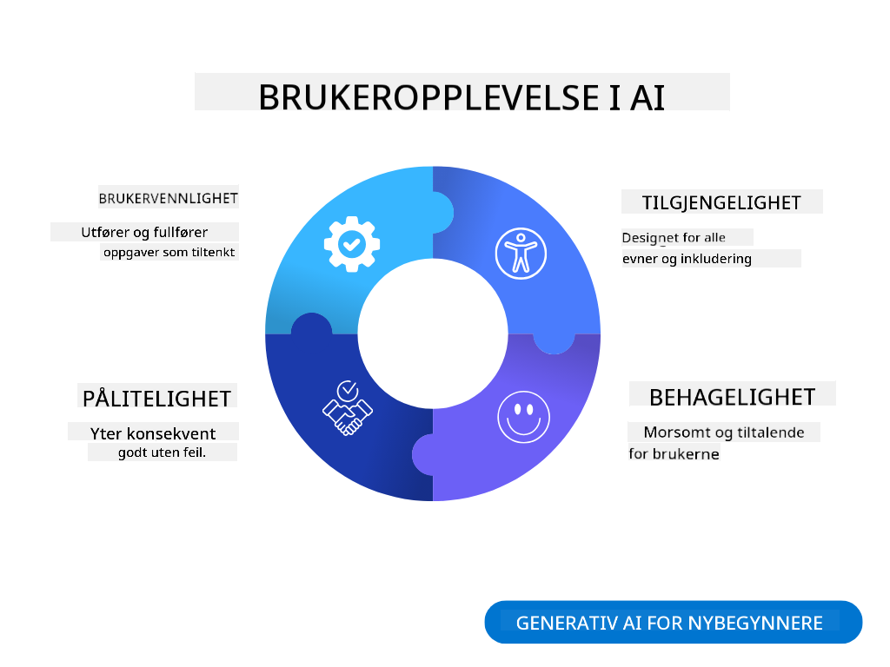
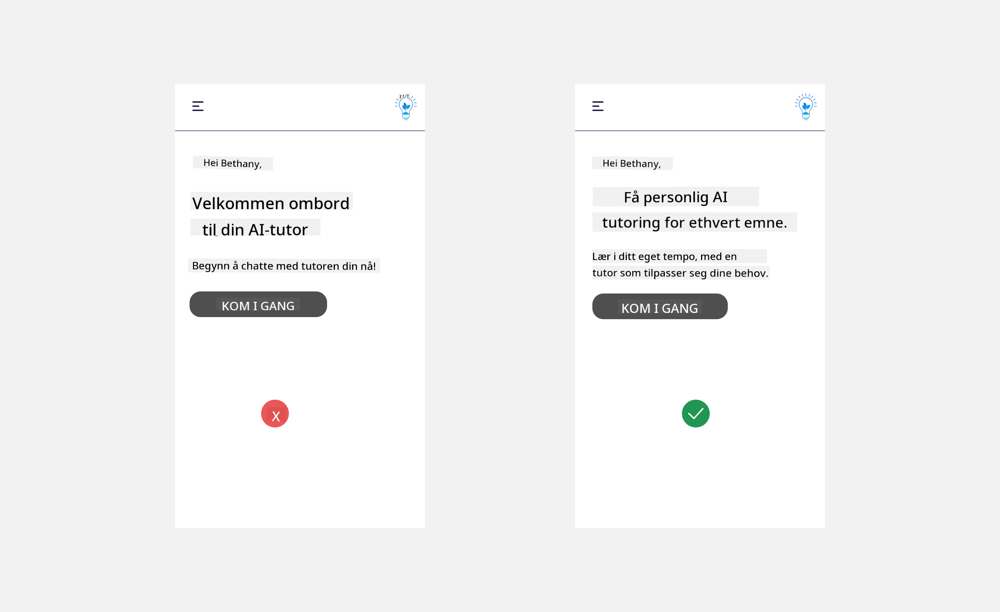
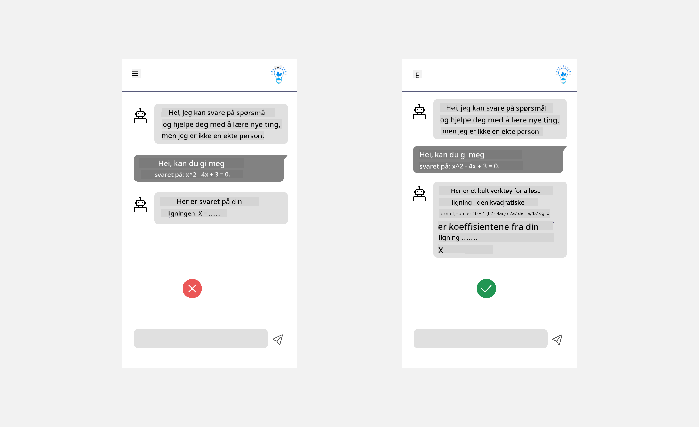
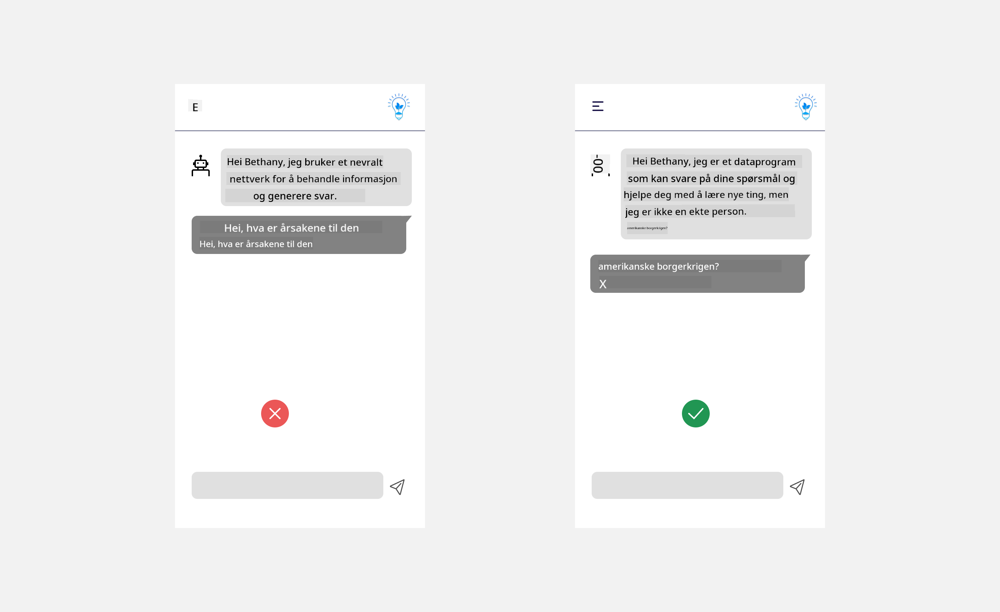
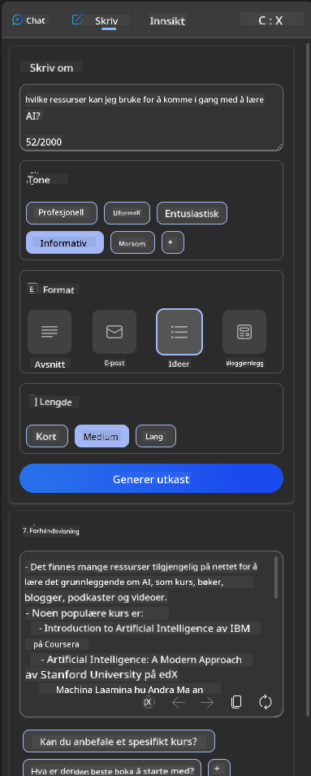
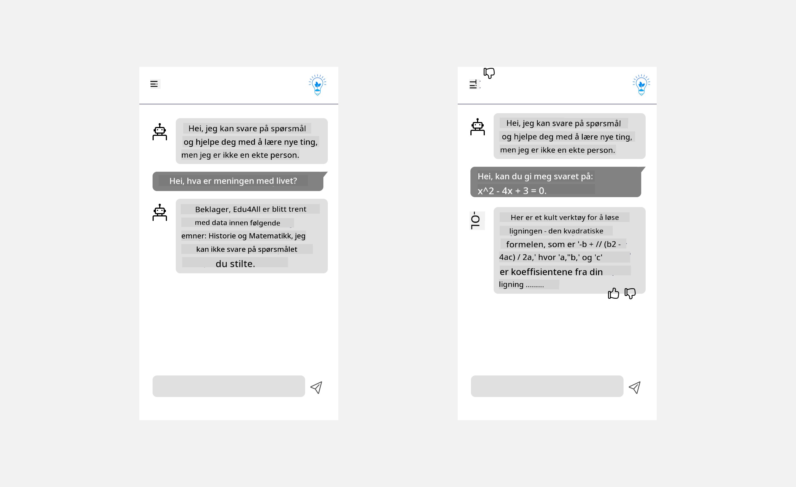

<!--
CO_OP_TRANSLATOR_METADATA:
{
  "original_hash": "ec385b41ee50579025d50cc03bfb3a25",
  "translation_date": "2025-05-19T21:58:07+00:00",
  "source_file": "12-designing-ux-for-ai-applications/README.md",
  "language_code": "no"
}
-->
# Utforme UX for AI-applikasjoner

> _(Klikk på bildet over for å se videoen av denne leksjonen)_

Brukeropplevelse er en svært viktig del av å bygge apper. Brukerne må kunne bruke appen din på en effektiv måte for å utføre oppgaver. Det å være effektiv er én ting, men du må også designe apper slik at de kan brukes av alle, for å gjøre dem _tilgjengelige_. Dette kapittelet vil fokusere på dette området slik at du forhåpentligvis ender opp med å designe en app som folk kan og vil bruke.

## Introduksjon

Brukeropplevelse er hvordan en bruker interagerer med og bruker et spesifikt produkt eller tjeneste, enten det er et system, verktøy eller design. Når man utvikler AI-applikasjoner, fokuserer utviklere ikke bare på å sikre at brukeropplevelsen er effektiv, men også etisk. I denne leksjonen dekker vi hvordan man bygger kunstige intelligens (AI)-applikasjoner som adresserer brukerbehov.

Leksjonen vil dekke følgende områder:

- Introduksjon til brukeropplevelse og forståelse av brukerbehov
- Utforme AI-applikasjoner for tillit og åpenhet
- Utforme AI-applikasjoner for samarbeid og tilbakemelding

## Læringsmål

Etter å ha tatt denne leksjonen, vil du kunne:

- Forstå hvordan man bygger AI-applikasjoner som møter brukerbehov.
- Designe AI-applikasjoner som fremmer tillit og samarbeid.

### Forutsetning

Ta deg tid til å lese mer om [brukeropplevelse og designtenking.](https://learn.microsoft.com/training/modules/ux-design?WT.mc_id=academic-105485-koreyst)

## Introduksjon til brukeropplevelse og forståelse av brukerbehov

I vår fiktive utdanningsstartup har vi to primære brukere, lærere og elever. Hver av de to brukerne har unike behov. En brukersentrert design prioriterer brukeren og sikrer at produktene er relevante og fordelaktige for dem det er ment for.

Applikasjonen bør være **nyttig, pålitelig, tilgjengelig og behagelig** for å gi en god brukeropplevelse.

### Brukervennlighet

Å være nyttig betyr at applikasjonen har funksjonalitet som matcher dens tiltenkte formål, slik som å automatisere karaktergivingsprosessen eller generere flashkort for revisjon. En applikasjon som automatiserer karaktergivingsprosessen bør kunne tildele poeng til elevenes arbeid nøyaktig og effektivt basert på forhåndsdefinerte kriterier. Tilsvarende bør en applikasjon som genererer revisjonsflashkort kunne lage relevante og varierte spørsmål basert på sine data.

### Pålitelighet

Å være pålitelig betyr at applikasjonen kan utføre sine oppgaver konsekvent og uten feil. Imidlertid er AI, akkurat som mennesker, ikke perfekt og kan være utsatt for feil. Applikasjonene kan støte på feil eller uventede situasjoner som krever menneskelig intervensjon eller korrigering. Hvordan håndterer du feil? I den siste delen av denne leksjonen vil vi dekke hvordan AI-systemer og applikasjoner er designet for samarbeid og tilbakemelding.

### Tilgjengelighet

Å være tilgjengelig betyr å utvide brukeropplevelsen til brukere med ulike evner, inkludert de med funksjonshemninger, og sikre at ingen blir utelatt. Ved å følge retningslinjer og prinsipper for tilgjengelighet, blir AI-løsninger mer inkluderende, brukbare og fordelaktige for alle brukere.

### Behagelig

Å være behagelig betyr at applikasjonen er hyggelig å bruke. En tiltalende brukeropplevelse kan ha en positiv innvirkning på brukeren og oppmuntre dem til å komme tilbake til applikasjonen, og dermed øke forretningsinntektene.

Ikke alle utfordringer kan løses med AI. AI kommer inn for å forbedre brukeropplevelsen din, enten det er å automatisere manuelle oppgaver eller å tilpasse brukeropplevelser.

## Utforme AI-applikasjoner for tillit og åpenhet

Å bygge tillit er kritisk når man designer AI-applikasjoner. Tillit sikrer at en bruker er trygg på at applikasjonen vil få jobben gjort, levere resultater konsekvent, og at resultatene er hva brukeren trenger. En risiko i dette området er mistillit og overtro. Mistillit oppstår når en bruker har liten eller ingen tillit til et AI-system, noe som fører til at brukeren avviser applikasjonen din. Overtro oppstår når en bruker overvurderer kapasiteten til et AI-system, noe som fører til at brukerne stoler for mye på AI-systemet. For eksempel kan et automatisk karaktergivingssystem i tilfelle overtro føre til at læreren ikke sjekker noen av papirene for å sikre at karaktergivingssystemet fungerer godt. Dette kan resultere i urettferdige eller unøyaktige karakterer for elevene, eller tapte muligheter for tilbakemelding og forbedring.

To måter å sikre at tillit er satt i sentrum av designet er forklarbarhet og kontroll.

### Forklarbarhet

Når AI hjelper til med å informere beslutninger, som å gi kunnskap til fremtidige generasjoner, er det viktig for lærere og foreldre å forstå hvordan AI-beslutninger tas. Dette er forklarbarhet - å forstå hvordan AI-applikasjoner tar beslutninger. Å designe for forklarbarhet inkluderer å legge til detaljer om eksempler på hva en AI-applikasjon kan gjøre. For eksempel, i stedet for "Kom i gang med AI-lærer", kan systemet bruke: "Oppsummer notatene dine for enklere revisjon med AI."

Et annet eksempel er hvordan AI bruker bruker- og personlige data. For eksempel kan en bruker med personaelev ha begrensninger basert på sin persona. AI kan kanskje ikke avsløre svar på spørsmål, men kan hjelpe med å veilede brukeren til å tenke gjennom hvordan de kan løse et problem.

En siste viktig del av forklarbarhet er forenkling av forklaringer. Elever og lærere er kanskje ikke AI-eksperter, derfor bør forklaringer av hva applikasjonen kan eller ikke kan gjøre forenkles og være lett å forstå.

### Kontroll

Generativ AI skaper et samarbeid mellom AI og brukeren, hvor en bruker for eksempel kan endre forespørsler for forskjellige resultater. I tillegg, når en output er generert, bør brukere kunne endre resultatene og gi dem en følelse av kontroll. For eksempel, når du bruker Bing, kan du tilpasse forespørselen din basert på format, tone og lengde. I tillegg kan du legge til endringer i outputen din og endre resultatet som vist nedenfor:

En annen funksjon i Bing som lar en bruker ha kontroll over applikasjonen er muligheten til å velge inn og ut av data AI bruker. For en skoleapplikasjon kan en elev ønske å bruke sine notater samt lærernes ressurser som revisjonsmateriale.

> Når du designer AI-applikasjoner, er det viktig å sikre at brukerne ikke stoler for mye på AI og setter urealistiske forventninger til dens evner. En måte å gjøre dette på er å skape friksjon mellom forespørslene og resultatene. Minne brukeren på at dette er AI og ikke et annet menneske

## Utforme AI-applikasjoner for samarbeid og tilbakemelding

Som tidligere nevnt, skaper generativ AI et samarbeid mellom brukeren og AI. De fleste engasjementene er med en bruker som skriver inn en forespørsel og AI som genererer en output. Hva om outputen er feil? Hvordan håndterer applikasjonen feil hvis de oppstår? Skylder AI på brukeren eller tar seg tid til å forklare feilen?

AI-applikasjoner bør bygges inn for å motta og gi tilbakemelding. Dette hjelper ikke bare AI-systemet med å forbedre seg, men bygger også tillit med brukerne. En tilbakemeldingssløyfe bør inkluderes i designet, et eksempel kan være en enkel tommel opp eller ned på outputen.

En annen måte å håndtere dette på er å kommunisere tydelig systemets evner og begrensninger. Når en bruker gjør en feil ved å be om noe utover AI-evnene, bør det også være en måte å håndtere dette på, som vist nedenfor.

Systemfeil er vanlige med applikasjoner der brukeren kan trenge assistanse med informasjon utenfor AI-omfanget eller applikasjonen kan ha en grense for hvor mange spørsmål/emner en bruker kan generere sammendrag. For eksempel, en AI-applikasjon trent med data om begrensede emner, for eksempel historie og matematikk, kan kanskje ikke håndtere spørsmål rundt geografi. For å dempe dette kan AI-systemet gi et svar som: "Beklager, produktet vårt har blitt trent med data i følgende emner....., jeg kan ikke svare på spørsmålet du stilte."

AI-applikasjoner er ikke perfekte, derfor er de tilbøyelige til å gjøre feil. Når du designer applikasjonene dine, bør du sørge for å lage rom for tilbakemelding fra brukere og feilhåndtering på en måte som er enkel og lett forklarbar.

## Oppgave

Ta noen AI-apper du har bygget så langt, og vurder å implementere følgende trinn i appen din:

- **Behagelig:** Vurder hvordan du kan gjøre appen din mer behagelig. Legger du til forklaringer overalt? Oppmuntrer du brukeren til å utforske? Hvordan formulerer du feilmeldingene dine?

- **Brukervennlighet:** Bygge en webapp. Sørg for at appen din kan navigeres med både mus og tastatur.

- **Tillit og åpenhet:** Ikke stol helt på AI og dens output, vurder hvordan du ville legge til et menneske i prosessen for å verifisere outputen. Vurder også og implementer andre måter å oppnå tillit og åpenhet.

- **Kontroll:** Gi brukeren kontroll over dataene de gir til applikasjonen. Implementer en måte brukeren kan velge inn og ut av datainnsamling i AI-applikasjonen.

## Fortsett læringen din!

Etter å ha fullført denne leksjonen, sjekk ut vår [Generativ AI-læringssamling](https://aka.ms/genai-collection?WT.mc_id=academic-105485-koreyst) for å fortsette å øke din kunnskap om Generativ AI!

Gå videre til leksjon 13, hvor vi vil se på hvordan man [sikrer AI-applikasjoner](../13-securing-ai-applications/README.md?WT.mc_id=academic-105485-koreyst)!

**Ansvarsfraskrivelse**:
Dette dokumentet er oversatt ved hjelp av AI-oversettelsestjenesten [Co-op Translator](https://github.com/Azure/co-op-translator). Selv om vi jobber for å sikre nøyaktighet, vær oppmerksom på at automatiserte oversettelser kan inneholde feil eller unøyaktigheter. Det originale dokumentet på dets opprinnelige språk bør betraktes som den autoritative kilden. For kritisk informasjon anbefales profesjonell menneskelig oversettelse. Vi er ikke ansvarlige for eventuelle misforståelser eller feiltolkninger som oppstår ved bruk av denne oversettelsen.