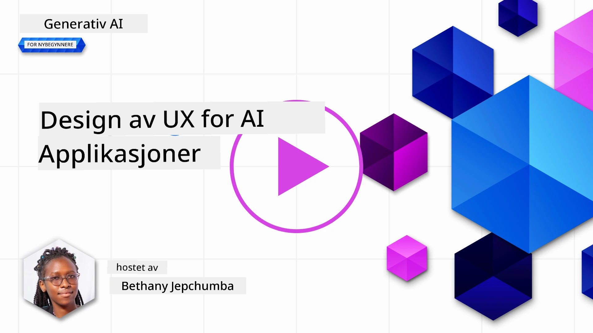
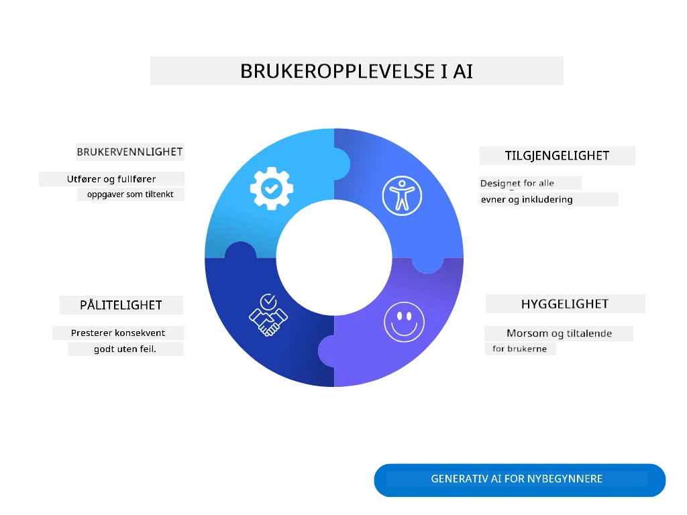
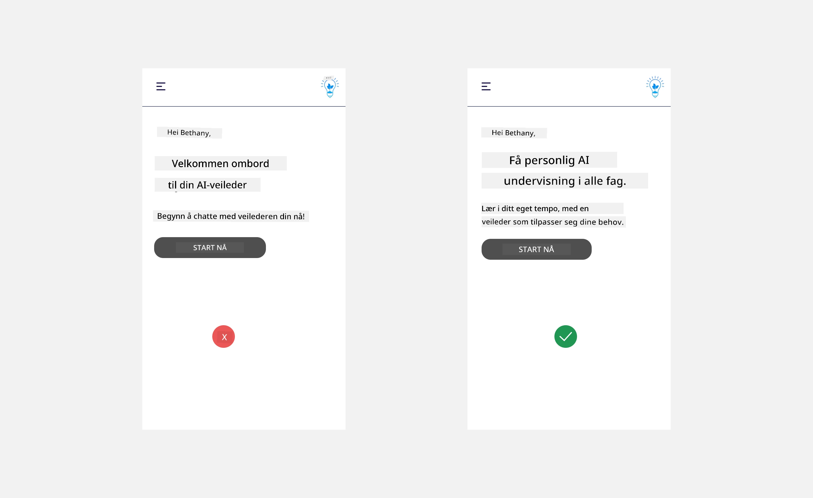
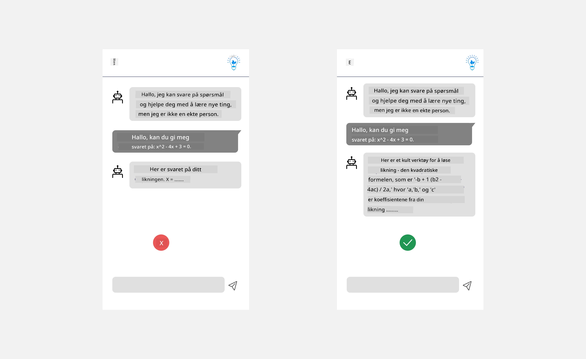
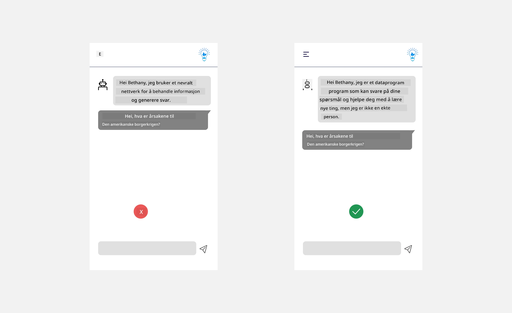
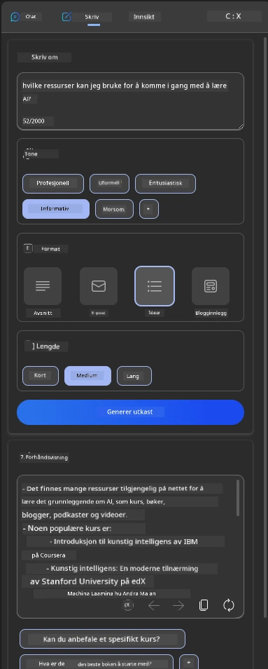
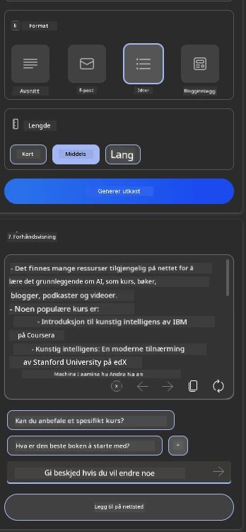
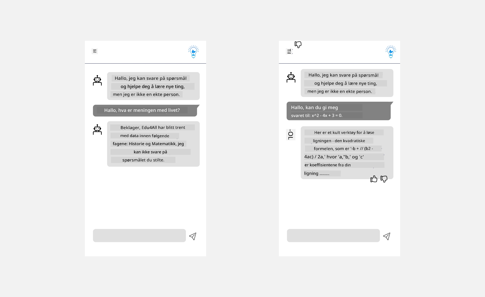

# Utforme UX for AI-applikasjoner

> _(Klikk på bildet ovenfor for å se video av denne leksjonen)_

Brukeropplevelse er et veldig viktig aspekt ved å bygge apper. Brukere må kunne bruke appen din på en effektiv måte for å utføre oppgaver. Å være effektivt er én ting, men du må også utforme apper slik at de kan brukes av alle, for å gjøre dem _tilgjengelige_. Dette kapitlet vil fokusere på dette området slik at du forhåpentligvis ender opp med å designe en app som folk kan og vil bruke.

## Introduksjon

Brukeropplevelse er hvordan en bruker interagerer med og bruker et spesifikt produkt eller en tjeneste, enten det er et system, verktøy eller design. Når man utvikler AI-applikasjoner, fokuserer utviklere ikke bare på å sikre at brukeropplevelsen er effektiv, men også etisk. I denne leksjonen dekker vi hvordan man bygger kunstig intelligens (AI)-applikasjoner som dekker brukernes behov.

Leksjonen vil dekke følgende områder:

- Introduksjon til brukeropplevelse og forståelse av brukernes behov
- Utforme AI-applikasjoner for tillit og åpenhet
- Utforme AI-applikasjoner for samarbeid og tilbakemelding

## Læringsmål

Etter å ha tatt denne leksjonen vil du kunne:

- Forstå hvordan du bygger AI-applikasjoner som møter brukernes behov.
- Designe AI-applikasjoner som fremmer tillit og samarbeid.

### Forutsetninger

Sett av litt tid og les mer om [brukeropplevelse og design thinking.](https://learn.microsoft.com/training/modules/ux-design?WT.mc_id=academic-105485-koreyst)

## Introduksjon til brukeropplevelse og forståelse av brukernes behov

I vår fiktive utdanningsoppstart har vi to primære brukere, lærere og studenter. Hver av de to brukerne har unike behov. Et brukersentrert design prioriterer brukeren ved å sikre at produktene er relevante og fordelaktige for de det er ment for.

Applikasjonen bør være **nyttig, pålitelig, tilgjengelig og hyggelig** for å gi en god brukeropplevelse.

### Brukervennlighet

Å være nyttig betyr at applikasjonen har funksjonalitet som samsvarer med det tiltenkte formålet, for eksempel å automatisere karaktersettingsprosessen eller generere flashkort for repetisjon. En applikasjon som automatiserer karaktersettingsprosessen bør kunne tildele poeng til studentenes arbeid nøyaktig og effektivt basert på forhåndsdefinerte kriterier. På samme måte bør en applikasjon som genererer repetisjonsflashkort kunne lage relevante og varierte spørsmål basert på sine data.

### Pålitelighet

Å være pålitelig betyr at applikasjonen kan utføre sin oppgave konsekvent og uten feil. Men AI er, akkurat som mennesker, ikke perfekt og kan være utsatt for feil. Applikasjonene kan støte på feil eller uventede situasjoner som krever menneskelig inngripen eller korrigering. Hvordan håndterer du feil? I den siste delen av denne leksjonen vil vi dekke hvordan AI-systemer og applikasjoner er designet for samarbeid og tilbakemelding.

### Tilgjengelighet

Å være tilgjengelig betyr å utvide brukeropplevelsen til brukere med ulike evner, inkludert de med funksjonshemminger, og sikre at ingen blir utelatt. Ved å følge retningslinjer og prinsipper for tilgjengelighet blir AI-løsninger mer inkluderende, brukbare og fordelaktige for alle brukere.

### Hyggelig

Å være hyggelig betyr at applikasjonen er morsom å bruke. En attraktiv brukeropplevelse kan ha en positiv effekt på brukeren og oppmuntre dem til å komme tilbake til applikasjonen, noe som øker forretningsinntektene.

Ikke alle utfordringer kan løses med AI. AI kommer inn for å forbedre brukeropplevelsen, enten det er å automatisere manuelle oppgaver eller å personalisere brukeropplevelser.

## Utforme AI-applikasjoner for tillit og åpenhet

Å bygge tillit er avgjørende når man utformer AI-applikasjoner. Tillit sikrer at en bruker er trygg på at applikasjonen vil utføre arbeidet, levere resultater konsekvent, og at resultatene er det brukeren trenger. En risiko i dette området er mistillit og overtilit. Mistillit oppstår når en bruker har liten eller ingen tillit til et AI-system, noe som fører til at brukeren avviser applikasjonen din. Overtilit oppstår når en bruker overvurderer kapasiteten til et AI-system, noe som fører til at brukerne stoler for mye på AI-systemet. For eksempel kan et automatisert vurderingssystem ved overtilit føre til at læreren ikke korrekturleser noen av oppgavene for å sikre at vurderingssystemet fungerer godt. Dette kan resultere i urettferdige eller unøyaktige karakterer for studentene, eller tapte muligheter for tilbakemelding og forbedring.

To måter å sikre at tillit er satt i sentrum av designen er forklarbarhet og kontroll.

### Forklarbarhet

Når AI hjelper til med å informere beslutninger som å formidle kunnskap til fremtidige generasjoner, er det avgjørende for lærere og foreldre å forstå hvordan AI-beslutninger blir tatt. Dette er forklarbarhet – å forstå hvordan AI-applikasjoner tar beslutninger. Å designe for forklarbarhet inkluderer å legge til detaljer som fremhever hvordan AI kom fram til resultatet. Publikum må være klar over at resultatet er generert av AI og ikke et menneske. For eksempel, i stedet for å si "Start å chatte med veilederen din nå" si "Bruk AI-veileder som tilpasser seg dine behov og hjelper deg å lære i ditt eget tempo."

Et annet eksempel er hvordan AI bruker bruker- og persondata. For eksempel kan en bruker med personasen student ha begrensninger basert på deres persona. AI-en kan ikke kunne avsløre svar på spørsmål, men kan hjelpe brukeren til å tenke gjennom hvordan de kan løse et problem.

En siste viktig del av forklarbarhet er forenkling av forklaringer. Studenter og lærere er kanskje ikke AI-eksperter, derfor bør forklaringer av hva applikasjonen kan eller ikke kan gjøre være forenklet og lett å forstå.

### Kontroll

Generativ AI skaper et samarbeid mellom AI og brukeren, der for eksempel en bruker kan endre forespørsler for ulike resultater. I tillegg, når et resultat er generert, bør brukere kunne endre resultatene, noe som gir dem en følelse av kontroll. For eksempel, når du bruker Microsoft Copilot (tidligere Bing Chat), kan du tilpasse forespørselen din basert på format, tone og lengde. I tillegg kan du legge til endringer i resultatet og justere det som vist nedenfor:

En annen funksjon i Microsoft Copilot som lar en bruker ha kontroll over applikasjonen er muligheten til å melde seg inn og ut av data som AI bruker. For en skoleapplikasjon kan en student ønske å bruke sine egne notater samt lærernes ressurser som repetisjonsmateriale.

> Når man designer AI-applikasjoner er hensikt avgjørende for å sikre at brukerne ikke overtilit ved å sette urealistiske forventninger til dens kapasiteter. En måte å gjøre dette på er ved å skape friksjon mellom forespørsler og resultater. Minne brukeren om at dette er AI og ikke en medmenneskelig person.

## Utforme AI-applikasjoner for samarbeid og tilbakemelding

Som nevnt tidligere skaper generativ AI et samarbeid mellom brukeren og AI. De fleste engasjementer skjer ved at brukeren skriver en forespørsel og AI genererer et resultat. Hva om resultatet er feil? Hvordan håndterer applikasjonen feil hvis de oppstår? Skylder AI på brukeren eller tar seg tid til å forklare feilen?

AI-applikasjoner bør bygges inn for å motta og gi tilbakemeldinger. Dette hjelper ikke bare AI-systemet å forbedre seg, men bygger også tillit hos brukerne. En tilbakemeldingssløyfe bør inkluderes i designet, for eksempel med en enkel tommel opp eller ned på resultatet.

En annen måte å håndtere dette på er å tydelig kommunisere systemets kapasiteter og begrensninger. Når en bruker gjør en feil og ber om noe utenfor AI-ens evner, bør det også finnes en måte å håndtere dette på, som vist nedenfor.

Systemfeil er vanlige i applikasjoner der brukeren kan trenge hjelp med informasjon utenfor AI-ens rekkevidde, eller applikasjonen kan ha en grense for hvor mange spørsmål/emner en bruker kan generere sammendrag for. For eksempel kan en AI-applikasjon trent med data på begrensede fag, for eksempel historie og matte, ikke kunne håndtere spørsmål om geografi. For å redusere dette kan AI-systemet gi et svar som: "Beklager, produktet vårt er trent med data innen følgende fag..., jeg kan ikke svare på spørsmålet du stilte."

AI-applikasjoner er ikke perfekte, derfor vil de gjøre feil. Når du designer applikasjonene dine, bør du sørge for at det finnes rom for tilbakemelding fra brukerne og feilbehandling på en måte som er enkel og lett å forklare.

## Oppgave

Ta alle AI-appene du har bygget så langt, vurder å implementere følgende trinn i appen din:

- **Hyggelig:** Vurder hvordan du kan gjøre appen din mer hyggelig. Legger du til forklaringer overalt? Oppmuntrer du brukeren til å utforske? Hvordan formulerer du feilmeldingene dine?

- **Brukervennlighet:** Bygger du en webapp? Sørg for at appen din er navigerbar med både mus og tastatur.

- **Tillit og åpenhet:** Stol ikke helt på AI og dens resultater, vurder hvordan du kan legge til et menneske i prosessen for å verifisere resultatet. Vurder også og implementer andre måter å oppnå tillit og åpenhet på.

- **Kontroll:** Gi brukeren kontroll over de dataene de oppgir til applikasjonen. Implementer en måte en bruker kan melde seg inn og ut av datainnsamling i AI-applikasjonen.

<!-- ## [Post-lecture quiz](../../../12-designing-ux-for-ai-applications/quiz-url) -->

## Fortsett læringen din!

Etter å ha fullført denne leksjonen, sjekk ut vår [Generative AI Learning collection](https://aka.ms/genai-collection?WT.mc_id=academic-105485-koreyst) for å fortsette å heve ditt nivå innen Generativ AI!

Gå videre til leksjon 13, hvor vi vil se på hvordan man [sikrer AI-applikasjoner](../13-securing-ai-applications/README.md?WT.mc_id=academic-105485-koreyst)!

---

<!-- CO-OP TRANSLATOR DISCLAIMER START -->
**Ansvarsfraskrivelse**:
Dette dokumentet er oversatt ved hjelp av AI-oversettelsestjenesten [Co-op Translator](https://github.com/Azure/co-op-translator). Selv om vi streber etter nøyaktighet, vær oppmerksom på at automatiske oversettelser kan inneholde feil eller unøyaktigheter. Det opprinnelige dokumentet på originalspråket skal betraktes som den autoritative kilden. For kritisk informasjon anbefales profesjonell menneskelig oversettelse. Vi er ikke ansvarlige for eventuelle misforståelser eller feiltolkninger som oppstår ved bruk av denne oversettelsen.
<!-- CO-OP TRANSLATOR DISCLAIMER END -->