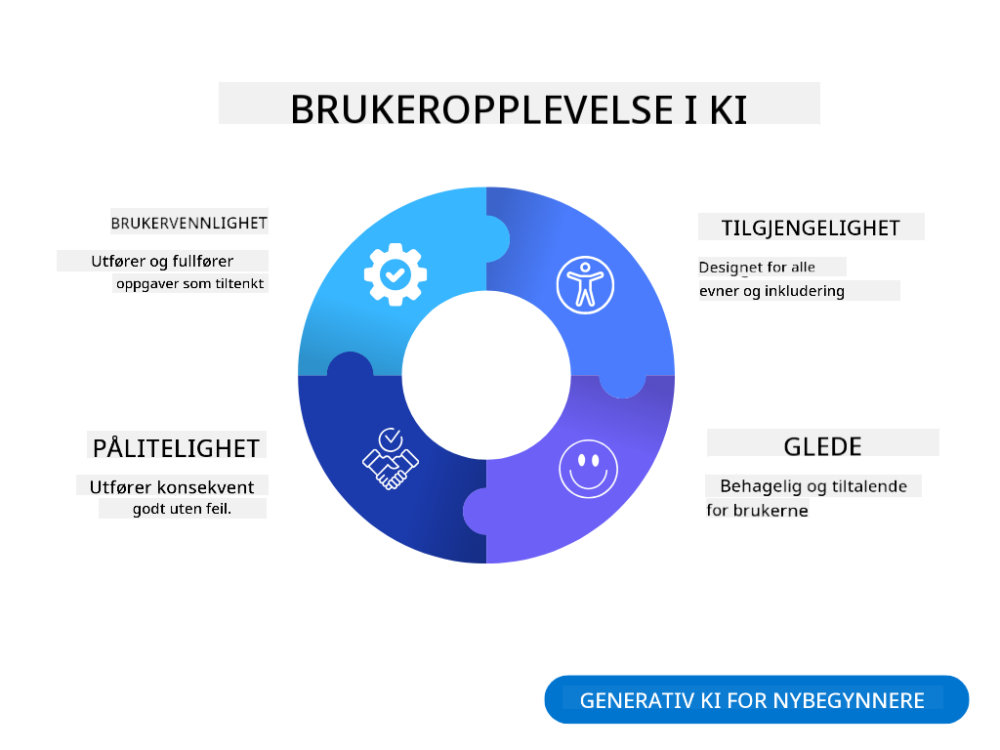
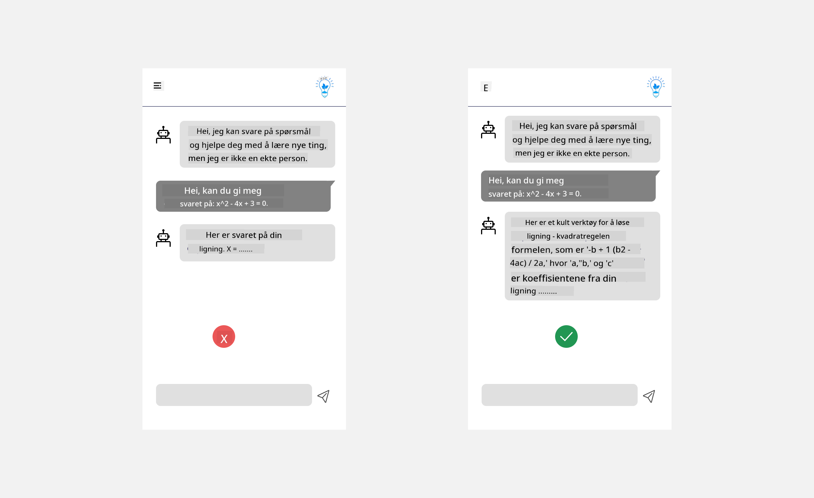
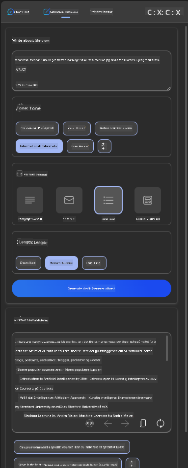
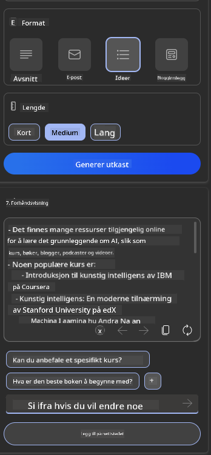
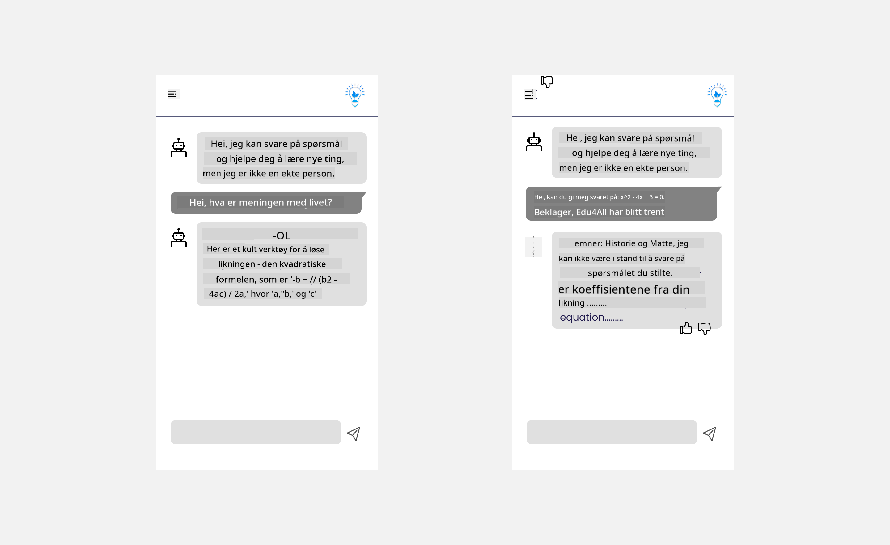

<!--
CO_OP_TRANSLATOR_METADATA:
{
  "original_hash": "ec385b41ee50579025d50cc03bfb3a25",
  "translation_date": "2025-06-25T20:25:31+00:00",
  "source_file": "12-designing-ux-for-ai-applications/README.md",
  "language_code": "no"
}
-->
# Utforme brukeropplevelse for AI-applikasjoner

> _(Klikk på bildet ovenfor for å se videoen av denne leksjonen)_

Brukeropplevelse er en svært viktig del av å bygge apper. Brukere må kunne bruke appen din på en effektiv måte for å utføre oppgaver. Å være effektiv er én ting, men du må også designe apper slik at de kan brukes av alle, for å gjøre dem _tilgjengelige_. Dette kapittelet vil fokusere på dette området slik at du forhåpentligvis ender opp med å designe en app som folk kan og vil bruke.

## Introduksjon

Brukeropplevelse handler om hvordan en bruker interagerer med og bruker et spesifikt produkt eller tjeneste, enten det er et system, verktøy eller design. Når du utvikler AI-applikasjoner, fokuserer utviklere ikke bare på å sikre at brukeropplevelsen er effektiv, men også etisk. I denne leksjonen dekker vi hvordan du bygger kunstig intelligens (AI)-applikasjoner som tar hensyn til brukernes behov.

Leksjonen vil dekke følgende områder:

- Introduksjon til brukeropplevelse og forståelse av brukernes behov
- Utforme AI-applikasjoner for tillit og åpenhet
- Utforme AI-applikasjoner for samarbeid og tilbakemelding

## Læringsmål

Etter å ha tatt denne leksjonen vil du kunne:

- Forstå hvordan du bygger AI-applikasjoner som oppfyller brukernes behov.
- Designe AI-applikasjoner som fremmer tillit og samarbeid.

### Forutsetning

Ta deg tid til å lese mer om [brukeropplevelse og design tenkning.](https://learn.microsoft.com/training/modules/ux-design?WT.mc_id=academic-105485-koreyst)

## Introduksjon til brukeropplevelse og forståelse av brukernes behov

I vår fiktive utdanningsoppstart har vi to primære brukere, lærere og elever. Hver av de to brukerne har unike behov. Et brukersentrert design prioriterer brukeren, og sikrer at produktene er relevante og nyttige for dem de er ment for.

Applikasjonen bør være **nyttig, pålitelig, tilgjengelig og behagelig** for å gi en god brukeropplevelse.

### Brukervennlighet

Å være nyttig betyr at applikasjonen har funksjonalitet som samsvarer med dens tiltenkte formål, for eksempel å automatisere vurderingsprosessen eller generere flashcards for repetisjon. En applikasjon som automatiserer vurderingsprosessen bør kunne tildele poeng til elevenes arbeid nøyaktig og effektivt basert på forhåndsdefinerte kriterier. Tilsvarende bør en applikasjon som genererer repetisjons-flashcards kunne lage relevante og varierte spørsmål basert på sine data.

### Pålitelighet

Å være pålitelig betyr at applikasjonen kan utføre sine oppgaver konsekvent og uten feil. Imidlertid er AI, akkurat som mennesker, ikke perfekt og kan være utsatt for feil. Applikasjonene kan oppleve feil eller uventede situasjoner som krever menneskelig inngripen eller korreksjon. Hvordan håndterer du feil? I den siste delen av denne leksjonen vil vi dekke hvordan AI-systemer og applikasjoner er designet for samarbeid og tilbakemelding.

### Tilgjengelighet

Å være tilgjengelig betyr å utvide brukeropplevelsen til brukere med ulike evner, inkludert de med funksjonshemminger, og sikre at ingen blir utelatt. Ved å følge retningslinjer og prinsipper for tilgjengelighet, blir AI-løsninger mer inkluderende, brukervennlige og nyttige for alle brukere.

### Behagelig

Å være behagelig betyr at applikasjonen er hyggelig å bruke. En tiltalende brukeropplevelse kan ha en positiv innvirkning på brukeren, oppmuntre dem til å komme tilbake til applikasjonen og øke forretningsinntektene.

Ikke alle utfordringer kan løses med AI. AI kommer inn for å forbedre brukeropplevelsen din, enten det er å automatisere manuelle oppgaver eller tilpasse brukeropplevelser.

## Utforme AI-applikasjoner for tillit og åpenhet

Å bygge tillit er avgjørende når du designer AI-applikasjoner. Tillit sikrer at en bruker er trygg på at applikasjonen vil få arbeidet gjort, levere resultater konsekvent, og at resultatene er det brukeren trenger. En risiko i dette området er mistillit og overtro. Mistillit oppstår når en bruker har liten eller ingen tillit til et AI-system, noe som fører til at brukeren avviser applikasjonen din. Overtro oppstår når en bruker overvurderer kapasiteten til et AI-system, noe som fører til at brukerne stoler for mye på AI-systemet. For eksempel kan et automatisert vurderingssystem i tilfelle overtro føre til at læreren ikke beviser noen av papirene for å sikre at vurderingssystemet fungerer godt. Dette kan resultere i urettferdige eller unøyaktige karakterer for elevene, eller tapte muligheter for tilbakemelding og forbedring.

To måter å sikre at tillit settes i sentrum for designet er forklarbarhet og kontroll.

### Forklarbarhet

Når AI hjelper til med å informere beslutninger som å gi kunnskap til fremtidige generasjoner, er det viktig for lærere og foreldre å forstå hvordan AI-beslutninger blir tatt. Dette er forklarbarhet - forståelse av hvordan AI-applikasjoner tar beslutninger. Å designe for forklarbarhet inkluderer å legge til detaljer om eksempler på hva en AI-applikasjon kan gjøre. For eksempel, i stedet for "Kom i gang med AI-lærer", kan systemet bruke: "Oppsummer notatene dine for enklere repetisjon ved hjelp av AI."

Et annet eksempel er hvordan AI bruker bruker- og personlige data. For eksempel kan en bruker med personaen student ha begrensninger basert på deres persona. AI kan kanskje ikke avsløre svar på spørsmål, men kan hjelpe til med å veilede brukeren til å tenke gjennom hvordan de kan løse et problem.

En siste viktig del av forklarbarhet er forenkling av forklaringer. Elever og lærere er kanskje ikke AI-eksperter, derfor bør forklaringer av hva applikasjonen kan eller ikke kan gjøre være forenklet og lett å forstå.

### Kontroll

Generativ AI skaper et samarbeid mellom AI og brukeren, der for eksempel en bruker kan endre forespørselene for forskjellige resultater. I tillegg, når en utdata er generert, bør brukerne kunne endre resultatene, og gi dem en følelse av kontroll. For eksempel, når du bruker Bing, kan du tilpasse forespørselen din basert på format, tone og lengde. I tillegg kan du legge til endringer i utdataene dine og endre utdataene som vist nedenfor:

En annen funksjon i Bing som lar en bruker ha kontroll over applikasjonen er muligheten til å velge å delta og velge bort dataene AI bruker. For en skoleapplikasjon kan en student ønske å bruke sine notater så vel som lærernes ressurser som repetisjonsmateriale.

> Når du designer AI-applikasjoner, er intensjonalitet nøkkelen til å sikre at brukerne ikke overdriver og setter urealistiske forventninger til dens evner. En måte å gjøre dette på er å skape friksjon mellom forespørslene og resultatene. Minne brukeren om at dette er AI og ikke et annet menneske.

## Utforme AI-applikasjoner for samarbeid og tilbakemelding

Som nevnt tidligere, skaper generativ AI et samarbeid mellom brukeren og AI. De fleste interaksjoner er med en bruker som legger inn en forespørsel og AI som genererer en utdata. Hva om utdataene er feil? Hvordan håndterer applikasjonen feil hvis de oppstår? Klandrer AI brukeren eller tar det tid til å forklare feilen?

AI-applikasjoner bør bygges for å motta og gi tilbakemelding. Dette hjelper ikke bare AI-systemet med å forbedre seg, men bygger også tillit med brukerne. En tilbakemeldingssløyfe bør inkluderes i designet, et eksempel kan være en enkel tommel opp eller ned på utdataene.

En annen måte å håndtere dette på er å tydelig kommunisere systemets evner og begrensninger. Når en bruker gjør en feil ved å be om noe utenfor AI-evnene, bør det også være en måte å håndtere dette på, som vist nedenfor.

Systemfeil er vanlige med applikasjoner der brukeren kanskje trenger hjelp med informasjon utenfor AI-ens omfang, eller applikasjonen kan ha en grense for hvor mange spørsmål/emner en bruker kan generere sammendrag for. For eksempel kan en AI-applikasjon trent med data på begrensede emner, for eksempel historie og matematikk, kanskje ikke håndtere spørsmål om geografi. For å avhjelpe dette kan AI-systemet gi et svar som: "Beklager, produktet vårt er trent med data i følgende fag....., jeg kan ikke svare på spørsmålet du stilte."

AI-applikasjoner er ikke perfekte, derfor er de utsatt for å gjøre feil. Når du designer applikasjonene dine, bør du sørge for å skape rom for tilbakemelding fra brukere og feilbehandling på en måte som er enkel og lett å forklare.

## Oppgave

Ta en hvilken som helst AI-app du har bygget så langt, vurder å implementere trinnene nedenfor i appen din:

- **Behagelig:** Vurder hvordan du kan gjøre appen din mer behagelig. Legger du til forklaringer overalt? Oppfordrer du brukeren til å utforske? Hvordan formulerer du feilmeldingene dine?

- **Brukervennlighet:** Bygg en nettapp. Sørg for at appen din kan navigeres med både mus og tastatur.

- **Tillit og åpenhet:** Ikke stol helt på AI og dets utdata, vurder hvordan du vil legge til et menneske i prosessen for å verifisere utdataene. Vurder også og implementer andre måter å oppnå tillit og åpenhet på.

- **Kontroll:** Gi brukeren kontroll over dataene de gir til applikasjonen. Implementer en måte en bruker kan velge å delta og velge bort datainnsamling i AI-applikasjonen.

## Fortsett læringen din!

Etter å ha fullført denne leksjonen, sjekk ut vår [Generative AI Learning-samling](https://aka.ms/genai-collection?WT.mc_id=academic-105485-koreyst) for å fortsette å øke kunnskapen din om Generative AI!

Gå over til leksjon 13, hvor vi vil se på hvordan vi kan [sikre AI-applikasjoner](../13-securing-ai-applications/README.md?WT.mc_id=academic-105485-koreyst)!

**Ansvarsfraskrivelse**:  
Dette dokumentet er oversatt ved hjelp av AI-oversettelsestjenesten [Co-op Translator](https://github.com/Azure/co-op-translator). Selv om vi streber etter nøyaktighet, vennligst vær oppmerksom på at automatiserte oversettelser kan inneholde feil eller unøyaktigheter. Det originale dokumentet på sitt opprinnelige språk bør betraktes som den autoritative kilden. For kritisk informasjon anbefales profesjonell menneskelig oversettelse. Vi er ikke ansvarlige for misforståelser eller feiltolkninger som oppstår ved bruk av denne oversettelsen.