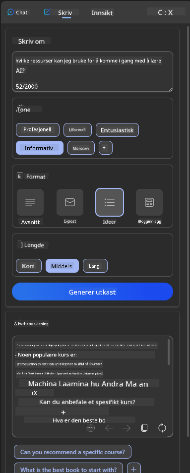
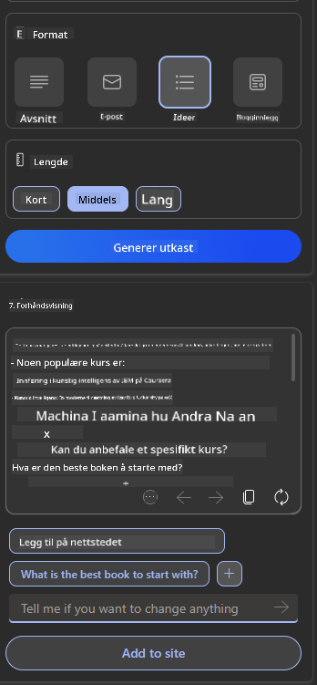

<!--
CO_OP_TRANSLATOR_METADATA:
{
  "original_hash": "78bbeed50fd4dc9fdee931f5daf98cb3",
  "translation_date": "2025-10-17T19:18:09+00:00",
  "source_file": "12-designing-ux-for-ai-applications/README.md",
  "language_code": "no"
}
-->
# Utforming brukeropplevelse for AI-applikasjoner

> _(Klikk på bildet ovenfor for å se videoen til denne leksjonen)_

Brukeropplevelse er en svært viktig del av å bygge applikasjoner. Brukere må kunne bruke appen din på en effektiv måte for å utføre oppgaver. Effektivitet er én ting, men du må også designe applikasjoner slik at de kan brukes av alle, for å gjøre dem _tilgjengelige_. Dette kapittelet fokuserer på dette området, slik at du forhåpentligvis ender opp med å designe en app som folk kan og vil bruke.

## Introduksjon

Brukeropplevelse handler om hvordan en bruker interagerer med og bruker et spesifikt produkt eller tjeneste, enten det er et system, verktøy eller design. Når man utvikler AI-applikasjoner, fokuserer utviklere ikke bare på å sikre at brukeropplevelsen er effektiv, men også etisk. I denne leksjonen dekker vi hvordan man bygger kunstig intelligens (AI)-applikasjoner som adresserer brukerbehov.

Leksjonen vil dekke følgende områder:

- Introduksjon til brukeropplevelse og forståelse av brukerbehov
- Utforming av AI-applikasjoner for tillit og åpenhet
- Utforming av AI-applikasjoner for samarbeid og tilbakemelding

## Læringsmål

Etter å ha tatt denne leksjonen, vil du kunne:

- Forstå hvordan man bygger AI-applikasjoner som møter brukerbehov.
- Designe AI-applikasjoner som fremmer tillit og samarbeid.

### Forutsetning

Ta deg tid til å lese mer om [brukeropplevelse og designtenkning.](https://learn.microsoft.com/training/modules/ux-design?WT.mc_id=academic-105485-koreyst)

## Introduksjon til brukeropplevelse og forståelse av brukerbehov

I vår fiktive utdanningsstartup har vi to primære brukere, lærere og elever. Hver av de to brukerne har unike behov. Et brukersentrert design prioriterer brukeren og sikrer at produktene er relevante og nyttige for dem de er ment for.

Applikasjonen bør være **nyttig, pålitelig, tilgjengelig og behagelig** for å gi en god brukeropplevelse.

### Brukervennlighet

Å være nyttig betyr at applikasjonen har funksjonalitet som samsvarer med dens tiltenkte formål, som å automatisere vurderingsprosessen eller generere flashkort for repetisjon. En applikasjon som automatiserer vurderingsprosessen bør kunne tildele poeng til elevenes arbeid nøyaktig og effektivt basert på forhåndsdefinerte kriterier. På samme måte bør en applikasjon som genererer repetisjonskort kunne lage relevante og varierte spørsmål basert på sine data.

### Pålitelighet

Å være pålitelig betyr at applikasjonen kan utføre sine oppgaver konsekvent og uten feil. Men AI, akkurat som mennesker, er ikke perfekt og kan være utsatt for feil. Applikasjoner kan støte på feil eller uventede situasjoner som krever menneskelig inngripen eller korreksjon. Hvordan håndterer du feil? I den siste delen av denne leksjonen vil vi dekke hvordan AI-systemer og applikasjoner er designet for samarbeid og tilbakemelding.

### Tilgjengelighet

Å være tilgjengelig betyr å utvide brukeropplevelsen til brukere med ulike evner, inkludert de med funksjonshemninger, og sikre at ingen blir utelatt. Ved å følge retningslinjer og prinsipper for tilgjengelighet blir AI-løsninger mer inkluderende, brukervennlige og nyttige for alle brukere.

### Behagelig

Å være behagelig betyr at applikasjonen er hyggelig å bruke. En tiltalende brukeropplevelse kan ha en positiv innvirkning på brukeren, oppmuntre dem til å komme tilbake til applikasjonen og øke forretningsinntektene.

Ikke alle utfordringer kan løses med AI. AI kommer inn for å forbedre brukeropplevelsen, enten det er ved å automatisere manuelle oppgaver eller personalisere brukeropplevelser.

## Utforming av AI-applikasjoner for tillit og åpenhet

Å bygge tillit er avgjørende når man designer AI-applikasjoner. Tillit sikrer at en bruker er trygg på at applikasjonen vil få jobben gjort, levere resultater konsekvent, og at resultatene er det brukeren trenger. En risiko på dette området er mistillit og overtro. Mistillit oppstår når en bruker har liten eller ingen tillit til et AI-system, noe som fører til at brukeren avviser applikasjonen din. Overtro oppstår når en bruker overvurderer kapasiteten til et AI-system, noe som fører til at brukeren stoler for mye på AI-systemet. For eksempel kan et automatisert vurderingssystem i tilfelle overtro føre til at læreren ikke går gjennom noen av papirene for å sikre at vurderingssystemet fungerer godt. Dette kan resultere i urettferdige eller unøyaktige karakterer for elevene, eller tapte muligheter for tilbakemelding og forbedring.

To måter å sikre at tillit settes i sentrum av designet er forklarbarhet og kontroll.

### Forklarbarhet

Når AI hjelper til med å informere beslutninger, som å formidle kunnskap til fremtidige generasjoner, er det avgjørende for lærere og foreldre å forstå hvordan AI-beslutninger tas. Dette er forklarbarhet - forståelse av hvordan AI-applikasjoner tar beslutninger. Å designe for forklarbarhet inkluderer å legge til detaljer som fremhever hvordan AI kom frem til resultatet. Publikum må være klar over at resultatet er generert av AI og ikke et menneske. For eksempel, i stedet for å si "Start chatting med din veileder nå", si "Bruk AI-veileder som tilpasser seg dine behov og hjelper deg å lære i ditt eget tempo."

Et annet eksempel er hvordan AI bruker bruker- og personlige data. For eksempel kan en bruker med personaen elev ha begrensninger basert på sin persona. AI kan kanskje ikke avsløre svar på spørsmål, men kan hjelpe brukeren med å tenke gjennom hvordan de kan løse et problem.

En siste viktig del av forklarbarhet er forenkling av forklaringer. Elever og lærere er kanskje ikke AI-eksperter, derfor bør forklaringer på hva applikasjonen kan eller ikke kan gjøre være forenklet og lett å forstå.

### Kontroll

Generativ AI skaper et samarbeid mellom AI og brukeren, hvor for eksempel en bruker kan endre forespørsler for ulike resultater. I tillegg, når et resultat er generert, bør brukere kunne endre resultatene, noe som gir dem en følelse av kontroll. For eksempel, når du bruker Bing, kan du tilpasse forespørselen din basert på format, tone og lengde. I tillegg kan du gjøre endringer i resultatet og modifisere det som vist nedenfor:

En annen funksjon i Bing som gir brukeren kontroll over applikasjonen, er muligheten til å velge inn og ut av dataene AI bruker. For en skoleapplikasjon kan en elev ønske å bruke sine egne notater samt lærerens ressurser som repetisjonsmateriale.

> Når du designer AI-applikasjoner, er det viktig å være bevisst for å sikre at brukere ikke overdriver tilliten og setter urealistiske forventninger til kapasiteten. En måte å gjøre dette på er ved å skape friksjon mellom forespørslene og resultatene. Minne brukeren på at dette er AI og ikke et medmenneske.

## Utforming av AI-applikasjoner for samarbeid og tilbakemelding

Som nevnt tidligere, skaper generativ AI et samarbeid mellom brukeren og AI. De fleste interaksjoner innebærer at en bruker skriver inn en forespørsel og AI genererer et resultat. Hva om resultatet er feil? Hvordan håndterer applikasjonen feil hvis de oppstår? Skylder AI på brukeren eller tar det seg tid til å forklare feilen?

AI-applikasjoner bør bygges for å motta og gi tilbakemelding. Dette hjelper ikke bare AI-systemet med å forbedre seg, men bygger også tillit med brukerne. En tilbakemeldingssløyfe bør inkluderes i designet, et eksempel kan være en enkel tommel opp eller ned på resultatet.

En annen måte å håndtere dette på er å tydelig kommunisere systemets kapasiteter og begrensninger. Når en bruker gjør en feil ved å be om noe som ligger utenfor AI-kapasiteten, bør det også være en måte å håndtere dette på, som vist nedenfor.

Systemfeil er vanlige med applikasjoner der brukeren kan trenge hjelp med informasjon utenfor AI-ens omfang, eller applikasjonen kan ha en grense for hvor mange spørsmål/emner en bruker kan generere oppsummeringer for. For eksempel kan en AI-applikasjon trent med data på begrensede emner, for eksempel historie og matematikk, kanskje ikke håndtere spørsmål om geografi. For å redusere dette kan AI-systemet gi et svar som: "Beklager, vårt produkt er trent med data innen følgende emner....., jeg kan ikke svare på spørsmålet du stilte."

AI-applikasjoner er ikke perfekte, derfor er de utsatt for feil. Når du designer applikasjonene dine, bør du sørge for å skape rom for tilbakemelding fra brukere og feilhåndtering på en måte som er enkel og lett å forstå.

## Oppgave

Ta en hvilken som helst AI-app du har bygget så langt, og vurder å implementere følgende trinn i appen din:

- **Behagelig:** Vurder hvordan du kan gjøre appen din mer behagelig. Legger du til forklaringer overalt? Oppmuntrer du brukeren til å utforske? Hvordan formulerer du feilmeldingene dine?

- **Brukervennlighet:** Bygg en nettapp. Sørg for at appen din kan navigeres med både mus og tastatur.

- **Tillit og åpenhet:** Ikke stol helt på AI og dens resultater, vurder hvordan du kan legge til et menneske i prosessen for å verifisere resultatene. Vurder også og implementer andre måter å oppnå tillit og åpenhet.

- **Kontroll:** Gi brukeren kontroll over dataene de gir til applikasjonen. Implementer en måte brukeren kan velge inn og ut av datainnsamling i AI-applikasjonen.

<!-- ## [Quiz etter leksjonen](../../../12-designing-ux-for-ai-applications/quiz-url) -->

## Fortsett læringen din!

Etter å ha fullført denne leksjonen, sjekk ut vår [Generativ AI læringssamling](https://aka.ms/genai-collection?WT.mc_id=academic-105485-koreyst) for å fortsette å utvikle kunnskapen din om generativ AI!

Gå videre til leksjon 13, hvor vi skal se på hvordan man [sikrer AI-applikasjoner](../13-securing-ai-applications/README.md?WT.mc_id=academic-105485-koreyst)!

---

**Ansvarsfraskrivelse**:  
Dette dokumentet er oversatt ved hjelp av AI-oversettelsestjenesten [Co-op Translator](https://github.com/Azure/co-op-translator). Selv om vi streber etter nøyaktighet, vær oppmerksom på at automatiserte oversettelser kan inneholde feil eller unøyaktigheter. Det originale dokumentet på sitt opprinnelige språk bør anses som den autoritative kilden. For kritisk informasjon anbefales profesjonell menneskelig oversettelse. Vi er ikke ansvarlige for misforståelser eller feiltolkninger som oppstår ved bruk av denne oversettelsen.