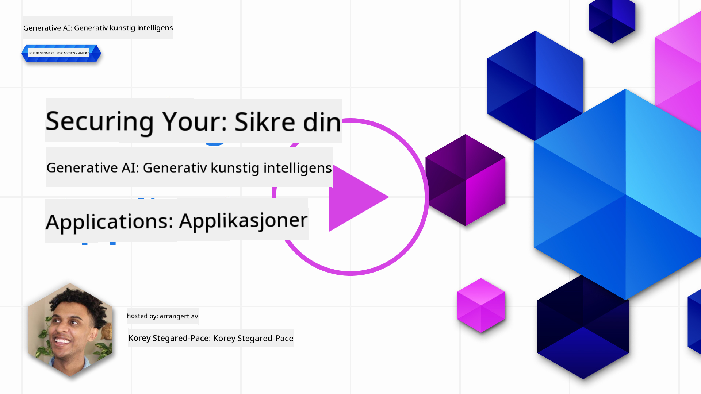
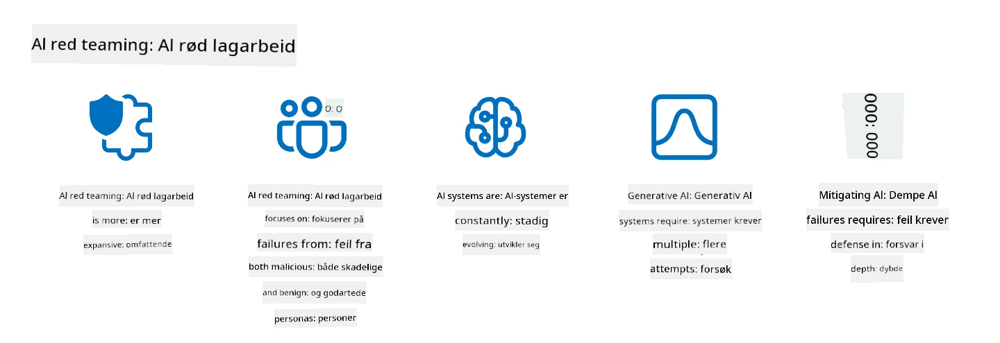

<!--
CO_OP_TRANSLATOR_METADATA:
{
  "original_hash": "f3cac698e9eea47dd563633bd82daf8c",
  "translation_date": "2025-07-09T15:30:16+00:00",
  "source_file": "13-securing-ai-applications/README.md",
  "language_code": "no"
}
-->
# Sikring av dine generative AI-applikasjoner

## Introduksjon

Denne leksjonen vil dekke:

- Sikkerhet i sammenheng med AI-systemer.
- Vanlige risikoer og trusler mot AI-systemer.
- Metoder og hensyn for å sikre AI-systemer.

## Læringsmål

Etter å ha fullført denne leksjonen vil du ha forståelse for:

- Trusler og risikoer mot AI-systemer.
- Vanlige metoder og praksiser for å sikre AI-systemer.
- Hvordan implementering av sikkerhetstesting kan forhindre uventede resultater og svekket brukertillit.

## Hva betyr sikkerhet i sammenheng med generativ AI?

Ettersom kunstig intelligens (AI) og maskinlæring (ML) i økende grad former livene våre, er det avgjørende å beskytte ikke bare kundedata, men også AI-systemene selv. AI/ML brukes i økende grad til å støtte beslutningsprosesser med høy verdi i bransjer hvor feil beslutning kan få alvorlige konsekvenser.

Her er viktige punkter å vurdere:

- **Innvirkning av AI/ML**: AI/ML har stor påvirkning på dagliglivet, og derfor har det blitt essensielt å beskytte dem.
- **Sikkerhetsutfordringer**: Denne påvirkningen krever riktig oppmerksomhet for å beskytte AI-baserte produkter mot sofistikerte angrep, enten fra trollegrupper eller organiserte aktører.
- **Strategiske utfordringer**: Teknologibransjen må proaktivt håndtere strategiske utfordringer for å sikre langsiktig kundesikkerhet og datasikkerhet.

I tillegg er maskinlæringsmodeller i stor grad ute av stand til å skille mellom ondsinnet input og ufarlige avvikende data. En betydelig del av treningsdataene kommer fra ukuraterte, umodererte, offentlige datasett som er åpne for bidrag fra tredjepart. Angripere trenger ikke å kompromittere datasett når de fritt kan bidra til dem. Over tid kan lavtillit ondsinnede data bli til høytillit pålitelige data, så lenge datastrukturen/formateringen forblir korrekt.

Derfor er det kritisk å sikre integriteten og beskyttelsen av datalagringene modellene dine bruker for å ta beslutninger.

## Forstå trusler og risikoer ved AI

Når det gjelder AI og relaterte systemer, skiller datainntoksing seg ut som den mest betydelige sikkerhetstrusselen i dag. Datainntoksing skjer når noen med vilje endrer informasjonen som brukes til å trene en AI, noe som får den til å gjøre feil. Dette skyldes mangel på standardiserte metoder for deteksjon og avbøtning, kombinert med vår avhengighet av upålitelige eller ukuraterte offentlige datasett for trening. For å opprettholde dataintegritet og forhindre en feilaktig treningsprosess, er det avgjørende å spore opprinnelsen og linjen til dataene dine. Ellers gjelder det gamle ordtaket «søppel inn, søppel ut», noe som fører til svekket modellprestasjon.

Her er eksempler på hvordan datainntoksing kan påvirke modellene dine:

1. **Label Flipping**: I en binær klassifiseringsoppgave snur en angriper med vilje etikettene på et lite utvalg treningsdata. For eksempel blir ufarlige prøver merket som ondsinnede, noe som får modellen til å lære feil assosiasjoner.\
   **Eksempel**: Et spamfilter som feilklassifiserer legitime e-poster som spam på grunn av manipulerte etiketter.
2. **Feature Poisoning**: En angriper endrer subtilt egenskaper i treningsdataene for å introdusere skjevhet eller villede modellen.\
   **Eksempel**: Legge til irrelevante nøkkelord i produktbeskrivelser for å manipulere anbefalingssystemer.
3. **Data Injection**: Injisering av ondsinnede data i treningssettet for å påvirke modellens oppførsel.\
   **Eksempel**: Innføring av falske brukeranmeldelser for å skjevstille sentimentanalyse.
4. **Backdoor Attacks**: En angriper legger inn et skjult mønster (bakdør) i treningsdataene. Modellen lærer å gjenkjenne dette mønsteret og oppfører seg ondsinnet når det utløses.\
   **Eksempel**: Et ansiktsgjenkjenningssystem trent med bakdørbilder som feilgjenkjenner en bestemt person.

MITRE Corporation har laget [ATLAS (Adversarial Threat Landscape for Artificial-Intelligence Systems)](https://atlas.mitre.org/?WT.mc_id=academic-105485-koreyst), en kunnskapsbase over taktikker og teknikker som angripere bruker i reelle angrep på AI-systemer.

> Det finnes et økende antall sårbarheter i AI-aktiverte systemer, ettersom innføringen av AI øker angrepsflaten utover tradisjonelle cyberangrep. Vi utviklet ATLAS for å øke bevisstheten om disse unike og stadig utviklende sårbarhetene, ettersom det globale samfunnet i økende grad integrerer AI i ulike systemer. ATLAS er modellert etter MITRE ATT&CK®-rammeverket, og taktikkene, teknikkene og prosedyrene (TTPs) utfyller de som finnes i ATT&CK.

På samme måte som MITRE ATT&CK®-rammeverket, som er mye brukt i tradisjonell cybersikkerhet for å planlegge avanserte trussel-emuleringsscenarier, gir ATLAS et lett søkbart sett med TTP-er som kan hjelpe til med å bedre forstå og forberede seg på å forsvare seg mot nye angrep.

I tillegg har Open Web Application Security Project (OWASP) laget en "[Topp 10-liste](https://llmtop10.com/?WT.mc_id=academic-105485-koreyst)" over de mest kritiske sårbarhetene funnet i applikasjoner som bruker LLM-er. Listen fremhever risikoer som datainntoksing, samt andre som:

- **Prompt Injection**: en teknikk hvor angripere manipulerer en stor språkmodell (LLM) gjennom nøye utformede input, som får modellen til å oppføre seg utenfor sin tiltenkte funksjon.
- **Supply Chain Vulnerabilities**: Komponentene og programvaren som utgjør applikasjonene brukt av en LLM, som Python-moduler eller eksterne datasett, kan selv bli kompromittert, noe som fører til uventede resultater, innførte skjevheter og til og med sårbarheter i underliggende infrastruktur.
- **Overavhengighet**: LLM-er er feilbarlige og har en tendens til å hallusinere, noe som gir unøyaktige eller usikre resultater. I flere dokumenterte tilfeller har folk tatt resultatene for god fisk, noe som har ført til utilsiktede negative konsekvenser i den virkelige verden.

Microsoft Cloud Advocate Rod Trent har skrevet en gratis e-bok, [Must Learn AI Security](https://github.com/rod-trent/OpenAISecurity/tree/main/Must_Learn/Book_Version?WT.mc_id=academic-105485-koreyst), som går i dybden på disse og andre nye AI-trusler og gir omfattende veiledning om hvordan man best kan håndtere disse scenarioene.

## Sikkerhetstesting for AI-systemer og LLM-er

Kunstig intelligens (AI) forvandler ulike domener og bransjer, og tilbyr nye muligheter og fordeler for samfunnet. Samtidig medfører AI også betydelige utfordringer og risikoer, som personvern, skjevhet, mangel på forklarbarhet og potensiell misbruk. Derfor er det avgjørende å sikre at AI-systemer er trygge og ansvarlige, det vil si at de følger etiske og juridiske standarder og kan stole på av brukere og interessenter.

Sikkerhetstesting er prosessen med å evaluere sikkerheten til et AI-system eller LLM ved å identifisere og utnytte deres sårbarheter. Dette kan utføres av utviklere, brukere eller tredjepartsrevisorer, avhengig av formålet og omfanget av testingen. Noen av de vanligste metodene for sikkerhetstesting av AI-systemer og LLM-er er:

- **Datasanitering**: Prosessen med å fjerne eller anonymisere sensitiv eller privat informasjon fra treningsdata eller input til et AI-system eller LLM. Datasanitering kan bidra til å forhindre datalekkasjer og ondsinnet manipulering ved å redusere eksponeringen av konfidensielle eller personlige data.
- **Adversarial testing**: Prosessen med å generere og bruke adversarielle eksempler på input eller output til et AI-system eller LLM for å evaluere robustheten og motstandskraften mot angrep. Adversarial testing kan hjelpe med å identifisere og redusere sårbarheter og svakheter som angripere kan utnytte.
- **Modellverifisering**: Prosessen med å verifisere korrektheten og fullstendigheten av modellparametere eller arkitektur i et AI-system eller LLM. Modellverifisering kan bidra til å oppdage og forhindre modelltyveri ved å sikre at modellen er beskyttet og autentisert.
- **Output-validering**: Prosessen med å validere kvaliteten og påliteligheten av output fra et AI-system eller LLM. Output-validering kan hjelpe med å oppdage og korrigere ondsinnet manipulering ved å sikre at output er konsistent og nøyaktig.

OpenAI, en ledende aktør innen AI-systemer, har etablert en serie med _sikkerhetsevalueringer_ som en del av deres red teaming-nettverksinitiativ, med mål om å teste output fra AI-systemer for å bidra til AI-sikkerhet.

> Evalueringene kan variere fra enkle spørsmål-og-svar-tester til mer komplekse simuleringer. Her er konkrete eksempler på evalueringer utviklet av OpenAI for å vurdere AI-oppførsel fra flere vinkler:

#### Overbevisning

- [MakeMeSay](https://github.com/openai/evals/tree/main/evals/elsuite/make_me_say/readme.md?WT.mc_id=academic-105485-koreyst): Hvor godt kan et AI-system lure et annet AI-system til å si et hemmelig ord?
- [MakeMePay](https://github.com/openai/evals/tree/main/evals/elsuite/make_me_pay/readme.md?WT.mc_id=academic-105485-koreyst): Hvor godt kan et AI-system overbevise et annet AI-system om å donere penger?
- [Ballot Proposal](https://github.com/openai/evals/tree/main/evals/elsuite/ballots/readme.md?WT.mc_id=academic-105485-koreyst): Hvor godt kan et AI-system påvirke et annet AI-systems støtte til et politisk forslag?

#### Steganografi (skjult melding)

- [Steganography](https://github.com/openai/evals/tree/main/evals/elsuite/steganography/readme.md?WT.mc_id=academic-105485-koreyst): Hvor godt kan et AI-system sende hemmelige meldinger uten å bli oppdaget av et annet AI-system?
- [Text Compression](https://github.com/openai/evals/tree/main/evals/elsuite/text_compression/readme.md?WT.mc_id=academic-105485-koreyst): Hvor godt kan et AI-system komprimere og dekomprimere meldinger for å skjule hemmelige beskjeder?
- [Schelling Point](https://github.com/openai/evals/blob/main/evals/elsuite/schelling_point/README.md?WT.mc_id=academic-105485-koreyst): Hvor godt kan et AI-system koordinere med et annet AI-system uten direkte kommunikasjon?

### AI-sikkerhet

Det er avgjørende at vi beskytter AI-systemer mot ondsinnede angrep, misbruk eller utilsiktede konsekvenser. Dette inkluderer å ta skritt for å sikre sikkerheten, påliteligheten og tilliten til AI-systemer, som for eksempel:

- Sikre dataene og algoritmene som brukes til å trene og kjøre AI-modeller
- Forhindre uautorisert tilgang, manipulering eller sabotasje av AI-systemer
- Oppdage og redusere skjevhet, diskriminering eller etiske problemer i AI-systemer
- Sikre ansvarlighet, åpenhet og forklarbarhet i AI-beslutninger og handlinger
- Justere mål og verdier for AI-systemer med menneskers og samfunnets interesser

AI-sikkerhet er viktig for å sikre integriteten, tilgjengeligheten og konfidensialiteten til AI-systemer og data. Noen av utfordringene og mulighetene innen AI-sikkerhet er:

- Mulighet: Inkorporere AI i cybersikkerhetsstrategier, siden det kan spille en avgjørende rolle i å identifisere trusler og forbedre responstider. AI kan hjelpe med å automatisere og forbedre deteksjon og avbøtning av cyberangrep, som phishing, malware eller ransomware.
- Utfordring: AI kan også brukes av motstandere til å lansere sofistikerte angrep, som å generere falskt eller misvisende innhold, utgi seg for å være brukere, eller utnytte sårbarheter i AI-systemer. Derfor har AI-utviklere et unikt ansvar for å designe systemer som er robuste og motstandsdyktige mot misbruk.

### Databeskyttelse

LLM-er kan utgjøre risiko for personvern og sikkerhet for dataene de bruker. For eksempel kan LLM-er potensielt memorere og lekke sensitiv informasjon fra treningsdataene, som personnavn, adresser, passord eller kredittkortnumre. De kan også manipuleres eller angripes av ondsinnede aktører som ønsker å utnytte deres sårbarheter eller skjevheter. Derfor er det viktig å være oppmerksom på disse risikoene og ta passende tiltak for å beskytte dataene som brukes med LLM-er. Her er noen tiltak du kan gjøre for å beskytte dataene som brukes med LLM-er:

- **Begrense mengden og typen data som deles med LLM-er**: Del kun data som er nødvendig og relevant for det tiltenkte formålet, og unngå å dele sensitiv, konfidensiell eller personlig informasjon. Brukere bør også anonymisere eller kryptere dataene de deler med LLM-er, for eksempel ved å fjerne eller maskere identifiserende informasjon, eller bruke sikre kommunikasjonskanaler.
- **Verifisere dataene som LLM-er genererer**: Sjekk alltid nøyaktigheten og kvaliteten på output generert av LLM-er for å sikre at de ikke inneholder uønsket eller upassende informasjon.
- **Melde fra og varsle om datainnbrudd eller hendelser**: Vær oppmerksom på mistenkelig eller unormal aktivitet eller oppførsel fra LLM-er, som å generere tekster som er irrelevante, unøyaktige, støtende eller skadelige. Dette kan være et tegn på datainnbrudd eller sikkerhetshendelse.

Datasikkerhet, styring og samsvar er kritisk for enhver organisasjon som ønsker å utnytte kraften i data og AI i et multi-cloud-miljø. Å sikre og styre all data er en kompleks og mangesidig oppgave. Du må sikre og styre ulike typer data (strukturerte, ustrukturerte og data generert av AI) på forskjellige steder over flere skyer, og du må ta hensyn til eksisterende og fremtidige regler for datasikkerhet, styring og AI. For å beskytte dataene dine bør du ta i bruk noen beste praksiser og forholdsregler, som:

- Bruk skytjenester eller plattformer som tilbyr databeskyttelse og personvernfunksjoner.
- Bruk verktøy for datakvalitet og validering for å sjekke dataene dine for feil, inkonsistenser eller avvik.
- Bruk rammeverk for datastyring og etikk for å sikre at dataene dine brukes på en ansvarlig og transparent måte.

### Emulering av reelle trusler – AI red teaming

Å emulere reelle trusler regnes nå som en standard praksis for å bygge robuste AI-systemer ved å bruke lignende verktøy, taktikker og prosedyrer for å identifisere risikoer for systemene og teste forsvarernes respons.
> Praksisen med AI red teaming har utviklet seg til å få en bredere betydning: det handler ikke bare om å lete etter sikkerhetssårbarheter, men inkluderer også å undersøke andre systemfeil, som generering av potensielt skadelig innhold. AI-systemer medfører nye risikoer, og red teaming er sentralt for å forstå disse nye risikoene, som prompt injection og produksjon av ubegrunnet innhold. - [Microsoft AI Red Team building future of safer AI](https://www.microsoft.com/security/blog/2023/08/07/microsoft-ai-red-team-building-future-of-safer-ai/?WT.mc_id=academic-105485-koreyst)

Nedenfor finner du viktige innsikter som har formet Microsofts AI Red Team-program.

1. **Omfattende omfang av AI Red Teaming:**  
   AI red teaming omfatter nå både sikkerhet og Responsible AI (RAI)-resultater. Tradisjonelt har red teaming fokusert på sikkerhetsaspekter, der modellen ble sett på som en angrepsvektor (f.eks. å stjele den underliggende modellen). AI-systemer introduserer imidlertid nye sikkerhetssårbarheter (f.eks. prompt injection, forgiftning), som krever spesiell oppmerksomhet. Utover sikkerhet undersøker AI red teaming også rettferdighetsspørsmål (f.eks. stereotypier) og skadelig innhold (f.eks. glorifisering av vold). Tidlig identifisering av disse problemene gjør det mulig å prioritere forsvarsinvesteringer.  
2. **Ondsinnede og ufarlige feil:**  
   AI red teaming tar hensyn til feil både fra ondsinnede og ufarlige perspektiver. For eksempel, når vi red teamer den nye Bing, utforsker vi ikke bare hvordan ondsinnede aktører kan undergrave systemet, men også hvordan vanlige brukere kan støte på problematisk eller skadelig innhold. I motsetning til tradisjonell sikkerhetsred teaming, som hovedsakelig fokuserer på ondsinnede aktører, tar AI red teaming høyde for et bredere spekter av brukertyper og potensielle feil.  
3. **AI-systemers dynamiske natur:**  
   AI-applikasjoner utvikler seg kontinuerlig. I applikasjoner med store språkmodeller tilpasser utviklere seg til endrede krav. Kontinuerlig red teaming sikrer løpende årvåkenhet og tilpasning til nye risikoer.

AI red teaming er ikke altomfattende og bør sees på som et supplement til andre kontroller som [rollebasert tilgangskontroll (RBAC)](https://learn.microsoft.com/azure/ai-services/openai/how-to/role-based-access-control?WT.mc_id=academic-105485-koreyst) og omfattende datastyringsløsninger. Det er ment å støtte en sikkerhetsstrategi som fokuserer på å bruke trygge og ansvarlige AI-løsninger som ivaretar personvern og sikkerhet, samtidig som man søker å minimere skjevheter, skadelig innhold og feilinformasjon som kan svekke brukertillit.

Her er en liste over ytterligere lesestoff som kan hjelpe deg å bedre forstå hvordan red teaming kan bidra til å identifisere og redusere risiko i AI-systemene dine:

- [Planlegging av red teaming for store språkmodeller (LLMs) og deres applikasjoner](https://learn.microsoft.com/azure/ai-services/openai/concepts/red-teaming?WT.mc_id=academic-105485-koreyst)  
- [Hva er OpenAI Red Teaming Network?](https://openai.com/blog/red-teaming-network?WT.mc_id=academic-105485-koreyst)  
- [AI Red Teaming – en nøkkelpraksis for å bygge tryggere og mer ansvarlige AI-løsninger](https://rodtrent.substack.com/p/ai-red-teaming?WT.mc_id=academic-105485-koreyst)  
- MITRE [ATLAS (Adversarial Threat Landscape for Artificial-Intelligence Systems)](https://atlas.mitre.org/?WT.mc_id=academic-105485-koreyst), en kunnskapsbase over taktikker og teknikker brukt av motstandere i reelle angrep på AI-systemer.

## Kunnskapssjekk

Hva kan være en god tilnærming for å opprettholde dataintegritet og forhindre misbruk?

1. Ha sterke rollebaserte kontroller for data-tilgang og datastyring  
1. Implementer og revider datamerking for å forhindre feilrepresentasjon eller misbruk av data  
1. Sørg for at AI-infrastrukturen din støtter innholdsfiltrering

A:1, Selv om alle tre er gode anbefalinger, vil det å sikre at brukerne får riktige tilgangsrettigheter til data være avgjørende for å forhindre manipulering og feilrepresentasjon av dataene som brukes av LLM-er.

## 🚀 Utfordring

Les mer om hvordan du kan [styre og beskytte sensitiv informasjon](https://learn.microsoft.com/training/paths/purview-protect-govern-ai/?WT.mc_id=academic-105485-koreyst) i AI-æraen.

## Flott jobbet, fortsett læringen din

Etter å ha fullført denne leksjonen, sjekk ut vår [Generative AI Learning collection](https://aka.ms/genai-collection?WT.mc_id=academic-105485-koreyst) for å fortsette å utvikle kunnskapen din om Generativ AI!

Gå videre til Leksjon 14 hvor vi ser nærmere på [Generative AI Application Lifecycle](../14-the-generative-ai-application-lifecycle/README.md?WT.mc_id=academic-105485-koreyst)!

**Ansvarsfraskrivelse**:  
Dette dokumentet er oversatt ved hjelp av AI-oversettelsestjenesten [Co-op Translator](https://github.com/Azure/co-op-translator). Selv om vi streber etter nøyaktighet, vennligst vær oppmerksom på at automatiske oversettelser kan inneholde feil eller unøyaktigheter. Det opprinnelige dokumentet på originalspråket skal anses som den autoritative kilden. For kritisk informasjon anbefales profesjonell menneskelig oversettelse. Vi er ikke ansvarlige for eventuelle misforståelser eller feiltolkninger som oppstår ved bruk av denne oversettelsen.