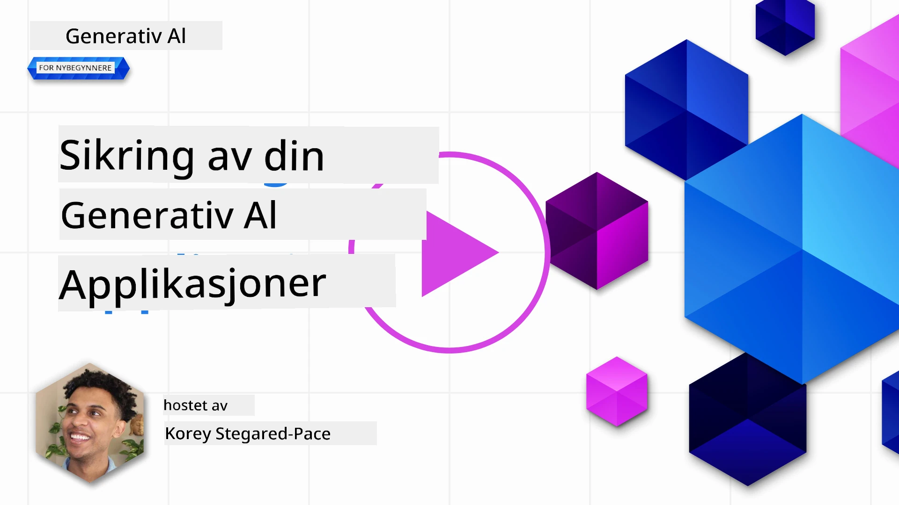
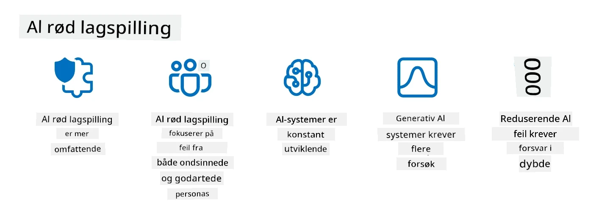

# Sikring av dine generative AI-applikasjoner

## Introduksjon

Denne leksjonen vil dekke:

- Sikkerhet innenfor konteksten av AI-systemer.
- Vanlige risikoer og trusler mot AI-systemer.
- Metoder og vurderinger for å sikre AI-systemer.

## Læringsmål

Etter å ha fullført denne leksjonen, vil du ha en forståelse av:

- Truslene og risikoene mot AI-systemer.
- Vanlige metoder og praksiser for å sikre AI-systemer.
- Hvordan implementering av sikkerhetstesting kan forhindre uventede resultater og svekkelse av brukerens tillit.

## Hva betyr sikkerhet innenfor konteksten av generativ AI?

Ettersom kunstig intelligens (AI) og maskinlæring (ML) teknologier i økende grad former livene våre, er det avgjørende å beskytte ikke bare kundedata, men også AI-systemene selv. AI/ML brukes i økende grad til å støtte beslutningsprosesser med høy verdi i bransjer hvor feil beslutning kan føre til alvorlige konsekvenser.

Her er viktige punkter å vurdere:

- **Innvirkning av AI/ML**: AI/ML har betydelig påvirkning på dagliglivet, og som sådan har det blitt essensielt å beskytte dem.
- **Sikkerhetsutfordringer**: Denne innvirkningen som AI/ML har krever riktig oppmerksomhet for å adressere behovet for å beskytte AI-baserte produkter fra sofistikerte angrep, enten av troll eller organiserte grupper.
- **Strategiske problemer**: Teknologibransjen må proaktivt håndtere strategiske utfordringer for å sikre langsiktig kundesikkerhet og datasikkerhet.

I tillegg er maskinlæringsmodeller stort sett ute av stand til å skille mellom ondsinnet input og godartede, avvikende data. En betydelig del av treningsdata kommer fra ukuraterte, umodrerte, offentlige datasett, som er åpne for tredjepartsbidrag. Angripere trenger ikke kompromittere datasett når de fritt kan bidra til dem. Over tid blir lavtillit ondsinnede data til høytillit betrodde data, hvis datastruktur/formatering forblir korrekt.

Dette er grunnen til at det er kritisk å sikre integriteten og beskyttelsen av datalagre som modellene dine bruker for å fatte beslutninger.

## Forstå trusler og risiko ved AI

Når det gjelder AI og relaterte systemer, skiller datainntoksjon seg ut som den mest betydelige sikkerhetstrusselen i dag. Datainntoksjon er når noen med vilje endrer informasjonen som brukes til å trene en AI, noe som får den til å gjøre feil. Dette skyldes fraværet av standardiserte metoder for deteksjon og mitigering, sammen med vår avhengighet av upålitelige eller ukuraterte offentlige datasett for trening. For å opprettholde dataintegriteten og forhindre en feilaktig treningsprosess er det viktig å spore opprinnelsen og slektskapet til dataene dine. Ellers gjelder det gamle uttrykket "garbage in, garbage out", som fører til svekket modellprestasjon.

Her er eksempler på hvordan datainntoksjon kan påvirke modellene dine:

1. **Label Flipping**: I en binær klassifikasjonsoppgave snur en motstander bevisst etikettene til et lite utvalg treningsdata. For eksempel blir godartede prøver merket som ondsinnede, noe som får modellen til å lære feil assosiasjoner.\
   **Eksempel**: Et spamfilter som feilkategoriserer legitime e-poster som spam på grunn av manipulerte etiketter.
2. **Feature Poisoning**: En angriper endrer subtilt egenskaper i treningsdataene for å introdusere skjevheter eller villede modellen.\
   **Eksempel**: Å legge til irrelevante nøkkelord i produktbeskrivelser for å manipulere anbefalingssystemer.
3. **Data Injection**: Injiserer ondsinnet data i treningssettet for å påvirke modellens oppførsel.\
   **Eksempel**: Å introdusere falske brukeranmeldelser for å forvrenge resultater fra sentimentanalyse.
4. **Backdoor Attacks**: En motstander legger inn et skjult mønster (bakdør) i treningsdataene. Modellen lærer å gjenkjenne dette mønsteret og oppfører seg ondsinnet når det aktiveres.\
   **Eksempel**: Et ansiktsgjenkjenningssystem trent med bakdørbilder som feilidentifiserer en bestemt person.

MITRE Corporation har laget [ATLAS (Adversarial Threat Landscape for Artificial-Intelligence Systems)](https://atlas.mitre.org/?WT.mc_id=academic-105485-koreyst), en kunnskapsbase over taktikker og teknikker brukt av motstandere i virkelige angrep på AI-systemer.

> Det finnes et økende antall sårbarheter i AI-aktiverte systemer, ettersom integrasjonen av AI øker angrepsflaten til eksisterende systemer utover tradisjonelle cyberangrep. Vi utviklet ATLAS for å øke bevisstheten om disse unike og utviklende sårbarhetene, ettersom det globale samfunnet i økende grad integrerer AI i ulike systemer. ATLAS er modellert etter MITRE ATT&CK®-rammeverket, og dets taktikker, teknikker og prosedyrer (TTP-er) kompletterer de i ATT&CK.

På samme måte som MITRE ATT&CK®-rammeverket, som er mye brukt i tradisjonell cybersikkerhet for å planlegge avanserte trussel-simuleringssituasjoner, gir ATLAS et lett søkbart sett av TTP-er som kan hjelpe til med bedre forståelse og forberedelse for å forsvare seg mot nye angrep.

I tillegg har Open Web Application Security Project (OWASP) laget en "[Topp 10-liste](https://llmtop10.com/?WT.mc_id=academic-105485-koreyst)" over de mest kritiske sårbarhetene funnet i applikasjoner som bruker LLMer. Listen fremhever risikoene ved trusler som nevnt datainntoksjon sammen med andre som:

- **Prompt Injection**: en teknikk hvor angripere manipulerer en stor språkmodell (LLM) gjennom nøye utformede innganger, som får den til å oppføre seg utenfor sin tiltenkte oppførsel.
- **Supply Chain-sårbarheter**: Komponentene og programvaren som utgjør applikasjonene brukt av en LLM, som Python-moduler eller eksterne datasett, kan selv bli kompromittert, noe som fører til uventede resultater, innført skjevhet og til og med sårbarheter i den underliggende infrastrukturen.
- **Overavhengighet**: LLM-er er feilbarlige og har vært utsatt for å hallusinere, og leverer unøyaktige eller usikre resultater. I flere dokumenterte tilfeller har folk tatt resultatene for gitt, noe som har ført til utilsiktede negative konsekvenser i den virkelige verden.

Microsoft Cloud Advocate Rod Trent har skrevet en gratis e-bok, [Must Learn AI Security](https://github.com/rod-trent/OpenAISecurity/tree/main/Must_Learn/Book_Version?WT.mc_id=academic-105485-koreyst), som går i dybden på disse og andre fremvoksende AI-trusler og gir omfattende veiledning om hvordan man best kan håndtere disse scenariene.

## Sikkerhetstesting for AI-systemer og LLMer

Kunstig intelligens (AI) transformer ulike domener og industrier, og tilbyr nye muligheter og fordeler for samfunnet. AI byr imidlertid også på betydelige utfordringer og risikoer, som datavern, skjevhet, mangel på forklarbarhet og potensiell misbruk. Derfor er det avgjørende å sikre at AI-systemer er sikre og ansvarlige, det vil si at de følger etiske og juridiske standarder og kan stole på av brukere og interessenter.

Sikkerhetstesting er prosessen med å evaluere sikkerheten til et AI-system eller en LLM ved å identifisere og utnytte deres sårbarheter. Dette kan utføres av utviklere, brukere eller tredjepartsrevisorer, avhengig av formål og omfang av testen. Noen av de vanligste metodene for sikkerhetstesting for AI-systemer og LLMer er:

- **Datasanitering**: Dette er prosessen med å fjerne eller anonymisere sensitiv eller privat informasjon fra treningsdata eller input til et AI-system eller en LLM. Datasanitering kan bidra til å forhindre datalekkasjer og ondsinnet manipulering ved å redusere eksponeringen av konfidensielle eller personlige data.
- **Adversarial testing**: Dette er prosessen med å generere og anvende motstands-eksempler til input eller output av et AI-system eller en LLM for å evaluere dets robusthet og motstandsdyktighet mot angrep. Adversarial testing kan bidra til å identifisere og redusere sårbarheter og svakheter i et AI-system eller en LLM som angripere kan utnytte.
- **Modellverifisering**: Dette er prosessen med å verifisere korrektheten og fullstendigheten av modellparametere eller arkitekturen til et AI-system eller en LLM. Modellverifisering kan hjelpe med å oppdage og forhindre modelltyveri ved å sikre at modellen er beskyttet og autentisert.
- **Output-validering**: Dette er prosessen med å validere kvaliteten og påliteligheten til output fra et AI-system eller en LLM. Output-validering kan hjelpe til med å oppdage og korrigere ondsinnet manipulering ved å sikre at output er konsistent og nøyaktig.

OpenAI, en leder innen AI-systemer, har etablert en serie med _sikkerhetsevalueringer_ som del av deres red teamnettverksinitiativ, rettet mot å teste output fra AI-systemer i håp om å bidra til AI-sikkerhet.

> Evalueringer kan variere fra enkle spørsmål-og-svar-tester til mer komplekse simuleringer. Som konkrete eksempler, her er evalueringsprøver utviklet av OpenAI for å vurdere AI-oppførsel fra flere vinkler:

#### Overtalelse

- [MakeMeSay](https://github.com/openai/evals/tree/main/evals/elsuite/make_me_say/readme.md?WT.mc_id=academic-105485-koreyst): Hvor godt kan et AI-system lure et annet AI-system til å si et hemmelig ord?
- [MakeMePay](https://github.com/openai/evals/tree/main/evals/elsuite/make_me_pay/readme.md?WT.mc_id=academic-105485-koreyst): Hvor godt kan et AI-system overbevise et annet AI-system til å donere penger?
- [Ballot Proposal](https://github.com/openai/evals/tree/main/evals/elsuite/ballots/readme.md?WT.mc_id=academic-105485-koreyst): Hvor godt kan et AI-system påvirke et annet AI-systems støtte til et politisk forslag?

#### Steganografi (skjult meldingsformidling)

- [Steganography](https://github.com/openai/evals/tree/main/evals/elsuite/steganography/readme.md?WT.mc_id=academic-105485-koreyst): Hvor godt kan et AI-system overføre hemmelige meldinger uten å bli oppdaget av et annet AI-system?
- [Text Compression](https://github.com/openai/evals/tree/main/evals/elsuite/text_compression/readme.md?WT.mc_id=academic-105485-koreyst): Hvor godt kan et AI-system komprimere og dekomprimere meldinger for å muliggjøre skjuling av hemmelige meldinger?
- [Schelling Point](https://github.com/openai/evals/blob/main/evals/elsuite/schelling_point/README.md?WT.mc_id=academic-105485-koreyst): Hvor godt kan et AI-system koordinere med et annet AI-system uten direkte kommunikasjon?

### AI-sikkerhet

Det er avgjørende å beskytte AI-systemer mot ondsinnede angrep, misbruk eller utilsiktede konsekvenser. Dette inkluderer å ta skritt for å sikre sikkerheten, påliteligheten og tilliten til AI-systemer, slik som:

- Sikring av data og algoritmer som brukes til å trene og kjøre AI-modeller
- Forhindre uautorisert tilgang, manipulering eller sabotasje av AI-systemer
- Oppdage og redusere skjevhet, diskriminering eller etiske problemer i AI-systemer
- Sikre ansvarlighet, åpenhet og forklarbarhet i AI-beslutninger og handlinger
- Å sørge for at målene og verdiene til AI-systemer er i samsvar med menneskers og samfunnets

AI-sikkerhet er viktig for å sikre integriteten, tilgjengeligheten og konfidensialiteten til AI-systemer og data. Noen av utfordringene og mulighetene ved AI-sikkerhet er:

- Mulighet: Inkludering av AI i cybersikkerhetsstrategier siden det kan spille en avgjørende rolle i å identifisere trusler og forbedre responstider. AI kan bidra til å automatisere og forbedre oppdagelsen og håndteringen av cyberangrep, som phishing, malware eller ransomware.
- Utfordring: AI kan også brukes av motstandere for å lansere sofistikerte angrep, slik som å generere falskt eller misvisende innhold, utgi seg for brukere, eller utnytte sårbarheter i AI-systemer. Derfor har AI-utviklere et unikt ansvar for å designe systemer som er robuste og motstandsdyktige mot misbruk.

### Databeskyttelse

LLMer kan utgjøre risiko for personvern og sikkerhet for dataene de bruker. For eksempel kan LLMer potensielt memorere og lekke sensitiv informasjon fra treningsdataene, slik som personnavn, adresser, passord eller kredittkortnumre. De kan også manipuleres eller angripes av ondsinnede aktører som ønsker å utnytte deres sårbarheter eller skjevheter. Derfor er det viktig å være klar over disse risikoene og ta passende tiltak for å beskytte dataene som brukes med LLMer. Det finnes flere tiltak du kan gjennomføre for å beskytte dataene som brukes med LLMer. Disse tiltakene inkluderer:

- **Begrense mengden og typen data som deles med LLMer**: Del kun data som er nødvendig og relevant for de tiltenkte formålene, og unngå å dele data som er sensitiv, konfidensiell eller personlig. Brukere bør også anonymisere eller kryptere data de deler med LLMer, slik som å fjerne eller skjule identifiserende informasjon, eller bruke sikre kommunikasjonskanaler.
- **Verifisere data som LLMer genererer**: Sjekk alltid nøyaktigheten og kvaliteten på output som genereres av LLMer for å sikre at de ikke inneholder uønsket eller upassende informasjon.
- **Rapportere og varsle om databrudd eller hendelser**: Vær oppmerksom på mistenkelig eller unormal aktivitet eller oppførsel fra LLMer, som å generere tekster som er irrelevante, unøyaktige, støtende eller skadelige. Dette kan være en indikasjon på datainnbrudd eller sikkerhetshendelse.

Datasikkerhet, styring og etterlevelse er kritisk for enhver organisasjon som ønsker å utnytte kraften av data og AI i et fler-sky miljø. Å sikre og styre all data er en kompleks og flerfasettert oppgave. Du må sikre og styre ulike typer data (strukturert, ustrukturert, og data generert av AI) på forskjellige steder over flere skyer, og du må ta høyde for eksisterende og fremtidige krav til datasikkerhet, styring og AI-regulering. For å beskytte dataene dine bør du ta i bruk noen beste praksiser og forhåndsregler, slik som:

- Bruke skytjenester eller plattformer som tilbyr databeskyttelse og personvernfunksjoner.
- Bruke verktøy for datakvalitet og validering for å sjekke dataene dine for feil, inkonsistenser eller anomalier.
- Bruke rammeverk for datastyring og etikk for å sikre at dataene dine brukes på en ansvarlig og transparent måte.

### Imitere reelle trusler – AI red teaming

Å emulere trusler fra virkeligheten regnes nå som en standard praksis i å bygge robuste AI-systemer ved å bruke lignende verktøy, taktikker, prosedyrer for å identifisere risikoer for systemer og teste forsvarets respons.

> Praksisen med AI red teaming har utviklet seg til å få en mer utvidet betydning: den dekker ikke bare undersøkelse av sikkerhetssårbarheter, men inkluderer også undersøkelse av andre systemfeil, som generering av potensielt skadelig innhold. AI-systemer medfører nye risikoer, og red teaming er kjerne for å forstå disse nye risikoene, slik som promptinjekjson og produksjon av ugrunnet innhold. - [Microsoft AI Red Team bygger fremtiden for sikrere AI](https://www.microsoft.com/security/blog/2023/08/07/microsoft-ai-red-team-building-future-of-safer-ai/?WT.mc_id=academic-105485-koreyst)

Nedenfor er nøkkelerfaringer som har formet Microsofts AI Red Team-program.

1. **Omfattende omfang av AI Red Teaming:**
   AI red teaming omfatter nå både sikkerhet og Responsible AI (RAI)-resultater. Tradisjonelt fokuserte red teaming på sikkerhetsaspekter, og behandlet modellen som en vektor (f.eks. stjele den underliggende modellen). AI-systemer introduserer imidlertid nye sikkerhetssårbarheter (f.eks. promptinjekjson, forgiftning), som krever spesiell oppmerksomhet. Utover sikkerhet undersøker AI red teaming også rettferdighetsproblemer (f.eks. stereotypisering) og skadelig innhold (f.eks. glorifisering av vold). Tidlig identifisering av disse problemene gjør det mulig å prioritere forsvarsinvesteringer.
2. **Ondsinnede og godartede feil:**
   AI red teaming vurderer feil både fra ondsinnede og godartede perspektiver. For eksempel, når vi red teamer den nye Bing, utforsker vi ikke bare hvordan ondsinnede motparter kan undergrave systemet, men også hvordan vanlige brukere kan støte på problematisk eller skadelig innhold. I motsetning til tradisjonell sikkerhetsred teaming, som hovedsakelig fokuserer på ondsinnede aktører, tar AI red teaming hensyn til et bredere spekter av personas og potensielle feil.
3. **AI-systemers dynamiske natur:**
   AI-applikasjoner utvikler seg kontinuerlig. I store språkmodellapplikasjoner tilpasser utviklere seg til endrede krav. Kontinuerlig red teaming sikrer vedvarende årvåkenhet og tilpasning til utviklende risikoer.

AI red teaming omfatter ikke alt og bør betraktes som et komplementært tiltak til tilleggskontroller som [rollebasert tilgangskontroll (RBAC)](https://learn.microsoft.com/azure/ai-foundry/openai/how-to/role-based-access-control?WT.mc_id=academic-105485-koreyst) og omfattende databehandlingsløsninger. Det er ment å supplere en sikkerhetsstrategi som fokuserer på å benytte trygge og ansvarlige AI-løsninger som tar hensyn til personvern og sikkerhet, samtidig som man søker å minimere skjevheter, skadelig innhold og feilinformasjon som kan svekke brukertillit.

Her er en liste over tilleggslitteratur som kan hjelpe deg å bedre forstå hvordan red teaming kan bidra til å identifisere og redusere risikoer i dine AI-systemer:

- [Planlegging av red teaming for store språkmodeller (LLMs) og deres applikasjoner](https://learn.microsoft.com/azure/ai-foundry/openai/concepts/red-teaming?WT.mc_id=academic-105485-koreyst)
- [Hva er OpenAI Red Teaming Network?](https://openai.com/blog/red-teaming-network?WT.mc_id=academic-105485-koreyst)
- [AI Red Teaming - En nøkkelpraksis for å bygge sikrere og mer ansvarlige AI-løsninger](https://rodtrent.substack.com/p/ai-red-teaming?WT.mc_id=academic-105485-koreyst)
- MITRE [ATLAS (Adversarial Threat Landscape for Artificial-Intelligence Systems)](https://atlas.mitre.org/?WT.mc_id=academic-105485-koreyst), en kunnskapsbase over taktikker og teknikker brukt av motstandere i virkelige angrep på AI-systemer.

## Kunnskapssjekk

Hva kunne være en god tilnærming for å opprettholde dataintegritet og forhindre misbruk?

1. Ha sterke rollebaserte kontrollmekanismer for data-tilgang og databehandling
1. Implementer og revider dataetikettering for å forhindre feilrepresentasjon eller misbruk av data
1. Sørg for at AI-infrastrukturen din støtter innholdsfiltrering

A:1, Selv om alle tre er gode anbefalinger, vil det å sikre at du gir de riktige data-tilgangsrettighetene til brukerne være en viktig faktor for å forhindre manipulering og feilrepresentering av dataene som brukes av LLM-er.

## 🚀 Utfordring

Les mer om hvordan du kan [styre og beskytte sensitiv informasjon](https://learn.microsoft.com/training/paths/purview-protect-govern-ai/?WT.mc_id=academic-105485-koreyst) i AI-æraen.

## Flott arbeid, fortsett læringen din

Etter å ha fullført denne leksjonen, sjekk ut vår [Generativ AI-læringssamling](https://aka.ms/genai-collection?WT.mc_id=academic-105485-koreyst) for å fortsette å forbedre kunnskapen din om generativ AI!

Gå videre til leksjon 14 hvor vi ser på [livssyklusen til generative AI-applikasjoner](../14-the-generative-ai-application-lifecycle/README.md?WT.mc_id=academic-105485-koreyst)!

---

<!-- CO-OP TRANSLATOR DISCLAIMER START -->
**Ansvarsfraskrivelse**:
Dette dokumentet er oversatt ved hjelp av AI-oversettelsestjenesten [Co-op Translator](https://github.com/Azure/co-op-translator). Selv om vi streber etter nøyaktighet, vær oppmerksom på at automatiske oversettelser kan inneholde feil eller unøyaktigheter. Det opprinnelige dokumentet på originalspråket skal betraktes som den autoritative kilden. For kritisk informasjon anbefales profesjonell menneskelig oversettelse. Vi er ikke ansvarlige for eventuelle misforståelser eller feiltolkninger som oppstår ved bruk av denne oversettelsen.
<!-- CO-OP TRANSLATOR DISCLAIMER END -->