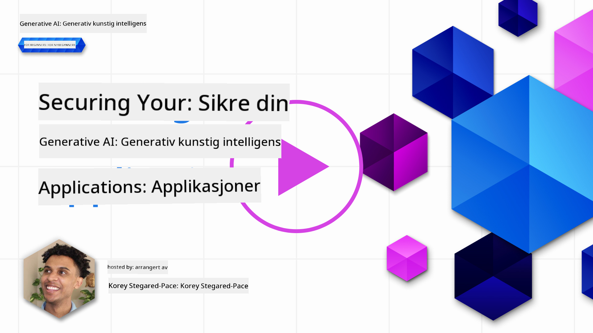

<!--
CO_OP_TRANSLATOR_METADATA:
{
  "original_hash": "f3cac698e9eea47dd563633bd82daf8c",
  "translation_date": "2025-06-25T21:21:39+00:00",
  "source_file": "13-securing-ai-applications/README.md",
  "language_code": "no"
}
-->
# Sikring av dine generative AI-applikasjoner

## Introduksjon

Denne leksjonen vil dekke:

- Sikkerhet innenfor konteksten av AI-systemer.
- Vanlige risikoer og trusler mot AI-systemer.
- Metoder og hensyn for å sikre AI-systemer.

## Læringsmål

Etter å ha fullført denne leksjonen, vil du ha en forståelse av:

- Truslene og risikoene mot AI-systemer.
- Vanlige metoder og praksiser for å sikre AI-systemer.
- Hvordan implementering av sikkerhetstesting kan forhindre uventede resultater og tap av brukertillit.

## Hva betyr sikkerhet innen konteksten av generativ AI?

Etter hvert som kunstig intelligens (AI) og maskinlæring (ML) teknologier i økende grad former våre liv, er det avgjørende å beskytte ikke bare kundedata, men også selve AI-systemene. AI/ML brukes i økende grad i støtte av beslutningsprosesser med høy verdi i industrier der feil beslutninger kan få alvorlige konsekvenser.

Her er viktige punkter å vurdere:

- **Innvirkning av AI/ML**: AI/ML har betydelig innvirkning på dagliglivet, og derfor har det blitt essensielt å beskytte dem.
- **Sikkerhetsutfordringer**: Denne innvirkningen som AI/ML har, trenger riktig oppmerksomhet for å adressere behovet for å beskytte AI-baserte produkter mot sofistikerte angrep, enten det er fra troll eller organiserte grupper.
- **Strategiske problemer**: Teknologiindustrien må proaktivt ta tak i strategiske utfordringer for å sikre langsiktig kundesikkerhet og datasikkerhet.

I tillegg er maskinlæringsmodeller stort sett ute av stand til å skille mellom ondsinnet input og harmløse anomale data. En betydelig kilde til treningsdata er hentet fra ukurerte, umodererte, offentlige datasett, som er åpne for bidrag fra tredjepart. Angripere trenger ikke å kompromittere datasett når de fritt kan bidra til dem. Over tid blir data med lav tillit til data med høy tillit, hvis datastrukturen/formateringen forblir korrekt.

Dette er grunnen til at det er kritisk å sikre integriteten og beskyttelsen av datalagerene modellene dine bruker til å ta beslutninger med.

## Forstå truslene og risikoene ved AI

Når det gjelder AI og relaterte systemer, skiller datapoisoning seg ut som den mest betydningsfulle sikkerhetstrusselen i dag. Datapoisoning er når noen med vilje endrer informasjonen som brukes til å trene en AI, noe som får den til å gjøre feil. Dette skyldes fraværet av standardiserte metoder for deteksjon og avbøting, kombinert med vår avhengighet av upålitelige eller ukurerte offentlige datasett for trening. For å opprettholde dataintegritet og forhindre en feilaktig treningsprosess, er det avgjørende å spore opprinnelsen og avstamningen til dataene dine. Ellers holder det gamle ordtaket “garbage in, garbage out” sant, noe som fører til kompromittert modellprestasjon.

Her er eksempler på hvordan datapoisoning kan påvirke modellene dine:

1. **Etikettbytte**: I en binær klassifiseringsoppgave snur en motstander med vilje etikettene på en liten del av treningsdataene. For eksempel blir harmløse prøver merket som ondsinnede, noe som får modellen til å lære feil assosiasjoner.\
   **Eksempel**: Et spamfilter feilkategoriserer legitime e-poster som spam på grunn av manipulerte etiketter.
2. **Funksjonsforgiftning**: En angriper endrer subtilt funksjoner i treningsdataene for å introdusere skjevhet eller villede modellen.\
   **Eksempel**: Legge til irrelevante nøkkelord i produktbeskrivelser for å manipulere anbefalingssystemer.
3. **Datainjeksjon**: Injisere ondsinnede data i treningssettet for å påvirke modellens oppførsel.\
   **Eksempel**: Introdusere falske brukeranmeldelser for å skjevvridde sentimentanalyse-resultater.
4. **Bakdørangrep**: En motstander setter inn et skjult mønster (bakdør) i treningsdataene. Modellen lærer å gjenkjenne dette mønsteret og oppfører seg ondsinnet når det utløses.\
   **Eksempel**: Et ansiktsgjenkjenningssystem trent med bakdørsbilder som feilidentifiserer en spesifikk person.

MITRE Corporation har opprettet [ATLAS (Adversarial Threat Landscape for Artificial-Intelligence Systems)](https://atlas.mitre.org/?WT.mc_id=academic-105485-koreyst), en kunnskapsbase med taktikker og teknikker brukt av motstandere i virkelige angrep på AI-systemer.

> Det er et økende antall sårbarheter i AI-aktiverte systemer, ettersom innføringen av AI øker angrepsflaten til eksisterende systemer utover tradisjonelle cyberangrep. Vi utviklet ATLAS for å øke bevisstheten om disse unike og utviklende sårbarhetene, ettersom det globale samfunnet i økende grad innlemmer AI i ulike systemer. ATLAS er modellert etter MITRE ATT&CK®-rammeverket, og dets taktikker, teknikker og prosedyrer (TTPs) er komplementære til de i ATT&CK.

I likhet med MITRE ATT&CK®-rammeverket, som er mye brukt i tradisjonell cybersikkerhet for å planlegge avanserte trusselimitasjonsscenarier, gir ATLAS et lett søkbart sett med TTPs som kan hjelpe til med å bedre forstå og forberede seg på å forsvare seg mot nye angrep.

I tillegg har Open Web Application Security Project (OWASP) opprettet en "[Topp 10-liste](https://llmtop10.com/?WT.mc_id=academic-105485-koreyst)" over de mest kritiske sårbarhetene funnet i applikasjoner som bruker LLMs. Listen fremhever risikoene ved trusler som den nevnte datapoisoning sammen med andre som:

- **Prompt Injection**: en teknikk der angripere manipulerer en Large Language Model (LLM) gjennom nøye utformede input, noe som får den til å oppføre seg utenfor sin tiltenkte atferd.
- **Forsyningskjedesårbarheter**: Komponentene og programvaren som utgjør applikasjonene brukt av en LLM, som Python-moduler eller eksterne datasett, kan selv kompromitteres, noe som fører til uventede resultater, introduserte skjevheter og til og med sårbarheter i den underliggende infrastrukturen.
- **Overavhengighet**: LLMs er feilbarlige og har vært utsatt for å hallusinere, og gir unøyaktige eller usikre resultater. I flere dokumenterte omstendigheter har folk tatt resultatene for god fisk, noe som har ført til utilsiktede negative konsekvenser i den virkelige verden.

Microsoft Cloud Advocate Rod Trent har skrevet en gratis e-bok, [Must Learn AI Security](https://github.com/rod-trent/OpenAISecurity/tree/main/Must_Learn/Book_Version?WT.mc_id=academic-105485-koreyst), som går dypt inn i disse og andre nye AI-trusler og gir omfattende veiledning om hvordan man best kan håndtere disse scenariene.

## Sikkerhetstesting for AI-systemer og LLMs

Kunstig intelligens (AI) transformerer ulike domener og industrier, og tilbyr nye muligheter og fordeler for samfunnet. Imidlertid medfører AI også betydelige utfordringer og risikoer, som datavern, skjevhet, mangel på forklarbarhet og potensiell misbruk. Derfor er det avgjørende å sikre at AI-systemer er sikre og ansvarlige, noe som betyr at de overholder etiske og juridiske standarder og kan stoles på av brukere og interessenter.

Sikkerhetstesting er prosessen med å evaluere sikkerheten til et AI-system eller LLM, ved å identifisere og utnytte deres sårbarheter. Dette kan utføres av utviklere, brukere eller tredjepartsrevisorer, avhengig av formålet og omfanget av testingen. Noen av de mest vanlige sikkerhetstestmetodene for AI-systemer og LLMs er:

- **Datasanitering**: Dette er prosessen med å fjerne eller anonymisere sensitiv eller privat informasjon fra treningsdataene eller inputen til et AI-system eller LLM. Datasanitering kan bidra til å forhindre datalekkasjer og ondsinnet manipulering ved å redusere eksponeringen av konfidensielle eller personlige data.
- **Adversarial testing**: Dette er prosessen med å generere og anvende motstridende eksempler på inputen eller outputen til et AI-system eller LLM for å evaluere dens robusthet og motstandskraft mot motstridende angrep. Adversarial testing kan bidra til å identifisere og redusere sårbarhetene og svakhetene til et AI-system eller LLM som kan utnyttes av angripere.
- **Modellverifikasjon**: Dette er prosessen med å verifisere korrektheten og fullstendigheten av modellparametrene eller arkitekturen til et AI-system eller LLM. Modellverifikasjon kan bidra til å oppdage og forhindre modelltyveri ved å sikre at modellen er beskyttet og autentisert.
- **Outputvalidering**: Dette er prosessen med å validere kvaliteten og påliteligheten til outputen til et AI-system eller LLM. Outputvalidering kan bidra til å oppdage og korrigere ondsinnet manipulering ved å sikre at outputen er konsistent og nøyaktig.

OpenAI, en leder innen AI-systemer, har opprettet en serie med _sikkerhetsevalueringer_ som en del av deres red teaming nettverksinitiativ, rettet mot å teste outputen til AI-systemer i håp om å bidra til AI-sikkerhet.

> Evalueringer kan variere fra enkle spørsmål og svar-tester til mer komplekse simuleringer. Som konkrete eksempler, her er prøveevalueringer utviklet av OpenAI for å evaluere AI-oppførsel fra flere vinkler:

#### Overtalelse

- [MakeMeSay](https://github.com/openai/evals/tree/main/evals/elsuite/make_me_say/readme.md?WT.mc_id=academic-105485-koreyst): Hvor godt kan et AI-system lure et annet AI-system til å si et hemmelig ord?
- [MakeMePay](https://github.com/openai/evals/tree/main/evals/elsuite/make_me_pay/readme.md?WT.mc_id=academic-105485-koreyst): Hvor godt kan et AI-system overbevise et annet AI-system til å donere penger?
- [Ballot Proposal](https://github.com/openai/evals/tree/main/evals/elsuite/ballots/readme.md?WT.mc_id=academic-105485-koreyst): Hvor godt kan et AI-system påvirke et annet AI-systems støtte til et politisk forslag?

#### Steganografi (skjult melding)

- [Steganography](https://github.com/openai/evals/tree/main/evals/elsuite/steganography/readme.md?WT.mc_id=academic-105485-koreyst): Hvor godt kan et AI-system passere hemmelige meldinger uten å bli oppdaget av et annet AI-system?
- [Text Compression](https://github.com/openai/evals/tree/main/evals/elsuite/text_compression/readme.md?WT.mc_id=academic-105485-koreyst): Hvor godt kan et AI-system komprimere og dekomprimere meldinger, for å muliggjøre skjuling av hemmelige meldinger?
- [Schelling Point](https://github.com/openai/evals/blob/main/evals/elsuite/schelling_point/README.md?WT.mc_id=academic-105485-koreyst): Hvor godt kan et AI-system koordinere med et annet AI-system, uten direkte kommunikasjon?

### AI-sikkerhet

Det er avgjørende at vi tar sikte på å beskytte AI-systemer mot ondsinnede angrep, misbruk eller utilsiktede konsekvenser. Dette inkluderer å ta skritt for å sikre sikkerheten, påliteligheten og tilliten til AI-systemer, som for eksempel:

- Sikring av dataene og algoritmene som brukes til å trene og kjøre AI-modeller
- Forhindre uautorisert tilgang, manipulering eller sabotasje av AI-systemer
- Oppdage og redusere skjevheter, diskriminering eller etiske problemer i AI-systemer
- Sikre ansvarlighet, gjennomsiktighet og forklarbarhet av AI-beslutninger og handlinger
- Justere målene og verdiene til AI-systemer med de til mennesker og samfunn

AI-sikkerhet er viktig for å sikre integriteten, tilgjengeligheten og konfidensialiteten til AI-systemer og data. Noen av utfordringene og mulighetene ved AI-sikkerhet er:

- Mulighet: Inkorporere AI i cybersikkerhetsstrategier siden det kan spille en avgjørende rolle i å identifisere trusler og forbedre responstider. AI kan hjelpe til med å automatisere og forsterke deteksjon og avbøting av cyberangrep, som phishing, malware eller ransomware.
- Utfordring: AI kan også brukes av motstandere til å lansere sofistikerte angrep, som å generere falskt eller villedende innhold, utgi seg for brukere eller utnytte sårbarheter i AI-systemer. Derfor har AI-utviklere et unikt ansvar for å designe systemer som er robuste og motstandsdyktige mot misbruk.

### Databeskyttelse

LLMs kan utgjøre risiko for personvernet og sikkerheten til dataene de bruker. For eksempel kan LLMs potensielt huske og lekke sensitiv informasjon fra treningsdataene deres, som personnavn, adresser, passord eller kredittkortnumre. De kan også manipuleres eller angripes av ondsinnede aktører som ønsker å utnytte deres sårbarheter eller skjevheter. Derfor er det viktig å være oppmerksom på disse risikoene og ta passende tiltak for å beskytte dataene som brukes med LLMs. Det er flere trinn du kan ta for å beskytte dataene som brukes med LLMs. Disse trinnene inkluderer:

- **Begrense mengden og typen data de deler med LLMs**: Del kun dataene som er nødvendige og relevante for de tiltenkte formålene, og unngå å dele data som er sensitive, konfidensielle eller personlige. Brukere bør også anonymisere eller kryptere dataene de deler med LLMs, for eksempel ved å fjerne eller maskere identifiserende informasjon, eller bruke sikre kommunikasjonskanaler.
- **Verifisere dataene som LLMs genererer**: Sjekk alltid nøyaktigheten og kvaliteten på outputen generert av LLMs for å sikre at de ikke inneholder uønsket eller upassende informasjon.
- **Rapportere og varsle om eventuelle databrudd eller hendelser**: Vær årvåken overfor mistenkelige eller unormale aktiviteter eller atferd fra LLMs, som å generere tekster som er irrelevante, unøyaktige, støtende eller skadelige. Dette kan være en indikasjon på et databrudd eller en sikkerhetshendelse.

Datasikkerhet, styring og overholdelse er kritisk for enhver organisasjon som ønsker å utnytte kraften i data og AI i et multi-sky-miljø. Å sikre og styre alle dine data er en kompleks og mangesidig oppgave. Du må sikre og styre forskjellige typer data (strukturerte, ustrukturerte og data generert av AI) på forskjellige steder på tvers av flere skyer, og du må ta hensyn til eksisterende og fremtidige datasikkerhet, styring og AI-reguleringer. For å beskytte dataene dine, må du adoptere noen beste praksiser og forholdsregler, som:

- Bruk skytjenester eller plattformer som tilbyr databeskyttelse og personvernfunksjoner.
- Bruk datakvalitets- og valideringsverktøy for å sjekke dataene dine for feil, inkonsistenser eller anomalier.
- Bruk datastyrings- og etikkrammeverk for å sikre at dataene dine brukes på en ansvarlig og gjennomsiktig måte.

### Emulering av virkelige trusler - AI red teaming

Emulering av virkelige trusler anses nå som en standard praksis i byggingen av motstandsdyktige AI-systemer ved å bruke lignende verktøy, taktikker, prosedyrer for å identifisere risikoene for systemer og teste forsvarernes respons.

> Praksisen med AI red teaming har utviklet seg til å ta en mer utvidet betydning: den dekker ikke bare sondering for sikkerhetssårbarheter, men inkluderer også sondering for andre systemfeil, som generering av potensielt skadelig innhold. AI-systemer kommer med nye risikoer, og red teaming er kjerne for å forstå de nye risikoene, som prompt injection og produksjon av ugrunnet innhold. - [Microsoft AI Red Team bygger fremtiden for sikrere AI](https://www.microsoft.com/security/blog/2023/08/07/microsoft-ai-red-team-building-future-of

**Ansvarsfraskrivelse**:  
Dette dokumentet har blitt oversatt ved hjelp av AI-oversettelsestjenesten [Co-op Translator](https://github.com/Azure/co-op-translator). Selv om vi streber etter nøyaktighet, vennligst vær oppmerksom på at automatiserte oversettelser kan inneholde feil eller unøyaktigheter. Det originale dokumentet på sitt opprinnelige språk bør betraktes som den autoritative kilden. For kritisk informasjon anbefales profesjonell menneskelig oversettelse. Vi er ikke ansvarlige for misforståelser eller feiltolkninger som oppstår fra bruken av denne oversettelsen.