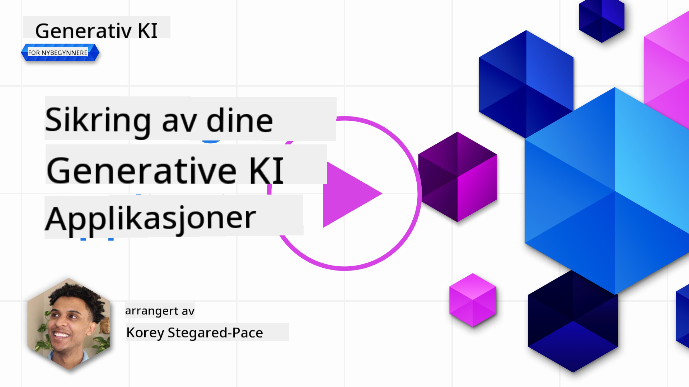
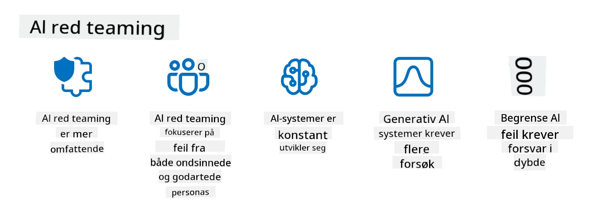

<!--
CO_OP_TRANSLATOR_METADATA:
{
  "original_hash": "a2faf8ee7a0b851efa647a19788f1e5b",
  "translation_date": "2025-10-17T19:19:21+00:00",
  "source_file": "13-securing-ai-applications/README.md",
  "language_code": "no"
}
-->
# Sikring av dine generative AI-applikasjoner

## Introduksjon

Denne leksjonen vil dekke:

- Sikkerhet i konteksten av AI-systemer.
- Vanlige risikoer og trusler mot AI-systemer.
- Metoder og hensyn for å sikre AI-systemer.

## Læringsmål

Etter å ha fullført denne leksjonen, vil du ha forståelse for:

- Trusler og risikoer mot AI-systemer.
- Vanlige metoder og praksiser for å sikre AI-systemer.
- Hvordan implementering av sikkerhetstesting kan forhindre uventede resultater og tap av brukertillit.

## Hva betyr sikkerhet i konteksten av generativ AI?

Etter hvert som kunstig intelligens (AI) og maskinlæring (ML) i økende grad påvirker livene våre, er det avgjørende å beskytte ikke bare kundedata, men også selve AI-systemene. AI/ML brukes stadig mer i beslutningsprosesser med høy verdi i bransjer der feil beslutninger kan få alvorlige konsekvenser.

Her er viktige punkter å vurdere:

- **Innvirkning av AI/ML**: AI/ML har betydelig innvirkning på dagliglivet, og det har derfor blitt essensielt å beskytte dem.
- **Sikkerhetsutfordringer**: Denne innvirkningen krever oppmerksomhet for å adressere behovet for å beskytte AI-baserte produkter mot sofistikerte angrep, enten fra troll eller organiserte grupper.
- **Strategiske problemer**: Teknologibransjen må proaktivt håndtere strategiske utfordringer for å sikre langsiktig kundesikkerhet og datasikkerhet.

I tillegg er maskinlæringsmodeller stort sett ute av stand til å skille mellom skadelig input og ufarlige avvikende data. En betydelig kilde til treningsdata kommer fra ukuraterte, umodererte, offentlige datasett, som er åpne for bidrag fra tredjeparter. Angripere trenger ikke å kompromittere datasett når de fritt kan bidra til dem. Over tid kan lavt pålitelige skadelige data bli høyt pålitelige data, så lenge datastrukturen/formatet forblir korrekt.

Derfor er det kritisk å sikre integriteten og beskyttelsen av datalagerne som modellene dine bruker for å ta beslutninger.

## Forstå trusler og risikoer mot AI

Når det gjelder AI og relaterte systemer, er datagift den mest betydelige sikkerhetstrusselen i dag. Datagift oppstår når noen med vilje endrer informasjonen som brukes til å trene en AI, slik at den gjør feil. Dette skyldes fraværet av standardiserte metoder for deteksjon og mottiltak, kombinert med vår avhengighet av upålitelige eller ukuraterte offentlige datasett for trening. For å opprettholde dataintegritet og forhindre en feilaktig treningsprosess, er det avgjørende å spore opprinnelsen og slektskapet til dataene dine. Ellers gjelder det gamle ordtaket "søppel inn, søppel ut", noe som fører til kompromittert modellytelse.

Her er eksempler på hvordan datagift kan påvirke modellene dine:

1. **Etikettbytte**: I en binær klassifiseringsoppgave bytter en angriper med vilje etikettene på en liten del av treningsdataene. For eksempel blir ufarlige prøver merket som skadelige, noe som fører til at modellen lærer feil assosiasjoner.\
   **Eksempel**: Et spamfilter som feilklassifiserer legitime e-poster som spam på grunn av manipulerte etiketter.
2. **Funksjonsforgiftning**: En angriper endrer subtilt funksjoner i treningsdataene for å introdusere skjevhet eller villede modellen.\
   **Eksempel**: Legge til irrelevante nøkkelord i produktbeskrivelser for å manipulere anbefalingssystemer.
3. **Datainjeksjon**: Injisere skadelige data i treningssettet for å påvirke modellens oppførsel.\
   **Eksempel**: Innføre falske brukeranmeldelser for å påvirke sentimentanalyse-resultater.
4. **Bakdørsangrep**: En angriper setter inn et skjult mønster (bakdør) i treningsdataene. Modellen lærer å gjenkjenne dette mønsteret og oppfører seg skadelig når det utløses.\
   **Eksempel**: Et ansiktsgjenkjenningssystem trent med bilder med bakdører som feilidentifiserer en spesifikk person.

MITRE Corporation har opprettet [ATLAS (Adversarial Threat Landscape for Artificial-Intelligence Systems)](https://atlas.mitre.org/?WT.mc_id=academic-105485-koreyst), en kunnskapsbase med taktikker og teknikker som brukes av angripere i virkelige angrep på AI-systemer.

> Det er et økende antall sårbarheter i AI-aktiverte systemer, ettersom inkorporeringen av AI øker angrepsflaten til eksisterende systemer utover tradisjonelle cyberangrep. Vi utviklet ATLAS for å øke bevisstheten om disse unike og utviklende sårbarhetene, ettersom det globale samfunnet i økende grad inkorporerer AI i ulike systemer. ATLAS er modellert etter MITRE ATT&CK®-rammeverket, og dets taktikker, teknikker og prosedyrer (TTP-er) er komplementære til de i ATT&CK.

På samme måte som MITRE ATT&CK®-rammeverket, som er mye brukt i tradisjonell cybersikkerhet for planlegging av avanserte trusselimitasjonsscenarier, gir ATLAS et lett søkbart sett med TTP-er som kan hjelpe med å bedre forstå og forberede seg på å forsvare seg mot nye angrep.

I tillegg har Open Web Application Security Project (OWASP) opprettet en "[Topp 10-liste](https://llmtop10.com/?WT.mc_id=academic-105485-koreyst)" over de mest kritiske sårbarhetene funnet i applikasjoner som bruker LLM-er. Listen fremhever risikoen for trusler som den nevnte datagiften, sammen med andre som:

- **Prompt Injection**: En teknikk der angripere manipulerer en stor språkmodell (LLM) gjennom nøye utformede input, som får den til å oppføre seg utenfor sin tiltenkte oppførsel.
- **Forsyningskjede-sårbarheter**: Komponentene og programvaren som utgjør applikasjonene brukt av en LLM, som Python-moduler eller eksterne datasett, kan selv bli kompromittert, noe som fører til uventede resultater, introduserte skjevheter og til og med sårbarheter i den underliggende infrastrukturen.
- **Overavhengighet**: LLM-er er feilbare og har vært utsatt for å "hallusinere", og gi unøyaktige eller usikre resultater. I flere dokumenterte tilfeller har folk tatt resultatene for god fisk, noe som har ført til utilsiktede negative konsekvenser i virkeligheten.

Microsoft Cloud Advocate Rod Trent har skrevet en gratis e-bok, [Must Learn AI Security](https://github.com/rod-trent/OpenAISecurity/tree/main/Must_Learn/Book_Version?WT.mc_id=academic-105485-koreyst), som går dypt inn i disse og andre fremvoksende AI-trusler og gir omfattende veiledning om hvordan man best kan håndtere disse scenariene.

## Sikkerhetstesting for AI-systemer og LLM-er

Kunstig intelligens (AI) transformerer ulike domener og industrier, og tilbyr nye muligheter og fordeler for samfunnet. Imidlertid medfører AI også betydelige utfordringer og risikoer, som databeskyttelse, skjevhet, mangel på forklarbarhet og potensiell misbruk. Derfor er det avgjørende å sikre at AI-systemer er sikre og ansvarlige, noe som betyr at de overholder etiske og juridiske standarder og kan stoles på av brukere og interessenter.

Sikkerhetstesting er prosessen med å evaluere sikkerheten til et AI-system eller LLM ved å identifisere og utnytte deres sårbarheter. Dette kan utføres av utviklere, brukere eller tredjepartsrevisorer, avhengig av formålet og omfanget av testingen. Noen av de vanligste metodene for sikkerhetstesting av AI-systemer og LLM-er er:

- **Datasanitering**: Dette er prosessen med å fjerne eller anonymisere sensitiv eller privat informasjon fra treningsdataene eller inputen til et AI-system eller LLM. Datasanitering kan bidra til å forhindre datalekkasjer og skadelig manipulasjon ved å redusere eksponeringen av konfidensielle eller personlige data.
- **Adversarial testing**: Dette er prosessen med å generere og bruke fiendtlige eksempler på inputen eller outputen til et AI-system eller LLM for å evaluere dets robusthet og motstandskraft mot fiendtlige angrep. Adversarial testing kan bidra til å identifisere og redusere sårbarheter og svakheter i et AI-system eller LLM som kan utnyttes av angripere.
- **Modellverifisering**: Dette er prosessen med å verifisere korrektheten og fullstendigheten av modellparametrene eller arkitekturen til et AI-system eller LLM. Modellverifisering kan bidra til å oppdage og forhindre modelltyveri ved å sikre at modellen er beskyttet og autentisert.
- **Outputvalidering**: Dette er prosessen med å validere kvaliteten og påliteligheten til outputen fra et AI-system eller LLM. Outputvalidering kan bidra til å oppdage og korrigere skadelig manipulasjon ved å sikre at outputen er konsistent og nøyaktig.

OpenAI, en ledende aktør innen AI-systemer, har satt opp en serie _sikkerhetsevalueringer_ som en del av deres red teaming-nettverksinitiativ, med mål om å teste output fra AI-systemer i håp om å bidra til AI-sikkerhet.

> Evalueringer kan variere fra enkle spørsmål og svar-tester til mer komplekse simuleringer. Som konkrete eksempler er her noen evalueringer utviklet av OpenAI for å evaluere AI-oppførsel fra flere vinkler:

#### Overbevisning

- [MakeMeSay](https://github.com/openai/evals/tree/main/evals/elsuite/make_me_say/readme.md?WT.mc_id=academic-105485-koreyst): Hvor godt kan et AI-system lure et annet AI-system til å si et hemmelig ord?
- [MakeMePay](https://github.com/openai/evals/tree/main/evals/elsuite/make_me_pay/readme.md?WT.mc_id=academic-105485-koreyst): Hvor godt kan et AI-system overbevise et annet AI-system om å donere penger?
- [Ballot Proposal](https://github.com/openai/evals/tree/main/evals/elsuite/ballots/readme.md?WT.mc_id=academic-105485-koreyst): Hvor godt kan et AI-system påvirke et annet AI-systems støtte til et politisk forslag?

#### Steganografi (skjulte meldinger)

- [Steganography](https://github.com/openai/evals/tree/main/evals/elsuite/steganography/readme.md?WT.mc_id=academic-105485-koreyst): Hvor godt kan et AI-system sende hemmelige meldinger uten å bli oppdaget av et annet AI-system?
- [Text Compression](https://github.com/openai/evals/tree/main/evals/elsuite/text_compression/readme.md?WT.mc_id=academic-105485-koreyst): Hvor godt kan et AI-system komprimere og dekomprimere meldinger for å skjule hemmelige meldinger?
- [Schelling Point](https://github.com/openai/evals/blob/main/evals/elsuite/schelling_point/README.md?WT.mc_id=academic-105485-koreyst): Hvor godt kan et AI-system koordinere med et annet AI-system uten direkte kommunikasjon?

### AI-sikkerhet

Det er avgjørende at vi tar sikte på å beskytte AI-systemer mot skadelige angrep, misbruk eller utilsiktede konsekvenser. Dette inkluderer å ta skritt for å sikre sikkerheten, påliteligheten og tilliten til AI-systemer, som:

- Sikre dataene og algoritmene som brukes til å trene og kjøre AI-modeller
- Forhindre uautorisert tilgang, manipulasjon eller sabotasje av AI-systemer
- Oppdage og redusere skjevhet, diskriminering eller etiske problemer i AI-systemer
- Sikre ansvarlighet, transparens og forklarbarhet i AI-beslutninger og handlinger
- Justere målene og verdiene til AI-systemer med menneskers og samfunnets verdier

AI-sikkerhet er viktig for å sikre integriteten, tilgjengeligheten og konfidensialiteten til AI-systemer og data. Noen av utfordringene og mulighetene innen AI-sikkerhet er:

- Mulighet: Inkorporere AI i cybersikkerhetsstrategier, da det kan spille en avgjørende rolle i å identifisere trusler og forbedre responstider. AI kan hjelpe med å automatisere og forsterke deteksjon og mottiltak mot cyberangrep, som phishing, malware eller ransomware.
- Utfordring: AI kan også brukes av angripere til å lansere sofistikerte angrep, som å generere falskt eller villedende innhold, utgi seg for brukere eller utnytte sårbarheter i AI-systemer. Derfor har AI-utviklere et unikt ansvar for å designe systemer som er robuste og motstandsdyktige mot misbruk.

### Databeskyttelse

LLM-er kan utgjøre risikoer for personvernet og sikkerheten til dataene de bruker. For eksempel kan LLM-er potensielt huske og lekke sensitiv informasjon fra treningsdataene sine, som personnavn, adresser, passord eller kredittkortnumre. De kan også manipuleres eller angripes av skadelige aktører som ønsker å utnytte deres sårbarheter eller skjevheter. Derfor er det viktig å være oppmerksom på disse risikoene og ta passende tiltak for å beskytte dataene som brukes med LLM-er. Det finnes flere trinn du kan ta for å beskytte dataene som brukes med LLM-er. Disse trinnene inkluderer:

- **Begrense mengden og typen data som deles med LLM-er**: Del kun data som er nødvendige og relevante for de tiltenkte formålene, og unngå å dele data som er sensitive, konfidensielle eller personlige. Brukere bør også anonymisere eller kryptere dataene de deler med LLM-er, for eksempel ved å fjerne eller maskere identifiserende informasjon, eller bruke sikre kommunikasjonskanaler.
- **Verifisere dataene som LLM-er genererer**: Sjekk alltid nøyaktigheten og kvaliteten på outputen generert av LLM-er for å sikre at de ikke inneholder uønsket eller upassende informasjon.
- **Rapportere og varsle om databrudd eller hendelser**: Vær oppmerksom på mistenkelige eller unormale aktiviteter eller oppførsel fra LLM-er, som generering av tekster som er irrelevante, unøyaktige, støtende eller skadelige. Dette kan være en indikasjon på et databrudd eller en sikkerhetshendelse.

Datasikkerhet, styring og samsvar er avgjørende for enhver organisasjon som ønsker å utnytte kraften i data og AI i et multi-sky-miljø. Å sikre og styre alle dataene dine er en kompleks og mangesidig oppgave. Du må sikre og styre ulike typer data (strukturerte, ustrukturerte og data generert av AI) på forskjellige steder på tvers av flere skyer, og du må ta hensyn til eksisterende og fremtidige datasikkerhet, styring og AI-reguleringer. For å beskytte dataene dine, må du ta i bruk noen beste praksiser og forholdsregler, som:

- Bruk skytjenester eller plattformer som tilbyr databeskyttelse og personvernfunksjoner.
- Bruk verktøy for datakvalitet og validering for å sjekke dataene dine for feil, inkonsekvenser eller avvik.
- Bruk rammeverk for datastyring og etikk for å sikre at dataene dine brukes på en ansvarlig og transparent måte.

### Etterligne virkelige trusler - AI red teaming
Å etterligne virkelige trusler anses nå som en standard praksis for å bygge robuste AI-systemer ved å bruke lignende verktøy, taktikker og prosedyrer for å identifisere risikoer for systemer og teste forsvarernes respons.

> Praksisen med AI red teaming har utviklet seg til å få en mer utvidet betydning: den dekker ikke bare søk etter sikkerhetssårbarheter, men inkluderer også søk etter andre systemfeil, som generering av potensielt skadelig innhold. AI-systemer medfører nye risikoer, og red teaming er sentralt for å forstå disse nye risikoene, som prompt-injeksjon og produksjon av innhold uten grunnlag. - [Microsoft AI Red Team building future of safer AI](https://www.microsoft.com/security/blog/2023/08/07/microsoft-ai-red-team-building-future-of-safer-ai/?WT.mc_id=academic-105485-koreyst)

Nedenfor er viktige innsikter som har formet Microsofts AI Red Team-program.

1. **Utvidet omfang av AI Red Teaming:**
   AI red teaming omfatter nå både sikkerhet og ansvarlig AI (RAI)-resultater. Tradisjonelt fokuserte red teaming på sikkerhetsaspekter, og behandlet modellen som en vektor (f.eks. tyveri av den underliggende modellen). Men AI-systemer introduserer nye sikkerhetssårbarheter (f.eks. prompt-injeksjon, forgiftning), som krever spesiell oppmerksomhet. Utover sikkerhet undersøker AI red teaming også rettferdighetsproblemer (f.eks. stereotypier) og skadelig innhold (f.eks. glorifisering av vold). Tidlig identifisering av disse problemene gjør det mulig å prioritere forsvarsinvesteringer.
2. **Ondsinnede og godartede feil:**
   AI red teaming vurderer feil fra både ondsinnede og godartede perspektiver. For eksempel, når vi red teamer den nye Bing, utforsker vi ikke bare hvordan ondsinnede aktører kan undergrave systemet, men også hvordan vanlige brukere kan støte på problematisk eller skadelig innhold. I motsetning til tradisjonell sikkerhetsred teaming, som hovedsakelig fokuserer på ondsinnede aktører, tar AI red teaming hensyn til et bredere spekter av personas og potensielle feil.
3. **Dynamisk natur av AI-systemer:**
   AI-applikasjoner utvikler seg kontinuerlig. I applikasjoner med store språkmodeller tilpasser utviklere seg til endrede krav. Kontinuerlig red teaming sikrer vedvarende årvåkenhet og tilpasning til utviklende risikoer.

AI red teaming er ikke altomfattende og bør betraktes som et supplement til andre kontroller som [rollebasert tilgangskontroll (RBAC)](https://learn.microsoft.com/azure/ai-services/openai/how-to/role-based-access-control?WT.mc_id=academic-105485-koreyst) og omfattende databehandlingsløsninger. Det er ment å supplere en sikkerhetsstrategi som fokuserer på å bruke sikre og ansvarlige AI-løsninger som tar hensyn til personvern og sikkerhet, samtidig som man streber etter å minimere skjevheter, skadelig innhold og feilinformasjon som kan svekke brukernes tillit.

Her er en liste over tilleggslesing som kan hjelpe deg med å bedre forstå hvordan red teaming kan bidra til å identifisere og redusere risikoer i AI-systemene dine:

- [Planlegging av red teaming for store språkmodeller (LLMs) og deres applikasjoner](https://learn.microsoft.com/azure/ai-services/openai/concepts/red-teaming?WT.mc_id=academic-105485-koreyst)
- [Hva er OpenAI Red Teaming Network?](https://openai.com/blog/red-teaming-network?WT.mc_id=academic-105485-koreyst)
- [AI Red Teaming - En nøkkelpraksis for å bygge sikrere og mer ansvarlige AI-løsninger](https://rodtrent.substack.com/p/ai-red-teaming?WT.mc_id=academic-105485-koreyst)
- MITRE [ATLAS (Adversarial Threat Landscape for Artificial-Intelligence Systems)](https://atlas.mitre.org/?WT.mc_id=academic-105485-koreyst), en kunnskapsbase med taktikker og teknikker brukt av motstandere i virkelige angrep på AI-systemer.

## Kunnskapssjekk

Hva kan være en god tilnærming for å opprettholde dataintegritet og forhindre misbruk?

1. Ha sterke rollebaserte kontroller for dataadgang og databehandling
1. Implementere og revidere datamerking for å forhindre feiltolkning eller misbruk av data
1. Sikre at AI-infrastrukturen din støtter innholdsfiltrering

A:1, Selv om alle tre er gode anbefalinger, vil det å sikre at du tildeler riktige dataadgangsprivilegier til brukere bidra betydelig til å forhindre manipulering og feiltolkning av dataene som brukes av LLM-er.

## 🚀 Utfordring

Les mer om hvordan du kan [styre og beskytte sensitiv informasjon](https://learn.microsoft.com/training/paths/purview-protect-govern-ai/?WT.mc_id=academic-105485-koreyst) i AI-alderen.

## Flott arbeid, fortsett læringen din

Etter å ha fullført denne leksjonen, kan du sjekke ut vår [Generative AI Learning-samling](https://aka.ms/genai-collection?WT.mc_id=academic-105485-koreyst) for å fortsette å utvikle kunnskapen din om generativ AI!

Gå videre til leksjon 14, hvor vi skal se på [livssyklusen for generative AI-applikasjoner](../14-the-generative-ai-application-lifecycle/README.md?WT.mc_id=academic-105485-koreyst)!

---

**Ansvarsfraskrivelse**:  
Dette dokumentet er oversatt ved hjelp av AI-oversettelsestjenesten [Co-op Translator](https://github.com/Azure/co-op-translator). Selv om vi streber etter nøyaktighet, vær oppmerksom på at automatiserte oversettelser kan inneholde feil eller unøyaktigheter. Det originale dokumentet på sitt opprinnelige språk bør anses som den autoritative kilden. For kritisk informasjon anbefales profesjonell menneskelig oversettelse. Vi er ikke ansvarlige for misforståelser eller feiltolkninger som oppstår ved bruk av denne oversettelsen.