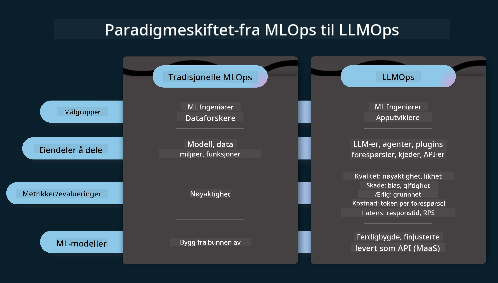
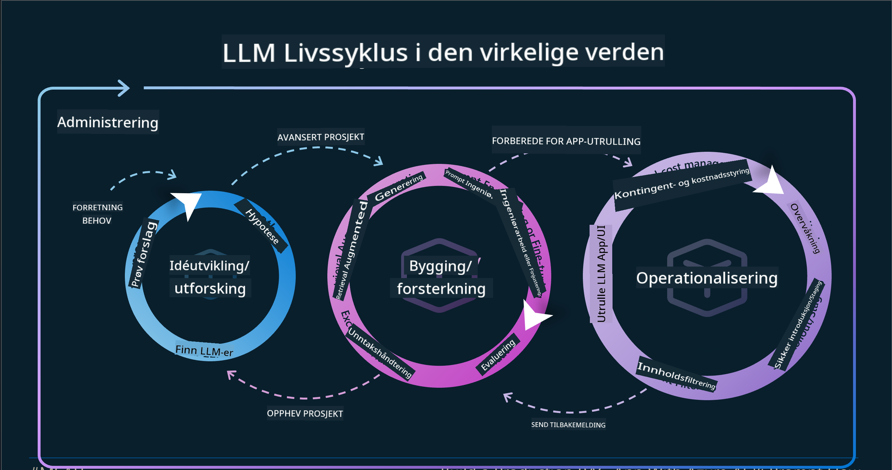
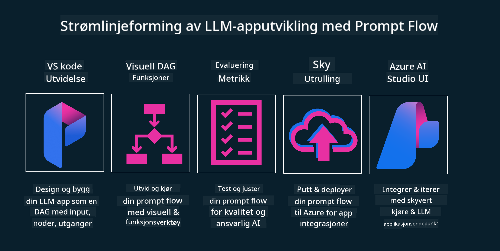

<!--
CO_OP_TRANSLATOR_METADATA:
{
  "original_hash": "27a5347a5022d5ef0a72ab029b03526a",
  "translation_date": "2025-07-09T15:55:00+00:00",
  "source_file": "14-the-generative-ai-application-lifecycle/README.md",
  "language_code": "no"
}
-->

# Livssyklusen for generative AI-applikasjoner

Et viktig spørsmål for alle AI-applikasjoner er relevansen av AI-funksjoner, siden AI er et raskt utviklende felt. For å sikre at applikasjonen din forblir relevant, pålitelig og robust, må du kontinuerlig overvåke, evaluere og forbedre den. Her kommer livssyklusen for generativ AI inn i bildet.

Livssyklusen for generativ AI er et rammeverk som veileder deg gjennom stadiene for utvikling, utrulling og vedlikehold av en generativ AI-applikasjon. Den hjelper deg med å definere målene dine, måle ytelsen, identifisere utfordringer og implementere løsninger. Den hjelper deg også med å tilpasse applikasjonen til etiske og juridiske standarder i ditt domene og for dine interessenter. Ved å følge livssyklusen for generativ AI kan du sikre at applikasjonen alltid leverer verdi og tilfredsstiller brukerne dine.

## Introduksjon

I dette kapitlet vil du:

- Forstå paradigmeskiftet fra MLOps til LLMOps  
- LLM-livssyklusen  
- Verktøy for livssyklusen  
- Metrifisering og evaluering av livssyklusen  

## Forstå paradigmeskiftet fra MLOps til LLMOps

LLM-er er et nytt verktøy i AI-arsenalet, de er utrolig kraftige i analyse- og genereringsoppgaver for applikasjoner, men denne kraften har noen konsekvenser for hvordan vi effektiviserer AI og klassiske maskinlæringsoppgaver.

Derfor trenger vi et nytt paradigme for å tilpasse dette verktøyet på en dynamisk måte, med riktige insentiver. Vi kan kategorisere eldre AI-apper som "ML Apps" og nyere AI-apper som "GenAI Apps" eller bare "AI Apps", for å reflektere den dominerende teknologien og teknikkene som brukes til enhver tid. Dette endrer fortellingen vår på flere måter, se på følgende sammenligning.

Legg merke til at i LLMOps er fokuset mer på apputviklerne, med integrasjoner som et nøkkelpunkt, bruk av "Models-as-a-Service" og tenkning rundt følgende metrikker.

- Kvalitet: Responskvalitet  
- Skade: Ansvarlig AI  
- Ærlighet: Responsens forankring (Gir det mening? Er det korrekt?)  
- Kostnad: Løsningsbudsjett  
- Forsinkelse: Gjennomsnittlig tid for token-respons  

## LLM-livssyklusen

Først, for å forstå livssyklusen og endringene, la oss se på neste infografikk.

Som du kanskje legger merke til, er dette annerledes enn de vanlige livssyklusene i MLOps. LLM-er har mange nye krav, som prompting, ulike teknikker for å forbedre kvalitet (Fine-Tuning, RAG, Meta-Prompts), annen vurdering og ansvar knyttet til ansvarlig AI, og til slutt nye evalueringsmetrikker (Kvalitet, Skade, Ærlighet, Kostnad og Forsinkelse).

For eksempel, se på hvordan vi ideerer. Vi bruker prompt engineering for å eksperimentere med ulike LLM-er for å utforske muligheter og teste om hypotesene våre kan være riktige.

Merk at dette ikke er en lineær prosess, men integrerte sløyfer, iterative og med en overordnet syklus.

Hvordan kan vi utforske disse stegene? La oss gå i detalj på hvordan vi kan bygge en livssyklus.

Dette kan virke litt komplisert, la oss først fokusere på de tre store stegene.

1. Ideering/Utforsking: Utforskning, her kan vi utforske i henhold til forretningsbehovene våre. Prototyping, lage en [PromptFlow](https://microsoft.github.io/promptflow/index.html?WT.mc_id=academic-105485-koreyst) og teste om den er effektiv nok for hypotesen vår.  
1. Bygging/Utvidelse: Implementering, nå begynner vi å evaluere for større datasett, implementere teknikker som Fine-tuning og RAG for å sjekke robustheten i løsningen vår. Hvis det ikke fungerer, kan reimplementering, legge til nye steg i flyten eller omstrukturering av data hjelpe. Etter testing av flyten og skalaen, hvis det fungerer og metrikker sjekkes, er det klart for neste steg.  
1. Operasjonalisering: Integrasjon, nå legger vi til overvåking og varslingssystemer, utrulling og applikasjonsintegrasjon til applikasjonen vår.  

Deretter har vi den overordnede syklusen for ledelse, med fokus på sikkerhet, samsvar og styring.

Gratulerer, nå har du din AI-app klar til bruk og drift. For en praktisk opplevelse, ta en titt på [Contoso Chat Demo.](https://nitya.github.io/contoso-chat/?WT.mc_id=academic-105485-koreys)

Nå, hvilke verktøy kan vi bruke?

## Verktøy for livssyklusen

For verktøy tilbyr Microsoft [Azure AI Platform](https://azure.microsoft.com/solutions/ai/?WT.mc_id=academic-105485-koreys) og [PromptFlow](https://microsoft.github.io/promptflow/index.html?WT.mc_id=academic-105485-koreyst) som gjør det enkelt å implementere og komme i gang med livssyklusen.

[Azure AI Platform](https://azure.microsoft.com/solutions/ai/?WT.mc_id=academic-105485-koreys) lar deg bruke [AI Studio](https://ai.azure.com/?WT.mc_id=academic-105485-koreys). AI Studio er en nettportal som lar deg utforske modeller, eksempler og verktøy. Administrere ressurser, UI-utviklingsflyter og SDK/CLI-alternativer for kode-først utvikling.

Azure AI lar deg bruke flere ressurser for å administrere operasjoner, tjenester, prosjekter, vektorsøk og databasebehov.

Bygg fra Proof-of-Concept (POC) til storskala applikasjoner med PromptFlow:

- Design og bygg apper fra VS Code, med visuelle og funksjonelle verktøy  
- Test og finjuster appene dine for kvalitets-AI, enkelt og greit  
- Bruk Azure AI Studio for å integrere og iterere med skyen, push og deploy for rask integrasjon  

## Flott! Fortsett læringen din!

Fantastisk, lær nå mer om hvordan vi strukturerer en applikasjon for å bruke konseptene med [Contoso Chat App](https://nitya.github.io/contoso-chat/?WT.mc_id=academic-105485-koreyst), for å se hvordan Cloud Advocacy legger til disse konseptene i demonstrasjoner. For mer innhold, sjekk vår [Ignite breakout session!](https://www.youtube.com/watch?v=DdOylyrTOWg)

Nå, sjekk ut Lekse 15 for å forstå hvordan [Retrieval Augmented Generation og Vector Databases](../15-rag-and-vector-databases/README.md?WT.mc_id=academic-105485-koreyst) påvirker generativ AI og gjør applikasjonene mer engasjerende!

**Ansvarsfraskrivelse**:  
Dette dokumentet er oversatt ved hjelp av AI-oversettelsestjenesten [Co-op Translator](https://github.com/Azure/co-op-translator). Selv om vi streber etter nøyaktighet, vennligst vær oppmerksom på at automatiske oversettelser kan inneholde feil eller unøyaktigheter. Det opprinnelige dokumentet på originalspråket skal anses som den autoritative kilden. For kritisk informasjon anbefales profesjonell menneskelig oversettelse. Vi er ikke ansvarlige for eventuelle misforståelser eller feiltolkninger som oppstår ved bruk av denne oversettelsen.