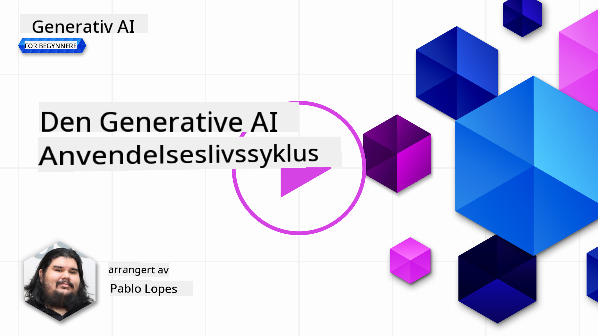
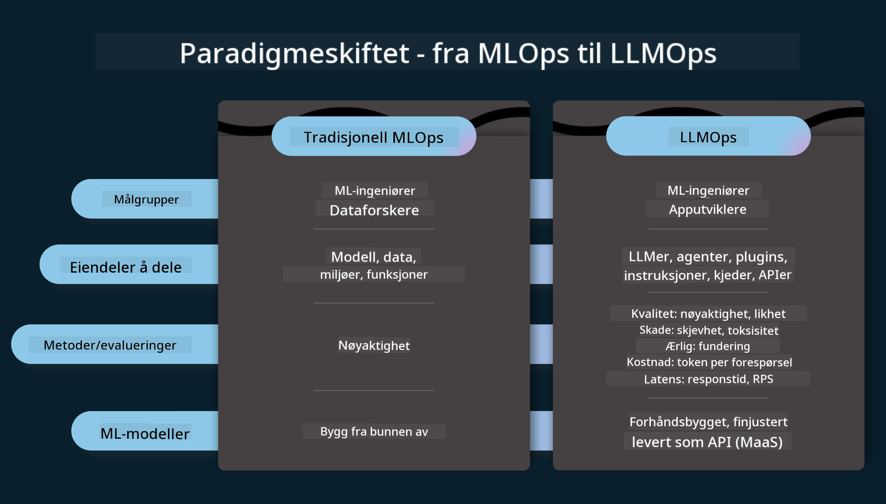
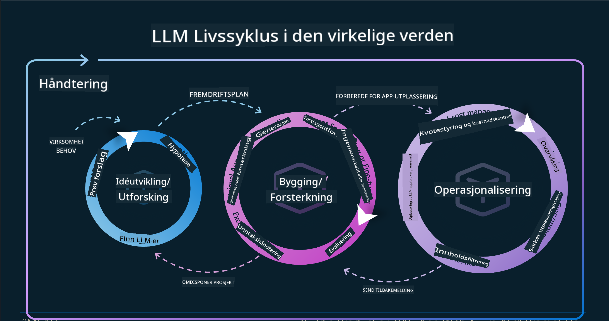
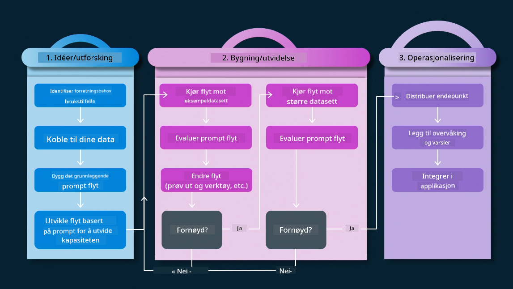
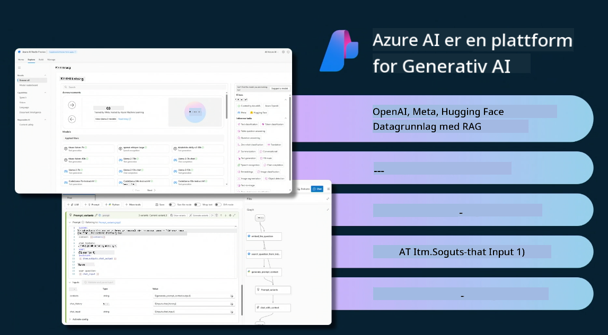
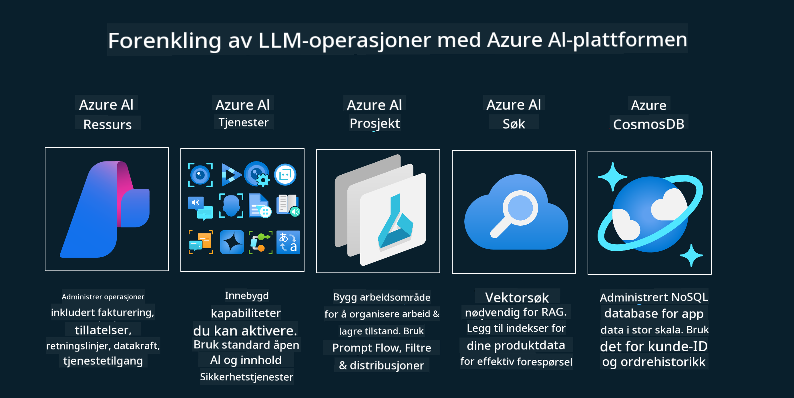
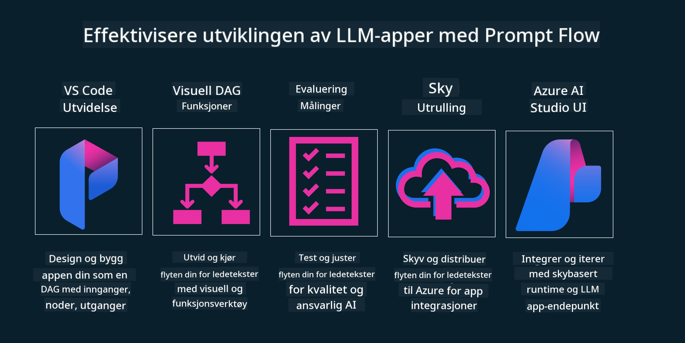

<!--
CO_OP_TRANSLATOR_METADATA:
{
  "original_hash": "27a5347a5022d5ef0a72ab029b03526a",
  "translation_date": "2025-05-19T23:29:37+00:00",
  "source_file": "14-the-generative-ai-application-lifecycle/README.md",
  "language_code": "no"
}
-->

# Livssyklusen for generativ AI-applikasjoner

Et viktig spørsmål for alle AI-applikasjoner er relevansen av AI-funksjoner, siden AI er et raskt utviklende felt. For å sikre at applikasjonen din forblir relevant, pålitelig og robust, må du overvåke, evaluere og forbedre den kontinuerlig. Det er her livssyklusen for generativ AI kommer inn.

Livssyklusen for generativ AI er en rammeverk som veileder deg gjennom stadiene av utvikling, utrulling og vedlikehold av en generativ AI-applikasjon. Den hjelper deg med å definere målene dine, måle ytelsen din, identifisere utfordringene dine og implementere løsningene dine. Den hjelper deg også med å tilpasse applikasjonen din til de etiske og juridiske standardene i ditt domene og dine interessenter. Ved å følge livssyklusen for generativ AI, kan du sikre at applikasjonen din alltid leverer verdi og tilfredsstiller brukerne dine.

## Introduksjon

I dette kapittelet vil du:

- Forstå paradigmeskiftet fra MLOps til LLMOps
- LLM-livssyklusen
- Verktøy for livssyklusen
- Metrikk og evaluering av livssyklusen

## Forstå paradigmeskiftet fra MLOps til LLMOps

LLMs er et nytt verktøy i kunstig intelligens-arsenalet. De er utrolig kraftige i analyse- og genereringsoppgaver for applikasjoner, men denne kraften har noen konsekvenser for hvordan vi strømlinjeformer AI- og klassiske maskinlæringsoppgaver.

Med dette trenger vi et nytt paradigme for å tilpasse dette verktøyet dynamisk, med riktige insentiver. Vi kan kategorisere eldre AI-apper som "ML-apper" og nyere AI-apper som "GenAI-apper" eller bare "AI-apper", som gjenspeiler den rådende teknologien og teknikkene som brukes på den tiden. Dette endrer vår fortelling på flere måter. Se på følgende sammenligning.

Legg merke til at i LLMOps er vi mer fokusert på apputviklere, ved å bruke integrasjoner som et nøkkelpunkt, bruke "Modeller-som-en-tjeneste" og tenke på følgende punkter for metrikker.

- Kvalitet: Responskvalitet
- Skade: Ansvarlig AI
- Ærlighet: Responsens grunnlag (Gir det mening? Er det korrekt?)
- Kostnad: Løsningens budsjett
- Forsinkelse: Gj.sn. tid for tokenrespons

## LLM-livssyklusen

Først, for å forstå livssyklusen og modifikasjonene, la oss merke oss neste infografikk.

Som du kanskje merker, er dette forskjellig fra de vanlige livssyklusene fra MLOps. LLMs har mange nye krav, som Prompting, ulike teknikker for å forbedre kvaliteten (Fine-Tuning, RAG, Meta-Prompts), ulik vurdering og ansvar med ansvarlig AI, til slutt nye evalueringsmetrikker (Kvalitet, Skade, Ærlighet, Kostnad og Forsinkelse).

For eksempel, se på hvordan vi ideer. Bruke prompt engineering for å eksperimentere med ulike LLMs for å utforske muligheter for å teste om deres hypotese kunne være korrekt.

Merk at dette ikke er lineært, men integrerte løkker, iterativt og med en overordnet syklus.

Hvordan kan vi utforske disse stegene? La oss gå inn i detaljene for hvordan vi kan bygge en livssyklus.

Dette kan virke litt komplisert, la oss fokusere på de tre store stegene først.

1. Ideering/Utforsking: Utforskning, her kan vi utforske i henhold til våre forretningsbehov. Prototyping, opprette en [PromptFlow](https://microsoft.github.io/promptflow/index.html?WT.mc_id=academic-105485-koreyst) og teste om det er effektivt nok for vår hypotese.
2. Bygging/Forsterkning: Implementering, nå begynner vi å evaluere for større datasett implementere teknikker, som Fine-tuning og RAG, for å sjekke robustheten av vår løsning. Hvis det ikke gjør det, kan det hjelpe å re-implementere det, legge til nye steg i vår flyt eller omstrukturere dataene. Etter å ha testet vår flyt og vår skala, hvis det fungerer og sjekke våre metrikker, er det klart for neste steg.
3. Operasjonalisering: Integrasjon, nå legge til overvåkings- og varslingssystemer til vårt system, utrulling og applikasjonsintegrasjon til vår applikasjon.

Deretter har vi den overordnede syklusen av ledelse, fokusere på sikkerhet, samsvar og styring.

Gratulerer, nå har du din AI-app klar til å gå og operativ. For en praktisk erfaring, ta en titt på [Contoso Chat Demo.](https://nitya.github.io/contoso-chat/?WT.mc_id=academic-105485-koreys)

Nå, hvilke verktøy kan vi bruke?

## Verktøy for livssyklusen

For verktøy, tilbyr Microsoft [Azure AI Platform](https://azure.microsoft.com/solutions/ai/?WT.mc_id=academic-105485-koreys) og [PromptFlow](https://microsoft.github.io/promptflow/index.html?WT.mc_id=academic-105485-koreyst) for å lette og gjøre din syklus enkel å implementere og klar til å gå.

[Azure AI Platform](https://azure.microsoft.com/solutions/ai/?WT.mc_id=academic-105485-koreys) lar deg bruke [AI Studio](https://ai.azure.com/?WT.mc_id=academic-105485-koreys). AI Studio er en nettportal som lar deg utforske modeller, eksempler og verktøy. Administrere ressursene dine, UI-utviklingsflyter og SDK/CLI-alternativer for kode-først-utvikling.

Azure AI lar deg bruke flere ressurser for å administrere dine operasjoner, tjenester, prosjekter, vektorsøk og databasebehov.

Bygg, fra Proof-of-Concept (POC) til storskala applikasjoner med PromptFlow:

- Design og bygg apper fra VS Code, med visuelle og funksjonelle verktøy
- Test og finjuster appene dine for kvalitets-AI, med letthet.
- Bruk Azure AI Studio for å integrere og iterere med skyen, push og utrulling for rask integrasjon.

## Flott! Fortsett din læring!

Fantastisk, lær nå mer om hvordan vi strukturerer en applikasjon for å bruke konseptene med [Contoso Chat App](https://nitya.github.io/contoso-chat/?WT.mc_id=academic-105485-koreyst), for å se hvordan Cloud Advocacy legger til disse konseptene i demonstrasjoner. For mer innhold, sjekk vår [Ignite breakout session!
](https://www.youtube.com/watch?v=DdOylyrTOWg)

Nå, sjekk leksjon 15, for å forstå hvordan [Retrieval Augmented Generation og vektordatabaser](../15-rag-and-vector-databases/README.md?WT.mc_id=academic-105485-koreyst) påvirker generativ AI og gjør applikasjoner mer engasjerende!

**Ansvarsfraskrivelse**:  
Dette dokumentet har blitt oversatt ved hjelp av AI-oversettelsestjenesten [Co-op Translator](https://github.com/Azure/co-op-translator). Selv om vi streber etter nøyaktighet, vennligst vær oppmerksom på at automatiserte oversettelser kan inneholde feil eller unøyaktigheter. Det originale dokumentet på sitt opprinnelige språk bør betraktes som den autoritative kilden. For kritisk informasjon anbefales profesjonell menneskelig oversettelse. Vi er ikke ansvarlige for eventuelle misforståelser eller feiltolkninger som oppstår ved bruk av denne oversettelsen.