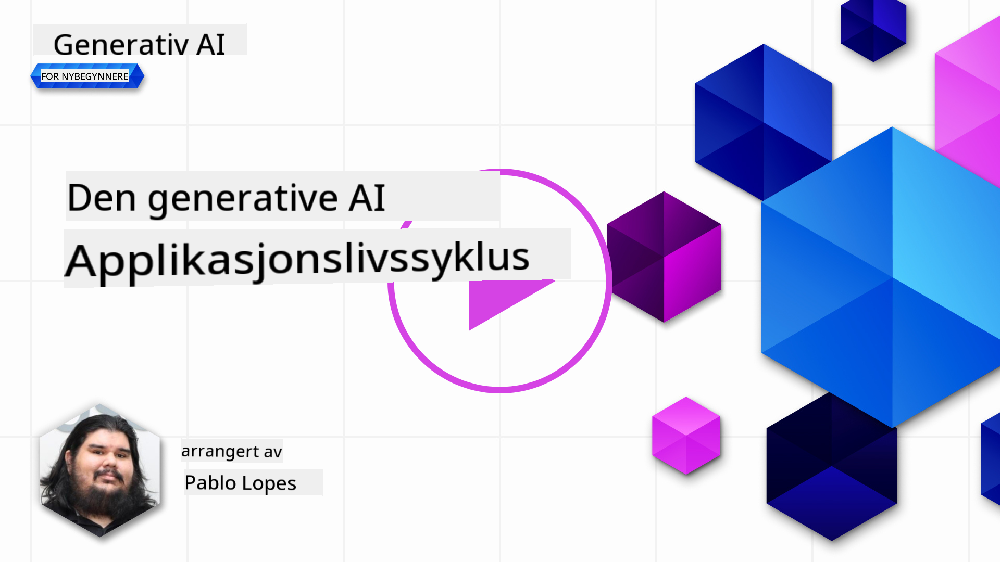
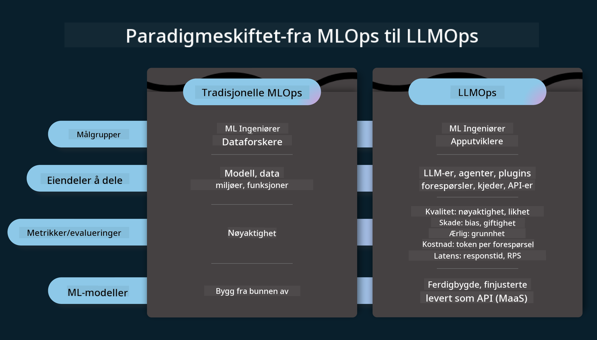
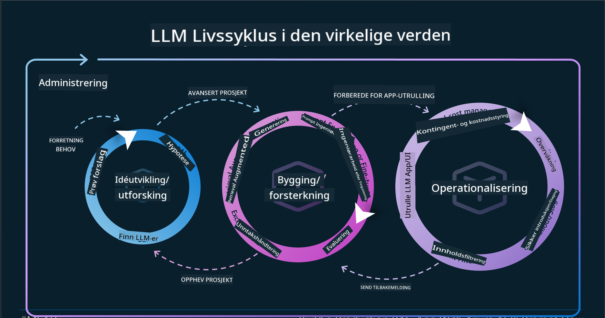
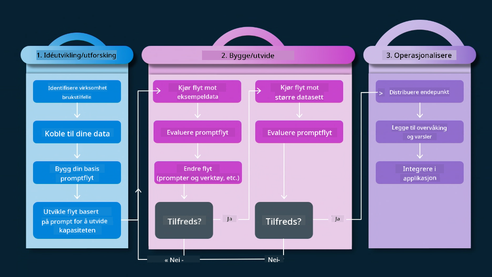
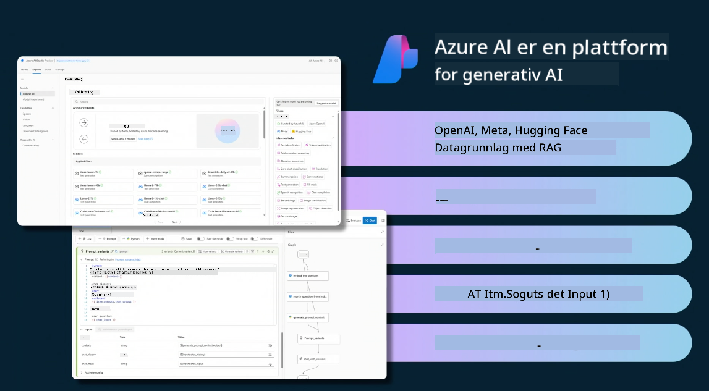
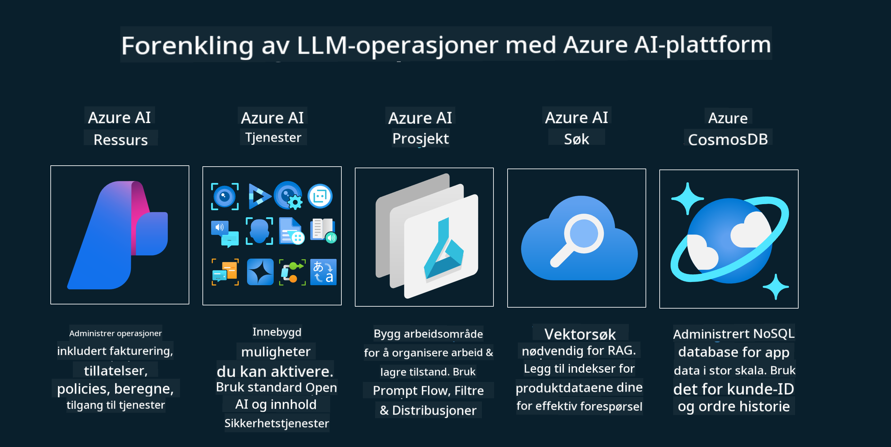
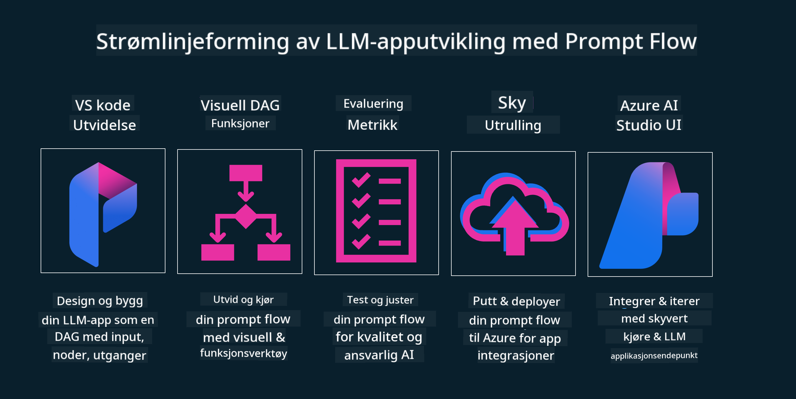

<!--
CO_OP_TRANSLATOR_METADATA:
{
  "original_hash": "27a5347a5022d5ef0a72ab029b03526a",
  "translation_date": "2025-06-25T22:05:14+00:00",
  "source_file": "14-the-generative-ai-application-lifecycle/README.md",
  "language_code": "no"
}
-->

# Livssyklusen til Generativ AI-applikasjon

Et viktig spørsmål for alle AI-applikasjoner er relevansen av AI-funksjoner, ettersom AI er et raskt utviklende felt. For å sikre at applikasjonen din forblir relevant, pålitelig og robust, må du kontinuerlig overvåke, evaluere og forbedre den. Det er her livssyklusen til generativ AI kommer inn.

Livssyklusen til generativ AI er et rammeverk som veileder deg gjennom stadiene av utvikling, distribusjon og vedlikehold av en generativ AI-applikasjon. Det hjelper deg med å definere målene dine, måle ytelsen din, identifisere utfordringene dine og implementere løsningene dine. Det hjelper deg også med å tilpasse applikasjonen din til de etiske og juridiske standardene i ditt domene og dine interessenter. Ved å følge livssyklusen til generativ AI, kan du sikre at applikasjonen din alltid gir verdi og tilfredsstiller brukerne dine.

## Introduksjon

I dette kapittelet vil du:

- Forstå paradigmeskiftet fra MLOps til LLMOps
- LLM-livssyklusen
- Verktøy for livssyklusen
- Metrikk og evaluering av livssyklusen

## Forstå paradigmeskiftet fra MLOps til LLMOps

LLM-er er et nytt verktøy i arsenalet for kunstig intelligens, de er utrolig kraftige i analyse- og genereringsoppgaver for applikasjoner. Imidlertid har denne kraften noen konsekvenser for hvordan vi effektiviserer AI- og klassiske maskinlæringsoppgaver.

Med dette trenger vi et nytt paradigme for å tilpasse dette verktøyet på en dynamisk måte, med de riktige insentivene. Vi kan kategorisere eldre AI-apper som "ML-apper" og nyere AI-apper som "GenAI-apper" eller bare "AI-apper", som gjenspeiler den vanlige teknologien og teknikkene som ble brukt på den tiden. Dette endrer vår fortelling på flere måter, se på følgende sammenligning.

Legg merke til at i LLMOps er vi mer fokusert på apputviklere, ved å bruke integrasjoner som et nøkkelpunkt, ved å bruke "Modeller-som-en-tjeneste" og tenke på følgende punkter for metrikk.

- Kvalitet: Responskvalitet
- Skade: Ansvarlig AI
- Ærlighet: Responsens grunnlag (Gir det mening? Er det korrekt?)
- Kostnad: Løsningens budsjett
- Forsinkelse: Gjennomsnittlig tid for tokenrespons

## LLM-livssyklusen

Først, for å forstå livssyklusen og modifikasjonene, la oss merke oss den neste infografikken.

Som du kanskje legger merke til, er dette forskjellig fra de vanlige livssyklusene fra MLOps. LLM-er har mange nye krav, som Prompting, forskjellige teknikker for å forbedre kvaliteten (Finjustering, RAG, Meta-Prompts), forskjellig vurdering og ansvar med ansvarlig AI, og til slutt nye evalueringsmetrikker (Kvalitet, Skade, Ærlighet, Kostnad og Forsinkelse).

For eksempel, se på hvordan vi ideer. Ved å bruke prompt engineering for å eksperimentere med ulike LLM-er for å utforske muligheter for å teste om deres hypoteser kan være korrekte.

Merk at dette ikke er lineært, men integrerte sløyfer, iterative og med en overordnet syklus.

Hvordan kan vi utforske disse trinnene? La oss gå i detalj om hvordan vi kan bygge en livssyklus.

Dette kan se litt komplisert ut, la oss fokusere på de tre store trinnene først.

1. Idéutvikling/Utforsking: Utforskning, her kan vi utforske i henhold til våre forretningsbehov. Prototyping, lage en [PromptFlow](https://microsoft.github.io/promptflow/index.html?WT.mc_id=academic-105485-koreyst) og teste om det er effektivt nok for vår hypotese.
2. Bygging/Forsterkning: Implementering, nå begynner vi å evaluere for større datasett implementere teknikker, som finjustering og RAG, for å sjekke robustheten til vår løsning. Hvis det ikke gjør det, kan re-implementering, legge til nye trinn i vår flyt eller restrukturere dataene, hjelpe. Etter å ha testet vår flyt og vår skala, hvis det fungerer og sjekker våre metrikk, er det klart for neste trinn.
3. Operasjonalisering: Integrasjon, nå legge til overvåkings- og varslingssystemer til vårt system, distribusjon og applikasjonsintegrasjon til vår applikasjon.

Deretter har vi den overordnede syklusen av ledelse, med fokus på sikkerhet, samsvar og styring.

Gratulerer, nå har du din AI-app klar til bruk og operativ. For en praktisk opplevelse, ta en titt på [Contoso Chat Demo.](https://nitya.github.io/contoso-chat/?WT.mc_id=academic-105485-koreys)

Nå, hvilke verktøy kan vi bruke?

## Verktøy for livssyklusen

For verktøy, tilbyr Microsoft [Azure AI Platform](https://azure.microsoft.com/solutions/ai/?WT.mc_id=academic-105485-koreys) og [PromptFlow](https://microsoft.github.io/promptflow/index.html?WT.mc_id=academic-105485-koreyst) for å lette og gjøre syklusen din enkel å implementere og klar til bruk.

[Azure AI Platform](https://azure.microsoft.com/solutions/ai/?WT.mc_id=academic-105485-koreys) lar deg bruke [AI Studio](https://ai.azure.com/?WT.mc_id=academic-105485-koreys). AI Studio er en nettportal som lar deg utforske modeller, eksempler og verktøy. Administrere ressursene dine, UI-utviklingsflyter og SDK/CLI-alternativer for kode-først-utvikling.

Azure AI lar deg bruke flere ressurser, for å administrere dine operasjoner, tjenester, prosjekter, vektorsøk og databasebehov.

Bygg, fra Proof-of-Concept (POC) til storskala applikasjoner med PromptFlow:

- Design og bygg apper fra VS Code, med visuelle og funksjonelle verktøy
- Test og finjuster appene dine for kvalitets-AI, med letthet.
- Bruk Azure AI Studio for å integrere og iterere med skyen, skyv og distribuer for rask integrasjon.

## Flott! Fortsett læringen din!

Fantastisk, nå lær mer om hvordan vi strukturerer en applikasjon for å bruke konseptene med [Contoso Chat App](https://nitya.github.io/contoso-chat/?WT.mc_id=academic-105485-koreyst), for å se hvordan Cloud Advocacy legger til disse konseptene i demonstrasjoner. For mer innhold, sjekk vår [Ignite breakout session!
](https://www.youtube.com/watch?v=DdOylyrTOWg)

Nå, sjekk leksjon 15, for å forstå hvordan [Retrieval Augmented Generation og Vektordatabaser](../15-rag-and-vector-databases/README.md?WT.mc_id=academic-105485-koreyst) påvirker generativ AI og for å lage mer engasjerende applikasjoner!

**Ansvarsfraskrivelse**:  
Dette dokumentet er oversatt ved hjelp av AI-oversettelsestjenesten [Co-op Translator](https://github.com/Azure/co-op-translator). Selv om vi etterstreber nøyaktighet, vennligst vær oppmerksom på at automatiserte oversettelser kan inneholde feil eller unøyaktigheter. Det originale dokumentet på sitt opprinnelige språk bør betraktes som den autoritative kilden. For kritisk informasjon anbefales profesjonell menneskelig oversettelse. Vi er ikke ansvarlige for eventuelle misforståelser eller feiltolkninger som oppstår ved bruk av denne oversettelsen.