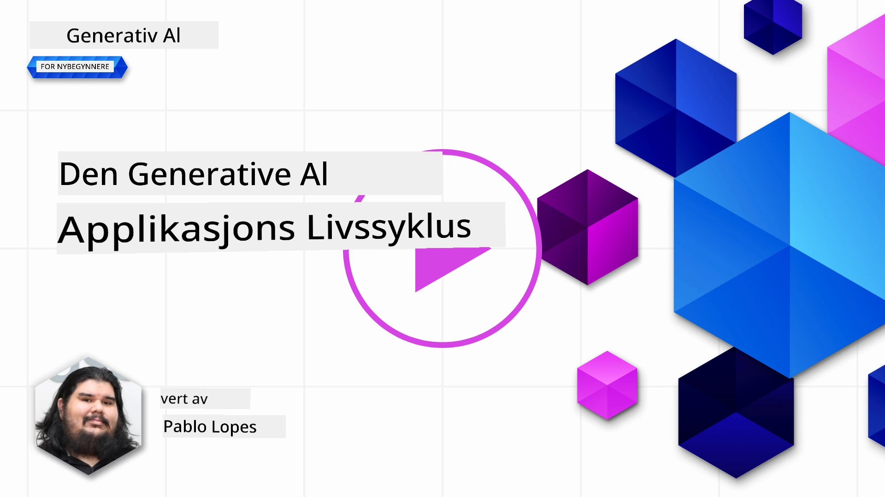
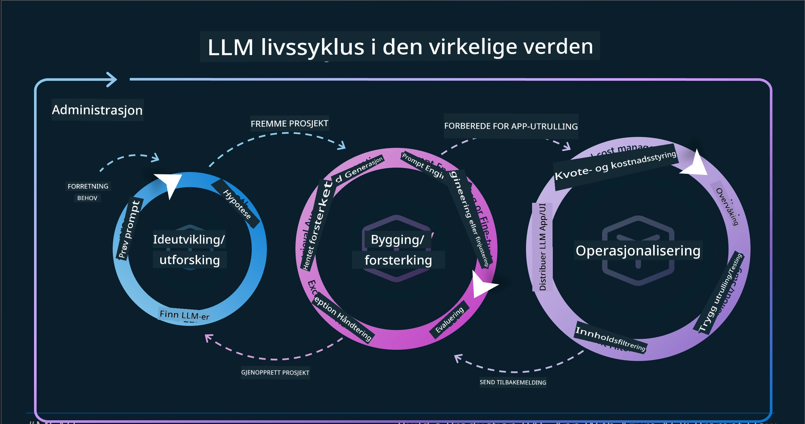
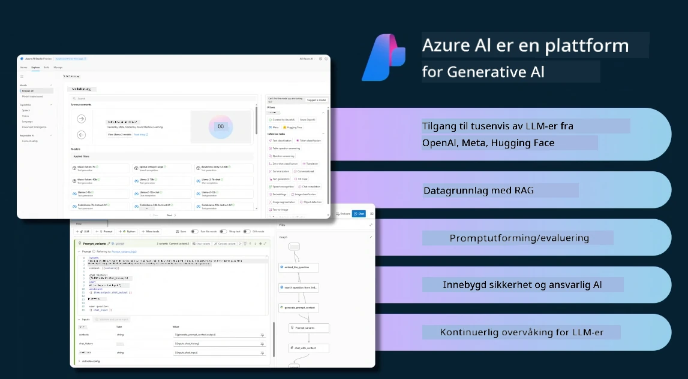
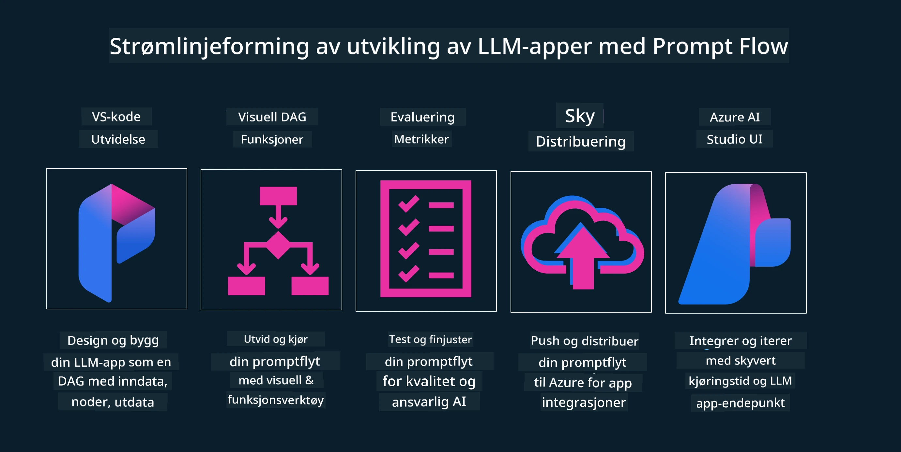

# Livssyklusen for generative AI-applikasjoner

Et viktig spørsmål for alle AI-applikasjoner er relevansen av AI-funksjoner, ettersom AI er et raskt utviklende felt. For å sikre at applikasjonen din forblir relevant, pålitelig og robust, må du overvåke, evaluere og forbedre den kontinuerlig. Dette er hvor livssyklusen for generativ AI kommer inn.

Livssyklusen for generativ AI er et rammeverk som veileder deg gjennom stadiene med å utvikle, distribuere og vedlikeholde en generativ AI-applikasjon. Det hjelper deg med å definere målene dine, måle ytelsen din, identifisere utfordringene dine og implementere løsningene dine. Det hjelper deg også med å tilpasse applikasjonen din til etiske og juridiske standarder i ditt domene og med dine interessenter. Ved å følge livssyklusen for generativ AI kan du sikre at applikasjonen din alltid leverer verdi og tilfredsstiller brukerne dine.

## Introduksjon

I dette kapitlet vil du:

- Forstå paradigmeskiftet fra MLOps til LLMOps
- LLM-livssyklusen
- Livssyklusverktøy
- Metrifisering og evaluering av livssyklusen

## Forstå paradigmeskiftet fra MLOps til LLMOps

LLM-er er et nytt verktøy i verktøykassen for kunstig intelligens, de er utrolig kraftige i analyse- og generasjonsoppgaver for applikasjoner, men denne kraften har noen konsekvenser for hvordan vi effektiviserer AI og tradisjonelle maskinlæringsoppgaver.

Med dette trenger vi et nytt paradigme for å tilpasse dette verktøyet på en dynamisk måte, med riktige insentiver. Vi kan kategorisere eldre AI-apper som "ML-apper" og nyere AI-apper som "GenAI-apper" eller bare "AI-apper", noe som reflekterer mainstream-teknologien og teknikkene brukt på den tiden. Dette skifter vårt narrativ på flere måter, se på følgende sammenligning.

Legg merke til at i LLMOps er vi mer fokusert på apputviklerne, ved å bruke integrasjoner som et nøkkelpunkt, bruke "Models-as-a-Service" og tenke på følgende punkter for metrikker.

- Kvalitet: Svar-kvalitet
- Skade: Ansvarlig AI
- Ærlighet: Begrunnelse for svar (Gir det mening? Er det korrekt?)
- Kostnad: Løsningens budsjett
- Forsinkelse: Gj.snittstid for tokensvar

## LLM-livssyklusen

Først, for å forstå livssyklusen og modifikasjonene, la oss merke oss følgende infografikk.

Som du kanskje legger merke til, er dette annerledes enn de vanlige livssykluser fra MLOps. LLM-er har mange nye krav, som prompting, forskjellige teknikker for å forbedre kvalitet (finjustering, RAG, meta-prompter), ulik vurdering og ansvar med ansvarlig AI, til slutt nye evalueringsmetrikker (kvalitet, skade, ærlighet, kostnad og forsinkelse).

For eksempel, se på hvordan vi idémyldrer. Vi bruker prompt engineering for å eksperimentere med ulike LLM-er for å utforske muligheter og teste om hypotesen deres kan være riktig.

Legg merke til at dette ikke er lineært, men integrerte løkker, iterative og med en overgripende syklus.

Hvordan kan vi utforske disse stegene? La oss gå i detalj på hvordan vi kan bygge en livssyklus.

Dette kan se litt komplisert ut, la oss fokusere på de tre store stegene først.

1. Idémyldring/Utforsking: Utforskning, her kan vi utforske i henhold til våre forretningsbehov. Prototypebygging, lage en [PromptFlow](https://microsoft.github.io/promptflow/index.html?WT.mc_id=academic-105485-koreyst) og teste om den er effektiv nok for hypotesen vår.  
1. Bygging/Utvidelse: Implementering, nå begynner vi å evaluere større datasett, implementere teknikker som finjustering og RAG for å sjekke robustheten av løsningen vår. Hvis det ikke fungerer, kan å implementere på nytt, legge til nye steg i flyten vår eller restrukturere dataene hjelpe. Etter å ha testet flyten vår og skalaen, hvis det fungerer og metrikker sjekkes, er det klart for neste steg.  
1. Operasjonalisering: Integrasjon, nå legger vi til overvåkning og varslingssystemer i systemet, distribusjon og applikasjonsintegrasjon til applikasjonen vår.  

Deretter har vi den overgripende syklusen for ledelse, med fokus på sikkerhet, overholdelse og styring.

Gratulerer, nå har du din AI-app klar til bruk og operasjonell. For en praktisk erfaring, ta en titt på [Contoso Chat Demo.](https://nitya.github.io/contoso-chat/?WT.mc_id=academic-105485-koreyst)

Nå, hvilke verktøy kan vi bruke?

## Livssyklusverktøy

For verktøy tilbyr Microsoft [Azure AI Platform](https://azure.microsoft.com/solutions/ai/?WT.mc_id=academic-105485-koreyst) og [PromptFlow](https://microsoft.github.io/promptflow/index.html?WT.mc_id=academic-105485-koreyst) som gjør syklusen din enkel å implementere og klar til bruk.

[Azure AI Platform](https://azure.microsoft.com/solutions/ai/?WT.mc_id=academic-105485-koreyst) lar deg bruke [AI Studio](https://ai.azure.com/?WT.mc_id=academic-105485-koreyst). AI Studio er en nettportal som lar deg utforske modeller, eksempler og verktøy. Styrer ressursene dine, UI-utviklingsflyter og SDK/CLI-alternativer for kode-først utvikling.

Azure AI lar deg bruke flere ressurser for å håndtere operasjoner, tjenester, prosjekter, vektorsøk og databaser.

Bygg, fra Proof-of-Concept (POC) til applikasjoner i stor skala med PromptFlow:

- Design og bygg apper fra VS Code, med visuelle og funksjonelle verktøy  
- Test og finjuster appene dine for kvalitets-AI, enkelt.  
- Bruk Azure AI Studio for å integrere og iterere i skyen, pushe og distribuere for rask integrasjon.

## Flott! Fortsett læringen din!

Fantastisk, lær nå mer om hvordan vi strukturerer en applikasjon for å bruke konseptene med [Contoso Chat App](https://nitya.github.io/contoso-chat/?WT.mc_id=academic-105485-koreyst), for å se hvordan Cloud Advocacy legger til disse konseptene i demonstrasjoner. For mer innhold, sjekk ut vår [Ignite breakout session!](https://www.youtube.com/watch?v=DdOylyrTOWg)

Nå, sjekk ut leksjon 15, for å forstå hvordan [Retrieval Augmented Generation og vektordatabaser](../15-rag-and-vector-databases/README.md?WT.mc_id=academic-105485-koreyst) påvirker Generativ AI og gjør applikasjoner mer engasjerende!

---

<!-- CO-OP TRANSLATOR DISCLAIMER START -->
**Ansvarsfraskrivelse**:
Dette dokumentet er oversatt ved hjelp av AI-oversettelsestjenesten [Co-op Translator](https://github.com/Azure/co-op-translator). Selv om vi streber etter nøyaktighet, vennligst vær oppmerksom på at automatiserte oversettelser kan inneholde feil eller unøyaktigheter. Det originale dokumentet på originalspråket bør betraktes som den autoritative kilden. For kritisk informasjon anbefales profesjonell menneskelig oversettelse. Vi er ikke ansvarlige for eventuelle misforståelser eller feiltolkninger som oppstår ved bruk av denne oversettelsen.
<!-- CO-OP TRANSLATOR DISCLAIMER END -->