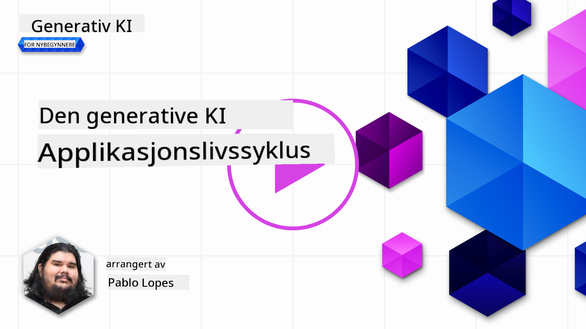
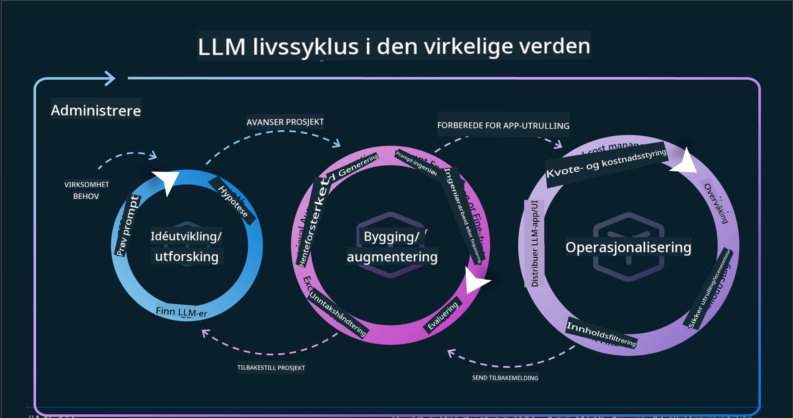
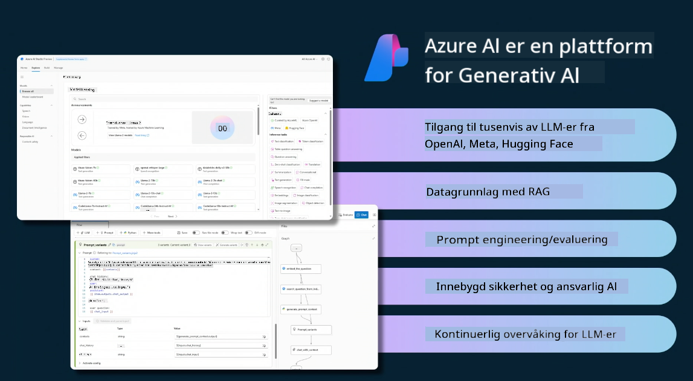
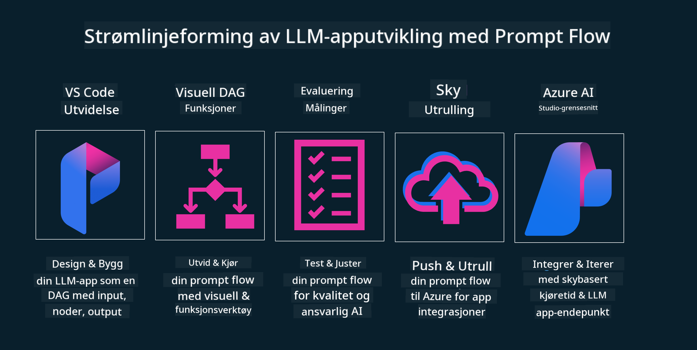

<!--
CO_OP_TRANSLATOR_METADATA:
{
  "original_hash": "b9d32511b27373a1b21b5789d4fda057",
  "translation_date": "2025-10-17T19:23:01+00:00",
  "source_file": "14-the-generative-ai-application-lifecycle/README.md",
  "language_code": "no"
}
-->

# Livssyklusen for generativ AI-applikasjon

Et viktig spørsmål for alle AI-applikasjoner er relevansen av AI-funksjoner, ettersom AI er et felt i rask utvikling. For å sikre at applikasjonen din forblir relevant, pålitelig og robust, må du kontinuerlig overvåke, evaluere og forbedre den. Det er her livssyklusen for generativ AI kommer inn.

Livssyklusen for generativ AI er et rammeverk som veileder deg gjennom stadiene av utvikling, utrulling og vedlikehold av en generativ AI-applikasjon. Det hjelper deg med å definere målene dine, måle ytelsen din, identifisere utfordringene dine og implementere løsningene dine. Det hjelper deg også med å tilpasse applikasjonen din til de etiske og juridiske standardene i ditt domene og dine interessenter. Ved å følge livssyklusen for generativ AI kan du sikre at applikasjonen din alltid leverer verdi og tilfredsstiller brukerne dine.

## Introduksjon

I dette kapittelet vil du:

- Forstå paradigmeskiftet fra MLOps til LLMOps
- LLM-livssyklusen
- Verktøy for livssyklusen
- Metrikk og evaluering av livssyklusen

## Forstå paradigmeskiftet fra MLOps til LLMOps

LLM-er er et nytt verktøy i arsenalet for kunstig intelligens. De er utrolig kraftige når det gjelder analyse- og genereringsoppgaver for applikasjoner, men denne kraften har noen konsekvenser for hvordan vi effektiviserer AI- og klassiske maskinlæringsoppgaver.

Med dette trenger vi et nytt paradigme for å tilpasse dette verktøyet på en dynamisk måte, med riktige insentiver. Vi kan kategorisere eldre AI-applikasjoner som "ML-applikasjoner" og nyere AI-applikasjoner som "GenAI-applikasjoner" eller bare "AI-applikasjoner", som reflekterer den dominerende teknologien og teknikkene som ble brukt på den tiden. Dette endrer vår fortelling på flere måter. Se følgende sammenligning.

Legg merke til at i LLMOps fokuserer vi mer på applikasjonsutviklere, bruker integrasjoner som et nøkkelpunkt, bruker "Models-as-a-Service" og tenker på følgende punkter for metrikker:

- Kvalitet: Responskvalitet
- Skade: Ansvarlig AI
- Ærlighet: Responsens grunnlag (Gir det mening? Er det korrekt?)
- Kostnad: Budsjett for løsningen
- Forsinkelse: Gjennomsnittlig tid for tokenrespons

## LLM-livssyklusen

For å forstå livssyklusen og modifikasjonene, la oss se på følgende infografikk.

Som du kanskje legger merke til, er dette forskjellig fra de vanlige livssyklusene fra MLOps. LLM-er har mange nye krav, som prompting, ulike teknikker for å forbedre kvaliteten (Fine-Tuning, RAG, Meta-Prompts), ulike vurderinger og ansvar med ansvarlig AI, og til slutt nye evalueringsmetrikker (Kvalitet, Skade, Ærlighet, Kostnad og Forsinkelse).

For eksempel, se på hvordan vi ideer. Ved å bruke prompt engineering for å eksperimentere med ulike LLM-er for å utforske muligheter og teste om hypotesene deres kan være korrekte.

Merk at dette ikke er lineært, men integrerte løkker, iterativt og med en overordnet syklus.

Hvordan kan vi utforske disse trinnene? La oss gå inn i detaljene om hvordan vi kan bygge en livssyklus.

Dette kan se litt komplisert ut, la oss fokusere på de tre store trinnene først.

1. Ideere/Utforske: Utforskning, her kan vi utforske i henhold til våre forretningsbehov. Prototyping, opprette en [PromptFlow](https://microsoft.github.io/promptflow/index.html?WT.mc_id=academic-105485-koreyst) og teste om det er effektivt nok for vår hypotese.
2. Bygge/Forbedre: Implementering, nå begynner vi å evaluere for større datasett, implementere teknikker som Fine-Tuning og RAG for å sjekke robustheten til løsningen vår. Hvis det ikke fungerer, kan det hjelpe å re-implementere det, legge til nye trinn i flyten vår eller omstrukturere dataene. Etter å ha testet flyten vår og skalaen vår, hvis det fungerer og vi sjekker metrikken vår, er det klart for neste trinn.
3. Operasjonalisere: Integrasjon, nå legger vi til overvåkings- og varslingssystemer til systemet vårt, distribusjon og applikasjonsintegrasjon til applikasjonen vår.

Deretter har vi den overordnede syklusen for administrasjon, med fokus på sikkerhet, samsvar og styring.

Gratulerer, nå er AI-applikasjonen din klar til bruk og operativ. For en praktisk opplevelse, ta en titt på [Contoso Chat Demo.](https://nitya.github.io/contoso-chat/?WT.mc_id=academic-105485-koreys)

Nå, hvilke verktøy kan vi bruke?

## Verktøy for livssyklusen

For verktøy tilbyr Microsoft [Azure AI Platform](https://azure.microsoft.com/solutions/ai/?WT.mc_id=academic-105485-koreys) og [PromptFlow](https://microsoft.github.io/promptflow/index.html?WT.mc_id=academic-105485-koreyst) for å gjøre livssyklusen enkel å implementere og klar til bruk.

[Azure AI Platform](https://azure.microsoft.com/solutions/ai/?WT.mc_id=academic-105485-koreys) lar deg bruke [AI Studio](https://ai.azure.com/?WT.mc_id=academic-105485-koreys). AI Studio er en nettportal som lar deg utforske modeller, eksempler og verktøy. Administrere ressursene dine, UI-utviklingsflyter og SDK/CLI-alternativer for kode-først-utvikling.

Azure AI lar deg bruke flere ressurser for å administrere operasjoner, tjenester, prosjekter, vektorsøk og databasebehov.

Bygg fra Proof-of-Concept (POC) til storskala applikasjoner med PromptFlow:

- Design og bygg applikasjoner fra VS Code, med visuelle og funksjonelle verktøy
- Test og finjuster applikasjonene dine for kvalitets-AI, enkelt.
- Bruk Azure AI Studio til å integrere og iterere med skyen, push og deploy for rask integrasjon.

## Flott! Fortsett læringen din!

Fantastisk, nå kan du lære mer om hvordan vi strukturerer en applikasjon for å bruke konseptene med [Contoso Chat App](https://nitya.github.io/contoso-chat/?WT.mc_id=academic-105485-koreyst), for å se hvordan Cloud Advocacy legger til disse konseptene i demonstrasjoner. For mer innhold, sjekk vår [Ignite breakout session!
](https://www.youtube.com/watch?v=DdOylyrTOWg)

Nå, sjekk leksjon 15 for å forstå hvordan [Retrieval Augmented Generation og vektordatabaser](../15-rag-and-vector-databases/README.md?WT.mc_id=academic-105485-koreyst) påvirker generativ AI og skaper mer engasjerende applikasjoner!

---

**Ansvarsfraskrivelse**:  
Dette dokumentet er oversatt ved hjelp av AI-oversettelsestjenesten [Co-op Translator](https://github.com/Azure/co-op-translator). Selv om vi tilstreber nøyaktighet, vær oppmerksom på at automatiserte oversettelser kan inneholde feil eller unøyaktigheter. Det originale dokumentet på dets opprinnelige språk bør anses som den autoritative kilden. For kritisk informasjon anbefales profesjonell menneskelig oversettelse. Vi er ikke ansvarlige for eventuelle misforståelser eller feiltolkninger som oppstår ved bruk av denne oversettelsen.