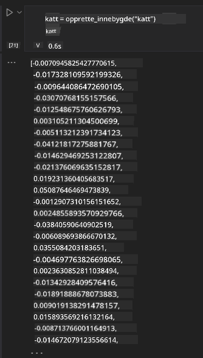

<!--
CO_OP_TRANSLATOR_METADATA:
{
  "original_hash": "e2861bbca91c0567ef32bc77fe054f9e",
  "translation_date": "2025-05-20T01:33:41+00:00",
  "source_file": "15-rag-and-vector-databases/README.md",
  "language_code": "no"
}
-->
# Henteforsterket generering (RAG) og vektordatabaser

I leksjonen om søkeapplikasjoner lærte vi kort hvordan du kan integrere dine egne data i store språkmodeller (LLMs). I denne leksjonen vil vi gå dypere inn i konseptene om å forankre dataene dine i LLM-applikasjonen din, mekanikken i prosessen og metodene for å lagre data, inkludert både innebygde elementer og tekst.

> **Video kommer snart**

## Introduksjon

I denne leksjonen vil vi dekke følgende:

- En introduksjon til RAG, hva det er og hvorfor det brukes i kunstig intelligens (AI).

- Forstå hva vektordatabaser er og lage en for vår applikasjon.

- Et praktisk eksempel på hvordan du integrerer RAG i en applikasjon.

## Læringsmål

Etter å ha fullført denne leksjonen, vil du kunne:

- Forklare betydningen av RAG i datainnhenting og behandling.

- Sette opp RAG-applikasjonen og forankre dataene dine til en LLM.

- Effektiv integrasjon av RAG og vektordatabaser i LLM-applikasjoner.

## Vårt scenario: forbedre våre LLM-er med våre egne data

For denne leksjonen ønsker vi å legge til våre egne notater i oppstarten av utdanning, som lar chatboten få mer informasjon om de forskjellige emnene. Ved å bruke notatene vi har, vil lærende kunne studere bedre og forstå de forskjellige temaene, noe som gjør det lettere å forberede seg til eksamenene sine. For å lage vårt scenario, vil vi bruke:

- `Azure OpenAI:` LLM vi vil bruke til å lage vår chatbot

- `AI for beginners' lesson on Neural Networks`: dette vil være dataene vi forankrer vår LLM på

- `Azure AI Search` og `Azure Cosmos DB:` vektordatabase for å lagre våre data og lage et søkeindeks

Brukere vil kunne lage praksisquizer fra sine notater, revisjonskort og oppsummere dem til konsise oversikter. For å komme i gang, la oss se på hva RAG er og hvordan det fungerer:

## Henteforsterket generering (RAG)

En LLM-drevet chatbot behandler brukerens forespørsler for å generere svar. Den er designet for å være interaktiv og engasjerer seg med brukere om et bredt spekter av emner. Imidlertid er svarene begrenset til konteksten som gis og dens grunnleggende treningsdata. For eksempel er GPT-4s kunnskapsavgrensning september 2021, noe som betyr at den mangler kunnskap om hendelser som har skjedd etter denne perioden. I tillegg utelukker dataene som brukes til å trene LLM-er konfidensiell informasjon som personlige notater eller en bedrifts produktmanual.

### Hvordan RAGs (Henteforsterket generering) fungerer

Anta at du vil distribuere en chatbot som lager quizer fra notatene dine, du vil kreve en tilkobling til kunnskapsbasen. Dette er hvor RAG kommer til unnsetning. RAGs opererer som følger:

- **Kunnskapsbase:** Før innhenting må disse dokumentene bli inntatt og forhåndsbehandlet, vanligvis ved å bryte ned store dokumenter i mindre deler, transformere dem til tekstinnbygging og lagre dem i en database.

- **Brukerforespørsel:** brukeren stiller et spørsmål

- **Innhenting:** Når en bruker stiller et spørsmål, henter innebyggingsmodellen relevant informasjon fra vår kunnskapsbase for å gi mer kontekst som vil bli innlemmet i forespørselen.

- **Forsterket generering:** LLM forbedrer sitt svar basert på de innhentede dataene. Det lar det genererte svaret være basert ikke bare på forhåndstrente data, men også relevant informasjon fra den tilførte konteksten. De innhentede dataene brukes til å forsterke LLMs svar. LLM returnerer deretter et svar på brukerens spørsmål.

Arkitekturen for RAGs implementeres ved bruk av transformatorer bestående av to deler: en koder og en dekoder. For eksempel, når en bruker stiller et spørsmål, blir inputteksten 'kodet' inn i vektorer som fanger betydningen av ord, og vektorene blir 'dekodet' inn i vårt dokumentindeks og genererer ny tekst basert på brukerens forespørsel. LLM bruker både en koder-dekoder-modell for å generere output.

To tilnærminger ved implementering av RAG ifølge det foreslåtte papiret: [Retrieval-Augmented Generation for Knowledge intensive NLP (natural language processing software) Tasks](https://arxiv.org/pdf/2005.11401.pdf?WT.mc_id=academic-105485-koreyst) er:

- **_RAG-Sequence_** bruker innhentede dokumenter for å forutsi det beste mulige svaret på en brukerforespørsel

- **RAG-Token** bruker dokumenter til å generere neste token, deretter innhenter dem for å svare på brukerens forespørsel

### Hvorfor ville du bruke RAGs? 

- **Informasjonsrikhet:** sikrer at tekstsvar er oppdaterte og aktuelle. Det forbedrer derfor ytelsen på domene-spesifikke oppgaver ved å få tilgang til den interne kunnskapsbasen.

- Reduserer fabrikasjon ved å bruke **verifiserbare data** i kunnskapsbasen for å gi kontekst til brukerens forespørsler.

- Det er **kostnadseffektivt** da de er mer økonomiske sammenlignet med finjustering av en LLM.

## Lage en kunnskapsbase

Vår applikasjon er basert på våre personlige data, dvs. leksjonen om nevrale nettverk i AI for nybegynnere læreplanen.

### Vektordatabaser

En vektordatabase, i motsetning til tradisjonelle databaser, er en spesialisert database designet for å lagre, administrere og søke innebygde vektorer. Den lagrer numeriske representasjoner av dokumenter. Å bryte ned data til numeriske innebygginger gjør det lettere for vårt AI-system å forstå og behandle dataene.

Vi lagrer våre innebygginger i vektordatabaser ettersom LLM-er har en grense for antall tokens de aksepterer som input. Ettersom du ikke kan sende hele innebyggingene til en LLM, vil vi trenge å bryte dem ned i deler, og når en bruker stiller et spørsmål, vil innebyggingene som ligner mest på spørsmålet bli returnert sammen med forespørselen. Å dele opp reduserer også kostnadene for antall tokens som sendes gjennom en LLM.

Noen populære vektordatabaser inkluderer Azure Cosmos DB, Clarifyai, Pinecone, Chromadb, ScaNN, Qdrant og DeepLake. Du kan lage en Azure Cosmos DB-modell ved hjelp av Azure CLI med følgende kommando:

```bash
az login
az group create -n <resource-group-name> -l <location>
az cosmosdb create -n <cosmos-db-name> -r <resource-group-name>
az cosmosdb list-keys -n <cosmos-db-name> -g <resource-group-name>
```

### Fra tekst til innebygginger

Før vi lagrer våre data, må vi konvertere dem til vektorinnebygginger før de lagres i databasen. Hvis du arbeider med store dokumenter eller lange tekster, kan du dele dem opp basert på forespørsler du forventer. Oppdeling kan gjøres på setningsnivå eller på avsnittsnivå. Ettersom oppdeling utleder betydninger fra ordene rundt dem, kan du legge til litt annen kontekst til en del, for eksempel ved å legge til dokumenttittelen eller inkludere noe tekst før eller etter delen. Du kan dele opp dataene som følger:

```python
def split_text(text, max_length, min_length):
    words = text.split()
    chunks = []
    current_chunk = []

    for word in words:
        current_chunk.append(word)
        if len(' '.join(current_chunk)) < max_length and len(' '.join(current_chunk)) > min_length:
            chunks.append(' '.join(current_chunk))
            current_chunk = []

    # If the last chunk didn't reach the minimum length, add it anyway
    if current_chunk:
        chunks.append(' '.join(current_chunk))

    return chunks
```

Når de er delt opp, kan vi deretter bygge inn teksten vår ved hjelp av forskjellige innebyggingsmodeller. Noen modeller du kan bruke inkluderer: word2vec, ada-002 av OpenAI, Azure Computer Vision og mange flere. Valg av modell å bruke vil avhenge av språkene du bruker, typen innhold som kodes (tekst/bilder/lyd), størrelsen på input det kan kode og lengden på innebyggingsoutputen.

Et eksempel på innebygd tekst ved bruk av OpenAIs `text-embedding-ada-002`-modell er:


## Innhenting og vektorsøk

Når en bruker stiller et spørsmål, transformerer innhenteren det til en vektor ved hjelp av forespørselskoderen, den søker deretter gjennom vårt dokumentindeks for relevante vektorer i dokumentet som er relatert til input. Når det er gjort, konverterer det både inputvektoren og dokumentvektorene til tekst og sender det gjennom LLM.

### Innhenting

Innhenting skjer når systemet prøver å raskt finne dokumentene fra indeksen som tilfredsstiller søkekriteriene. Målet med innhenteren er å få dokumenter som vil bli brukt til å gi kontekst og forankre LLM på dine data.

Det er flere måter å utføre søk innen vår database på, som:

- **Nøkkelordssøk** - brukt for tekstsøk

- **Semantisk søk** - bruker den semantiske betydningen av ord

- **Vektorsøk** - konverterer dokumenter fra tekst til vektorrepresentasjoner ved bruk av innebyggingsmodeller. Innhenting vil bli gjort ved å spørre dokumentene hvis vektorrepresentasjoner er nærmest brukerens spørsmål.

- **Hybrid** - en kombinasjon av både nøkkelord og vektorsøk.

En utfordring med innhenting kommer når det ikke er noe lignende svar på forespørselen i databasen, systemet vil da returnere den beste informasjonen de kan få, men du kan bruke taktikker som å sette opp maksimal avstand for relevans eller bruke hybrid søk som kombinerer både nøkkelord og vektorsøk. I denne leksjonen vil vi bruke hybrid søk, en kombinasjon av både vektor- og nøkkelordssøk. Vi vil lagre våre data i en dataramme med kolonner som inneholder delene samt innebyggingene.

### Vektorlignhet

Innhenteren vil søke gjennom kunnskapsdatabasen for innebygginger som er nær hverandre, de nærmeste naboene, ettersom de er tekster som er like. I scenarioet hvor en bruker stiller en forespørsel, blir den først innebygd og deretter matchet med lignende innebygginger. Det vanlige målet som brukes for å finne hvor like forskjellige vektorer er, er cosinuslikhet som er basert på vinkelen mellom to vektorer.

Vi kan måle likhet ved å bruke andre alternativer som vi kan bruke, som euklidisk avstand, som er den rette linjen mellom vektorendepunkter, og prikkprodukt, som måler summen av produktene av tilsvarende elementer av to vektorer.

### Søkeindeks

Når du gjør innhenting, vil vi trenge å bygge en søkeindeks for vår kunnskapsbase før vi utfører søk. En indeks vil lagre våre innebygginger og kan raskt hente de mest like delene selv i en stor database. Vi kan lage vår indeks lokalt ved å bruke:

```python
from sklearn.neighbors import NearestNeighbors

embeddings = flattened_df['embeddings'].to_list()

# Create the search index
nbrs = NearestNeighbors(n_neighbors=5, algorithm='ball_tree').fit(embeddings)

# To query the index, you can use the kneighbors method
distances, indices = nbrs.kneighbors(embeddings)
```

### Re-rangering

Når du har spurt databasen, kan det være nødvendig å sortere resultatene fra de mest relevante. En re-rangerings LLM bruker maskinlæring for å forbedre relevansen av søkeresultater ved å ordne dem fra de mest relevante. Ved å bruke Azure AI Search, gjøres re-rangering automatisk for deg ved å bruke en semantisk re-rangerer. Et eksempel på hvordan re-rangering fungerer ved bruk av nærmeste naboer:

```python
# Find the most similar documents
distances, indices = nbrs.kneighbors([query_vector])

index = []
# Print the most similar documents
for i in range(3):
    index = indices[0][i]
    for index in indices[0]:
        print(flattened_df['chunks'].iloc[index])
        print(flattened_df['path'].iloc[index])
        print(flattened_df['distances'].iloc[index])
    else:
        print(f"Index {index} not found in DataFrame")
```

## Å samle alt sammen

Det siste trinnet er å legge til vår LLM i miksen for å kunne få svar som er forankret på våre data. Vi kan implementere det som følger:

```python
user_input = "what is a perceptron?"

def chatbot(user_input):
    # Convert the question to a query vector
    query_vector = create_embeddings(user_input)

    # Find the most similar documents
    distances, indices = nbrs.kneighbors([query_vector])

    # add documents to query  to provide context
    history = []
    for index in indices[0]:
        history.append(flattened_df['chunks'].iloc[index])

    # combine the history and the user input
    history.append(user_input)

    # create a message object
    messages=[
        {"role": "system", "content": "You are an AI assistant that helps with AI questions."},
        {"role": "user", "content": history[-1]}
    ]

    # use chat completion to generate a response
    response = openai.chat.completions.create(
        model="gpt-4",
        temperature=0.7,
        max_tokens=800,
        messages=messages
    )

    return response.choices[0].message

chatbot(user_input)
```

## Evaluering av vår applikasjon

### Evalueringsmetrikker

- Kvaliteten på svarene som leveres, sikrer at det høres naturlig, flytende og menneskelig ut.

- Forankring av dataene: evaluering av om svaret kom fra de leverte dokumentene.

- Relevans: evaluering av om svaret matcher og er relatert til spørsmålet som ble stilt.

- Flyt - om svaret gir mening grammatisk.

## Brukstilfeller for bruk av RAG (Henteforsterket generering) og vektordatabaser

Det er mange forskjellige brukstilfeller der funksjonskall kan forbedre appen din, for eksempel:

- Spørsmål og svar: forankre dine bedriftsdata til en chat som kan brukes av ansatte til å stille spørsmål.

- Anbefalingssystemer: hvor du kan lage et system som matcher de mest like verdiene, f.eks. filmer, restauranter og mange flere.

- Chatbot-tjenester: du kan lagre chat-historikk og tilpasse samtalen basert på brukerens data.

- Bildesøk basert på vektorinnebygginger, nyttig når du gjør bilderegistrering og avviksdeteksjon.

## Oppsummering

Vi har dekket de grunnleggende områdene av RAG fra å legge til våre data til applikasjonen, brukerens forespørsel og output. For å forenkle opprettelsen av RAG kan du bruke rammeverk som Semanti Kernel, Langchain eller Autogen.

## Oppgave

For å fortsette læringen din om Henteforsterket generering (RAG) kan du bygge:

- Bygg en front-end for applikasjonen ved hjelp av rammeverket du velger.

- Bruk et rammeverk, enten LangChain eller Semantic Kernel, og gjenskap applikasjonen din.

Gratulerer med å ha fullført leksjonen 👏.

## Læring stopper ikke her, fortsett reisen

Etter å ha fullført denne leksjonen, sjekk ut vår [Generative AI Learning collection](https://aka.ms/genai-collection?WT.mc_id=academic-105485-koreyst) for å fortsette å øke din kunnskap om generativ AI!

**Ansvarsfraskrivelse**:  
Dette dokumentet har blitt oversatt ved hjelp av AI-oversettelsestjenesten [Co-op Translator](https://github.com/Azure/co-op-translator). Selv om vi streber etter nøyaktighet, vær oppmerksom på at automatiserte oversettelser kan inneholde feil eller unøyaktigheter. Det originale dokumentet på sitt opprinnelige språk bør betraktes som den autoritative kilden. For kritisk informasjon anbefales profesjonell menneskelig oversettelse. Vi er ikke ansvarlige for eventuelle misforståelser eller feiltolkninger som oppstår ved bruk av denne oversettelsen.