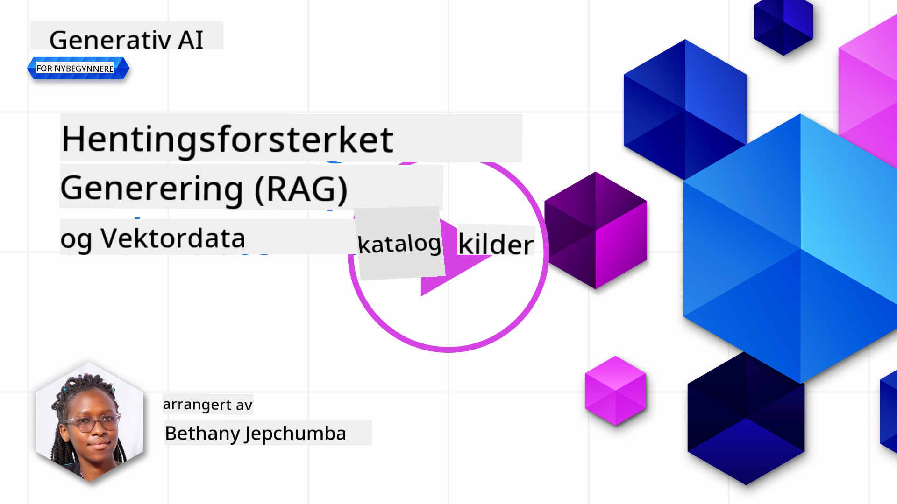
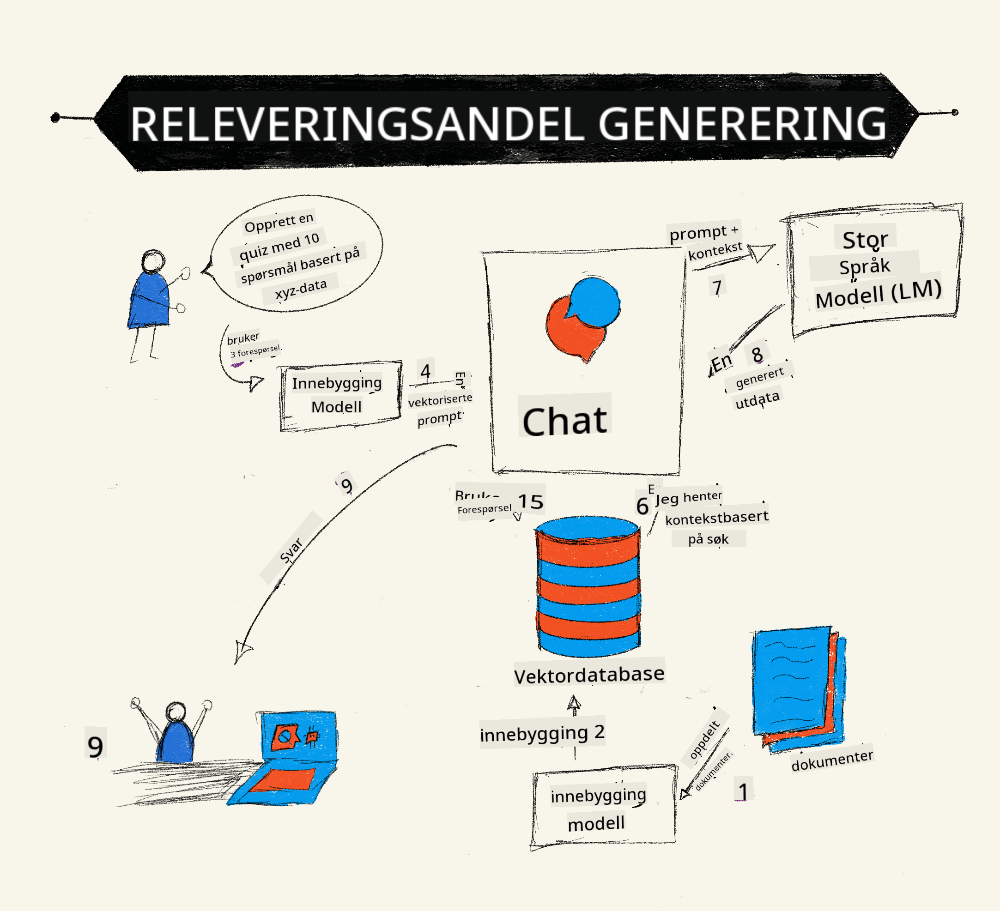
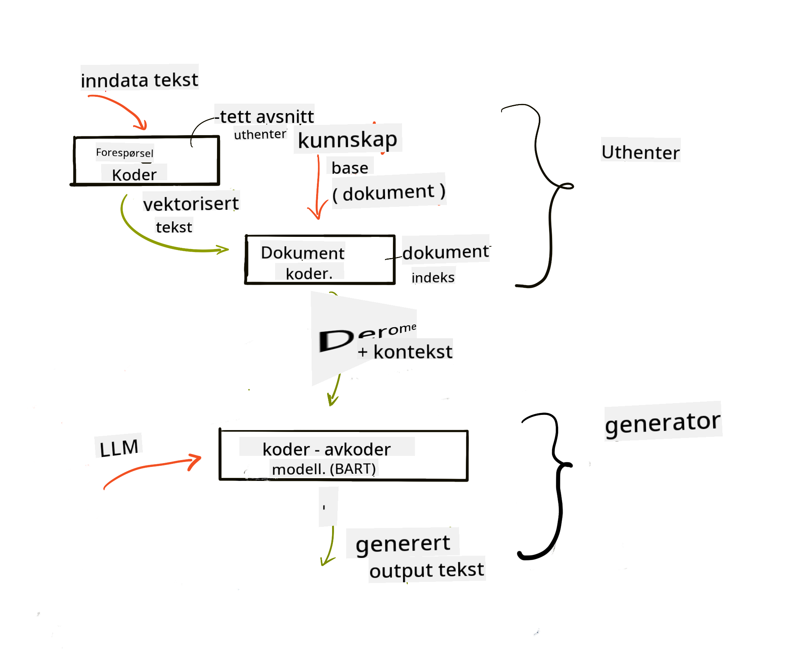
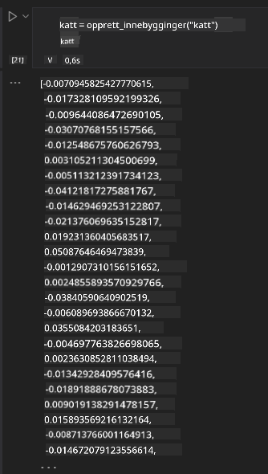

<!--
CO_OP_TRANSLATOR_METADATA:
{
  "original_hash": "e2861bbca91c0567ef32bc77fe054f9e",
  "translation_date": "2025-07-09T16:14:30+00:00",
  "source_file": "15-rag-and-vector-databases/README.md",
  "language_code": "no"
}
-->
# Retrieval Augmented Generation (RAG) og vektordatabaser

[](https://aka.ms/gen-ai-lesson15-gh?WT.mc_id=academic-105485-koreyst)

I leksjonen om søkeapplikasjoner lærte vi kort hvordan du kan integrere dine egne data i store språkmodeller (LLMs). I denne leksjonen skal vi gå dypere inn i konseptene rundt å forankre data i LLM-applikasjonen din, mekanismene i prosessen og metodene for lagring av data, inkludert både embeddings og tekst.

> **Video kommer snart**

## Introduksjon

I denne leksjonen vil vi dekke følgende:

- En introduksjon til RAG, hva det er og hvorfor det brukes i AI (kunstig intelligens).

- Forstå hva vektordatabaser er og hvordan man oppretter en for applikasjonen vår.

- Et praktisk eksempel på hvordan man integrerer RAG i en applikasjon.

## Læringsmål

Etter å ha fullført denne leksjonen vil du kunne:

- Forklare betydningen av RAG i datahenting og -behandling.

- Sette opp en RAG-applikasjon og forankre dataene dine til en LLM.

- Effektiv integrering av RAG og vektordatabaser i LLM-applikasjoner.

## Vårt scenario: forbedre LLM-ene våre med egne data

I denne leksjonen ønsker vi å legge til egne notater i utdanningsstartuppen, slik at chatboten kan få mer informasjon om ulike fagområder. Ved å bruke notatene vi har, vil elever kunne studere bedre og forstå de forskjellige temaene, noe som gjør det enklere å repetere til eksamen. For å lage vårt scenario vil vi bruke:

- `Azure OpenAI:` LLM-en vi bruker for å lage chatboten vår

- `AI for beginners' lesson on Neural Networks:` dette blir dataene vi forankrer LLM-en vår på

- `Azure AI Search` og `Azure Cosmos DB:` vektordatabaser for å lagre dataene våre og opprette en søkeindeks

Brukere vil kunne lage øvingsquizzer basert på notatene sine, repetisjonsflashcards og oppsummere dem til korte oversikter. For å komme i gang, la oss se på hva RAG er og hvordan det fungerer:

## Retrieval Augmented Generation (RAG)

En LLM-drevet chatbot behandler brukerforespørsler for å generere svar. Den er designet for å være interaktiv og engasjere brukere i et bredt spekter av temaer. Likevel er svarene begrenset til konteksten som gis og den grunnleggende treningsdataen. For eksempel har GPT-4 kunnskapsavgrensning i september 2021, noe som betyr at den mangler kunnskap om hendelser som har skjedd etter dette tidspunktet. I tillegg ekskluderer treningsdataene for LLM-er konfidensiell informasjon som personlige notater eller en bedrifts produktmanual.

### Hvordan RAG (Retrieval Augmented Generation) fungerer



Anta at du ønsker å lansere en chatbot som lager quizzer basert på notatene dine, da trenger du en kobling til kunnskapsbasen. Det er her RAG kommer inn. RAG fungerer slik:

- **Kunnskapsbase:** Før henting må dokumentene importeres og forhåndsbehandles, vanligvis ved å dele opp store dokumenter i mindre biter, konvertere dem til tekst-embedding og lagre dem i en database.

- **Brukerspørsmål:** brukeren stiller et spørsmål

- **Henting:** Når en bruker stiller et spørsmål, henter embedding-modellen relevant informasjon fra kunnskapsbasen for å gi mer kontekst som inkluderes i prompten.

- **Forsterket generering:** LLM-en forbedrer svaret sitt basert på de hentede dataene. Dette gjør at svaret ikke bare baseres på forhåndstrent data, men også på relevant informasjon fra den ekstra konteksten. De hentede dataene brukes til å forsterke LLM-ens svar. LLM-en returnerer deretter et svar på brukerens spørsmål.



Arkitekturen for RAG implementeres ved hjelp av transformere som består av to deler: en encoder og en decoder. For eksempel, når en bruker stiller et spørsmål, blir inndata-teksten "kodet" til vektorer som fanger meningen i ordene, og vektorene "dekodes" til dokumentindeksen vår og genererer ny tekst basert på brukerens spørsmål. LLM-en bruker både en encoder-decoder-modell for å generere output.

To tilnærminger ved implementering av RAG ifølge den foreslåtte artikkelen: [Retrieval-Augmented Generation for Knowledge intensive NLP (natural language processing software) Tasks](https://arxiv.org/pdf/2005.11401.pdf?WT.mc_id=academic-105485-koreyst) er:

- **_RAG-Sequence_** som bruker hentede dokumenter for å forutsi det beste mulige svaret på et brukerforespørsel

- **RAG-Token** som bruker dokumenter for å generere neste token, og deretter hente dem for å svare på brukerens spørsmål

### Hvorfor bruke RAG?

- **Informasjonsrikdom:** sikrer at tekstsvar er oppdaterte og aktuelle. Det forbedrer derfor ytelsen på domene-spesifikke oppgaver ved å få tilgang til intern kunnskapsbase.

- Reduserer fabrikasjon ved å bruke **verifiserbare data** i kunnskapsbasen for å gi kontekst til brukerforespørsler.

- Det er **kostnadseffektivt** siden det er rimeligere enn å finjustere en LLM

## Opprette en kunnskapsbase

Applikasjonen vår baseres på våre personlige data, altså leksjonen om nevrale nettverk i AI For Beginners-kurset.

### Vektordatabaser

En vektordatabasen, i motsetning til tradisjonelle databaser, er en spesialisert database designet for å lagre, håndtere og søke i innebygde vektorer. Den lagrer numeriske representasjoner av dokumenter. Å bryte ned data til numeriske embeddings gjør det enklere for AI-systemet vårt å forstå og behandle dataene.

Vi lagrer embeddingene våre i vektordatabaser fordi LLM-er har en grense for hvor mange tokens de kan ta inn som input. Siden du ikke kan sende hele embeddingene til en LLM, må vi dele dem opp i biter, og når en bruker stiller et spørsmål, vil embeddingene som ligner mest på spørsmålet bli returnert sammen med prompten. Oppdeling reduserer også kostnader knyttet til antall tokens som sendes gjennom en LLM.

Noen populære vektordatabaser inkluderer Azure Cosmos DB, Clarifyai, Pinecone, Chromadb, ScaNN, Qdrant og DeepLake. Du kan opprette en Azure Cosmos DB-modell ved å bruke Azure CLI med følgende kommando:

```bash
az login
az group create -n <resource-group-name> -l <location>
az cosmosdb create -n <cosmos-db-name> -r <resource-group-name>
az cosmosdb list-keys -n <cosmos-db-name> -g <resource-group-name>
```

### Fra tekst til embeddings

Før vi lagrer dataene våre, må vi konvertere dem til vektor-embeddings før de lagres i databasen. Hvis du jobber med store dokumenter eller lange tekster, kan du dele dem opp basert på forventede spørsmål. Oppdeling kan gjøres på setningsnivå eller avsnittsnivå. Siden oppdeling henter mening fra ordene rundt, kan du legge til ekstra kontekst til en bit, for eksempel ved å legge til dokumenttittel eller inkludere noe tekst før eller etter biten. Du kan dele opp dataene slik:

```python
def split_text(text, max_length, min_length):
    words = text.split()
    chunks = []
    current_chunk = []

    for word in words:
        current_chunk.append(word)
        if len(' '.join(current_chunk)) < max_length and len(' '.join(current_chunk)) > min_length:
            chunks.append(' '.join(current_chunk))
            current_chunk = []

    # If the last chunk didn't reach the minimum length, add it anyway
    if current_chunk:
        chunks.append(' '.join(current_chunk))

    return chunks
```

Når dataene er delt opp, kan vi deretter embedde teksten ved hjelp av ulike embedding-modeller. Noen modeller du kan bruke inkluderer: word2vec, ada-002 fra OpenAI, Azure Computer Vision og mange flere. Valg av modell avhenger av språkene du bruker, typen innhold som kodes (tekst/bilder/lyd), størrelsen på input den kan kode og lengden på embedding-output.

Et eksempel på embedded tekst ved bruk av OpenAIs `text-embedding-ada-002` modell er:


## Henting og vektorsøk

Når en bruker stiller et spørsmål, konverterer retrieveren det til en vektor ved hjelp av query-encoderen, og søker deretter gjennom dokumentindeksen vår etter relevante vektorer i dokumentet som er relatert til input. Når dette er gjort, konverteres både input-vektoren og dokumentvektorene til tekst og sendes gjennom LLM-en.

### Henting

Henting skjer når systemet prøver å raskt finne dokumenter fra indeksen som oppfyller søkekriteriene. Målet med retrieveren er å hente dokumenter som skal brukes for å gi kontekst og forankre LLM-en på dataene dine.

Det finnes flere måter å utføre søk i databasen vår på, for eksempel:

- **Nøkkelordssøk** - brukt for tekstsøk

- **Semantisk søk** - bruker den semantiske betydningen av ord

- **Vektorsøk** - konverterer dokumenter fra tekst til vektorrepresentasjoner ved hjelp av embedding-modeller. Henting gjøres ved å søke i dokumenter hvis vektorrepresentasjoner er nærmest brukerens spørsmål.

- **Hybrid** - en kombinasjon av både nøkkelord- og vektorsøk.

En utfordring med henting oppstår når det ikke finnes noe lignende svar på spørsmålet i databasen. Systemet vil da returnere den beste informasjonen det kan finne, men du kan bruke taktikker som å sette maksimal avstand for relevans eller bruke hybrid søk som kombinerer både nøkkelord- og vektorsøk. I denne leksjonen vil vi bruke hybrid søk, en kombinasjon av både vektor- og nøkkelordssøk. Vi lagrer dataene våre i en dataframe med kolonner som inneholder både bitene og embeddingene.

### Vektorsimilaritet

Retrieveren søker gjennom kunnskapsdatabasen etter embeddings som ligger nær hverandre, den nærmeste naboen, siden de er tekster som ligner. I scenarioet hvor en bruker stiller et spørsmål, embeddes det først og matches deretter med lignende embeddings. Den vanlige målingen som brukes for å finne hvor like forskjellige vektorer er, er cosinuslikhet, som baseres på vinkelen mellom to vektorer.

Vi kan også måle likhet med andre alternativer som Euclidean distance, som er den rette linjen mellom vektorendepunkter, og dot product som måler summen av produktene av tilsvarende elementer i to vektorer.

### Søkeindeks

Når vi gjør henting, må vi bygge en søkeindeks for kunnskapsbasen vår før vi utfører søk. En indeks lagrer embeddingene våre og kan raskt hente de mest like bitene selv i en stor database. Vi kan opprette indeksen lokalt ved å bruke:

```python
from sklearn.neighbors import NearestNeighbors

embeddings = flattened_df['embeddings'].to_list()

# Create the search index
nbrs = NearestNeighbors(n_neighbors=5, algorithm='ball_tree').fit(embeddings)

# To query the index, you can use the kneighbors method
distances, indices = nbrs.kneighbors(embeddings)
```

### Omrangering

Når du har spurt databasen, kan det hende du må sortere resultatene fra mest relevante. En omrangering-LLM bruker maskinlæring for å forbedre relevansen av søkeresultatene ved å ordne dem fra mest relevante. Ved bruk av Azure AI Search gjøres omrangering automatisk for deg ved hjelp av en semantisk omrangering. Et eksempel på hvordan omrangering fungerer ved bruk av nærmeste naboer:

```python
# Find the most similar documents
distances, indices = nbrs.kneighbors([query_vector])

index = []
# Print the most similar documents
for i in range(3):
    index = indices[0][i]
    for index in indices[0]:
        print(flattened_df['chunks'].iloc[index])
        print(flattened_df['path'].iloc[index])
        print(flattened_df['distances'].iloc[index])
    else:
        print(f"Index {index} not found in DataFrame")
```

## Å sette det hele sammen

Det siste steget er å legge til LLM-en vår i miksen for å kunne få svar som er forankret i dataene våre. Vi kan implementere det slik:

```python
user_input = "what is a perceptron?"

def chatbot(user_input):
    # Convert the question to a query vector
    query_vector = create_embeddings(user_input)

    # Find the most similar documents
    distances, indices = nbrs.kneighbors([query_vector])

    # add documents to query  to provide context
    history = []
    for index in indices[0]:
        history.append(flattened_df['chunks'].iloc[index])

    # combine the history and the user input
    history.append(user_input)

    # create a message object
    messages=[
        {"role": "system", "content": "You are an AI assistant that helps with AI questions."},
        {"role": "user", "content": history[-1]}
    ]

    # use chat completion to generate a response
    response = openai.chat.completions.create(
        model="gpt-4",
        temperature=0.7,
        max_tokens=800,
        messages=messages
    )

    return response.choices[0].message

chatbot(user_input)
```

## Evaluering av applikasjonen vår

### Evalueringsmetoder

- Kvalitet på svarene som gis, slik at de høres naturlige, flytende og menneskelige ut

- Forankring av data: evaluere om svaret kommer fra de leverte dokumentene

- Relevans: evaluere om svaret samsvarer med og er relatert til spørsmålet som ble stilt

- Flyt – om svaret gir grammatisk mening

## Bruksområder for RAG (Retrieval Augmented Generation) og vektordatabaser

Det finnes mange ulike bruksområder hvor funksjonskall kan forbedre appen din, som for eksempel:

- Spørsmål og svar: forankre bedriftsdata til en chat som ansatte kan bruke til å stille spørsmål.

- Anbefalingssystemer: hvor du kan lage et system som matcher de mest like verdiene, f.eks. filmer, restauranter og mye mer.

- Chatbot-tjenester: du kan lagre chatthistorikk og personalisere samtalen basert på brukerdata.

- Bildesøk basert på vektor-embeddings, nyttig ved bildeanalyse og anomali-deteksjon.

## Oppsummering

Vi har dekket grunnleggende områder av RAG, fra å legge til data i applikasjonen, brukerforespørsel og output. For å forenkle opprettelsen av RAG kan du bruke rammeverk som Semantic Kernel, Langchain eller Autogen.

## Oppgave

For å fortsette læringen din om Retrieval Augmented Generation (RAG) kan du bygge:

- Lag et frontend for applikasjonen ved å bruke rammeverket du foretrekker

- Bruk et rammeverk, enten LangChain eller Semantic Kernel, og gjenskap applikasjonen din.

Gratulerer med å ha fullført leksjonen 👏.

## Læringen stopper ikke her, fortsett reisen

Etter å ha fullført denne leksjonen, sjekk ut vår [Generative AI Learning collection](https://aka.ms/genai-collection?WT.mc_id=academic-105485-koreyst) for å fortsette å utvikle kunnskapen din om Generativ AI!

**Ansvarsfraskrivelse**:  
Dette dokumentet er oversatt ved hjelp av AI-oversettelsestjenesten [Co-op Translator](https://github.com/Azure/co-op-translator). Selv om vi streber etter nøyaktighet, vennligst vær oppmerksom på at automatiske oversettelser kan inneholde feil eller unøyaktigheter. Det opprinnelige dokumentet på originalspråket skal anses som den autoritative kilden. For kritisk informasjon anbefales profesjonell menneskelig oversettelse. Vi er ikke ansvarlige for eventuelle misforståelser eller feiltolkninger som oppstår ved bruk av denne oversettelsen.