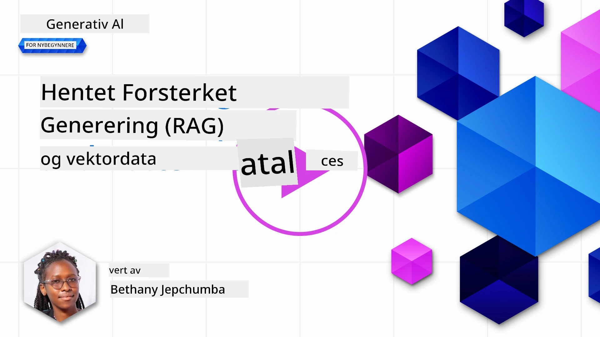
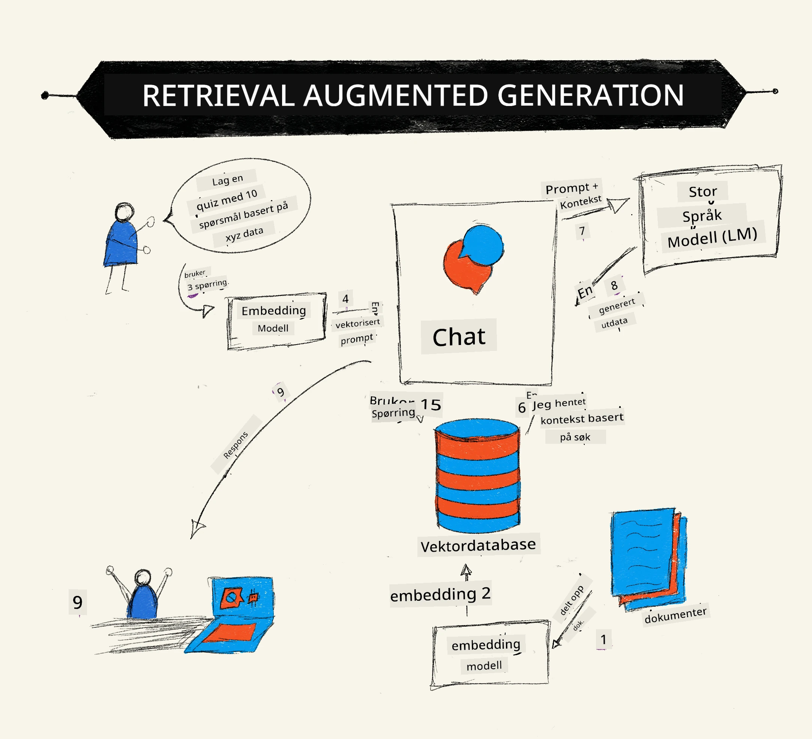
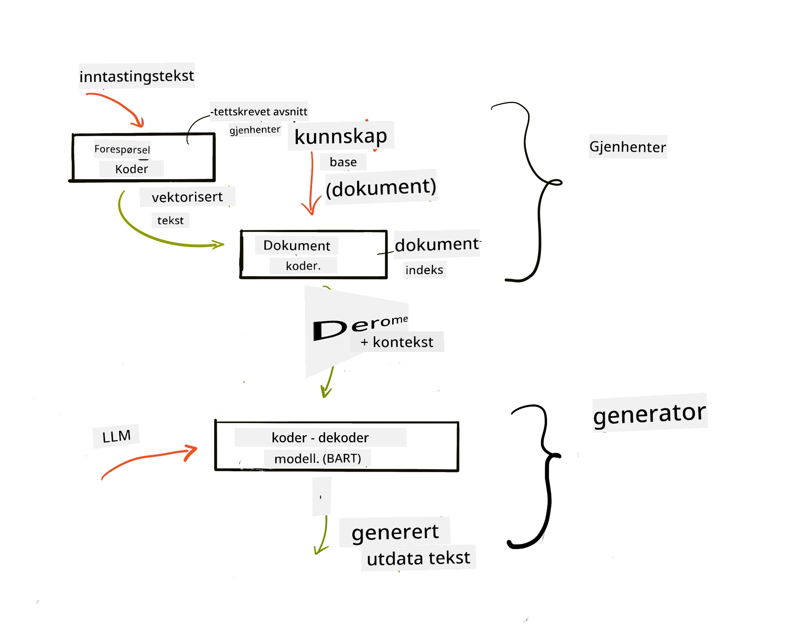

# Retrieval Augmented Generation (RAG) og vektordatabaser

[](https://youtu.be/4l8zhHUBeyI?si=BmvDmL1fnHtgQYkL)

I leksjonen om søkeapplikasjoner lærte vi kort hvordan du integrerer dine egne data i store språkmodeller (LLM-er). I denne leksjonen vil vi dykke dypere inn i konseptene for å forankre dine data i LLM-applikasjonen, mekanismene i prosessen og metodene for lagring av data, inkludert både innebygde representasjoner og tekst.

> **Video kommer snart**

## Introduksjon

I denne leksjonen vil vi dekke følgende:

- En introduksjon til RAG, hva det er og hvorfor det brukes i KI (kunstig intelligens).

- Forstå hva vektordatabaser er og opprette en slik for vår applikasjon.

- Et praktisk eksempel på hvordan integrere RAG i en applikasjon.

## Læringsmål

Etter å ha fullført denne leksjonen, vil du kunne:

- Forklare betydningen av RAG i datahenting og behandling.

- Sette opp en RAG-applikasjon og forankre dine data til en LLM

- Effektiv integrering av RAG og vektordatabaser i LLM-applikasjoner.

## Vårt scenario: forbedre våre LLM-er med våre egne data

For denne leksjonen ønsker vi å legge til egne notater i utdanningsstartupen, som gjør at chatbotten får mer informasjon om de ulike fagene. Ved å bruke notatene vi har, vil lærere kunne studere bedre og forstå de forskjellige temaene, noe som gjør det lettere å repetere til eksamener. For å skape vårt scenario vil vi bruke:

- `Azure OpenAI:` LLM-en vi bruker for å lage chatbotten vår

- `AI for beginners' lesson on Neural Networks`: dette vil være dataene vi forankrer vår LLM på

- `Azure AI Search` og `Azure Cosmos DB:` vektordatabaser for å lagre data og lage en søkeindeks

Brukere vil kunne lage øvingsquizzer fra notatene sine, repetisjonsflashkort og oppsummere til konsise oversikter. For å starte, la oss se på hva RAG er og hvordan det fungerer:

## Retrieval Augmented Generation (RAG)

En LLM-drevet chatbot behandler brukerforespørsler for å generere svar. Den er designet for å være interaktiv og engasjerer brukere i et bredt spekter av emner. Likevel er svarene begrenset til konteksten som gis og det grunnleggende treningsmaterialet. For eksempel har GPT-4 kunnskapsavskjæring i september 2021, noe som betyr at den mangler kjennskap til hendelser som har skjedd etter denne perioden. I tillegg ekskluderer dataene som brukes til å trene LLM-er konfidensiell informasjon som personlige notater eller en bedrifts produktmanual.

### Hvordan RAGs (Retrieval Augmented Generation) fungerer



Anta at du vil lansere en chatbot som lager quizzer fra notatene dine, da trenger du en tilkobling til kunnskapsbasen. Her kommer RAG inn som en løsning. RAGs fungerer på følgende måte:

- **Kunnskapsbase:** Før uthenting må dokumentene inntas og forhåndsbehandles, vanligvis ved å dele store dokumenter inn i mindre biter, transformere dem til tekst-embedding og lagre dem i en database.

- **Brukerspørsmål:** brukeren stiller et spørsmål

- **Uthenting:** Når en bruker stiller et spørsmål, henter embedding-modellen relevant informasjon fra kunnskapsbasen vår for å gi mer kontekst som blir inkorporert i prompten.

- **Augmented Generation:** LLM-en forbedrer svaret sitt basert på de hentede dataene. Det gjør at svaret som genereres ikke bare baseres på forhåndstrent data, men også på relevant informasjon fra den tilførte konteksten. De innhentede dataene brukes til å forbedre LLM-ens svar. LLM-en returnerer så et svar på brukerens spørsmål.



Arkitekturen for RAGs implementeres med transformere som består av to deler: en encoder og en decoder. For eksempel, når en bruker stiller et spørsmål, "kodes" inngangsteksten til vektorer som fanger betydningen av ordene, og vektorene "dekodes" til vår dokumentindeks og genererer ny tekst basert på brukerforespørselen. LLM-en bruker både en encoder-decoder-modell for å generere output.

To tilnærminger når man implementerer RAG ifølge det foreslåtte papiret: [Retrieval-Augmented Generation for Knowledge intensive NLP (natural language processing software) Tasks](https://arxiv.org/pdf/2005.11401.pdf?WT.mc_id=academic-105485-koreyst) er:

- **_RAG-Sequence_** bruker hentede dokumenter for å forutsi det beste mulige svaret på en brukerspørsmål

- **RAG-Token** bruker dokumenter for å generere neste token, og henter deretter dem for å svare på brukerens spørsmål

### Hvorfor bruke RAGs? 

- **Rike informasjonskilder:** sikrer at tekstsvar er oppdaterte og aktuelle. Det forbedrer dermed ytelsen på domenespesifikke oppgaver ved å få tilgang til intern kunnskapsbase.

- Reduserer fabrikkering ved å bruke **verifiserbare data** i kunnskapsbasen for å gi kontekst til brukerforespørslene.

- Det er **kostnadseffektivt** siden de er rimeligere sammenlignet med finjustering av en LLM

## Lage en kunnskapsbase

Applikasjonen vår baseres på våre personlige data, altså leksjonen om nevrale nettverk i AI For Beginners-kurset.

### Vektordatabaser

En vektordatabasen, i motsetning til tradisjonelle databaser, er en spesialisert database designet for å lagre, administrere og søke innebygde vektorer. Den lagrer numeriske representasjoner av dokumenter. Å bryte data ned til numeriske embedding gjør det lettere for vårt KI-system å forstå og behandle dataene.

Vi lagrer embeddingene våre i vektordatabaser da LLM-er har en begrensning på antall tokens de kan akseptere som input. Siden du ikke kan sende hele embeddingene til en LLM, må vi dele dem opp i biter, og når en bruker stiller et spørsmål, vil embeddingene som ligner mest på spørsmålet bli returnert sammen med prompten. Oppdeling reduserer også kostnader per tokens som sendes gjennom en LLM.

Noen populære vektordatabaser inkluderer Azure Cosmos DB, Clarifyai, Pinecone, Chromadb, ScaNN, Qdrant og DeepLake. Du kan opprette en Azure Cosmos DB-modell ved bruk av Azure CLI med følgende kommando:

```bash
az login
az group create -n <resource-group-name> -l <location>
az cosmosdb create -n <cosmos-db-name> -r <resource-group-name>
az cosmosdb list-keys -n <cosmos-db-name> -g <resource-group-name>
```

### Fra tekst til embedding

Før vi lagrer dataene våre, må vi konvertere dem til vektor-embedding før de lagres i databasen. Hvis du jobber med store dokumenter eller lange tekster, kan du dele dem opp basert på forventede spørsmål. Oppdeling kan gjøres på setningsnivå, eller på avsnittsnivå. Siden oppdeling henter mening fra ordene rundt, kan du legge til annen kontekst til en bit, for eksempel ved å legge til dokumentets tittel eller inkludere noe tekst før eller etter biten. Du kan dele opp dataene som følger:

```python
def split_text(text, max_length, min_length):
    words = text.split()
    chunks = []
    current_chunk = []

    for word in words:
        current_chunk.append(word)
        if len(' '.join(current_chunk)) < max_length and len(' '.join(current_chunk)) > min_length:
            chunks.append(' '.join(current_chunk))
            current_chunk = []

    # Hvis den siste biten ikke nådde minimum lengde, legg den til uansett
    if current_chunk:
        chunks.append(' '.join(current_chunk))

    return chunks
```

Når dataene er delt, kan vi deretter bygge embedding av teksten ved å bruke ulike embedding-modeller. Noen modeller du kan bruke inkluderer: word2vec, ada-002 fra OpenAI, Azure Computer Vision og mange flere. Valg av modell avhenger av språkene du bruker, typen innhold som kodes (tekst/bilder/lyd), størrelsen på input den kan kode og lengden på embedding-output.

Et eksempel på embedding av tekst ved bruk av OpenAIs `text-embedding-ada-002`-modell er:


## Henting og vektorsøk

Når en bruker stiller et spørsmål, transformerer henteren det til en vektor ved bruk av spørsmålsenkoderen, den søker så gjennom dokumentindeksen vår etter relevante vektorer i dokumentet som er relatert til input. Når dette er gjort, konverterer den både input-vektoren og dokumentvektorene til tekst og sender det til LLM-en.

### Henting

Henting skjer når systemet prøver å raskt finne dokumentene i indeksen som oppfyller søkekriteriene. Målet med henteren er å finne dokumenter som skal brukes til å gi kontekst og forankre LLM-en på dine data.

Det finnes flere måter å utføre søk i databasen vår på, som for eksempel:

- **Nøkkelordssøk** - for tekstsøk

- **Vektorsøk** - konverterer dokumenter fra tekst til vektorreprensentasjoner ved bruk av embedding-modeller, som tillater et **semantisk søk** basert på betydningen av ord. Henting gjøres ved å søke etter dokumenter hvis vektorreprensentasjoner er nærmest brukerens spørsmål.

- **Hybrid** - en kombinasjon av både nøkkelordssøk og vektorsøk.

En utfordring med henting er når det ikke finnes noe lignende svar på spørsmålet i databasen, systemet returnerer da den beste informasjonen det kan få tak i, men du kan bruke taktikker som å sette maksimal avstand for relevans eller bruke hybrid-søk som kombinerer både nøkkelord og vektorsøk. I denne leksjonen vil vi bruke hybrid søk, en kombinasjon av både vektor- og nøkkelordssøk. Vi vil lagre dataene i en dataframe med kolonner som inneholder både bitene og embeddingene.

### Vektorlignendehet

Henteren vil søke i kunnskapsdatabasen etter embedding som er nær hverandre, nærmeste nabo, ettersom det er tekster som er like. I scenarioet hvor en bruker stiller et spørsmål, blir det først embeddet og deretter matchet med lignende embedding. Den vanlige metoden som brukes for å finne hvor like forskjellige vektorer er, er cosinuslikhet som er basert på vinkelen mellom to vektorer.

Vi kan måle likhet ved hjelp av andre alternativer som vi kan bruke, for eksempel euklidisk avstand som er den rette linjen mellom vektorenes endepunkter, og prikkprodukt som måler summen av produktene av tilsvarende elementer i to vektorer.

### Søkeindeks

Når vi gjør henting, må vi bygge en søkeindeks for kunnskapsbasen vår før vi utfører søk. En indeks lagrer embeddingene våre og kan raskt hente de mest lignende bitene selv i en stor database. Vi kan opprette indeksen lokalt ved å bruke:

```python
from sklearn.neighbors import NearestNeighbors

embeddings = flattened_df['embeddings'].to_list()

# Opprett søkeindeksen
nbrs = NearestNeighbors(n_neighbors=5, algorithm='ball_tree').fit(embeddings)

# For å søke i indeksen kan du bruke kneighbors-metoden
distances, indices = nbrs.kneighbors(embeddings)
```

### Omranging

Når du har hentet data fra databasen, må du kanskje sortere resultatene fra mest relevante. En omodererende LLM bruker maskinlæring for å forbedre relevansen av søkresultater ved å rangere dem fra mest relevante. Ved bruk av Azure AI Search gjøres omrangering automatisk for deg ved hjelp av en semantisk omrangering. Et eksempel på hvordan omrangering fungerer ved hjelp av nærmeste naboer:

```python
# Finn de mest lignende dokumentene
distances, indices = nbrs.kneighbors([query_vector])

index = []
# Skriv ut de mest lignende dokumentene
for i in range(3):
    index = indices[0][i]
    for index in indices[0]:
        print(flattened_df['chunks'].iloc[index])
        print(flattened_df['path'].iloc[index])
        print(flattened_df['distances'].iloc[index])
    else:
        print(f"Index {index} not found in DataFrame")
```

## Å sette det hele sammen

Det siste steget er å legge til vår LLM i miksen for å kunne få svar som er forankret i våre data. Vi kan implementere det som følger:

```python
user_input = "what is a perceptron?"

def chatbot(user_input):
    # Konverter spørsmålet til en spørrevektor
    query_vector = create_embeddings(user_input)

    # Finn de mest lignende dokumentene
    distances, indices = nbrs.kneighbors([query_vector])

    # legg til dokumenter i spørsmålet for å gi kontekst
    history = []
    for index in indices[0]:
        history.append(flattened_df['chunks'].iloc[index])

    # kombiner historikken og brukerens inndata
    history.append(user_input)

    # opprett et meldingsobjekt
    messages=[
        {"role": "system", "content": "You are an AI assistant that helps with AI questions."},
        {"role": "user", "content": "\n\n".join(history) }
    ]

    # bruk chatteferdighet for å generere et svar
    response = openai.chat.completions.create(
        model="gpt-4",
        temperature=0.7,
        max_tokens=800,
        messages=messages
    )

    return response.choices[0].message

chatbot(user_input)
```

## Evaluering av applikasjonen vår

### Evalueringsmetoder

- Kvaliteten på svarene som leveres, slik at det høres naturlig, flytende og menneskelig ut

- Forankring av dataene: evaluere om svaret kom fra de leverte dokumentene

- Relevans: evaluere om svaret samsvarer med og er relatert til det stilte spørsmålet

- Flyt – hvorvidt svaret er grammatisk meningsfylt

## Brukstilfeller for RAG (Retrieval Augmented Generation) og vektordatabaser

Det finnes mange forskjellige brukstilfeller hvor funksjonskall kan forbedre appen din, for eksempel:

- Spørsmål og svar: forankre bedriftsdata til en chat som ansatte kan bruke for å stille spørsmål.

- Anbefalingssystemer: der du kan lage et system som matcher de mest lignende verdiene f.eks. filmer, restauranter og mye mer.

- Chattetjenester: du kan lagre chatthistorikk og tilpasse samtalen basert på brukerdata.

- Bildesøk basert på vektor-embedding, nyttig ved bildeidentifikasjon og anomali-deteksjon.

## Oppsummering

Vi har dekket grunnleggende områder i RAG fra å legge til dataene våre i applikasjonen, brukerforespørselen og output. For å forenkle opprettelse av RAG kan du bruke rammeverk som Semantic Kernel, Langchain eller Autogen.

## Oppgave

For å fortsette læringen din av Retrieval Augmented Generation (RAG) kan du bygge:

- Bygg et frontend for applikasjonen med rammeverket du foretrekker

- Bruk et rammeverk, enten LangChain eller Semantic Kernel, og gjenskap applikasjonen din.

Gratulerer med å ha fullført leksjonen 👏.

## Læring stopper ikke her, fortsett reisen

Etter å ha fullført denne leksjonen, sjekk ut vår [Generative AI Learning collection](https://aka.ms/genai-collection?WT.mc_id=academic-105485-koreyst) for å fortsette å heve din kunnskap om Generative AI!

---

<!-- CO-OP TRANSLATOR DISCLAIMER START -->
**Ansvarsfraskrivelse**:
Dette dokumentet er oversatt ved hjelp av AI-oversettelsestjenesten [Co-op Translator](https://github.com/Azure/co-op-translator). Selv om vi streber etter nøyaktighet, vennligst vær oppmerksom på at automatiserte oversettelser kan inneholde feil eller unøyaktigheter. Det originale dokumentet på sitt opprinnelige språk skal betraktes som den autoritative kilden. For kritisk informasjon anbefales profesjonell menneskelig oversettelse. Vi er ikke ansvarlige for eventuelle misforståelser eller feiltolkninger som oppstår ved bruk av denne oversettelsen.
<!-- CO-OP TRANSLATOR DISCLAIMER END -->