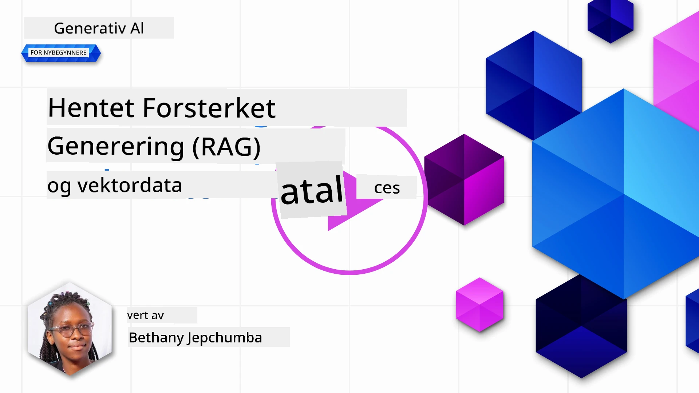
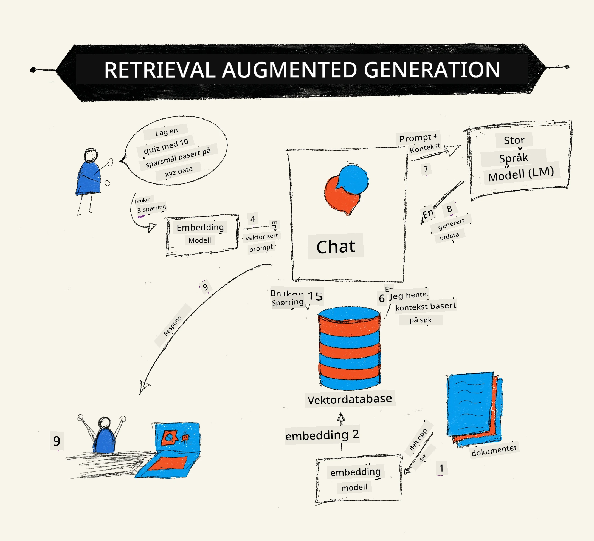
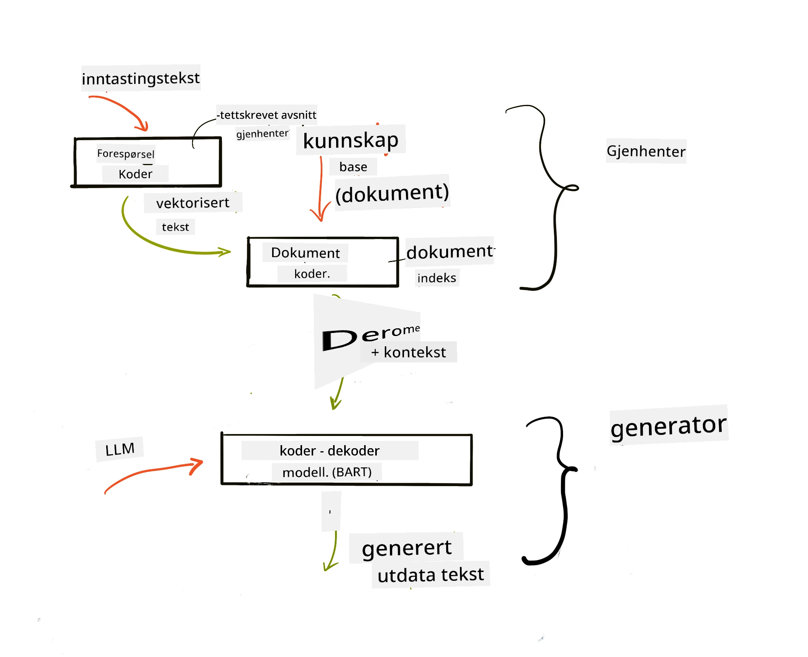

# Retrieval Augmented Generation (RAG) og vektordatabaser

[](https://youtu.be/4l8zhHUBeyI?si=BmvDmL1fnHtgQYkL)

I leksjonen om søkeapplikasjoner lærte vi kort hvordan du integrerer dine egne data i Store Språkmodeller (LLMs). I denne leksjonen skal vi dykke dypere inn i konseptene rundt å forankre dine data i LLM-applikasjonen din, mekanismene i prosessen og metodene for lagring av data, inkludert både embeddings og tekst.

> **Video kommer snart**

## Introduksjon

I denne leksjonen skal vi dekke følgende:

- En introduksjon til RAG, hva det er og hvorfor det brukes i KI (kunstig intelligens).

- Forstå hva vektordatabaser er og hvordan man oppretter en for vår applikasjon.

- Et praktisk eksempel på hvordan integrere RAG i en applikasjon.

## Læringsmål

Etter å ha fullført denne leksjonen vil du kunne:

- Forklare betydningen av RAG i datahenting og -behandling.

- Sette opp RAG-applikasjon og forankre dine data til en LLM

- Effektiv integrering av RAG og vektordatabaser i LLM-applikasjoner.

## Vårt scenario: forbedre våre LLM-er med våre egne data

For denne leksjonen ønsker vi å legge til våre egne notater i utdanningsstartupen, som lar chatbotten få mer informasjon om de forskjellige fagene. Ved å bruke notatene vi har, vil elever kunne studere bedre og forstå de ulike temaene, noe som gjør det lettere å repetere til eksamen. For å lage vårt scenario vil vi bruke:

- `Azure OpenAI:` LLM-en vi skal bruke til å lage chatbotten vår

- `AI for beginners'-leksjonen om Nevrale Nettverk`: dette vil være dataene vi forankrer vår LLM på

- `Azure AI Search` og `Azure Cosmos DB:` vektordatabase for å lagre våre data og opprette en søkeindeks

Brukere vil kunne lage øvelsesquizzer fra notatene sine, revisjonsflashcards og oppsummere det til konsise oversikter. For å komme i gang, la oss se på hva RAG er og hvordan det fungerer:

## Retrieval Augmented Generation (RAG)

En LLM-drevet chatbot prosesserer brukerforespørsler for å generere svar. Den er designet for å være interaktiv og engasjerer brukere på et bredt spekter av emner. Likevel er svarene begrenset til den konteksten som blir gitt og dens grunnleggende treningsdata. For eksempel har GPT-4 kunnskapsavskjæring i september 2021, noe som betyr at den mangler kunnskap om hendelser som har skjedd etter dette tidspunktet. I tillegg ekskluderer dataene som brukes til å trene LLM-er konfidensiell informasjon som personlige notater eller en bedrifts produktmanual.

### Hvordan RAG (Retrieval Augmented Generation) fungerer



Anta at du vil lansere en chatbot som lager quizzer fra notatene dine, da trenger du en forbindelse til kunnskapsbasen. Her kommer RAG til unnsetning. RAG fungerer slik:

- **Kunnskapsbase:** Før innhenting må dokumentene bli lastet inn og forhåndsbehandlet, vanligvis brytes store dokumenter ned i mindre deler, transformert til tekst-embedding og lagret i en database.

- **Brukerspørsmål:** brukeren stiller et spørsmål

- **Innhenting:** Når en bruker stiller et spørsmål, henter embed-modellen relevant informasjon fra vår kunnskapsbase for å gi mer kontekst som skal innarbeides i forespørselen.

- **Utvidet generering:** LLM-en forbedrer sitt svar basert på dataene som er hentet. Dette gjør at svaret som genereres ikke bare baseres på forhåndstrente data, men også på relevant informasjon fra den tilførte konteksten. De innhentede dataene brukes til å utvide LLM-ens svar. LLM-en returnerer så et svar på brukerens spørsmål.



Arkitekturen for RAG implementeres ved hjelp av transformere bestående av to deler: en encoder og en decoder. For eksempel, når en bruker stiller et spørsmål, blir inndata-teksten 'kodet' til vektorer som fanger meningen i ordene, og vektorene blir 'dekodet' inn i dokumentindeksen vår og genererer ny tekst basert på brukerforespørselen. LLM bruker både en encoder-decoder-modell for å generere utdata.

To tilnærminger ved implementering av RAG i henhold til det foreslåtte papiret: [Retrieval-Augmented Generation for Knowledge intensive NLP (natural language processing software) Tasks](https://arxiv.org/pdf/2005.11401.pdf?WT.mc_id=academic-105485-koreyst) er:

- **_RAG-Sequence_** ved å bruke hentede dokumenter for å forutsi det beste mulige svaret på en brukerforespørsel

- **RAG-Token** ved å bruke dokumenter for å generere neste token, deretter hente dem for å svare på brukerens spørsmål

### Hvorfor bruke RAG?

- **Informasjonsrikdom:** sikrer at tekstsvar er oppdaterte og aktuelle. Det forbedrer dermed ytelsen på domene-spesifikke oppgaver ved å få tilgang til den interne kunnskapsbasen.

- Reduserer fabrikasjon ved å bruke **verifiserbare data** i kunnskapsbasen for å gi kontekst til brukerspørsmål.

- Det er **kostnadseffektivt** da de er mer økonomiske sammenlignet med finjustering av en LLM

## Lage en kunnskapsbase

Vår applikasjon er basert på våre personlige data, altså leksjonen om nevrale nettverk i AI For Beginners-kurset.

### Vektordatabaser

En vektordatabase, i motsetning til tradisjonelle databaser, er en spesialisert database designet for å lagre, håndtere og søke i innebygde vektorer. Den lagrer numeriske representasjoner av dokumenter. Å bryte ned data til numeriske embeddings gjør det enklere for vårt AI-system å forstå og behandle dataene.

Vi lagrer våre embeddings i vektordatabaser fordi LLM-er har en grense for hvor mange tokens de aksepterer som inndata. Siden du ikke kan sende hele embeddingene til en LLM, må vi dele dem opp i biter, og når en bruker stiller et spørsmål, blir embeddingene som best matcher spørsmålet returnert sammen med prompten. Oppdeling reduserer også kostnader på antall tokens som sendes gjennom en LLM.

Noen populære vektordatabaser inkluderer Azure Cosmos DB, Clarifyai, Pinecone, Chromadb, ScaNN, Qdrant og DeepLake. Du kan opprette en Azure Cosmos DB-modell ved å bruke Azure CLI med følgende kommando:

```bash
az login
az group create -n <resource-group-name> -l <location>
az cosmosdb create -n <cosmos-db-name> -r <resource-group-name>
az cosmosdb list-keys -n <cosmos-db-name> -g <resource-group-name>
```

### Fra tekst til embeddings

Før vi lagrer dataene våre, må vi konvertere dem til vektor-embedding før de lagres i databasen. Hvis du jobber med store dokumenter eller lange tekster, kan du dele dem opp basert på forventede spørringer. Oppdeling kan gjøres på setningsnivå eller avsnittsnivå. Ettersom oppdeling henter mening fra ordene rundt, kan du legge til noe kontekst til en bit, for eksempel ved å legge til dokumenttittel eller inkludere noe tekst før eller etter biten. Du kan dele opp dataene som følger:

```python
def split_text(text, max_length, min_length):
    words = text.split()
    chunks = []
    current_chunk = []

    for word in words:
        current_chunk.append(word)
        if len(' '.join(current_chunk)) < max_length and len(' '.join(current_chunk)) > min_length:
            chunks.append(' '.join(current_chunk))
            current_chunk = []

    # Hvis den siste biten ikke nådde minimumslengden, legg den til uansett
    if current_chunk:
        chunks.append(' '.join(current_chunk))

    return chunks
```

Når bitene er delt opp, kan vi deretter embede teksten vår ved å bruke forskjellige embedding-modeller. Noen modeller du kan bruke inkluderer: word2vec, ada-002 fra OpenAI, Azure Computer Vision og mange flere. Valg av modell avhenger av hvilke språk du bruker, hvilken type innhold som kodes (tekst/bilder/lyd), størrelsen på input den kan kode og lengden på embedding-utdataene.

Et eksempel på embedded tekst ved bruk av OpenAI sin `text-embedding-ada-002`-modell er:


## Innhenting og vektorsøk

Når en bruker stiller et spørsmål, transformerer innhenteren det til en vektor ved bruk av spørringskoder, den søker deretter gjennom dokumentets søkeindeks etter relevante vektorer i dokumentet som er relatert til inndataen. Når dette er gjort, konverteres både input-vektor og dokumentvektorer til tekst og sendes til LLM.

### Innhenting

Innhenting skjer når systemet prøver å raskt finne dokumenter fra indeksen som tilfredsstiller søkekriteriene. Målet til innhenteren er å få dokumenter som kan brukes til å gi kontekst og forankre LLM på dine data.

Det finnes flere måter å utføre søk i databasen vår på, slik som:

- **Nøkkelordssøk** - brukt for tekstsøk

- **Vektorsøk** - konverterer dokumenter fra tekst til vektorrepresentasjoner ved bruk av embedding-modeller, slik at man kan gjøre et **semantisk søk** basert på ords mening. Innhenting gjøres ved å spørre dokumentene hvis vektorrepresentasjoner er nærmest brukerens spørsmål.

- **Hybrid** - en kombinasjon av både nøkkelordssøk og vektorsøk.

En utfordring med innhenting oppstår når det ikke finnes lignende svar på spørsmålet i databasen. Systemet returnerer da den beste informasjonen det kan finne, men du kan bruke taktikker som å sette maksimal avstand for relevans eller bruke hybridsøk som kombinerer både nøkkelord- og vektorsøk. I denne leksjonen vil vi bruke hybridsøk, en kombinasjon av både vektor- og nøkkelordssøk. Vi lagrer dataene våre i en dataframe med kolonner som inneholder både biter samt embeddings.

### Vektorlignendehet

Innhenteren søker gjennom kunnskapsdatabasen etter embeddings som ligger nær hverandre, nærmeste nabo, siden de er tekster som er like. I scenariet hvor en bruker stiller et spørsmål, embedes det først og matches deretter med lignende embeddings. Den vanlige målingen som brukes for å finne hvor like ulike vektorer er, er cosinuslikhet basert på vinkelen mellom to vektorer.

Alternativer vi kan bruke for å måle likhet er Euklidisk avstand, som er den rette linjen mellom vektorenes endepunkter, og prikkprodukt som måler summen av produktene av tilsvarende elementer i to vektorer.

### Søkeindeks

Når vi gjør innhenting, må vi bygge en søkeindeks for vår kunnskapsbase før vi utfører søk. En indeks lagrer embeddingene våre og kan raskt hente ut de mest like bitene selv i en stor database. Vi kan opprette vår indeks lokalt ved å bruke:

```python
from sklearn.neighbors import NearestNeighbors

embeddings = flattened_df['embeddings'].to_list()

# Opprett søkeindeksen
nbrs = NearestNeighbors(n_neighbors=5, algorithm='ball_tree').fit(embeddings)

# For å søke i indeksen kan du bruke kneighbors-metoden
distances, indices = nbrs.kneighbors(embeddings)
```

### Omrangering

Når du har spurt databasen, kan det være nødvendig å sortere resultatene fra de mest relevante. En omrangerings-LLM bruker maskinlæring for å forbedre relevansen av søkeresultater ved å sortere dem fra mest relevant. Ved bruk av Azure AI Search gjøres omrangering automatisk for deg ved hjelp av en semantisk omrangering. Et eksempel på hvordan omrangering fungerer ved nærmeste naboer:

```python
# Finn de mest lignende dokumentene
distances, indices = nbrs.kneighbors([query_vector])

index = []
# Skriv ut de mest lignende dokumentene
for i in range(3):
    index = indices[0][i]
    for index in indices[0]:
        print(flattened_df['chunks'].iloc[index])
        print(flattened_df['path'].iloc[index])
        print(flattened_df['distances'].iloc[index])
    else:
        print(f"Index {index} not found in DataFrame")
```

## Sette det hele sammen

Det siste steget er å legge LLM vår inn i miksen for å kunne få svar som er forankret i våre data. Vi kan implementere det på følgende måte:

```python
user_input = "what is a perceptron?"

def chatbot(user_input):
    # Konverter spørsmålet til en spørrevektor
    query_vector = create_embeddings(user_input)

    # Finn de mest lignende dokumentene
    distances, indices = nbrs.kneighbors([query_vector])

    # legg til dokumenter i spørsmålet for å gi kontekst
    history = []
    for index in indices[0]:
        history.append(flattened_df['chunks'].iloc[index])

    # kombiner historikken og brukerens input
    history.append(user_input)

    # opprett et meldingsobjekt
    messages=[
        {"role": "system", "content": "You are an AI assistant that helps with AI questions."},
        {"role": "user", "content": "\n\n".join(history) }
    ]

    # bruk Responses API for å generere et svar
    response = client.responses.create(
        model="gpt-5-mini",
        max_output_tokens=800,
        input=messages,
        store=False,
    )

    return response.output_text

chatbot(user_input)
```

## Evaluering av applikasjonen vår

### Evalueringsmetrikker

- Kvaliteten på leverte svar som sikrer at det høres naturlig, flytende og menneskelig ut

- Forankring av data: evaluere om svaret kom fra de leverte dokumentene

- Relevans: evaluere at svaret stemmer overens med og er relatert til det stilte spørsmålet

- Flyt - om svaret gir grammatisk mening

## Bruksområder for å bruke RAG (Retrieval Augmented Generation) og vektordatabaser

Det finnes mange ulike bruksområder hvor funksjonskall kan forbedre appen din, slik som:

- Spørsmål og svar: forankre selskapets data til en chat som ansatte kan bruke til å stille spørsmål.

- Anbefalingssystemer: hvor du kan lage et system som matcher de mest lignende verdiene, for eksempel filmer, restauranter og mye mer.

- Chattjenester: du kan lagre chathistorikk og personalisere samtalen basert på brukerdata.

- Bildesøk basert på vektor-embedding, nyttig ved bildeanalyse og avviksdeteksjon.

## Oppsummering

Vi har dekket de grunnleggende områdene av RAG fra å legge til våre data i applikasjonen, brukerspørsmål og utdata. For å forenkle opprettelse av RAG kan du bruke rammeverk som Semantic Kernel, Langchain eller Autogen.

## Oppgave

For å fortsette læringen din om Retrieval Augmented Generation (RAG) kan du bygge:

- Lag et frontend for applikasjonen ved å bruke rammen du foretrekker

- Bruk et rammeverk, enten LangChain eller Semantic Kernel, og gjenskap applikasjonen din.

Gratulerer med å ha fullført leksjonen 👏.

## Læring stopper ikke her, fortsett reisen

Etter å ha fullført denne leksjonen, sjekk ut vår [Generative AI Learning collection](https://aka.ms/genai-collection?WT.mc_id=academic-105485-koreyst) for å fortsette å heve din kunnskap om Generativ AI!

---

<!-- CO-OP TRANSLATOR DISCLAIMER START -->
**Ansvarsfraskrivelse**:
Dette dokumentet er oversatt ved hjelp av AI-oversettelsestjenesten [Co-op Translator](https://github.com/Azure/co-op-translator). Selv om vi streber etter nøyaktighet, vær oppmerksom på at automatiske oversettelser kan inneholde feil eller unøyaktigheter. Det opprinnelige dokumentet på originalspråket skal betraktes som den autoritative kilden. For kritisk informasjon anbefales profesjonell menneskelig oversettelse. Vi er ikke ansvarlige for eventuelle misforståelser eller feiltolkninger som oppstår ved bruk av denne oversettelsen.
<!-- CO-OP TRANSLATOR DISCLAIMER END -->