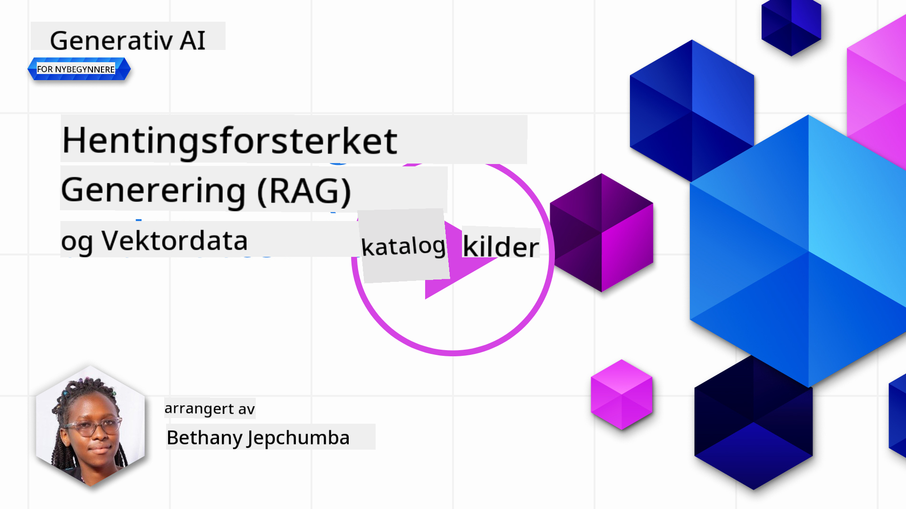
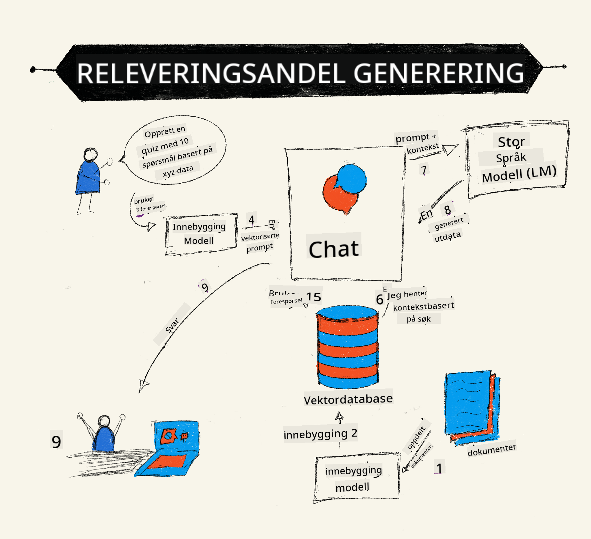
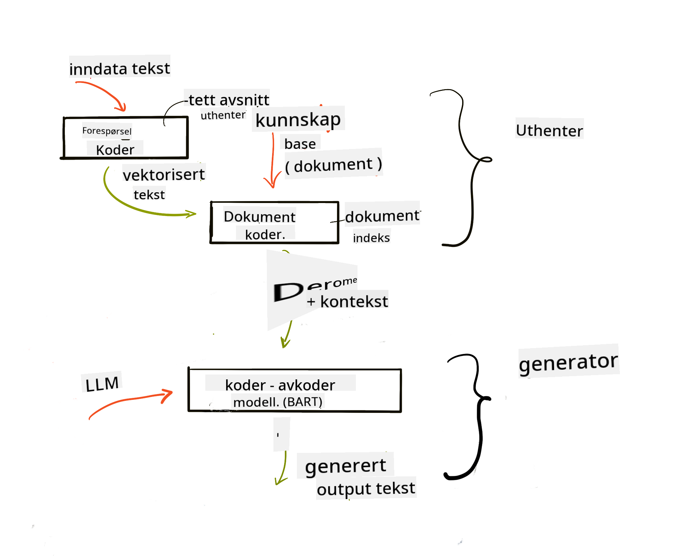
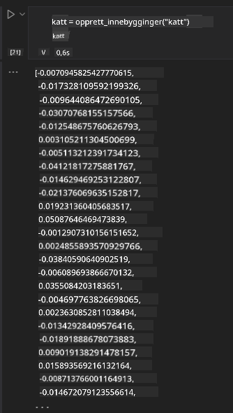

<!--
CO_OP_TRANSLATOR_METADATA:
{
  "original_hash": "e2861bbca91c0567ef32bc77fe054f9e",
  "translation_date": "2025-06-25T22:36:01+00:00",
  "source_file": "15-rag-and-vector-databases/README.md",
  "language_code": "no"
}
-->
# Retrieval Augmented Generation (RAG) og Vektordatabaser

[](https://aka.ms/gen-ai-lesson15-gh?WT.mc_id=academic-105485-koreyst)

I leksjonen om søkeapplikasjoner lærte vi kort hvordan du kan integrere dine egne data i store språkmodeller (LLMs). I denne leksjonen skal vi gå dypere inn i konseptene rundt å forankre dine data i LLM-applikasjonen din, mekanikken i prosessen og metodene for å lagre data, inkludert både innbakte data og tekst.

> **Video kommer snart**

## Introduksjon

I denne leksjonen vil vi dekke følgende:

- En introduksjon til RAG, hva det er og hvorfor det brukes i kunstig intelligens (AI).

- Forstå hva vektordatabaser er og opprette en for vår applikasjon.

- Et praktisk eksempel på hvordan man integrerer RAG i en applikasjon.

## Læringsmål

Etter å ha fullført denne leksjonen, vil du kunne:

- Forklare betydningen av RAG i datainnhenting og -behandling.

- Sette opp RAG-applikasjon og forankre dine data til en LLM.

- Effektiv integrasjon av RAG og vektordatabaser i LLM-applikasjoner.

## Vår scenario: forbedre våre LLM-er med våre egne data

For denne leksjonen ønsker vi å legge til våre egne notater i utdanningsoppstarten, som lar chatboten få mer informasjon om de forskjellige fagene. Ved å bruke notatene vi har, vil elever kunne studere bedre og forstå de ulike emnene, noe som gjør det lettere å forberede seg til eksamen. For å lage vårt scenario vil vi bruke:

- `Azure OpenAI:` LLM-en vi vil bruke for å lage vår chatbot

- `AI for beginners' lesson on Neural Networks`: dette vil være dataene vi forankrer vår LLM på

- `Azure AI Search` og `Azure Cosmos DB:` vektordatabasen for å lagre våre data og opprette en søkeindeks

Brukere vil kunne lage øvingsquizer fra sine notater, repetisjonskort og oppsummere det til konsise oversikter. For å komme i gang, la oss se på hva RAG er og hvordan det fungerer:

## Retrieval Augmented Generation (RAG)

En LLM-drevet chatbot behandler brukerforespørsler for å generere svar. Den er designet for å være interaktiv og engasjerer seg med brukere om et bredt spekter av emner. Imidlertid er dens svar begrenset til konteksten som er gitt og dens grunnleggende treningsdata. For eksempel er GPT-4 kunnskap avskåret i september 2021, noe som betyr at den mangler kunnskap om hendelser som har skjedd etter denne perioden. I tillegg ekskluderer dataene som brukes til å trene LLM-er konfidensiell informasjon som personlige notater eller en bedrifts produktmanual.

### Hvordan RAGs (Retrieval Augmented Generation) fungerer



Anta at du vil distribuere en chatbot som lager quizer fra dine notater, du vil trenge en forbindelse til kunnskapsbasen. Det er her RAG kommer til unnsetning. RAGs fungerer som følger:

- **Kunnskapsbase:** Før innhenting må disse dokumentene inntas og forhåndsbehandles, vanligvis ved å bryte ned store dokumenter i mindre biter, transformere dem til tekstinnbaking og lagre dem i en database.

- **Brukerforespørsel:** brukeren stiller et spørsmål

- **Innhenting:** Når en bruker stiller et spørsmål, henter innbakingmodellen relevant informasjon fra vår kunnskapsbase for å gi mer kontekst som vil bli innlemmet i forespørselen.

- **Forsterket generasjon:** LLM-en forbedrer sitt svar basert på dataene som er hentet. Det tillater at svaret som genereres ikke bare er basert på forhåndstrente data, men også relevant informasjon fra den tilføyde konteksten. De hentede dataene brukes til å forsterke LLM-ens svar. LLM-en returnerer deretter et svar på brukerens spørsmål.



Arkitekturen for RAGs implementeres ved hjelp av transformatorer som består av to deler: en encoder og en decoder. For eksempel, når en bruker stiller et spørsmål, 'kodes' inntekst til vektorer som fanger meningen med ordene, og vektorene 'dekodes' til vår dokumentindeks og genererer ny tekst basert på brukerens forespørsel. LLM-en bruker både en encoder-decoder-modell for å generere utdata.

To tilnærminger når du implementerer RAG i henhold til det foreslåtte papiret: [Retrieval-Augmented Generation for Knowledge intensive NLP (natural language processing software) Tasks](https://arxiv.org/pdf/2005.11401.pdf?WT.mc_id=academic-105485-koreyst) er:

- **_RAG-Sequence_** bruker hentede dokumenter for å forutsi det beste mulige svaret på en brukerforespørsel

- **RAG-Token** bruker dokumenter for å generere neste token, og henter dem deretter for å svare på brukerens forespørsel

### Hvorfor ville du bruke RAGs? 

- **Informasjonsrikdom:** sikrer at tekstsvarene er oppdaterte og aktuelle. Det forbedrer derfor ytelsen på domenespesifikke oppgaver ved å få tilgang til den interne kunnskapsbasen.

- Reduserer fabrikasjon ved å bruke **verifiserbare data** i kunnskapsbasen for å gi kontekst til brukerforespørsler.

- Det er **kostnadseffektivt** da de er mer økonomiske sammenlignet med å finjustere en LLM.

## Opprette en kunnskapsbase

Vår applikasjon er basert på våre personlige data, dvs. leksjonen om nevrale nettverk i AI for nybegynnere-kurset.

### Vektordatabaser

En vektordatabase, i motsetning til tradisjonelle databaser, er en spesialisert database designet for å lagre, administrere og søke etter innbakte vektorer. Den lagrer numeriske representasjoner av dokumenter. Å bryte ned data til numeriske innbakinger gjør det lettere for vårt AI-system å forstå og behandle dataene.

Vi lagrer våre innbakinger i vektordatabaser da LLM-er har en grense for antall tokens de aksepterer som input. Siden du ikke kan sende hele innbakingene til en LLM, må vi bryte dem ned i biter, og når en bruker stiller et spørsmål, vil innbakingene som ligner mest på spørsmålet bli returnert sammen med forespørselen. Oppdeling reduserer også kostnadene for antall tokens som sendes gjennom en LLM.

Noen populære vektordatabaser inkluderer Azure Cosmos DB, Clarifyai, Pinecone, Chromadb, ScaNN, Qdrant og DeepLake. Du kan opprette en Azure Cosmos DB-modell ved hjelp av Azure CLI med følgende kommando:

```bash
az login
az group create -n <resource-group-name> -l <location>
az cosmosdb create -n <cosmos-db-name> -r <resource-group-name>
az cosmosdb list-keys -n <cosmos-db-name> -g <resource-group-name>
```

### Fra tekst til innbakinger

Før vi lagrer våre data, må vi konvertere dem til vektorinnbakinger før de lagres i databasen. Hvis du arbeider med store dokumenter eller lange tekster, kan du dele dem opp basert på forespørsler du forventer. Oppdeling kan gjøres på setningsnivå eller på avsnittsnivå. Siden oppdeling utleder mening fra ordene rundt dem, kan du legge til annen kontekst til en del, for eksempel ved å legge til dokumenttittelen eller inkludere litt tekst før eller etter delen. Du kan dele opp dataene som følger:

```python
def split_text(text, max_length, min_length):
    words = text.split()
    chunks = []
    current_chunk = []

    for word in words:
        current_chunk.append(word)
        if len(' '.join(current_chunk)) < max_length and len(' '.join(current_chunk)) > min_length:
            chunks.append(' '.join(current_chunk))
            current_chunk = []

    # If the last chunk didn't reach the minimum length, add it anyway
    if current_chunk:
        chunks.append(' '.join(current_chunk))

    return chunks
```

Når de er delt opp, kan vi deretter innbake vår tekst ved hjelp av forskjellige innbakingmodeller. Noen modeller du kan bruke inkluderer: word2vec, ada-002 av OpenAI, Azure Computer Vision og mange flere. Valg av modell vil avhenge av språkene du bruker, typen innhold som er kodet (tekst/bilder/lyd), størrelsen på input det kan kode og lengden på innbakingutdataene.

Et eksempel på innbakt tekst ved bruk av OpenAIs `text-embedding-ada-002`-modell er:


## Innhenting og vektorsøk

Når en bruker stiller et spørsmål, transformerer innhenteren det til en vektor ved hjelp av forespørselskoderen, deretter søker den gjennom vår dokumentsøkeindeks etter relevante vektorer i dokumentet som er relatert til inputen. Når det er gjort, konverterer den både inputvektoren og dokumentvektorene til tekst og sender det gjennom LLM-en.

### Innhenting

Innhenting skjer når systemet prøver å raskt finne dokumentene fra indeksen som tilfredsstiller søkekriteriene. Målet med innhenteren er å få dokumenter som vil bli brukt til å gi kontekst og forankre LLM-en på dine data.

Det finnes flere måter å utføre søk i vår database som:

- **Nøkkelordsøk** - brukes for tekstsøk

- **Semantisk søk** - bruker den semantiske betydningen av ord

- **Vektorsøk** - konverterer dokumenter fra tekst til vektorrepresentasjoner ved hjelp av innbakingmodeller. Innhenting vil bli utført ved å spørre dokumentene hvis vektorrepresentasjoner er nærmest brukerens spørsmål.

- **Hybrid** - en kombinasjon av både nøkkelord og vektorsøk.

En utfordring med innhenting oppstår når det ikke er noe lignende svar på forespørselen i databasen, systemet vil da returnere den beste informasjonen de kan få, men du kan bruke taktikker som å sette opp maksimal avstand for relevans eller bruke hybrid søk som kombinerer både nøkkelord og vektorsøk. I denne leksjonen vil vi bruke hybrid søk, en kombinasjon av både vektor- og nøkkelordsøk. Vi vil lagre våre data i en dataframe med kolonner som inneholder delene samt innbakingene.

### Vektorsimilaritet

Innhenteren vil søke gjennom kunnskapsdatabasen etter innbakinger som er nær hverandre, den nærmeste naboen, da de er tekster som er like. I scenariet hvor en bruker stiller en forespørsel, blir den først innbakt og deretter matchet med lignende innbakinger. Den vanlige målingen som brukes for å finne hvor like forskjellige vektorer er, er kosinuslikhet som er basert på vinkelen mellom to vektorer.

Vi kan måle similaritet ved å bruke andre alternativer som euklidisk avstand som er den rette linjen mellom vektorendepunktene og prikkprodukt som måler summen av produktene av tilsvarende elementer i to vektorer.

### Søkeindeks

Når vi gjør innhenting, må vi bygge en søkeindeks for vår kunnskapsbase før vi utfører søk. En indeks vil lagre våre innbakinger og kan raskt hente de mest lignende delene selv i en stor database. Vi kan opprette vår indeks lokalt ved å bruke:

```python
from sklearn.neighbors import NearestNeighbors

embeddings = flattened_df['embeddings'].to_list()

# Create the search index
nbrs = NearestNeighbors(n_neighbors=5, algorithm='ball_tree').fit(embeddings)

# To query the index, you can use the kneighbors method
distances, indices = nbrs.kneighbors(embeddings)
```

### Re-rangering

Når du har forespurt databasen, kan det hende du må sortere resultatene fra de mest relevante. En re-rangerings LLM bruker maskinlæring for å forbedre relevansen av søkeresultatene ved å ordne dem fra de mest relevante. Ved å bruke Azure AI Search, blir re-rangering gjort automatisk for deg ved å bruke en semantisk re-rangerer. Et eksempel på hvordan re-rangering fungerer ved hjelp av nærmeste naboer:

```python
# Find the most similar documents
distances, indices = nbrs.kneighbors([query_vector])

index = []
# Print the most similar documents
for i in range(3):
    index = indices[0][i]
    for index in indices[0]:
        print(flattened_df['chunks'].iloc[index])
        print(flattened_df['path'].iloc[index])
        print(flattened_df['distances'].iloc[index])
    else:
        print(f"Index {index} not found in DataFrame")
```

## Sette alt sammen

Det siste trinnet er å legge til vår LLM i miksen for å kunne få svar som er forankret på våre data. Vi kan implementere det som følger:

```python
user_input = "what is a perceptron?"

def chatbot(user_input):
    # Convert the question to a query vector
    query_vector = create_embeddings(user_input)

    # Find the most similar documents
    distances, indices = nbrs.kneighbors([query_vector])

    # add documents to query  to provide context
    history = []
    for index in indices[0]:
        history.append(flattened_df['chunks'].iloc[index])

    # combine the history and the user input
    history.append(user_input)

    # create a message object
    messages=[
        {"role": "system", "content": "You are an AI assistant that helps with AI questions."},
        {"role": "user", "content": history[-1]}
    ]

    # use chat completion to generate a response
    response = openai.chat.completions.create(
        model="gpt-4",
        temperature=0.7,
        max_tokens=800,
        messages=messages
    )

    return response.choices[0].message

chatbot(user_input)
```

## Evaluering av vår applikasjon

### Evalueringsmetrikker

- Kvaliteten på svarene som gis, og sikrer at det høres naturlig, flytende og menneskelig ut

- Forankring av dataene: evaluere om svaret kom fra de leverte dokumentene

- Relevans: evaluere om svaret matcher og er relatert til spørsmålet som ble stilt

- Flyt - om svaret gir mening grammatisk

## Brukstilfeller for bruk av RAG (Retrieval Augmented Generation) og vektordatabaser

Det finnes mange forskjellige brukstilfeller der funksjonskall kan forbedre appen din, som:

- Spørsmål og svar: forankre dine bedriftsdata til en chat som kan brukes av ansatte til å stille spørsmål.

- Anbefalingssystemer: hvor du kan lage et system som matcher de mest lignende verdiene, f.eks. filmer, restauranter og mange flere.

- Chatbot-tjenester: du kan lagre chatthistorikk og tilpasse samtalen basert på brukerdataene.

- Bildesøk basert på vektorinnbakinger, nyttig ved bilderegistrering og anomalioppdagelse.

## Oppsummering

Vi har dekket de grunnleggende områdene av RAG fra å legge til våre data i applikasjonen, brukerforespørselen og utdata. For å forenkle opprettelsen av RAG, kan du bruke rammeverk som Semanti Kernel, Langchain eller Autogen.

## Oppgave

For å fortsette læringen din om Retrieval Augmented Generation (RAG) kan du bygge:

- Bygg en front-end for applikasjonen ved hjelp av rammeverket du velger

- Bruk et rammeverk, enten LangChain eller Semantic Kernel, og gjenskap applikasjonen din.

Gratulerer med å ha fullført leksjonen 👏.

## Læringen stopper ikke her, fortsett reisen

Etter å ha fullført denne leksjonen, sjekk ut vår [Generative AI Learning collection](https://aka.ms/genai-collection?WT.mc_id=academic-105485-koreyst) for å fortsette å heve din kunnskap om Generativ AI!

**Ansvarsfraskrivelse**:  
Dette dokumentet er oversatt ved hjelp av AI-oversettelsestjenesten [Co-op Translator](https://github.com/Azure/co-op-translator). Selv om vi streber etter nøyaktighet, vær oppmerksom på at automatiserte oversettelser kan inneholde feil eller unøyaktigheter. Det originale dokumentet på sitt opprinnelige språk bør betraktes som den autoritative kilden. For kritisk informasjon anbefales profesjonell menneskelig oversettelse. Vi er ikke ansvarlige for eventuelle misforståelser eller feiltolkninger som oppstår ved bruk av denne oversettelsen.