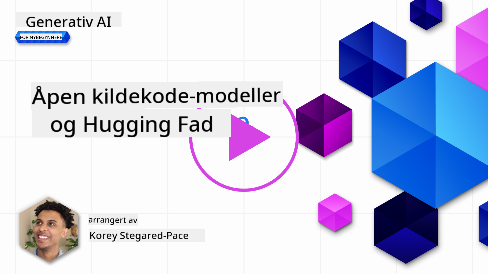
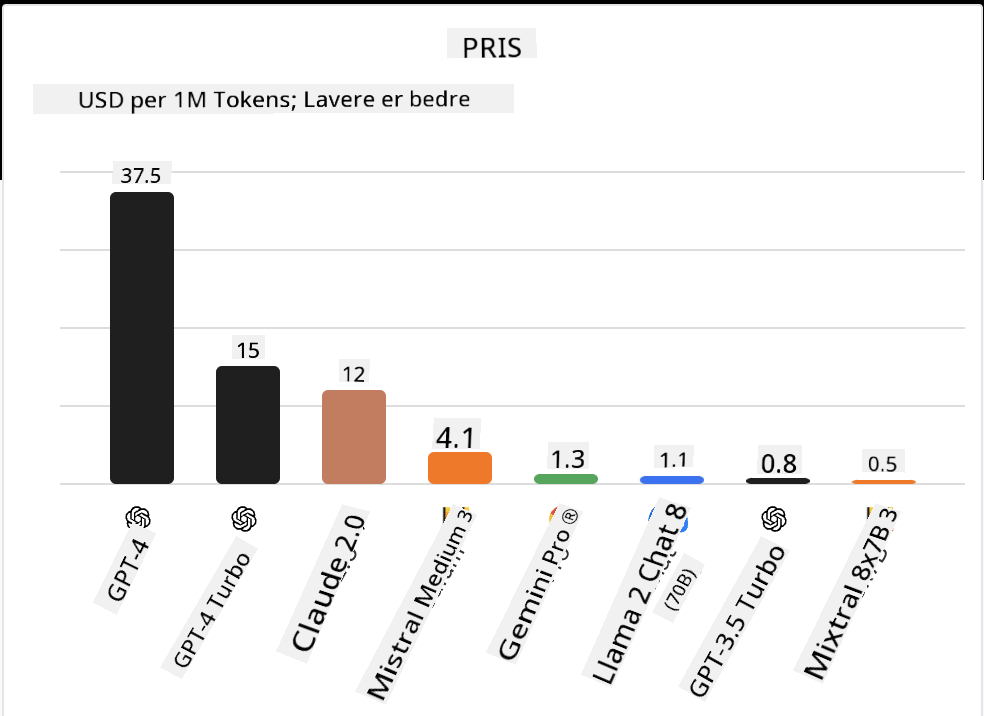
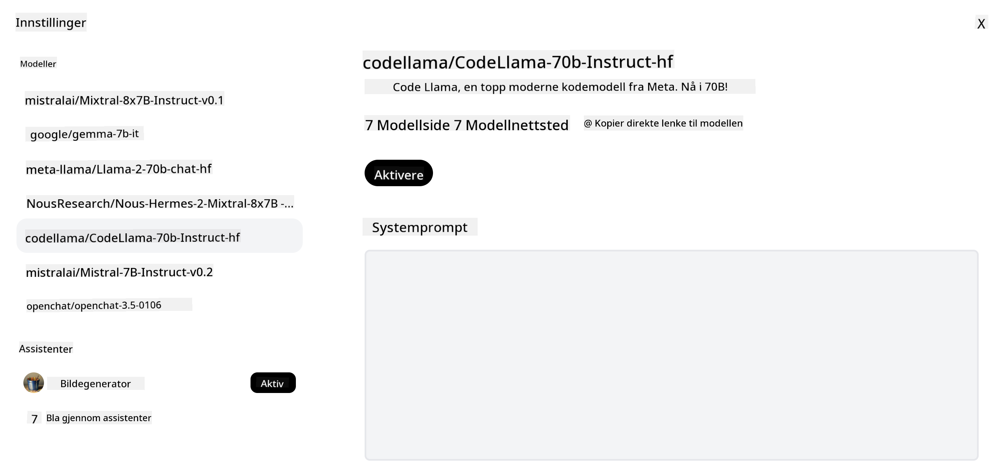
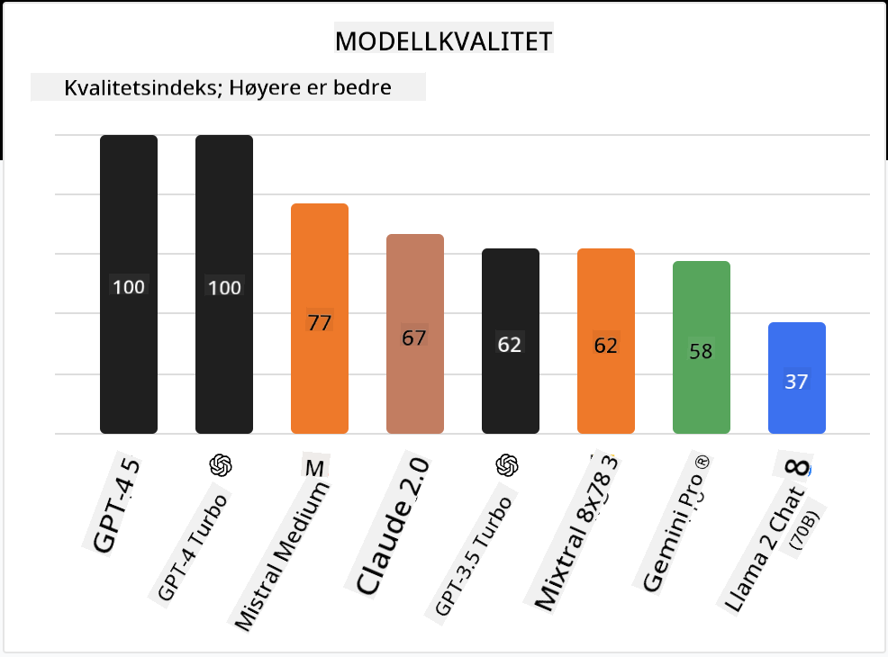

<!--
CO_OP_TRANSLATOR_METADATA:
{
  "original_hash": "0bba96e53ab841d99db731892a51fab8",
  "translation_date": "2025-07-09T17:11:13+00:00",
  "source_file": "16-open-source-models/README.md",
  "language_code": "no"
}
-->

## Introduksjon

Verden av åpne LLM-er er spennende og i stadig utvikling. Denne leksjonen har som mål å gi en grundig gjennomgang av åpne modeller. Hvis du er ute etter informasjon om hvordan proprietære modeller sammenlignes med åpne modeller, gå til ["Utforske og sammenligne ulike LLM-er"-leksjonen](../02-exploring-and-comparing-different-llms/README.md?WT.mc_id=academic-105485-koreyst). Denne leksjonen vil også dekke temaet finjustering, men en mer detaljert forklaring finner du i ["Finjustering av LLM-er"-leksjonen](../18-fine-tuning/README.md?WT.mc_id=academic-105485-koreyst).

## Læringsmål

- Få en forståelse av åpne modeller  
- Forstå fordelene ved å jobbe med åpne modeller  
- Utforske de åpne modellene som er tilgjengelige på Hugging Face og Azure AI Studio  

## Hva er åpne modeller?

Åpen kildekode-programvare har spilt en avgjørende rolle i teknologisk vekst på tvers av ulike felt. Open Source Initiative (OSI) har definert [10 kriterier for programvare](https://web.archive.org/web/20241126001143/https://opensource.org/osd?WT.mc_id=academic-105485-koreyst) for å kunne klassifiseres som åpen kildekode. Kildekoden må deles åpent under en lisens godkjent av OSI.

Selv om utviklingen av LLM-er har likhetstrekk med programvareutvikling, er ikke prosessen helt den samme. Dette har ført til mye diskusjon i miljøet om definisjonen av åpen kildekode i sammenheng med LLM-er. For at en modell skal samsvare med den tradisjonelle definisjonen av åpen kildekode, bør følgende informasjon være offentlig tilgjengelig:

- Datasett brukt til å trene modellen.  
- Fullstendige modellvekter som en del av treningen.  
- Evalueringskoden.  
- Koden for finjustering.  
- Fullstendige modellvekter og treningsmetrikker.  

Det finnes foreløpig bare noen få modeller som oppfyller disse kriteriene. [OLMo-modellen laget av Allen Institute for Artificial Intelligence (AllenAI)](https://huggingface.co/allenai/OLMo-7B?WT.mc_id=academic-105485-koreyst) er en som passer i denne kategorien.

I denne leksjonen vil vi derfor referere til modellene som "åpne modeller" videre, siden de kanskje ikke oppfyller alle kriteriene ovenfor på tidspunktet for skriving.

## Fordeler med åpne modeller

**Høyt tilpassbare** – Siden åpne modeller slippes med detaljert treningsinformasjon, kan forskere og utviklere endre modellens indre oppbygning. Dette gjør det mulig å lage svært spesialiserte modeller som er finjustert for en bestemt oppgave eller fagområde. Eksempler på dette er kodegenerering, matematiske operasjoner og biologi.

**Kostnad** – Kostnaden per token for bruk og distribusjon av disse modellene er lavere enn for proprietære modeller. Når man bygger Generative AI-applikasjoner, bør man vurdere ytelse opp mot pris for disse modellene i ditt brukstilfelle.

  
Kilde: Artificial Analysis

**Fleksibilitet** – Å jobbe med åpne modeller gir deg fleksibilitet til å bruke forskjellige modeller eller kombinere dem. Et eksempel på dette er [HuggingChat Assistants](https://huggingface.co/chat?WT.mc_id=academic-105485-koreyst), hvor brukeren kan velge modellen som skal brukes direkte i brukergrensesnittet:

## Utforske ulike åpne modeller

### Llama 2

[LLama2](https://huggingface.co/meta-llama?WT.mc_id=academic-105485-koreyst), utviklet av Meta, er en åpen modell som er optimalisert for chattebaserte applikasjoner. Dette skyldes finjusteringsmetoden, som inkluderte store mengder dialog og menneskelig tilbakemelding. Med denne metoden produserer modellen resultater som i større grad samsvarer med menneskelige forventninger, noe som gir en bedre brukeropplevelse.

Noen eksempler på finjusterte versjoner av Llama inkluderer [Japanese Llama](https://huggingface.co/elyza/ELYZA-japanese-Llama-2-7b?WT.mc_id=academic-105485-koreyst), som spesialiserer seg på japansk, og [Llama Pro](https://huggingface.co/TencentARC/LLaMA-Pro-8B?WT.mc_id=academic-105485-koreyst), som er en forbedret versjon av grunnmodellen.

### Mistral

[Mistral](https://huggingface.co/mistralai?WT.mc_id=academic-105485-koreyst) er en åpen modell med sterkt fokus på høy ytelse og effektivitet. Den bruker Mixture-of-Experts-tilnærmingen, som kombinerer en gruppe spesialiserte ekspertmodeller til ett system hvor visse modeller velges basert på input. Dette gjør beregningene mer effektive, siden modellene kun håndterer de inputene de er spesialisert på.

Noen eksempler på finjusterte versjoner av Mistral inkluderer [BioMistral](https://huggingface.co/BioMistral/BioMistral-7B?text=Mon+nom+est+Thomas+et+mon+principal?WT.mc_id=academic-105485-koreyst), som fokuserer på medisinsk domene, og [OpenMath Mistral](https://huggingface.co/nvidia/OpenMath-Mistral-7B-v0.1-hf?WT.mc_id=academic-105485-koreyst), som utfører matematiske beregninger.

### Falcon

[Falcon](https://huggingface.co/tiiuae?WT.mc_id=academic-105485-koreyst) er en LLM utviklet av Technology Innovation Institute (**TII**). Falcon-40B ble trent på 40 milliarder parametere og har vist seg å prestere bedre enn GPT-3 med lavere beregningskostnad. Dette skyldes bruken av FlashAttention-algoritmen og multiquery attention, som reduserer minnebehovet under inferens. Med denne reduserte inferenstiden er Falcon-40B godt egnet for chatteapplikasjoner.

Noen eksempler på finjusterte versjoner av Falcon er [OpenAssistant](https://huggingface.co/OpenAssistant/falcon-40b-sft-top1-560?WT.mc_id=academic-105485-koreyst), en assistent bygget på åpne modeller, og [GPT4ALL](https://huggingface.co/nomic-ai/gpt4all-falcon?WT.mc_id=academic-105485-koreyst), som leverer høyere ytelse enn grunnmodellen.

## Hvordan velge

Det finnes ikke ett enkelt svar på hvordan man velger en åpen modell. Et godt sted å starte er å bruke Azure AI Studios filterfunksjon for oppgaver. Dette hjelper deg å forstå hvilke typer oppgaver modellen er trent for. Hugging Face har også en LLM Leaderboard som viser de best presterende modellene basert på ulike metrikker.

Når du ønsker å sammenligne LLM-er på tvers av ulike typer, er [Artificial Analysis](https://artificialanalysis.ai/?WT.mc_id=academic-105485-koreyst) en annen nyttig ressurs:

  
Kilde: Artificial Analysis

Hvis du jobber med et spesifikt brukstilfelle, kan det være effektivt å søke etter finjusterte versjoner som er fokusert på samme område. Å eksperimentere med flere åpne modeller for å se hvordan de presterer i forhold til dine og brukernes forventninger, er også en god praksis.

## Neste steg

Det beste med åpne modeller er at du kan komme i gang med dem ganske raskt. Ta en titt på [Azure AI Studio Model Catalog](https://ai.azure.com?WT.mc_id=academic-105485-koreyst), som har en egen Hugging Face-samling med de modellene vi har diskutert her.

## Læring stopper ikke her, fortsett reisen

Etter å ha fullført denne leksjonen, sjekk ut vår [Generative AI Learning collection](https://aka.ms/genai-collection?WT.mc_id=academic-105485-koreyst) for å fortsette å utvikle din kunnskap om Generative AI!

**Ansvarsfraskrivelse**:  
Dette dokumentet er oversatt ved hjelp av AI-oversettelsestjenesten [Co-op Translator](https://github.com/Azure/co-op-translator). Selv om vi streber etter nøyaktighet, vennligst vær oppmerksom på at automatiske oversettelser kan inneholde feil eller unøyaktigheter. Det opprinnelige dokumentet på originalspråket skal anses som den autoritative kilden. For kritisk informasjon anbefales profesjonell menneskelig oversettelse. Vi er ikke ansvarlige for eventuelle misforståelser eller feiltolkninger som oppstår ved bruk av denne oversettelsen.