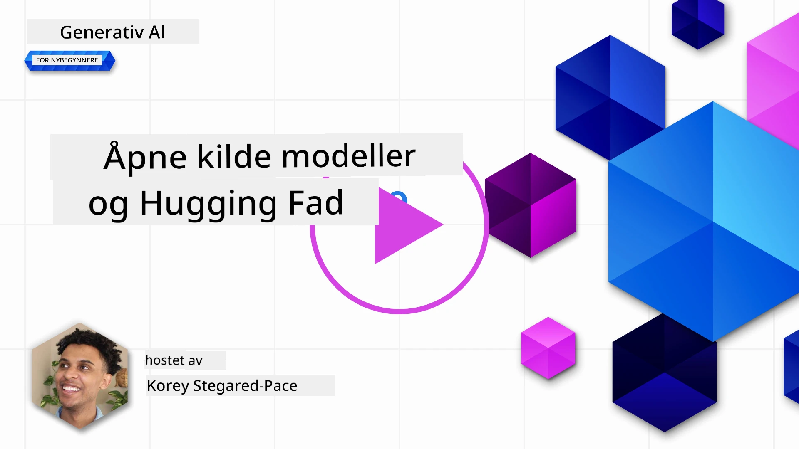
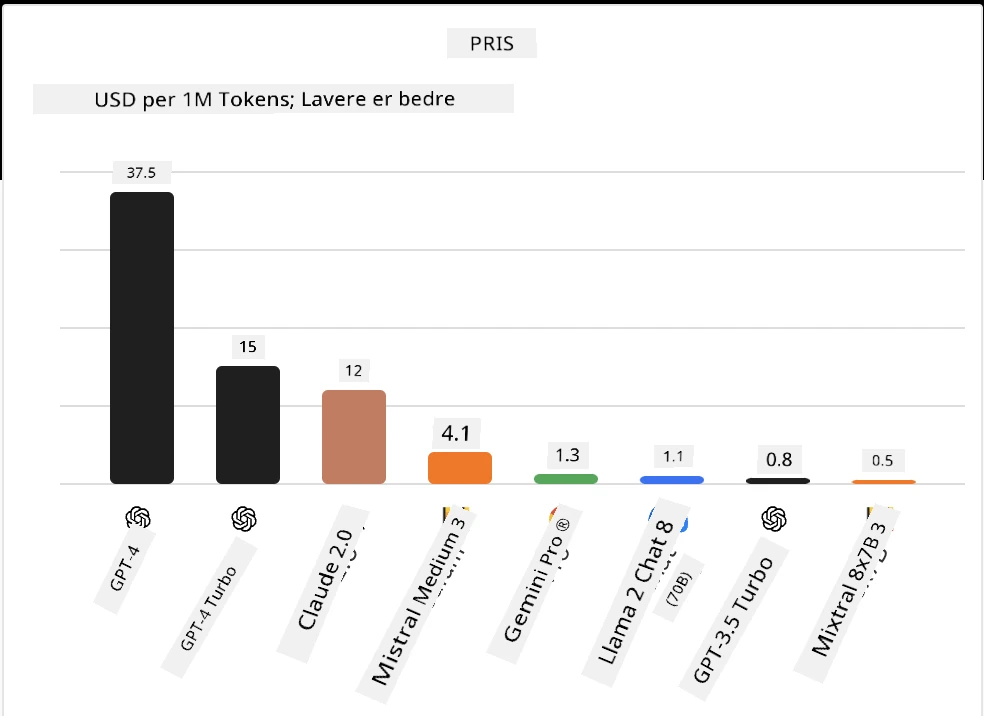
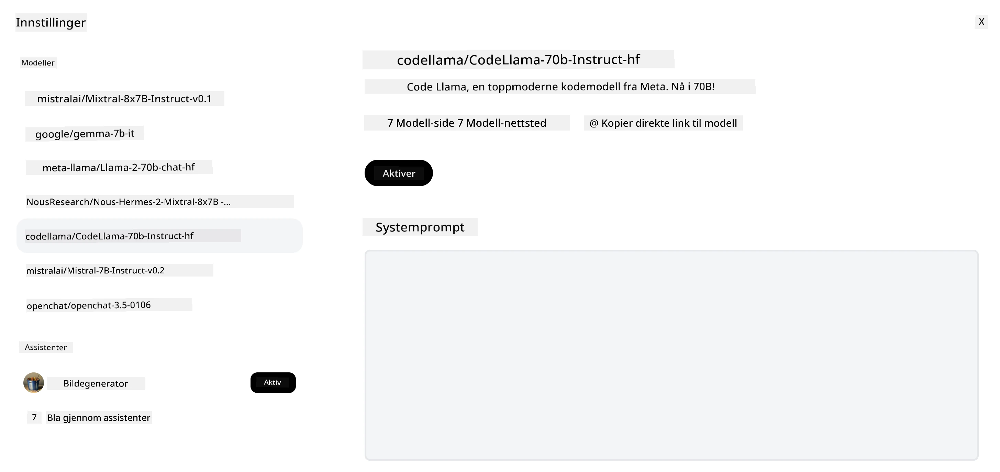
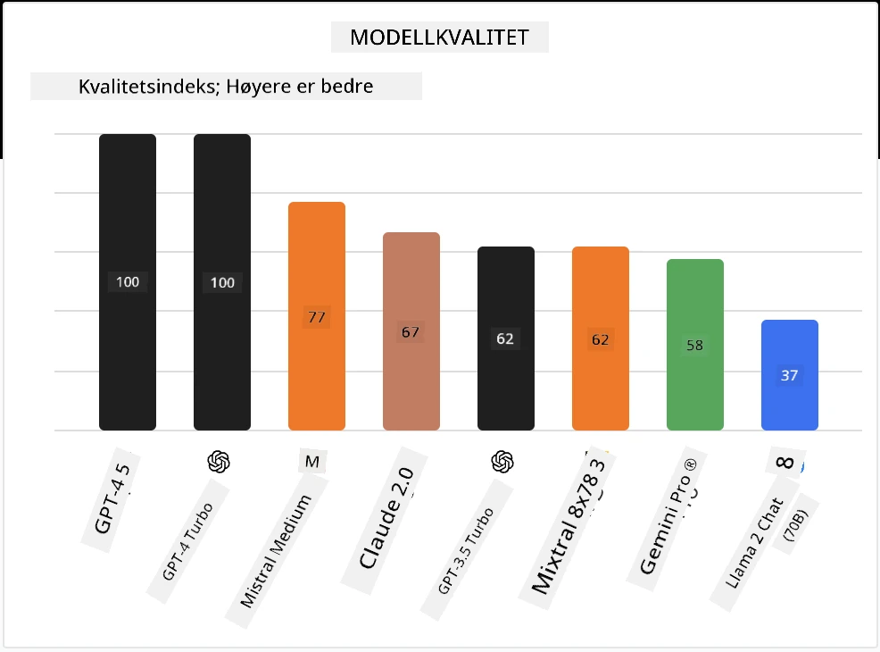

## Introduksjon

Verden av åpen kildekode LLM-er er spennende og i stadig utvikling. Denne leksjonen har som mål å gi en grundig gjennomgang av åpne kildekode-modeller. Hvis du søker informasjon om hvordan proprietære modeller sammenlignes med åpne modeller, gå til leksjonen ["Utforske og sammenligne forskjellige LLM-er"](../02-exploring-and-comparing-different-llms/README.md?WT.mc_id=academic-105485-koreyst). Denne leksjonen vil også dekke temaet finjustering, men en mer detaljert forklaring finner du i leksjonen ["Finjustering av LLM-er"](../18-fine-tuning/README.md?WT.mc_id=academic-105485-koreyst).

## Læringsmål

- Få en forståelse av åpne kildekode-modeller
- Forstå fordelene med å arbeide med åpne kildekode-modeller
- Utforske de åpne modellene som er tilgjengelige på Hugging Face og Microsoft Foundry modellkatalog

## Hva er åpne kildekode-modeller?

Åpen kildekode-programvare har spilt en avgjørende rolle i veksten av teknologi på tvers av ulike felt. Open Source Initiative (OSI) har definert [10 kriterier for programvare](https://web.archive.org/web/20241126001143/https://opensource.org/osd?WT.mc_id=academic-105485-koreyst) for å bli klassifisert som åpen kildekode. Kildekoden må deles åpent under en lisens godkjent av OSI.

Mens utviklingen av LLM-er har lignende elementer som programvareutvikling, er prosessen ikke helt den samme. Dette har ført til mye diskusjon i samfunnet om definisjonen av åpen kildekode i konteksten av LLM-er. For at en modell skal samsvare med den tradisjonelle definisjonen av åpen kildekode, bør følgende informasjon være offentlig tilgjengelig:

- Datasett brukt til å trene modellen.
- Fullstendige modellvekter som en del av treningen.
- Evalueringskoden.
- Finjusteringskoden.
- Fullstendige modellvekter og treningsmetrikk.

Det finnes for øyeblikket bare noen få modeller som oppfyller disse kriteriene. [OLMo-modellen laget av Allen Institute for Artificial Intelligence (AllenAI)](https://huggingface.co/allenai/OLMo-7B?WT.mc_id=academic-105485-koreyst) er en som passer i denne kategorien.

For denne leksjonen vil vi referere til modellene som "åpne modeller" fremover, siden de kanskje ikke oppfyller kriteriene ovenfor på tidspunktet for skriving.

## Fordeler med åpne modeller

**Svært tilpassbare** - Siden åpne modeller slippes med detaljert treningsinformasjon, kan forskere og utviklere endre modellens indre. Dette muliggjør skapelsen av svært spesialiserte modeller som finjusteres for en spesifikk oppgave eller fagområde. Noen eksempler på dette er kodegenerering, matematiske operasjoner og biologi.

**Kostnad** - Kostnaden per token for bruk og distribusjon av disse modellene er lavere enn for proprietære modeller. Når man bygger generative AI-applikasjoner bør man vurdere ytelse versus pris ved bruk av disse modellene for ditt bruksområde.

Kilde: Artificial Analysis

**Fleksibilitet** - Å arbeide med åpne modeller gir deg fleksibilitet til å bruke forskjellige modeller eller kombinere dem. Et eksempel på dette er [HuggingChat Assistants](https://huggingface.co/chat?WT.mc_id=academic-105485-koreyst) hvor en bruker kan velge modellen som brukes direkte i brukergrensesnittet:

## Utforske forskjellige åpne modeller

### Llama 2

[Llama2](https://huggingface.co/meta-llama?WT.mc_id=academic-105485-koreyst), utviklet av Meta, er en åpen modell som er optimalisert for chatbaserte applikasjoner. Dette skyldes finjusteringsmetoden, som inkluderte en stor mengde dialog og menneskelig tilbakemelding. Med denne metoden produserer modellen resultater som stemmer bedre overens med menneskelige forventninger, noe som gir en bedre brukeropplevelse.

Noen eksempler på finjusterte versjoner av Llama inkluderer [Japanese Llama](https://huggingface.co/elyza/ELYZA-japanese-Llama-2-7b?WT.mc_id=academic-105485-koreyst), som spesialiserer seg på japansk, og [Llama Pro](https://huggingface.co/TencentARC/LLaMA-Pro-8B?WT.mc_id=academic-105485-koreyst), som er en forbedret versjon av basismodellen.

### Mistral

[Mistral](https://huggingface.co/mistralai?WT.mc_id=academic-105485-koreyst) er en åpen modell med sterkt fokus på høy ytelse og effektivitet. Den bruker en Mixture-of-Experts-tilnærming som kombinerer en gruppe spesialiserte ekspertmodeller i ett system hvor visse modeller velges ut til bruk basert på inngangen. Dette gjør beregningen mer effektiv ettersom modellene kun håndterer de inngangene de er spesialiserte på.

Noen eksempler på finjusterte versjoner av Mistral inkluderer [BioMistral](https://huggingface.co/BioMistral/BioMistral-7B?text=Mon+nom+est+Thomas+et+mon+principal?WT.mc_id=academic-105485-koreyst), som fokuserer på medisinsk domene, og [OpenMath Mistral](https://huggingface.co/nvidia/OpenMath-Mistral-7B-v0.1-hf?WT.mc_id=academic-105485-koreyst), som utfører matematiske beregninger.

### Falcon

[Falcon](https://huggingface.co/tiiuae?WT.mc_id=academic-105485-koreyst) er en LLM laget av Technology Innovation Institute (**TII**). Falcon-40B ble trent på 40 milliarder parametere, og har vist seg å prestere bedre enn GPT-3 med mindre beregningsressurser. Dette skyldes bruken av FlashAttention-algoritmen og multiquery-attention som reduserer minnekravene ved inferenstid. Med denne reduserte inferenstiden egner Falcon-40B seg for chatteapplikasjoner.

Noen eksempler på finjusterte versjoner av Falcon er [OpenAssistant](https://huggingface.co/OpenAssistant/falcon-40b-sft-top1-560?WT.mc_id=academic-105485-koreyst), en assistent basert på åpne modeller, og [GPT4ALL](https://huggingface.co/nomic-ai/gpt4all-falcon?WT.mc_id=academic-105485-koreyst), som leverer høyere ytelse enn basismodellen.

## Hvordan velge

Det finnes ikke ett riktig svar på hvordan man velger en åpen modell. Et godt sted å starte er ved å bruke filterfunkjonen etter oppgave i Microsoft Foundry sin modellkatalog. Dette vil hjelpe deg å forstå hvilke typer oppgaver modellen er trent for. Hugging Face vedlikeholder også en LLM-ledertavle som viser de beste modellene basert på visse metrikker.

Når du ønsker å sammenligne LLM-er på tvers av ulike typer, er [Artificial Analysis](https://artificialanalysis.ai/?WT.mc_id=academic-105485-koreyst) en annen god ressurs:

Kilde: Artificial Analysis

Hvis du jobber med et spesifikt bruksområde, kan det være effektivt å søke etter finjusterte versjoner som fokuserer på samme område. Å eksperimentere med flere åpne modeller for å se hvordan de presterer i henhold til dine og brukernes forventninger er også en god praksis.

## Neste steg

Det beste med åpne modeller er at du kan komme raskt i gang med dem. Sjekk ut [Microsoft Foundry modellkatalog](https://ai.azure.com?WT.mc_id=academic-105485-koreyst), som inneholder en spesifikk samling fra Hugging Face med disse modellene vi har diskutert her.

## Læringen stopper ikke her, fortsett reisen

Etter å ha fullført denne leksjonen, sjekk ut vår [Generative AI Learning collection](https://aka.ms/genai-collection?WT.mc_id=academic-105485-koreyst) for å fortsette å øke din kunnskap om Generativ AI!

---

<!-- CO-OP TRANSLATOR DISCLAIMER START -->
**Ansvarsfraskrivelse**:
Dette dokumentet er oversatt ved hjelp av AI-oversettelsestjenesten [Co-op Translator](https://github.com/Azure/co-op-translator). Selv om vi streber etter nøyaktighet, vær oppmerksom på at automatiske oversettelser kan inneholde feil eller unøyaktigheter. Det opprinnelige dokumentet på originalspråket skal betraktes som den autoritative kilden. For kritisk informasjon anbefales profesjonell menneskelig oversettelse. Vi er ikke ansvarlige for eventuelle misforståelser eller feiltolkninger som oppstår ved bruk av denne oversettelsen.
<!-- CO-OP TRANSLATOR DISCLAIMER END -->