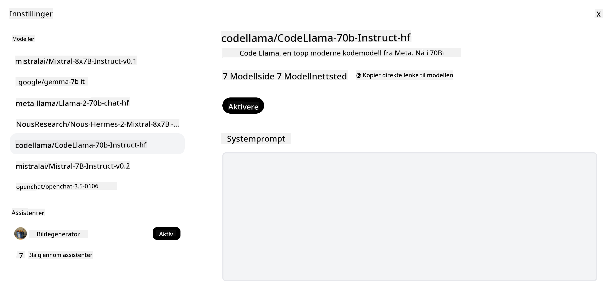
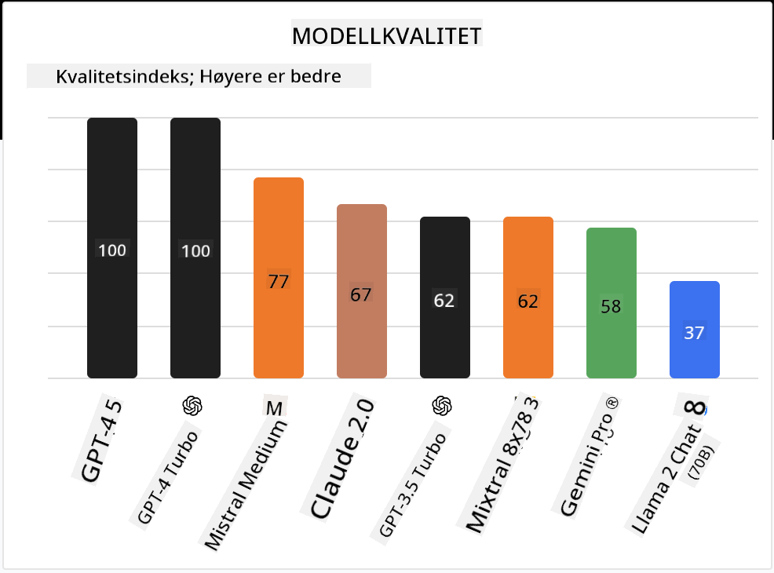

<!--
CO_OP_TRANSLATOR_METADATA:
{
  "original_hash": "0bba96e53ab841d99db731892a51fab8",
  "translation_date": "2025-06-25T23:58:30+00:00",
  "source_file": "16-open-source-models/README.md",
  "language_code": "no"
}
-->

## Introduksjon

Verden av open-source LLMs er spennende og stadig i utvikling. Denne leksjonen har som mål å gi en grundig innsikt i open source-modeller. Hvis du leter etter informasjon om hvordan proprietære modeller sammenlignes med open source-modeller, gå til leksjonen ["Utforske og Sammenligne Ulike LLMs"](../02-exploring-and-comparing-different-llms/README.md?WT.mc_id=academic-105485-koreyst). Denne leksjonen vil også dekke temaet finjustering, men en mer detaljert forklaring kan finnes i leksjonen ["Finjustering av LLMs"](../18-fine-tuning/README.md?WT.mc_id=academic-105485-koreyst).

## Læringsmål

- Få en forståelse av open source-modeller
- Forstå fordelene ved å arbeide med open source-modeller
- Utforske de åpne modellene tilgjengelig på Hugging Face og Azure AI Studio

## Hva er Open Source-modeller?

Open source-programvare har spilt en avgjørende rolle i veksten av teknologi på tvers av ulike felt. Open Source Initiative (OSI) har definert [10 kriterier for programvare](https://web.archive.org/web/20241126001143/https://opensource.org/osd?WT.mc_id=academic-105485-koreyst) for å bli klassifisert som open source. Kildekoden må deles åpent under en lisens godkjent av OSI.

Mens utviklingen av LLMs har lignende elementer som utvikling av programvare, er prosessen ikke helt den samme. Dette har ført til mye diskusjon i samfunnet om definisjonen av open source i konteksten av LLMs. For at en modell skal være i tråd med den tradisjonelle definisjonen av open source, bør følgende informasjon være offentlig tilgjengelig:

- Datasett brukt til å trene modellen.
- Full modellvekter som en del av treningen.
- Evalueringskoden.
- Finjusteringskoden.
- Full modellvekter og treningsmetrikker.

Det er for tiden bare noen få modeller som oppfyller disse kriteriene. [OLMo-modellen opprettet av Allen Institute for Artificial Intelligence (AllenAI)](https://huggingface.co/allenai/OLMo-7B?WT.mc_id=academic-105485-koreyst) er en som passer inn i denne kategorien.

For denne leksjonen vil vi referere til modellene som "åpne modeller" fremover, da de kanskje ikke oppfyller kriteriene ovenfor på tidspunktet for skriving.

## Fordeler med Åpne Modeller

**Høyt Tilpassbare** - Siden åpne modeller blir utgitt med detaljert treningsinformasjon, kan forskere og utviklere endre modellens interne strukturer. Dette gjør det mulig å lage høyt spesialiserte modeller som er finjustert for en spesifikk oppgave eller studieområde. Noen eksempler på dette er kodegenerering, matematiske operasjoner og biologi.

**Kostnad** - Kostnaden per token for bruk og distribusjon av disse modellene er lavere enn for proprietære modeller. Når du bygger Generative AI-applikasjoner, bør du vurdere ytelse kontra pris når du arbeider med disse modellene på ditt brukstilfelle.

Kilde: Artificial Analysis

**Fleksibilitet** - Å arbeide med åpne modeller gir deg fleksibilitet når det gjelder å bruke forskjellige modeller eller kombinere dem. Et eksempel på dette er [HuggingChat Assistants](https://huggingface.co/chat?WT.mc_id=academic-105485-koreyst) hvor en bruker kan velge modellen som brukes direkte i brukergrensesnittet:

## Utforske Ulike Åpne Modeller

### Llama 2

[LLama2](https://huggingface.co/meta-llama?WT.mc_id=academic-105485-koreyst), utviklet av Meta, er en åpen modell som er optimalisert for chatbaserte applikasjoner. Dette skyldes dens finjusteringsmetode, som inkluderte en stor mengde dialog og menneskelig tilbakemelding. Med denne metoden produserer modellen flere resultater som er i tråd med menneskelige forventninger, noe som gir en bedre brukeropplevelse.

Noen eksempler på finjusterte versjoner av Llama inkluderer [Japanese Llama](https://huggingface.co/elyza/ELYZA-japanese-Llama-2-7b?WT.mc_id=academic-105485-koreyst), som spesialiserer seg på japansk, og [Llama Pro](https://huggingface.co/TencentARC/LLaMA-Pro-8B?WT.mc_id=academic-105485-koreyst), som er en forbedret versjon av basismodellen.

### Mistral

[Mistral](https://huggingface.co/mistralai?WT.mc_id=academic-105485-koreyst) er en åpen modell med et sterkt fokus på høy ytelse og effektivitet. Den bruker Mixture-of-Experts-tilnærmingen som kombinerer en gruppe spesialiserte ekspertmodeller i ett system hvor, avhengig av input, visse modeller velges for å brukes. Dette gjør beregningen mer effektiv ettersom modeller kun adresserer inputene de er spesialiserte på.

Noen eksempler på finjusterte versjoner av Mistral inkluderer [BioMistral](https://huggingface.co/BioMistral/BioMistral-7B?text=Mon+nom+est+Thomas+et+mon+principal?WT.mc_id=academic-105485-koreyst), som er fokusert på det medisinske domenet, og [OpenMath Mistral](https://huggingface.co/nvidia/OpenMath-Mistral-7B-v0.1-hf?WT.mc_id=academic-105485-koreyst), som utfører matematisk beregning.

### Falcon

[Falcon](https://huggingface.co/tiiuae?WT.mc_id=academic-105485-koreyst) er en LLM opprettet av Technology Innovation Institute (**TII**). Falcon-40B ble trent på 40 milliarder parametere som har vist seg å prestere bedre enn GPT-3 med mindre beregningsbudsjett. Dette skyldes bruken av FlashAttention-algoritmen og multiquery attention som gjør det mulig å redusere minnekravene ved inferenstid. Med denne reduserte inferenstiden er Falcon-40B egnet for chatapplikasjoner.

Noen eksempler på finjusterte versjoner av Falcon er [OpenAssistant](https://huggingface.co/OpenAssistant/falcon-40b-sft-top1-560?WT.mc_id=academic-105485-koreyst), en assistent bygget på åpne modeller, og [GPT4ALL](https://huggingface.co/nomic-ai/gpt4all-falcon?WT.mc_id=academic-105485-koreyst), som leverer høyere ytelse enn basismodellen.

## Hvordan Velge

Det finnes ikke ett svar for valg av en åpen modell. Et godt sted å starte er ved å bruke Azure AI Studio's filter etter oppgavefunksjon. Dette vil hjelpe deg å forstå hvilke typer oppgaver modellen har blitt trent for. Hugging Face opprettholder også en LLM-leaderboard som viser deg de best presterende modellene basert på visse metrikker.

Når du ser etter å sammenligne LLMs på tvers av de forskjellige typene, er [Artificial Analysis](https://artificialanalysis.ai/?WT.mc_id=academic-105485-koreyst) en annen flott ressurs:

Kilde: Artificial Analysis

Hvis du arbeider med et spesifikt brukstilfelle, kan det være effektivt å søke etter finjusterte versjoner som er fokusert på samme område. Å eksperimentere med flere åpne modeller for å se hvordan de presterer i henhold til dine og brukernes forventninger er en annen god praksis.

## Neste Steg

Det beste med åpne modeller er at du kan komme i gang med å arbeide med dem ganske raskt. Sjekk ut [Azure AI Studio Model Catalog](https://ai.azure.com?WT.mc_id=academic-105485-koreyst), som har en spesifikk Hugging Face-samling med disse modellene vi diskuterte her.

## Læringen stopper ikke her, fortsett Reisen

Etter å ha fullført denne leksjonen, sjekk ut vår [Generative AI Learning collection](https://aka.ms/genai-collection?WT.mc_id=academic-105485-koreyst) for å fortsette å øke din kunnskap om Generative AI!

**Ansvarsfraskrivelse**:  
Dette dokumentet er oversatt ved hjelp av AI-oversettelsestjenesten [Co-op Translator](https://github.com/Azure/co-op-translator). Selv om vi streber etter nøyaktighet, vennligst vær oppmerksom på at automatiske oversettelser kan inneholde feil eller unøyaktigheter. Det originale dokumentet på sitt opprinnelige språk bør betraktes som den autoritative kilden. For kritisk informasjon anbefales profesjonell menneskelig oversettelse. Vi er ikke ansvarlige for eventuelle misforståelser eller feiltolkninger som oppstår ved bruk av denne oversettelsen.