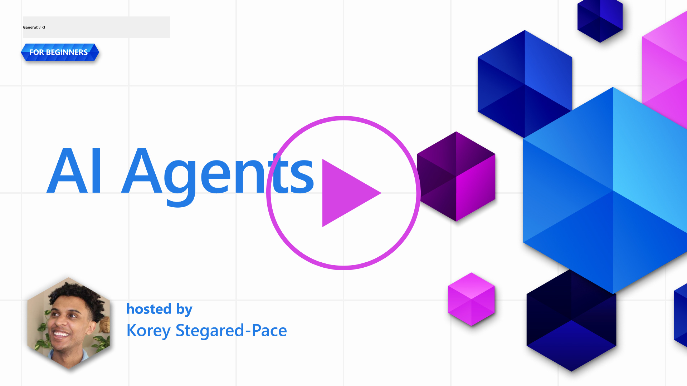
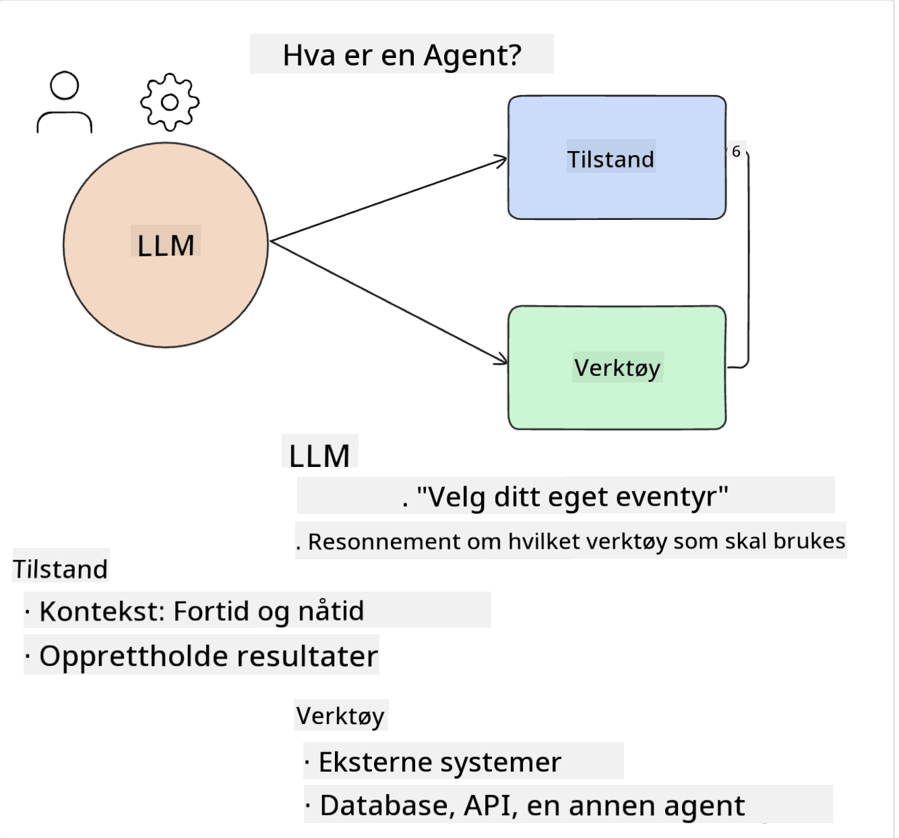
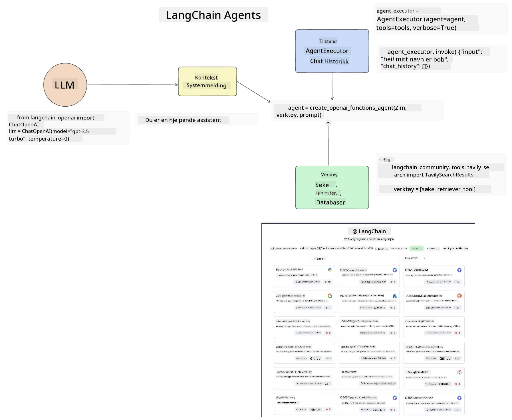
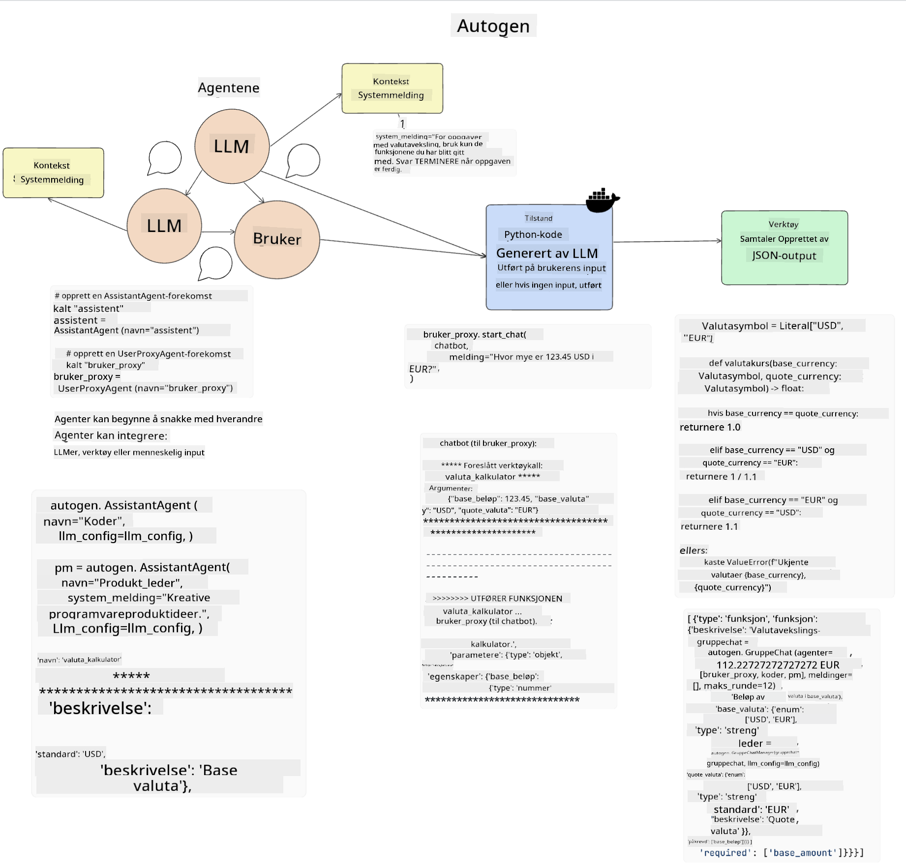
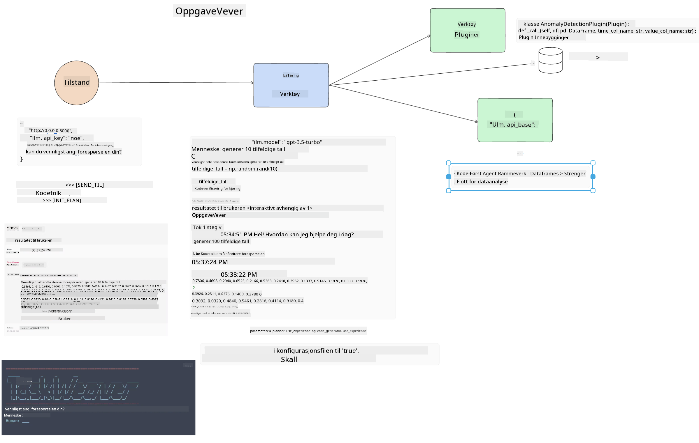
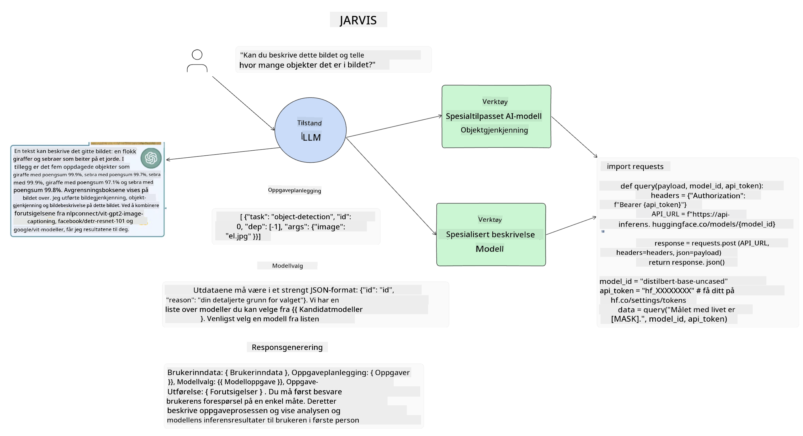

<!--
CO_OP_TRANSLATOR_METADATA:
{
  "original_hash": "11f03c81f190d9cbafd0f977dcbede6c",
  "translation_date": "2025-06-26T00:19:54+00:00",
  "source_file": "17-ai-agents/README.md",
  "language_code": "no"
}
-->
[](https://aka.ms/gen-ai-lesson17-gh?WT.mc_id=academic-105485-koreyst)

## Introduksjon

AI-agenter representerer en spennende utvikling innen Generativ AI, som gjør det mulig for store språkmodeller (LLMs) å utvikle seg fra assistenter til agenter som kan utføre handlinger. AI-agent-rammeverk gjør det mulig for utviklere å lage applikasjoner som gir LLMs tilgang til verktøy og tilstandsstyring. Disse rammeverkene forbedrer også synligheten, slik at brukere og utviklere kan overvåke handlingene som er planlagt av LLMs, og dermed forbedre opplevelsesstyringen.

Leksjonen vil dekke følgende områder:

- Forstå hva en AI-agent er - Hva er egentlig en AI-agent?
- Utforske fire forskjellige AI-agent-rammeverk - Hva gjør dem unike?
- Anvende disse AI-agentene på forskjellige brukstilfeller - Når bør vi bruke AI-agenter?

## Læringsmål

Etter å ha tatt denne leksjonen, vil du kunne:

- Forklare hva AI-agenter er og hvordan de kan brukes.
- Ha en forståelse av forskjellene mellom noen av de populære AI-agent-rammeverkene, og hvordan de skiller seg fra hverandre.
- Forstå hvordan AI-agenter fungerer for å bygge applikasjoner med dem.

## Hva er AI-agenter?

AI-agenter er et veldig spennende felt innen Generativ AI. Med denne spenningen følger noen ganger forvirring om termer og deres anvendelse. For å holde ting enkelt og inkluderende for de fleste verktøy som refererer til AI-agenter, skal vi bruke denne definisjonen:

AI-agenter lar store språkmodeller (LLMs) utføre oppgaver ved å gi dem tilgang til en **tilstand** og **verktøy**.



La oss definere disse begrepene:

**Store språkmodeller** - Dette er modellene som refereres til gjennom hele dette kurset, som GPT-3.5, GPT-4, Llama-2, osv.

**Tilstand** - Dette refererer til konteksten som LLM-en jobber i. LLM-en bruker konteksten av sine tidligere handlinger og den nåværende konteksten, og styrer sin beslutningstaking for påfølgende handlinger. AI-agent-rammeverk lar utviklere vedlikeholde denne konteksten lettere.

**Verktøy** - For å fullføre oppgaven som brukeren har bedt om og som LLM-en har planlagt, trenger LLM-en tilgang til verktøy. Noen eksempler på verktøy kan være en database, en API, en ekstern applikasjon eller til og med en annen LLM!

Disse definisjonene vil forhåpentligvis gi deg et godt grunnlag fremover når vi ser på hvordan de implementeres. La oss utforske noen forskjellige AI-agent-rammeverk:

## LangChain-agenter

[LangChain-agenter](https://python.langchain.com/docs/how_to/#agents?WT.mc_id=academic-105485-koreyst) er en implementering av definisjonene vi ga ovenfor.

For å administrere **tilstanden**, bruker den en innebygd funksjon kalt `AgentExecutor`. Denne aksepterer den definerte `agent` og de `tools` som er tilgjengelige for den.

`Agent Executor` lagrer også chat-historikken for å gi konteksten av chatten.



LangChain tilbyr en [katalog over verktøy](https://integrations.langchain.com/tools?WT.mc_id=academic-105485-koreyst) som kan importeres i din applikasjon der LLM-en kan få tilgang til. Disse er laget av samfunnet og av LangChain-teamet.

Du kan deretter definere disse verktøyene og sende dem til `Agent Executor`.

Synlighet er et annet viktig aspekt når vi snakker om AI-agenter. Det er viktig for applikasjonsutviklere å forstå hvilket verktøy LLM-en bruker og hvorfor. For det har teamet hos LangChain utviklet LangSmith.

## AutoGen

Det neste AI-agent-rammeverket vi skal diskutere er [AutoGen](https://microsoft.github.io/autogen/?WT.mc_id=academic-105485-koreyst). Hovedfokuset til AutoGen er samtaler. Agenter er både **samtalbare** og **tilpassbare**.

**Samtalbare -** LLM-er kan starte og fortsette en samtale med en annen LLM for å fullføre en oppgave. Dette gjøres ved å opprette `AssistantAgents` og gi dem en spesifikk systemmelding.

```python

autogen.AssistantAgent( name="Coder", llm_config=llm_config, ) pm = autogen.AssistantAgent( name="Product_manager", system_message="Creative in software product ideas.", llm_config=llm_config, )

```

**Tilpassbare** - Agenter kan defineres ikke bare som LLM-er, men også som en bruker eller et verktøy. Som utvikler kan du definere en `UserProxyAgent` som er ansvarlig for å samhandle med brukeren for tilbakemelding i fullføringen av en oppgave. Denne tilbakemeldingen kan enten fortsette utførelsen av oppgaven eller stoppe den.

```python
user_proxy = UserProxyAgent(name="user_proxy")
```

### Tilstand og verktøy

For å endre og administrere tilstand, genererer en assistent-agent Python-kode for å fullføre oppgaven.

Her er et eksempel på prosessen:



#### LLM definert med en systemmelding

```python
system_message="For weather related tasks, only use the functions you have been provided with. Reply TERMINATE when the task is done."
```

Denne systemmeldingen leder denne spesifikke LLM-en til hvilke funksjoner som er relevante for dens oppgave. Husk, med AutoGen kan du ha flere definerte AssistantAgents med forskjellige systemmeldinger.

#### Chat startes av brukeren

```python
user_proxy.initiate_chat( chatbot, message="I am planning a trip to NYC next week, can you help me pick out what to wear? ", )

```

Denne meldingen fra user_proxy (menneske) er det som vil starte prosessen med at agenten utforsker de mulige funksjonene den bør utføre.

#### Funksjon utføres

```bash
chatbot (to user_proxy):

***** Suggested tool Call: get_weather ***** Arguments: {"location":"New York City, NY","time_periond:"7","temperature_unit":"Celsius"} ******************************************************** --------------------------------------------------------------------------------

>>>>>>>> EXECUTING FUNCTION get_weather... user_proxy (to chatbot): ***** Response from calling function "get_weather" ***** 112.22727272727272 EUR ****************************************************************

```

Når den innledende chatten er behandlet, vil agenten sende det foreslåtte verktøyet for å kalle. I dette tilfellet er det en funksjon kalt `get_weather`. Depending on your configuration, this function can be automatically executed and read by the Agent or can be executed based on user input.

You can find a list of [AutoGen code samples](https://microsoft.github.io/autogen/docs/Examples/?WT.mc_id=academic-105485-koreyst) to further explore how to get started building.

## Taskweaver

The next agent framework we will explore is [Taskweaver](https://microsoft.github.io/TaskWeaver/?WT.mc_id=academic-105485-koreyst). It is known as a "code-first" agent because instead of working strictly with `strings` , it can work with DataFrames in Python. This becomes extremely useful for data analysis and generation tasks. This can be things like creating graphs and charts or generating random numbers.

### State and Tools

To manage the state of the conversation, TaskWeaver uses the concept of a `Planner`. The `Planner` is a LLM that takes the request from the users and maps out the tasks that need to be completed to fulfill this request.

To complete the tasks the `Planner` is exposed to the collection of tools called `Plugins`. Dette kan være Python-klasser eller en generell kodefortolker. Disse pluginene lagres som embeddings slik at LLM-en bedre kan søke etter riktig plugin.



Her er et eksempel på en plugin for å håndtere anomali-deteksjon:

```python
class AnomalyDetectionPlugin(Plugin): def __call__(self, df: pd.DataFrame, time_col_name: str, value_col_name: str):
```

Koden verifiseres før utførelse. En annen funksjon for å administrere kontekst i Taskweaver er `experience`. Experience allows for the context of a conversation to be stored over to the long term in a YAML file. This can be configured so that the LLM improves over time on certain tasks given that it is exposed to prior conversations.

## JARVIS

The last agent framework we will explore is [JARVIS](https://github.com/microsoft/JARVIS?tab=readme-ov-file?WT.mc_id=academic-105485-koreyst). What makes JARVIS unique is that it uses an LLM to manage the `state` av samtalen og de `tools` er andre AI-modeller. Hver av AI-modellene er spesialiserte modeller som utfører visse oppgaver som objektgjenkjenning, transkripsjon eller bildebeskrivelse.



LLM-en, som er en generell formålsmodell, mottar forespørselen fra brukeren og identifiserer den spesifikke oppgaven og eventuelle argumenter/data som trengs for å fullføre oppgaven.

```python
[{"task": "object-detection", "id": 0, "dep": [-1], "args": {"image": "e1.jpg" }}]
```

LLM-en formaterer deretter forespørselen på en måte som den spesialiserte AI-modellen kan tolke, for eksempel JSON. Når AI-modellen har returnert sin prediksjon basert på oppgaven, mottar LLM-en svaret.

Hvis flere modeller kreves for å fullføre oppgaven, vil den også tolke svaret fra disse modellene før de bringes sammen for å generere svaret til brukeren.

Eksempelet nedenfor viser hvordan dette ville fungere når en bruker ber om en beskrivelse og telling av objektene i et bilde:

## Oppgave

For å fortsette læringen om AI-agenter kan du bygge med AutoGen:

- En applikasjon som simulerer et forretningsmøte med forskjellige avdelinger i en utdanningsstart-up.
- Opprette systemmeldinger som veileder LLMs i å forstå forskjellige personas og prioriteringer, og gjøre det mulig for brukeren å presentere en ny produktidé.
- LLM-en skal deretter generere oppfølgingsspørsmål fra hver avdeling for å finjustere og forbedre presentasjonen og produktidéen.

## Læringen stopper ikke her, fortsett reisen

Etter å ha fullført denne leksjonen, sjekk ut vår [Generative AI Learning collection](https://aka.ms/genai-collection?WT.mc_id=academic-105485-koreyst) for å fortsette å heve din kunnskap om Generativ AI!

**Ansvarsfraskrivelse**:  
Dette dokumentet er oversatt ved hjelp av AI-oversettelsestjenesten [Co-op Translator](https://github.com/Azure/co-op-translator). Selv om vi streber etter nøyaktighet, vær oppmerksom på at automatiserte oversettelser kan inneholde feil eller unøyaktigheter. Det originale dokumentet på sitt opprinnelige språk bør betraktes som den autoritative kilden. For kritisk informasjon anbefales profesjonell menneskelig oversettelse. Vi er ikke ansvarlige for misforståelser eller feiltolkninger som oppstår ved bruk av denne oversettelsen.