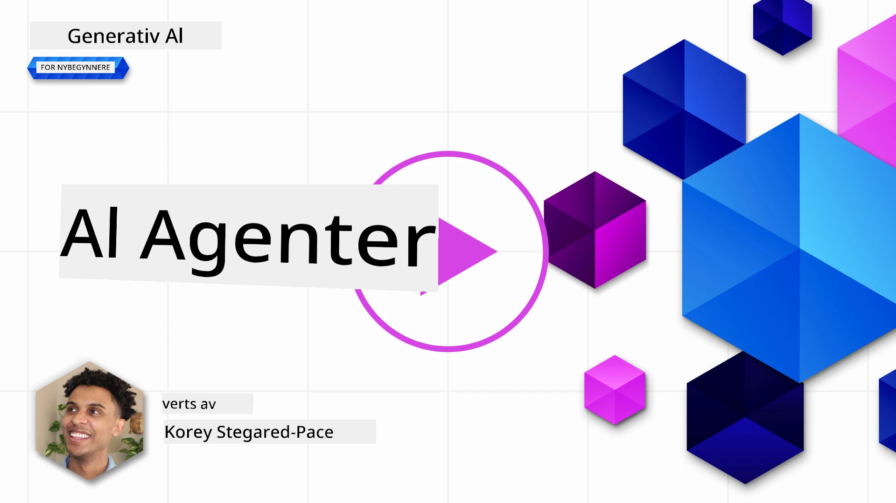
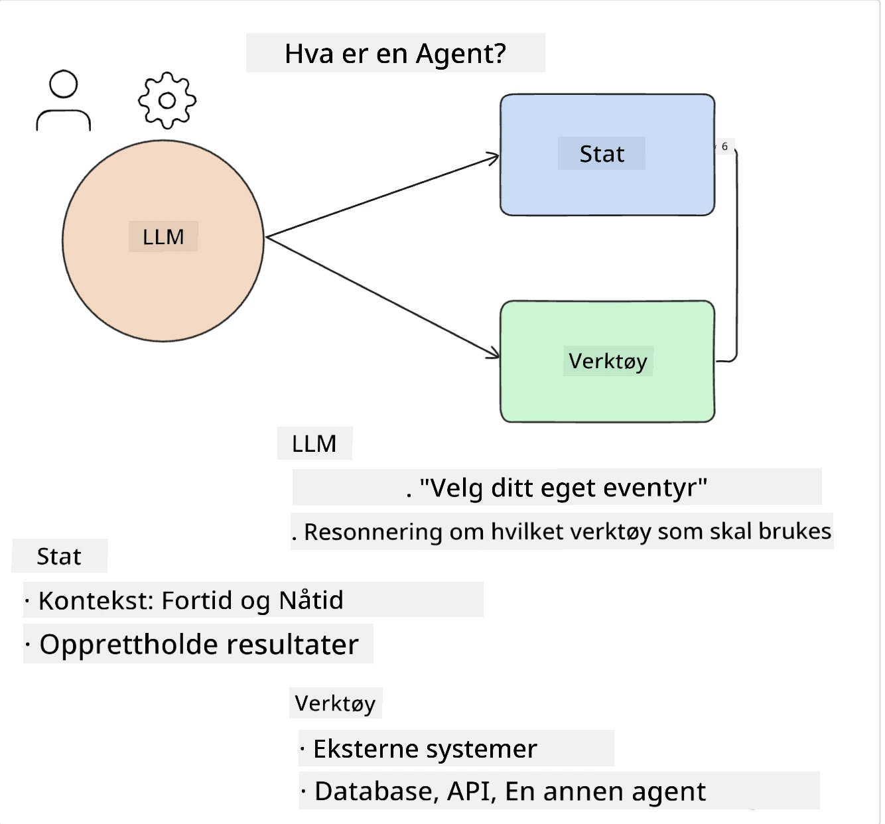
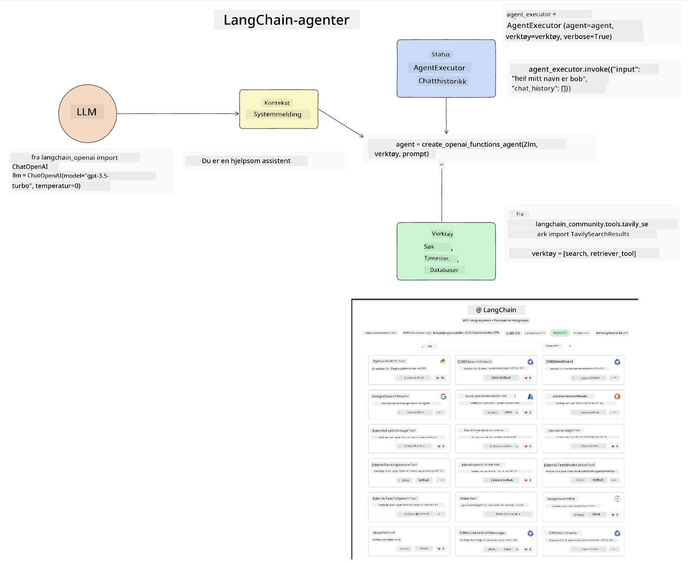
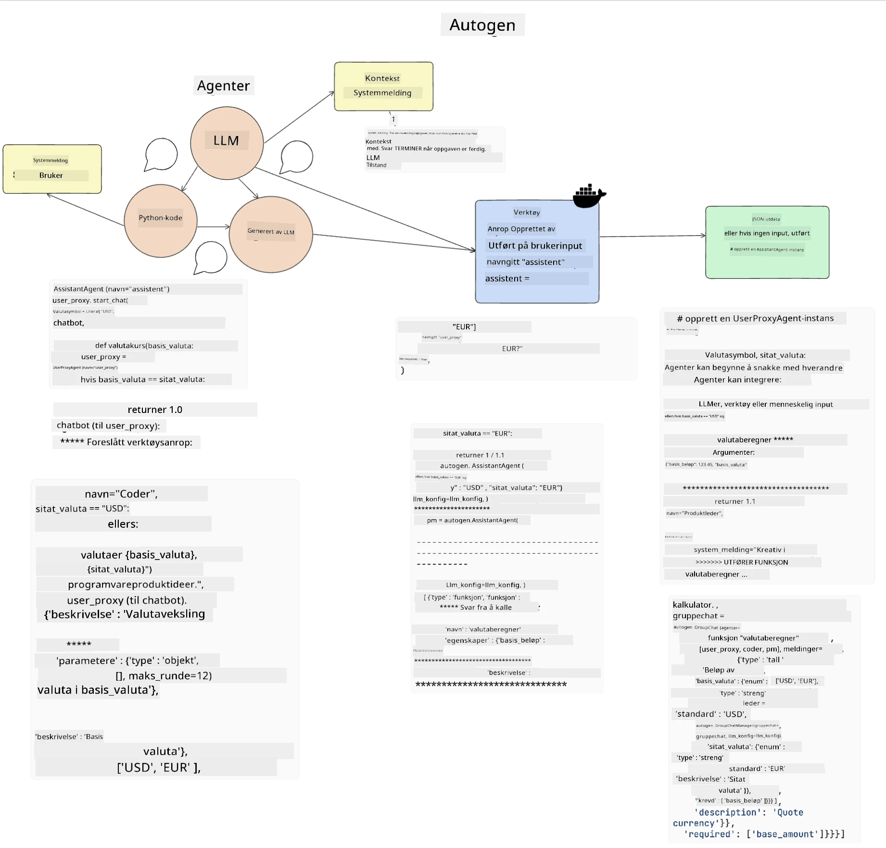
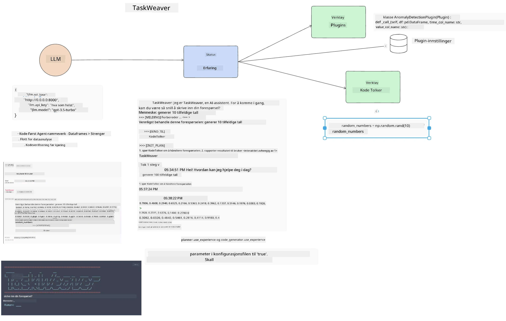
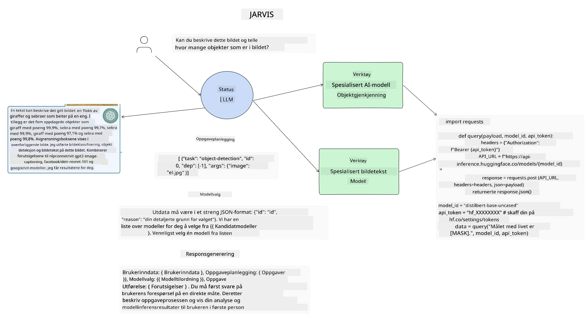

[](https://youtu.be/yAXVW-lUINc?si=bOtW9nL6jc3XJgOM)

## Introduksjon

AI-agenter representerer en spennende utvikling innen Generativ AI, som gjør at store språkmodeller (LLMs) kan utvikle seg fra assistenter til agenter som kan utføre handlinger. AI-agentrammeverk gjør det mulig for utviklere å lage apper som gir LLMs tilgang til verktøy og tilstandsadministrasjon. Disse rammeverkene øker også synligheten, slik at brukere og utviklere kan overvåke handlingene som LLMs planlegger, og dermed forbedre opplevelsesstyringen.

Lærestunden vil dekke følgende områder:

- Forstå hva en AI-agent er – Hva er egentlig en AI-agent?
- Utforske fire forskjellige AI-agentrammeverk – Hva gjør dem unike?
- Anvende disse AI-agentene på ulike bruksområder – Når bør vi bruke AI-agenter?

## Læringsmål

Etter å ha tatt denne lærestunden vil du kunne:

- Forklare hva AI-agenter er og hvordan de kan brukes.
- Ha en forståelse av forskjellene mellom noen populære AI-agentrammeverk, og hvordan de skiller seg.
- Forstå hvordan AI-agenter fungerer for å kunne bygge applikasjoner med dem.

## Hva er AI-agenter?

AI-agenter er et svært spennende felt innen Generativ AI. Med denne spenningen følger noen ganger en forvirring rundt begreper og deres anvendelse. For å holde det enkelt og inkludere de fleste verktøy som refererer til AI-agenter, vil vi bruke denne definisjonen:

AI-agenter lar store språkmodeller (LLMs) utføre oppgaver ved å gi dem tilgang til en **tilstand** og **verktøy**.



La oss definere disse begrepene:

**Store språkmodeller** – Dette er modellene det refereres til gjennom hele kurset, slik som GPT-3.5, GPT-4, Llama-2 osv.

**Tilstand** – Dette refererer til konteksten som LLM-en jobber i. LLM bruker konteksten fra sine tidligere handlinger og nåværende kontekst, som styrer beslutningstakingen for senere handlinger. AI-agentrammeverk gjør det enklere for utviklere å opprettholde denne konteksten.

**Verktøy** – For å fullføre oppgaven som brukeren har bedt om og som LLM har planlagt, trenger LLM tilgang til verktøy. Noen eksempler på verktøy kan være en database, en API, en ekstern applikasjon eller til og med en annen LLM!

Disse definisjonene vil forhåpentligvis gi deg et godt fundament fremover når vi ser på hvordan de implementeres. La oss utforske noen forskjellige AI-agentrammeverk:

## LangChain Agents

[LangChain Agents](https://python.langchain.com/docs/how_to/#agents?WT.mc_id=academic-105485-koreyst) er en implementering av definisjonene vi ga over.

For å administrere **tilstanden** bruker den en innebygd funksjon kalt `AgentExecutor`. Denne tar imot den definerte `agent` og `verktøyene` som er tilgjengelige for den.

`Agent Executor` lagrer også chatthistorikken for å gi konteksten av chatten.



LangChain tilbyr en [verktøykatalog](https://integrations.langchain.com/tools?WT.mc_id=academic-105485-koreyst) som kan importeres til applikasjonen din, hvor LLM kan få tilgang til dem. Disse er laget av fellesskapet og LangChain-teamet.

Du kan så definere disse verktøyene og sende dem til `Agent Executor`.

Synlighet er en annen viktig aspekt når man snakker om AI-agenter. Det er viktig for applikasjonsutviklere å forstå hvilket verktøy LLM bruker og hvorfor. For dette har teamet hos LangChain utviklet LangSmith.

## AutoGen

Det neste AI-agentrammeverket vi skal diskutere er [AutoGen](https://microsoft.github.io/autogen/?WT.mc_id=academic-105485-koreyst). Hovedfokuset til AutoGen er samtaler. Agenter er både **samtalebare** og **tilpassbare**.

**Samtalebare** – LLMs kan starte og fortsette en samtale med en annen LLM for å fullføre en oppgave. Dette gjøres ved å lage `AssistantAgents` og gi dem en spesifikk systemmelding.

```python

autogen.AssistantAgent( name="Coder", llm_config=llm_config, ) pm = autogen.AssistantAgent( name="Product_manager", system_message="Creative in software product ideas.", llm_config=llm_config, )

```

**Tilpassbare** – Agenter kan defineres ikke bare som LLMs, men også som en bruker eller et verktøy. Som utvikler kan du definere en `UserProxyAgent` som er ansvarlig for å samhandle med brukeren for tilbakemelding i å fullføre en oppgave. Denne tilbakemeldingen kan enten fortsette utførelsen av oppgaven eller stoppe den.

```python
user_proxy = UserProxyAgent(name="user_proxy")
```

### Tilstand og verktøy

For å endre og administrere tilstanden genererer en assistentagent Python-kode for å fullføre oppgaven.

Her er et eksempel på prosessen:



#### LLM definert med en systemmelding

```python
system_message="For weather related tasks, only use the functions you have been provided with. Reply TERMINATE when the task is done."
```

Denne systemmeldingen styrer denne spesifikke LLM-en til hvilke funksjoner som er relevante for oppgaven. Husk, med AutoGen kan du ha flere definerte AssistantAgents med forskjellige systemmeldinger.

#### Chat initieres av bruker

```python
user_proxy.initiate_chat( chatbot, message="I am planning a trip to NYC next week, can you help me pick out what to wear? ", )

```

Denne meldingen fra user_proxy (menneske) er det som starter prosessen for agenten til å utforske mulige funksjoner som den bør utføre.

#### Funksjon utføres

```bash
chatbot (to user_proxy):

***** Suggested tool Call: get_weather ***** Arguments: {"location":"New York City, NY","time_periond:"7","temperature_unit":"Celsius"} ******************************************************** --------------------------------------------------------------------------------

>>>>>>>> EXECUTING FUNCTION get_weather... user_proxy (to chatbot): ***** Response from calling function "get_weather" ***** 112.22727272727272 EUR ****************************************************************

```

Når den innledende chatten er behandlet, vil agenten sende den foreslåtte funksjonen som skal kalles. I dette tilfellet er det en funksjon kalt `get_weather`. Avhengig av konfigurasjonen din kan denne funksjonen kjøres automatisk og leses av agenten, eller den kan utføres på grunnlag av brukerens input.

Du kan finne en liste over [AutoGen kodesamples](https://microsoft.github.io/autogen/docs/Examples/?WT.mc_id=academic-105485-koreyst) for å utforske videre hvordan du kommer i gang med bygging.

## Taskweaver

Det neste agentrammeverket vi skal utforske er [Taskweaver](https://microsoft.github.io/TaskWeaver/?WT.mc_id=academic-105485-koreyst). Det er kjent som et "kode-først"-agent fordi det i stedet for å jobbe strengt med `strenger`, kan jobbe med DataFrames i Python. Dette blir ekstremt nyttig for dataanalyse- og genereringsoppgaver. Dette kan være ting som å lage grafer og diagrammer eller generere tilfeldige tall.

### Tilstand og verktøy

For å administrere samtalens tilstand bruker TaskWeaver konseptet `Planner`. `Planner` er en LLM som tar forespørselen fra brukerne og kartlegger oppgavene som må fullføres for å oppfylle forespørselen.

For å fullføre oppgavene får `Planner` tilgang til samlingen av verktøy kalt `Plugins`. Dette kan være Python-klasser eller en generell kode-tolk. Disse pluginene lagres som embeddings slik at LLM kan søke bedre etter riktig plugin.



Her er et eksempel på en plugin for å håndtere anomali-deteksjon:

```python
class AnomalyDetectionPlugin(Plugin): def __call__(self, df: pd.DataFrame, time_col_name: str, value_col_name: str):
```

Koden verifiseres før kjøring. En annen funksjon for å administrere kontekst i Taskweaver er `experience`. Experience lar konteksten i en samtale lagres over tid i en YAML-fil. Dette kan konfigureres slik at LLM forbedres over tid på visse oppgaver gitt at den eksponeres for tidligere samtaler.

## JARVIS

Det siste agentrammeverket vi skal utforske er [JARVIS](https://github.com/microsoft/JARVIS?tab=readme-ov-file&WT.mc_id=academic-105485-koreyst). Det som gjør JARVIS unikt er at det bruker en LLM for å administrere samtalens `tilstand` og `verktøyene` er andre AI-modeller. Hver av AI-modellene er spesialiserte modeller som utfører bestemte oppgaver som objektdeteksjon, transkripsjon eller bildetekstgenerering.



LLM-en, som er en generell modell, mottar forespørselen fra brukeren og identifiserer den spesifikke oppgaven og eventuelle argumenter/data som trengs for å fullføre oppgaven.

```python
[{"task": "object-detection", "id": 0, "dep": [-1], "args": {"image": "e1.jpg" }}]
```

LLM-en formaterer så forespørselen på en måte som den spesialiserte AI-modellen kan tolke, som JSON. Når AI-modellen har returnert sin prediksjon basert på oppgaven, mottar LLM-en svaret.

Hvis flere modeller er nødvendige for å fullføre oppgaven, vil den også tolke svarene fra disse modellene før den samler dem for å generere svaret til brukeren.

Eksemplet nedenfor viser hvordan dette vil fungere når en bruker ber om en beskrivelse og telling av objekter i et bilde:

## Oppgave

For å fortsette læringen din om AI-agenter kan du bygge med AutoGen:

- En applikasjon som simulerer et forretningsmøte med forskjellige avdelinger i en utdanningsstartup.
- Lag systemmeldinger som guider LLMs i å forstå forskjellige personas og prioriteringer, og gjør det mulig for brukeren å presentere en ny produktidé.
- LLM-en skal så generere oppfølgingsspørsmål fra hver avdeling for å forbedre og utvikle presentasjonen og produktideen

## Læring stopper ikke her, fortsett reisen

Etter å ha fullført denne lærestunden, sjekk ut vår [Generative AI Learning collection](https://aka.ms/genai-collection?WT.mc_id=academic-105485-koreyst) for å fortsette å øke kunnskapen din om Generativ AI!

---

<!-- CO-OP TRANSLATOR DISCLAIMER START -->
**Ansvarsfraskrivelse**:
Dette dokumentet er oversatt ved hjelp av AI-oversettelsestjenesten [Co-op Translator](https://github.com/Azure/co-op-translator). Selv om vi streber etter nøyaktighet, vær oppmerksom på at automatiske oversettelser kan inneholde feil eller unøyaktigheter. Det opprinnelige dokumentet på originalspråket bør betraktes som den autoritative kilden. For kritisk informasjon anbefales profesjonell menneskelig oversettelse. Vi påtar oss ikke ansvar for misforståelser eller feiltolkninger som oppstår ved bruk av denne oversettelsen.
<!-- CO-OP TRANSLATOR DISCLAIMER END -->