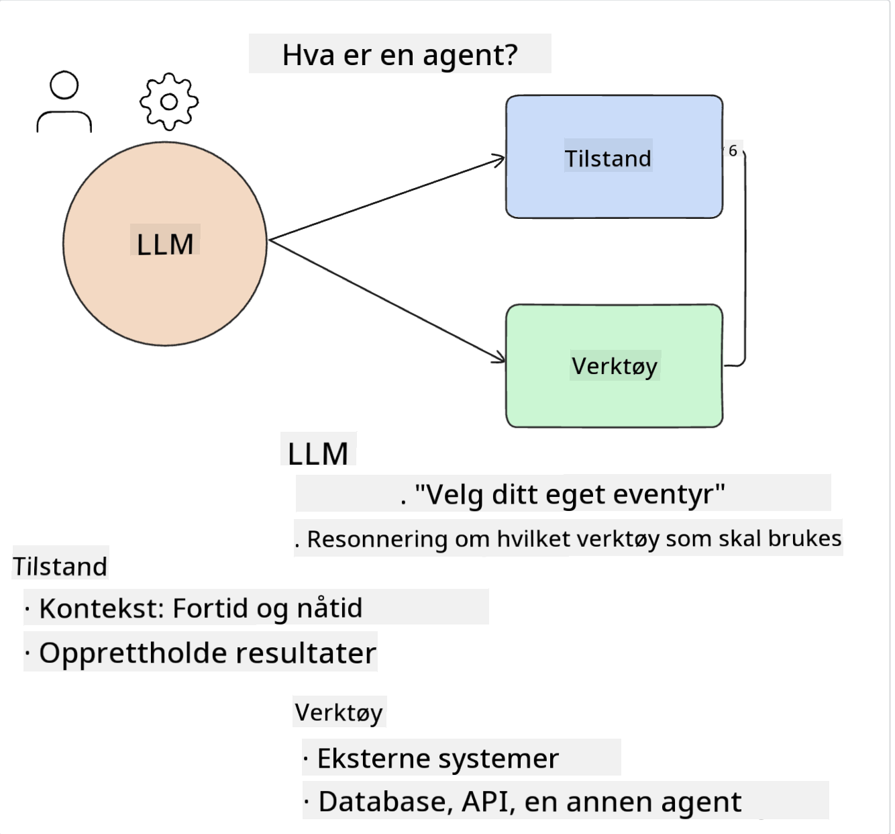
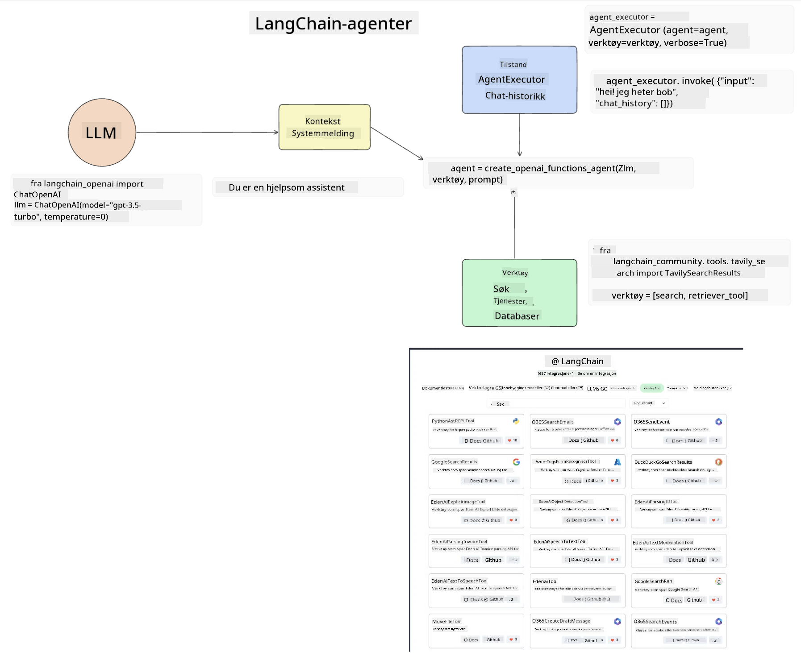
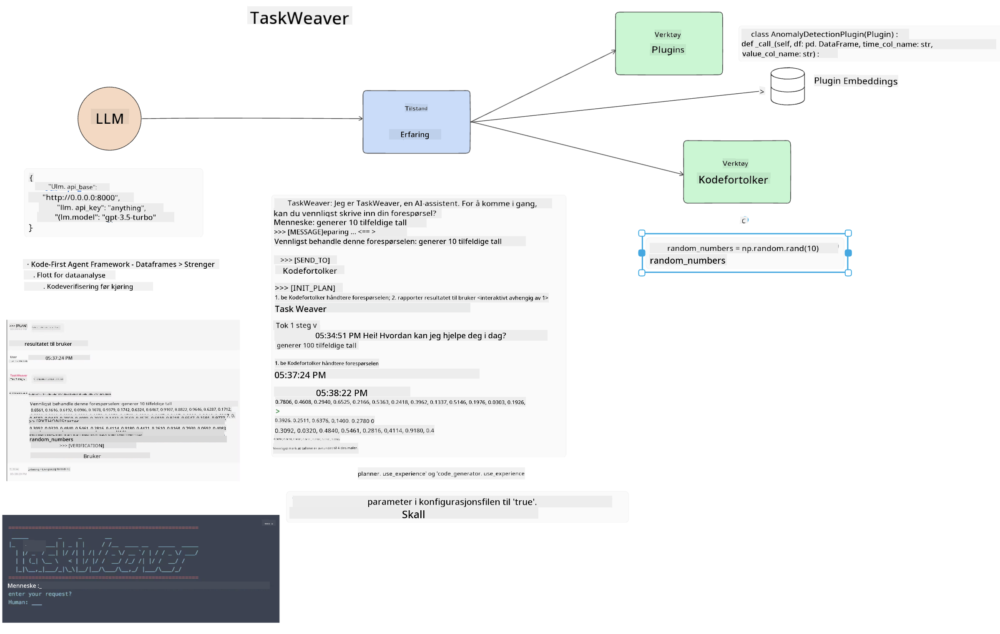
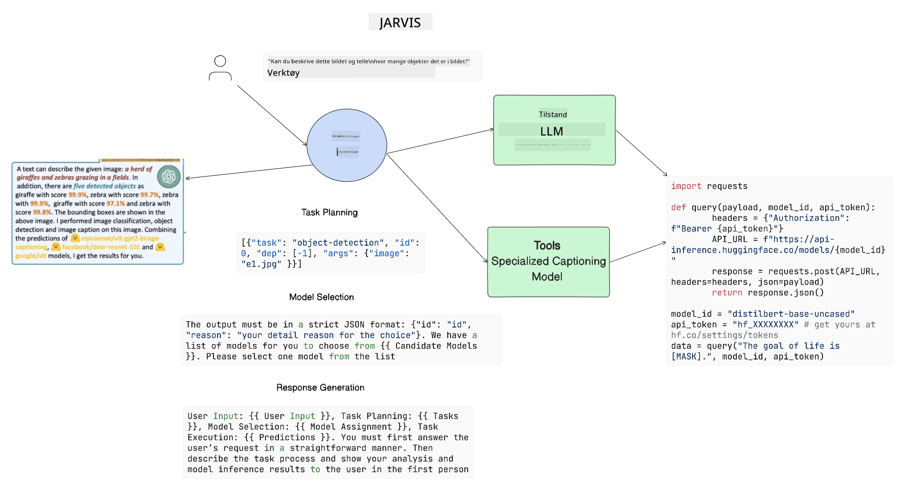

<!--
CO_OP_TRANSLATOR_METADATA:
{
  "original_hash": "11f03c81f190d9cbafd0f977dcbede6c",
  "translation_date": "2025-07-09T17:26:57+00:00",
  "source_file": "17-ai-agents/README.md",
  "language_code": "no"
}
-->
[](https://aka.ms/gen-ai-lesson17-gh?WT.mc_id=academic-105485-koreyst)

## Introduksjon

AI-agenter representerer en spennende utvikling innen Generativ AI, som gjør det mulig for store språkmodeller (LLMs) å utvikle seg fra assistenter til agenter som kan utføre handlinger. AI-agent-rammeverk gjør det mulig for utviklere å lage applikasjoner som gir LLMs tilgang til verktøy og tilstandsadministrasjon. Disse rammeverkene øker også synligheten, slik at brukere og utviklere kan følge med på hvilke handlinger LLMs planlegger, noe som forbedrer opplevelsesstyringen.

Leksjonen vil dekke følgende områder:

- Forstå hva en AI-agent er – Hva er egentlig en AI-agent?
- Utforske fire forskjellige AI-agent-rammeverk – Hva gjør dem unike?
- Anvende disse AI-agentene på ulike bruksområder – Når bør vi bruke AI-agenter?

## Læringsmål

Etter å ha tatt denne leksjonen vil du kunne:

- Forklare hva AI-agenter er og hvordan de kan brukes.
- Ha en forståelse av forskjellene mellom noen av de populære AI-agent-rammeverkene, og hvordan de skiller seg.
- Forstå hvordan AI-agenter fungerer for å kunne bygge applikasjoner med dem.

## Hva er AI-agenter?

AI-agenter er et veldig spennende felt innen Generativ AI. Med denne spenningen følger også noen ganger forvirring rundt begreper og bruksområder. For å holde det enkelt og inkludere de fleste verktøy som omtaler AI-agenter, bruker vi denne definisjonen:

AI-agenter lar store språkmodeller (LLMs) utføre oppgaver ved å gi dem tilgang til en **tilstand** og **verktøy**.



La oss definere disse begrepene:

**Store språkmodeller** – Dette er modellene som omtales gjennom hele kurset, som GPT-3.5, GPT-4, Llama-2, osv.

**Tilstand** – Dette refererer til konteksten som LLM-en jobber i. LLM-en bruker konteksten fra sine tidligere handlinger og den nåværende konteksten for å styre beslutningene for neste handlinger. AI-agent-rammeverk gjør det enklere for utviklere å opprettholde denne konteksten.

**Verktøy** – For å fullføre oppgaven som brukeren har bedt om, og som LLM-en har planlagt, trenger LLM-en tilgang til verktøy. Eksempler på verktøy kan være en database, et API, en ekstern applikasjon eller til og med en annen LLM!

Disse definisjonene vil forhåpentligvis gi deg et godt grunnlag videre når vi ser på hvordan de implementeres. La oss utforske noen forskjellige AI-agent-rammeverk:

## LangChain Agents

[LangChain Agents](https://python.langchain.com/docs/how_to/#agents?WT.mc_id=academic-105485-koreyst) er en implementering av definisjonene vi ga ovenfor.

For å håndtere **tilstanden** bruker den en innebygd funksjon kalt `AgentExecutor`. Denne tar imot den definerte `agent` og de `tools` som er tilgjengelige for den.

`AgentExecutor` lagrer også chatthistorikken for å gi konteksten i samtalen.



LangChain tilbyr en [verktøykatalog](https://integrations.langchain.com/tools?WT.mc_id=academic-105485-koreyst) som kan importeres til applikasjonen din, og som LLM-en kan få tilgang til. Disse er laget av fellesskapet og LangChain-teamet.

Du kan deretter definere disse verktøyene og sende dem til `AgentExecutor`.

Synlighet er et annet viktig aspekt når man snakker om AI-agenter. Det er viktig for applikasjonsutviklere å forstå hvilket verktøy LLM-en bruker og hvorfor. For dette har teamet hos LangChain utviklet LangSmith.

## AutoGen

Neste AI-agent-rammeverk vi skal diskutere er [AutoGen](https://microsoft.github.io/autogen/?WT.mc_id=academic-105485-koreyst). Hovedfokuset til AutoGen er samtaler. Agenter er både **samtalebaserte** og **tilpassbare**.

**Samtalebasert –** LLM-er kan starte og fortsette en samtale med en annen LLM for å fullføre en oppgave. Dette gjøres ved å opprette `AssistantAgents` og gi dem en spesifikk systemmelding.

```python

autogen.AssistantAgent( name="Coder", llm_config=llm_config, ) pm = autogen.AssistantAgent( name="Product_manager", system_message="Creative in software product ideas.", llm_config=llm_config, )

```

**Tilpassbar** – Agenter kan defineres ikke bare som LLM-er, men også som en bruker eller et verktøy. Som utvikler kan du definere en `UserProxyAgent` som er ansvarlig for å samhandle med brukeren for tilbakemeldinger i fullføringen av en oppgave. Denne tilbakemeldingen kan enten fortsette utførelsen av oppgaven eller stoppe den.

```python
user_proxy = UserProxyAgent(name="user_proxy")
```

### Tilstand og verktøy

For å endre og håndtere tilstanden genererer en assistent-agent Python-kode for å fullføre oppgaven.

Her er et eksempel på prosessen:


#### LLM definert med en systemmelding

```python
system_message="For weather related tasks, only use the functions you have been provided with. Reply TERMINATE when the task is done."
```

Denne systemmeldingen styrer denne spesifikke LLM-en til hvilke funksjoner som er relevante for oppgaven. Husk at med AutoGen kan du ha flere definerte AssistantAgents med forskjellige systemmeldinger.

#### Samtalen startes av bruker

```python
user_proxy.initiate_chat( chatbot, message="I am planning a trip to NYC next week, can you help me pick out what to wear? ", )

```

Denne meldingen fra user_proxy (menneske) er det som starter prosessen for agenten til å utforske hvilke funksjoner den bør utføre.

#### Funksjon utføres

```bash
chatbot (to user_proxy):

***** Suggested tool Call: get_weather ***** Arguments: {"location":"New York City, NY","time_periond:"7","temperature_unit":"Celsius"} ******************************************************** --------------------------------------------------------------------------------

>>>>>>>> EXECUTING FUNCTION get_weather... user_proxy (to chatbot): ***** Response from calling function "get_weather" ***** 112.22727272727272 EUR ****************************************************************

```

Når den innledende samtalen er behandlet, vil agenten sende forslaget om hvilket verktøy som skal kalles. I dette tilfellet er det en funksjon kalt `get_weather`. Avhengig av konfigurasjonen din kan denne funksjonen automatisk utføres og leses av agenten, eller den kan utføres basert på brukerinput.

Du kan finne en liste over [AutoGen kodeeksempler](https://microsoft.github.io/autogen/docs/Examples/?WT.mc_id=academic-105485-koreyst) for å utforske hvordan du kommer i gang med bygging.

## Taskweaver

Neste agent-rammeverk vi skal utforske er [Taskweaver](https://microsoft.github.io/TaskWeaver/?WT.mc_id=academic-105485-koreyst). Det er kjent som en "kode-først"-agent fordi den, i stedet for å jobbe strengt med `strings`, kan jobbe med DataFrames i Python. Dette blir svært nyttig for dataanalyse og generering av oppgaver. Dette kan være ting som å lage grafer og diagrammer eller generere tilfeldige tall.

### Tilstand og verktøy

For å håndtere tilstanden i samtalen bruker TaskWeaver konseptet `Planner`. `Planner` er en LLM som tar imot forespørselen fra brukerne og kartlegger oppgavene som må fullføres for å oppfylle denne forespørselen.

For å fullføre oppgavene får `Planner` tilgang til en samling verktøy kalt `Plugins`. Dette kan være Python-klasser eller en generell kode-tolk. Disse pluginene lagres som embeddings slik at LLM-en lettere kan søke etter riktig plugin.



Her er et eksempel på en plugin for å håndtere anomali-deteksjon:

```python
class AnomalyDetectionPlugin(Plugin): def __call__(self, df: pd.DataFrame, time_col_name: str, value_col_name: str):
```

Koden verifiseres før den kjøres. En annen funksjon for å håndtere kontekst i Taskweaver er `experience`. Experience gjør det mulig å lagre konteksten i en samtale over tid i en YAML-fil. Dette kan konfigureres slik at LLM-en forbedrer seg over tid på visse oppgaver, gitt at den eksponeres for tidligere samtaler.

## JARVIS

Det siste agent-rammeverket vi skal utforske er [JARVIS](https://github.com/microsoft/JARVIS?tab=readme-ov-file?WT.mc_id=academic-105485-koreyst). Det som gjør JARVIS unikt er at det bruker en LLM til å håndtere `tilstanden` i samtalen, og `tools` er andre AI-modeller. Hver av AI-modellene er spesialiserte modeller som utfører bestemte oppgaver som objektdeteksjon, transkripsjon eller bildeteksting.



LLM-en, som er en generell modell, mottar forespørselen fra brukeren og identifiserer den spesifikke oppgaven og eventuelle argumenter/data som trengs for å fullføre oppgaven.

```python
[{"task": "object-detection", "id": 0, "dep": [-1], "args": {"image": "e1.jpg" }}]
```

LLM-en formaterer deretter forespørselen på en måte som den spesialiserte AI-modellen kan tolke, for eksempel JSON. Når AI-modellen har returnert sin prediksjon basert på oppgaven, mottar LLM-en svaret.

Hvis flere modeller er nødvendige for å fullføre oppgaven, vil den også tolke svarene fra disse modellene før den samler dem for å generere svaret til brukeren.

Eksempelet nedenfor viser hvordan dette fungerer når en bruker ber om en beskrivelse og telling av objektene i et bilde:

## Oppgave

For å fortsette læringen din om AI-agenter kan du bygge med AutoGen:

- En applikasjon som simulerer et forretningsmøte med forskjellige avdelinger i en utdanningsstartup.
- Lag systemmeldinger som hjelper LLM-er med å forstå ulike personas og prioriteringer, og gjør det mulig for brukeren å presentere en ny produktidé.
- LLM-en skal deretter generere oppfølgingsspørsmål fra hver avdeling for å forbedre og videreutvikle presentasjonen og produktideen.

## Læring stopper ikke her, fortsett reisen

Etter å ha fullført denne leksjonen, sjekk ut vår [Generative AI Learning collection](https://aka.ms/genai-collection?WT.mc_id=academic-105485-koreyst) for å fortsette å utvikle din kunnskap om Generativ AI!

**Ansvarsfraskrivelse**:  
Dette dokumentet er oversatt ved hjelp av AI-oversettelsestjenesten [Co-op Translator](https://github.com/Azure/co-op-translator). Selv om vi streber etter nøyaktighet, vennligst vær oppmerksom på at automatiske oversettelser kan inneholde feil eller unøyaktigheter. Det opprinnelige dokumentet på originalspråket skal anses som den autoritative kilden. For kritisk informasjon anbefales profesjonell menneskelig oversettelse. Vi er ikke ansvarlige for eventuelle misforståelser eller feiltolkninger som oppstår ved bruk av denne oversettelsen.