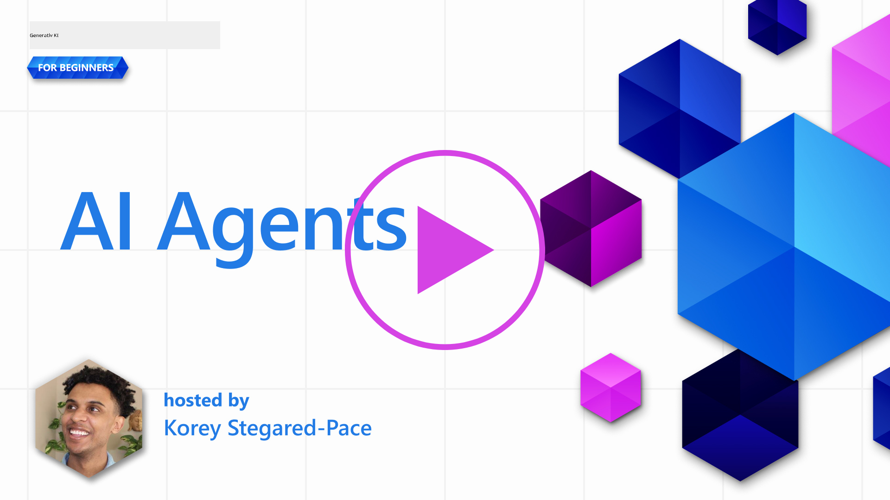
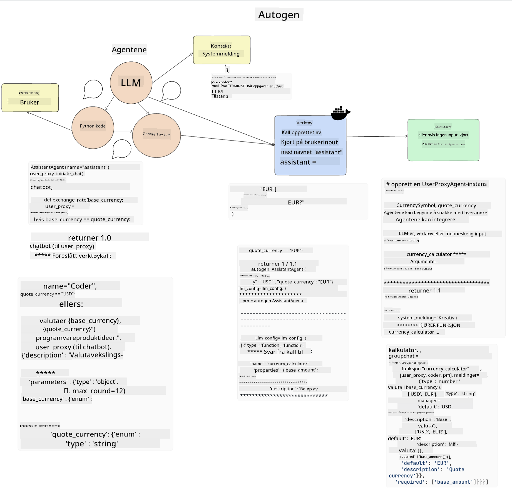

<!--
CO_OP_TRANSLATOR_METADATA:
{
  "original_hash": "8e8d1f6a63da606af7176a87ff8e92b6",
  "translation_date": "2025-10-17T19:25:50+00:00",
  "source_file": "17-ai-agents/README.md",
  "language_code": "no"
}
-->
[](https://youtu.be/yAXVW-lUINc?si=bOtW9nL6jc3XJgOM)

## Introduksjon

AI-agenter representerer en spennende utvikling innen Generativ AI, som gjør det mulig for store språkmodeller (LLMs) å utvikle seg fra assistenter til agenter som kan utføre handlinger. Rammeverk for AI-agenter gir utviklere muligheten til å lage applikasjoner som gir LLMs tilgang til verktøy og tilstandshåndtering. Disse rammeverkene forbedrer også synligheten, slik at brukere og utviklere kan overvåke handlingene som LLMs planlegger, og dermed forbedre opplevelsesstyringen.

Leksjonen vil dekke følgende områder:

- Forstå hva en AI-agent er - Hva er egentlig en AI-agent?
- Utforske fire forskjellige rammeverk for AI-agenter - Hva gjør dem unike?
- Anvende disse AI-agentene til ulike bruksområder - Når bør vi bruke AI-agenter?

## Læringsmål

Etter å ha tatt denne leksjonen, vil du kunne:

- Forklare hva AI-agenter er og hvordan de kan brukes.
- Ha en forståelse av forskjellene mellom noen av de populære rammeverkene for AI-agenter, og hvordan de skiller seg fra hverandre.
- Forstå hvordan AI-agenter fungerer for å kunne bygge applikasjoner med dem.

## Hva er AI-agenter?

AI-agenter er et veldig spennende felt innen Generativ AI. Med denne spenningen følger ofte en forvirring rundt begreper og deres anvendelse. For å holde ting enkelt og inkluderende for de fleste verktøy som refererer til AI-agenter, skal vi bruke denne definisjonen:

AI-agenter lar store språkmodeller (LLMs) utføre oppgaver ved å gi dem tilgang til en **tilstand** og **verktøy**.


La oss definere disse begrepene:

**Store språkmodeller** - Dette er modellene som refereres gjennom hele kurset, som GPT-3.5, GPT-4, Llama-2, osv.

**Tilstand** - Dette refererer til konteksten som LLM arbeider i. LLM bruker konteksten fra sine tidligere handlinger og den nåværende konteksten, som veileder dens beslutningstaking for påfølgende handlinger. Rammeverk for AI-agenter gjør det enklere for utviklere å opprettholde denne konteksten.

**Verktøy** - For å fullføre oppgaven som brukeren har bedt om og som LLM har planlagt, trenger LLM tilgang til verktøy. Noen eksempler på verktøy kan være en database, en API, en ekstern applikasjon eller til og med en annen LLM!

Disse definisjonene vil forhåpentligvis gi deg et godt grunnlag fremover når vi ser på hvordan de implementeres. La oss utforske noen forskjellige rammeverk for AI-agenter:

## LangChain-agenter

[LangChain-agenter](https://python.langchain.com/docs/how_to/#agents?WT.mc_id=academic-105485-koreyst) er en implementering av definisjonene vi ga ovenfor.

For å håndtere **tilstanden**, bruker den en innebygd funksjon kalt `AgentExecutor`. Denne aksepterer den definerte `agent` og de tilgjengelige `tools`.

`AgentExecutor` lagrer også samtalehistorikken for å gi konteksten til samtalen.


LangChain tilbyr en [katalog over verktøy](https://integrations.langchain.com/tools?WT.mc_id=academic-105485-koreyst) som kan importeres til applikasjonen din, der LLM kan få tilgang til dem. Disse er laget av fellesskapet og av LangChain-teamet.

Du kan deretter definere disse verktøyene og sende dem til `AgentExecutor`.

Synlighet er en annen viktig aspekt når det gjelder AI-agenter. Det er viktig for applikasjonsutviklere å forstå hvilket verktøy LLM bruker og hvorfor. For dette har teamet hos LangChain utviklet LangSmith.

## AutoGen

Det neste rammeverket for AI-agenter vi skal diskutere er [AutoGen](https://microsoft.github.io/autogen/?WT.mc_id=academic-105485-koreyst). Hovedfokuset til AutoGen er samtaler. Agenter er både **samtalbare** og **tilpassbare**.

**Samtalbare -** LLMs kan starte og fortsette en samtale med en annen LLM for å fullføre en oppgave. Dette gjøres ved å opprette `AssistantAgents` og gi dem en spesifikk systemmelding.

```python

autogen.AssistantAgent( name="Coder", llm_config=llm_config, ) pm = autogen.AssistantAgent( name="Product_manager", system_message="Creative in software product ideas.", llm_config=llm_config, )

```

**Tilpassbare** - Agenter kan defineres ikke bare som LLMs, men også som en bruker eller et verktøy. Som utvikler kan du definere en `UserProxyAgent` som er ansvarlig for å interagere med brukeren for tilbakemelding i fullføringen av en oppgave. Denne tilbakemeldingen kan enten fortsette utførelsen av oppgaven eller stoppe den.

```python
user_proxy = UserProxyAgent(name="user_proxy")
```

### Tilstand og verktøy

For å endre og håndtere tilstanden, genererer en assistent-agent Python-kode for å fullføre oppgaven.

Her er et eksempel på prosessen:



#### LLM definert med en systemmelding

```python
system_message="For weather related tasks, only use the functions you have been provided with. Reply TERMINATE when the task is done."
```

Denne systemmeldingen instruerer denne spesifikke LLM om hvilke funksjoner som er relevante for dens oppgave. Husk at med AutoGen kan du ha flere definerte AssistantAgents med forskjellige systemmeldinger.

#### Samtale initieres av bruker

```python
user_proxy.initiate_chat( chatbot, message="I am planning a trip to NYC next week, can you help me pick out what to wear? ", )

```

Denne meldingen fra user_proxy (Menneske) er det som starter prosessen for agenten med å utforske mulige funksjoner den bør utføre.

#### Funksjon utføres

```bash
chatbot (to user_proxy):

***** Suggested tool Call: get_weather ***** Arguments: {"location":"New York City, NY","time_periond:"7","temperature_unit":"Celsius"} ******************************************************** --------------------------------------------------------------------------------

>>>>>>>> EXECUTING FUNCTION get_weather... user_proxy (to chatbot): ***** Response from calling function "get_weather" ***** 112.22727272727272 EUR ****************************************************************

```

Når den innledende samtalen er behandlet, vil agenten foreslå hvilket verktøy som skal kalles. I dette tilfellet er det en funksjon kalt `get_weather`. Avhengig av konfigurasjonen din, kan denne funksjonen enten utføres automatisk og leses av agenten, eller utføres basert på brukerens input.

Du kan finne en liste over [AutoGen kodeeksempler](https://microsoft.github.io/autogen/docs/Examples/?WT.mc_id=academic-105485-koreyst) for å utforske hvordan du kan komme i gang med å bygge.

## Taskweaver

Det neste rammeverket for agenter vi skal utforske er [Taskweaver](https://microsoft.github.io/TaskWeaver/?WT.mc_id=academic-105485-koreyst). Det er kjent som en "kode-først"-agent fordi den, i stedet for å arbeide strengt med `strings`, kan arbeide med DataFrames i Python. Dette blir ekstremt nyttig for dataanalyse og genereringsoppgaver. Dette kan være ting som å lage grafer og diagrammer eller generere tilfeldige tall.

### Tilstand og verktøy

For å håndtere samtalens tilstand bruker TaskWeaver konseptet `Planner`. `Planner` er en LLM som tar forespørselen fra brukerne og kartlegger oppgavene som må fullføres for å oppfylle denne forespørselen.

For å fullføre oppgavene eksponeres `Planner` for en samling av verktøy kalt `Plugins`. Dette kan være Python-klasser eller en generell kodeinterpreter. Disse pluginene lagres som embeddings slik at LLM kan søke bedre etter riktig plugin.


Her er et eksempel på en plugin for å håndtere anomali-deteksjon:

```python
class AnomalyDetectionPlugin(Plugin): def __call__(self, df: pd.DataFrame, time_col_name: str, value_col_name: str):
```

Koden verifiseres før den utføres. En annen funksjon for å håndtere kontekst i Taskweaver er `experience`. Experience gjør det mulig å lagre konteksten til en samtale over lang tid i en YAML-fil. Dette kan konfigureres slik at LLM forbedrer seg over tid på visse oppgaver, gitt at den eksponeres for tidligere samtaler.

## JARVIS

Det siste rammeverket for agenter vi skal utforske er [JARVIS](https://github.com/microsoft/JARVIS?tab=readme-ov-file?WT.mc_id=academic-105485-koreyst). Det som gjør JARVIS unikt er at det bruker en LLM til å håndtere `tilstanden` til samtalen, og `verktøyene` er andre AI-modeller. Hver av AI-modellene er spesialiserte modeller som utfører visse oppgaver, som objektdeteksjon, transkripsjon eller bildebeskrivelse.


LLM, som er en generell modell, mottar forespørselen fra brukeren og identifiserer den spesifikke oppgaven og eventuelle argumenter/data som trengs for å fullføre oppgaven.

```python
[{"task": "object-detection", "id": 0, "dep": [-1], "args": {"image": "e1.jpg" }}]
```

LLM formaterer deretter forespørselen på en måte som den spesialiserte AI-modellen kan tolke, som JSON. Når AI-modellen har returnert sin prediksjon basert på oppgaven, mottar LLM svaret.

Hvis flere modeller er nødvendige for å fullføre oppgaven, vil den også tolke svaret fra disse modellene før den samler dem for å generere et svar til brukeren.

Eksempelet nedenfor viser hvordan dette vil fungere når en bruker ber om en beskrivelse og telling av objektene i et bilde:

## Oppgave

For å fortsette læringen om AI-agenter kan du bygge med AutoGen:

- En applikasjon som simulerer et forretningsmøte med forskjellige avdelinger i en oppstartsbedrift innen utdanning.
- Lag systemmeldinger som veileder LLMs i å forstå forskjellige personligheter og prioriteringer, og gjør det mulig for brukeren å presentere en ny produktidé.
- LLM bør deretter generere oppfølgingsspørsmål fra hver avdeling for å forbedre og videreutvikle produktideen.

## Læringen stopper ikke her, fortsett reisen

Etter å ha fullført denne leksjonen, sjekk ut vår [Generative AI Learning-samling](https://aka.ms/genai-collection?WT.mc_id=academic-105485-koreyst) for å fortsette å utvikle kunnskapen din om Generativ AI!

---

**Ansvarsfraskrivelse**:  
Dette dokumentet er oversatt ved hjelp av AI-oversettelsestjenesten [Co-op Translator](https://github.com/Azure/co-op-translator). Selv om vi tilstreber nøyaktighet, vær oppmerksom på at automatiserte oversettelser kan inneholde feil eller unøyaktigheter. Det originale dokumentet på sitt opprinnelige språk bør anses som den autoritative kilden. For kritisk informasjon anbefales profesjonell menneskelig oversettelse. Vi er ikke ansvarlige for misforståelser eller feiltolkninger som oppstår ved bruk av denne oversettelsen.