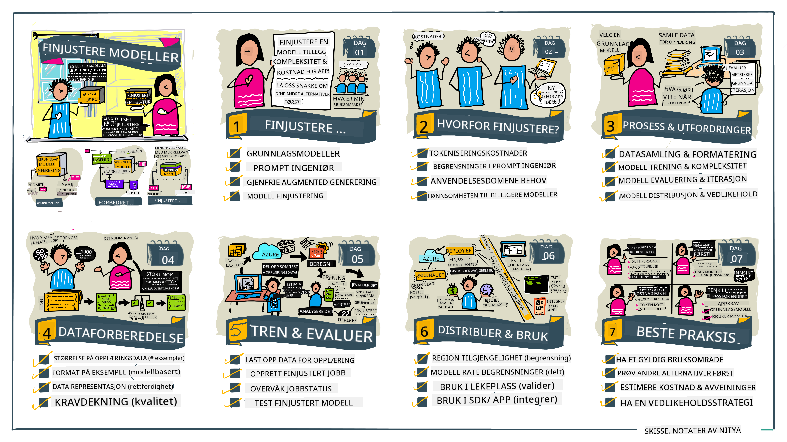

<!--
CO_OP_TRANSLATOR_METADATA:
{
  "original_hash": "68664f7e754a892ae1d8d5e2b7bd2081",
  "translation_date": "2025-05-20T07:50:46+00:00",
  "source_file": "18-fine-tuning/README.md",
  "language_code": "no"
}
-->

# Tilpasse din LLM

Bruk av store språkmodeller for å bygge generative AI-applikasjoner innebærer nye utfordringer. En viktig problemstilling er å sikre responskvaliteten (nøyaktighet og relevans) i innholdet som genereres av modellen for en gitt brukerforespørsel. I tidligere leksjoner har vi diskutert teknikker som prompt engineering og retrieval-augmented generation som prøver å løse problemet ved å _modifisere prompt-inngangen_ til den eksisterende modellen.

I dagens leksjon diskuterer vi en tredje teknikk, **tilpasning**, som prøver å takle utfordringen ved _å trene modellen på nytt_ med ekstra data. La oss dykke inn i detaljene.

## Læringsmål

Denne leksjonen introduserer konseptet med tilpasning for forhåndstrente språkmodeller, utforsker fordelene og utfordringene ved denne tilnærmingen, og gir veiledning om når og hvordan du kan bruke tilpasning for å forbedre ytelsen til dine generative AI-modeller.

Ved slutten av denne leksjonen bør du kunne svare på følgende spørsmål:

- Hva er tilpasning for språkmodeller?
- Når, og hvorfor, er tilpasning nyttig?
- Hvordan kan jeg tilpasse en forhåndstrent modell?
- Hva er begrensningene ved tilpasning?

Klar? La oss komme i gang.

## Illustrert guide

Vil du få det store bildet av hva vi skal dekke før vi dykker inn? Sjekk ut denne illustrerte guiden som beskriver læringsreisen for denne leksjonen - fra å lære de grunnleggende konseptene og motivasjonen for tilpasning, til å forstå prosessen og beste praksis for å utføre tilpasningsoppgaven. Dette er et fascinerende emne å utforske, så ikke glem å sjekke ut [Resources](./RESOURCES.md?WT.mc_id=academic-105485-koreyst) siden for ekstra lenker som støtter din selvguidede læringsreise!

## Hva er tilpasning for språkmodeller?

Per definisjon er store språkmodeller _forhåndstrente_ på store mengder tekst hentet fra ulike kilder, inkludert internett. Som vi har lært i tidligere leksjoner, trenger vi teknikker som _prompt engineering_ og _retrieval-augmented generation_ for å forbedre kvaliteten på modellens svar på brukerens spørsmål ("prompts").

En populær prompt-engineering teknikk involverer å gi modellen mer veiledning om hva som forventes i svaret enten ved å gi _instruksjoner_ (eksplisitt veiledning) eller _gi den noen få eksempler_ (implisitt veiledning). Dette kalles _few-shot learning_, men det har to begrensninger:

- Modellens tokenbegrensninger kan begrense antall eksempler du kan gi, og begrense effektiviteten.
- Modellens tokenkostnader kan gjøre det dyrt å legge til eksempler i hver prompt, og begrense fleksibiliteten.

Tilpasning er en vanlig praksis i maskinlæringssystemer hvor vi tar en forhåndstrent modell og trener den på nytt med nye data for å forbedre ytelsen på en spesifikk oppgave. I sammenheng med språkmodeller kan vi tilpasse den forhåndstrente modellen _med et kuratert sett av eksempler for en gitt oppgave eller applikasjonsdomene_ for å lage en **tilpasset modell** som kan være mer nøyaktig og relevant for den spesifikke oppgaven eller domenet. En sidefordel med tilpasning er at det også kan redusere antall eksempler som trengs for few-shot learning - redusere tokenbruk og relaterte kostnader.

## Når og hvorfor bør vi tilpasse modeller?

I _denne_ sammenhengen, når vi snakker om tilpasning, refererer vi til **supervised** tilpasning hvor treningen gjøres ved **å legge til nye data** som ikke var en del av det opprinnelige treningsdatasettet. Dette er forskjellig fra en unsupervised tilpasningsmetode hvor modellen trenes på nytt på de opprinnelige dataene, men med forskjellige hyperparametere.

Det viktige å huske er at tilpasning er en avansert teknikk som krever et visst nivå av ekspertise for å oppnå de ønskede resultatene. Hvis det gjøres feil, kan det hende at det ikke gir de forventede forbedringene, og det kan til og med forringe ytelsen til modellen for ditt målrettede domene.

Så, før du lærer "hvordan" du skal tilpasse språkmodeller, må du vite "hvorfor" du bør ta denne ruten, og "når" du skal starte prosessen med tilpasning. Begynn med å stille deg selv disse spørsmålene:

- **Brukstilfelle**: Hva er ditt _brukstilfelle_ for tilpasning? Hvilken del av den nåværende forhåndstrente modellen vil du forbedre?
- **Alternativer**: Har du prøvd _andre teknikker_ for å oppnå de ønskede resultatene? Bruk dem til å lage en baseline for sammenligning.
  - Prompt engineering: Prøv teknikker som få-shot prompting med eksempler på relevante prompt-svar. Evaluer kvaliteten på svarene.
  - Retrieval Augmented Generation: Prøv å utvide prompts med spørringsresultater hentet ved å søke i dataene dine. Evaluer kvaliteten på svarene.
- **Kostnader**: Har du identifisert kostnadene for tilpasning?
  - Tilpasningsmulighet - er den forhåndstrente modellen tilgjengelig for tilpasning?
  - Innsats - for å forberede treningsdata, evaluere og forbedre modellen.
  - Beregning - for å kjøre tilpasningsjobber, og distribuere tilpasset modell
  - Data - tilgang til tilstrekkelige kvalitets eksempler for tilpasningspåvirkning
- **Fordeler**: Har du bekreftet fordelene ved tilpasning?
  - Kvalitet - overgikk den tilpassede modellen baseline?
  - Kostnad - reduserer det tokenbruk ved å forenkle prompts?
  - Utvidbarhet - kan du gjenbruke basismodellen for nye domener?

Ved å svare på disse spørsmålene, bør du kunne avgjøre om tilpasning er den rette tilnærmingen for ditt brukstilfelle. Ideelt sett er tilnærmingen gyldig bare hvis fordelene oppveier kostnadene. Når du bestemmer deg for å fortsette, er det på tide å tenke på _hvordan_ du kan tilpasse den forhåndstrente modellen.

Vil du få mer innsikt i beslutningsprosessen? Se [Å tilpasse eller ikke tilpasse](https://www.youtube.com/watch?v=0Jo-z-MFxJs)

## Hvordan kan vi tilpasse en forhåndstrent modell?

For å tilpasse en forhåndstrent modell, trenger du:

- en forhåndstrent modell å tilpasse
- et datasett å bruke til tilpasning
- et treningsmiljø for å kjøre tilpasningsjobben
- et vertsmiljø for å distribuere tilpasset modell

## Tilpasning i praksis

Følgende ressurser gir trinnvise veiledninger for å gå gjennom et reelt eksempel ved bruk av en valgt modell med et kuratert datasett. For å arbeide gjennom disse veiledningene, trenger du en konto hos den spesifikke leverandøren, sammen med tilgang til den relevante modellen og datasettene.

| Leverandør   | Veiledning                                                                                                                                                                     | Beskrivelse                                                                                                                                                                                                                                                                                                                                                                                                                        |
| ------------ | ------------------------------------------------------------------------------------------------------------------------------------------------------------------------------ | ---------------------------------------------------------------------------------------------------------------------------------------------------------------------------------------------------------------------------------------------------------------------------------------------------------------------------------------------------------------------------------------------------------------------------------- |
| OpenAI       | [Hvordan tilpasse chat-modeller](https://github.com/openai/openai-cookbook/blob/main/examples/How_to_finetune_chat_models.ipynb?WT.mc_id=academic-105485-koreyst)               | Lær å tilpasse en `gpt-35-turbo` for et spesifikt domene ("oppskrift assistent") ved å forberede treningsdata, kjøre tilpasningsjobben, og bruke den tilpassede modellen til inferens.                                                                                                                                                                                                                                             |
| Azure OpenAI | [GPT 3.5 Turbo tilpasningsveiledning](https://learn.microsoft.com/azure/ai-services/openai/tutorials/fine-tune?tabs=python-new%2Ccommand-line?WT.mc_id=academic-105485-koreyst) | Lær å tilpasse en `gpt-35-turbo-0613` modell **på Azure** ved å ta steg for å lage og laste opp treningsdata, kjøre tilpasningsjobben. Distribuer og bruk den nye modellen.                                                                                                                                                                                                                                                          |
| Hugging Face | [Tilpasse LLMs med Hugging Face](https://www.philschmid.de/fine-tune-llms-in-2024-with-trl?WT.mc_id=academic-105485-koreyst)                                                   | Denne bloggposten guider deg gjennom tilpasning av en _åpen LLM_ (eks: `CodeLlama 7B`) ved bruk av [transformers](https://huggingface.co/docs/transformers/index?WT.mc_id=academic-105485-koreyst) biblioteket & [Transformer Reinforcement Learning (TRL)](https://huggingface.co/docs/trl/index?WT.mc_id=academic-105485-koreyst]) med åpne [datasets](https://huggingface.co/docs/datasets/index?WT.mc_id=academic-105485-koreyst) på Hugging Face. |
|              |                                                                                                                                                                                |                                                                                                                                                                                                                                                                                                                                                                                                                                    |
| 🤗 AutoTrain | [Tilpasse LLMs med AutoTrain](https://github.com/huggingface/autotrain-advanced/?WT.mc_id=academic-105485-koreyst)                                                             | AutoTrain (eller AutoTrain Advanced) er et python-bibliotek utviklet av Hugging Face som tillater tilpasning for mange forskjellige oppgaver inkludert LLM tilpasning. AutoTrain er en no-code løsning og tilpasning kan gjøres i din egen sky, på Hugging Face Spaces eller lokalt. Det støtter både en web-basert GUI, CLI og trening via yaml-konfigurasjonsfiler.                                                              |
|              |                                                                                                                                                                                |                                                                                                                                                                                                                                                                                                                                                                                                                                    |

## Oppgave

Velg en av veiledningene ovenfor og gå gjennom dem. _Vi kan replikere en versjon av disse veiledningene i Jupyter Notebooks i dette repoet kun for referanse. Vennligst bruk de opprinnelige kildene direkte for å få de nyeste versjonene_.

## Flott arbeid! Fortsett din læring.

Etter å ha fullført denne leksjonen, sjekk ut vår [Generative AI Learning collection](https://aka.ms/genai-collection?WT.mc_id=academic-105485-koreyst) for å fortsette å heve din Generative AI kunnskap!

Gratulerer!! Du har fullført den siste leksjonen fra v2-serien for dette kurset! Ikke stopp å lære og bygge. \*\*Sjekk ut [RESOURCES](RESOURCES.md?WT.mc_id=academic-105485-koreyst) siden for en liste over ekstra forslag for akkurat dette emnet.

Vår v1-serie av leksjoner har også blitt oppdatert med flere oppgaver og konsepter. Så ta et minutt for å friske opp kunnskapen din - og vennligst [del dine spørsmål og tilbakemeldinger](https://github.com/microsoft/generative-ai-for-beginners/issues?WT.mc_id=academic-105485-koreyst) for å hjelpe oss med å forbedre disse leksjonene for fellesskapet.

**Ansvarsfraskrivelse**:  
Dette dokumentet er oversatt ved hjelp av AI-oversettelsestjenesten [Co-op Translator](https://github.com/Azure/co-op-translator). Selv om vi tilstreber nøyaktighet, vær oppmerksom på at automatiserte oversettelser kan inneholde feil eller unøyaktigheter. Det originale dokumentet på sitt opprinnelige språk bør betraktes som den autoritative kilden. For kritisk informasjon anbefales profesjonell menneskelig oversettelse. Vi er ikke ansvarlige for misforståelser eller feiltolkninger som oppstår ved bruk av denne oversettelsen.