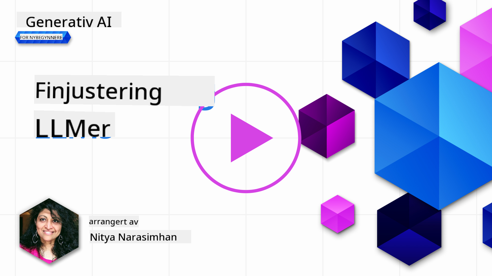
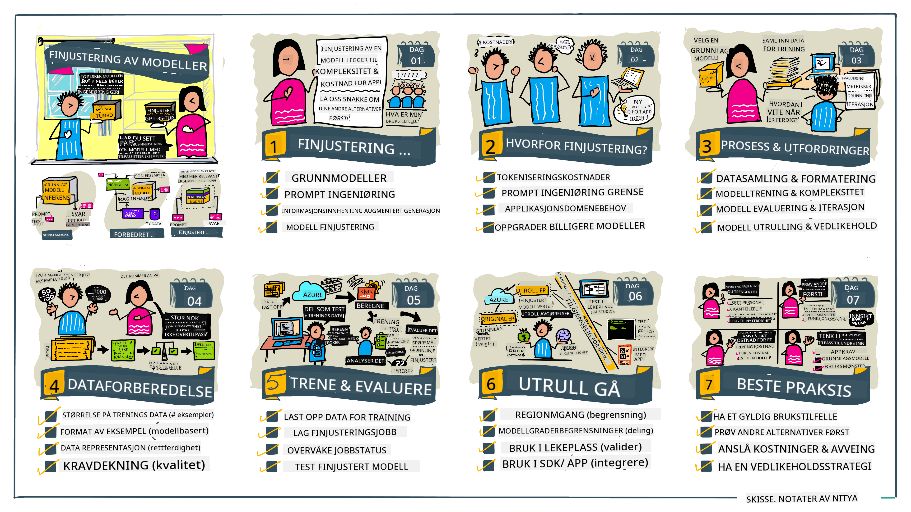

<!--
CO_OP_TRANSLATOR_METADATA:
{
  "original_hash": "68664f7e754a892ae1d8d5e2b7bd2081",
  "translation_date": "2025-07-09T17:44:46+00:00",
  "source_file": "18-fine-tuning/README.md",
  "language_code": "no"
}
-->

# Finjustering av LLM-en din

Bruk av store språkmodeller for å bygge generative AI-applikasjoner medfører nye utfordringer. En sentral problemstilling er å sikre kvaliteten på svarene (nøyaktighet og relevans) i innholdet modellen genererer for en gitt brukerforespørsel. I tidligere leksjoner har vi diskutert teknikker som prompt engineering og retrieval-augmented generation, som prøver å løse problemet ved å _endre prompt-inputen_ til den eksisterende modellen.

I dagens leksjon skal vi se på en tredje teknikk, **finjustering**, som forsøker å møte utfordringen ved å _trene modellen på nytt_ med ekstra data. La oss gå nærmere inn på detaljene.

## Læringsmål

Denne leksjonen introduserer konseptet finjustering for forhåndstrente språkmodeller, utforsker fordeler og utfordringer med denne tilnærmingen, og gir veiledning om når og hvordan du kan bruke finjustering for å forbedre ytelsen til dine generative AI-modeller.

Etter denne leksjonen skal du kunne svare på følgende spørsmål:

- Hva er finjustering for språkmodeller?
- Når og hvorfor er finjustering nyttig?
- Hvordan kan jeg finjustere en forhåndstrent modell?
- Hva er begrensningene ved finjustering?

Klar? La oss sette i gang.

## Illustrert guide

Vil du få en oversikt over hva vi skal dekke før vi går i gang? Sjekk ut denne illustrerte guiden som beskriver læringsreisen for denne leksjonen – fra å lære kjernebegrepene og motivasjonen for finjustering, til å forstå prosessen og beste praksis for å utføre finjusteringsoppgaven. Dette er et spennende tema å utforske, så ikke glem å sjekke [Ressurser](./RESOURCES.md?WT.mc_id=academic-105485-koreyst) for flere lenker som støtter din selvstyrte læringsreise!

## Hva er finjustering for språkmodeller?

Per definisjon er store språkmodeller _forhåndstrent_ på store mengder tekst hentet fra ulike kilder, inkludert internett. Som vi har lært i tidligere leksjoner, trenger vi teknikker som _prompt engineering_ og _retrieval-augmented generation_ for å forbedre kvaliteten på modellens svar på brukerens spørsmål ("prompter").

En populær prompt-engineering-teknikk innebærer å gi modellen mer veiledning om hva som forventes i svaret, enten ved å gi _instruksjoner_ (eksplisitt veiledning) eller _noen få eksempler_ (implisitt veiledning). Dette kalles _few-shot learning_, men har to begrensninger:

- Modellens token-grenser kan begrense antall eksempler du kan gi, og dermed redusere effektiviteten.
- Kostnader knyttet til tokens kan gjøre det dyrt å legge til eksempler i hver prompt, og begrense fleksibiliteten.

Finjustering er en vanlig praksis i maskinlæringssystemer hvor man tar en forhåndstrent modell og trener den på nytt med nye data for å forbedre ytelsen på en spesifikk oppgave. I sammenheng med språkmodeller kan vi finjustere den forhåndstrente modellen _med et kuratert sett av eksempler for en gitt oppgave eller bruksområde_ for å lage en **tilpasset modell** som kan være mer nøyaktig og relevant for akkurat den oppgaven eller domenet. En ekstra fordel med finjustering er at det også kan redusere antall eksempler som trengs for few-shot learning – noe som reduserer token-bruk og tilhørende kostnader.

## Når og hvorfor bør vi finjustere modeller?

I _denne_ sammenhengen, når vi snakker om finjustering, refererer vi til **supervised** finjustering hvor ny trening gjøres ved å **legge til nye data** som ikke var en del av det opprinnelige treningssettet. Dette skiller seg fra en usupervised finjustering der modellen trenes på nytt med de opprinnelige dataene, men med andre hyperparametere.

Det viktigste å huske er at finjustering er en avansert teknikk som krever et visst nivå av ekspertise for å oppnå ønskede resultater. Gjør man det feil, kan det hende man ikke får de forventede forbedringene, og det kan til og med forringe modellens ytelse for det aktuelle domenet.

Så, før du lærer "hvordan" du finjusterer språkmodeller, må du vite "hvorfor" du bør velge denne veien, og "når" du skal starte finjusteringsprosessen. Start med å stille deg selv disse spørsmålene:

- **Bruksområde**: Hva er ditt _bruksområde_ for finjustering? Hvilke aspekter ved den nåværende forhåndstrente modellen ønsker du å forbedre?
- **Alternativer**: Har du prøvd _andre teknikker_ for å oppnå ønskede resultater? Bruk dem for å lage en referanse for sammenligning.
  - Prompt engineering: Prøv teknikker som few-shot prompting med eksempler på relevante prompt-svar. Evaluer kvaliteten på svarene.
  - Retrieval Augmented Generation: Prøv å utvide promptene med søkeresultater hentet fra dine data. Evaluer kvaliteten på svarene.
- **Kostnader**: Har du identifisert kostnadene ved finjustering?
  - Mulighet for finjustering – er den forhåndstrente modellen tilgjengelig for finjustering?
  - Innsats – for å forberede treningsdata, evaluere og forbedre modellen.
  - Beregningsressurser – for å kjøre finjusteringsjobber og distribuere den finjusterte modellen.
  - Data – tilgang til tilstrekkelig kvalitetsdata for at finjusteringen skal ha effekt.
- **Fordeler**: Har du bekreftet fordelene ved finjustering?
  - Kvalitet – overgikk den finjusterte modellen referansemodellen?
  - Kostnad – reduserer det token-bruken ved å forenkle promptene?
  - Utvidbarhet – kan du gjenbruke basismodellen for nye domener?

Ved å svare på disse spørsmålene bør du kunne avgjøre om finjustering er riktig tilnærming for ditt bruksområde. Ideelt sett er tilnærmingen gyldig bare hvis fordelene oppveier kostnadene. Når du har bestemt deg for å gå videre, er det på tide å tenke på _hvordan_ du kan finjustere den forhåndstrente modellen.

Vil du ha flere innsikter om beslutningsprosessen? Se [To fine-tune or not to fine-tune](https://www.youtube.com/watch?v=0Jo-z-MFxJs)

## Hvordan kan vi finjustere en forhåndstrent modell?

For å finjustere en forhåndstrent modell trenger du:

- en forhåndstrent modell som kan finjusteres
- et datasett som skal brukes til finjustering
- et treningsmiljø for å kjøre finjusteringsjobben
- et hostingmiljø for å distribuere den finjusterte modellen

## Finjustering i praksis

Følgende ressurser gir trinnvise veiledninger som tar deg gjennom et ekte eksempel med en valgt modell og et kuratert datasett. For å jobbe med disse veiledningene trenger du en konto hos den aktuelle leverandøren, samt tilgang til den relevante modellen og datasettene.

| Leverandør   | Veiledning                                                                                                                                                                   | Beskrivelse                                                                                                                                                                                                                                                                                                                                                                                                                      |
| ------------ | ---------------------------------------------------------------------------------------------------------------------------------------------------------------------------- | -------------------------------------------------------------------------------------------------------------------------------------------------------------------------------------------------------------------------------------------------------------------------------------------------------------------------------------------------------------------------------------------------------------------------------- |
| OpenAI       | [How to fine-tune chat models](https://github.com/openai/openai-cookbook/blob/main/examples/How_to_finetune_chat_models.ipynb?WT.mc_id=academic-105485-koreyst)              | Lær hvordan du finjusterer en `gpt-35-turbo` for et spesifikt domene ("oppskriftassistent") ved å forberede treningsdata, kjøre finjusteringsjobben og bruke den finjusterte modellen til inferens.                                                                                                                                                                                                                              |
| Azure OpenAI | [GPT 3.5 Turbo fine-tuning tutorial](https://learn.microsoft.com/azure/ai-services/openai/tutorials/fine-tune?tabs=python-new%2Ccommand-line?WT.mc_id=academic-105485-koreyst) | Lær hvordan du finjusterer en `gpt-35-turbo-0613` modell **på Azure** ved å lage og laste opp treningsdata, kjøre finjusteringsjobben, distribuere og bruke den nye modellen.                                                                                                                                                                                                                                                   |
| Hugging Face | [Fine-tuning LLMs with Hugging Face](https://www.philschmid.de/fine-tune-llms-in-2024-with-trl?WT.mc_id=academic-105485-koreyst)                                             | Dette blogginnlegget viser hvordan du finjusterer en _åpen LLM_ (f.eks. `CodeLlama 7B`) ved hjelp av [transformers](https://huggingface.co/docs/transformers/index?WT.mc_id=academic-105485-koreyst) biblioteket og [Transformer Reinforcement Learning (TRL)](https://huggingface.co/docs/trl/index?WT.mc_id=academic-105485-koreyst) med åpne [datasett](https://huggingface.co/docs/datasets/index?WT.mc_id=academic-105485-koreyst) på Hugging Face. |
|              |                                                                                                                                                                              |                                                                                                                                                                                                                                                                                                                                                                                                                                |
| 🤗 AutoTrain | [Fine-tuning LLMs with AutoTrain](https://github.com/huggingface/autotrain-advanced/?WT.mc_id=academic-105485-koreyst)                                                       | AutoTrain (eller AutoTrain Advanced) er et Python-bibliotek utviklet av Hugging Face som lar deg finjustere mange forskjellige oppgaver, inkludert LLM-finjustering. AutoTrain er en kodefri løsning, og finjustering kan gjøres i din egen sky, på Hugging Face Spaces eller lokalt. Den støtter både web-basert GUI, CLI og trening via yaml-konfigurasjonsfiler.                                                                 |
|              |                                                                                                                                                                              |                                                                                                                                                                                                                                                                                                                                                                                                                                |

## Oppgave

Velg en av veiledningene ovenfor og gå gjennom den. _Vi kan komme til å lage en versjon av disse veiledningene i Jupyter Notebooks i dette repoet kun som referanse. Bruk de originale kildene direkte for å få de nyeste versjonene_.

## Flott jobba! Fortsett læringen din.

Etter å ha fullført denne leksjonen, sjekk ut vår [Generative AI Learning collection](https://aka.ms/genai-collection?WT.mc_id=academic-105485-koreyst) for å fortsette å utvikle din kunnskap om Generativ AI!

Gratulerer!! Du har fullført den siste leksjonen i v2-serien for dette kurset! Ikke slutt å lære og bygge. \*\*Sjekk ut [RESSURSER](RESOURCES.md?WT.mc_id=academic-105485-koreyst) for en liste over flere forslag om akkurat dette temaet.

Vår v1-serie med leksjoner er også oppdatert med flere oppgaver og konsepter. Ta deg et øyeblikk til å friske opp kunnskapen din – og vennligst [del dine spørsmål og tilbakemeldinger](https://github.com/microsoft/generative-ai-for-beginners/issues?WT.mc_id=academic-105485-koreyst) for å hjelpe oss med å forbedre disse leksjonene for fellesskapet.

**Ansvarsfraskrivelse**:  
Dette dokumentet er oversatt ved hjelp av AI-oversettelsestjenesten [Co-op Translator](https://github.com/Azure/co-op-translator). Selv om vi streber etter nøyaktighet, vennligst vær oppmerksom på at automatiske oversettelser kan inneholde feil eller unøyaktigheter. Det opprinnelige dokumentet på originalspråket skal anses som den autoritative kilden. For kritisk informasjon anbefales profesjonell menneskelig oversettelse. Vi er ikke ansvarlige for eventuelle misforståelser eller feiltolkninger som oppstår ved bruk av denne oversettelsen.