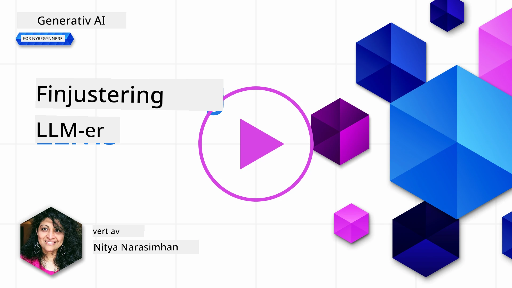
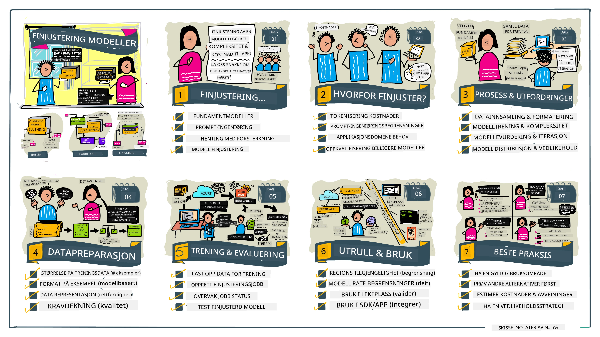

# Finjustering av din LLM

Bruk av store språkmodeller for å bygge generative AI-applikasjoner kommer med nye utfordringer. Et sentralt spørsmål er å sikre responskvalitet (nøyaktighet og relevans) i innhold generert av modellen for en gitt brukerforespørsel. I tidligere leksjoner har vi diskutert teknikker som prompt-engineering og hentetilleggsgenerering som prøver å løse problemet ved å _endre prompt-inputen_ til den eksisterende modellen.

I dagens leksjon diskuterer vi en tredje teknikk, **finjustering**, som prøver å møte utfordringen ved å _omtrentrene modellen selv_ med tillegg av data. La oss dykke inn i detaljene.

## Læringsmål

Denne leksjonen introduserer konseptet finjustering for forhåndstrente språkmodeller, utforsker fordelene og utfordringene ved denne tilnærmingen, og gir veiledning om når og hvordan man kan bruke finjustering for å forbedre ytelsen til dine generative AI-modeller.

Etter denne leksjonen skal du kunne svare på følgende spørsmål:

- Hva er finjustering for språkmodeller?
- Når, og hvorfor, er finjustering nyttig?
- Hvordan kan jeg finjustere en forhåndstrent modell?
- Hva er begrensningene ved finjustering?

Klar? La oss komme i gang.

## Illustrert guide

Vil du få oversikten over hva vi skal dekke før vi dykker ned? Sjekk ut denne illustrerte guiden som beskriver læreprosessen for denne leksjonen – fra å lære kjernebegrepene og motivasjonen for finjustering, til å forstå prosessen og beste praksis for å utføre finjusteringsoppgaven. Dette er et fascinerende tema for utforskning, så ikke glem å sjekke [Ressurser](./RESOURCES.md?WT.mc_id=academic-105485-koreyst)-siden for flere lenker som støtter din selvstyrte læringsreise!

## Hva er finjustering for språkmodeller?

Per definisjon er store språkmodeller _forhåndstrent_ på store mengder tekst hentet fra ulike kilder inkludert internett. Som vi har lært i tidligere leksjoner, trenger vi teknikker som _prompt engineering_ og _retrieval-augmented generation_ for å forbedre kvaliteten på modellens svar til brukerens spørsmål ("prompts").

En populær prompt-engineeringsteknikk innebærer å gi modellen mer veiledning om hva som forventes i svaret enten ved å gi _instruksjoner_ (eksplisitt veiledning) eller _gi den noen få eksempler_ (implisitt veiledning). Dette kalles _few-shot learning_, men det har to begrensninger:

- Modellens token-begrensninger kan begrense antallet eksempler du kan gi, og dermed begrense effektiviteten.
- Kostnaden for modell-token kan gjøre det dyrt å legge til eksempler i hver prompt, og begrense fleksibiliteten.

Finjustering er en vanlig praksis i maskinlæringssystemer hvor man tar en forhåndstrent modell og trener den på nytt med nye data for å forbedre ytelsen på en spesifikk oppgave. I konteksten av språkmodeller kan vi finjustere den forhåndstrente modellen _med et kuratert sett av eksempler for en gitt oppgave eller anvendelsesområde_ for å lage en **tilpasset modell** som kan være mer nøyaktig og relevant for akkurat den oppgaven eller domenet. En ekstra fordel med finjustering er at det også kan redusere antallet eksempler som trengs til few-shot learning – noe som reduserer token-bruk og relaterte kostnader.

## Når og hvorfor bør vi finjustere modeller?

I _denne_ konteksten, når vi snakker om finjustering, refererer vi til **overvåket** finjustering hvor ny trening utføres ved å **legge til nye data** som ikke var en del av det opprinnelige treningssettet. Dette skiller seg fra en uovervåket finjusteringsmetode hvor modellen trenes på nytt med originaldata, men med forskjellige hyperparametere.

Det viktigste å huske er at finjustering er en avansert teknikk som krever et visst nivå av ekspertise for å oppnå ønskede resultater. Utføres det feil, kan det hende du ikke får de forventede forbedringene, og det kan til og med forringe ytelsen til modellen for ditt målrettede domene.

Så før du lærer "hvordan" du finjusterer språkmodeller, må du vite "hvorfor" du skal ta denne ruten, og "når" du skal starte prosessen med finjustering. Begynn med å stille deg selv disse spørsmålene:

- **Brukstilfelle**: Hva er ditt _brukstilfelle_ for finjustering? Hvilket aspekt ved den nåværende forhåndstrente modellen ønsker du å forbedre?
- **Alternativer**: Har du prøvd _andre teknikker_ for å oppnå ønskede resultater? Bruk dem til å lage en referanseverdi for sammenligning.
  - Prompt engineering: Prøv teknikker som few-shot prompting med eksempler på relevante prompt-svar. Evaluer kvaliteten på svarene.
  - Hentetilleggsgenerering: Prøv å styrke promptene med spørringsresultater hentet ved å søke i dine data. Evaluer kvaliteten på svarene.
- **Kostnader**: Har du identifisert kostnadene for finjustering?
  - Justerbarhet – er den forhåndstrente modellen tilgjengelig for finjustering?
  - Innsats – for å forberede treningsdata, evaluere og forbedre modellen.
  - Regnekraft – for å kjøre finjusteringsjobber og distribuere den finjusterte modellen.
  - Data – tilgang til eksempler av tilstrekkelig kvalitet for finjusteringseffekt.
- **Fordeler**: Har du bekreftet fordelene ved finjustering?
  - Kvalitet – overgikk den finjusterte modellen baseline?
  - Kostnad – reduserer den token-bruken ved å forenkle prompts?
  - Utvidbarhet – kan du bruke grunnmodellen for nye domener?

Ved å svare på disse spørsmålene, bør du kunne avgjøre om finjustering er riktig tilnærming for ditt brukstilfelle. Ideelt sett er tilnærmingen gyldig bare hvis fordelene oppveier kostnadene. Når du bestemmer deg for å gå videre, er det på tide å tenke på _hvordan_ du kan finjustere den forhåndstrente modellen.

Vil du ha flere innsikter i beslutningsprosessen? Se [To fine-tune or not to fine-tune](https://www.youtube.com/watch?v=0Jo-z-MFxJs)

## Hvordan kan vi finjustere en forhåndstrent modell?

For å finjustere en forhåndstrent modell trenger du:

- en forhåndstrent modell å finjustere
- et datasett til bruk for finjustering
- et treningsmiljø for å kjøre finjusteringsjobben
- et hostingmiljø for å distribuere den finjusterte modellen

## Finjustering i praksis

Følgende ressurser gir trinnvise veiledninger for å gå gjennom et ekte eksempel med en valgt modell og et kuratert datasett. For å jobbe deg gjennom disse veiledningene, trenger du en konto hos den aktuelle leverandøren, samt tilgang til den relevante modellen og datasettene.

| Leverandør   | Veiledning                                                                                                                                                                    | Beskrivelse                                                                                                                                                                                                                                                                                                                                                                                                                        |
| ------------ | ----------------------------------------------------------------------------------------------------------------------------------------------------------------------------- | ---------------------------------------------------------------------------------------------------------------------------------------------------------------------------------------------------------------------------------------------------------------------------------------------------------------------------------------------------------------------------------------------------------------------------------- |
| OpenAI       | [Hvordan finjustere chat-modeller](https://github.com/openai/openai-cookbook/blob/main/examples/How_to_finetune_chat_models.ipynb?WT.mc_id=academic-105485-koreyst)            | Lær å finjustere en `gpt-35-turbo` for et spesifikt domene ("oppskriftsassistent") ved å forberede treningsdata, kjøre finjusteringsjobben, og bruke den finjusterte modellen for inferens.                                                                                                                                                                                                                                      |
| Azure OpenAI | [GPT 3.5 Turbo finjusteringsveiledning](https://learn.microsoft.com/azure/ai-services/openai/tutorials/fine-tune?tabs=python-new%2Ccommand-line?WT.mc_id=academic-105485-koreyst) | Lær å finjustere en `gpt-35-turbo-0613` modell **på Azure** ved å ta steg for å lage og laste opp treningsdata, kjøre finjusteringsjobben. Distribuer og bruk den nye modellen.                                                                                                                                                                                                                                                      |
| Hugging Face | [Finjustering av LLMs med Hugging Face](https://www.philschmid.de/fine-tune-llms-in-2024-with-trl?WT.mc_id=academic-105485-koreyst)                                             | Dette blogginnlegget veileder deg gjennom finjustering av en _åpen LLM_ (for eksempel `CodeLlama 7B`) ved hjelp av [transformers](https://huggingface.co/docs/transformers/index?WT.mc_id=academic-105485-koreyst) biblioteket og [Transformer Reinforcement Learning (TRL)](https://huggingface.co/docs/trl/index?WT.mc_id=academic-105485-koreyst) med åpne [datasett](https://huggingface.co/docs/datasets/index?WT.mc_id=academic-105485-koreyst) på Hugging Face. |
|              |                                                                                                                                                                               |                                                                                                                                                                                                                                                                                                                                                                                                                                  |
| 🤗 AutoTrain | [Finjustering av LLMs med AutoTrain](https://github.com/huggingface/autotrain-advanced/?WT.mc_id=academic-105485-koreyst)                                                     | AutoTrain (eller AutoTrain Advanced) er et python-bibliotek utviklet av Hugging Face som lar deg finjustere mange ulike oppgaver, inkludert LLM-fintuning. AutoTrain er en løsning uten kode og finjustering kan gjøres i din egen sky, på Hugging Face Spaces eller lokalt. Den støtter både et web-basert GUI, CLI og trening via yaml-konfigurasjonsfiler.                                                                                      |
|              |                                                                                                                                                                               |                                                                                                                                                                                                                                                                                                                                                                                                                                  |
| 🦥 Unsloth   | [Finjustering av LLMs med Unsloth](https://github.com/unslothai/unsloth)                                                                                                      | Unsloth er et open-source rammeverk som støtter LLM-fintuning og forsterkende læring (RL). Unsloth forenkler lokal trening, evaluering og distribusjon med ferdige [notebooks](https://github.com/unslothai/notebooks). Den støtter også tekst-til-tale (TTS), BERT og multimodale modeller. For å komme i gang, les deres trinnvise [Finjustering av LLMs-guide](https://docs.unsloth.ai/get-started/fine-tuning-llms-guide).                                        |
|              |                                                                                                                                                                               |                                                                                                                                                                                                                                                                                                                                                                                                                                  |
## Oppgave

Velg en av veiledningene ovenfor og gå gjennom dem. _Vi kan eventuelt lage en versjon av disse veiledningene i Jupyter Notebooks i dette repoet for referanse. Vennligst bruk de originale kildene direkte for å få de nyeste versjonene_.

## Flott jobb! Fortsett læringen din.

Etter å ha fullført denne leksjonen, sjekk ut vår [Generative AI Learning-samling](https://aka.ms/genai-collection?WT.mc_id=academic-105485-koreyst) for å fortsette å øke kunnskapen din om generativ AI!

Gratulerer!! Du har fullført siste leksjon i v2-serien for dette kurset! Ikke slutt å lære og bygge. \*\*Sjekk ut [RESSURSER](RESOURCES.md?WT.mc_id=academic-105485-koreyst)-siden for en liste over flere forslag kun for dette temaet.

Vår v1-serie av leksjoner er også oppdatert med flere oppgaver og konsepter. Så ta et minutt til å friske opp kunnskapen din – og vennligst [del dine spørsmål og tilbakemeldinger](https://github.com/microsoft/generative-ai-for-beginners/issues?WT.mc_id=academic-105485-koreyst) for å hjelpe oss med å forbedre disse leksjonene for fellesskapet.

---

<!-- CO-OP TRANSLATOR DISCLAIMER START -->
**Ansvarsfraskrivelse**:
Dette dokumentet er oversatt ved bruk av AI-oversettelsestjenesten [Co-op Translator](https://github.com/Azure/co-op-translator). Selv om vi streber etter nøyaktighet, vennligst vær oppmerksom på at automatiske oversettelser kan inneholde feil eller unøyaktigheter. Det originale dokumentet på dets opprinnelige språk bør anses som den autoritative kilden. For kritisk informasjon anbefales profesjonell menneskelig oversettelse. Vi er ikke ansvarlige for eventuelle misforståelser eller feiltolkninger som oppstår ved bruk av denne oversettelsen.
<!-- CO-OP TRANSLATOR DISCLAIMER END -->