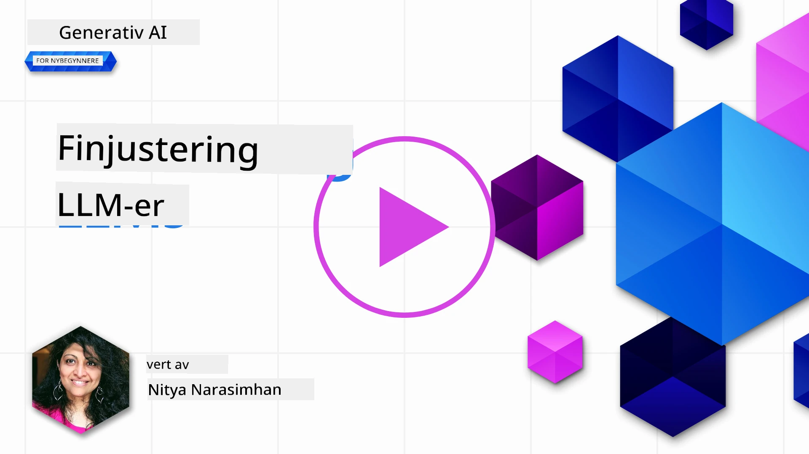
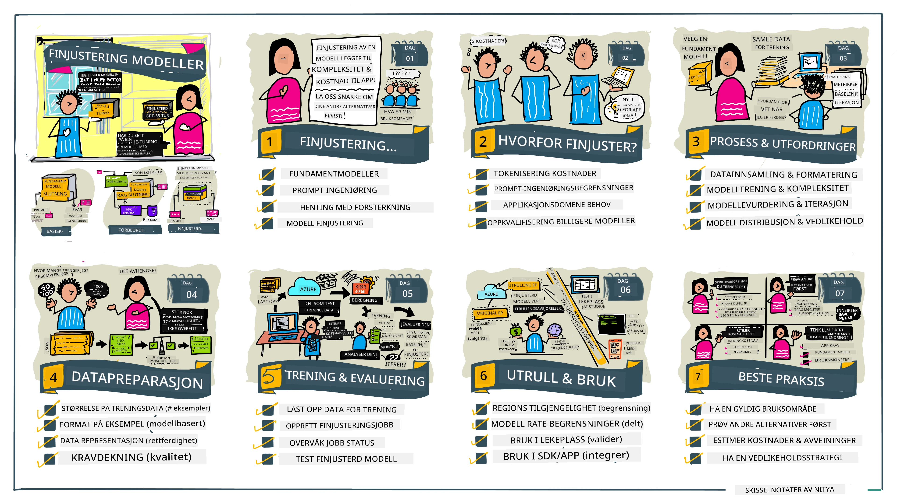

# Finjustering av din LLM

Å bruke store språkmodeller for å bygge generative AI-applikasjoner medfører nye utfordringer. En nøkkelutfordring er å sikre svarprosessens kvalitet (nøyaktighet og relevans) i innhold generert av modellen for en gitt brukerforespørsel. I tidligere leksjoner diskuterte vi teknikker som prompt engineering og retrieval-augmented generation som prøver å løse problemet ved å _endre prompt-inputen_ til den eksisterende modellen.

I dagens leksjon diskuterer vi en tredje teknikk, **finjustering**, som prøver å møte utfordringen ved å _trene modellen på nytt_ med ekstra data. La oss dykke ned i detaljene.

## Læringsmål

Denne leksjonen introduserer konseptet finjustering for forhåndstrente språkmodeller, utforsker fordeler og utfordringer ved denne tilnærmingen, og gir veiledning om når og hvordan du kan bruke finjustering for å forbedre ytelsen til dine generative AI-modeller.

Når du er ferdig med denne leksjonen, bør du kunne svare på følgende spørsmål:

- Hva er finjustering for språkmodeller?
- Når, og hvorfor, er finjustering nyttig?
- Hvordan kan jeg finjustere en forhåndstrent modell?
- Hva er begrensningene ved finjustering?

Klar? La oss komme i gang.

## Illustrert guide

Vil du få et overblikk over hva vi skal dekke før vi går i gang? Sjekk ut denne illustrerte guiden som beskriver læringsreisen for denne leksjonen - fra å lære kjernebegrepene og motivasjonen for finjustering, til å forstå prosessen og beste praksis for å utføre finjusteringsoppgaven. Dette er et fascinerende tema for utforskning, så ikke glem å sjekke ut [Ressurser](./RESOURCES.md?WT.mc_id=academic-105485-koreyst)-siden for flere lenker til å støtte din selvstyrte læringsreise!

## Hva er finjustering for språkmodeller?

Per definisjon er store språkmodeller _forhåndstrent_ på store mengder tekst hentet fra ulike kilder inkludert internett. Som vi har lært i tidligere leksjoner, trenger vi teknikker som _prompt engineering_ og _retrieval-augmented generation_ for å forbedre kvaliteten på modellens svar på brukerens spørsmål ("prompter").

En populær prompt engineering-teknikk innebærer å gi modellen mer veiledning om hva som forventes i svaret, enten ved å gi _instruksjoner_ (eksplisitt veiledning) eller _gi den noen få eksempler_ (implisitt veiledning). Dette kalles _few-shot learning_, men det har to begrensninger:

- Modellens token-grenser kan begrense antall eksempler du kan gi, og dermed redusere effektiviteten.
- Kostnadene for modeltokens kan gjøre det dyrt å legge til eksempler i hver prompt, og begrense fleksibiliteten.

Finjustering er en vanlig praksis i maskinlæringssystemer hvor vi tar en forhåndstrent modell og trener den på nytt med nye data for å forbedre ytelsen på en spesifikk oppgave. I sammenheng med språkmodeller kan vi finjustere den forhåndstrente modellen _med et kuratert sett av eksempler for en gitt oppgave eller applikasjonsdomene_ for å skape en **skreddersydd modell** som kan være mer nøyaktig og relevant for den spesifikke oppgaven eller domenet. En bieffekt av finjustering er at det også kan redusere antall eksempler som trengs for few-shot learning - noe som reduserer token-bruk og relaterte kostnader.

## Når og hvorfor bør vi finjustere modeller?

I _denne_ konteksten, når vi snakker om finjustering, refererer vi til **supervised** finjustering hvor ny trening gjøres ved å **legge til nye data** som ikke var en del av det opprinnelige treningsdatasettet. Dette er forskjellig fra en unsupervised finjusteringsmetode hvor modellen trenes på nytt med de opprinnelige dataene, men med forskjellige hyperparametere.

Det viktigste å huske er at finjustering er en avansert teknikk som krever et visst nivå av ekspertise for å oppnå ønskede resultater. Hvis det gjøres feil, kan det hende at det ikke gir forventede forbedringer, og det kan til og med redusere ytelsen til modellen for det målrettede domenet.

Så, før du lærer "hvordan" du finjusterer språkmodeller, må du vite "hvorfor" du bør velge denne veien, og "når" du skal starte finjusteringsprosessen. Start med å stille deg selv disse spørsmålene:

- **Bruksområde**: Hva er ditt _brukstilfelle_ for finjustering? Hvilket aspekt ved den nåværende forhåndstrente modellen ønsker du å forbedre?
- **Alternativer**: Har du prøvd _andre teknikker_ for å oppnå ønskede resultater? Bruk dem for å lage en referanse for sammenligning.
  - Prompt engineering: Prøv teknikker som few-shot prompting med eksempler på relevante prompt-svar. Evaluer kvaliteten på svarene.
  - Retrieval Augmented Generation: Prøv å forbedre promptene med spørringsresultater hentet ved å søke i dine data. Evaluer kvaliteten på svarene.
- **Kostnader**: Har du identifisert kostnadene ved finjustering?
  - Finjusterbarhet - er den forhåndstrente modellen tilgjengelig for finjustering?
  - Innsats - for å forberede treningsdata, evaluere og forbedre modellen.
  - Beregning - for å kjøre finjusteringsjobber, og for å distribuere finjustert modell.
  - Data - tilgang til tilstrekkelig kvalitets-eksempler for finjusteringseffekt.
- **Fordeler**: Har du bekreftet fordelene ved finjustering?
  - Kvalitet - overgikk den finjusterte modellen referansen?
  - Kostnad - reduserer det token-bruk ved å forenkle prompter?
  - Utvidbarhet - kan du gjenbruke grunnmodellen for nye domener?

Ved å svare på disse spørsmålene bør du kunne avgjøre om finjustering er riktig tilnærming for ditt bruksområde. Ideelt sett er tilnærmingen gyldig bare hvis fordelene oppveier kostnadene. Når du bestemmer deg for å gå videre, er det tid for å tenke på _hvordan_ du kan finjustere den forhåndstrente modellen.

Vil du ha flere innblikk i beslutningsprosessen? Se [Å finjustere eller ikke finjustere](https://www.youtube.com/watch?v=0Jo-z-MFxJs)

## Hvordan kan vi finjustere en forhåndstrent modell?

For å finjustere en forhåndstrent modell trenger du:

- en forhåndstrent modell å finjustere
- et datasett som skal brukes til finjustering
- et treningsmiljø for å kjøre finjusteringsjobben
- et hostingmiljø for å distribuere den finjusterte modellen

## Finjustering i praksis

Følgende ressurser tilbyr steg-for-steg veiledninger som tar deg gjennom et reelt eksempel med bruk av en utvalgt modell med et kuratert datasett. For å jobbe gjennom disse veiledningene trenger du en konto hos den aktuelle leverandøren, sammen med tilgang til relevante modeller og datasett.

| Leverandør  | Veiledning                                                                                                                                                                  | Beskrivelse                                                                                                                                                                                                                                                                                                                                                                                                                         |
| ----------- | ------------------------------------------------------------------------------------------------------------------------------------------------------------------------- | --------------------------------------------------------------------------------------------------------------------------------------------------------------------------------------------------------------------------------------------------------------------------------------------------------------------------------------------------------------------------------------------------------------------------------- |
| OpenAI      | [Hvordan finjustere chat-modeller](https://github.com/openai/openai-cookbook/blob/main/examples/How_to_finetune_chat_models.ipynb?WT.mc_id=academic-105485-koreyst)       | Lær å finjustere en `gpt-35-turbo` for et spesifikt domene ("oppskriftassistent") ved å forberede treningsdata, kjøre finjusteringsjobben og bruke den finjusterte modellen for inferens.                                                                                                                                                                                                                                         |
| Azure OpenAI| [GPT 3.5 Turbo finjustering tutorial](https://learn.microsoft.com/azure/ai-services/openai/tutorials/fine-tune?tabs=python-new%2Ccommand-line&WT.mc_id=academic-105485-koreyst) | Lær å finjustere en `gpt-35-turbo-0613` modell **på Azure** ved å følge trinn for å lage og laste opp treningsdata, kjøre finjusteringsjobben. Distribuer og bruk den nye modellen.                                                                                                                                                                                                                                               |
| Hugging Face| [Finjustering av LLMs med Hugging Face](https://www.philschmid.de/fine-tune-llms-in-2024-with-trl?WT.mc_id=academic-105485-koreyst)                                      | Dette blogginnlegget veileder deg i finjustering av en _åpen LLM_ (eksempel: `CodeLlama 7B`) ved bruk av [transformers](https://huggingface.co/docs/transformers/index?WT.mc_id=academic-105485-koreyst) biblioteket og [Transformer Reinforcement Learning (TRL)](https://huggingface.co/docs/trl/index?WT.mc_id=academic-105485-koreyst) med åpne [datasets](https://huggingface.co/docs/datasets/index?WT.mc_id=academic-105485-koreyst) på Hugging Face.     |
|             |                                                                                                                                                                           |                                                                                                                                                                                                                                                                                                                                                                                                                                   |
| 🤗 AutoTrain | [Finjustering av LLMs med AutoTrain](https://github.com/huggingface/autotrain-advanced/?WT.mc_id=academic-105485-koreyst)                                                | AutoTrain (eller AutoTrain Advanced) er et python-bibliotek utviklet av Hugging Face som tillater finjustering for mange forskjellige oppgaver inkludert finjustering av LLM. AutoTrain er en kodefri løsning, og finjustering kan gjøres i din egen sky, på Hugging Face Spaces eller lokalt. Den støtter både web-basert GUI, CLI og trening via yaml-konfigurasjonsfiler.                                                                              |
|             |                                                                                                                                                                           |                                                                                                                                                                                                                                                                                                                                                                                                                                   |
| 🦥 Unsloth   | [Finjustering av LLMs med Unsloth](https://github.com/unslothai/unsloth)                                                                                                | Unsloth er et åpen-kildekode-rammeverk som støtter finjustering av LLM og forsterkende læring (RL). Unsloth forenkler lokal trening, evaluering og distribusjon med klare [notatbøker](https://github.com/unslothai/notebooks). Den støtter også tekst-til-tale (TTS), BERT og multimodale modeller. For å komme i gang, les deres steg-for-steg [Guide til finjustering av LLMs](https://docs.unsloth.ai/get-started/fine-tuning-llms-guide).               |
|             |                                                                                                                                                                           |                                                                                                                                                                                                                                                                                                                                                                                                                                   |
## Oppgave

Velg en av veiledningene ovenfor og gjennomgå den. _Vi kan komme til å lage en versjon av disse veiledningene i Jupyter Notebooks i dette repoet kun som referanse. Vennligst bruk originale kilder direkte for å få de nyeste versjonene_.

## Flott arbeid! Fortsett å lære.

Etter å ha fullført denne leksjonen, sjekk ut vår [Generative AI Læringssamling](https://aka.ms/genai-collection?WT.mc_id=academic-105485-koreyst) for å fortsette å øke din kunnskap om Generative AI!

Gratulerer!! Du har fullført den siste leksjonen i v2-serien for dette kurset! Ikke stopp å lære og bygge. \*\*Sjekk ut [RESSURSER](RESOURCES.md?WT.mc_id=academic-105485-koreyst)-siden for en liste med ytterligere anbefalinger for nettopp dette temaet.

Vår v1-serie av leksjoner er også oppdatert med flere oppgaver og konsepter. Ta deg et øyeblikk til å friske opp kunnskapen din - og vennligst [del dine spørsmål og tilbakemeldinger](https://github.com/microsoft/generative-ai-for-beginners/issues?WT.mc_id=academic-105485-koreyst) for å hjelpe oss å forbedre disse leksjonene for fellesskapet.

---

<!-- CO-OP TRANSLATOR DISCLAIMER START -->
**Ansvarsfraskrivelse**:
Dette dokumentet er oversatt ved hjelp av AI-oversettelsestjenesten [Co-op Translator](https://github.com/Azure/co-op-translator). Selv om vi streber etter nøyaktighet, vennligst vær oppmerksom på at automatiske oversettelser kan inneholde feil eller unøyaktigheter. Det originale dokumentet på dets opprinnelige språk skal anses som den autoritative kilden. For kritisk informasjon anbefales profesjonell menneskelig oversettelse. Vi påtar oss ikke ansvar for misforståelser eller feiltolkninger som oppstår ved bruk av denne oversettelsen.
<!-- CO-OP TRANSLATOR DISCLAIMER END -->