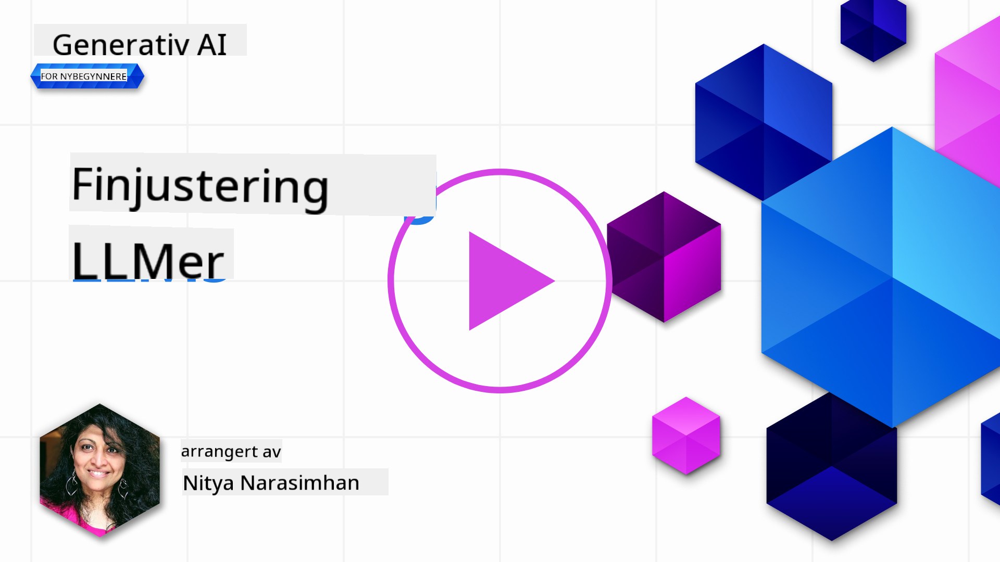
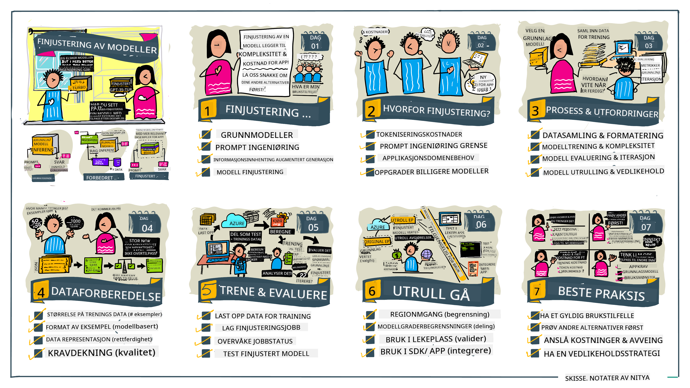

<!--
CO_OP_TRANSLATOR_METADATA:
{
  "original_hash": "68664f7e754a892ae1d8d5e2b7bd2081",
  "translation_date": "2025-06-26T00:44:44+00:00",
  "source_file": "18-fine-tuning/README.md",
  "language_code": "no"
}
-->

# Finjustering av din LLM

Å bruke store språkmodeller for å bygge generative AI-applikasjoner kommer med nye utfordringer. En viktig problemstilling er å sikre responskvalitet (nøyaktighet og relevans) i innholdet generert av modellen for en gitt brukerforespørsel. I tidligere leksjoner diskuterte vi teknikker som prompt engineering og retrieval-augmented generation som forsøker å løse problemet ved å _endre promptinnholdet_ til den eksisterende modellen.

I dagens leksjon diskuterer vi en tredje teknikk, **finjustering**, som prøver å adressere utfordringen ved å _trene modellen på nytt_ med ekstra data. La oss dykke inn i detaljene.

## Læringsmål

Denne leksjonen introduserer konseptet finjustering for forhåndstrente språkmodeller, utforsker fordelene og utfordringene ved denne tilnærmingen, og gir veiledning om når og hvordan man kan bruke finjustering for å forbedre ytelsen til dine generative AI-modeller.

Ved slutten av denne leksjonen bør du kunne svare på følgende spørsmål:

- Hva er finjustering for språkmodeller?
- Når, og hvorfor, er finjustering nyttig?
- Hvordan kan jeg finjustere en forhåndstrent modell?
- Hva er begrensningene ved finjustering?

Klar? La oss komme i gang.

## Illustrert Guide

Vil du få et overblikk over hva vi skal dekke før vi dykker inn? Sjekk ut denne illustrerte guiden som beskriver læringsreisen for denne leksjonen - fra å lære kjernekonseptene og motivasjonen for finjustering, til å forstå prosessen og beste praksis for å utføre finjusteringsoppgaven. Dette er et fascinerende tema for utforskning, så ikke glem å sjekke ut [Ressurser](./RESOURCES.md?WT.mc_id=academic-105485-koreyst) siden for ekstra lenker for å støtte din selvstyrte læringsreise!

## Hva er finjustering for språkmodeller?

Per definisjon er store språkmodeller _forhåndstrente_ på store mengder tekst hentet fra ulike kilder, inkludert internett. Som vi har lært i tidligere leksjoner, trenger vi teknikker som _prompt engineering_ og _retrieval-augmented generation_ for å forbedre kvaliteten på modellens svar på brukerens spørsmål ("prompts").

En populær prompt-engineering teknikk involverer å gi modellen mer veiledning om hva som forventes i svaret enten ved å gi _instruksjoner_ (eksplisitt veiledning) eller _gi den noen få eksempler_ (implisitt veiledning). Dette kalles _few-shot learning_, men det har to begrensninger:

- Modellens tokenbegrensninger kan begrense antall eksempler du kan gi, og begrense effektiviteten.
- Kostnader for modellens tokens kan gjøre det dyrt å legge til eksempler til hver prompt, og begrense fleksibiliteten.

Finjustering er en vanlig praksis i maskinlæringssystemer der vi tar en forhåndstrent modell og trener den på nytt med nye data for å forbedre ytelsen på en spesifikk oppgave. I konteksten av språkmodeller kan vi finjustere den forhåndstrente modellen _med et kurert sett av eksempler for en gitt oppgave eller applikasjonsdomene_ for å lage en **tilpasset modell** som kan være mer nøyaktig og relevant for den spesifikke oppgaven eller domenet. En sidefordel ved finjustering er at det også kan redusere antall eksempler som trengs for få-skudd læring - redusere tokenbruk og relaterte kostnader.

## Når og hvorfor bør vi finjustere modeller?

I _denne_ konteksten, når vi snakker om finjustering, refererer vi til **supervisert** finjustering der treningen gjøres ved å **legge til nye data** som ikke var en del av det originale treningsdatasettet. Dette er forskjellig fra en usupervisert finjusteringstilnærming der modellen trenes på nytt på de originale dataene, men med forskjellige hyperparametere.

Det viktige å huske er at finjustering er en avansert teknikk som krever et visst nivå av ekspertise for å oppnå ønskede resultater. Hvis det gjøres feil, kan det ikke gi de forventede forbedringene, og kan til og med forringe modellens ytelse for ditt målrettede domene.

Så, før du lærer "hvordan" du kan finjustere språkmodeller, må du vite "hvorfor" du bør ta denne veien, og "når" du skal starte prosessen med finjustering. Begynn med å stille deg selv disse spørsmålene:

- **Brukstilfelle**: Hva er ditt _brukstilfelle_ for finjustering? Hvilken del av den nåværende forhåndstrente modellen ønsker du å forbedre?
- **Alternativer**: Har du prøvd _andre teknikker_ for å oppnå de ønskede resultatene? Bruk dem til å lage en baseline for sammenligning.
  - Prompt engineering: Prøv teknikker som få-skudd prompting med eksempler på relevante promptresponser. Evaluer kvaliteten på svarene.
  - Retrieval Augmented Generation: Prøv å supplere prompts med forespørselsresultater hentet ved å søke i dine data. Evaluer kvaliteten på svarene.
- **Kostnader**: Har du identifisert kostnadene for finjustering?
  - Tunability - er den forhåndstrente modellen tilgjengelig for finjustering?
  - Innsats - for å forberede treningsdata, evaluere og forbedre modell.
  - Datakraft - for å kjøre finjusteringsjobber, og distribuere finjustert modell
  - Data - tilgang til tilstrekkelige kvalitets eksempler for finjusteringsinnvirkning
- **Fordeler**: Har du bekreftet fordelene ved finjustering?
  - Kvalitet - overgikk den finjusterte modellen baseline?
  - Kostnad - reduserer den tokenbruk ved å forenkle prompts?
  - Utvidbarhet - kan du gjenbruke basismodellen for nye domener?

Ved å svare på disse spørsmålene, bør du kunne avgjøre om finjustering er riktig tilnærming for ditt brukstilfelle. Ideelt sett er tilnærmingen gyldig bare hvis fordelene oppveier kostnadene. Når du bestemmer deg for å gå videre, er det på tide å tenke på _hvordan_ du kan finjustere den forhåndstrente modellen.

Vil du ha mer innsikt i beslutningsprosessen? Se [Å finjustere eller ikke finjustere](https://www.youtube.com/watch?v=0Jo-z-MFxJs)

## Hvordan kan vi finjustere en forhåndstrent modell?

For å finjustere en forhåndstrent modell, trenger du å ha:

- en forhåndstrent modell å finjustere
- et datasett å bruke for finjustering
- et treningsmiljø for å kjøre finjusteringsjobben
- et vertsmiljø for å distribuere finjustert modell

## Finjustering i praksis

Følgende ressurser gir steg-for-steg veiledninger for å gå gjennom et ekte eksempel ved å bruke en valgt modell med et kurert datasett. For å arbeide gjennom disse veiledningene, trenger du en konto hos den spesifikke leverandøren, sammen med tilgang til den relevante modellen og datasettene.

| Leverandør   | Veiledning                                                                                                                                                                       | Beskrivelse                                                                                                                                                                                                                                                                                                                                                                                                                        |
| ------------ | -------------------------------------------------------------------------------------------------------------------------------------------------------------------------------- | ---------------------------------------------------------------------------------------------------------------------------------------------------------------------------------------------------------------------------------------------------------------------------------------------------------------------------------------------------------------------------------------------------------------------------------- |
| OpenAI       | [Hvordan finjustere chatmodeller](https://github.com/openai/openai-cookbook/blob/main/examples/How_to_finetune_chat_models.ipynb?WT.mc_id=academic-105485-koreyst)                | Lær å finjustere en `gpt-35-turbo` for et spesifikt domene ("oppskriftsassistent") ved å forberede treningsdata, kjøre finjusteringsjobben, og bruke den finjusterte modellen for inferens.                                                                                                                                                                                                                                      |
| Azure OpenAI | [GPT 3.5 Turbo finjusteringsveiledning](https://learn.microsoft.com/azure/ai-services/openai/tutorials/fine-tune?tabs=python-new%2Ccommand-line?WT.mc_id=academic-105485-koreyst) | Lær å finjustere en `gpt-35-turbo-0613` modell **på Azure** ved å ta skritt for å lage og laste opp treningsdata, kjøre finjusteringsjobben. Distribuer og bruk den nye modellen.                                                                                                                                                                                                                                                      |
| Hugging Face | [Finjustering av LLMs med Hugging Face](https://www.philschmid.de/fine-tune-llms-in-2024-with-trl?WT.mc_id=academic-105485-koreyst)                                               | Dette blogginnlegget guider deg gjennom finjustering av en _åpen LLM_ (f.eks. `CodeLlama 7B`) ved hjelp av [transformers](https://huggingface.co/docs/transformers/index?WT.mc_id=academic-105485-koreyst) biblioteket & [Transformer Reinforcement Learning (TRL)](https://huggingface.co/docs/trl/index?WT.mc_id=academic-105485-koreyst]) med åpne [datasets](https://huggingface.co/docs/datasets/index?WT.mc_id=academic-105485-koreyst) på Hugging Face. |
|              |                                                                                                                                                                                  |                                                                                                                                                                                                                                                                                                                                                                                                                                    |
| 🤗 AutoTrain | [Finjustering av LLMs med AutoTrain](https://github.com/huggingface/autotrain-advanced/?WT.mc_id=academic-105485-koreyst)                                                         | AutoTrain (eller AutoTrain Advanced) er et python-bibliotek utviklet av Hugging Face som tillater finjustering for mange forskjellige oppgaver inkludert LLM finjustering. AutoTrain er en kodefri løsning og finjustering kan gjøres i din egen sky, på Hugging Face Spaces eller lokalt. Det støtter både en web-basert GUI, CLI og trening via yaml konfigurasjonsfiler.                                                               |
|              |                                                                                                                                                                                  |                                                                                                                                                                                                                                                                                                                                                                                                                                    |

## Oppgave

Velg en av veiledningene ovenfor og gå gjennom dem. _Vi kan replikere en versjon av disse veiledningene i Jupyter Notebooks i dette repoet kun for referanse. Vennligst bruk de originale kildene direkte for å få de nyeste versjonene_.

## Flott arbeid! Fortsett din læring.

Etter å ha fullført denne leksjonen, sjekk ut vår [Generative AI Learning collection](https://aka.ms/genai-collection?WT.mc_id=academic-105485-koreyst) for å fortsette å øke din kunnskap om Generativ AI!

Gratulerer!! Du har fullført den siste leksjonen fra v2-serien for dette kurset! Ikke slutt å lære og bygge. \*\*Sjekk ut [RESSURSER](RESOURCES.md?WT.mc_id=academic-105485-koreyst) siden for en liste over ekstra forslag for akkurat dette temaet.

Vår v1-serie av leksjoner har også blitt oppdatert med flere oppgaver og konsepter. Så ta et øyeblikk for å friske opp din kunnskap - og vennligst [del dine spørsmål og tilbakemeldinger](https://github.com/microsoft/generative-ai-for-beginners/issues?WT.mc_id=academic-105485-koreyst) for å hjelpe oss med å forbedre disse leksjonene for fellesskapet.

**Ansvarsfraskrivelse**:  
Dette dokumentet er oversatt ved hjelp av AI-oversettelsestjenesten [Co-op Translator](https://github.com/Azure/co-op-translator). Selv om vi streber etter nøyaktighet, vær oppmerksom på at automatiserte oversettelser kan inneholde feil eller unøyaktigheter. Det opprinnelige dokumentet på sitt opprinnelige språk bør anses som den autoritative kilden. For kritisk informasjon anbefales profesjonell menneskelig oversettelse. Vi er ikke ansvarlige for eventuelle misforståelser eller feiltolkninger som oppstår fra bruken av denne oversettelsen.