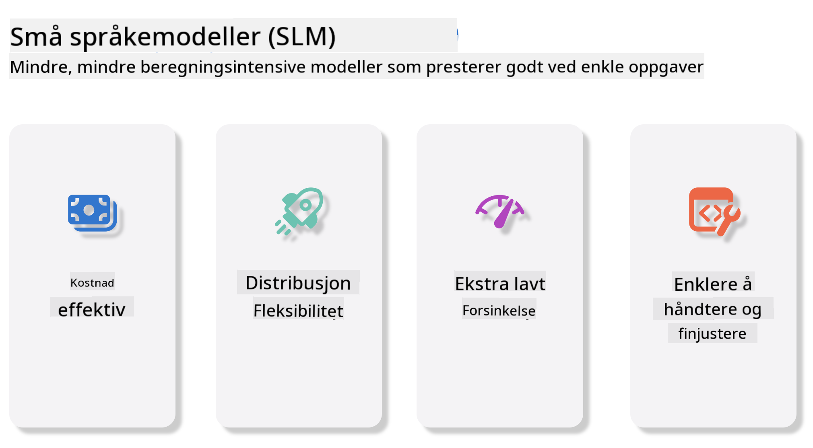
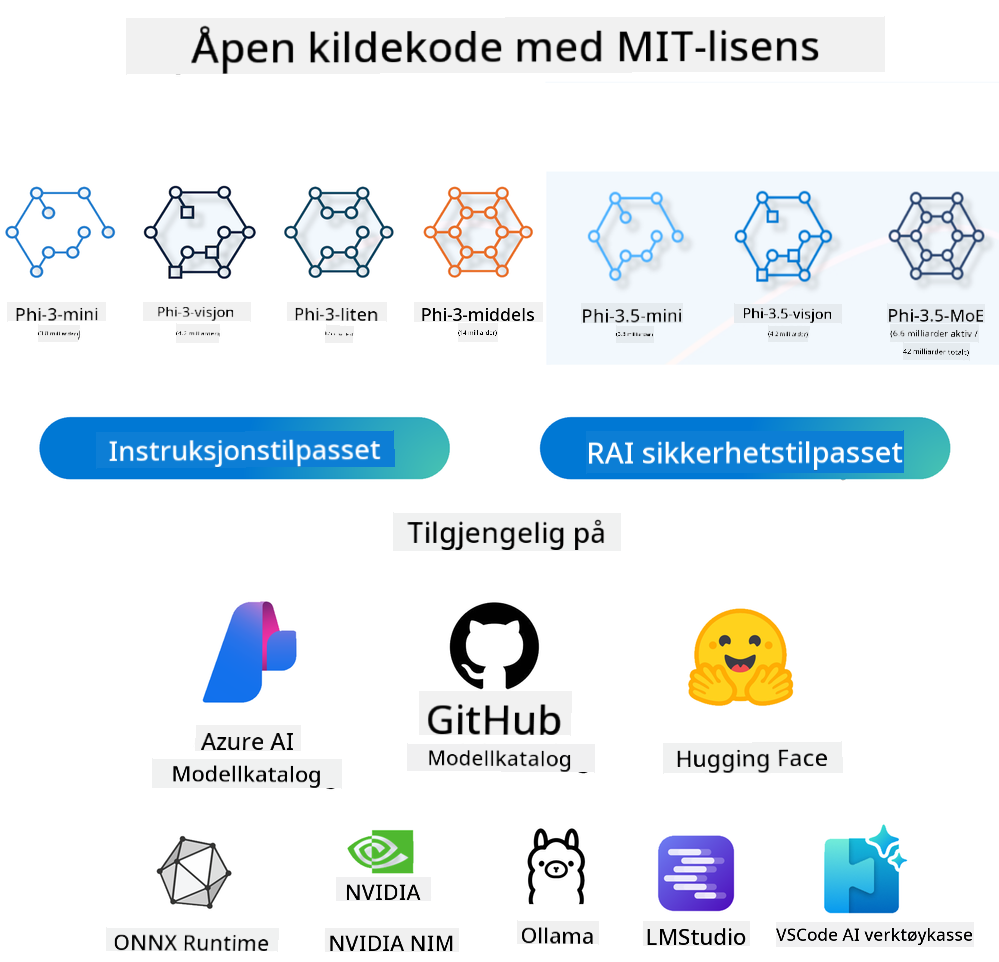
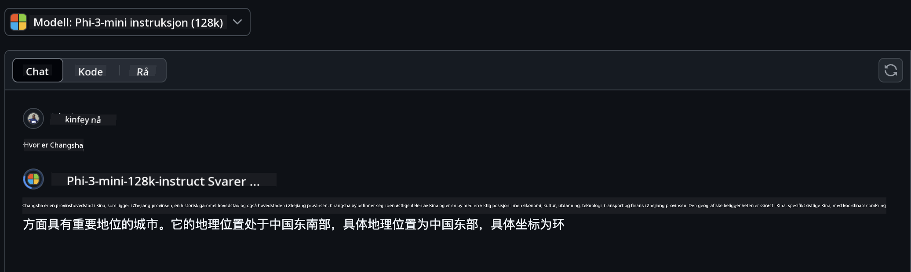
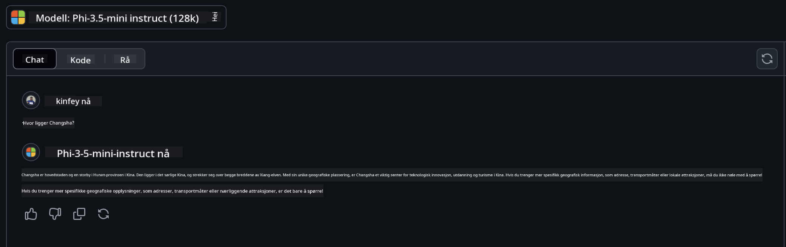

<!--
CO_OP_TRANSLATOR_METADATA:
{
  "original_hash": "124ad36cfe96f74038811b6e2bb93e9d",
  "translation_date": "2025-05-20T10:03:58+00:00",
  "source_file": "19-slm/README.md",
  "language_code": "no"
}
-->
# Introduksjon til små språkmodeller for generativ AI for nybegynnere Generativ AI er et fascinerende felt innen kunstig intelligens som fokuserer på å lage systemer som er i stand til å generere nytt innhold. Dette innholdet kan variere fra tekst og bilder til musikk og til og med hele virtuelle miljøer. En av de mest spennende anvendelsene av generativ AI er innenfor språkområdet. ## Hva er små språkmodeller? En liten språkmodell (SLM) representerer en nedskalert variant av en stor språkmodell (LLM), og utnytter mange av de arkitektoniske prinsippene og teknikkene til LLM-er, samtidig som den har en betydelig redusert beregningsmessig fotavtrykk. SLM-er er en undergruppe av språkmodeller designet for å generere menneskelignende tekst. I motsetning til sine større motparter, som GPT-4, er SLM-er mer kompakte og effektive, noe som gjør dem ideelle for applikasjoner der beregningsressursene er begrensede. Til tross for sin mindre størrelse kan de fortsatt utføre en rekke oppgaver. Typisk blir SLM-er konstruert ved å komprimere eller destillere LLM-er, med mål om å beholde en betydelig del av den opprinnelige modellens funksjonalitet og språklige evner. Denne reduksjonen i modellstørrelse reduserer den totale kompleksiteten, noe som gjør SLM-er mer effektive både med hensyn til minnebruk og beregningskrav. Til tross for disse optimaliseringene kan SLM-er fortsatt utføre et bredt spekter av oppgaver innen naturlig språkbehandling (NLP): - Tekstgenerering: Lage sammenhengende og kontekstuelt relevante setninger eller avsnitt. - Tekstfullføring: Forutsi og fullføre setninger basert på en gitt prompt. - Oversettelse: Konvertere tekst fra ett språk til et annet. - Sammendrag: Kondensering av lange tekststykker til kortere, mer fordøyelige sammendrag. Om enn med noen avveininger i ytelse eller dybde av forståelse sammenlignet med deres større motparter. ## Hvordan fungerer små språkmodeller? SLM-er trenes på store mengder tekstdata. Under opplæringen lærer de mønstrene og strukturene i språket, slik at de kan generere tekst som både er grammatisk korrekt og kontekstuelt passende. Treningsprosessen involverer: - Datainnsamling: Samle store datasett av tekst fra ulike kilder. - Forbehandling: Rensing og organisering av dataene for å gjøre dem egnet for trening. - Opplæring: Bruke maskinlæringsalgoritmer for å lære modellen å forstå og generere tekst. - Finjustering: Justere modellen for å forbedre ytelsen på spesifikke oppgaver. Utviklingen av SLM-er er i tråd med det økende behovet for modeller som kan distribueres i ressursbegrensede miljøer, for eksempel mobile enheter eller edge computing-plattformer, der fullskala LLM-er kan være upraktiske på grunn av deres høye ressurskrav. Ved å fokusere på effektivitet balanserer SLM-er ytelse med tilgjengelighet, noe som muliggjør bredere anvendelse på tvers av ulike domener.  ## Læringsmål I denne leksjonen håper vi å introdusere kunnskapen om SLM og kombinere den med Microsoft Phi-3 for å lære ulike scenarier innen tekstinnhold, visjon og MoE. Ved slutten av denne leksjonen bør du kunne svare på følgende spørsmål: - Hva er SLM - Hva er forskjellen mellom SLM og LLM - Hva er Microsoft Phi-3/3.5-familien - Hvordan inferere Microsoft Phi-3/3.5-familien Klar? La oss komme i gang. ## Forskjellene mellom store språkmodeller (LLM-er) og små språkmodeller (SLM-er) Både LLM-er og SLM-er er bygget på grunnleggende prinsipper for sannsynlighetsbasert maskinlæring, og følger lignende tilnærminger i deres arkitektoniske design, opplæringsmetodologier, datagenereringsprosesser og modelevalueringsmetoder. Imidlertid skiller flere nøkkelfaktorer disse to typene modeller. ## Anvendelser av små språkmodeller SLM-er har et bredt spekter av anvendelser, inkludert: - Chatbots: Gi kundestøtte og engasjere brukere på en samtalemessig måte. - Innholdsskaping: Assistere skribenter ved å generere ideer eller til og med utarbeide hele artikler. - Utdanning: Hjelpe studenter med skriveoppgaver eller lære nye språk. - Tilgjengelighet: Lage verktøy for personer med funksjonshemninger, for eksempel tekst-til-tale-systemer. **Størrelse** En primær forskjell mellom LLM-er og SLM-er ligger i skalaen på modellene. LLM-er, som ChatGPT (GPT-4), kan bestå av anslagsvis 1,76 billioner parametere, mens åpne SLM-er som Mistral 7B er designet med betydelig færre parametere—omtrent 7 milliarder. Denne forskjellen skyldes primært forskjeller i modellarkitektur og opplæringsprosesser. For eksempel bruker ChatGPT en selvoppmerksomhetsmekanisme innenfor en encoder-decoder-rammeverk, mens Mistral 7B bruker skyvevinduoppmerksomhet, som muliggjør mer effektiv opplæring innenfor en dekoder-only-modell. Denne arkitektoniske variasjonen har dype implikasjoner for kompleksiteten og ytelsen til disse modellene. **Forståelse** SLM-er er vanligvis optimalisert for ytelse innen spesifikke domener, noe som gjør dem svært spesialiserte, men potensielt begrenset i deres evne til å gi bred kontekstuell forståelse på tvers av flere kunnskapsfelt. I kontrast, LLM-er har som mål å simulere menneskelignende intelligens på et mer omfattende nivå. Trenet på store, mangfoldige datasett, er LLM-er designet for å prestere godt på tvers av en rekke domener, og tilbyr større allsidighet og tilpasningsevne. Følgelig er LLM-er mer egnet for et bredere spekter av nedstrømsoppgaver, som naturlig språkbehandling og programmering. **Databehandling** Opplæring og distribusjon av LLM-er er ressurskrevende prosesser, som ofte krever betydelig beregningsinfrastruktur, inkludert store GPU-klynger. For eksempel kan opplæring av en modell som ChatGPT fra bunnen av kreve tusenvis av GPU-er over lengre perioder. I kontrast er SLM-er, med sine mindre parameterantall, mer tilgjengelige når det gjelder beregningsressurser. Modeller som Mistral 7B kan trenes og kjøres på lokale maskiner utstyrt med moderate GPU-kapasiteter, selv om opplæring fortsatt krever flere timer på tvers av flere GPU-er. **Bias** Bias er et kjent problem i LLM-er, hovedsakelig på grunn av naturen til treningsdataene. Disse modellene er ofte avhengige av rå, åpent tilgjengelige data fra internett, som kan underrepresentere eller feile representere visse grupper, introdusere feil merking, eller reflektere språklige skjevheter påvirket av dialekt, geografiske variasjoner og grammatiske regler. I tillegg kan kompleksiteten i LLM-arkitekturer utilsiktet forverre bias, som kan gå ubemerket uten nøye finjustering. På den andre siden er SLM-er, som trenes på mer begrensede, domene-spesifikke datasett, iboende mindre utsatt for slike skjevheter, selv om de ikke er immune mot dem. **Innføring** Den reduserte størrelsen på SLM-er gir dem en betydelig fordel når det gjelder innføringshastighet, slik at de kan generere utganger effektivt på lokal maskinvare uten behov for omfattende parallell prosessering. I kontrast krever LLM-er, på grunn av deres størrelse og kompleksitet, ofte betydelige parallelle beregningsressurser for å oppnå akseptable innføringstider. Tilstedeværelsen av flere samtidige brukere reduserer ytterligere LLM-ers responstider, spesielt når de distribueres i stor skala. Sammenfattende, mens både LLM-er og SLM-er deler en grunnleggende basis i maskinlæring, skiller de seg betydelig når det gjelder modellstørrelse, ressurskrav, kontekstuell forståelse, mottakelighet for bias, og innføringshastighet. Disse forskjellene reflekterer deres respektive egnethet for ulike bruksområder, med LLM-er som er mer allsidige, men ressurskrevende, og SLM-er som tilbyr mer domene-spesifikk effektivitet med reduserte beregningskrav. ***Merk: I dette kapittelet vil vi introdusere SLM ved å bruke Microsoft Phi-3 / 3.5 som et eksempel.*** ## Introduksjon av Phi-3 / Phi-3.5-familien Phi-3 / 3.5-familien retter seg hovedsakelig mot tekst-, visjons- og agentapplikasjonsscenarier (MoE): ### Phi-3 / 3.5 Instruksjon Hovedsakelig for tekstgenerering, samtalefullføring og innholdsinformasjonsuttrekking, etc. **Phi-3-mini** Den 3,8B språkmodellen er tilgjengelig på Microsoft Azure AI Studio, Hugging Face og Ollama. Phi-3-modeller overgår betydelig språkmodeller av samme og større størrelser på viktige benchmarks (se benchmark-tallene nedenfor, høyere tall er bedre). Phi-3-mini overgår modeller dobbelt så store, mens Phi-3-small og Phi-3-medium overgår større modeller, inkludert GPT-3.5 **Phi-3-small & medium** Med bare 7B parametere slår Phi-3-small GPT-3.5T på en rekke språk-, resonnement-, kode- og mattebenchmarks. Phi-3-medium med 14B parametere fortsetter denne trenden og overgår Gemini 1.0 Pro. **Phi-3.5-mini** Vi kan tenke på det som en oppgradering av Phi-3-mini. Mens parameterne forblir uendret, forbedrer det evnen til å støtte flere språk (støtter 20+ språk: arabisk, kinesisk, tsjekkisk, dansk, nederlandsk, engelsk, finsk, fransk, tysk, hebraisk, ungarsk, italiensk, japansk, koreansk, norsk, polsk, portugisisk, russisk, spansk, svensk, thai, tyrkisk, ukrainsk) og legger til sterkere støtte for lang kontekst. Phi-3.5-mini med 3,8B parametere overgår språkmodeller av samme størrelse og er på nivå med modeller dobbelt så store. ### Phi-3 / 3.5 Vision Vi kan tenke på instruksjonsmodellen til Phi-3/3.5 som Phis evne til å forstå, og Vision er det som gir Phi øyne til å forstå verden. **Phi-3-Vision** Phi-3-vision, med bare 4,2B parametere, fortsetter denne trenden og overgår større modeller som Claude-3 Haiku og Gemini 1.0 Pro V på generelle visuelle resonnementoppgaver, OCR og tabell- og diagramforståelsesoppgaver. **Phi-3.5-Vision** Phi-3.5-Vision er også en oppgradering av Phi-3-Vision, og legger til støtte for flere bilder. Du kan tenke på det som en forbedring av synet, ikke bare kan du se bilder, men også videoer. Phi-3.5-vision overgår større modeller som Claude-3.5 Sonnet og Gemini 1.5 Flash på tvers av OCR, tabell- og diagramforståelsesoppgaver og er på nivå på generelle visuelle kunnskapsresonnementoppgaver. Støtter flerbildeinngang, dvs. utfører resonnement på flere inndata bilder ### Phi-3.5-MoE ***Mixture of Experts (MoE)*** muliggjør modeller å bli forhåndstrent med langt mindre beregning, noe som betyr at du kan dramatisk skalere opp modell- eller datasettstørrelsen med samme beregningsbudsjett som en tett modell. Spesielt bør en MoE-modell oppnå samme kvalitet som sin tette motpart mye raskere under forhåndstrening. Phi-3.5-MoE består av 16x3.8B ekspertmoduler. Phi-3.5-MoE med bare 6.6B aktive parametere oppnår et lignende nivå av resonnement, språkforståelse og matte som mye større modeller Vi kan bruke Phi-3/3.5-familien modellen basert på ulike scenarier. I motsetning til LLM, kan du distribuere Phi-3/3.5-mini eller Phi-3/3.5-Vision på kant-enheter. ## Hvordan bruke Phi-3/3.5-familien modeller Vi håper å bruke Phi-3/3.5 i forskjellige scenarier. Deretter vil vi bruke Phi-3/3.5 basert på forskjellige scenarier.  ### Forskjell i inferens Skyens API **GitHub-modeller** GitHub
Modeller er den mest direkte måten. Du kan raskt få tilgang til Phi-3/3.5-Instruct-modellen gjennom GitHub Models. Kombinert med Azure AI Inference SDK / OpenAI SDK kan du få tilgang til API-en gjennom kode for å fullføre Phi-3/3.5-Instruct-anropet. Du kan også teste forskjellige effekter gjennom Playground. - Demo: Sammenligning av effektene av Phi-3-mini og Phi-3.5-mini i kinesiske scenarier   **Azure AI Studio** Eller hvis vi ønsker å bruke visjon- og MoE-modellene, kan du bruke Azure AI Studio for å fullføre anropet. Hvis du er interessert, kan du lese Phi-3 Cookbook for å lære hvordan du kaller Phi-3/3.5 Instruct, Vision, MoE gjennom Azure AI Studio [Klikk på denne lenken](https://github.com/microsoft/Phi-3CookBook/blob/main/md/02.QuickStart/AzureAIStudio_QuickStart.md?WT.mc_id=academic-105485-koreyst) **NVIDIA NIM** I tillegg til de skybaserte modellkatalogløsningene levert av Azure og GitHub, kan du også bruke [Nivida NIM](https://developer.nvidia.com/nim?WT.mc_id=academic-105485-koreyst) for å fullføre relaterte anrop. Du kan besøke NIVIDA NIM for å fullføre API-anropene til Phi-3/3.5-familien. NVIDIA NIM (NVIDIA Inference Microservices) er et sett med akselererte inferens-mikrotjenester designet for å hjelpe utviklere med å distribuere AI-modeller effektivt på tvers av ulike miljøer, inkludert skyer, datasentre og arbeidsstasjoner. Her er noen nøkkelfunksjoner ved NVIDIA NIM: - **Enkel distribusjon:** NIM tillater distribusjon av AI-modeller med en enkelt kommando, noe som gjør det enkelt å integrere i eksisterende arbeidsflyter. - **Optimalisert ytelse:** Den utnytter NVIDIA's forhåndsoptimaliserte inferensmotorer, som TensorRT og TensorRT-LLM, for å sikre lav latens og høy gjennomstrømning. - **Skalerbarhet:** NIM støtter automatisk skalering på Kubernetes, slik at den kan håndtere varierende arbeidsbelastninger effektivt. - **Sikkerhet og kontroll:** Organisasjoner kan opprettholde kontroll over dataene og applikasjonene sine ved å selv-hoste NIM-mikrotjenester på egen administrert infrastruktur. - **Standard API-er:** NIM gir industristandard API-er, noe som gjør det enkelt å bygge og integrere AI-applikasjoner som chatbots, AI-assistenter og mer. NIM er en del av NVIDIA AI Enterprise, som har som mål å forenkle distribusjonen og operasjonaliseringen av AI-modeller, og sikre at de kjører effektivt på NVIDIA GPU-er. - Demo: Bruke Nividia NIM til å kalle Phi-3.5-Vision-API [[Klikk på denne lenken](../../../19-slm/python/Phi-3-Vision-Nividia-NIM.ipynb)] ### Inferens Phi-3/3.5 i lokal miljø Inferens i forhold til Phi-3, eller en hvilken som helst språkmodell som GPT-3, refererer til prosessen med å generere svar eller prediksjoner basert på innspill den mottar. Når du gir en prompt eller spørsmål til Phi-3, bruker den sitt trente nevrale nettverk for å utlede det mest sannsynlige og relevante svaret ved å analysere mønstre og relasjoner i dataene den ble trent på. **Hugging Face Transformer** Hugging Face Transformers er et kraftig bibliotek designet for naturlig språkbehandling (NLP) og andre maskinlæringsoppgaver. Her er noen viktige punkter om det: 1. **Forhåndstrente modeller**: Det gir tusenvis av forhåndstrente modeller som kan brukes til ulike oppgaver som tekstklassifisering, navngitt enhetsgjenkjenning, spørsmålsbesvaring, oppsummering, oversettelse og tekstgenerering. 2. **Rammeverksinteroperabilitet**: Biblioteket støtter flere dyp læringsrammeverk, inkludert PyTorch, TensorFlow og JAX. Dette lar deg trene en modell i ett rammeverk og bruke den i et annet. 3. **Multimodale kapabiliteter**: I tillegg til NLP, støtter Hugging Face Transformers også oppgaver innen datavisjon (f.eks. bildeklassifisering, objektgjenkjenning) og lydbehandling (f.eks. talegjenkjenning, lydklassifisering). 4. **Brukervennlighet**: Biblioteket tilbyr API-er og verktøy for enkelt å laste ned og finjustere modeller, noe som gjør det tilgjengelig for både nybegynnere og eksperter. 5. **Samfunn og ressurser**: Hugging Face har et levende samfunn og omfattende dokumentasjon, veiledninger og guider for å hjelpe brukere med å komme i gang og få mest mulig ut av biblioteket. [offisiell dokumentasjon](https://huggingface.co/docs/transformers/index?WT.mc_id=academic-105485-koreyst) eller deres [GitHub-repositorium](https://github.com/huggingface/transformers?WT.mc_id=academic-105485-koreyst). Dette er den mest brukte metoden, men den krever også GPU-akselerasjon. Tross alt krever scener som Vision og MoE mange beregninger, som vil være svært begrenset i CPU-en hvis de ikke er kvantifisert. - Demo: Bruke Transformer til å kalle Phi-3.5-Instruct [Klikk på denne lenken](../../../19-slm/python/phi35-instruct-demo.ipynb) - Demo: Bruke Transformer til å kalle Phi-3.5-Vision[Klikk på denne lenken](../../../19-slm/python/phi35-vision-demo.ipynb) - Demo: Bruke Transformer til å kalle Phi-3.5-MoE[Klikk på denne lenken](../../../19-slm/python/phi35_moe_demo.ipynb) **Ollama** [Ollama](https://ollama.com/?WT.mc_id=academic-105485-koreyst) er en plattform designet for å gjøre det enklere å kjøre store språkmodeller (LLMs) lokalt på maskinen din. Den støtter ulike modeller som Llama 3.1, Phi 3, Mistral og Gemma 2, blant andre. Plattformen forenkler prosessen ved å pakke modellvekter, konfigurasjon og data inn i en enkelt pakke, noe som gjør det mer tilgjengelig for brukere å tilpasse og lage sine egne modeller. Ollama er tilgjengelig for macOS, Linux og Windows. Det er et flott verktøy hvis du ønsker å eksperimentere med eller distribuere LLM-er uten å stole på skytjenester. Ollama er den mest direkte måten, du trenger bare å utføre følgende uttalelse. ```bash

ollama run phi3.5

``` **ONNX Runtime for GenAI** [ONNX Runtime](https://github.com/microsoft/onnxruntime-genai?WT.mc_id=academic-105485-koreyst) er en plattform-uavhengig inferens- og treningsmaskinlæringsakselerator. ONNX Runtime for Generative AI (GENAI) er et kraftig verktøy som hjelper deg med å kjøre generative AI-modeller effektivt på tvers av ulike plattformer. ## Hva er ONNX Runtime? ONNX Runtime er et åpen kildekode-prosjekt som muliggjør høyytelses inferens av maskinlæringsmodeller. Den støtter modeller i Open Neural Network Exchange (ONNX)-formatet, som er en standard for å representere maskinlæringsmodeller.ONNX Runtime inferens kan muliggjøre raskere kundeopplevelser og lavere kostnader, støtte modeller fra dype læringsrammeverk som PyTorch og TensorFlow/Keras samt klassiske maskinlæringsbiblioteker som scikit-learn, LightGBM, XGBoost, etc. ONNX Runtime er kompatibel med ulike maskinvare, drivere og operativsystemer, og gir optimal ytelse ved å utnytte maskinvareakseleratorer der det er aktuelt sammen med grafoptimaliseringer og transformasjoner ## Hva er Generative AI? Generative AI refererer til AI-systemer som kan generere nytt innhold, som tekst, bilder eller musikk, basert på dataene de har blitt trent på. Eksempler inkluderer språkmodeller som GPT-3 og bildegenereringsmodeller som Stable Diffusion. ONNX Runtime for GenAI-biblioteket gir den generative AI-løkken for ONNX-modeller, inkludert inferens med ONNX Runtime, logits-behandling, søk og prøvetaking, og KV-cache-administrasjon. ## ONNX Runtime for GENAI ONNX Runtime for GENAI utvider kapasitetene til ONNX Runtime for å støtte generative AI-modeller. Her er noen nøkkelfunksjoner: - **Bred plattformstøtte:** Den fungerer på ulike plattformer, inkludert Windows, Linux, macOS, Android og iOS. - **Modellstøtte:** Den støtter mange populære generative AI-modeller, som LLaMA, GPT-Neo, BLOOM, og mer. - **Ytelsesoptimalisering:** Den inkluderer optimaliseringer for forskjellige maskinvareakseleratorer som NVIDIA GPU-er, AMD GPU-er, og mer2. - **Brukervennlighet:** Den gir API-er for enkel integrasjon i applikasjoner, slik at du kan generere tekst, bilder og annet innhold med minimal kode - Brukere kan kalle en høynivå generate()-metode, eller kjøre hver iterasjon av modellen i en løkke, generere en token om gangen, og eventuelt oppdatere generasjonsparametere inne i løkken. - ONNX runtime har også støtte for grådig/bjelkesøk og TopP, TopK-prøvetaking for å generere tokensekvenser og innebygd logits-behandling som repetisjonsstraffer. Du kan også enkelt legge til tilpasset poengberegning. ## Komme i gang For å komme i gang med ONNX Runtime for GENAI, kan du følge disse trinnene: ### Installer ONNX Runtime: ```Python
pip install onnxruntime
``` ### Installer de generative AI-utvidelsene: ```Python
pip install onnxruntime-genai
``` ### Kjør en modell: Her er et enkelt eksempel i Python: ```Python
import onnxruntime_genai as og

model = og.Model('path_to_your_model.onnx')

tokenizer = og.Tokenizer(model)

input_text = "Hello, how are you?"

input_tokens = tokenizer.encode(input_text)

output_tokens = model.generate(input_tokens)

output_text = tokenizer.decode(output_tokens)

print(output_text) 
``` ### Demo: Bruke ONNX Runtime GenAI til å kalle Phi-3.5-Vision ```python

import onnxruntime_genai as og

model_path = './Your Phi-3.5-vision-instruct ONNX Path'

img_path = './Your Image Path'

model = og.Model(model_path)

processor = model.create_multimodal_processor()

tokenizer_stream = processor.create_stream()

text = "Your Prompt"

prompt = "<|user|>\n"

prompt += "<|image_1|>\n"

prompt += f"{text}<|end|>\n"

prompt += "<|assistant|>\n"

image = og.Images.open(img_path)

inputs = processor(prompt, images=image)

params = og.GeneratorParams(model)

params.set_inputs(inputs)

params.set_search_options(max_length=3072)

generator = og.Generator(model, params)

while not generator.is_done():

    generator.compute_logits()
    
    generator.generate_next_token()

    new_token = generator.get_next_tokens()[0]
    
    code += tokenizer_stream.decode(new_token)
    
    print(tokenizer_stream.decode(new_token), end='', flush=True)

``` **Andre** I tillegg til ONNX Runtime og Ollama-referansemetoder, kan vi også fullføre referansen til kvantitative modeller basert på modellreferansemetodene levert av forskjellige produsenter. For eksempel Apple MLX-rammeverk med Apple Metal, Qualcomm QNN med NPU, Intel OpenVINO med CPU/GPU, etc. Du kan også få mer innhold fra [Phi-3 Cookbook](https://github.com/microsoft/phi-3cookbook?WT.mc_id=academic-105485-koreyst) ## Mer Vi har lært det grunnleggende om Phi-3/3.5-familien, men for å lære mer om SLM trenger vi mer kunnskap. Du kan finne svarene i Phi-3 Cookbook. Hvis du vil lære mer, vennligst besøk [Phi-3 Cookbook](https://github.com/microsoft/phi-3cookbook?WT.mc_id=academic-105485-koreyst).

Here is the translation of the text into Norwegian:

**Ansvarsfraskrivelse**:  
Dette dokumentet er oversatt ved hjelp av AI-oversettelsestjenesten [Co-op Translator](https://github.com/Azure/co-op-translator). Selv om vi streber etter nøyaktighet, vær oppmerksom på at automatiske oversettelser kan inneholde feil eller unøyaktigheter. Det originale dokumentet på sitt opprinnelige språk bør betraktes som den autoritative kilden. For kritisk informasjon anbefales profesjonell menneskelig oversettelse. Vi er ikke ansvarlige for eventuelle misforståelser eller feiltolkninger som oppstår fra bruken av denne oversettelsen.