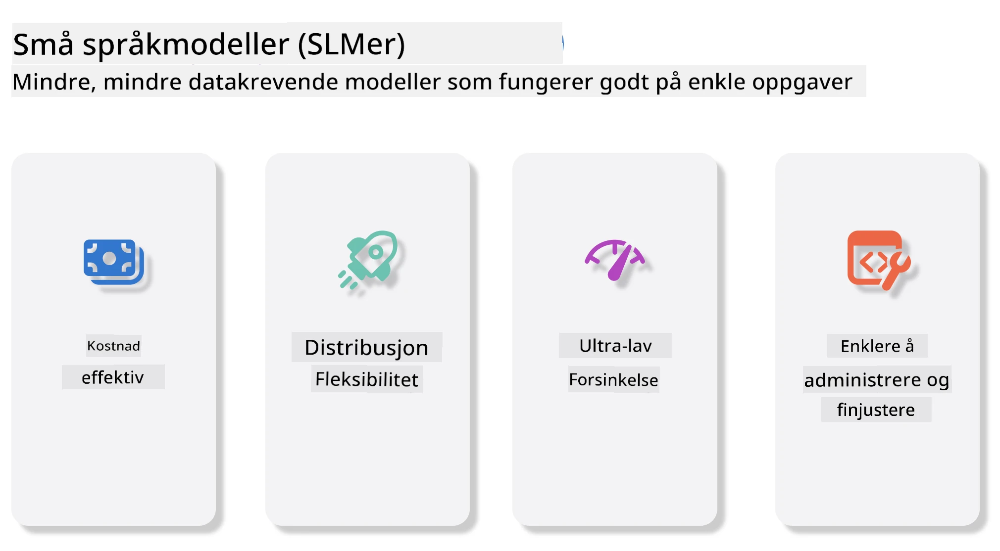
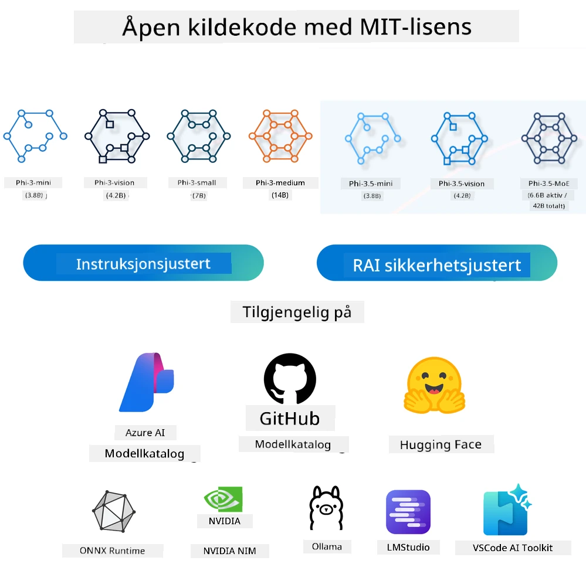
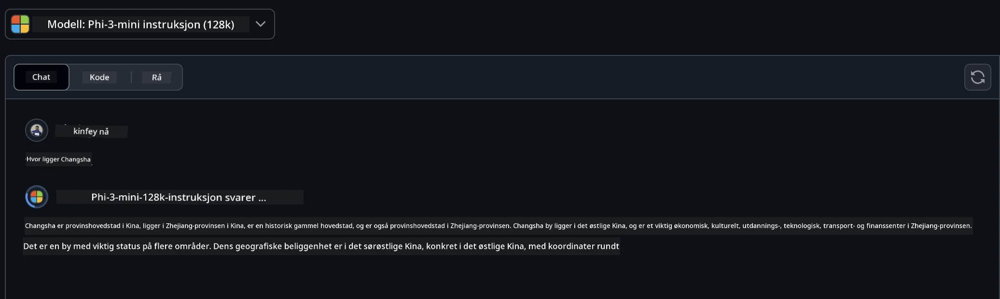
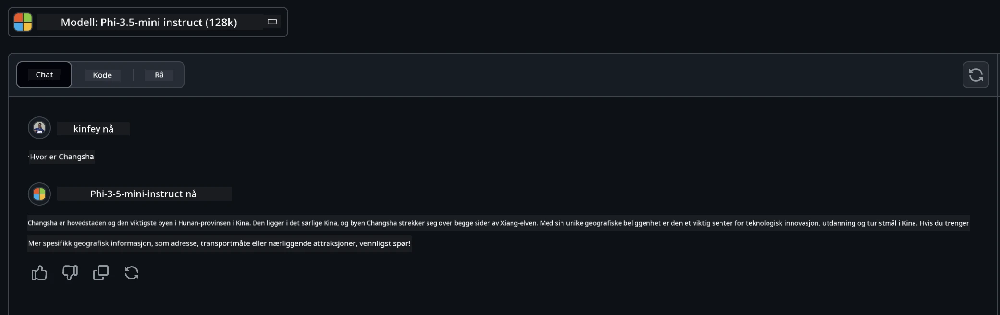

# Introduksjon til Små Språkmodeller for Generativ AI for Nybegynnere
Generativ AI er et fascinerende felt innen kunstig intelligens som fokuserer på å lage systemer som kan skape nytt innhold. Dette innholdet kan variere fra tekst og bilder til musikk og til og med hele virtuelle miljøer. En av de mest spennende anvendelsene av generativ AI er innenfor språkmodeller.

## Hva er Små Språkmodeller?

En liten språkmodell (SLM) representerer en nedskalert variant av en stor språkmodell (LLM), som utnytter mange av de arkitektoniske prinsippene og teknikkene til LLM-er, samtidig som den har et betydelig redusert beregningsavtrykk.

SLM-er er en undergruppe av språkmodeller designet for å generere menneskelignende tekst. I motsetning til sine større motparter, som GPT-4, er SLM-er mer kompakte og effektive, noe som gjør dem ideelle for applikasjoner der beregningsressurser er begrensede. Til tross for sin mindre størrelse kan de fortsatt utføre en rekke oppgaver. Vanligvis konstrueres SLM-er ved å komprimere eller destillere LLM-er, med mål om å beholde en betydelig del av den opprinnelige modellens funksjonalitet og språklige evner. Denne reduksjonen i modellstørrelse reduserer den totale kompleksiteten, noe som gjør SLM-er mer effektive både med hensyn til minnebruk og beregningskrav. Til tross for disse optimaliseringene kan SLM-er fortsatt utføre et bredt spekter av oppgaver innen naturlig språkprosessering (NLP):

- Tekstgenerering: Lage koherente og kontekstuelt relevante setninger eller avsnitt.
- Tekstfullføring: Forutsi og fullføre setninger basert på en gitt prompt.
- Oversettelse: Konvertere tekst fra ett språk til et annet.
- Sammendrag: Forkorte lange tekster til kortere, mer fordøyelige sammendrag.

Selv om det innebærer noen kompromisser i ytelse eller dybde av forståelse sammenlignet med deres større motparter.

## Hvordan fungerer Små Språkmodeller?
SLM-er trenes på enorme mengder tekstdata. Under treningen lærer de mønstrene og strukturene i språket, noe som gjør det mulig for dem å generere tekst som både er grammatisk korrekt og kontekstuelt passende. Treningsprosessen innebærer:

- Datainnsamling: Samle store datasett av tekst fra ulike kilder.
- Forbehandling: Rense og organisere dataene for å gjøre dem egnet for trening.
- Trening: Bruke maskinlæringsalgoritmer for å lære modellen å forstå og generere tekst.
- Finjustering: Justere modellen for å forbedre ytelsen på spesifikke oppgaver.

Utviklingen av SLM-er samsvarer med det økende behovet for modeller som kan distribueres i ressursbegrensede miljøer, slik som mobile enheter eller edge computing-plattformer, hvor fullskala LLM-er kan være upraktiske på grunn av deres store ressursbehov. Ved å fokusere på effektivitet balanserer SLM-er ytelse med tilgjengelighet, noe som muliggjør bredere anvendelse på tvers av ulike områder.



## Læringsmål

I denne leksjonen håper vi å introdusere kunnskapen om SLM og kombinere det med Microsoft Phi-3 for å lære forskjellige scenarier innen tekstinnhold, syn og MoE.

Ved slutten av denne leksjonen bør du kunne svare på følgende spørsmål:

- Hva er SLM?
- Hva er forskjellen mellom SLM og LLM?
- Hva er Microsoft Phi-3/3.5-familien?
- Hvordan kjøre inferens med Microsoft Phi-3/3.5-familien?

Klar? La oss komme i gang.

## Forskjellene mellom Store Språkmodeller (LLMs) og Små Språkmodeller (SLMs)

Både LLM-er og SLM-er bygger på grunnleggende prinsipper innen sannsynlighetsbasert maskinlæring, og følger lignende tilnærminger i deres arkitektoniske design, treningsmetodikker, datagenereringsprosesser og modelevalueringsmetoder. Imidlertid skiller flere nøkkelfaktorer disse to modelltypene.

## Anvendelser av Små Språkmodeller

SLM-er har et bredt spekter av anvendelser, inkludert:

- Chatboter: Gi kundestøtte og engasjere brukere i samtaler.
- Innholdsskaping: Assistere skribenter ved å generere ideer eller til og med utarbeide hele artikler.
- Utdanning: Hjelpe elever med skriveoppgaver eller lære nye språk.
- Tilgjengelighet: Lage verktøy for personer med funksjonsnedsettelser, som tekst-til-tale-systemer.

**Størrelse**

En hovedforskjell mellom LLM-er og SLM-er ligger i modellens skala. LLM-er, som ChatGPT (GPT-4), kan ha anslagsvis 1,76 billioner parametere, mens åpne SLM-er som Mistral 7B er designet med betydelig færre parametere — omtrent 7 milliarder. Denne forskjellen skyldes hovedsakelig ulikheter i modellarkitektur og treningsprosesser. For eksempel benytter ChatGPT en selvoppmerksomhetsmekanisme innenfor en encoder-decoder-rammeverk, mens Mistral 7B bruker sliding window attention, som muliggjør mer effektiv trening innen en decoder-only-modell. Denne arkitektoniske variasjonen har dype implikasjoner for modellens kompleksitet og ytelse.

**Forståelse**

SLM-er er vanligvis optimalisert for ytelse innen spesifikke domener, noe som gjør dem høyt spesialiserte, men potensielt begrenset i evnen til å gi bred kontekstuell forståelse på tvers av flere kunnskapsfelt. I motsetning sikter LLM-er mot å simulere menneskelignende intelligens på et mer omfattende nivå. Trenet på enorme, mangfoldige datasett, er LLM-er designet for å prestere godt på tvers av ulike domener, og tilbyr større allsidighet og tilpasningsevne. Følgelig er LLM-er mer egnet for et bredere spekter av etterfølgende oppgaver, slik som naturlig språkprosessering og programmering.

**Beregning**

Treningen og distribusjonen av LLM-er er ressurskrevende prosesser, som ofte krever betydelig beregningsinfrastruktur, inkludert storskala GPU-klynger. For eksempel kan trening av en modell som ChatGPT fra bunnen av kreve tusenvis av GPU-er over lengre tid. I kontrast er SLM-er, med sitt mindre antall parametere, mer tilgjengelige med hensyn til beregningsressurser. Modeller som Mistral 7B kan trenes og kjøres på lokale maskiner utstyrt med moderate GPU-kapasiteter, selv om treningen fortsatt krever flere timer på flere GPU-er.

**Bias**

Bias er et kjent problem i LLM-er, hovedsakelig på grunn av arten av treningsdataene. Disse modellene er ofte basert på rå, åpent tilgjengelige data fra internett, som kan underrepresentere eller feile å representere visse grupper, innføre feilaktig merking, eller reflektere språklige skjevheter påvirket av dialekt, geografiske variasjoner og grammatiske regler. I tillegg kan kompleksiteten i LLM-arkitekturer utilsiktet forsterke bias, noe som kan gå ubemerket uten nøye finjustering. På den annen side, SLM-er, som trenes på mer avgrensede, domenespesifikke datasett, er i utgangspunktet mindre utsatt for slike skjevheter, selv om de ikke er immune.

**Inferens**

Den reduserte størrelsen på SLM-er gir dem en betydelig fordel når det gjelder inferenshastighet, noe som gjør dem i stand til å generere output effektivt på lokal maskinvare uten behov for omfattende parallell prosessering. I motsetning krever LLM-er, på grunn av størrelse og kompleksitet, ofte betydelige parallelle beregningsressurser for å oppnå akseptable inferenstider. Tilstedeværelsen av mange samtidige brukere senker også responstidene til LLM-er, spesielt ved distribusjon i stor skala.

Sammenfattende, mens både LLM-er og SLM-er har en grunnleggende maskinlæringsbase, skiller de seg betydelig når det gjelder modellstørrelse, ressursbehov, kontekstforståelse, sårbarhet for bias og inferenshastighet. Disse forskjellene reflekterer deres respektive egnethet for ulike bruksområder, hvor LLM-er er mer alsidige, men ressurskrevende, og SLM-er tilbyr mer domene-spesifikk effektivitet med redusert beregningsbehov.

***Merk: I denne leksjonen vil vi introdusere SLM ved bruk av Microsoft Phi-3 / 3.5 som eksempel.***

## Introduksjon til Phi-3 / Phi-3.5-familien

Phi-3 / 3.5-familien retter seg hovedsakelig mot tekst-, syns- og agent (MoE) applikasjonsscenarier:

### Phi-3 / 3.5 Instruct

Hovedsakelig for tekstgenerering, chat-fullføring og innholdsinformasjonsekstraksjon osv.

**Phi-3-mini**

Den 3,8 milliarder parametermodellen er tilgjengelig på Microsoft Azure AI Studio, Hugging Face og Ollama. Phi-3-modeller prestere betydelig bedre enn språkmodeller av lik og større størrelse på nøkkelbenchmarks (se benchmark-tall nedenfor, høyere tall er bedre). Phi-3-mini overgår modeller som er dobbelt så store, mens Phi-3-small og Phi-3-medium overgår større modeller, inkludert GPT-3.5.

**Phi-3-small & medium**

Med bare 7 milliarder parametere slår Phi-3-small GPT-3.5T på en rekke språk-, resonerings-, koding- og mattebenchmarks.

Phi-3-medium med 14 milliarder parametere fortsetter denne trenden og overgår Gemini 1.0 Pro.

**Phi-3.5-mini**

Vi kan se den som en oppgradering av Phi-3-mini. Selv om parameterne forblir uendret, forbedrer den evnen til å støtte flere språk (støtter 20+ språk: arabisk, kinesisk, tsjekkisk, dansk, nederlandsk, engelsk, finsk, fransk, tysk, hebraisk, ungarsk, italiensk, japansk, koreansk, norsk, polsk, portugisisk, russisk, spansk, svensk, thai, tyrkisk, ukrainsk) og legger til sterkere støtte for lang kontekst.

Phi-3.5-mini med 3,8 milliarder parametere overgår språkmodeller av samme størrelse og er på nivå med modeller dobbelt så store.

### Phi-3 / 3.5 Vision

Vi kan se på Instruct-modellen til Phi-3/3.5 som Phis evne til å forstå, og Vision er hva som gir Phi øyne til å forstå verden.

**Phi-3-Vision**

Phi-3-vision, med bare 4,2 milliarder parametere, fortsetter denne trenden og overgår større modeller som Claude-3 Haiku og Gemini 1.0 Pro V på generelle visuelle resonneringsoppgaver, OCR, samt tabell- og diagramforståelsesoppgaver.

**Phi-3.5-Vision**

Phi-3.5-Vision er også en oppgradering av Phi-3-Vision, og legger til støtte for flere bilder. Du kan tenke på det som en forbedring innen syn; nå kan du ikke bare se bilder, men også videoer.

Phi-3.5-vision overgår større modeller som Claude-3.5 Sonnet og Gemini 1.5 Flash på OCR, tabell- og diagramforståelsesoppgaver, og er på nivå på generelle visuelle kunnskapsresonneringsoppgaver. Støtter input med flere rammer, altså utfører resonnement på flere inputbilder.

### Phi-3.5-MoE

***Mixture of Experts (MoE)*** gjør det mulig for modeller å forhåndstrenes med langt mindre beregningskraft, noe som betyr at du dramatisk kan skalere opp modell- eller datasettstørrelsen med samme beregningsbudsjett som en tett modell. Spesielt bør en MoE-modell oppnå samme kvalitet som sin tette motpart mye raskere under forhåndstrening.

Phi-3.5-MoE består av 16x3,8 milliarder ekspertmoduler. Phi-3.5-MoE med bare 6,6 milliarder aktive parametere når et lignende nivå av resonnement, språkforståelse og matematikk som mye større modeller.

Vi kan bruke Phi-3 / 3.5-familien basert på ulike scenarier. I motsetning til LLM, kan du distribuere Phi-3 / 3.5-mini eller Phi-3 / 3.5-Vision på edge-enheter.

## Hvordan bruke Phi-3/3.5-familie-modeller

Vi håper å bruke Phi-3 / 3.5 i forskjellige scenarioer. Neste vil vi bruke Phi-3 / 3.5 basert på ulike scenarioer.



### Inferens via Sky-APIer

**GitHub Modeller**

GitHub Modeller er den mest direkte måten. Du kan raskt få tilgang til Phi-3/3.5-Instruct-modellen gjennom GitHub Modeller. Kombinert med Azure AI Inference SDK / OpenAI SDK kan du få tilgang til API-et via kode for å fullføre Phi-3/3.5-Instruct-kall. Du kan også teste ulike effekter gjennom Playground.

- Demo: Sammenligning av effektene av Phi-3-mini og Phi-3.5-mini i kinesiske scenarioer






**Azure AI Studio**

Eller hvis vi ønsker å bruke syns- og MoE-modellene, kan du bruke Azure AI Studio for å fullføre kallene. Hvis du er interessert, kan du lese Phi-3 Cookbook for å lære hvordan du kaller Phi-3/3.5 Instruct, Vision, MoE via Azure AI Studio [Klikk denne linken](https://github.com/microsoft/Phi-3CookBook/blob/main/md/02.QuickStart/AzureAIStudio_QuickStart.md?WT.mc_id=academic-105485-koreyst)

**NVIDIA NIM**

I tillegg til skybaserte Model Catalog-løsninger levert av Azure og GitHub, kan du også bruke [NVIDIA NIM](https://developer.nvidia.com/nim?WT.mc_id=academic-105485-koreyst) for å fullføre relaterte kall. Du kan besøke NVIDIA NIM for å fullføre API-kallene for Phi-3/3.5-familien. NVIDIA NIM (NVIDIA Inference Microservices) er et sett med akselererte inferens-mikrotjenester designet for å hjelpe utviklere med å distribuere AI-modeller effektivt på tvers av ulike miljøer, inkludert skyer, datasentre og arbeidsstasjoner.

Her er noen hovedfunksjoner i NVIDIA NIM:
- **Enkel distribusjon:** NIM tillater distribusjon av AI-modeller med en enkelt kommando, noe som gjør det enkelt å integrere i eksisterende arbeidsflyter.
- **Optimalisert ytelse:** Det utnytter NVIDIAs forhåndsoptimaliserte inferensmotorer, som TensorRT og TensorRT-LLM, for å sikre lav ventetid og høy gjennomstrømning.
- **Skalerbarhet:** NIM støtter autoskalering på Kubernetes, noe som gjør det i stand til å håndtere varierende arbeidsmengder effektivt.
- **Sikkerhet og kontroll:** Organisasjoner kan beholde kontrollen over sine data og applikasjoner ved å selvhoste NIM-mikrotjenester på egen administrert infrastruktur.
- **Standard API-er:** NIM tilbyr industristandard API-er, noe som gjør det enkelt å bygge og integrere AI-applikasjoner som chatboter, AI-assistenter og mer.

NIM er en del av NVIDIA AI Enterprise, som har som mål å forenkle distribusjon og drift av AI-modeller, og sikre effektiv drift på NVIDIA GPU-er.

- Demo: Bruke NVIDIA NIM til å kalle Phi-3.5-Vision-API [[Klikk denne lenken](./python/Phi-3-Vision-Nividia-NIM.ipynb?WT.mc_id=academic-105485-koreyst)]


### Kjøre Phi-3/3.5 lokalt
Inferens i forhold til Phi-3, eller en hvilken som helst språkmodell som GPT-3, refererer til prosessen med å generere svar eller prediksjoner basert på innholdet den mottar. Når du gir en prompt eller spørsmål til Phi-3, bruker den sitt trente nevrale nettverk for å utlede det mest sannsynlige og relevante svaret ved å analysere mønstre og relasjoner i dataene den er trent på.

**Hugging Face Transformer**  
Hugging Face Transformers er et kraftig bibliotek designet for naturlig språkbehandling (NLP) og andre maskinlæringsoppgaver. Her er noen viktige punkter om det:

1. **Fortrente modeller:** Det tilbyr tusenvis av forhåndstrente modeller som kan brukes til forskjellige oppgaver som tekstklassifisering, navngitt enhetsgjenkjenning, spørsmålssvar, oppsummering, oversettelse og tekstgenerering.

2. **Rammeverkinteroperabilitet:** Biblioteket støtter flere dype læringsrammeverk, inkludert PyTorch, TensorFlow og JAX. Dette lar deg trene en modell i ett rammeverk og bruke den i et annet.

3. **Multimodale muligheter:** I tillegg til NLP støtter Hugging Face Transformers også oppgaver innen datavisjon (f.eks. bildeklassifisering, objektdeteksjon) og lydbehandling (f.eks. talegjenkjenning, lydklassifisering).

4. **Enkel å bruke:** Biblioteket tilbyr API-er og verktøy for å enkelt laste ned og finjustere modeller, noe som gjør det tilgjengelig for både nybegynnere og eksperter.

5. **Fellesskap og ressurser:** Hugging Face har et levende fellesskap og omfattende dokumentasjon, veiledninger og guider for å hjelpe brukere i gang og få mest mulig ut av biblioteket. [offisiell dokumentasjon](https://huggingface.co/docs/transformers/index?WT.mc_id=academic-105485-koreyst) eller deres [GitHub-repo](https://github.com/huggingface/transformers?WT.mc_id=academic-105485-koreyst).

Dette er den mest brukte metoden, men den krever også GPU-akselerasjon. Scenarier som Vision og MoE krever mye beregninger, som vil være veldig tregt på CPU hvis de ikke er kvantisert.


- Demo: Bruke Transformer til å kalle Phi-3.5-Instruct [Klikk denne lenken](./python/phi35-instruct-demo.ipynb?WT.mc_id=academic-105485-koreyst)

- Demo: Bruke Transformer til å kalle Phi-3.5-Vision [Klikk denne lenken](./python/phi35-vision-demo.ipynb?WT.mc_id=academic-105485-koreyst)

- Demo: Bruke Transformer til å kalle Phi-3.5-MoE [Klikk denne lenken](./python/phi35_moe_demo.ipynb?WT.mc_id=academic-105485-koreyst)

**Ollama**  
[Ollama](https://ollama.com/?WT.mc_id=academic-105485-koreyst) er en plattform designet for å gjøre det enklere å kjøre store språkmodeller (LLM) lokalt på maskinen din. Den støtter ulike modeller som Llama 3.1, Phi 3, Mistral og Gemma 2, blant andre. Plattformen forenkler prosessen ved å pakke modellvekter, konfigurasjon og data i ett enkelt pakke, noe som gjør det mer tilgjengelig for brukere å tilpasse og lage egne modeller. Ollama er tilgjengelig for macOS, Linux og Windows. Det er et flott verktøy hvis du ønsker å eksperimentere med eller distribuere LLM uten å være avhengig av skytjenester. Ollama er den mest direkte måten, du trenger bare å kjøre følgende kommando.

```bash

ollama run phi3.5

```


**ONNX Runtime for GenAI**

[ONNX Runtime](https://github.com/microsoft/onnxruntime-genai?WT.mc_id=academic-105485-koreyst) er en plattformuavhengig akselerator for inferens og trening av maskinlæring. ONNX Runtime for Generative AI (GENAI) er et kraftig verktøy som hjelper deg å kjøre generative AI-modeller effektivt på tvers av ulike plattformer.

## Hva er ONNX Runtime?
ONNX Runtime er et åpen kildekode-prosjekt som muliggjør høypresterende inferens av maskinlæringsmodeller. Den støtter modeller i Open Neural Network Exchange (ONNX)-format, som er en standard for representasjon av maskinlæringsmodeller. ONNX Runtime-inferens kan gi raskere kundeopplevelser og lavere kostnader, og støtter modeller fra dype læringsrammeverk som PyTorch og TensorFlow/Keras samt klassiske maskinlæringsbiblioteker som scikit-learn, LightGBM, XGBoost osv. ONNX Runtime er kompatibel med ulik maskinvare, drivere og operativsystemer, og gir optimal ytelse ved å utnytte maskinvareakseleratorer der det er aktuelt, sammen med grafoptimaliseringer og transformasjoner.

## Hva er Generativ AI?
Generativ AI refererer til AI-systemer som kan generere nytt innhold, som tekst, bilder eller musikk, basert på dataene de er trent på. Eksempler inkluderer språkmodeller som GPT-3 og bilde-genereringsmodeller som Stable Diffusion. ONNX Runtime for GenAI-biblioteket tilbyr løkken for generativ AI for ONNX-modeller, inkludert inferens med ONNX Runtime, logitsbehandling, søk og sampling, samt KV cache-administrasjon.

## ONNX Runtime for GENAI
ONNX Runtime for GENAI utvider funksjonalitetene i ONNX Runtime for å støtte generative AI-modeller. Her er noen viktige funksjoner:

- **Bred plattformstøtte:** Den fungerer på flere plattformer, inkludert Windows, Linux, macOS, Android og iOS.
- **Modellstøtte:** Den støtter mange populære generative AI-modeller, som LLaMA, GPT-Neo, BLOOM og flere.
- **Ytelsesoptimalisering:** Den inkluderer optimaliseringer for ulike maskinvareakseleratorer som NVIDIA GPU-er, AMD GPU-er og flere.
- **Enkel å bruke:** Den tilbyr API-er for enkel integrering i applikasjoner, slik at du kan generere tekst, bilder og annet innhold med minimal kode.
- Brukere kan kalle en høynivå generate()-metode, eller kjøre hver iterasjon av modellen i en løkke, generere ett token av gangen, og eventuelt oppdatere generasjonsparametere inne i løkken.
- ONNX runtime har også støtte for greedy/beam search og TopP, TopK-sampling for å generere tokensekvenser og innebygd logitsbehandling som repetisjonsstraff. Du kan også enkelt legge til egendefinert skåring.

## Komme i gang
For å komme i gang med ONNX Runtime for GENAI, kan du følge disse trinnene:

### Installer ONNX Runtime:
```Python
pip install onnxruntime
```
### Installer Generative AI Extensions:
```Python
pip install onnxruntime-genai
```

### Kjør en modell: Her er et enkelt eksempel i Python:
```Python
import onnxruntime_genai as og

model = og.Model('path_to_your_model.onnx')

tokenizer = og.Tokenizer(model)

input_text = "Hello, how are you?"

input_tokens = tokenizer.encode(input_text)

output_tokens = model.generate(input_tokens)

output_text = tokenizer.decode(output_tokens)

print(output_text) 
```
### Demo: Bruke ONNX Runtime GenAI til å kalle Phi-3.5-Vision


```python

import onnxruntime_genai as og

model_path = './Your Phi-3.5-vision-instruct ONNX Path'

img_path = './Your Image Path'

model = og.Model(model_path)

processor = model.create_multimodal_processor()

tokenizer_stream = processor.create_stream()

text = "Your Prompt"

prompt = "<|user|>\n"

prompt += "<|image_1|>\n"

prompt += f"{text}<|end|>\n"

prompt += "<|assistant|>\n"

image = og.Images.open(img_path)

inputs = processor(prompt, images=image)

params = og.GeneratorParams(model)

params.set_inputs(inputs)

params.set_search_options(max_length=3072)

generator = og.Generator(model, params)

while not generator.is_done():

    generator.compute_logits()
    
    generator.generate_next_token()

    new_token = generator.get_next_tokens()[0]
    
    output = tokenizer_stream.decode(new_token)
    
    print(tokenizer_stream.decode(new_token), end='', flush=True)

```


**Andre**

I tillegg til ONNX Runtime og Ollama referansemetoder kan vi også komplettere referansen for kvantitative modeller basert på modellreferansemetodene levert av forskjellige produsenter. Som Apple MLX-rammeverket med Apple Metal, Qualcomm QNN med NPU, Intel OpenVINO med CPU/GPU osv. Du kan også finne mer innhold i [Phi-3 Cookbook](https://github.com/microsoft/phi-3cookbook?WT.mc_id=academic-105485-koreyst)


## Mer

Vi har lært grunnleggende om Phi-3/3.5-familien, men for å lære mer om SLM trenger vi mer kunnskap. Du kan finne svarene i Phi-3 Cookbook. Hvis du vil lære mer, vennligst besøk [Phi-3 Cookbook](https://github.com/microsoft/phi-3cookbook?WT.mc_id=academic-105485-koreyst).

---

<!-- CO-OP TRANSLATOR DISCLAIMER START -->
**Ansvarsfraskrivelse**:  
Dette dokumentet er oversatt ved bruk av AI-oversettelsestjenesten [Co-op Translator](https://github.com/Azure/co-op-translator). Selv om vi streber etter nøyaktighet, vennligst vær oppmerksom på at automatiske oversettelser kan inneholde feil eller unøyaktigheter. Det opprinnelige dokumentet på sitt opprinnelige språk bør anses som den autoritative kilden. For kritisk informasjon anbefales profesjonell menneskelig oversettelse. Vi er ikke ansvarlige for misforståelser eller feiltolkninger som oppstår ved bruk av denne oversettelsen.
<!-- CO-OP TRANSLATOR DISCLAIMER END -->